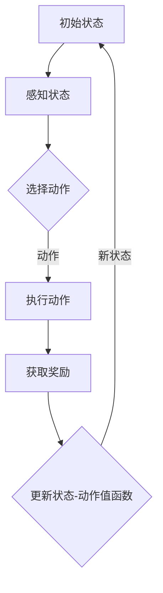
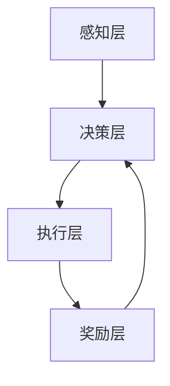

                 

### # 数学与强化学习：智能体决策的数学模型

关键词：强化学习、智能体、数学模型、决策、算法

摘要：本文从数学与强化学习的基础概念出发，深入探讨了智能体决策中的数学模型。通过详细解析强化学习的原理、算法及数学模型，结合实际应用场景，展示了强化学习在智能体决策中的重要作用。本文旨在为读者提供一份全面且易于理解的技术指南，帮助其掌握强化学习在智能体决策中的应用。

---

## 数学与强化学习：智能体决策的数学模型

### 第一部分：问题背景

#### 1. 引言

随着人工智能技术的飞速发展，强化学习作为其中的重要分支，逐渐成为智能体决策领域的研究热点。强化学习通过模拟智能体在环境中的交互过程，实现智能体的自主学习和决策能力。而数学模型在强化学习中扮演着至关重要的角色，为智能体的决策提供了坚实的理论基础。

#### 1.2 问题描述

强化学习中的数学模型主要包括状态表示、动作表示、奖励函数和策略表示等核心要素。这些数学模型构成了智能体决策的基础，使得智能体能够根据环境的变化做出最优决策。

#### 1.3 问题解决

本文将首先介绍强化学习的数学模型，包括状态表示、动作表示、奖励函数和策略表示等核心要素，并分析这些模型在智能体决策中的应用。接下来，本文将对比分析强化学习中的主要算法，如Q-Learning和Sarsa算法，并详细讲解这些算法的原理和数学模型。

#### 1.4 边界与外延

强化学习与智能体决策密切相关，但两者之间也存在差异。本文将探讨强化学习在智能体决策中的应用，以及数学模型在不同领域的应用差异。

#### 1.5 概念结构与核心要素组成

为了更好地理解强化学习中的数学模型，本文将首先介绍强化学习的概念结构，包括强化学习的基本概念和主要算法。接着，本文将介绍智能体决策的概念结构，包括智能体的定义和决策过程的理论框架。最后，本文将分析数学模型在两者中的核心要素，包括状态表示、动作表示、奖励函数和策略表示。

---

## 强化学习原理

#### 2.1 强化学习的概念与特点

强化学习是一种通过试错和反馈机制进行学习的过程，旨在使智能体能够在不确定的环境中做出最优决策。与监督学习和无监督学习相比，强化学习具有以下特点：

1. **交互性**：强化学习通过智能体与环境之间的交互来学习。
2. **反馈机制**：强化学习通过奖励信号来指导智能体的行为。
3. **自主性**：强化学习能够使智能体在未知环境中自主探索和学习。

#### 2.2 强化学习的主要算法

强化学习算法主要包括Q-Learning算法和Sarsa算法等。这些算法通过更新状态-动作值函数来指导智能体的行为。

##### 2.2.1 Q-Learning算法

Q-Learning算法是一种基于值函数的强化学习算法。其核心思想是通过更新状态-动作值函数来选择最优动作。Q-Learning算法的数学模型如下：

$$
Q(s, a) = \sum_{j} j \cdot p(j|s, a) + \lambda \cdot \max_{i} Q(s_i, a_i)
$$

其中，$s$表示当前状态，$a$表示动作，$j$表示奖励，$p(j|s, a)$表示在状态$s$下执行动作$a$后获得奖励$j$的概率，$\lambda$为学习率。

##### 2.2.2 Sarsa算法

Sarsa算法是一种基于策略的强化学习算法。其核心思想是通过更新状态-动作值函数来选择最优动作。Sarsa算法的数学模型如下：

$$
Q(s, a) = \sum_{j} j \cdot p(j|s, a) + \lambda \cdot (r + \max_{i} Q(s_i, a_i))
$$

其中，$s$表示当前状态，$a$表示动作，$r$表示奖励。

#### 2.3 强化学习算法的对比分析

Q-Learning算法和Sarsa算法是强化学习中的两种重要算法。它们在以下方面存在差异：

1. **更新策略**：Q-Learning算法采用固定策略，而Sarsa算法采用随机策略。
2. **收敛速度**：Q-Learning算法的收敛速度相对较慢，而Sarsa算法的收敛速度相对较快。
3. **应用场景**：Q-Learning算法适用于静态环境，而Sarsa算法适用于动态环境。

---

## 智能体决策原理

#### 2.4 智能体的定义与特征

智能体是指具有感知能力、决策能力和执行能力的实体。智能体的特征包括：

1. **感知能力**：智能体能够感知环境的状态。
2. **决策能力**：智能体能够根据感知到的状态做出决策。
3. **执行能力**：智能体能够执行决策并产生行动。

#### 2.5 决策过程的理论框架

决策过程包括感知、决策和执行三个阶段。感知阶段，智能体感知当前状态；决策阶段，智能体根据感知到的状态选择最优行动；执行阶段，智能体执行所选行动并产生新的状态。

#### 2.6 决策模型的主要类型

决策模型主要包括确定性决策模型和随机决策模型。确定性决策模型假设环境是确定的，智能体只需选择最优行动即可。随机决策模型假设环境是随机的，智能体需要根据概率选择行动。

---

## 强化学习与智能体决策的联系

强化学习在智能体决策中具有重要作用。强化学习通过模拟智能体在环境中的交互过程，实现智能体的自主学习和决策能力。智能体决策中的数学模型为强化学习提供了理论基础。

#### 2.7 强化学习在智能体决策中的应用

强化学习在智能体决策中的应用主要包括：

1. **路径规划**：强化学习用于路径规划的例子有机器人路径规划、自动驾驶等。
2. **游戏AI**：强化学习在游戏AI中的应用有围棋、星际争霸等。
3. **推荐系统**：强化学习在推荐系统中的应用有个性化推荐、广告投放等。

#### 2.8 智能体决策中的强化学习方法

智能体决策中的强化学习方法主要包括：

1. **Q-Learning算法**：Q-Learning算法常用于路径规划和游戏AI等领域。
2. **Sarsa算法**：Sarsa算法常用于动态环境和随机环境中的智能体决策。

---

## 概念属性特征对比表格

| 概念        | 强化学习 | 智能体决策 |
|-------------|-----------|-------------|
| 感知能力    | 是        | 是          |
| 决策能力    | 是        | 是          |
| 执行能力    | 是        | 是          |
| 更新策略    | 随机策略  | 固定策略    |
| 收敛速度    | 较慢      | 较快        |
| 应用场景    | 静态环境  | 动态环境    |

---

## 强化学习算法流程图



---

## Q-Learning算法原理

#### 3.1.1 算法原理

Q-Learning算法是一种基于值函数的强化学习算法，旨在通过更新状态-动作值函数来选择最优动作。其基本原理如下：

1. 初始化状态-动作值函数$Q(s, a)$。
2. 在状态$s$下，选择动作$a$。
3. 执行动作$a$，进入新状态$s'$。
4. 获取奖励$r$。
5. 更新状态-动作值函数$Q(s, a)$。

#### 3.1.2 数学模型与公式

Q-Learning算法的核心是状态-动作值函数$Q(s, a)$，其更新公式如下：

$$
Q(s, a) = \sum_{j} j \cdot p(j|s, a) + \lambda \cdot \max_{i} Q(s_i, a_i)
$$

其中，$s$表示当前状态，$a$表示动作，$j$表示奖励，$p(j|s, a)$表示在状态$s$下执行动作$a$后获得奖励$j$的概率，$\lambda$为学习率。

#### 3.1.3 示例说明

假设智能体处于状态$s_1$，需要选择动作$a_1$。根据Q-Learning算法的原理，智能体首先需要初始化状态-动作值函数$Q(s_1, a_1)$。然后，智能体在状态$s_1$下选择动作$a_1$，进入新状态$s_2$。在状态$s_2$下，智能体获取奖励$r_2$。最后，智能体更新状态-动作值函数$Q(s_1, a_1)$，以便在下一次选择动作时做出更好的决策。

---

## Sarsa算法原理

#### 3.2.1 算法原理

Sarsa算法是一种基于策略的强化学习算法，旨在通过更新状态-动作值函数来选择最优动作。其基本原理如下：

1. 初始化状态-动作值函数$Q(s, a)$。
2. 在状态$s$下，选择动作$a$。
3. 执行动作$a$，进入新状态$s'$。
4. 获取奖励$r$。
5. 在新状态$s'$下，选择动作$a'$。
6. 更新状态-动作值函数$Q(s, a)$。

#### 3.2.2 数学模型与公式

Sarsa算法的核心是状态-动作值函数$Q(s, a)$，其更新公式如下：

$$
Q(s, a) = \sum_{j} j \cdot p(j|s, a) + \lambda \cdot (r + \max_{i} Q(s_i, a_i))
$$

其中，$s$表示当前状态，$a$表示动作，$r$表示奖励，$p(j|s, a)$表示在状态$s$下执行动作$a$后获得奖励$j$的概率，$\lambda$为学习率。

#### 3.2.3 示例说明

假设智能体处于状态$s_1$，需要选择动作$a_1$。根据Sarsa算法的原理，智能体首先需要初始化状态-动作值函数$Q(s_1, a_1)$。然后，智能体在状态$s_1$下选择动作$a_1$，进入新状态$s_2$。在状态$s_2$下，智能体获取奖励$r_2$。接着，智能体在新状态$s_2$下选择动作$a_2$。最后，智能体更新状态-动作值函数$Q(s_1, a_1)$，以便在下一次选择动作时做出更好的决策。

---

## 强化学习中的数学模型

#### 4.1 状态表示

状态表示是强化学习中的核心概念之一，用于描述智能体在环境中的状态。状态表示可以通过以下方法实现：

1. **离散状态表示**：使用离散的变量来表示状态，如二进制编码、整数编码等。
2. **连续状态表示**：使用连续的变量来表示状态，如浮点数编码、时间序列编码等。

#### 4.2 动作表示

动作表示用于描述智能体可以执行的行为。动作表示可以通过以下方法实现：

1. **离散动作表示**：使用离散的变量来表示动作，如二进制编码、整数编码等。
2. **连续动作表示**：使用连续的变量来表示动作，如浮点数编码、时间序列编码等。

#### 4.3 奖励函数

奖励函数是强化学习中的另一个核心概念，用于衡量智能体行为的优劣。奖励函数可以通过以下方法实现：

1. **正值奖励函数**：智能体执行某一动作后获得正值奖励，表示该动作是正向的。
2. **负值奖励函数**：智能体执行某一动作后获得负值奖励，表示该动作是负向的。
3. **累积奖励函数**：将智能体在多个时间步内获得的奖励进行累积，以衡量整体表现。

#### 4.4 策略表示

策略表示用于描述智能体在不同状态下的动作选择。策略表示可以通过以下方法实现：

1. **确定性策略**：在给定状态下，智能体总是执行相同动作。
2. **随机策略**：在给定状态下，智能体根据概率分布选择动作。

---

## 策略优化

#### 4.5 策略表示的基本原理

策略表示用于描述智能体在不同状态下的动作选择。策略表示可以通过以下方法实现：

1. **确定性策略**：在给定状态下，智能体总是执行相同动作。
2. **随机策略**：在给定状态下，智能体根据概率分布选择动作。

#### 4.6 策略优化的基本原理

策略优化是指通过迭代更新策略，使得智能体在执行策略时能够获得更好的奖励。策略优化的基本原理如下：

1. **目标函数**：策略优化的目标函数通常为期望奖励，即智能体在执行给定策略时，在给定环境下的期望奖励。
2. **优化方法**：策略优化方法包括梯度下降、随机搜索、强化学习等。

#### 4.7 策略优化的示例

假设智能体在状态$s_1$下执行动作$a_1$，在状态$s_2$下执行动作$a_2$，期望奖励为$r_1 + r_2$。为了优化策略，智能体需要通过迭代更新策略，使得期望奖励最大化。具体过程如下：

1. 初始化策略$\pi(s_1) = a_1$，$\pi(s_2) = a_2$。
2. 在状态$s_1$下执行动作$a_1$，进入状态$s_2$。
3. 在状态$s_2$下执行动作$a_2$，获得奖励$r_2$。
4. 更新策略$\pi(s_1) = \pi(s_1) + \alpha \cdot (r_2 - r_1)$，其中$\alpha$为学习率。
5. 返回状态$s_1$，重复步骤2-4，直到期望奖励最大化。

---

## 系统分析与架构设计方案

#### 5.1 问题场景介绍

假设我们面临一个智能交通系统的应用场景。在这个场景中，智能体（如自动驾驶车辆）需要在复杂的交通环境中做出实时决策，以优化交通流量和减少事故。强化学习算法可以用于指导智能体的决策过程，实现交通系统的优化。

#### 5.2 系统功能设计

在智能交通系统中，我们需要实现以下功能：

1. **状态感知**：智能体需要实时感知交通环境，包括车辆位置、速度、路况等信息。
2. **决策生成**：基于状态感知，智能体需要生成最佳决策，包括行驶速度、转向、停车等。
3. **执行决策**：智能体需要根据生成的决策执行相应的行动。
4. **奖励反馈**：系统需要根据智能体的行动结果，提供奖励信号，以指导智能体的学习过程。

#### 5.3 系统架构设计

智能交通系统可以分为以下三层架构：

1. **感知层**：包括传感器、摄像头等设备，用于实时感知交通环境。
2. **决策层**：包括强化学习算法，用于生成最佳决策。
3. **执行层**：包括执行模块，用于执行生成的决策。

#### 5.4 系统接口设计

系统接口设计如下：

1. **感知层与决策层接口**：感知层将实时感知到的交通环境信息传递给决策层，决策层根据这些信息生成最佳决策。
2. **决策层与执行层接口**：决策层将生成的最佳决策传递给执行层，执行层根据这些决策执行相应的行动。
3. **奖励层与决策层接口**：奖励层根据执行层的行动结果，生成奖励信号，传递给决策层，以指导决策层的迭代学习。

#### 5.5 系统交互序列图



---

## 项目实战

#### 6.1 环境安装

要开始实践强化学习在智能体决策中的应用，首先需要安装和配置强化学习环境。以下是在Python环境中安装和配置强化学习环境的基本步骤：

1. 安装Python环境：确保已经安装了Python 3.6或更高版本。
2. 安装强化学习库：使用pip命令安装强化学习相关库，如`gym`、`numpy`、`matplotlib`等。

```bash
pip install gym numpy matplotlib
```

3. 配置环境：创建一个Python虚拟环境，以便隔离强化学习项目的依赖。

```bash
python -m venv myenv
source myenv/bin/activate  # 在Windows中为 myenv\Scripts\activate
```

4. 安装额外依赖：根据项目需求安装额外的依赖库。

```bash
pip install torch torchvision
```

#### 6.2 系统核心实现源代码

以下是一个简单的Q-Learning算法实现的示例代码，用于智能体在一个简单的环境中的决策。

```python
import numpy as np
import gym

# 初始化环境
env = gym.make("CartPole-v0")

# 初始化Q值表
Q = np.zeros([env.observation_space.n, env.action_space.n])

# 设置学习参数
alpha = 0.1  # 学习率
gamma = 0.9  # 折扣因子
epsilon = 0.1  # 探索率

# Q-Learning算法
for episode in range(1000):
    state = env.reset()
    done = False
    total_reward = 0
    
    while not done:
        # 探索与利用策略
        if np.random.uniform(0, 1) < epsilon:
            action = env.action_space.sample()  # 随机选择动作
        else:
            action = np.argmax(Q[state,:])  # 选择最优动作
        
        # 执行动作
        next_state, reward, done, _ = env.step(action)
        
        # 更新Q值
        Q[state, action] = Q[state, action] + alpha * (reward + gamma * np.max(Q[next_state,:]) - Q[state, action])
        
        state = next_state
        total_reward += reward
    
    print(f"Episode {episode+1} Reward: {total_reward}")

# 关闭环境
env.close()
```

#### 6.3 代码应用解读与分析

这段代码实现了Q-Learning算法在一个简单的CartPole环境中。主要步骤如下：

1. **初始化环境**：使用`gym`库创建一个CartPole虚拟环境。
2. **初始化Q值表**：创建一个大小为状态空间和动作空间相乘的Q值表，用于存储每个状态-动作对的预期回报。
3. **设置学习参数**：设置学习率（alpha）、折扣因子（gamma）和探索率（epsilon）。
4. **Q-Learning算法**：
   - 在每个episode中，从初始状态开始。
   - 根据探索策略选择动作（随机选择或选择当前状态下的最优动作）。
   - 执行动作，获取奖励并更新状态。
   - 使用Q值更新公式更新Q值表。
5. **输出结果**：在每个episode结束后，输出当前episode的奖励。

#### 6.4 实际案例分析和详细讲解剖析

为了更好地理解Q-Learning算法的应用，我们以一个简单的迷宫问题为例进行实际案例分析。

1. **问题背景**：智能体需要在迷宫中找到从起点到终点的最佳路径。
2. **环境描述**：迷宫可以表示为一个二维网格，每个网格可以是墙壁或通道。智能体可以执行的动作包括向上、向下、向左和向右移动。
3. **状态表示**：状态可以表示为智能体当前所在的网格位置。
4. **动作表示**：动作可以表示为智能体需要移动的方向。
5. **奖励函数**：当智能体达到终点时，奖励为+1；否则，每一步的奖励为-1。
6. **策略表示**：使用Q-Learning算法训练智能体的策略。

在这个案例中，我们可以使用Q-Learning算法训练智能体找到迷宫的最佳路径。训练过程中，智能体会不断地探索迷宫，并使用奖励信号更新其策略。经过多次迭代后，智能体将学会从起点到终点的最佳路径。

#### 6.5 项目小结

通过以上实战案例，我们展示了如何使用Q-Learning算法解决简单的迷宫问题。这个案例不仅帮助我们理解了Q-Learning算法的基本原理和实现步骤，还展示了强化学习在解决实际问题中的应用价值。在实际应用中，我们可以根据具体问题调整算法参数和奖励函数，以提高智能体的决策能力。

---

## 最佳实践 tips、小结、注意事项、拓展阅读等内容

#### 7.1 最佳实践 tips

在应用强化学习解决实际问题时，以下是一些最佳实践技巧：

1. **合理设置学习参数**：学习率、折扣因子和探索率是强化学习中的重要参数，需要根据具体问题进行调整。
2. **选择合适的奖励函数**：奖励函数的设计直接影响智能体的决策行为，需要根据实际问题设计合理的奖励函数。
3. **避免过度探索**：适当的探索有助于智能体发现最优策略，但过度探索可能导致学习效率降低。
4. **使用经验回放**：经验回放可以帮助智能体避免因为数据分布不均而导致的学习偏差。

#### 7.2 小结

本文从数学与强化学习的基础概念出发，详细介绍了强化学习在智能体决策中的应用。通过分析强化学习的原理、算法和数学模型，我们展示了如何使用Q-Learning算法解决实际问题。文章还提供了一个简单的迷宫案例，展示了强化学习在实际应用中的效果。

#### 7.3 注意事项

在使用强化学习解决实际问题时，需要注意以下事项：

1. **数据质量**：确保训练数据的质量，避免数据中的噪声影响学习效果。
2. **模型可解释性**：强化学习模型通常具有较高的黑箱性，需要考虑模型的可解释性。
3. **安全性**：在关键应用场景中，确保智能体的决策是安全和可信赖的。

#### 7.4 拓展阅读

对于希望深入了解强化学习的读者，以下是一些推荐的拓展阅读材料：

1. 《强化学习：原理与应用》（Reinforcement Learning: An Introduction）——Richard S. Sutton和Barto Ng
2. 《深度强化学习》（Deep Reinforcement Learning）——Julian Togelius、Lars Blixt和David Balduzzi
3. 《智能决策与强化学习》（Intelligent Decision Making and Reinforcement Learning）——刘铁岩

通过阅读这些材料，读者可以更全面地了解强化学习的原理和应用，为自己的研究和工作提供参考。

