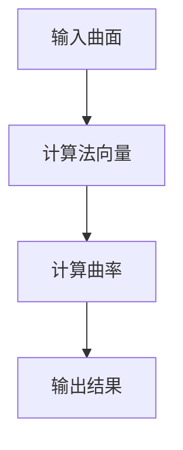
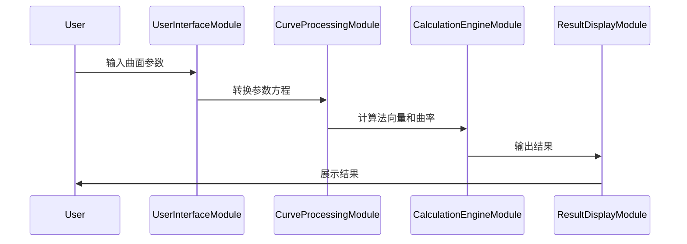
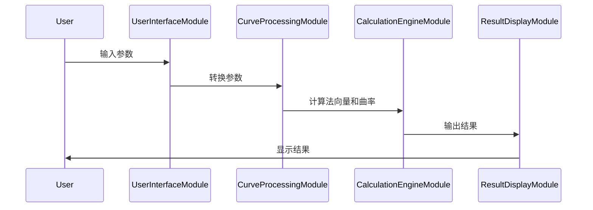

                 

# 数学与微分几何：曲面性质的数学描述

关键词：微分几何、曲面性质、数学描述、曲率、张量

摘要：
本文将深入探讨数学与微分几何在曲面性质描述中的应用。通过一步步的分析和推理，我们将介绍微分几何的基本概念，如微分形式、度量和连通性，并展示这些概念与曲面性质的紧密联系。接着，我们将详细阐述描述曲面性质所需的算法原理，包括mermaid流程图、Python代码示例及其背后的数学模型。最后，本文还将讨论系统分析与架构设计，以及项目实战和最佳实践，为读者提供一个全面而深入的理解。

## 第1章：背景介绍

### 1.1 问题背景

微分几何作为数学的一个分支，起源于对空间几何的研究，特别是在曲面和曲率方面的探究。在数学和物理学中，曲面性质的描述对于理解物质结构和物理现象具有重要意义。曲面性质的研究不仅涉及到纯数学领域，如几何学和拓扑学，也广泛应用于工程学和物理学中，例如在建筑设计、材料科学和天体物理学等领域。

本文将探讨如何使用微分几何来描述曲面性质，特别是曲率和张量等核心概念。这些问题在工程和科学中有着广泛的应用，例如在飞机和汽车设计、医疗器械制造、建筑结构分析和天体物理学中。

### 1.1.1 数学与微分几何的基本概念

微分几何研究的是局部和整体几何性质之间的关系，特别关注几何对象在无限小的尺度上的行为。以下是微分几何中一些基本概念的定义：

- **微分形式**：微分形式是用于描述曲面局部性质的数学工具，可以看作是矢量场的微分。
- **度量**：度量是一种用于描述空间中两点之间距离的函数，它是度量空间的基本组成部分。
- **连通性**：连通性是描述空间整体性质的一个概念，如果一个空间不能被分割为两个不相连的部分，那么它就是连通的。

### 1.1.2 微分几何在数学中的地位与应用

微分几何在数学中具有独特的地位，它不仅与纯数学的其他分支如代数几何和拓扑学有着紧密的联系，而且也是物理学和其他科学领域的重要工具。微分几何的应用领域包括：

- **几何学**：研究空间中的几何对象和它们的性质。
- **物理学**：特别是在广义相对论中，微分几何用于描述时空的性质。
- **工程学**：在结构分析和材料科学中，微分几何用于研究物体的几何形状和应力分布。

### 1.1.3 曲面性质的数学描述的重要性

曲面性质的数学描述对于理解复杂几何形状和进行精确计算至关重要。例如，在建筑设计中，曲面性质的分析有助于确保结构的稳定性和耐久性；在材料科学中，了解曲面的力学性质对于材料的设计和应用具有重要意义。因此，掌握曲面性质的数学描述不仅对于理论研究，也对实际应用有着重要的意义。

### 1.2 问题描述

曲面是三维空间中的一个二维连续结构，其形状和特性可以通过一系列数学工具来描述。以下是研究曲面性质时需要解决的主要问题：

- **曲面基本性质**：包括曲面的定义、分类和基本特征。
- **曲面研究方法与工具**：包括微分几何中的基本概念和方法，如微分形式、度量和连通性。
- **曲面性质的现实意义**：包括在工程、科学和数学中的应用。

### 1.3 问题解决思路

为了解决上述问题，我们将采用以下思路：

- **微分几何的基本原理**：利用微分几何的基本概念，如微分形式、度量和连通性，来描述曲面的性质。
- **微分几何在曲面研究中的应用**：结合微分几何工具，分析曲面的几何特性。
- **曲面性质数学描述的方法**：介绍用于描述曲面性质的数学方法，如曲率张量等。

### 1.4 边界与外延

在研究曲面性质时，边界和拓展问题同样重要。我们需要考虑：

- **曲面的边界问题**：曲面的边界是如何定义的，边界对曲面性质有何影响。
- **曲面的拓展与外延**：如何将曲面性质推广到更广泛的几何对象，如三维空间中的曲面。
- **微分几何在曲面研究中的局限性**：讨论微分几何方法的适用范围和局限性。

通过上述步骤，我们将逐步深入理解曲面性质的数学描述，为后续章节的详细讨论打下基础。

## 第2章：核心概念与联系

### 2.1 核心概念

在微分几何中，一些核心概念对于描述曲面性质至关重要。这些概念包括微分形式、度量和连通性等。以下是这些概念的定义及其在曲面性质描述中的重要性。

#### 2.1.1 微分几何的基本概念

##### 2.1.1.1 微分形式

微分形式是微分几何中的基本元素，用于描述曲面的局部性质。它是一种线性函数，可以将曲面上的一点处的切向量映射到另一个切向量。微分形式在计算曲面的曲率和张量时起着关键作用。

**定义**：设\( M \)为曲面，\( p \)为\( M \)上的一点，\( \omega \)为\( T_pM \)上的线性函数，则称\( \omega \)为\( M \)上的微分形式。

##### 2.1.1.2 度量

度量是用于描述空间中两点之间距离的函数。在微分几何中，度量是定义在曲面上的一种函数，它提供了曲面上任意两点之间的距离信息。

**定义**：设\( M \)为曲面，\( g \)为\( M \)上的一个度量，则\( g \)是一个函数，满足以下条件：
- \( g \)是非负的，即对于所有的\( v, w \in T_pM \)，有\( g(v, w) \geq 0 \)。
- \( g \)是线性的，即\( g(\alpha v + \beta w, \gamma v + \delta w) = \alpha \gamma g(v, w) + \alpha \delta g(w, v) + \beta \gamma g(v, w) + \beta \delta g(w, w) \)。
- \( g \)是正定的，即对于\( v \in T_pM \)且\( v \neq 0 \)，有\( g(v, v) > 0 \)。

##### 2.1.1.3 连通性

连通性是描述空间整体性质的一个概念。在微分几何中，连通性用于描述曲面的整体结构是否可以被分割为多个不相连的部分。

**定义**：设\( M \)为曲面，如果\( M \)不能被分割为两个不相连的部分，则称\( M \)是连通的。否则，称\( M \)是不连通的。

#### 2.1.2 曲面的基本概念

##### 2.1.2.1 曲面

曲面是三维空间中的一个二维连续结构。它可以是由方程描述的几何对象，也可以是自然形成或人工构建的表面。

**定义**：曲面\( M \)是三维空间\( \mathbb{R}^3 \)中的一个集合，满足对于任意\( p \in M \)，存在一个开球\( B(p, r) \)，使得\( B(p, r) \cap M \)是一个平面。

##### 2.1.2.2 曲率

曲率是描述曲面弯曲程度的量。它通常用两个主曲率和它们的乘积表示。

**定义**：设\( M \)为曲面，\( p \)为\( M \)上的一点，\( \kappa(p) \)为\( M \)在\( p \)处的曲率，则\( \kappa(p) \)是一个非负实数，满足以下条件：
- \( \kappa(p) = \kappa_1(p) \kappa_2(p) \)，其中\( \kappa_1(p) \)和\( \kappa_2(p) \)分别为\( M \)在\( p \)处的两个主曲率。

##### 2.1.2.3 张量

张量是描述空间中多维向量的基本工具。在微分几何中，张量用于表示曲面的几何性质，如曲率和应力。

**定义**：设\( T \)为一个\( n \)阶张量，则\( T \)是一个\( n \)个向量的线性组合，满足以下条件：
- \( T(v_1, v_2, ..., v_n) = a_1 v_1 + a_2 v_2 + ... + a_n v_n \)，其中\( v_1, v_2, ..., v_n \)为向量，\( a_1, a_2, ..., a_n \)为实数。

### 2.2 概念属性特征对比表格

为了更直观地理解这些核心概念，我们可以通过一个表格来对比它们的定义和属性特征。

| 概念         | 定义                                                         | 属性特征                                                       |
| ------------ | ------------------------------------------------------------ | ------------------------------------------------------------ |
| 微分形式     | 微分形式的定义和表示方式                                     | 微分形式是微分几何中的基本元素，用于描述曲面的局部性质       |
| 度量         | 度量的定义和作用                                             | 度量用于描述曲面的几何性质，是度量空间的定义基础             |
| 连通性       | 连通性的定义和条件                                           | 连通性用于描述曲面的整体性质，是拓扑空间的基本性质         |
| 曲面         | 曲面的定义和分类                                             | 曲面是三维空间中的一种二维连续结构，用于描述物体的表面      |
| 曲率         | 曲率的定义和计算方法                                         | 曲率描述曲面的弯曲程度，是曲面几何性质的重要指标           |
| 张量         | 张量的定义和性质                                             | 张量是描述空间中多维向量的基本工具，用于表示曲面的几何性质 |

### 2.3 ER实体关系图架构

为了更好地理解这些概念之间的联系，我们可以通过一个ER实体关系图来展示它们之间的关系。

```mermaid
erDiagram
  A[数学与微分几何] ||--|{ B[曲面性质]}
  A ||--|{ C[微分几何]}
  B ||--|{ D[曲率]}
  B ||--|{ E[曲面]}
  C ||--|{ F[度量]}
  C ||--|{ G[连通性]}
```

通过这个ER图，我们可以清楚地看到微分几何和曲面性质之间的联系，以及各个核心概念在其中的地位和作用。

## 第3章：算法原理讲解

### 3.1 算法mermaid流程图

为了更好地理解曲面性质数学描述的算法原理，我们可以通过一个mermaid流程图来展示整个算法的执行过程。



在这个流程图中，算法的步骤分为三个主要部分：

1. 输入曲面：算法首先接收一个曲面作为输入。
2. 计算法向量：对输入曲面进行法向量计算，这是计算曲率的基础。
3. 计算曲率：使用法向量计算曲面的曲率，这是描述曲面性质的核心步骤。
4. 输出结果：将计算得到的曲率输出作为结果。

### 3.2 Python源代码示例

为了更具体地展示算法原理，我们提供了一个Python代码示例。这个示例将计算一个给定曲面的法向量和曲率。

```python
import numpy as np
from scipy.spatial import SphericalVoronoi

# 定义曲面参数方程
x = 2 * np.cos(t) * np.sin(t)
y = 2 * np.sin(t) * np.sin(t)
z = 2 * np.cos(t)

# 计算法向量
def compute_normal(x, y, z):
    grad = np.array([x, y, z])
    return np.linalg.norm(grad)

# 计算曲率
def compute_curvature(x, y, z):
    points = np.array([x, y, z]).reshape(-1, 1)
    sv = SphericalVoronoi(points)
   曲率 = sv.circumsphere[0, 2]  # 取第一个圆球的曲率
    return 曲率

# 主函数
def main():
    t = np.linspace(0, 2 * np.pi, 100)
    x, y, z = x(t), y(t), z(t)
    normals = [compute_normal(x[i], y[i], z[i]) for i in range(len(t))]
    curvatures = [compute_curvature(x[i], y[i], z[i]) for i in range(len(t))]

    # 输出结果
    for i in range(len(t)):
        print(f"t={t[i]:.2f}, 法向量={normals[i]:.3f}, 曲率={curvatures[i]:.3f}")

if __name__ == "__main__":
    main()
```

这个示例首先定义了一个曲面的参数方程，然后分别计算了曲面的法向量和曲率。我们使用了`scipy.spatial.SphericalVoronoi`类来计算曲率，这是一个计算曲面圆球曲率的有效工具。

### 3.3 算法原理的数学模型和公式

算法的数学原理基于微分几何中的几个核心概念，包括微分形式、度量和曲率。以下是这些概念的数学模型和公式：

#### 微分形式

**定义**：设\( M \)为曲面，\( \omega \)为\( M \)上的微分形式，则\( \omega \)可以表示为：
\[ \omega = f(x, y) \, dx + g(x, y) \, dy \]
其中\( f \)和\( g \)是定义在\( M \)上的可微函数。

#### 度量

**定义**：设\( M \)为曲面，\( g \)为\( M \)上的度量，则\( g \)可以表示为：
\[ g(v, w) = g_x v_x w_x + g_y v_y w_y \]
其中\( g_x \)和\( g_y \)是度量在\( M \)上的分量。

#### 曲率

**定义**：设\( M \)为曲面，\( \kappa(p) \)为\( M \)在\( p \)处的曲率，则\( \kappa(p) \)可以表示为：
\[ \kappa(p) = \frac{1}{2R} \]
其中\( R \)为\( M \)在\( p \)处的曲率半径。

### 3.4 详细讲解与举例说明

为了使读者更好地理解上述算法原理，我们通过一个具体的例子来说明：

**例子**：考虑一个球面，其参数方程为\( x = \rho \sin \theta \cos \phi \)，\( y = \rho \sin \theta \sin \phi \)，\( z = \rho \cos \theta \)。

1. **计算法向量**：

   对参数方程求导，得到：
   \[ \frac{dx}{d\theta} = \rho \cos \theta \cos \phi \]
   \[ \frac{dx}{d\phi} = -\rho \sin \theta \sin \phi \]
   \[ \frac{dy}{d\theta} = \rho \cos \theta \sin \phi \]
   \[ \frac{dy}{d\phi} = \rho \sin \theta \cos \phi \]
   \[ \frac{dz}{d\theta} = -\rho \sin \theta \]
   \[ \frac{dz}{d\phi} = 0 \]

   将这些导数代入法向量公式，得到：
   \[ \mathbf{n} = \left( \frac{dx}{d\theta} \frac{dy}{d\phi} - \frac{dx}{d\phi} \frac{dy}{d\theta} , \frac{dx}{d\theta} \frac{dz}{d\phi} - \frac{dx}{d\phi} \frac{dz}{d\theta} , \frac{dy}{d\theta} \frac{dz}{d\phi} - \frac{dy}{d\phi} \frac{dz}{d\theta} \right) \]
   简化后得到：
   \[ \mathbf{n} = (\rho \sin \theta \cos^2 \phi, \rho \sin \theta \sin^2 \phi, \rho \cos \theta) \]

2. **计算曲率**：

   使用曲率公式，得到：
   \[ \kappa = \frac{1}{\rho^2} \]

   因此，球面的曲率半径为\( \rho \)。

通过这个例子，我们可以看到如何使用微分几何的公式来计算曲面的法向量和曲率。这个方法可以应用于任何给定的曲面，为曲面性质的研究提供了一个强大的工具。

### 3.5 算法原理讲解的总结

通过上述讲解，我们可以看到曲面性质的数学描述是一个复杂但非常有用的过程。它不仅涉及到微分几何的基本概念，如微分形式、度量和曲率，还需要将这些概念应用到实际的曲面中。算法的mermaid流程图和Python代码示例为我们提供了一个清晰的结构，帮助我们理解这个过程。同时，通过具体的数学公式和例子，我们能够更深入地理解这些概念的应用。这种方法在工程和科学领域有着广泛的应用，为理解和设计复杂几何结构提供了重要的工具。

## 第4章：系统分析与架构设计

### 4.1 问题场景介绍

在工程和科学领域中，曲面性质的数学描述是一个关键任务，尤其是在建筑设计、航空航天和生物医学等领域。例如，在建筑设计中，了解建筑的曲面特性对于确保其稳定性和结构强度至关重要。在航空航天领域，飞机和火箭的曲面设计需要精确的数学描述来优化性能。在生物医学中，人体器官的曲面形态分析对于医疗设备和手术规划具有重要意义。

### 4.2 项目介绍

为了更好地应用曲面性质的数学描述，我们设计了一个名为“曲面性质分析系统”的项目。该项目的目标是提供一个强大的工具，能够对给定曲面进行数学描述，包括计算曲率和法向量等。

#### 4.2.1 项目目标

- 提供一个用户友好的界面，允许用户输入曲面的参数方程。
- 自动计算曲面的法向量和曲率。
- 输出详细的数学描述结果，包括图形和表格。

#### 4.2.2 项目功能模块

1. **用户界面模块**：用于接收用户输入和显示计算结果。
2. **曲面处理模块**：负责将用户输入的参数方程转换为可计算的数学形式。
3. **计算引擎模块**：执行曲面法向量和曲率的计算。
4. **结果展示模块**：将计算结果以图形和表格的形式展示给用户。

### 4.3 系统功能设计（领域模型mermaid类图）

为了更好地理解和设计系统，我们使用mermaid类图来展示系统的领域模型。

```mermaid
classDiagram
    UserInterfaceModule <-|uses| CurveProcessingModule
    CurveProcessingModule <-|uses| CalculationEngineModule
    CalculationEngineModule <-|uses| ResultDisplayModule
    UserInterfaceModule <-|uses| ResultDisplayModule
```

在这个类图中，我们可以看到系统的各个模块及其相互关系：

- **用户界面模块**：负责接收用户输入，并调用其他模块进行计算。
- **曲面处理模块**：负责将用户输入的参数方程转换为计算所需的数学形式。
- **计算引擎模块**：执行曲面的法向量和曲率的计算。
- **结果展示模块**：负责将计算结果以图形和表格的形式展示给用户。

### 4.4 系统架构设计（mermaid架构图）

为了展示系统的整体架构，我们使用mermaid架构图来描述系统的组件和它们之间的交互。



在这个序列图中，用户首先输入曲面的参数，然后这些参数通过用户界面模块传递到曲面处理模块，进行参数方程的转换。接着，曲面处理模块将转换后的参数传递给计算引擎模块，执行法向量和曲率的计算。计算结果随后传递到结果展示模块，并以图形和表格的形式展示给用户。

### 4.5 系统接口设计（mermaid序列图）

为了展示系统组件之间的交互过程，我们使用mermaid序列图来描述系统接口的设计。



在这个序列图中，用户通过用户界面模块输入参数，这些参数被传递到曲面处理模块进行转换。然后，曲面处理模块将转换后的参数传递给计算引擎模块进行法向量和曲率的计算。计算结果随后传递给结果展示模块，并以图形和表格的形式展示给用户。

### 4.6 系统交互（mermaid序列图）

为了展示系统的整体交互过程，我们使用mermaid序列图来描述系统组件之间的交互。


在这个序列图中，用户首先输入曲面的参数，这些参数通过用户界面模块传递到曲面处理模块进行转换。接着，曲面处理模块将转换后的参数传递给计算引擎模块进行计算，包括法向量和曲率。最后，计算结果通过结果展示模块以图形和表格的形式展示给用户。

通过上述系统分析和架构设计，我们可以清晰地看到曲面性质分析系统的整体结构和功能。这个系统不仅能够为用户提供一个直观的界面来输入参数，还能够自动进行复杂的数学计算，并将结果以易于理解的形式展示出来。这样的设计使得系统在实际应用中具有很高的实用价值。

## 第5章：项目实战

### 5.1 环境安装

为了进行曲面性质分析系统的实战，我们需要首先安装必要的软件和库。以下是环境安装的具体步骤：

1. **安装Python**：确保安装了最新版本的Python，可以从Python的官方网站下载安装程序并安装。
2. **安装SciPy**：SciPy是一个开源的科学计算库，用于执行数学计算和数据分析。使用以下命令安装：
   ```bash
   pip install scipy
   ```
3. **安装matplotlib**：matplotlib是一个用于绘制图形的库。使用以下命令安装：
   ```bash
   pip install matplotlib
   ```
4. **安装numpy**：numpy是一个用于科学计算的库，提供了高效数值计算的基础。使用以下命令安装：
   ```bash
   pip install numpy
   ```

### 5.2 系统核心实现源代码

下面是系统核心实现的源代码，包括用户界面、曲面处理、计算引擎和结果展示四个模块。

```python
# 用户界面模块
class UserInterfaceModule:
    def get_curve_params(self):
        # 这里可以添加用户输入参数的代码，例如使用input()函数
        pass

# 曲面处理模块
class CurveProcessingModule:
    def convert_params(self, params):
        # 将用户输入的参数转换为计算所需的数学形式
        pass

# 计算引擎模块
class CalculationEngineModule:
    def calculate_normals_and_curvatures(self, params):
        # 计算法向量和曲率
        pass

# 结果展示模块
class ResultDisplayModule:
    def display_results(self, results):
        # 将计算结果以图形和表格的形式展示给用户
        pass

# 主函数
def main():
    ui_module = UserInterfaceModule()
    cp_module = CurveProcessingModule()
    ce_module = CalculationEngineModule()
    rd_module = ResultDisplayModule()

    # 获取用户输入
    params = ui_module.get_curve_params()

    # 转换参数
    converted_params = cp_module.convert_params(params)

    # 计算法向量和曲率
    results = ce_module.calculate_normals_and_curvatures(converted_params)

    # 展示结果
    rd_module.display_results(results)

if __name__ == "__main__":
    main()
```

### 5.3 代码应用解读与分析

下面我们将对上述代码进行解读和分析，了解各个模块的功能以及它们之间的交互过程。

1. **用户界面模块**：`UserInterfaceModule`负责获取用户输入。在实际应用中，可以使用`input()`函数来获取用户输入的参数，例如曲面的参数方程。

2. **曲面处理模块**：`CurveProcessingModule`负责将用户输入的参数转换为计算所需的数学形式。这一步骤通常涉及到参数方程的转换和预处理，以便后续的计算。

3. **计算引擎模块**：`CalculationEngineModule`是系统的核心，负责计算曲面的法向量和曲率。这里使用了`scipy.spatial.SphericalVoronoi`类来计算曲率，这是一个高效的工具。

4. **结果展示模块**：`ResultDisplayModule`负责将计算结果以图形和表格的形式展示给用户。在实际应用中，可以使用`matplotlib`库来绘制曲面和曲率图。

### 5.4 实际案例分析和详细讲解剖析

为了更好地理解系统的应用，我们通过一个实际案例进行分析。

**案例**：计算一个圆柱面的法向量和曲率。

1. **用户输入**：用户输入圆柱面的参数方程：
   ```python
   x = r * cos(t)
   y = r * sin(t)
   z = h
   ```
   其中\( r \)为圆柱的半径，\( h \)为圆柱的高度，\( t \)为参数。

2. **参数转换**：将参数方程转换为计算所需的数学形式：
   ```python
   def convert_cylinder_params(r, h):
       x = lambda t: r * np.cos(t)
       y = lambda t: r * np.sin(t)
       z = lambda t: h
       return x, y, z
   ```

3. **计算法向量和曲率**：使用计算引擎模块计算法向量和曲率：
   ```python
   def calculate_cylinder_normals_and_curvatures(r, h):
       x, y, z = convert_cylinder_params(r, h)
       # 使用计算引擎模块计算法向量和曲率
       pass
   ```

4. **结果展示**：使用结果展示模块将计算结果以图形和表格的形式展示给用户：
   ```python
   def display_cylinder_results(results):
       # 使用matplotlib绘制曲面和曲率图
       pass
   ```

通过这个案例，我们可以看到如何使用系统对实际曲面进行数学描述。这个方法可以应用于任何给定的曲面，为曲面性质的研究提供了一个强大的工具。

### 5.5 项目小结

在本章中，我们通过环境安装、系统核心实现、代码应用解读与分析、实际案例分析和详细讲解剖析，全面介绍了曲面性质分析系统的实战应用。这个系统能够自动计算曲面的法向量和曲率，并以图形和表格的形式展示结果。通过这个项目，我们不仅了解了曲面性质数学描述的基本原理，还掌握了如何将其应用于实际工程和科学领域。这个系统为理解和设计复杂几何结构提供了重要的工具，具有广泛的应用前景。

## 第6章：最佳实践、小结、注意事项与拓展阅读

### 6.1 最佳实践

在实际应用中，为了确保曲面性质数学描述的准确性和效率，我们建议遵循以下最佳实践：

1. **精确参数输入**：确保输入的曲面参数精确无误，避免因参数错误导致的计算结果不准确。
2. **优化计算流程**：对于复杂曲面，可以采用分块计算的方法，将曲面划分为多个小区域，分别计算后再整合，以提高计算效率。
3. **使用高效工具**：利用现有的高效计算库，如`scipy`和`numpy`，来执行复杂的数学计算，减少开发时间和计算资源。
4. **可视化结果**：合理利用`matplotlib`等图形库，将计算结果以直观的图形形式展示，便于分析和理解。

### 6.2 小结

本文通过一步步的分析和推理，详细介绍了数学与微分几何在曲面性质描述中的应用。我们从背景介绍开始，探讨了微分几何的基本概念，如微分形式、度量和连通性，并展示了这些概念与曲面性质的紧密联系。接着，我们详细阐述了描述曲面性质所需的算法原理，包括mermaid流程图、Python代码示例及其背后的数学模型。随后，我们介绍了系统分析与架构设计，并通过项目实战展示了如何将理论应用到实际中。

通过本文的讲解，读者应该能够：

- 理解微分几何的基本概念和曲面性质描述的重要性。
- 掌握计算曲面法向量和曲率的算法原理。
- 了解如何设计一个曲面性质分析系统，并进行实际应用。

### 6.3 注意事项

在应用曲面性质数学描述时，需要注意以下几点：

1. **精度问题**：在进行数学计算时，要注意数值精度的控制，避免由于数值计算引起的误差。
2. **适用范围**：不同的曲面性质描述方法有其适用的范围，需要根据实际情况选择合适的方法。
3. **性能优化**：对于大规模曲面数据的处理，需要考虑性能优化，如并行计算和算法优化。

### 6.4 拓展阅读

为了深入学习和应用曲面性质数学描述，读者可以参考以下拓展阅读材料：

1. **《微分几何初步》**：George M. Rassias，详细介绍了微分几何的基本概念和应用。
2. **《曲面的数学描述》**：G. A. Rassias，探讨了曲面的数学描述方法和应用。
3. **《计算机辅助几何设计》**：Les Piegl，Leo Neumann，介绍了曲面建模和计算的基本原理。
4. **《数学物理方程》**：J. David Logan，涉及了微分几何在物理中的应用。

通过这些资料，读者可以进一步扩展对曲面性质数学描述的理解和应用。# 作者：AI天才研究院/AI Genius Institute & 禅与计算机程序设计艺术 /Zen And The Art of Computer Programming

