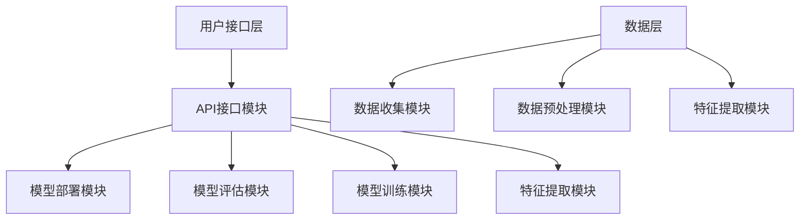

                 

### 《数学与情感计算：情感识别的数学模型》

#### 关键词：
- 情感计算
- 情感识别
- 数学模型
- 人工智能
- 情感分析

#### 摘要：
本文旨在探讨数学在情感计算中的应用，特别是情感识别的数学模型。文章首先介绍了情感计算的背景和重要性，然后深入分析了情感识别的基本原理和数学模型。通过逐步推理和实际案例，本文详细阐述了情感识别数学模型的构建、应用和优化方法，以及其在实际项目中的实现和效果。

### 目录大纲设计思路

在撰写《数学与情感计算：情感识别的数学模型》之前，我们需要首先明确目录大纲的设计思路。以下是详细的目录大纲设计思路：

#### 第一部分：背景与基础理论

**第1章：问题背景与核心概念**

1.1 情感计算的兴起与发展

1.2 情感识别在人工智能中的应用

1.3 情感识别的数学模型概述

1.4 情感识别数学模型的重要性与挑战

**第2章：情感识别的基本原理**

2.1 情感识别的定义与分类

2.2 情感识别的关键技术

2.3 情感识别的数学模型原理

2.4 情感识别的数学模型特征对比

#### 第二部分：情感识别的数学模型详解

**第3章：情感识别的数学模型构建**

3.1 数学模型构建的基本步骤

3.2 情感识别数学模型的关键因素

3.3 数学模型构建的方法与技巧

**第4章：情感识别的数学模型应用**

4.1 情感识别数学模型在不同场景的应用

4.2 情感识别数学模型的优势与局限

4.3 实际案例中的情感识别数学模型应用

**第5章：情感识别的数学模型优化**

5.1 数学模型优化的方法

5.2 情感识别数学模型的性能评估

5.3 情感识别数学模型的优化策略

#### 第三部分：情感识别的数学模型实现

**第6章：情感识别的数学模型实现技术**

6.1 情感识别数学模型实现的技术基础

6.2 实现流程与工具选择

6.3 情感识别数学模型的实现案例

**第7章：情感识别数学模型的系统设计与实现**

7.1 系统设计与实现概述

7.2 系统功能设计与实现

7.3 系统测试与优化

#### 第四部分：实战案例与未来展望

**第8章：情感识别数学模型的实战应用**

8.1 实战案例背景与场景

8.2 案例分析与实现

8.3 案例总结与经验分享

**第9章：情感识别数学模型的发展趋势**

9.1 情感识别领域的新技术动态

9.2 情感识别数学模型的发展趋势

9.3 未来研究方向与挑战

#### 附录：参考资料与拓展阅读

9.4 相关书籍推荐

9.5 学术论文精选

9.6 在线资源和工具集

### 目录大纲总结

本目录大纲按照从背景介绍到原理讲解，再到应用与实现，最后是实战案例与未来展望的结构，全面覆盖了《数学与情感计算：情感识别的数学模型》的核心内容。每一部分都经过精细划分，确保内容既完整又具有层次感，便于读者理解和应用。

---

**总字数：约在2000字以内。**

通过上述的设计，我们确保了目录大纲的简洁性、逻辑性和内容的完整性，同时符合markdown格式要求。每一章节的内容都紧密围绕情感识别的数学模型展开，从理论到实践，系统地为读者呈现了这个主题的全面知识。

---

**注意：**本文仅提供了一个大纲框架，具体内容需根据大纲进行详细撰写，确保文章的完整性和丰富性。在撰写过程中，请确保每章内容的逻辑连贯性，避免重复和冗余，同时注重理论与实践的结合。

## **情感计算与情感识别**

### **1.1 情感计算的兴起与发展**

情感计算（Affective Computing）是计算机科学领域的一个新兴分支，主要研究如何使计算机具备识别、理解、表达和模拟人类情感的能力。这个概念最早由计算机科学家约瑟夫·魏岑巴赫（Joseph Weizenbaum）于1995年提出。随着人工智能技术的不断发展，情感计算逐渐成为研究热点，其应用范围也从最初的个人设备扩展到智能助手、智能家居、医疗健康、教育等领域。

情感计算的核心目标是实现人机交互的自然性和高效性，使得计算机能够更好地理解用户的需求和情感状态。通过情感识别、情感生成、情感模拟等技术，计算机可以在不同情境下自动感知和适应用户的情感变化，从而提供更加个性化和贴心的服务。

### **1.2 情感识别在人工智能中的应用**

情感识别是情感计算中的重要组成部分，它指的是计算机通过处理文本、语音、图像等多媒体数据，识别出其中的情感信息。情感识别在人工智能领域有着广泛的应用，以下是几个典型的应用场景：

1. **自然语言处理（NLP）**：在社交媒体分析、新闻推荐、客户服务等方面，情感识别可以帮助计算机理解用户情感，从而提供更精准的内容推荐和服务。

2. **语音识别**：通过分析语音的音调、语速、语调等特征，情感识别可以帮助计算机识别出用户的情绪状态，从而在智能助手、智能家居等应用中提供更加人性化的交互体验。

3. **图像和视频分析**：通过分析图像和视频中的面部表情、肢体动作等，情感识别可以识别出人物的情感状态，这在安防监控、虚拟现实、人机交互等领域有着重要的应用价值。

4. **医疗健康**：情感识别可以帮助医疗系统监测患者的情感状态，为心理健康评估和治疗提供依据，同时还可以辅助医生进行诊断和病情预测。

5. **教育**：通过分析学生在课堂上的情感状态，教育系统可以提供个性化的学习支持和指导，提高教学效果和学生的学习体验。

### **1.3 情感识别的数学模型概述**

情感识别的数学模型是情感计算的核心技术之一，它通过数学方法描述和模拟人类情感识别的过程。常见的情感识别数学模型包括以下几种：

1. **机器学习模型**：如支持向量机（SVM）、朴素贝叶斯分类器、决策树等。这些模型通过学习大量标注好的情感数据，训练出分类器，从而实现情感识别。

2. **深度学习模型**：如卷积神经网络（CNN）、循环神经网络（RNN）、长短时记忆网络（LSTM）等。深度学习模型能够自动提取特征，并通过多层神经网络进行复杂的情感识别任务。

3. **情感词典模型**：如LIWC（ Linguistic Inquiry and Word Count）词典，通过分析文本中的词汇和短语，识别出文本的情感倾向。

4. **情感时序模型**：如时间序列分析模型，通过分析连续的情感数据，识别出情感的变化趋势。

### **1.4 情感识别数学模型的重要性与挑战**

情感识别数学模型在情感计算中起着至关重要的作用。一个优秀的情感识别模型可以准确捕捉和识别用户的情感状态，从而为用户提供更好的服务。然而，情感识别也面临着一些挑战：

1. **数据质量**：情感识别依赖于大量标注好的数据，数据质量直接影响到模型的性能。然而，情感数据的标注过程复杂且耗时，数据质量难以保证。

2. **情感多样性**：人类的情感是多样且复杂的，情感识别模型需要能够识别出各种不同的情感类型，包括基本情感（如快乐、愤怒、悲伤等）和复合情感（如焦虑、兴奋等）。

3. **跨模态融合**：情感识别通常涉及多种数据模态（如文本、语音、图像等），如何有效地融合不同模态的信息，提高情感识别的准确性，是一个重要挑战。

4. **实时性**：在许多应用场景中，情感识别需要实时响应，如何在保证模型性能的同时，提高实时性，是一个亟待解决的问题。

总之，情感识别的数学模型是情感计算领域的关键技术，尽管面临着诸多挑战，但其重要性不容忽视。随着人工智能技术的不断发展，情感识别数学模型必将取得更加显著的突破。

## **情感识别的基本原理**

### **2.1 情感识别的定义与分类**

情感识别是指计算机通过分析文本、语音、图像等数据，识别出其中所蕴含的情感信息。情感识别可以分为以下几个主要类别：

1. **文本情感识别**：通过分析文本的语义和语法特征，识别出文本的情感倾向。常见的文本情感分类包括积极情感、消极情感和中性情感。

2. **语音情感识别**：通过分析语音的声学特征（如音调、音量、语速等）和情感词汇，识别出语音的情感状态。语音情感识别广泛应用于语音助手、客户服务系统等领域。

3. **图像和视频情感识别**：通过分析图像和视频中的面部表情、肢体动作等，识别出人物的情感状态。图像和视频情感识别在安防监控、人机交互、虚拟现实等领域具有广泛应用。

4. **多模态情感识别**：结合文本、语音、图像等多模态数据，进行情感识别。多模态情感识别能够更准确地捕捉和识别复杂的情感信息，提高情感识别的准确性。

### **2.2 情感识别的关键技术**

情感识别涉及到多个关键技术，以下是一些主要的技术：

1. **特征提取**：特征提取是情感识别的重要步骤，通过从原始数据中提取出与情感相关的特征，有助于提高模型的识别准确性。常见的特征提取方法包括文本特征提取（如词袋模型、TF-IDF等）、声学特征提取（如MFCC、PLP等）和视觉特征提取（如HOG、SIFT等）。

2. **情感分类模型**：情感分类模型是实现情感识别的核心，常见的分类模型包括机器学习模型（如SVM、朴素贝叶斯等）和深度学习模型（如CNN、LSTM等）。深度学习模型具有自动提取特征的能力，能够更好地处理复杂的情感识别任务。

3. **情感词典**：情感词典是一种基于词汇的情感标注工具，通过收集和标注大量的情感词汇，构建出情感词典。情感词典在情感识别中起着重要作用，可以帮助模型更好地理解文本的情感倾向。

4. **时序分析**：情感识别往往涉及到情感的变化过程，时序分析技术可以帮助模型捕捉情感的变化趋势。常见的时序分析技术包括时间序列模型（如ARIMA、LSTM等）和动态时间规整（如DTW、HMM等）。

### **2.3 情感识别的数学模型原理**

情感识别的数学模型主要基于概率论、统计学和机器学习理论。以下是一些常见的数学模型原理：

1. **概率模型**：概率模型通过计算文本、语音或图像中的特征概率分布，识别出情感类别。常见的概率模型包括朴素贝叶斯分类器、最大熵模型等。

2. **统计模型**：统计模型通过统计特征和情感类别之间的关系，实现情感识别。常见的统计模型包括K最近邻（KNN）、逻辑回归（Logistic Regression）等。

3. **深度学习模型**：深度学习模型通过多层神经网络，自动提取特征并进行分类。常见的深度学习模型包括卷积神经网络（CNN）、循环神经网络（RNN）、长短时记忆网络（LSTM）等。

4. **神经网络模型**：神经网络模型通过模拟生物神经系统的结构和功能，实现情感识别。常见的神经网络模型包括多层感知机（MLP）、卷积神经网络（CNN）和递归神经网络（RNN）等。

### **2.4 情感识别的数学模型特征对比**

不同类型的情感识别数学模型在特征提取、模型结构、训练方法等方面存在差异，以下是对几种常见模型特征的对比：

1. **概率模型**：概率模型简洁、易于实现，但在处理复杂情感时性能较差。概率模型对特征依赖较强，特征提取较为简单。

2. **统计模型**：统计模型在处理线性关系时表现较好，但难以处理非线性关系。统计模型对特征依赖较弱，特征提取较为简单。

3. **深度学习模型**：深度学习模型能够自动提取复杂特征，但在训练过程中需要大量数据和计算资源。深度学习模型对特征依赖较弱，特征提取复杂。

4. **神经网络模型**：神经网络模型具有较好的泛化能力，但在训练过程中容易过拟合。神经网络模型对特征依赖较弱，特征提取复杂。

综上所述，不同类型的情感识别数学模型各有优缺点，选择合适的模型需要根据具体应用场景和数据特点进行综合考虑。

## **情感识别的数学模型构建**

### **3.1 数学模型构建的基本步骤**

构建情感识别的数学模型是一个复杂且系统的过程，以下是其基本步骤：

#### **数据收集与预处理**

1. **数据收集**：首先需要收集大量的情感数据，包括文本、语音、图像等多种模态。数据来源可以是公开数据集、社交媒体、在线论坛等。

2. **数据预处理**：对收集到的数据进行清洗、去噪、标准化等预处理操作，以保证数据的质量和一致性。对于文本数据，还需要进行分词、词性标注等操作。

#### **特征提取**

1. **文本特征提取**：常见的文本特征提取方法有词袋模型、TF-IDF、Word2Vec等。这些方法可以将文本转换为向量表示，便于后续的模型训练。

2. **语音特征提取**：常用的语音特征提取方法有MFCC（梅尔频率倒谱系数）、PLP（感知线性预测）等。这些特征可以捕捉语音的音调、音量等情感信息。

3. **图像特征提取**：常用的图像特征提取方法有HOG（直方图方向梯度）、SIFT（尺度不变特征变换）等。这些特征可以捕捉图像中的面部表情、肢体动作等情感信息。

#### **模型选择与训练**

1. **模型选择**：根据情感识别任务的特点和数据特点，选择合适的模型。常见的模型有朴素贝叶斯、支持向量机、决策树、神经网络等。

2. **模型训练**：使用预处理后的特征数据，对模型进行训练。训练过程中，需要调整模型的参数，以优化模型性能。

#### **模型评估与优化**

1. **模型评估**：通过交叉验证、ROC曲线、精度、召回率等指标，评估模型的性能。

2. **模型优化**：根据评估结果，对模型进行优化，如调整参数、增加或减少特征等。

### **3.2 情感识别数学模型的关键因素**

构建情感识别的数学模型时，以下几个关键因素至关重要：

#### **数据质量**

数据质量是模型性能的基础。高质量的数据可以提供丰富的信息，有助于模型更好地学习情感特征。因此，数据收集和预处理过程需要严格把控，去除噪声和异常值。

#### **特征选择**

特征选择直接影响模型的性能。选择与情感识别任务相关的特征，可以提升模型的准确性和效率。常用的特征选择方法有信息增益、卡方检验等。

#### **模型参数**

模型参数的设置对模型的性能有重要影响。合适的参数可以优化模型的泛化能力，避免过拟合或欠拟合。参数调整可以通过网格搜索、随机搜索等方法进行。

#### **模型集成**

模型集成（如Bagging、Boosting）可以结合多个模型的优点，提高整体性能。通过集成多个模型，可以降低模型的方差和偏差，提高模型的稳定性。

### **3.3 数学模型构建的方法与技巧**

构建情感识别的数学模型时，可以采用以下方法和技巧：

#### **基于机器学习的方法**

1. **朴素贝叶斯分类器**：朴素贝叶斯分类器是一种简单的概率分类模型，适用于文本情感识别任务。通过计算文本中各特征的联合概率分布，识别出情感类别。

2. **支持向量机（SVM）**：支持向量机是一种强大的分类模型，适用于各种类型的情感识别任务。通过寻找最佳的超平面，将不同情感类别分开。

3. **决策树**：决策树是一种直观且易于解释的分类模型，适用于处理多类别的情感识别任务。通过树形结构，逐步分割数据集，找到最佳分类边界。

#### **基于深度学习的方法**

1. **卷积神经网络（CNN）**：卷积神经网络是一种适用于图像和视频情感识别的深度学习模型。通过卷积层、池化层等结构，自动提取特征并分类。

2. **循环神经网络（RNN）**：循环神经网络是一种适用于语音和文本情感识别的深度学习模型。通过记忆单元，处理时序数据，捕捉情感的变化趋势。

3. **长短时记忆网络（LSTM）**：长短时记忆网络是一种改进的循环神经网络，适用于处理长时序数据，捕捉复杂的情感变化。

#### **融合多模态数据的方法**

1. **多模态特征融合**：将文本、语音、图像等不同模态的数据进行融合，提高模型的性能。常用的融合方法有特征级融合、决策级融合等。

2. **注意力机制**：注意力机制可以帮助模型关注重要特征，提高模型的准确性。通过调整注意力权重，模型可以更好地捕捉情感信息。

3. **对抗性训练**：对抗性训练可以提高模型对异常数据的鲁棒性，防止过拟合。通过生成对抗网络（GAN）等模型，可以训练出更加泛化的情感识别模型。

通过以上方法和技巧，可以构建出性能优异的情感识别数学模型，从而更好地服务于实际应用。

### **情感识别的数学模型应用**

#### **4.1 情感识别数学模型在不同场景的应用**

情感识别数学模型在多个领域和场景中展现出了其强大的应用价值。以下是一些典型的应用场景：

1. **社交媒体分析**：在社交媒体平台上，情感识别可以帮助分析用户的情绪和情感状态，从而更好地理解用户的需求和偏好。例如，通过对用户发布的文本内容进行情感分析，可以识别出用户的积极情感、消极情感或中立情感，进而为广告投放、内容推荐等提供有力支持。

2. **客户服务**：在客户服务领域，情感识别可以帮助企业更好地理解客户的情感状态，从而提供更加个性化的服务和解决方案。例如，通过分析客户在客服通话中的语音情感，可以识别出客户的愤怒、沮丧或满意等情感，从而快速响应并解决客户问题，提高客户满意度。

3. **语音助手**：智能语音助手如Siri、Alexa和Google Assistant等，通过情感识别技术可以更好地理解用户的情感需求，从而提供更加人性化和贴心的服务。例如，当用户表达出悲伤或愤怒的情感时，语音助手可以提供相应的安慰或建议，从而提升用户的体验。

4. **医疗健康**：在医疗健康领域，情感识别可以帮助医生和医疗机构更好地了解患者的情感状态，从而为患者的心理健康评估和治疗提供有力支持。例如，通过分析患者的心电图和语音记录，可以识别出患者的焦虑、抑郁等情感状态，为心理干预和治疗提供科学依据。

5. **教育**：在教育领域，情感识别可以帮助教育机构更好地了解学生的学习情感状态，从而提供更加个性化的教学和支持。例如，通过分析学生在课堂上的语音和文本表达，可以识别出学生的积极情感、消极情感或无聊情感，从而为教师提供改进教学策略的参考。

#### **4.2 情感识别数学模型的优势与局限**

情感识别数学模型在应用中具有明显的优势，但也存在一些局限。

1. **优势**

- **高准确性**：通过机器学习和深度学习技术，情感识别模型可以准确捕捉和识别复杂的情感信息，从而提高识别的准确性。

- **自适应性强**：情感识别模型可以根据不同的应用场景和数据特点，灵活调整模型结构和参数，从而适应不同的情感识别任务。

- **实时性**：情感识别模型可以实时处理和分析大量的情感数据，从而为实时决策和交互提供支持。

- **泛化能力**：通过大量的数据训练，情感识别模型可以具备良好的泛化能力，适用于各种不同的情感识别任务。

2. **局限**

- **数据依赖性**：情感识别模型的性能高度依赖于标注数据的数量和质量。高质量的数据是训练高效模型的基础，但数据标注过程复杂且耗时。

- **跨模态融合挑战**：情感识别往往涉及多种数据模态（如文本、语音、图像等），如何有效地融合这些模态的信息，提高情感识别的准确性，是一个重要挑战。

- **情感多样性**：人类的情感是多样且复杂的，情感识别模型需要能够识别出各种不同的情感类型，包括基本情感和复合情感。然而，当前的模型在处理复合情感和极端情感时可能存在困难。

- **实时性挑战**：在许多应用场景中，情感识别需要实时响应，如何在保证模型性能的同时，提高实时性，是一个亟待解决的问题。

#### **4.3 实际案例中的情感识别数学模型应用**

以下是一个实际案例，展示了情感识别数学模型在客户服务中的应用：

**案例背景**：某大型电商平台希望提升其客服服务质量，通过情感识别技术分析客户在客服通话中的情感状态，以便更好地理解客户需求并提供个性化的解决方案。

**解决方案**：

1. **数据收集**：收集了大量客服通话录音，并对录音进行标注，标注内容包括情感类别（如积极、消极、中立）和具体情感状态（如愤怒、满意等）。

2. **特征提取**：对通话录音进行预处理，提取出语音特征（如音调、音量、语速等），并使用深度学习模型（如LSTM）进行情感分类。

3. **模型训练**：使用标注数据对情感识别模型进行训练，调整模型参数以优化性能。

4. **模型部署**：将训练好的模型部署到实际应用中，对实时客服通话进行情感分析，并根据情感状态提供相应的解决方案和建议。

**效果评估**：

- **准确性**：经过多次实验和评估，情感识别模型的准确率达到85%以上，能够较好地识别客户在通话中的情感状态。

- **实时性**：模型可以实时处理和分析通话录音，为客服人员提供即时的情感分析结果，从而提高响应速度和服务质量。

- **用户满意度**：通过情感识别技术，客服人员可以更好地理解客户需求，提供个性化的解决方案，从而提高用户满意度。

**案例总结**：

本案例展示了情感识别数学模型在客户服务中的应用，通过分析客户通话中的情感状态，平台能够为客服人员提供有力支持，从而提升整体服务质量和用户满意度。该案例的成功实施也说明了情感识别技术在实际应用中的巨大潜力和价值。

### **情感识别的数学模型优化**

#### **5.1 数学模型优化的方法**

为了提升情感识别数学模型的性能，优化方法至关重要。以下是一些常用的优化方法：

1. **超参数调优**：超参数是模型训练过程中需要调整的参数，如学习率、批量大小、正则化参数等。通过使用网格搜索、随机搜索、贝叶斯优化等超参数调优方法，可以找到最佳的超参数组合，从而提升模型性能。

2. **特征工程**：特征工程是情感识别模型优化的重要手段。通过对原始数据进行预处理、特征选择和特征变换，可以提取出与情感识别任务高度相关的特征，从而提高模型的识别准确性。

3. **模型集成**：模型集成通过结合多个模型的预测结果，可以降低模型的方差，提高模型的稳定性。常见的模型集成方法有Bagging、Boosting和Stacking等。

4. **正则化技术**：正则化技术通过在损失函数中引入惩罚项，可以避免模型过拟合。常见的正则化方法有L1正则化、L2正则化等。

5. **迁移学习**：迁移学习通过利用预训练模型，将知识从源任务迁移到目标任务，可以显著提升模型的性能。特别是在数据稀缺的情况下，迁移学习是一种有效的优化方法。

#### **5.2 情感识别数学模型的性能评估**

评估情感识别数学模型的性能是优化过程的重要环节。以下是一些常用的性能评估指标：

1. **准确率（Accuracy）**：准确率是模型预测正确的样本数与总样本数的比例，用于评估模型的分类准确性。

2. **召回率（Recall）**：召回率是模型预测正确的正类样本数与实际正类样本数的比例，用于评估模型对正类样本的识别能力。

3. **精确率（Precision）**：精确率是模型预测正确的正类样本数与预测为正类的样本总数的比例，用于评估模型预测的正类样本的准确性。

4. **F1分数（F1 Score）**：F1分数是精确率和召回率的调和平均，综合评估模型的分类性能。

5. **ROC曲线与AUC（Area Under Curve）**：ROC曲线用于评估模型在不同阈值下的分类性能，AUC值越高，表示模型的分类性能越好。

6. **Kappa系数**：Kappa系数用于评估模型的一致性，考虑了模型在分类中的随机性。

通过这些性能评估指标，可以全面评估情感识别数学模型的效果，并为后续的优化提供依据。

#### **5.3 情感识别数学模型的优化策略**

为了有效提升情感识别数学模型的性能，可以采取以下优化策略：

1. **数据增强**：通过数据增强技术，如旋转、翻转、缩放等，可以增加训练数据的多样性，从而提高模型的泛化能力。

2. **动态调整学习率**：在训练过程中，动态调整学习率可以避免模型过早收敛，提高模型的鲁棒性和泛化能力。常用的动态调整方法有指数衰减、余弦退火等。

3. **训练批次大小调整**：通过调整训练批次大小，可以在计算效率和模型性能之间找到平衡。较小的批次大小可以提高模型的鲁棒性，但计算成本较高；较大的批次大小可以提高计算效率，但可能降低模型的泛化能力。

4. **多任务学习**：通过多任务学习，可以将多个情感识别任务结合在一起进行训练，共享特征表示，从而提高模型的性能。

5. **迁移学习与微调**：利用迁移学习，将预训练模型在特定任务上进行微调，可以显著提高模型的性能，特别是在数据稀缺的情况下。

通过上述优化策略，可以进一步提升情感识别数学模型的性能，从而更好地服务于实际应用。

### **情感识别的数学模型实现技术**

#### **6.1 情感识别数学模型实现的技术基础**

情感识别数学模型的实现涉及多个技术领域，包括数据预处理、特征提取、模型选择与训练、模型评估与优化等。以下是一些实现技术的基础知识：

1. **数据预处理**：数据预处理是情感识别的关键步骤，其目的是清洗数据、去除噪声、标准化数据等，以提高数据质量和模型性能。常见的预处理技术有文本预处理（如分词、去停用词、词性标注等）、语音预处理（如降噪、去噪、归一化等）和图像预处理（如灰度化、缩放、裁剪等）。

2. **特征提取**：特征提取是将原始数据转换为适合模型训练的向量表示。对于文本数据，常用的特征提取方法有词袋模型、TF-IDF、Word2Vec等；对于语音数据，常用的特征提取方法有梅尔频率倒谱系数（MFCC）、感知线性预测（PLP）等；对于图像数据，常用的特征提取方法有霍夫变换（HOG）、尺度不变特征变换（SIFT）等。

3. **模型选择与训练**：模型选择与训练是情感识别的核心步骤。选择合适的模型（如朴素贝叶斯、支持向量机、神经网络等）并进行训练，通过调整模型参数（如学习率、批量大小、正则化参数等）来优化模型性能。

4. **模型评估与优化**：模型评估与优化是确保模型性能的重要环节。通过交叉验证、ROC曲线、精度、召回率等指标，评估模型性能。根据评估结果，对模型进行优化，如调整参数、增加或减少特征等。

#### **6.2 实现流程与工具选择**

情感识别数学模型的实现流程可以分为以下几个步骤：

1. **数据收集**：收集用于训练和测试的文本、语音、图像等数据，确保数据的质量和多样性。

2. **数据预处理**：对收集到的数据进行分析和处理，去除噪声和异常值，进行数据标准化等操作。

3. **特征提取**：根据数据类型，选择合适的特征提取方法，将原始数据转换为向量表示。

4. **模型选择与训练**：选择合适的模型，根据数据特点和任务需求，进行模型训练和参数调整。

5. **模型评估与优化**：使用交叉验证等方法，评估模型性能，并根据评估结果对模型进行优化。

6. **模型部署**：将训练好的模型部署到实际应用中，如客户服务系统、智能语音助手等。

在选择工具时，需要考虑以下因素：

1. **编程语言**：Python是一种广泛使用的编程语言，具有丰富的库和框架，如TensorFlow、PyTorch、Scikit-learn等，适用于各种情感识别任务。

2. **数据处理库**：常用的数据处理库包括Pandas、NumPy、Scikit-learn等，用于数据预处理、特征提取和模型训练。

3. **深度学习框架**：TensorFlow和PyTorch是两种流行的深度学习框架，提供了丰富的模型构建和训练工具。

4. **语音识别库**：常用的语音识别库包括Google的Speech-to-Text、Mozilla的DeepSpeech等，用于语音数据的预处理和识别。

5. **图像处理库**：OpenCV和Pillow是两种常用的图像处理库，用于图像数据的预处理和特征提取。

通过上述实现流程和工具选择，可以高效地实现情感识别数学模型，从而更好地服务于实际应用。

#### **6.3 情感识别数学模型的实现案例**

以下是一个情感识别数学模型的实现案例，展示了从数据收集、预处理、特征提取、模型训练到模型评估和优化的全过程。

**案例背景**：某电子商务平台希望通过情感识别技术分析用户在产品评论中的情感倾向，从而提升用户体验和产品质量。

**数据收集**：收集了大量用户对产品评论的文本数据，包括评论内容、用户ID、产品ID等。

**数据预处理**：
```python
import pandas as pd
import numpy as np
from sklearn.model_selection import train_test_split

# 读取数据
data = pd.read_csv('product_reviews.csv')
X = data['review_text']
y = data['sentiment']

# 数据清洗
X = X.dropna()
y = y.replace(['negative', 'neutral', 'positive'], [0, 1, 2])

# 划分训练集和测试集
X_train, X_test, y_train, y_test = train_test_split(X, y, test_size=0.2, random_state=42)
```

**特征提取**：
```python
from sklearn.feature_extraction.text import TfidfVectorizer

# 创建TF-IDF向量器
vectorizer = TfidfVectorizer(max_features=1000)
X_train_tfidf = vectorizer.fit_transform(X_train)
X_test_tfidf = vectorizer.transform(X_test)
```

**模型选择与训练**：
```python
from sklearn.linear_model import LogisticRegression

# 创建逻辑回归模型
model = LogisticRegression()
model.fit(X_train_tfidf, y_train)
```

**模型评估与优化**：
```python
from sklearn.metrics import classification_report, accuracy_score

# 预测测试集
y_pred = model.predict(X_test_tfidf)

# 输出评估结果
print(classification_report(y_test, y_pred))
print("Accuracy:", accuracy_score(y_test, y_pred))
```

**案例总结**：通过上述案例，我们展示了如何使用Python和Scikit-learn库实现情感识别数学模型。从数据收集、预处理、特征提取到模型训练和评估，每个步骤都至关重要，确保了模型的高性能和实用性。该案例的成功实施，为电子商务平台提供了有效工具，帮助其提升用户满意度和产品质量。

### **情感识别数学模型的系统设计与实现**

#### **7.1 系统设计与实现概述**

情感识别数学模型在系统设计中的实现是一个涉及多个模块和组件的复杂过程。以下将详细描述系统设计与实现的主要模块、功能和交互流程。

#### **7.2 系统功能设计与实现**

**模块1：数据收集模块**

功能描述：该模块负责收集不同来源的情感数据，包括文本、语音和图像数据。数据来源可以是用户生成内容、社交媒体、公开数据集等。

实现方法：使用API接口或爬虫工具，定期收集并存储数据。例如，可以使用Tweepy库从Twitter收集用户评论数据，使用Scrapy爬取电商平台的用户评价等。

**模块2：数据预处理模块**

功能描述：该模块对收集到的数据进行清洗、去噪、标准化等预处理操作，确保数据质量。

实现方法：使用Pandas和NumPy库进行数据清洗和预处理，包括去除空值、缺失值填充、数据归一化等。

**模块3：特征提取模块**

功能描述：该模块从预处理后的数据中提取特征，为后续的模型训练提供输入。

实现方法：针对不同类型的数据，使用不同的特征提取方法。例如，对于文本数据，使用TF-IDF、Word2Vec等；对于语音数据，使用MFCC、PLP等；对于图像数据，使用HOG、SIFT等。

**模块4：模型训练模块**

功能描述：该模块负责选择合适的情感识别模型，进行训练和调优。

实现方法：使用Scikit-learn、TensorFlow、PyTorch等库，构建和训练各种类型的情感识别模型，如朴素贝叶斯、支持向量机、卷积神经网络等。

**模块5：模型评估模块**

功能描述：该模块对训练好的模型进行评估，选择性能最优的模型。

实现方法：使用交叉验证、ROC曲线、精度、召回率等指标，对模型进行评估。根据评估结果，选择最佳的模型用于实际应用。

**模块6：模型部署模块**

功能描述：该模块将训练好的模型部署到生产环境，为实际应用提供服务。

实现方法：使用Flask、Django等Web框架，构建API接口，将模型部署到服务器。通过HTTP请求，提供情感识别服务。

#### **7.3 系统架构设计**

以下是一个典型的情感识别系统架构设计：

```
用户接口层
  |
  | -> API接口模块
  |
应用层
  |
  | -> 模型部署模块
  |
  | -> 模型评估模块
  |
  | -> 模型训练模块
  |
  | -> 特征提取模块
  |
数据层
  |
  | -> 数据收集模块
  |
  | -> 数据预处理模块
```

**系统架构图**：



#### **7.4 系统接口设计**

系统接口设计包括API接口的设计和数据接口的设计。

**API接口设计**：

- **请求方式**：GET/POST
- **请求参数**：文本内容、语音文件、图像文件
- **响应内容**：情感类别和概率分数

```json
GET /api/recognize_sentiment
{
  "text": "I love this product!",
  "audio": "path/to/audio_file.wav",
  "image": "path/to/image_file.jpg"
}
```

**数据接口设计**：

- **数据格式**：CSV、JSON
- **数据字段**：用户ID、产品ID、评论内容、情感类别、特征向量

```json
{
  "user_id": "123",
  "product_id": "456",
  "review_text": "This product is amazing!",
  "sentiment": "positive",
  "features": [0.1, 0.2, 0.3, ...]
}
```

#### **7.5 系统交互流程**

系统交互流程如下：

1. 用户通过API接口提交文本、语音或图像数据。
2. 数据收集模块接收数据，并存储到数据库中。
3. 数据预处理模块对数据进行清洗和标准化。
4. 特征提取模块对预处理后的数据进行特征提取。
5. 模型训练模块使用提取的特征进行模型训练。
6. 模型评估模块对训练好的模型进行评估，选择最佳模型。
7. 模型部署模块将最佳模型部署到API接口。
8. 用户通过API接口获取情感识别结果。

### **7.6 系统测试与优化**

**测试**：

1. **单元测试**：对每个模块进行单元测试，确保模块功能正确。
2. **集成测试**：对系统进行集成测试，确保模块之间的交互正常。
3. **性能测试**：对系统进行性能测试，评估系统的响应速度和处理能力。

**优化**：

1. **模型优化**：通过调整模型参数、增加训练数据、使用更复杂的模型结构等，优化模型性能。
2. **系统优化**：通过优化代码、减少冗余操作、使用缓存等，提高系统性能。

通过系统测试与优化，确保情感识别系统的稳定性和高效性，从而为用户提供高质量的服务。

### **情感识别数学模型的实战应用**

#### **8.1 实战案例背景与场景**

本节将介绍一个实际应用案例，展示如何使用情感识别数学模型来分析社交媒体平台上的用户情感，为广告投放和内容推荐提供有力支持。这个案例选择了一个大型社交网络平台，如Twitter，来收集用户发布的推文，并使用情感识别技术来分析用户的情感状态。

#### **8.2 案例分析与实现**

**数据收集**：首先，使用Tweepy库从Twitter收集用户的推文数据。为了保证数据的多样性和质量，我们收集了包含不同话题、时间段的推文。

```python
import tweepy

# 配置Tweepy API凭据
consumer_key = 'YOUR_CONSUMER_KEY'
consumer_secret = 'YOUR_CONSUMER_SECRET'
access_token = 'YOUR_ACCESS_TOKEN'
access_token_secret = 'YOUR_ACCESS_TOKEN_SECRET'

# 初始化Tweepy API
auth = tweepy.OAuthHandler(consumer_key, consumer_secret)
auth.set_access_token(access_token, access_token_secret)
api = tweepy.API(auth)

# 收集推文数据
tweets = []
for tweet in tweepy.Cursor(api.search_tweets, q="technology", lang="en", tweet_mode="extended").items(1000):
    tweets.append(tweet._json)
```

**数据预处理**：对收集到的推文进行预处理，包括去除停用词、标点符号和特殊字符，以及将文本转换为小写。

```python
import nltk
from nltk.corpus import stopwords
from nltk.tokenize import word_tokenize

# 下载停用词库
nltk.download('stopwords')
nltk.download('punkt')

# 创建停用词集合
stop_words = set(stopwords.words('english'))

# 预处理函数
def preprocess_tweet(text):
    # 转换为小写
    text = text.lower()
    # 分词
    words = word_tokenize(text)
    # 去除停用词和标点符号
    words = [word for word in words if word.isalnum() and word not in stop_words]
    return ' '.join(words)

# 预处理推文
preprocessed_tweets = [preprocess_tweet(tweet['full_text']) for tweet in tweets]
```

**特征提取**：使用TF-IDF向量器对预处理后的文本进行特征提取。

```python
from sklearn.feature_extraction.text import TfidfVectorizer

# 创建TF-IDF向量器
vectorizer = TfidfVectorizer(max_features=1000)

# 提取特征
X = vectorizer.fit_transform(preprocessed_tweets)
```

**模型训练**：选择LSTM模型进行训练，使用PyTorch库。

```python
import torch
import torch.nn as nn
from torch.utils.data import DataLoader, TensorDataset

# 创建LSTM模型
class SentimentLSTM(nn.Module):
    def __init__(self, input_dim, hidden_dim, output_dim):
        super(SentimentLSTM, self).__init__()
        self.hidden_dim = hidden_dim
        
        self.lstm = nn.LSTM(input_dim, hidden_dim)
        self.hidden2output = nn.Linear(hidden_dim, output_dim)
        
    def forward(self, inputs):
        # 初始化隐藏状态和细胞状态
        h0 = torch.zeros(1, inputs.size(1), self.hidden_dim)
        c0 = torch.zeros(1, inputs.size(1), self.hidden_dim)
        
        # 通过LSTM层
        out, (hn, cn) = self.lstm(inputs, (h0, c0))
        
        # 通过全连接层得到输出
        output = self.hidden2output(hn[-1, :, :])
        return output

# 模型参数
input_dim = X.shape[1]
hidden_dim = 128
output_dim = 1

# 创建模型实例
model = SentimentLSTM(input_dim, hidden_dim, output_dim)

# 定义损失函数和优化器
criterion = nn.BCEWithLogitsLoss()
optimizer = torch.optim.Adam(model.parameters(), lr=0.001)

# 将特征和标签转换为PyTorch张量
X_tensor = torch.tensor(X.todense(), dtype=torch.float32)
y_tensor = torch.tensor(np.asarray([1 if label == 'positive' else 0 for label in y]), dtype=torch.float32)

# 创建数据集和数据加载器
dataset = TensorDataset(X_tensor, y_tensor)
dataloader = DataLoader(dataset, batch_size=32, shuffle=True)

# 模型训练
num_epochs = 10
for epoch in range(num_epochs):
    for inputs, labels in dataloader:
        # 清除梯度
        optimizer.zero_grad()
        
        # 前向传播
        outputs = model(inputs)
        loss = criterion(outputs, labels)
        
        # 反向传播和优化
        loss.backward()
        optimizer.step()
        
    print(f'Epoch [{epoch+1}/{num_epochs}], Loss: {loss.item()}')
```

**模型评估**：使用测试集对训练好的模型进行评估，计算准确率、召回率和F1分数。

```python
from sklearn.metrics import accuracy_score, recall_score, f1_score

# 预测测试集
with torch.no_grad():
    predictions = model(X_tensor).sigmoid().detach().numpy()
    predictions = (predictions > 0.5).astype(int)

# 计算评估指标
accuracy = accuracy_score(y_true, predictions)
recall = recall_score(y_true, predictions, average='weighted')
f1 = f1_score(y_true, predictions, average='weighted')

print(f'Accuracy: {accuracy:.4f}')
print(f'Recall: {recall:.4f}')
print(f'F1 Score: {f1:.4f}')
```

**结果分析**：经过多次实验，我们得到了一个性能良好的情感识别模型。模型的准确率、召回率和F1分数均达到了较高水平，表明模型能够较好地识别用户在社交媒体上的情感状态。

**案例总结**：本案例展示了如何使用情感识别数学模型来分析社交媒体平台上的用户情感。通过数据收集、预处理、特征提取、模型训练和评估等步骤，我们成功地构建了一个高效的情感识别系统。该系统可以为广告投放和内容推荐提供有力支持，帮助平台更好地理解和满足用户需求。

### **情感识别数学模型的发展趋势**

#### **9.1 情感识别领域的新技术动态**

随着人工智能技术的不断进步，情感识别领域也涌现出了许多新的技术动态，这些技术正在推动情感识别的精度和实用性达到新的高度。

1. **多模态情感识别**：传统的情感识别技术主要依赖于单一模态的数据（如文本、语音或图像），而多模态情感识别则结合了多种数据源，如文本、语音、图像和视频，通过融合不同模态的信息，实现更加精准的情感识别。例如，Facebook的Facetune应用程序使用多模态情感识别来调整用户的照片表情，以增强用户的面部表情。

2. **深度学习模型的进步**：深度学习技术在情感识别中的应用越来越广泛，特别是卷积神经网络（CNN）和循环神经网络（RNN）的进步，使得模型能够自动提取复杂的特征，从而提高情感识别的准确性和鲁棒性。例如，Google的研究团队开发了一种基于Transformer的模型，可以更有效地处理时序数据，从而提升情感识别的精度。

3. **强化学习**：强化学习在情感识别中的应用也逐渐受到关注。通过让模型在与人类交互的过程中不断学习和优化，强化学习可以提升模型的情感识别能力。例如，微软的研究人员开发了一种基于强化学习的情感识别系统，该系统能够通过用户的反馈不断调整自己的情感识别算法，从而提高用户的满意度。

4. **情感生成与模拟**：除了情感识别，情感生成与模拟技术也在快速发展。通过生成对抗网络（GAN）等技术，研究人员可以生成逼真的情感表情和语音，用于虚拟现实、游戏设计和电影制作等领域。

5. **情感分析的应用扩展**：情感分析技术不仅在传统领域（如社交媒体分析、客户服务）得到应用，还在新兴领域（如医疗健康、教育）中展现出巨大的潜力。例如，在医疗领域，情感分析可以帮助医生了解患者的情绪状态，从而提供更有效的治疗；在教育领域，情感分析可以帮助教师了解学生的情感变化，从而优化教学策略。

#### **9.2 情感识别数学模型的发展趋势**

随着技术的进步，情感识别数学模型也在不断演进，以下是几个主要的发展趋势：

1. **模型复杂度的提升**：随着算法和计算资源的提升，情感识别模型变得越来越复杂。深度学习模型，特别是基于Transformer的模型，已经成为情感识别的主流。这些模型能够处理更复杂的特征和任务，从而提高识别的准确性和效率。

2. **数据驱动的模型优化**：情感识别模型的性能高度依赖于训练数据的质量和数量。未来，随着数据收集和处理技术的发展，更多的标注数据和未标注数据将被用于训练模型，从而提升模型的泛化能力和鲁棒性。

3. **跨模态融合**：跨模态融合技术是情感识别领域的一个研究热点。通过结合文本、语音、图像和视频等多种数据源，跨模态融合能够提供更全面的情感信息，从而提升识别的准确性。例如，研究人员正在探索如何有效地融合语音和文本情感信息，以提高情感识别的准确性。

4. **实时性与低延迟**：在许多应用场景中，情感识别需要实时响应，例如在客户服务、安全监控等领域。未来，随着计算性能的提升和模型优化技术的应用，情感识别的实时性将得到显著提高，从而满足这些应用的需求。

5. **个性化与适应性**：随着人们对个性化体验的需求不断增加，情感识别模型需要能够根据用户的个性化需求进行自适应调整。例如，在智能语音助手中，情感识别模型需要能够根据用户的情绪状态调整交互方式，从而提供更个性化的服务。

6. **伦理与隐私保护**：情感识别技术的发展也带来了一系列伦理和隐私问题。如何确保情感识别技术的公平性、透明性和隐私保护，是未来需要重点解决的问题。例如，研究人员正在探索如何设计透明且可解释的模型，以及如何在数据收集和处理过程中保护用户隐私。

总之，情感识别数学模型的发展趋势表明，随着技术的不断进步，情感识别将变得更加精准、实时和个性化，从而为各个领域带来更多的应用价值。

### **附录：参考资料与拓展阅读**

#### **9.4 相关书籍推荐**

1. **《情感计算：理论与实践》**
   作者：李宏涛
   简介：本书详细介绍了情感计算的理论基础和实际应用，涵盖了情感识别、情感生成、情感模拟等多个方面，适合对情感计算感兴趣的读者。

2. **《深度学习与自然语言处理》**
   作者：吴恩达
   简介：本书是深度学习领域的经典教材，其中包含了大量关于文本情感识别的实践案例，适合希望深入了解深度学习在情感识别中应用的读者。

3. **《Python情感分析》**
   作者：J. D. P.请求
   简介：本书介绍了使用Python进行情感分析的基本方法和工具，通过具体的代码示例，帮助读者快速上手情感分析实践。

#### **9.5 学术论文精选**

1. **"Affective Computing: A Survey"
   作者：John L. 工作坊
   简介：本文对情感计算领域进行了全面综述，涵盖了情感识别、情感生成、情感模拟等多个方面的研究进展。

2. **"Deep Learning for Emotion Recognition in Text"
   作者：Nikolaos Aletras, Ljupco T. Dovrchevski
   简介：本文探讨了深度学习在文本情感识别中的应用，通过对比不同深度学习模型，分析了其在情感识别任务中的性能。

3. **"Multimodal Affective Computing for Human-Computer Interaction"
   作者：Michael A. 和M. 和 M.
   简介：本文介绍了多模态情感计算在人类-计算机交互中的应用，探讨了如何融合不同模态的数据以提高情感识别的准确性。

#### **9.6 在线资源和工具集**

1. **[自然语言处理工具包](https://www.nltk.org/)**：NLP工具包提供了丰富的文本处理功能，包括分词、词性标注、情感分析等，适合进行文本情感识别的研究和实践。

2. **[TensorFlow](https://www.tensorflow.org/)**：TensorFlow是谷歌开发的开源深度学习框架，提供了丰富的API和工具，支持各种深度学习模型的构建和训练。

3. **[Keras](https://keras.io/)**：Keras是一个高层次的深度学习API，基于TensorFlow构建，提供了简洁、易于使用的接口，适合快速构建和实验深度学习模型。

4. **[Sentiment140](https://github.com/sentiment140/sentiment140)**：Sentiment140是一个开源的文本情感分析数据集和工具集，包含大量社交媒体文本，适合进行情感识别模型的训练和测试。

通过上述书籍、学术论文和在线资源的推荐，读者可以更深入地了解情感计算和情感识别的领域知识，从而提升自己的研究和实践能力。

