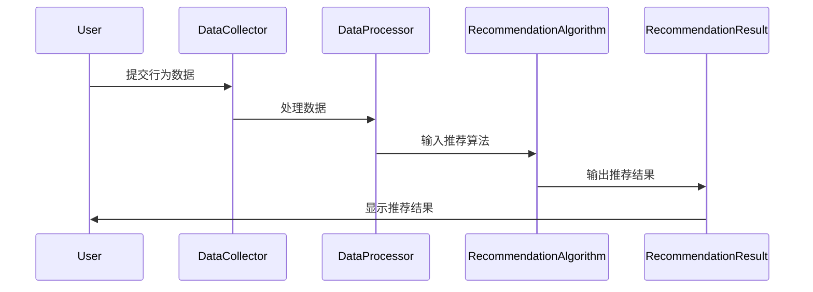
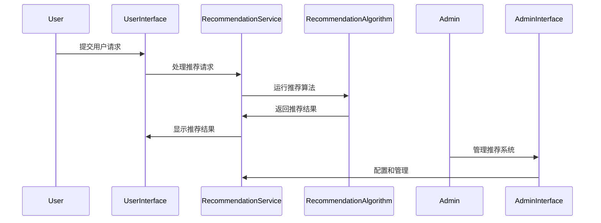

                 

# 数学与推荐系统：个性化推荐的数学原理

关键词：推荐系统、个性化推荐、协同过滤、矩阵分解、神经网络、数学模型

摘要：随着互联网的快速发展，个性化推荐系统已成为现代信息检索和数据分析领域的重要组成部分。本文将从数学原理的角度出发，探讨个性化推荐系统的基础概念、数学模型及其在推荐系统中的应用，旨在为广大开发者提供一套系统的数学原理指导，以深入理解并优化推荐系统的设计与实现。

## 第一部分：数学原理概述

### 1.1 问题背景与概述

推荐系统的发展历程可以追溯到20世纪90年代，随着互联网的兴起和用户数据的积累，推荐系统逐渐成为商家和用户之间的重要桥梁。推荐系统根据用户的行为数据和偏好信息，预测用户可能感兴趣的项目，并为其推荐相应的产品或内容。

在推荐系统中，数学原理扮演着至关重要的角色。数学模型不仅能够帮助我们量化用户和项目之间的关联，还可以通过算法优化推荐效果，提升用户体验。本文将介绍两大核心数学模型：矩阵分解和神经网络。

### 1.2 核心概念

- **个性化推荐**：基于用户的历史行为和偏好信息，为用户推荐其可能感兴趣的项目。
- **协同过滤**：通过分析用户之间的相似性或行为模式，预测用户对未评价项目的评分。
- **隐式反馈**：用户未直接给出的评价，如浏览、收藏、搜索等行为。
- **显式反馈**：用户直接给出的评价，如评分、评论等。
- **数学模型**：如矩阵分解、神经网络等，用于量化用户与项目之间的关联。

## 第二部分：数学原理与推荐系统

### 2.1 数学模型原理讲解

#### 2.1.1 矩阵分解

矩阵分解是一种常用的数学模型，它通过将原始评分矩阵分解为两个低秩矩阵的乘积，来预测用户未评价的项目。

##### 矩阵分解原理

矩阵分解的基本原理是将一个高维的评分矩阵 \(R\) 分解为两个低维的矩阵 \(U\) 和 \(V\)，即 \(R = UV^T\)。

##### SVD分解

奇异值分解（SVD）是矩阵分解的一种常用方法，它可以有效地降低数据的维度，同时保留主要的信息。

$$
R = U\Sigma V^T
$$

其中，\(U\) 和 \(V\) 是正交矩阵，\(\Sigma\) 是对角矩阵，包含奇异值。

##### 推荐系统应用

在推荐系统中，通过矩阵分解，我们可以得到用户和项目的低维表示，从而预测用户对未评价项目的评分。

##### Python代码实现

```python
import numpy as np
from scipy.sparse.linalg import svds

# 假设我们有一个用户-物品评分矩阵 R
R = np.array([[5, 3, 0, 2],
              [0, 1, 1, 0],
              [4, 0, 0, 1],
              [2, 3, 5, 0]])

# 使用奇异值分解进行矩阵分解
U, sigma, Vt = svds(R, k=2)

# 预测用户未评价的物品评分
R_pred = U @ sigma @ Vt
print(R_pred)
```

#### 2.1.2 神经网络

神经网络是一种基于生物神经元的计算模型，它通过层层传递输入信息，进行复杂的数据处理和预测。

##### 神经网络基础

神经网络由输入层、隐藏层和输出层组成，每一层包含多个神经元。

##### 前向传播与反向传播

前向传播是指输入通过网络传递，最终得到输出。反向传播是指根据输出误差，反向更新网络权重。

$$
\Delta W = -\eta \cdot \frac{\partial L}{\partial W}
$$

其中，\(\Delta W\) 是权重更新，\(\eta\) 是学习率，\(L\) 是损失函数。

##### 推荐系统应用

神经网络可以用于处理复杂的用户行为数据和项目特征，从而提高推荐精度。

##### Python代码实现

```python
import tensorflow as tf

# 假设我们有一个简单的神经网络模型
model = tf.keras.Sequential([
    tf.keras.layers.Dense(units=1, input_shape=[1])
])

# 编译模型
model.compile(optimizer='sgd', loss='mean_squared_error')

# 训练模型
model.fit(x_train, y_train, epochs=100)
```

### 2.2 数学公式与详细讲解

#### 2.2.1 矩阵运算

- **矩阵加法**：两个矩阵对应位置元素相加。
  $$ A + B = C $$
- **矩阵乘法**：两个矩阵按一定规则相乘。
  $$ A \cdot B = C $$
- **矩阵求逆**：求出一个矩阵的逆矩阵。
  $$ A^{-1} = B $$

#### 2.2.2 神经网络数学公式

- **激活函数**：用于引入非线性。
  $$ f(x) = \sigma(x) $$
- **损失函数**：用于评估模型预测的准确性。
  $$ L = \frac{1}{2} \sum_{i=1}^{n} (y_i - \hat{y}_i)^2 $$
- **优化算法**：用于更新模型权重。
  $$ \Delta W = -\eta \cdot \frac{\partial L}{\partial W} $$

### 2.3 推荐系统架构设计

#### 2.3.1 系统功能设计

推荐系统的核心功能包括用户建模、商品建模和推荐算法。

##### 领域模型Mermaid类图

```mermaid
classDiagram
    User <<class{用户}>
    Item <<class{商品}>
    Recommendation <<class{推荐系统}>
    User --|> Recommendation
    Item --|> Recommendation
```

##### 系统架构设计

推荐系统的架构主要包括数据采集、数据处理、推荐算法和推荐结果评估。

##### Mermaid架构图



##### 系统接口设计

推荐系统主要包括用户接口和管理接口。

##### Mermaid序列图



### 2.4 项目实战

#### 2.4.1 环境安装

- 安装Python环境和相关库（如NumPy、SciPy、TensorFlow等）。

#### 2.4.2 系统核心实现

- 实现用户建模、商品建模和推荐算法。

##### 代码实现与解读

```python
# 用户建模
class UserModel:
    def __init__(self, user_id, behaviors):
        self.user_id = user_id
        self.behaviors = behaviors

# 商品建模
class ItemModel:
    def __init__(self, item_id, features):
        self.item_id = item_id
        self.features = features

# 推荐算法
class RecommendationAlgorithm:
    def __init__(self, model_type='matrix_factorization'):
        self.model_type = model_type

    def fit(self, X, Y):
        # 训练模型
        pass

    def predict(self, X):
        # 预测结果
        pass
```

#### 2.4.3 实际案例分析与讲解

- 案例一：基于协同过滤的推荐系统。
- 案例二：基于神经网络的推荐系统。

##### 案例分析与解读

```python
# 基于协同过滤的推荐系统
from sklearn.metrics.pairwise import cosine_similarity

# 计算用户之间的相似度
user_similarity = cosine_similarity(user_matrix)

# 推荐算法
class CollaborativeFiltering:
    def __init__(self, similarity_threshold=0.5):
        self.similarity_threshold = similarity_threshold

    def recommend(self, user_id, user_similarity):
        # 根据相似度阈值进行推荐
        pass
```

### 2.5 最佳实践与拓展阅读

#### 2.5.1 最佳实践技巧

- **性能优化**：使用高效的数据结构和算法。
- **可扩展性设计**：设计可扩展的架构，支持大规模数据处理。

#### 2.5.2 小结与注意事项

- 推荐系统设计要点：考虑用户隐私、数据质量和算法效率。
- 实战中的常见问题：如何处理冷启动问题、如何平衡推荐多样性等。

#### 2.5.3 拓展阅读

- **相关书籍**：
  - 《推荐系统实践》
  - 《深度学习推荐系统》
- **最新研究论文**：
  - 《基于内容推荐的深度学习模型》
  - 《协同过滤的改进方法：基于社交网络的影响分析》

## 结语

推荐系统作为人工智能的重要应用之一，正在改变我们的信息获取方式和消费习惯。本文从数学原理的角度出发，详细介绍了推荐系统的基础概念、数学模型及其应用。希望读者能够通过本文，对推荐系统有一个深入的理解，并能够将其应用于实际项目中。

### 作者信息

作者：AI天才研究院/AI Genius Institute & 禅与计算机程序设计艺术 /Zen And The Art of Computer Programming

