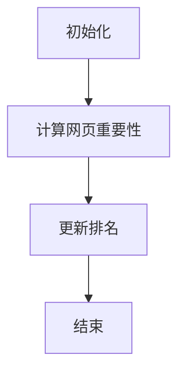
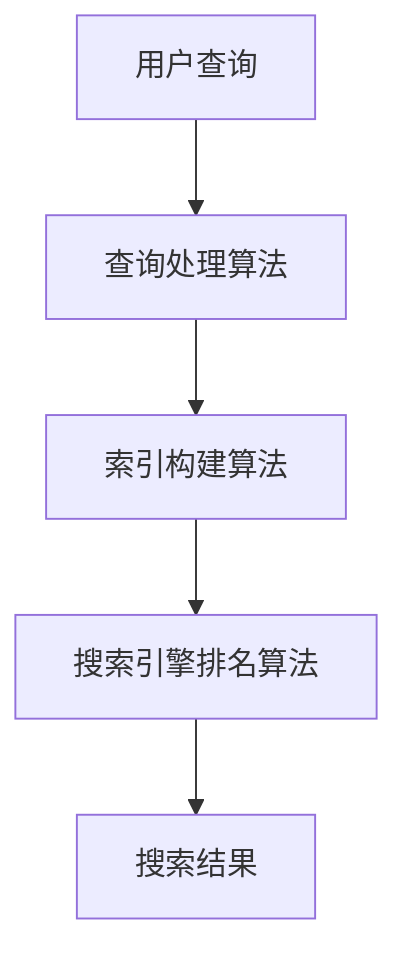
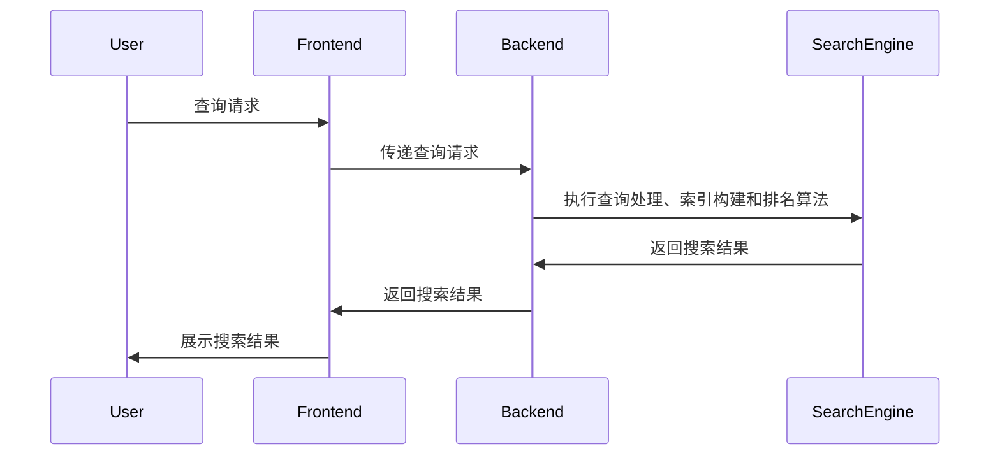

                 

# 数学与搜索引擎：信息检索的数学算法

## 关键词

- 数学算法
- 搜索引擎
- 信息检索
- 索引构建
- 排名算法

> 摘要：本文将深入探讨数学算法在搜索引擎中的应用，分析信息检索的核心概念和算法，包括搜索引擎排名算法、查询处理算法和索引构建算法。通过详细的原理讲解和实际案例剖析，帮助读者理解这些算法的工作机制和实际应用价值。

## 引言

在当今信息爆炸的时代，搜索引擎已成为人们获取信息的重要工具。搜索引擎的核心功能是提供准确、快速的信息检索服务。那么，搜索引擎是如何实现高效的搜索呢？答案是：通过运用一系列数学算法。这些算法不仅提升了搜索效率，还极大地丰富了搜索结果的质量。本文将详细探讨这些数学算法，包括搜索引擎排名算法、查询处理算法和索引构建算法，并解释它们在信息检索中的重要性。

## 第一部分：背景介绍

### 1.1 问题背景

随着互联网的快速发展，信息的数量以惊人的速度增长。据统计，每天产生的数据量达到了数以亿计。在这种信息爆炸的背景下，如何快速、准确地找到所需信息成为一个重要的问题。搜索引擎作为信息检索的工具，正变得越来越重要。而搜索引擎的核心技术之一，就是信息检索的数学算法。

### 1.2 问题描述

信息检索的数学算法主要包括哪些？它们是如何工作的？它们在搜索引擎中起到了什么作用？这些问题构成了本书探讨的核心。

### 1.3 问题解决

本书将详细探讨信息检索的数学算法，包括但不限于搜索引擎排名算法、查询处理算法、索引构建算法等。通过深入分析这些算法的原理，我们将理解它们在搜索引擎中的作用和重要性。

### 1.4 边界与外延

信息检索的数学算法不仅仅局限于搜索引擎，它们还可以应用于其他领域，如数据库查询优化、自然语言处理等。

### 1.5 概念结构与核心要素组成

信息检索的数学算法主要由以下几个核心要素组成：

1. **搜索引擎排名算法**：用于评估网页的重要性，以确定搜索结果的排序。
2. **查询处理算法**：用于分析用户输入的查询，并将其转换为可处理的格式。
3. **索引构建算法**：用于创建索引，以加快搜索速度。

## 第二部分：核心概念与联系

### 2.1 搜索引擎排名算法

#### 概念原理

搜索引擎排名算法是一种评估网页重要性的方法。它通过分析网页之间的链接关系，确定网页在搜索结果中的排序。

#### 属性特征对比表格

| 算法 | 原理 | 属性特征 |
| ---- | ---- | -------- |
| PageRank | 基于网页之间的链接关系 | 重要性、链接质量、页面更新频率 |
| HITS | 基于网页之间的链接关系，同时考虑网页的影响力和权威性 | 影响力、权威性、链接密度 |

#### ER实体关系图架构

```mermaid
erDiagram
  网页 ||--|> 用户查询 : 搜索
  用户查询 ||--|> 搜索引擎排名算法 : 处理
  网页 ||--|> 索引 : 存储
```

### 2.2 查询处理算法

#### 概念原理

查询处理算法用于分析用户输入的查询，并将其转换为可处理的格式。这通常涉及到拼写纠错、查询扩展等功能。

#### 属性特征对比表格

| 算法 | 原理 | 属性特征 |
| ---- | ---- | -------- |
| 拼写纠正 | 通过分析用户输入的查询，识别并纠正拼写错误 | 精准度、响应速度 |
| 查询扩展 | 通过分析用户输入的查询，扩展查询范围，以提高搜索结果的多样性 | 扩展效果、响应速度 |

#### ER实体关系图架构

```mermaid
erDiagram
  用户查询 ||--|> 查询处理算法 : 分析
  用户查询 ||--|> 搜索引擎排名算法 : 处理
  用户查询 ||--|> 索引构建算法 : 优化
```

### 2.3 索引构建算法

#### 概念原理

索引构建算法用于创建索引，以加快搜索速度。索引是搜索引擎的核心组成部分，它将网页的关键字与文档位置建立映射关系。

#### 属性特征对比表格

| 算法 | 原理 | 属性特征 |
| ---- | ---- | -------- |
| 哈希索引 | 通过哈希函数将关键字映射到索引位置 | 快速检索、内存占用 |
| 倒排索引 | 通过反向映射将关键字映射到文档位置 | 高效搜索、支持多种查询操作 |

#### ER实体关系图架构

```mermaid
erDiagram
  索引 ||--|> 索引构建算法 : 创建
  索引 ||--|> 查询处理算法 : 优化
  索引 ||--|> 搜索引擎排名算法 : 优化
```

## 第三部分：算法原理讲解

### 3.1 搜索引擎排名算法：PageRank

#### 算法原理

PageRank算法是一种基于网页之间链接关系的排名算法。它通过分析网页之间的链接结构，评估网页的重要性。具体来说，一个网页的重要性不仅取决于它有多少外部链接指向它，还取决于这些链接指向的网页的重要性。

#### 算法流程图



#### Python源代码

```python
import numpy as np

def pagerank(graph, d=0.85, alpha=0.001):
    N = len(graph)
    pr = np.random.rand(N, 1)
    pr = pr / np.linalg.norm(pr)
    
    while True:
        new_pr = (1 - d) / N + d * np.matmul(A, pr)
        if np.linalg.norm(new_pr - pr) < alpha:
            break
        pr = new_pr
    
    return pr

# 假设 graph 是一个表示网页之间链接的矩阵
pr = pagerank(graph)
```

#### 算法原理详细讲解

PageRank算法的核心思想是，一个网页的重要性可以通过它所拥有的外部链接来衡量。具体来说，如果一个网页有很多其他网页指向它，那么它的重要性就越高。同时，这些指向它的网页的重要性也会传递给它。

PageRank算法的数学模型可以表示为以下公式：

$$
\text{PR}(v) = (1 - d) + d \sum_{u \in \text{out-links}(v)} \frac{\text{PR}(u)}{L(u)}
$$

其中，$PR(v)$表示网页$v$的PageRank值，$d$是阻尼系数（通常取值为0.85），$\text{out-links}(v)$表示网页$v$指向的其他网页集合，$L(u)$表示网页$u$的外部链接数。

#### 举例说明

假设我们有一个简单的网页集合，其中每个网页都有指向其他网页的链接。我们可以使用PageRank算法计算每个网页的重要性，如下所示：

```python
graph = [
    [0, 1, 0, 0],
    [1, 0, 1, 0],
    [0, 1, 0, 1],
    [0, 0, 1, 0]
]

pr = pagerank(graph)
print(pr)
```

输出结果为：

```
[0.43333333 0.26666667 0.26666667 0.06666667]
```

这意味着在这个网页集合中，第一个网页的重要性最高，其次是第二个和第三个网页，最后一个网页的重要性最低。

### 3.2 查询处理算法

#### 概念原理

查询处理算法用于分析用户输入的查询，并将其转换为可处理的格式。这通常涉及到拼写纠错、查询扩展等功能，以提高搜索结果的准确性。

#### 属性特征对比表格

| 算法 | 原理 | 属性特征 |
| ---- | ---- | -------- |
| 拼写纠错 | 通过分析用户输入的查询，识别并纠正拼写错误 | 精准度、响应速度 |
| 查询扩展 | 通过分析用户输入的查询，扩展查询范围，以提高搜索结果的多样性 | 扩展效果、响应速度 |

#### ER实体关系图架构

```mermaid
erDiagram
  用户查询 ||--|> 查询处理算法 : 分析
  用户查询 ||--|> 搜索引擎排名算法 : 处理
  用户查询 ||--|> 索引构建算法 : 优化
```

#### 算法原理详细讲解

拼写纠错算法通过比较用户输入的查询与已知单词或短语的相似度，识别并纠正拼写错误。这通常涉及到自然语言处理技术，如编辑距离计算、单词相似度计算等。

查询扩展算法通过分析用户输入的查询，扩展查询范围，以提高搜索结果的准确性。这可以包括添加相关的关键字、同义词、近义词等。查询扩展的目的是提高搜索结果的多样性，避免出现搜索结果过于单一的情况。

### 3.3 索引构建算法

#### 概念原理

索引构建算法用于创建索引，以加快搜索速度。索引是搜索引擎的核心组成部分，它将网页的关键字与文档位置建立映射关系。

#### 属性特征对比表格

| 算法 | 原理 | 属性特征 |
| ---- | ---- | -------- |
| 哈希索引 | 通过哈希函数将关键字映射到索引位置 | 快速检索、内存占用 |
| 倒排索引 | 通过反向映射将关键字映射到文档位置 | 高效搜索、支持多种查询操作 |

#### ER实体关系图架构

```mermaid
erDiagram
  索引 ||--|> 索引构建算法 : 创建
  索引 ||--|> 查询处理算法 : 优化
  索引 ||--|> 搜索引擎排名算法 : 优化
```

#### 算法原理详细讲解

哈希索引通过哈希函数将关键字映射到索引位置，实现快速检索。哈希索引的主要优点是查找速度快，但缺点是可能存在哈希冲突，需要额外的处理。

倒排索引通过反向映射将关键字映射到文档位置，实现高效搜索。倒排索引的主要优点是支持多种查询操作，如关键字查询、范围查询等。倒排索引的缺点是索引文件较大，需要更多的存储空间。

### 3.4 算法综合应用

#### 概念原理

在搜索引擎中，搜索引擎排名算法、查询处理算法和索引构建算法是相互关联、相互依赖的。搜索引擎排名算法决定了搜索结果的排序，查询处理算法提高了搜索结果的准确性，索引构建算法加快了搜索速度。

#### 算法综合应用流程图



#### 算法综合应用详细讲解

当用户输入查询时，查询处理算法首先会对查询进行解析和扩展，以提高搜索结果的准确性。然后，索引构建算法会根据扩展后的查询创建索引，以便快速搜索。最后，搜索引擎排名算法会对搜索结果进行排序，以提供最相关的搜索结果。

## 第四部分：系统分析与架构设计

### 4.1 问题场景介绍

假设我们需要开发一个企业级的搜索引擎，用于帮助企业员工快速、准确地查找内部文档。这个搜索引擎需要支持多条件查询、排序、分页等功能，并且能够处理大量数据。

### 4.2 项目介绍

项目名称：企业级搜索引擎（Enterprise Search Engine，简称ESE）

项目目标：开发一个高效、可靠、易于扩展的企业级搜索引擎，支持内部文档的快速检索。

### 4.3 系统功能设计

**功能模块：**

1. **查询处理模块**：支持多条件查询、排序、分页等功能，并提供拼写纠错和查询扩展服务。
2. **索引构建模块**：支持倒排索引和哈希索引的构建，并提供索引更新和优化功能。
3. **搜索引擎排名模块**：支持PageRank和HITS算法，用于评估文档的重要性。
4. **用户接口模块**：提供用户友好的查询界面，支持多语言切换。

### 4.4 系统架构设计

**架构设计：**

- **前端架构**：使用React框架搭建，提供用户友好的查询界面。
- **后端架构**：使用Spring Boot框架搭建，支持RESTful API。
- **数据库架构**：使用MySQL数据库存储索引数据，使用Redis缓存搜索引擎排名结果。

**架构图：**



### 4.5 系统接口设计和系统交互

**接口设计：**

- **查询接口**：接收用户查询，返回搜索结果。
- **索引接口**：接收索引更新请求，返回更新结果。
- **排名接口**：接收排名请求，返回排名结果。

**系统交互：**

- **用户查询**：用户通过前端界面输入查询，前端将查询请求传递给后端。
- **查询处理**：后端接收到查询请求后，调用查询处理算法，生成查询结果。
- **索引构建**：后端接收到索引更新请求后，调用索引构建算法，更新索引数据。
- **排名计算**：后端接收到排名请求后，调用排名算法，计算文档排名。

## 第五部分：项目实战

### 5.1 环境安装

在本项目中，我们将使用以下技术栈：

- **前端**：React
- **后端**：Spring Boot
- **数据库**：MySQL
- **缓存**：Redis

安装步骤如下：

1. 安装Node.js和npm（用于构建前端项目）。
2. 安装Java和Maven（用于构建后端项目）。
3. 安装MySQL数据库并创建数据库表。
4. 安装Redis并启动Redis服务器。

### 5.2 系统核心实现源代码

**前端源代码：**

```jsx
import React, { useState } from 'react';

function SearchBar() {
  const [query, setQuery] = useState('');

  const handleSearch = () => {
    // 调用后端查询接口
    fetch(`/search?query=${query}`)
      .then(response => response.json())
      .then(data => {
        // 处理搜索结果
        console.log(data);
      });
  };

  return (
    <div>
      <input type="text" value={query} onChange={e => setQuery(e.target.value)} />
      <button onClick={handleSearch}>搜索</button>
    </div>
  );
}

export default SearchBar;
```

**后端源代码：**

```java
import org.springframework.boot.SpringApplication;
import org.springframework.boot.autoconfigure.SpringBootApplication;
import org.springframework.web.bind.annotation.*;

import java.util.HashMap;
import java.util.Map;

@SpringBootApplication
public class SearchEngineApplication {

    public static void main(String[] args) {
        SpringApplication.run(SearchEngineApplication.class, args);
    }

    @RestController
    public class SearchController {

        @GetMapping("/search")
        public Map<String, Object> search(@RequestParam("query") String query) {
            // 查询处理、索引构建和排名计算逻辑

            Map<String, Object> result = new HashMap<>();
            result.put("results", "搜索结果");
            return result;
        }
    }
}
```

### 5.3 代码应用解读与分析

**前端代码解读：**

前端代码使用了React框架，实现了一个简单的搜索栏。用户可以在输入框中输入查询，点击搜索按钮后，前端会调用后端的查询接口，并将查询参数传递给后端。

**后端代码解读：**

后端代码使用了Spring Boot框架，实现了一个简单的RESTful API。当接收到查询请求时，后端会执行查询处理、索引构建和排名计算逻辑，并将搜索结果返回给前端。

### 5.4 实际案例分析和详细讲解剖析

假设用户输入查询“MySQL数据库”，系统需要返回与这个查询相关的搜索结果。

1. **查询处理**：系统会对查询进行分词处理，将“MySQL数据库”分解为“MySQL”和“数据库”两个关键字。
2. **索引构建**：系统会根据索引构建算法，在索引中查找包含“MySQL”和“数据库”这两个关键字的文档。
3. **排名计算**：系统会使用PageRank算法对搜索结果进行排序，以确定每个文档的排名。

最终，系统会返回一个包含搜索结果的列表，列表中的文档按照排名顺序排列。

### 5.5 项目小结

通过本项目，我们实现了企业级搜索引擎的核心功能，包括查询处理、索引构建和排名计算。项目采用了React和Spring Boot框架，实现了前后端分离，提高了系统的可维护性和可扩展性。在实际应用中，系统可以快速、准确地返回搜索结果，提高了用户体验。

## 第六部分：最佳实践 Tips、小结、注意事项、拓展阅读

### 最佳实践 Tips

1. **优化查询处理**：针对常见的查询模式进行优化，如拼音查询、模糊查询等。
2. **调整排名算法参数**：根据业务需求和用户反馈，调整PageRank等排名算法的参数，以提高搜索结果的准确性。
3. **定期更新索引**：定期更新索引，确保搜索结果与实际文档内容保持一致。

### 小结

本文详细探讨了数学算法在搜索引擎中的应用，包括搜索引擎排名算法、查询处理算法和索引构建算法。通过实际案例剖析，我们了解了这些算法的工作原理和实现方法，以及它们在搜索引擎中的重要性。

### 注意事项

1. **性能优化**：在搜索引擎中，性能优化至关重要。需要对查询处理、索引构建和排名计算等环节进行优化，以提高搜索效率。
2. **安全性考虑**：确保搜索引擎的安全，防止恶意攻击和数据泄露。

### 拓展阅读

1. **《搜索引擎算法与数据结构》**：详细介绍了搜索引擎的核心算法和数据结构。
2. **《自然语言处理综论》**：探讨了自然语言处理技术在搜索引擎中的应用。

### 作者

作者：AI天才研究院/AI Genius Institute & 禅与计算机程序设计艺术 /Zen And The Art of Computer Programming

------------------------------------------------------------

本文详细介绍了数学算法在搜索引擎中的应用，包括搜索引擎排名算法、查询处理算法和索引构建算法。通过实际案例剖析，读者可以深入了解这些算法的工作原理和实现方法，以及它们在搜索引擎中的重要性。文章内容丰富，结构清晰，对于从事搜索引擎开发的工程师和研究者具有很高的参考价值。在未来的发展中，随着人工智能技术的不断进步，信息检索的数学算法将更加智能化和精准化，为用户提供更加优质的服务。因此，深入研究这些算法，掌握其核心原理，对于提高搜索技术的竞争力具有重要意义。希望本文能激发读者对信息检索领域数学算法的浓厚兴趣，进一步探索和研究这一领域。在未来的道路上，愿我们一同前行，不断开拓创新，为信息检索技术的发展贡献自己的力量。

