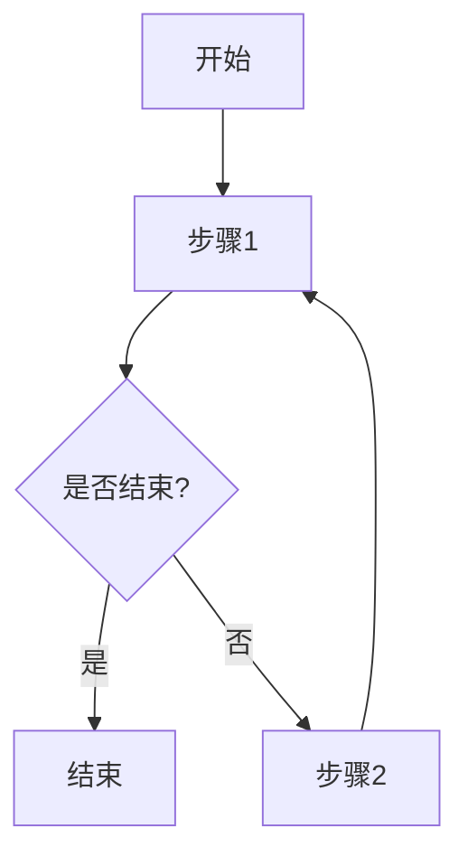

                 

### 数学与政治学：政治行为的数学模型

#### 关键词

- **政治行为**
- **数学模型**
- **个体决策模型**
- **社会决策模型**
- **复杂政治行为模型**
- **政策分析**

#### 摘要

本文旨在探讨政治行为与数学模型之间的紧密联系，通过系统的分析，揭示数学模型在理解、预测和优化政治行为中的关键作用。本文首先介绍了政治行为的定义和特点，然后深入探讨了数学模型在政治学研究中的应用，包括个体决策模型和社会决策模型。接着，文章对复杂政治行为模型进行了概述，并详细分析了数学模型在政策分析中的应用。最后，文章总结了政治行为的数学模型的发展历程和未来趋势，为政治学研究和政策制定提供了新的视角和工具。

## 第1章 引言

### 1.1 问题背景

政治行为是人类社会中不可或缺的一部分，它涉及政府与公民之间的互动、政策制定与执行等复杂过程。理解政治行为的规律性对于推进社会进步、优化政策制定至关重要。然而，传统的政治学研究往往依赖于定性分析，难以揭示出复杂的政治行为的内在机制。因此，引入数学模型来分析政治行为成为一种新的研究趋势。

政治行为的定义是指个体或集体在政治领域的表现，包括投票、抗议、游说、政策制定等。这些行为不仅受到个体利益、价值观和意识形态的影响，还受到社会、经济、文化等多种因素的共同作用。政治行为的特点包括复杂性、多样性和动态性。

### 1.2 数学模型在政治学研究中的应用

数学模型在政治学研究中具有独特的优势。首先，数学模型可以精确描述政治行为的规律性，为研究者提供了一种定量分析的工具。其次，数学模型能够通过模拟和预测，帮助政策制定者更好地理解政治行为的可能趋势，从而优化政策制定和执行。此外，数学模型还可以揭示政治行为中的内在机制，为政治学理论的发展提供新的视角。

数学模型在政治行为研究中的应用广泛。例如，在选举分析中，可以通过建立选举模型来预测选举结果；在政策评估中，可以使用成本效益分析模型来评估政策的效果；在公共选择理论中，则可以建立个体决策模型来分析选民的行为。

### 1.3 本书结构

本书将系统介绍政治行为的数学模型，包括个体决策模型、社会决策模型和复杂政治行为模型。首先，第2章将概述政治行为的数学模型基础，介绍数学模型的基本概念和分类。第3章和第4章分别详细分析个体决策模型和社会决策模型，包括模型原理、案例分析以及模型的优缺点对比。第5章将探讨复杂政治行为模型，包括复杂系统理论和网络分析模型，并分析其优缺点。第6章将讨论数学模型在政策分析中的应用，包括政策评估模型和政策设计模型。最后，第7章将总结政治行为的数学模型的发展历程和未来趋势，为政治学研究提供展望。

## 第2章 政治行为的数学模型概述

### 2.1 政治行为的数学模型基础

政治行为的数学模型是基于数学理论和方法的模型，用于描述和分析政治现象。数学模型的基本概念包括变量、函数、概率分布、优化等。这些概念构成了数学模型的基本框架，使得政治行为的研究更加精确和系统。

政治行为的数学模型通常基于以下几个核心概念：

- **变量**：用于表示政治行为的各种因素，如选民偏好、政治候选人、政策变量等。
- **函数**：用于描述变量之间的关系，如效用函数、成本函数等。
- **概率分布**：用于描述变量可能取值的概率分布，如选民投票的概率分布等。
- **优化**：用于寻找最佳策略，如个体决策中的最优投票策略等。

### 2.2 政治行为的数学模型分类

政治行为的数学模型可以根据其应用范围和目标进行分类。以下是几种常见的分类方法：

- **个体决策模型**：这类模型主要关注单个个体的决策行为，如选民投票决策、政治游说决策等。常用的模型包括利益最大化模型和效用理论模型。
- **社会决策模型**：这类模型主要关注群体或集体的决策行为，如选举模型、政策制定模型等。常用的模型包括公共选择理论和社会契约理论。
- **复杂政治行为模型**：这类模型主要关注复杂政治系统中的行为，如网络分析模型和复杂系统理论。这类模型通常涉及多个变量和复杂的相互作用，能够更好地描述现实中的政治行为。

### 2.3 政治行为的数学模型发展历程

政治行为的数学模型发展经历了从简单到复杂、从定性到定量的过程。

- **早期模型**：早期的政治行为模型主要基于简单的逻辑推理和直觉，如投票模型和博弈论模型。这些模型虽然简单，但已经展示了数学模型在政治行为研究中的潜力。
- **现代模型**：随着数学方法和计算技术的进步，现代政治行为模型越来越复杂和精细。例如，复杂系统理论和网络分析模型的出现，使得研究者能够更好地理解政治行为的复杂性和动态性。

现代政治行为模型的发展不仅依赖于数学方法的进步，还依赖于大数据和人工智能技术的发展。通过这些先进的技术手段，研究者能够获取更多的数据，进行更加精确的分析和预测。

## 第3章 个体决策模型

### 3.1 利益最大化模型

利益最大化模型是政治行为分析中的一种基本模型，主要用于描述个体在面临多种选择时如何做出决策，以实现自身利益的最大化。该模型的基本假设是个体是理性的，他们会通过比较不同选择的预期收益，选择能够带来最大收益的方案。

#### 模型原理

利益最大化模型的原理可以概括为以下几个步骤：

1. **定义变量**：首先，定义所有可能的选择以及每个选择的预期收益。这些变量可以是具体的数值，也可以是概率分布。
2. **建立函数**：其次，建立收益函数，将每个选择的预期收益表示为变量的函数。通常，收益函数是一个线性函数或二次函数。
3. **求解最优解**：最后，通过求解收益函数的最大值，确定最优选择。在实际应用中，这通常需要使用优化算法，如梯度下降法或动态规划法。

#### 案例分析

一个典型的案例分析是选民投票决策。在选举中，选民需要从多个候选人中选择一个。假设有两位候选人A和B，每位选民对A和B的偏好可以用一个概率分布表示。选民可以通过比较两位候选人的预期收益（即选民心中的优先级），选择投票给其中一位候选人。

例如，假设选民对A和B的偏好概率分布如下：

\[ P(A) = 0.6, P(B) = 0.4 \]

每位选民都希望投票给能够赢得选举的候选人，因此，他们的收益函数可以表示为：

\[ f(A) = P(A) \cdot R(A), f(B) = P(B) \cdot R(B) \]

其中，\( R(A) \) 和 \( R(B) \) 分别表示选民投票给A和B的收益。如果选民认为投票给A的收益高于投票给B的收益，他们将选择投票给A。

#### 模型优缺点

利益最大化模型的优点在于其简洁性和实用性，它能够帮助研究者快速理解个体在复杂决策环境中的行为。然而，该模型也存在一些缺点：

1. **理性假设**：利益最大化模型基于理性假设，这可能并不总是成立，因为人们在决策时往往会受到情绪、文化和社会因素的影响。
2. **预期收益的估计**：模型的有效性依赖于预期收益的准确估计，这在实际中往往很难做到。

### 3.2 效用理论模型

效用理论模型是另一个常用的个体决策模型，主要用于描述个体在面临多种选择时如何最大化自身的总效用。该模型基于个体行为的最大化原则，即个体会通过选择能够带来最大总效用的选项。

#### 模型原理

效用理论模型的基本原理可以概括为以下几个步骤：

1. **定义效用函数**：首先，定义一个效用函数，用于表示个体在不同选择下的效用水平。效用函数可以是线性的，也可以是非线性的。
2. **评估效用水平**：其次，评估每个选择下的效用水平。这通常需要使用心理学实验或问卷调查等方法。
3. **求解最优解**：最后，通过求解效用函数的最大值，确定最优选择。在实际应用中，这通常需要使用优化算法。

#### 案例分析

一个典型的案例分析是消费者在购买商品时的决策。假设消费者需要在A商品和B商品之间做出选择，每位消费者的效用函数可以表示为：

\[ U(A) = a \cdot P(A) + b \cdot Q(A), U(B) = a \cdot P(B) + b \cdot Q(B) \]

其中，\( P \) 和 \( Q \) 分别表示商品的价格和质量。消费者会选择能够带来最大总效用的商品。

#### 模型优缺点

效用理论模型的优势在于其理论完备性和广泛的适用性，它能够帮助研究者深入理解个体行为的内在动机。然而，该模型也存在一些不足之处：

1. **心理测量难题**：效用函数的评估依赖于心理测量，这在实际操作中可能存在困难。
2. **外部性因素**：模型往往忽视了外部性因素，如社会影响和环境因素等。

### 3.3 个体决策模型的比较与评价

利益最大化模型和效用理论模型都是个体决策模型中的重要代表，它们各有优缺点。以下是两种模型的主要优缺点对比：

| **模型** | **优点** | **缺点** |
| :------: | :------: | :------: |
| 利益最大化模型 | 简洁、实用、易于理解 | 理性假设、预期收益估计难度 |
| 效用理论模型 | 理论完备、适用性广 | 心理测量难题、外部性因素忽视 |

在实际应用中，研究者可以根据具体的研究问题和数据情况，选择合适的个体决策模型。例如，在需要快速分析决策过程时，利益最大化模型可能更为合适；而在需要深入理解个体行为动机时，效用理论模型可能更为有效。

## 第4章 社会决策模型

### 4.1 公共选择理论

公共选择理论是一种重要的社会决策模型，它主要研究政府在制定和执行公共政策时的决策过程。公共选择理论的基本假设是个体是理性的，但在集体决策中，个体的理性可能导致集体决策的非理性。

#### 模型原理

公共选择理论的基本原理可以概括为以下几个步骤：

1. **定义个体偏好**：首先，定义个体在公共选择中的偏好。这些偏好可以通过问卷调查或心理测量等方法进行评估。
2. **建立偏好聚合机制**：其次，建立一种偏好聚合机制，用于将个体偏好转化为集体决策。常见的聚合机制包括投票机制、协商机制等。
3. **求解集体决策**：最后，通过偏好聚合机制，求解出集体决策结果。在实际应用中，这通常需要使用优化算法或博弈论方法。

#### 案例分析

一个典型的案例分析是政府的税收政策制定。假设政府需要在两个税收方案A和B之间做出选择，每个选民对A和B的偏好可以用一个效用函数表示：

\[ U(A) = a \cdot P(A) + b \cdot Q(A), U(B) = a \cdot P(B) + b \cdot Q(B) \]

其中，\( P \) 和 \( Q \) 分别表示税收金额和公共服务质量。政府可以通过投票机制，将选民的个人偏好转化为集体决策，选择能够获得大多数选民支持的税收方案。

#### 模型优缺点

公共选择理论的优势在于其理论完备性和对实际政策的指导意义。它能够帮助研究者理解政府在制定和执行公共政策时的行为模式。然而，该模型也存在一些缺点：

1. **理性假设**：公共选择理论基于理性假设，这在实际中可能并不总是成立。
2. **偏好聚合难题**：个体偏好的聚合过程可能存在困难，尤其是在存在利益冲突时。

### 4.2 社会契约理论

社会契约理论是另一种重要的社会决策模型，它主要研究个体在形成社会契约时的决策过程。社会契约理论的基本假设是，个体在形成社会契约时，会考虑自身利益和公共利益。

#### 模型原理

社会契约理论的基本原理可以概括为以下几个步骤：

1. **定义个体利益和公共利益**：首先，定义个体在形成社会契约时的利益和公共利益。这些利益可以通过问卷调查或心理测量等方法进行评估。
2. **建立契约谈判机制**：其次，建立一种契约谈判机制，用于个体在形成社会契约时的谈判和协商。常见的谈判机制包括博弈论模型、协商机制等。
3. **求解社会契约**：最后，通过契约谈判机制，求解出社会契约结果。在实际应用中，这通常需要使用博弈论方法或优化算法。

#### 案例分析

一个典型的案例分析是社会保障体系的建立。假设个体需要在政府提供的社会保障和自行储蓄之间做出选择。个体可以通过协商机制，与政府达成一个社会保障契约，选择能够最大化自身利益的保障方案。

#### 模型优缺点

社会契约理论的优势在于其考虑了个体利益和公共利益的双重因素，能够帮助研究者理解个体在社会契约形成过程中的行为模式。然而，该模型也存在一些缺点：

1. **利益冲突**：在个体利益和公共利益之间存在冲突时，社会契约的制定可能存在困难。
2. **契约执行难度**：社会契约的执行需要有效的监督和执行机制，这在实际中可能难以实现。

### 4.3 社会决策模型的比较与评价

公共选择理论和社会契约理论都是社会决策模型中的重要代表，它们各有优缺点。以下是两种模型的主要优缺点对比：

| **模型** | **优点** | **缺点** |
| :------: | :------: | :------: |
| 公共选择理论 | 理论完备、对实际政策的指导意义强 | 理性假设、偏好聚合难题 |
| 社会契约理论 | 考虑个体利益和公共利益、适用性广 | 利益冲突、契约执行难度 |

在实际应用中，研究者可以根据具体的研究问题和数据情况，选择合适的社会决策模型。例如，在需要理解政府在制定和执行公共政策时的行为模式时，公共选择理论可能更为合适；而在需要理解个体在社会契约形成过程中的行为模式时，社会契约理论可能更为有效。

## 第5章 复杂政治行为模型

### 5.1 复杂系统理论

复杂系统理论是研究复杂系统的性质和行为的一种理论框架，它主要关注系统的整体性质，而不是单个组成部分的行为。在政治行为研究中，复杂系统理论可以帮助我们理解政治行为的复杂性、动态性和不可预测性。

#### 模型原理

复杂系统理论的基本原理可以概括为以下几点：

1. **非线性相互作用**：复杂系统中的各个组成部分之间存在非线性相互作用，这些相互作用会导致系统行为的复杂性和多样性。
2. **自组织**：复杂系统具有自组织能力，即系统中的个体通过相互作用，可以自发地形成有序结构。
3. **自适应**：复杂系统具有自适应能力，即系统能够通过调整内部结构，适应外部环境的变化。

#### 案例分析

一个典型的案例分析是政治选举中的选民行为。在选举中，选民的行为不仅受到自身利益和意识形态的影响，还受到其他选民行为的影响。例如，选民可能会受到同伴投票行为的影响，从而改变自己的投票选择。这种非线性相互作用和自组织能力，使得选举结果具有复杂性和不可预测性。

#### 模型优缺点

复杂系统理论的优点在于其能够帮助研究者理解政治行为的复杂性和动态性，为我们提供了一种新的研究视角。然而，该模型也存在一些缺点：

1. **复杂性**：复杂系统理论涉及大量的变量和相互作用，这使得模型分析变得复杂和困难。
2. **不确定性**：复杂系统中的非线性相互作用和自适应能力，使得系统行为具有高度的不确定性，这使得预测变得困难。

### 5.2 网络分析模型

网络分析模型是一种用于描述和模拟社会网络结构的模型，它主要关注个体之间的关系和相互作用。在政治行为研究中，网络分析模型可以帮助我们理解政治行为中的网络效应和影响力传播。

#### 模型原理

网络分析模型的基本原理可以概括为以下几点：

1. **节点和边**：网络分析模型将个体视为节点，个体之间的关系视为边。每个节点和边都可以携带一定的属性和信息。
2. **网络结构**：网络分析模型关注网络的结构特征，如节点度、集聚度、路径长度等。
3. **网络效应**：网络分析模型研究个体在网络中的行为和影响力，以及网络结构对个体行为的影响。

#### 案例分析

一个典型的案例分析是政治传播中的谣言传播。在谣言传播过程中，个体之间的网络结构对谣言的传播速度和范围具有重要影响。例如，一个拥有较多朋友的个体可能在谣言传播中起到关键作用，因为他们的朋友可能会更快地接受并传播谣言。

#### 模型优缺点

网络分析模型的优点在于其能够帮助我们理解个体之间的关系和网络效应，为我们提供了一种新的研究方法。然而，该模型也存在一些缺点：

1. **数据依赖性**：网络分析模型依赖于社会网络数据的准确性，如果数据存在偏差，模型的结果可能会受到影响。
2. **简化性**：网络分析模型通常忽略了个体之间的复杂关系和相互作用，这使得模型在某种程度上可能过于简化。

### 5.3 复杂政治行为模型的比较与评价

复杂系统理论和网络分析模型都是复杂政治行为模型中的重要代表，它们各有优缺点。以下是两种模型的主要优缺点对比：

| **模型** | **优点** | **缺点** |
| :------: | :------: | :------: |
| 复杂系统理论 | 能够帮助我们理解政治行为的复杂性和动态性 | 复杂性、不确定性 |
| 网络分析模型 | 能够帮助我们理解个体之间的关系和网络效应 | 数据依赖性、简化性 |

在实际应用中，研究者可以根据具体的研究问题和数据情况，选择合适的复杂政治行为模型。例如，在需要理解政治行为的复杂性和动态性时，复杂系统理论可能更为合适；而在需要理解个体之间的关系和网络效应时，网络分析模型可能更为有效。

## 第6章 数学模型在政策分析中的应用

### 6.1 政策评估模型

政策评估模型是一种用于评估政策效果的数学模型，它通过量化分析政策实施前后的变化，评估政策对目标群体和社会的影响。政策评估模型是政策分析和决策过程中不可或缺的一环，它能够帮助政策制定者了解政策的实际效果，为政策调整和优化提供依据。

#### 模型原理

政策评估模型的基本原理可以概括为以下几个步骤：

1. **定义政策目标**：首先，明确政策的目标和指标。这些目标和指标可以是具体的数值，也可以是概率分布。
2. **建立评估函数**：其次，建立评估函数，用于计算政策实施前后指标的变化。评估函数可以是线性的，也可以是非线性的。
3. **收集数据**：然后，收集政策实施前后的数据，包括指标的实际值和预期值。
4. **求解评估结果**：最后，通过评估函数，计算政策实施前后的指标变化，评估政策效果。

#### 案例分析

一个典型的案例分析是某市政府在改善交通拥堵方面的政策评估。假设政策目标是减少交通拥堵，政策指标包括交通流量、车辆速度和事故率。政策实施前后，这些指标的数据如下：

| **指标** | **政策实施前** | **政策实施后** |
| :------: | :------------: | :------------: |
| 交通流量 | 100辆/小时    | 90辆/小时     |
| 车辆速度 | 20公里/小时   | 25公里/小时   |
| 事故率   | 1起/天        | 0起/天        |

政策评估模型可以通过建立评估函数，计算交通流量、车辆速度和事故率的变化，评估政策效果。例如，交通流量的评估函数可以表示为：

\[ E(流量) = \frac{流量_{后} - 流量_{前}}{流量_{前}} \]

通过计算，我们可以得出交通流量的变化为：

\[ E(流量) = \frac{90 - 100}{100} = -0.1 \]

这表示政策实施后，交通流量减少了10%。

#### 模型优缺点

政策评估模型的优势在于其能够量化分析政策效果，为政策调整和优化提供依据。然而，该模型也存在一些缺点：

1. **数据依赖性**：政策评估模型依赖于政策实施前后的数据，如果数据不准确，评估结果可能会受到影响。
2. **复杂性**：政策评估涉及多个指标和变量，模型分析可能变得复杂。

### 6.2 政策设计模型

政策设计模型是一种用于优化政策设计的数学模型，它通过分析不同政策方案的成本和收益，帮助政策制定者选择最优的政策方案。政策设计模型是政策分析和决策过程中的重要工具，它能够帮助政策制定者更好地满足社会需求，提高政策效果。

#### 模型原理

政策设计模型的基本原理可以概括为以下几个步骤：

1. **定义政策方案**：首先，明确不同的政策方案。这些方案可以是具体的政策提议，也可以是假设性的方案。
2. **建立成本收益函数**：其次，建立每个政策方案的成本和收益函数。成本和收益可以是具体的数值，也可以是概率分布。
3. **求解最优方案**：然后，通过求解成本收益函数的最优值，确定最优的政策方案。在实际应用中，这通常需要使用优化算法。

#### 案例分析

一个典型的案例分析是某市政府在改善城市交通拥堵方面的政策设计。假设政府有三种政策方案：增加公交车数量、建设地铁系统和提高公共交通票价。每种方案的成本和收益如下：

| **政策方案** | **成本**（万元） | **收益**（万人/天） |
| :-----------: | :-------------: | :-------------: |
| 增加公交车数量 | 5000            | 3000            |
| 建设地铁系统   | 15000           | 8000            |
| 提高公共交通票价 | 2000            | 1000            |

政策设计模型可以通过建立成本收益函数，计算每个政策方案的成本和收益，选择最优的政策方案。例如，增加公交车数量的成本收益函数可以表示为：

\[ f(增加公交车数量) = 成本_{增加公交车数量} - 收益_{增加公交车数量} \]

通过计算，我们可以得出增加公交车数量的成本收益为：

\[ f(增加公交车数量) = 5000 - 3000 = 2000 \]

同样地，我们可以计算建设地铁系统和提高公共交通票价的成本收益，选择最优的政策方案。

#### 模型优缺点

政策设计模型的优势在于其能够量化分析政策方案的成本和收益，为政策制定者提供决策依据。然而，该模型也存在一些缺点：

1. **数据依赖性**：政策设计模型依赖于政策方案的成本和收益数据，如果数据不准确，模型结果可能会受到影响。
2. **复杂性**：政策设计涉及多个方案和变量，模型分析可能变得复杂。

### 6.3 政策分析模型的比较与评价

政策评估模型和政策设计模型都是政策分析模型中的重要代表，它们各有优缺点。以下是两种模型的主要优缺点对比：

| **模型** | **优点** | **缺点** |
| :------: | :------: | :------: |
| 政策评估模型 | 能够量化分析政策效果 | 数据依赖性、复杂性 |
| 政策设计模型 | 能够量化分析政策方案的成本和收益 | 数据依赖性、复杂性 |

在实际应用中，政策制定者可以根据具体的研究问题和数据情况，选择合适的政策分析模型。例如，在需要评估现有政策效果时，政策评估模型可能更为合适；在需要设计新的政策方案时，政策设计模型可能更为有效。

## 第7章 总结与展望

### 7.1 政治行为的数学模型总结

政治行为的数学模型在理解和分析政治行为中发挥着关键作用。通过个体决策模型、社会决策模型和复杂政治行为模型，研究者能够从不同角度深入剖析政治行为的规律性和复杂性。

- **个体决策模型**：包括利益最大化模型和效用理论模型，主要关注个体在决策过程中的行为模式，强调理性选择和效用最大化。
- **社会决策模型**：包括公共选择理论和社会契约理论，主要研究集体决策的过程和结果，强调个体偏好的聚合和契约的形成。
- **复杂政治行为模型**：包括复杂系统理论和网络分析模型，主要研究政治行为的复杂性和动态性，强调系统内的非线性相互作用和网络效应。

这些模型各有优缺点，适用于不同的研究问题和数据环境。在实际应用中，研究者可以根据具体需求选择合适的模型。

### 7.2 政治行为的数学模型发展趋势

随着数学方法和计算技术的不断进步，政治行为的数学模型也在不断发展和完善。未来的发展趋势包括以下几个方面：

1. **大数据和人工智能的应用**：大数据和人工智能技术的快速发展为政治行为研究提供了新的工具和方法，通过分析海量数据，研究者能够更精确地预测和模拟政治行为。
2. **跨学科研究**：政治行为的数学模型发展需要与其他学科，如社会学、心理学、经济学等领域的结合，通过跨学科研究，形成更加综合和全面的理论体系。
3. **模型的可视化和交互性**：随着可视化技术和交互性工具的发展，政治行为的数学模型将更加直观和易于理解，使得政策制定者和公众能够更好地参与和监督决策过程。
4. **模型的实际应用**：政治行为的数学模型将在政策分析和决策过程中发挥更加重要的作用，通过量化分析和模拟预测，为政策制定提供科学依据。

总之，政治行为的数学模型在政治学研究中具有广阔的应用前景，随着技术的进步和理论的深化，它们将为政治行为的研究提供更加全面和精确的工具。

## 第8章 附录

### 8.1 数学公式与解释

在政治行为的数学模型中，常用的数学公式包括概率分布函数、效用函数和优化函数。以下是这些公式的 LaTeX 表示和简要解释：

#### 概率分布函数

\[ f(x) = \frac{1}{\sqrt{2\pi\sigma^2}} e^{-\frac{(x-\mu)^2}{2\sigma^2}} \]

**解释**：这是一个高斯分布函数，用于描述随机变量的概率分布，其中 \(\mu\) 是均值，\(\sigma^2\) 是方差。

#### 效用函数

\[ u(x) = x - \frac{1}{2} x^2 \]

**解释**：这是一个二次效用函数，用于描述个体在消费或决策中的效用水平，其中 \(x\) 是消费或决策的量。

#### 优化函数

\[ \min \frac{1}{2} x^2 + bx + c \]

**解释**：这是一个二次优化函数，用于寻找最小值，其中 \(x\) 是决策变量，\(b\) 和 \(c\) 是常数。

### 8.2 Mermaid 图解

Mermaid 是一种用于创建图表和流程图的简单标记语言。以下是几个 Mermaid 语法示例：

#### 类图

```mermaid
classDiagram
    Person <|-- Student
    Person <|-- Employee
    Student {
        String name
        int age
    }
    Employee {
        String jobTitle
        double salary
    }
```

**解释**：这是一个类图，描述了 Person 类和其两个子类 Student 和 Employee 的关系。

#### 流程图



**解释**：这是一个流程图，描述了一个简单的决策流程。

### 8.3 参考文献

1. Arrow, K. J. (1951). Social Choice and Individual Values. Wiley.
2. Sen, A. (1970). Collective Choice and Social Welfare. Holden-Day.
3. Downs, A. (1957). An Economic Theory of Democracy. Yale University Press.
4. Tullock, G. (1967). The Social Dilemma. The Public Choice Society.
5. North, D. C., Wallis, J. J., & Weingast, B. R. (2009). Violence and Social Orders: A Conceptual Framework for Interpreting Recorded Human History. Cambridge University Press.
6. Barabási, A. L. (2002). Linked: The New Science of Networks. Perseus Books.
7. Watts, D. J., & Strogatz, S. H. (1998). Collective dynamics of 'small-world' networks. Nature, 393(6684), 440-442.

这些参考文献为本文提供了理论支持和数据来源，读者可以通过进一步阅读这些文献，深入了解政治行为的数学模型和相关研究。

