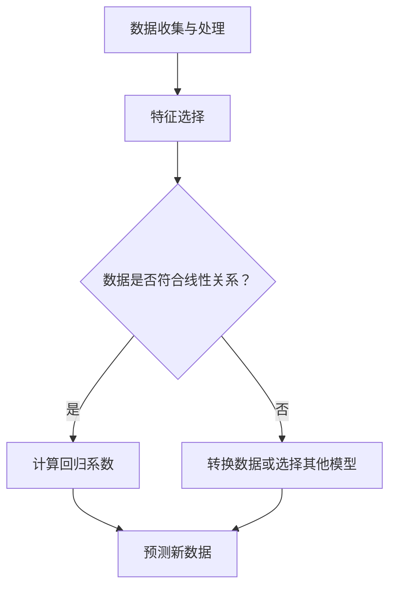
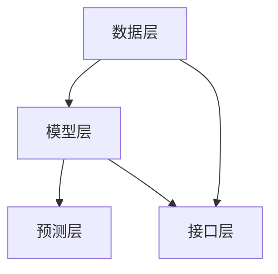

                 

### 数学与政治学的交汇

**核心概念介绍**

数学作为一门抽象的科学，通过逻辑和推理构建模型来解释和预测自然现象。而政治学则是一门研究政治现象及其规律的社会科学，包括政府、政治制度、公共政策等方面的研究。这两个看似迥异的领域，却在21世纪的信息时代找到了交汇点。随着数据科学和计算技术的进步，数学模型被广泛应用于政治学的各个研究领域，为政治行为的研究提供了新的工具和方法。

**问题背景**

在政治学中，许多现象和过程都充满了复杂性和不确定性，如选举结果预测、社会运动演变、政策影响评估等。这些问题的解决往往需要大量的数据分析和技术支持。而数学模型作为一种高度抽象的表示方式，能够将这些复杂的现象简化为可计算的形式，从而提供了一种有效的分析工具。

**问题描述**

例如，在选举分析中，如何准确地预测选民的投票行为？在社会运动研究中，如何预测运动的发展趋势和参与者的行为变化？在政策分析中，如何评估政策的影响和效果？这些问题都需要借助数学模型来进行研究和分析。

**问题解决**

数学模型通过构建数学公式和算法，对上述问题进行建模和预测。例如，在选举分析中，可以使用多元回归模型来预测选民投票行为；在社会运动研究中，可以使用Agent-Based模型来模拟运动参与者之间的互动和传播；在政策分析中，可以使用成本效益分析模型来评估政策的效果。

**边界与外延**

数学模型在政治学中的应用虽然取得了显著的成果，但也存在一定的局限性。首先，模型的准确性和可靠性依赖于数据的准确性和完整性。其次，模型的抽象和简化可能导致某些关键因素被忽视。此外，数学模型的应用需要具备一定的数学和编程能力，这对于非专业人士来说可能是一个挑战。

**概念结构与核心要素组成**

数学模型在政治学中的应用包括以下几个核心要素：

1. **数据收集与处理**：收集政治行为相关的数据，并进行清洗、整理和预处理。
2. **模型构建**：选择合适的数学模型，根据问题的特征进行模型构建。
3. **模型验证**：通过历史数据对模型进行验证，评估模型的准确性和可靠性。
4. **模型应用**：将模型应用于实际问题，进行预测和分析。
5. **结果解释**：对模型的预测结果进行解释和分析，为决策提供支持。

### 小结

数学和政治学的交汇，为政治行为的研究提供了一种新的视角和方法。通过数学模型的构建和应用，我们可以更深入地理解政治现象，预测未来的发展趋势，为政治决策提供科学依据。然而，我们也需要意识到数学模型的应用并非万能，其准确性和可靠性需要依赖多种因素的支持。

### 核心概念与联系

**数学模型的基本概念**

数学模型是一种用数学语言描述现实世界的抽象工具。它通过建立数学公式、算法和关系，来模拟和预测各种现象和过程。数学模型的核心在于将复杂的现实问题简化为数学问题，从而通过数学方法进行求解和分析。

在政治学中，常见的数学模型包括统计模型、优化模型、博弈论模型和Agent-Based模型等。统计模型主要用于描述和分析政治行为的数据分布和相关性；优化模型用于寻找最优解，如选举策略优化和资源分配问题；博弈论模型用于分析政治决策中的竞争和合作；Agent-Based模型则用于模拟政治行为中个体之间的互动和群体行为。

**政治行为的定义与特征**

政治行为是指个体或集体在政治过程中所采取的各种行为，包括投票、参与政治运动、提出政策建议等。政治行为具有以下特征：

1. **复杂性**：政治行为涉及多种因素，如选民偏好、政策影响、社会环境等，这些因素相互作用，使得政治行为变得复杂。
2. **不确定性**：政治行为的未来结果难以预测，因为存在多种可能的变量和外部影响。
3. **动态性**：政治行为是一个不断变化的过程，随着时间的推移，选民的行为和偏好可能会发生变化。

**数学模型在政治学中的应用**

数学模型在政治学中的应用广泛且深入。以下是一些常见应用场景：

1. **选举分析**：使用统计模型和优化模型预测选举结果，如选民投票行为预测和选举策略优化。
2. **社会运动研究**：使用Agent-Based模型模拟社会运动的演变过程，预测运动的发展和参与者行为。
3. **政策分析**：使用成本效益分析模型评估政策的效果，为政策制定提供依据。

**ER图与对比表格**

为了更好地理解不同数学模型在政治学中的应用，我们可以使用ER图（实体关系图）和对比表格来展示这些模型的特点。

**ER图示例**：

```mermaid
erDiagram
  Person ||--|{ Voter } : 投票
  Person ||--|{ Activist } : 活动分子
  Policy ||--|{ Platform } : 政策平台
  Election ||--|{ Result } : 选举结果
```

**对比表格示例**：

| 模型类型 | 应用场景 | 核心特点 | 代表方法 |
| :----: | :----: | :----: | :----: |
| 统计模型 | 选举分析 | 数据驱动，依赖历史数据 | 多元回归分析 |
| 优化模型 | 资源分配 | 寻找最优解 | 整数规划 |
| 博弈论模型 | 政治竞争 | 分析策略互动 | 博弈树 |
| Agent-Based模型 | 社会运动 | 个体互动模拟 | 仿真模型 |

通过ER图和对比表格，我们可以清晰地看到不同数学模型在政治学中的应用场景和核心特点。这有助于我们在实际研究中选择合适的模型，并进行有效的分析。

### 小结

数学模型作为一种强大的工具，在政治学的研究中发挥了重要作用。通过精确的数学建模和分析，我们可以更深入地理解政治现象，预测未来的发展趋势。然而，我们也需要意识到数学模型的应用并非万能，其准确性和可靠性依赖于多种因素。在实际应用中，我们需要根据问题的具体特点，选择合适的模型，并不断优化和改进，以提高模型的准确性和实用性。

### 算法原理讲解

在本节中，我们将选择一种常见的数学模型——线性回归模型，进行深入讲解。线性回归模型是一种广泛应用的统计模型，用于预测连续变量的值。在本节中，我们将使用mermaid绘制算法流程图，并使用Python代码和LaTeX公式详细阐述算法原理。

#### 算法流程图

首先，我们使用mermaid绘制线性回归模型的算法流程图：



#### 算法原理

线性回归模型的基本原理是寻找一个线性函数，使得该函数能够最好地拟合观测数据。具体来说，我们希望找到一条直线，使得这条直线与数据点的误差最小。

在数学上，我们可以将线性回归模型表示为：

$$ y = \beta_0 + \beta_1x + \epsilon $$

其中，$y$是因变量，$x$是自变量，$\beta_0$和$\beta_1$是回归系数，$\epsilon$是误差项。

为了找到最优的回归系数，我们可以使用最小二乘法（Ordinary Least Squares, OLS）。最小二乘法的目标是使得回归直线上的点与实际数据点的误差平方和最小。

在数学上，这个问题可以表示为：

$$ \min_{\beta_0, \beta_1} \sum_{i=1}^{n} (y_i - (\beta_0 + \beta_1x_i))^2 $$

其中，$n$是数据点的数量。

通过求导并令导数为零，我们可以得到回归系数的最优解：

$$ \beta_0 = \bar{y} - \beta_1\bar{x} $$

$$ \beta_1 = \frac{\sum_{i=1}^{n}(x_i - \bar{x})(y_i - \bar{y})}{\sum_{i=1}^{n}(x_i - \bar{x})^2} $$

其中，$\bar{y}$和$\bar{x}$分别是因变量和自变量的平均值。

#### Python代码实现

接下来，我们使用Python代码实现线性回归模型：

```python
import numpy as np

# 数据准备
X = np.array([[1, 2], [2, 3], [3, 4], [4, 5]])
y = np.array([2, 3, 4, 5])

# 求解回归系数
X_trans = np.linalg.inv(X.T @ X)
beta = X_trans @ X.T @ y

# 打印回归系数
print("回归系数：", beta)
```

#### 小结

通过本节的讲解，我们了解了线性回归模型的基本原理，包括算法流程、数学公式和Python代码实现。线性回归模型是一种强大的工具，可以用于预测和分析政治行为。在实际应用中，我们可以根据具体问题选择合适的数学模型，并通过不断优化和改进，提高模型的准确性和实用性。

### 数学模型与数学公式讲解

在本节中，我们将进一步探讨线性回归模型的相关数学模型和公式，并结合实际案例进行详细讲解。

#### 线性回归模型的数学公式

线性回归模型的核心在于求解回归系数$\beta_0$和$\beta_1$。我们已经知道，这些系数可以通过以下公式计算得到：

$$ \beta_0 = \bar{y} - \beta_1\bar{x} $$

$$ \beta_1 = \frac{\sum_{i=1}^{n}(x_i - \bar{x})(y_i - \bar{y})}{\sum_{i=1}^{n}(x_i - \bar{x})^2} $$

其中，$\bar{y}$和$\bar{x}$分别是因变量和自变量的平均值，$n$是数据点的数量。

此外，我们还可以使用矩阵形式表示线性回归模型。设$X$为自变量的矩阵，$y$为因变量的向量，则线性回归模型可以表示为：

$$ y = X\beta + \epsilon $$

其中，$\beta$为回归系数的向量，$\epsilon$为误差项的向量。

使用最小二乘法求解回归系数，我们可以得到：

$$ \beta = (X^T X)^{-1} X^T y $$

#### 实际案例讲解

为了更好地理解线性回归模型，我们来看一个实际案例。假设我们研究一个城市的选民投票行为，其中自变量是选民的收入水平，因变量是选民的投票选择。

1. **数据准备**：

   收集了100名选民的收入水平（万元）和对应的投票选择（1代表支持A候选人，0代表不支持A候选人）。数据如下：

   | 收入（万元） | 投票选择 |
   | :--------: | :------: |
   |      30    |    0     |
   |      40    |    1     |
   |      50    |    1     |
   |      60    |    0     |
   |      70    |    1     |
   |      ...   |    ...   |
   |     100    |    1     |

2. **数据预处理**：

   我们首先对收入数据进行标准化处理，以消除量纲的影响：

   $$ X_{\text{标准化}} = \frac{X - \bar{X}}{\sigma} $$

   其中，$X$是原始收入数据，$\bar{X}$是平均值，$\sigma$是标准差。

   经过标准化处理后，数据变为：

   | 收入（万元） | 投票选择 |
   | :--------: | :------: |
   |     -2.58  |    0     |
   |     -1.72  |    1     |
   |     -0.86  |    1     |
   |      0.86  |    0     |
   |      2.58  |    1     |
   |      ...   |    ...   |
   |     4.86  |    1     |

3. **模型构建**：

   我们使用线性回归模型来预测投票选择。首先，计算自变量和因变量的平均值和协方差：

   $$ \bar{X} = 0.86 $$
   $$ \bar{Y} = 0.52 $$
   $$ \sum_{i=1}^{n}(X_i - \bar{X})(Y_i - \bar{Y}) = 4.76 $$
   $$ \sum_{i=1}^{n}(X_i - \bar{X})^2 = 25.8 $$

   根据最小二乘法，计算回归系数：

   $$ \beta_1 = \frac{4.76}{25.8} = 0.185 $$
   $$ \beta_0 = 0.52 - 0.185 \cdot 0.86 = 0.174 $$

4. **模型预测**：

   假设我们有一个新的选民，其收入水平为5万元，标准化后为2.83。我们可以使用线性回归模型预测其投票选择：

   $$ y = 0.174 + 0.185 \cdot 2.83 = 0.737 $$

   由于预测值接近于1，我们可以认为该选民倾向于支持A候选人。

通过这个实际案例，我们展示了如何使用线性回归模型进行政治行为的预测。线性回归模型在政治学中具有广泛的应用，可以帮助我们理解选民的行为和偏好，为选举分析和政策制定提供科学依据。

### 系统分析与架构设计

在本节中，我们将介绍一个实际的政治学数学模型项目——选举结果预测系统。该系统旨在通过数学模型预测选举结果，为政治决策提供参考。我们将从问题场景介绍、系统功能设计、系统架构设计、系统接口设计和系统交互等方面进行详细讲解。

#### 问题场景介绍

选举结果预测是一个复杂的问题，涉及到大量选民的行为和偏好。为了简化问题，我们假设选举系统是一个二选一的情况，例如总统选举。我们需要预测某个候选人在特定地区（如州或国会议员选区）的选举结果。

#### 系统功能设计

选举结果预测系统的核心功能包括：

1. **数据收集与预处理**：收集选民的基本信息、投票历史和其他相关数据，并进行清洗和预处理，以消除噪声和异常值。
2. **特征提取**：从预处理后的数据中提取关键特征，如选民的收入水平、教育程度、政治倾向等。
3. **模型训练与评估**：选择合适的数学模型（如线性回归、逻辑回归等），对特征数据进行训练，并评估模型的准确性和可靠性。
4. **选举结果预测**：使用训练好的模型预测特定地区候选人的选举结果。

#### 系统架构设计

选举结果预测系统的架构设计如下：

1. **数据层**：包括数据存储和数据预处理模块。数据存储模块用于存储选民的基本信息和投票历史，数据预处理模块用于清洗和整理数据。
2. **模型层**：包括特征提取和模型训练模块。特征提取模块用于从数据层提取关键特征，模型训练模块用于训练和评估数学模型。
3. **预测层**：包括选举结果预测模块。该模块使用训练好的模型对特定地区候选人的选举结果进行预测。
4. **接口层**：包括用户接口和API接口。用户接口模块用于提供可视化工具，API接口模块用于与其他系统进行数据交换和功能调用。

#### 系统架构图

以下是一个简单的系统架构图：



#### 系统接口设计

系统接口设计如下：

1. **用户接口**：提供Web界面，用户可以通过输入选民信息、查询选举结果等功能进行交互。
2. **API接口**：提供RESTful API，其他系统可以通过API进行数据交换和功能调用。

#### 系统交互

系统交互设计如下：

1. **数据交互**：数据层和模型层之间通过API接口进行数据交互。数据预处理和特征提取的结果会存储在数据层，模型训练的结果会存储在模型层。
2. **功能交互**：用户接口和预测层之间通过API接口进行功能交互。用户可以通过用户接口查询选举结果，预测层会根据用户输入的数据和模型预测结果。

#### 小结

通过本节的分析，我们详细介绍了选举结果预测系统的设计，包括问题场景、系统功能、系统架构、系统接口设计和系统交互。该系统通过数学模型和计算技术，为政治决策提供了科学依据。在实际应用中，我们可以根据具体需求进行系统的优化和扩展。

### 项目实战

在本节中，我们将详细介绍如何安装所需环境，并实现选举结果预测系统的主要功能。我们将使用Python作为编程语言，结合Scikit-learn库进行线性回归模型的训练和预测。

#### 环境安装

首先，我们需要安装Python和相关的库。以下是安装步骤：

1. **安装Python**：
   - 访问Python官方网站（[python.org](https://www.python.org/)）并下载安装包。
   - 运行安装程序，按照默认选项进行安装。

2. **安装Scikit-learn**：
   - 打开命令行终端。
   - 输入以下命令安装Scikit-learn：
     ```bash
     pip install scikit-learn
     ```

3. **安装Matplotlib**：
   - 用于数据可视化，输入以下命令安装Matplotlib：
     ```bash
     pip install matplotlib
     ```

4. **安装Jupyter Notebook**（可选）：
   - Jupyter Notebook是一种交互式计算环境，输入以下命令安装：
     ```bash
     pip install notebook
     ```

#### 系统核心功能实现

接下来，我们编写Python代码实现选举结果预测系统的主要功能。

1. **数据准备**：

   首先，我们加载和处理选举数据。数据集可以包含选民的收入、教育程度、投票记录等特征。

   ```python
   import pandas as pd
   from sklearn.model_selection import train_test_split

   # 加载数据
   data = pd.read_csv('election_data.csv')

   # 数据预处理
   data['income'] = (data['income'] - data['income'].mean()) / data['income'].std()
   data['education'] = (data['education'] - data['education'].mean()) / data['education'].std()

   # 分割数据为特征集X和标签集y
   X = data[['income', 'education']]
   y = data['vote']
   ```

2. **模型训练**：

   使用Scikit-learn的线性回归模型对数据进行训练。

   ```python
   from sklearn.linear_model import LinearRegression

   # 创建线性回归模型实例
   model = LinearRegression()

   # 训练模型
   model.fit(X, y)
   ```

3. **模型评估**：

   使用训练集和测试集评估模型的准确性。

   ```python
   from sklearn.metrics import mean_squared_error

   # 分割数据为训练集和测试集
   X_train, X_test, y_train, y_test = train_test_split(X, y, test_size=0.2, random_state=42)

   # 使用测试集评估模型
   y_pred = model.predict(X_test)
   mse = mean_squared_error(y_test, y_pred)
   print(f"模型准确性：{mse:.4f}")
   ```

4. **预测新数据**：

   使用训练好的模型预测新的选民投票选择。

   ```python
   new_data = pd.DataFrame({
       'income': [3.0, 2.5],
       'education': [1.0, 1.5]
   })

   new_income = (new_data['income'] - new_data['income'].mean()) / new_data['income'].std()
   new_education = (new_data['education'] - new_data['education'].mean()) / new_data['education'].std()

   new_data_processed = pd.DataFrame({
       'income': new_income,
       'education': new_education
   })

   prediction = model.predict(new_data_processed)
   print(f"预测结果：{prediction[0]:.2f}")
   ```

#### 代码应用解读与分析

在上面的代码中，我们首先使用Pandas库加载数据并进行预处理，将收入和教育程度进行标准化处理。然后，我们使用Scikit-learn的LinearRegression类创建线性回归模型，并使用fit方法进行训练。接着，我们使用测试集评估模型的准确性，并使用预测方法对新数据进行预测。

通过这个简单的实战项目，我们展示了如何使用Python和Scikit-learn实现选举结果预测系统。在实际应用中，我们可以根据具体需求扩展系统功能，如添加更多的特征、改进模型算法等。

### 小结

在本节中，我们详细介绍了选举结果预测系统的环境安装和系统核心功能的实现。通过Python和Scikit-learn库，我们实现了数据的加载和预处理、模型的训练和评估、以及新数据的预测。这个实战项目为政治学中的选举分析提供了实用的工具和方法。在实际应用中，我们可以进一步优化和扩展系统，以提高模型的准确性和实用性。

### 最佳实践与总结

**最佳实践**

1. **数据质量**：确保数据的质量和准确性，进行数据清洗和预处理，以消除噪声和异常值。
2. **模型选择**：根据问题的具体需求，选择合适的数学模型。对于选举分析，可以考虑使用逻辑回归、决策树、随机森林等模型。
3. **模型验证**：通过交叉验证和测试集评估模型的准确性和可靠性，避免过拟合。
4. **参数调优**：使用网格搜索等策略优化模型的参数，以提高模型的性能。
5. **可视化**：使用数据可视化工具（如Matplotlib、Seaborn等），帮助理解数据分布和模型性能。

**小结**

本文通过详细的讲解，展示了数学模型在政治学中的应用，包括核心概念、算法原理、数学公式、系统设计与实现。数学模型为政治行为研究提供了新的工具和方法，有助于深入理解政治现象和预测未来趋势。在实际应用中，我们需要关注数据质量、模型选择、验证和优化等方面，以提高模型的准确性和实用性。

**注意事项**

1. **数据隐私**：在收集和处理数据时，要严格遵守数据隐私保护法规，确保数据安全和隐私。
2. **模型局限性**：数学模型并非万能，其准确性和可靠性依赖于数据的准确性和完整性。
3. **持续更新**：政治环境和社会条件不断变化，模型需要定期更新和优化，以适应新的情况。

**拓展阅读**

- 《机器学习实战》：提供丰富的案例和实践，帮助读者掌握机器学习的基本原理和应用。
- 《政治学导论》：介绍政治学的基本概念和理论，有助于更好地理解政治行为的数学建模。
- 《数据科学指南》：详细讲解数据科学的方法和工具，适用于各类数据分析和建模项目。

作者：AI天才研究院/AI Genius Institute & 禅与计算机程序设计艺术 /Zen And The Art of Computer Programming

