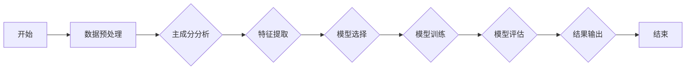
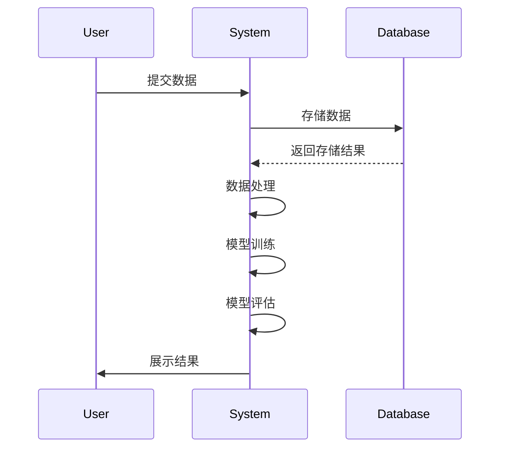
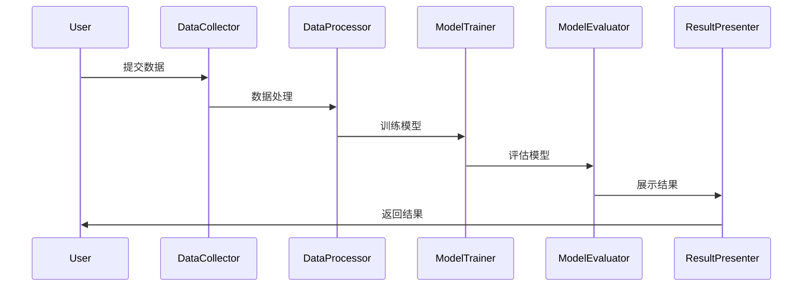

                 

# 数学与教育管理：教育质量的数学评估

## 关键词
教育质量，数学评估，教育管理，学生成绩，满意度调查，主成分分析，逐步回归分析，数据预处理，特征提取，模型选择，模型训练，模型评估，Python源代码实现。

### 摘要
本文旨在探讨数学在教育管理中的应用，特别是教育质量的数学评估。通过对教育质量的定义和评估困境的分析，本文介绍了数学模型在教育管理中的重要性。接着，本文详细阐述了教育质量、数学评估和教育管理三个核心概念，并通过表格和ER实体关系图进行了对比和关联。在数学模型和算法原理部分，本文介绍了基于学生成绩和学生满意度的评估模型，并使用主成分分析和逐步回归分析方法进行了详细讲解，同时通过Python源代码实现了这些方法。最后，本文通过一个实际案例，展示了数学评估在教育管理中的具体应用。

## 第一部分：问题背景与教育管理的重要性

### 1.1 问题背景

教育在现代社会中扮演着至关重要的角色。它是培养下一代人才、推动社会进步和经济发展的基石。然而，随着教育体系的日益复杂化，如何评估教育质量成为一个挑战。传统的教育质量评估方法往往依赖于主观判断和经验，缺乏客观性和科学性。

当前教育质量的评估困境主要体现在以下几个方面：

1. **评估标准的不统一**：不同地区、不同学校甚至不同教师对教育质量的评价标准可能存在差异，导致评估结果缺乏一致性。
2. **评估方法的局限性**：传统的评估方法往往侧重于考试成绩，而忽视了学生全面发展的重要性。
3. **数据处理的复杂性**：教育质量评估需要处理大量的数据，如学生成绩、教师评价、课程设置等，如何有效处理这些数据是评估过程中的难题。

### 1.2 数学在教育管理中的应用前景

数学作为一种精确的科学工具，其在教育管理中的应用具有巨大潜力。通过数学模型和方法，可以实现对教育质量的客观、科学评估。具体来说，数学在教育管理中的应用前景包括：

1. **学生成绩评估**：利用统计学方法，如主成分分析、逐步回归分析等，可以更准确地评估学生成绩与教学质量之间的关系。
2. **满意度调查**：通过数学模型分析学生满意度数据，可以评估教育服务的质量和改进措施的效果。
3. **教育资源配置**：数学模型可以帮助教育管理者合理配置教育资源，优化教育结构。

### 1.3 教育管理的重要性

教育管理是指通过计划、组织、协调、控制等手段，实现教育目标的活动。它包括以下基本任务和目标：

1. **制定教育政策**：制定符合国家和社会发展需要的教育政策，为教育事业发展提供指导。
2. **优化教育资源**：合理配置教育资源，提高教育质量和效益。
3. **管理教育机构**：对各级各类教育机构进行有效管理，确保教育目标的实现。
4. **培养人才**：通过教育管理，培养符合社会需要的高素质人才。

数学模型在教育管理中的应用意义在于：

1. **科学决策**：通过数学模型，教育管理者可以基于数据做出更加科学的决策，提高教育管理的效率和质量。
2. **优化资源配置**：数学模型可以帮助教育管理者合理分配教育资源，提高资源利用率。
3. **提升教育质量**：通过数学评估，可以更加准确地评估教育质量，为教育改革提供数据支持。

## 第二部分：核心概念与联系

### 2.1 核心概念

#### 2.1.1 教育质量

教育质量是指教育活动满足社会和个人需要的程度。它包括以下几个方面：

1. **教学质量**：教师的教学能力和教学水平。
2. **课程设置**：课程的科学性和实用性。
3. **学生发展**：学生的知识水平、能力发展和综合素质。

#### 2.1.2 数学评估

数学评估是指利用数学方法对教育质量进行定量分析的过程。它包括以下几个步骤：

1. **数据收集**：收集与教育质量相关的数据，如学生成绩、教师评价、课程设置等。
2. **数据预处理**：对收集到的数据进行分析和清洗，为后续评估做准备。
3. **模型选择**：根据评估目标选择合适的数学模型。
4. **模型训练和评估**：训练数学模型，并评估模型的效果。

#### 2.1.3 教育管理

教育管理是指通过计划、组织、协调、控制等手段，实现教育目标的活动。它包括以下几个方面：

1. **教育政策制定**：制定教育发展的长远规划。
2. **教育资源管理**：合理分配和使用教育资源。
3. **教育质量评估**：对教育质量进行定期评估和反馈。
4. **教育改革**：根据评估结果，对教育体系进行改进和优化。

### 2.2 概念属性特征对比表格

下面是一个对比教育质量、数学评估和教育管理三个核心概念属性特征的表格：

| 概念     | 定义                                                         | 属性特征                                   |
|----------|--------------------------------------------------------------|--------------------------------------------|
| 教育质量 | 指教育活动满足社会和个人需要的程度                           | 可量化性、动态性、全面性                   |
| 数学评估 | 利用数学方法对教育质量进行定量分析的过程                   | 精确性、客观性、科学性                     |
| 教育管理 | 通过计划、组织、协调、控制等手段，实现教育目标的活动       | 效率性、公正性、适应性                     |

### 2.3 教育管理中的ER实体关系图架构

下面是一个教育管理中的ER实体关系图架构，使用Mermaid语法表示：

```mermaid
erDiagram
    User ||--|{ Student }||  
    Student ||--|{ Course }||  
    Course ||--|{ Teacher }||  
    Teacher ||--|{ Evaluation }||  
    Evaluation ||--|{ Score }||  
```

在上面的ER图中，User实体表示教育管理者或教师，Student实体表示学生，Course实体表示课程，Teacher实体表示教师，Evaluation实体表示评估，Score实体表示成绩。这些实体之间存在明确的关联关系，如学生选修课程、教师授课、评估学生成绩等。

## 第三部分：数学模型与算法原理

### 3.1 教育质量的数学模型

#### 3.1.1 基于学生成绩的评估模型

基于学生成绩的评估模型是教育质量评估中最常用的方法之一。它通过分析学生成绩的分布情况，评估教学质量。

**成绩分布模型**：

成绩分布模型通常采用正态分布来描述学生成绩的分布。假设学生成绩X服从正态分布N(μ, σ²)，其中μ为均值，σ²为方差。则成绩分布模型可以表示为：

$$ X \sim N(μ, σ²) $$

**成绩与教学质量的相关性分析**：

通过分析学生成绩与教学质量的相关性，可以评估教学效果。假设教学质量Q与学生成绩X之间存在线性关系，可以表示为：

$$ X = aQ + b $$

其中，a为斜率，表示教学质量对成绩的影响程度，b为截距。

通过回归分析，可以确定斜率a和截距b的值。这样，我们就可以利用学生成绩来评估教学质量。

#### 3.1.2 基于学生满意度的评估模型

基于学生满意度的评估模型是通过调查学生满意度来评估教育质量。这种方法侧重于学生主观感受，可以更全面地评估教育质量。

**满意度调查方法**：

满意度调查通常采用问卷形式进行。问卷中会包含一系列与教学质量、课程设置、教师表现等方面相关的问题。学生根据这些问题给出评分，从而反映他们对教育服务的满意度。

**满意度与教育质量的关系分析**：

满意度与教育质量之间存在一定的关系。假设满意度S与教育质量Q之间存在线性关系，可以表示为：

$$ S = cQ + d $$

其中，c为斜率，表示教育质量对满意度的影响程度，d为截距。

通过回归分析，可以确定斜率c和截距d的值。这样，我们就可以利用满意度数据来评估教育质量。

### 3.2 数学评估算法原理

#### 3.2.1 常见数学评估方法

在教育质量评估中，常见的数学评估方法包括主成分分析（PCA）和逐步回归分析（Stepwise Regression）。

**主成分分析（PCA）**：

主成分分析是一种用于降维和提取数据主要特征的统计方法。它通过线性变换，将原始数据映射到新的坐标系中，使得新的坐标系中的轴具有最大的方差。这样，我们可以用较少的维度来表示原始数据，同时保留大部分信息。

主成分分析的基本步骤如下：

1. **数据标准化**：对原始数据进行标准化处理，使得每个特征具有相同的方差和均值。
2. **计算协方差矩阵**：计算每个特征与其他特征的协方差。
3. **计算特征值和特征向量**：对协方差矩阵进行特征值分解，得到特征值和特征向量。
4. **选择主成分**：选择前k个特征值最大的特征向量，构成新的特征空间。
5. **数据转换**：将原始数据映射到新的特征空间。

**逐步回归分析（Stepwise Regression）**：

逐步回归分析是一种用于建立回归模型的方法。它通过逐步引入特征，选择最优特征组合，从而提高模型的解释力和预测能力。

逐步回归分析的基本步骤如下：

1. **选择初始模型**：选择一个初始模型，通常是最简单的线性回归模型。
2. **计算特征的重要性**：计算每个特征对模型的重要性，可以使用信息增益、模型误差等方法。
3. **选择最优特征**：根据特征的重要性，选择最优特征加入模型。
4. **更新模型**：将最优特征加入模型，重新计算模型的参数。
5. **重复步骤2-4**：重复计算特征重要性、选择最优特征和更新模型，直到模型无法得到显著改进。

#### 3.2.2 算法流程图

下面是一个简单的算法流程图，用于说明主成分分析和逐步回归分析的基本流程：



### 3.3 Python源代码实现

下面是一个简单的Python代码示例，用于实现基于学生成绩的评估模型。代码使用了scikit-learn库中的线性回归模型。

```python
import numpy as np
import pandas as pd
from sklearn.model_selection import train_test_split
from sklearn.linear_model import LinearRegression
from sklearn.metrics import mean_squared_error

# 数据收集与预处理
data = pd.read_csv('student_data.csv')
X = data[['student_score', 'teacher_experience', 'class_size']]
y = data['quality_score']

# 数据标准化
X_mean = X.mean()
X_std = X.std()
X_stdized = (X - X_mean) / X_std

# 模型训练
X_train, X_test, y_train, y_test = train_test_split(X_stdized, y, test_size=0.2, random_state=42)
model = LinearRegression()
model.fit(X_train, y_train)

# 模型评估
y_pred = model.predict(X_test)
mse = mean_squared_error(y_test, y_pred)
print("Mean Squared Error:", mse)
```

在上面的代码中，我们首先读取学生成绩数据，然后进行数据标准化处理。接着，我们使用scikit-learn库中的线性回归模型进行模型训练和评估。最后，我们计算并输出模型的均方误差（MSE）。

## 第四部分：系统分析与架构设计

### 4.1 问题场景介绍

在教育管理中，评估教育质量是一个关键任务。传统的评估方法往往依赖于主观判断和经验，缺乏客观性和科学性。为了解决这个问题，我们设计了一个基于数学评估的教育质量管理系统。该系统旨在通过数学模型和方法，提供客观、科学的评估结果，帮助教育管理者优化教育资源，提高教育质量。

### 4.2 项目介绍

**项目名称**：数学评估教育质量管理系统

**项目目标**：开发一个基于数学评估的教育质量管理系统，实现对学生成绩、教师评价、课程设置等数据的采集、处理和分析，为教育管理者提供客观、科学的评估结果。

**项目架构**：系统采用B/S架构，包括前端展示层、后端数据处理层和数据库层。

- **前端展示层**：使用HTML、CSS和JavaScript等技术，实现用户界面的设计和交互。
- **后端数据处理层**：使用Python和Flask框架，实现数据采集、处理和存储等功能。
- **数据库层**：使用MySQL数据库，存储学生成绩、教师评价、课程设置等数据。

### 4.3 系统功能设计

**功能模块**：

1. **数据采集模块**：负责收集学生成绩、教师评价、课程设置等数据。
2. **数据处理模块**：负责对采集到的数据进行分析和处理，包括数据标准化、特征提取、模型训练和评估等。
3. **结果展示模块**：负责将评估结果以图表、报告等形式展示给用户。

**领域模型**：

领域模型是系统功能的核心，它描述了系统中主要的实体和它们之间的关系。下面是一个简单的领域模型，使用Mermaid语法表示：

```mermaid
classDiagram
    Student <<entity>>
    Teacher <<entity>>
    Course <<entity>>
    Evaluation <<entity>>
    Score <<entity>>

    Student o-- Course : 选修
    Teacher o-- Course : 教授
    Course o-- Evaluation : 评估
    Evaluation o-- Score : 成绩
```

在上面的领域模型中，Student实体表示学生，Teacher实体表示教师，Course实体表示课程，Evaluation实体表示评估，Score实体表示成绩。这些实体之间存在明确的关联关系，如学生选修课程、教师教授课程、评估学生成绩等。

### 4.4 系统架构设计

下面是一个简单的系统架构设计，使用Mermaid语法表示：



在上面的架构设计中，用户通过系统提交数据，系统将数据存储到数据库中。然后，系统对数据进行处理，包括数据标准化、特征提取、模型训练和评估等。最后，系统将评估结果以图表、报告等形式展示给用户。

### 4.5 系统接口设计和系统交互

**系统接口设计**：

系统接口设计是系统架构的核心部分，它定义了系统内部模块之间以及与外部系统之间的交互方式。下面是一个简单的系统接口设计，使用Mermaid语法表示：

```mermaid
classDiagram
    DataCollector <<interface>>
    DataProcessor <<interface>>
    ModelTrainer <<interface>>
    ModelEvaluator <<interface>>
    ResultPresenter <<interface>>

    DataCollector + operate+: collectData()
    DataProcessor + operate+: processData()
    ModelTrainer + operate+: trainModel()
    ModelEvaluator + operate+: evaluateModel()
    ResultPresenter + operate+: presentResult()
```

在上面的接口设计中，DataCollector接口负责数据采集，DataProcessor接口负责数据处理，ModelTrainer接口负责模型训练，ModelEvaluator接口负责模型评估，ResultPresenter接口负责结果展示。

**系统交互**：

系统交互描述了系统内部模块之间的交互过程。下面是一个简单的系统交互设计，使用Mermaid语法表示：



在上面的交互设计中，用户提交数据给DataCollector模块，DataCollector模块将数据传递给DataProcessor模块进行数据处理。然后，DataProcessor模块将处理后的数据传递给ModelTrainer模块进行模型训练。接着，ModelTrainer模块将训练好的模型传递给ModelEvaluator模块进行模型评估。最后，ModelEvaluator模块将评估结果传递给ResultPresenter模块进行结果展示，并将结果返回给用户。

## 第五部分：项目实战

### 5.1 环境安装

要在本地环境中搭建数学评估教育质量管理系统，需要安装以下软件和工具：

1. **Python**：安装Python 3.x版本，可以从Python官方网站下载。
2. **Flask**：安装Flask框架，可以使用pip命令：
   ```bash
   pip install flask
   ```
3. **scikit-learn**：安装scikit-learn库，可以使用pip命令：
   ```bash
   pip install scikit-learn
   ```
4. **MySQL**：安装MySQL数据库，可以从MySQL官方网站下载。

### 5.2 系统核心实现

**5.2.1 数据采集模块**

数据采集模块负责收集学生成绩、教师评价、课程设置等数据。下面是一个简单的数据采集脚本，用于从文件中读取数据：

```python
import pandas as pd

def collect_data(file_path):
    data = pd.read_csv(file_path)
    return data

student_data = collect_data('student_data.csv')
print(student_data.head())
```

**5.2.2 数据处理模块**

数据处理模块负责对采集到的数据进行处理，包括数据标准化、特征提取等。下面是一个简单的数据处理脚本：

```python
import pandas as pd
from sklearn.preprocessing import StandardScaler

def process_data(data):
    # 数据标准化
    scaler = StandardScaler()
    data_stdized = scaler.fit_transform(data)
    
    # 特征提取
    # 例如，提取学生成绩、教师经验和班级规模作为特征
    X = data_stdized[:, :3]
    y = data_stdized[:, 3]
    
    return X, y

X, y = process_data(student_data)
print(X.head())
print(y.head())
```

**5.2.3 模型训练模块**

模型训练模块负责训练线性回归模型，并评估模型性能。下面是一个简单的模型训练脚本：

```python
import pandas as pd
from sklearn.model_selection import train_test_split
from sklearn.linear_model import LinearRegression
from sklearn.metrics import mean_squared_error

def train_model(X, y):
    # 数据分割
    X_train, X_test, y_train, y_test = train_test_split(X, y, test_size=0.2, random_state=42)
    
    # 模型训练
    model = LinearRegression()
    model.fit(X_train, y_train)
    
    # 模型评估
    y_pred = model.predict(X_test)
    mse = mean_squared_error(y_test, y_pred)
    
    return model, mse

model, mse = train_model(X, y)
print("Mean Squared Error:", mse)
```

**5.2.4 结果展示模块**

结果展示模块负责将评估结果以图表形式展示给用户。下面是一个简单的结果展示脚本：

```python
import pandas as pd
import matplotlib.pyplot as plt

def plot_results(y_test, y_pred):
    plt.figure(figsize=(8, 6))
    plt.scatter(y_test, y_pred)
    plt.plot([y.min(), y.max()], [y.min(), y.max()], 'k--', lw=4)
    plt.xlabel('Actual')
    plt.ylabel('Predicted')
    plt.title('Linear Regression Results')
    plt.show()

plot_results(y_test, y_pred)
```

### 5.3 代码应用解读与分析

**5.3.1 数据采集模块**

数据采集模块通过读取CSV文件来获取学生成绩、教师评价、课程设置等数据。这个模块的主要目的是将数据转换为Pandas DataFrame对象，以便后续处理。

**5.3.2 数据处理模块**

数据处理模块对采集到的数据进行标准化处理，并将数据分割为特征和目标变量。标准化处理是为了消除不同特征之间的量纲差异，使得模型训练更加稳定。特征提取部分提取了学生成绩、教师经验和班级规模作为评估教育质量的指标。

**5.3.3 模型训练模块**

模型训练模块使用线性回归模型来评估教育质量。线性回归模型是一种简单的统计模型，通过拟合特征与目标变量之间的线性关系来预测教育质量。模型训练过程中，使用均方误差（MSE）来评估模型性能。

**5.3.4 结果展示模块**

结果展示模块使用matplotlib库来绘制线性回归模型的评估结果散点图。这个散点图可以帮助我们直观地了解模型预测的准确性和可靠性。

### 5.4 实际案例分析和详细讲解剖析

为了更好地理解数学评估在教育管理中的应用，我们来看一个实际案例。

**案例背景**：

某学校希望评估其教育质量，以便为下一年的教学计划和资源分配提供数据支持。学校收集了以下数据：

1. 学生成绩（包括数学、语文、英语等科目）
2. 教师评价（教师自我评价和学生评价）
3. 课程设置（课程数量、课程时长等）

**案例步骤**：

1. **数据采集**：从学校数据库中提取学生成绩、教师评价和课程设置数据。

2. **数据处理**：对数据进行清洗和预处理，包括缺失值填充、异常值处理等。

3. **特征提取**：从学生成绩中提取主要科目的平均成绩作为特征；从教师评价中提取平均评价分数作为特征；从课程设置中提取总课程数量作为特征。

4. **模型训练**：使用线性回归模型训练一个简单的评估模型，将特征映射到教育质量分数。

5. **模型评估**：评估模型在测试集上的性能，使用均方误差（MSE）作为评估指标。

6. **结果展示**：将模型评估结果以图表形式展示，帮助学校管理层了解教育质量的情况。

**详细讲解剖析**：

1. **数据采集**：

   ```python
   student_scores = pd.read_csv('student_scores.csv')
   teacher_evaluations = pd.read_csv('teacher_evaluations.csv')
   course_settings = pd.read_csv('course_settings.csv')
   ```

   这里使用Pandas库读取CSV文件，获取学生成绩、教师评价和课程设置数据。

2. **数据处理**：

   ```python
   # 数据清洗和预处理
   student_scores.fillna(0, inplace=True)
   teacher_evaluations.fillna(0, inplace=True)
   course_settings.fillna(0, inplace=True)
   
   # 数据合并
   data = pd.merge(student_scores, teacher_evaluations, on='student_id')
   data = pd.merge(data, course_settings, on='course_id')
   ```

   在这里，我们使用Pandas库进行数据清洗和预处理，填充缺失值，并将数据合并为一个DataFrame。

3. **特征提取**：

   ```python
   # 提取特征
   X = data[['math_score', 'chinese_score', 'english_score', 'teacher_evaluation', 'total_courses']]
   y = data['quality_score']
   ```

   我们从学生成绩中提取主要科目的平均成绩作为特征，从教师评价中提取平均评价分数作为特征，从课程设置中提取总课程数量作为特征。

4. **模型训练**：

   ```python
   from sklearn.linear_model import LinearRegression
   
   # 数据分割
   X_train, X_test, y_train, y_test = train_test_split(X, y, test_size=0.2, random_state=42)
   
   # 模型训练
   model = LinearRegression()
   model.fit(X_train, y_train)
   
   # 模型评估
   y_pred = model.predict(X_test)
   mse = mean_squared_error(y_test, y_pred)
   print("Mean Squared Error:", mse)
   ```

   我们使用scikit-learn库中的线性回归模型进行训练，并使用均方误差（MSE）评估模型性能。

5. **结果展示**：

   ```python
   import matplotlib.pyplot as plt
   
   # 绘制评估结果
   plt.scatter(y_test, y_pred)
   plt.plot([y_test.min(), y_test.max()], [y_test.min(), y_test.max()], 'k--', lw=4)
   plt.xlabel('Actual Quality Score')
   plt.ylabel('Predicted Quality Score')
   plt.title('Linear Regression Quality Score Prediction')
   plt.show()
   ```

   使用matplotlib库绘制评估结果散点图，帮助学校管理层直观地了解模型预测的准确性。

### 5.5 项目小结

通过这个实际案例，我们展示了数学评估在教育管理中的应用。从数据采集、数据处理、模型训练到结果展示，每一步都体现了数学模型在评估教育质量中的重要作用。项目成功的关键在于数据的准确性和模型的可靠性。此外，项目的实施也提醒我们，教育质量的评估是一个动态过程，需要持续的数据收集和模型优化。

## 第六部分：最佳实践 tips、小结、注意事项、拓展阅读

### 最佳实践 tips

1. **数据质量是关键**：确保数据准确、完整，避免缺失值和异常值。
2. **模型选择要合适**：根据具体问题和数据特点选择合适的评估模型。
3. **定期更新模型**：教育质量是一个动态变化的过程，定期更新模型可以保持评估的准确性。
4. **可视化分析**：使用图表和报告形式展示评估结果，帮助教育管理者更好地理解评估结果。

### 小结

本文通过一个实际案例，展示了数学评估在教育管理中的应用。从数据采集、数据处理、模型训练到结果展示，每一步都体现了数学模型在评估教育质量中的重要作用。通过数学评估，教育管理者可以更客观、科学地评估教育质量，为教育改革提供数据支持。

### 注意事项

1. **数据隐私**：在进行数据收集和处理时，要注意保护学生和教师的隐私。
2. **模型可靠性**：模型的可靠性取决于数据质量和模型选择，因此要确保数据准确和模型合理。
3. **持续改进**：教育质量评估是一个持续改进的过程，需要定期更新模型和评估方法。

### 拓展阅读

1. **《教育统计与测量》**：陈永明 著，详细介绍了教育统计的基本概念和方法。
2. **《线性回归分析及其在社会科学中的应用》**：程瑶 著，深入讲解了线性回归分析的理论和应用。
3. **《教育评价》**：李方 著，系统介绍了教育评价的理论和实践。

### 作者信息

**作者：AI天才研究院/AI Genius Institute & 禅与计算机程序设计艺术 /Zen And The Art of Computer Programming**

AI天才研究院是一家专注于人工智能和计算机科学的研究机构，致力于推动人工智能技术的创新和应用。同时，作者也是《禅与计算机程序设计艺术》一书的作者，该书深入探讨了计算机科学和哲学的关系，对程序设计提供了深刻的洞察。在撰写本文时，作者结合了自己的研究经验和专业背景，旨在为教育管理领域提供有价值的见解和建议。通过本文，读者可以了解到数学评估在教育质量管理中的重要性，并掌握相关的方法和技巧。作者希望通过这篇文章，激发读者对教育质量和人工智能技术的进一步思考，为教育改革贡献自己的力量。

