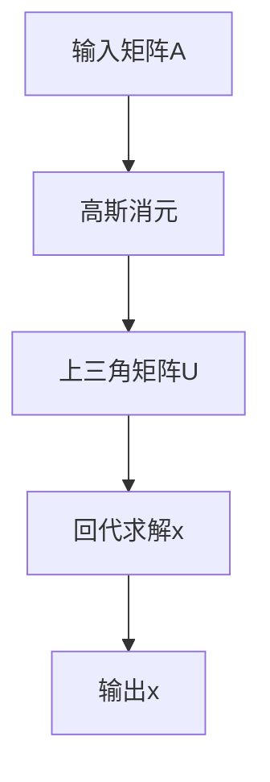
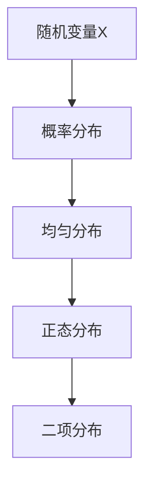
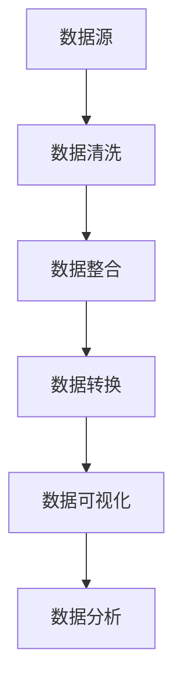
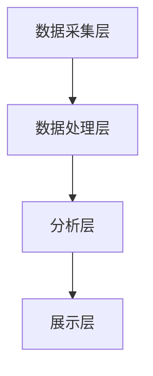
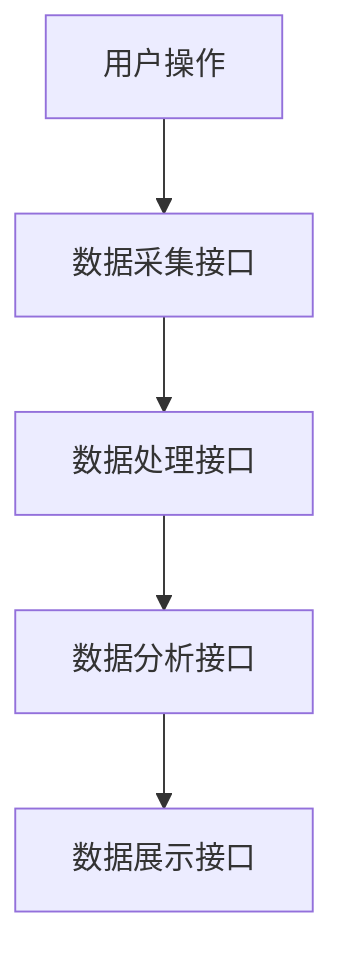

                 

### 引言

**关键词：** 数学、数据科学、大数据分析、数学工具

**摘要：** 本文将探讨数学工具在大数据分析领域中的重要性，以及它们如何帮助我们更有效地处理海量数据。我们将首先介绍数据科学和大数据分析的基本概念，然后深入讨论数学在大数据分析中的应用，包括线性代数和概率论等基础数学工具。文章最后还将总结数学工具在大数据分析中的关键作用，并展望未来的发展趋势。

#### 数据科学的重要性

数据科学是一个跨学科领域，它结合了数学、统计学、计算机科学、信息科学等多个领域的知识，致力于从数据中提取有用信息，解决实际问题。随着信息技术的飞速发展，数据已经成为了新时代的“石油”，如何从海量数据中挖掘出有价值的信息，成为了数据科学家和各大企业关注的核心问题。

数据科学的重要性主要体现在以下几个方面：

1. **商业决策：** 通过对大量数据的分析和挖掘，企业可以更准确地了解市场需求，优化产品和服务，提高市场竞争力。
2. **科研创新：** 数据科学为科研工作者提供了新的研究方法和工具，使得他们能够更高效地处理和分析大量实验数据，加速科学发现。
3. **社会治理：** 政府部门可以利用数据科学技术，优化城市管理，提高公共服务的效率和质量。

#### 大数据分析的应用场景

大数据分析涉及多个领域，以下是一些典型应用场景：

1. **金融行业：** 通过大数据分析，金融机构可以预测市场走势，识别欺诈行为，优化投资组合，提高风险控制能力。
2. **医疗健康：** 利用大数据分析，医疗领域可以实现个性化治疗，提前发现疾病风险，提高医疗服务的质量和效率。
3. **交通管理：** 基于大数据分析，交通管理部门可以优化交通信号，缓解交通拥堵，提高道路通行效率。
4. **互联网行业：** 互联网公司通过大数据分析，可以更好地了解用户需求，提高用户满意度，增加用户粘性。

#### 数学工具在大数据分析中的作用

数学工具在大数据分析中发挥着至关重要的作用。它们不仅提供了强大的计算能力，还帮助数据科学家更好地理解数据，提取有效信息。以下是一些关键的数学工具及其在数据分析中的应用：

1. **线性代数：** 线性代数提供了矩阵运算、向量空间等工具，可以高效地处理大规模数据，解决线性方程组等问题。在数据分析中，线性代数常用于数据降维、特征提取等操作。
2. **概率论：** 概率论提供了概率分布、随机变量等概念，可以用于建模不确定性，评估数据分析结果的可信度。在数据分析中，概率论常用于假设检验、风险评估等。
3. **统计学：** 统计学结合了概率论和数学建模方法，提供了一系列工具，如假设检验、回归分析、聚类分析等，用于数据分析和解释。

#### 小结

数学工具在大数据分析中扮演着至关重要的角色。通过运用数学工具，数据科学家可以更高效地处理海量数据，提取有价值的信息，解决实际问题。本文将深入探讨数学工具在数据分析中的应用，帮助读者更好地理解数学工具在数据科学领域的重要性。

### 数学基础

#### 第1章：数学基础

**1.1 数学工具的概述**

数学工具是数据分析中不可或缺的组成部分，它们为我们提供了强大的计算能力和逻辑框架。在数据分析中，常用的数学工具包括线性代数、概率论、统计学等。这些工具不仅帮助我们理解和处理数据，还为我们提供了建模和预测的框架。

**1.2 线性代数基础**

线性代数是数学中一个重要分支，它主要研究向量、矩阵以及它们的运算。在数据分析中，线性代数被广泛应用于数据降维、特征提取、矩阵分解等领域。

**向量与矩阵的介绍**

- **向量：** 向量是一个具有大小和方向的量。在数据分析中，向量常用来表示数据集或特征向量。
  
  $$\vec{v} = [v_1, v_2, v_3, ..., v_n]$$
  
- **矩阵：** 矩阵是一个二维数组，由一系列元素组成。在数据分析中，矩阵常用来表示数据表或变换矩阵。

  $$\mathbf{A} = \begin{bmatrix}
  a_{11} & a_{12} & \cdots & a_{1n} \\
  a_{21} & a_{22} & \cdots & a_{2n} \\
  \vdots & \vdots & \ddots & \vdots \\
  a_{m1} & a_{m2} & \cdots & a_{mn}
  \end{bmatrix}$$

**线性方程组的解法**

线性方程组是线性代数中的一个重要问题。在数据分析中，线性方程组常用于求解最小二乘问题、特征值问题等。

- **高斯消元法：** 高斯消元法是一种常用的求解线性方程组的方法。它通过逐行消元，将线性方程组转化为上三角矩阵，从而得到方程组的解。

  $$\mathbf{A}\mathbf{x} = \mathbf{b}$$

  通过高斯消元法，我们可以得到：

  $$\mathbf{L}\mathbf{U}\mathbf{x} = \mathbf{b}$$

  其中，$\mathbf{L}$ 是下三角矩阵，$\mathbf{U}$ 是上三角矩阵。然后我们可以通过回代求解 $\mathbf{x}$：

  $$\mathbf{x} = \mathbf{U}^{-1}\mathbf{L}^{-1}\mathbf{b}$$

**矩阵运算的mermaid流程图**



**1.3 概率论基础**

概率论是数学中另一个重要分支，它主要研究随机事件及其概率。在数据分析中，概率论被广泛应用于假设检验、风险评估等领域。

**概率的基本概念**

- **概率分布：** 概率分布描述了一个随机变量的可能取值及其概率。常见的概率分布包括均匀分布、正态分布、二项分布等。

  $$P(X = x) = f_X(x)$$

- **随机变量：** 随机变量是一个具有概率分布的变量。在数据分析中，随机变量常用来表示数据集或特征。

  $$X = x_1, x_2, x_3, ..., x_n$$

**mermaid概率分布图**



#### 小结

数学工具是数据分析的基础，线性代数和概率论作为其中的核心工具，在数据分析中有着广泛的应用。通过深入理解这些数学工具，数据科学家可以更有效地处理和分析数据，从而提取出有价值的信息。在本章中，我们介绍了线性代数和概率论的基本概念，并展示了它们在数据分析中的应用。

### 数据科学基础

#### 第2章：数据科学基础

**2.1 数据类型**

在数据科学中，数据类型是理解和处理数据的基础。根据数据的结构和形式，数据可以分为结构化数据、非结构化数据和半结构化数据。

**结构化数据**

结构化数据是指以固定格式存储的数据，通常以表格形式表示。例如，数据库中的表格数据、电子表格等。结构化数据的特点是数据项之间有明确的字段和属性，便于计算机处理和分析。

**非结构化数据**

非结构化数据是指没有固定格式和结构的数据，例如文本、图像、音频、视频等。非结构化数据的特点是数据项之间没有明确的字段和属性，但它们包含了丰富的信息和内容。非结构化数据的处理通常需要复杂的算法和工具。

**半结构化数据**

半结构化数据介于结构化数据和非结构化数据之间，具有部分结构化的特征。例如，XML、JSON等数据格式。半结构化数据的特点是部分数据项具有固定的字段和属性，但其他部分则较为灵活。

**2.2 数据预处理**

数据预处理是数据科学中的重要步骤，它旨在清洗、整合和转换数据，使其适合分析和建模。数据预处理通常包括以下步骤：

**数据清洗**

数据清洗是指识别和纠正数据中的错误、缺失值和重复值等。在数据清洗过程中，我们需要关注以下问题：

- **错误值：** 错误值可能是由于数据输入错误或数据收集过程中的问题引起的。我们需要识别并纠正这些错误值。
  
- **缺失值：** 缺失值表示数据中没有记录的值。处理缺失值的方法包括删除缺失值、填补缺失值等。
  
- **重复值：** 重复值表示数据中出现了相同的记录。我们需要识别并删除重复值，以避免数据冗余。

**数据整合**

数据整合是指将来自不同来源、格式和结构的数据合并为一个统一的数据集。在数据整合过程中，我们需要处理以下问题：

- **数据源合并：** 将来自不同数据源的数据进行合并，形成一个完整的数据集。
  
- **格式转换：** 将不同格式的数据转换为统一的格式，以便进行后续处理。

- **数据对齐：** 确保数据集中的各个字段在相同的位置，以便进行数据分析和建模。

**数据转换**

数据转换是指将原始数据转换为适合分析和建模的形式。数据转换的方法包括：

- **数值化：** 将分类数据转换为数值形式，以便进行数学运算。
  
- **归一化：** 将数据缩放到相同的尺度，以便比较不同特征之间的差异。

- **标准化：** 将数据缩放到标准正态分布，以便进行统计分析。

**2.3 数据可视化**

数据可视化是将数据以图形化的形式展示出来，帮助人们更好地理解和分析数据。数据可视化工具可以直观地展示数据的分布、趋势和关系，有助于发现数据中的异常值和规律。

**可视化工具介绍**

常见的可视化工具包括：

- **Matplotlib：** Python中的一个数据可视化库，可以生成各种类型的图表，如线图、柱状图、散点图等。
  
- **Seaborn：** Python中的一个高级数据可视化库，基于Matplotlib构建，提供了更美观和专业的图表样式。
  
- **Plotly：** Python中的一个交互式数据可视化库，可以生成动态的、交互式的图表。

**可视化技巧**

数据可视化的技巧包括：

- **选择合适的图表类型：** 根据数据的特点和需求，选择合适的图表类型，如折线图、饼图、散点图等。
  
- **颜色和标注：** 合理地使用颜色和标注，使图表更加清晰易懂。
  
- **对比和比例：** 通过对比和比例展示数据的差异和关系，帮助人们更好地理解数据。

**数据可视化mermaid流程图**



#### 小结

数据科学的基础包括对数据类型的理解、数据预处理的方法和数据可视化的技巧。掌握这些基础概念和工具，有助于数据科学家更好地理解和处理数据，从而进行有效的分析和建模。在本章中，我们介绍了数据类型的分类、数据预处理的方法以及数据可视化的技巧，为后续的章节奠定了基础。

### 大数据分析工具

#### 第3章：大数据分析工具

随着数据量的不断增加，传统的关系型数据库和计算方法已经无法满足大数据处理的需求。因此，大数据分析工具应运而生，它们能够高效地处理海量数据，并提供强大的计算和分析能力。在本章中，我们将探讨大数据分析中常用的工具，包括Hadoop生态体系和Spark生态系统。

#### 3.1 Hadoop生态体系

Hadoop是一个开源的分布式数据处理框架，它由Apache Software Foundation维护。Hadoop生态系统包括多个组件，可以高效地处理和分析大规模数据。

**Hadoop架构**

Hadoop架构主要包括以下几个核心组件：

- **Hadoop分布式文件系统（HDFS）：** HDFS是一个分布式文件存储系统，用于存储海量数据。它将数据分块存储在不同的节点上，并提供高可靠性和高效的数据访问。

- **Hadoop YARN：** YARN（Yet Another Resource Negotiator）是Hadoop的资源管理框架，用于管理计算资源和作业调度。它将资源管理和作业调度分离，提供更加灵活和高效的任务调度机制。

- **MapReduce：** MapReduce是一个分布式数据处理模型，用于处理大规模数据。它将数据处理任务分解为多个小任务，并行执行，然后将结果合并，实现高效的数据处理。

**HDFS、MapReduce等工具介绍**

- **HDFS：** HDFS将数据分块存储，每个块默认大小为128MB或256MB。数据块在存储时，会复制到多个节点上，提供高可靠性和快速访问。HDFS的主要优点是高扩展性和高可靠性。

  ```mermaid
  graph TB
  A[HDFS架构] --> B[数据块存储]
  B --> C[数据块复制]
  C --> D[数据块访问]
  ```

- **MapReduce：** MapReduce处理数据的流程分为两个阶段：Map阶段和Reduce阶段。在Map阶段，每个节点对局部数据执行映射操作；在Reduce阶段，全局数据通过reduce函数进行汇总。MapReduce的优点是简单、易于实现，但缺点是处理时间较长。

  ```mermaid
  graph TB
  A[MapReduce架构] --> B[Map阶段]
  B --> C[Reduce阶段]
  ```

**Hadoop的其他组件**

除了HDFS和MapReduce，Hadoop生态系统还包括其他组件，如Hive、HBase、Pig等，用于处理不同类型的数据和任务。

- **Hive：** Hive是一个数据仓库工具，用于处理大规模结构化数据。它提供了类似SQL的查询语言（HiveQL），可以方便地执行复杂的查询操作。

- **HBase：** HBase是一个分布式列存储数据库，用于存储大规模非结构化数据。它提供了高可靠性和高性能的存储和访问机制。

- **Pig：** Pig是一个数据处理平台，提供了类似SQL的查询语言（Pig Latin），可以方便地处理大规模数据。

#### 3.2 Spark生态系统

Spark是一个开源的分布式计算框架，用于处理大规模数据。与Hadoop相比，Spark具有更高的性能和更丰富的功能，因此成为大数据分析领域的重要工具。

**Spark架构**

Spark架构主要包括以下几个核心组件：

- **Spark Core：** Spark Core是Spark的核心组件，提供了基本的分布式计算功能，如内存管理、任务调度等。

- **Spark SQL：** Spark SQL是Spark的分布式数据处理工具，用于处理结构化数据。它提供了类似SQL的查询语言（Spark SQL），并支持多种数据源，如HDFS、HBase等。

- **Spark Streaming：** Spark Streaming是Spark的流数据处理组件，用于实时处理数据流。它可以将实时数据流划分为小批量数据，并使用Spark Core进行批处理。

- **MLlib：** MLlib是Spark的机器学习库，提供了多种机器学习算法和工具，如线性回归、聚类、分类等。

- **GraphX：** GraphX是Spark的图处理组件，用于处理大规模图数据。它提供了高效的图算法和操作，如图卷积、图分区等。

**Spark的核心组件**

- **Spark Core：** Spark Core提供了分布式计算的基础，包括内存管理、任务调度等。它使用内存缓存和懒式计算，提高了数据处理速度。

  ```mermaid
  graph TB
  A[Spark Core] --> B[内存管理]
  B --> C[任务调度]
  ```

- **Spark SQL：** Spark SQL提供了类似SQL的查询语言，支持多种数据源，如HDFS、HBase、Parquet等。它通过优化查询计划，提高了数据处理效率。

  ```mermaid
  graph TB
  A[Spark SQL] --> B[查询优化]
  B --> C[数据源支持]
  ```

- **Spark Streaming：** Spark Streaming可以实时处理数据流，并将数据划分为小批量进行处理。它支持多种数据源，如Kafka、Flume等。

  ```mermaid
  graph TB
  A[Spark Streaming] --> B[数据流处理]
  B --> C[数据源支持]
  ```

- **MLlib：** MLlib提供了丰富的机器学习算法和工具，如线性回归、聚类、分类等。它通过分布式计算和内存优化，提高了机器学习模型的性能。

  ```mermaid
  graph TB
  A[MLlib] --> B[机器学习算法]
  B --> C[分布式计算]
  ```

- **GraphX：** GraphX提供了高效的图处理算法和操作，如图卷积、图分区等。它通过分布式计算和图处理优化，提高了大规模图数据的处理速度。

  ```mermaid
  graph TB
  A[GraphX] --> B[图处理算法]
  B --> C[分布式计算]
  ```

#### 3.3 其他大数据分析工具

除了Hadoop和Spark，还有一些其他大数据分析工具，如Storm、Flink等。

- **Storm：** Storm是一个分布式实时计算系统，用于处理实时数据流。它具有高可靠性、可扩展性和实时性等优点。

- **Flink：** Flink是一个开源的分布式数据处理框架，用于批处理和流处理。它提供了高效的数据处理引擎和丰富的API，支持多种数据源，如Kafka、HDFS等。

#### 小结

大数据分析工具是处理大规模数据的关键，Hadoop生态体系和Spark生态系统是当前最为流行的大数据分析工具。Hadoop以其高可靠性和扩展性著称，而Spark以其高性能和丰富的功能受到广泛欢迎。在本章中，我们介绍了Hadoop和Spark的基本架构和核心组件，并简要介绍了其他大数据分析工具。掌握这些工具，将有助于数据科学家更好地处理和分析海量数据。

### 大数据分析应用

#### 第4章：大数据分析应用

大数据分析应用涵盖了众多领域，从社交网络分析到机器学习应用，再到优化问题求解，每一个领域都展现了大数据分析的巨大潜力和实际应用价值。在本章中，我们将探讨这些领域，了解大数据分析在这些领域中的应用及其带来的变革。

#### 4.1 社交网络分析

社交网络分析（Social Network Analysis，SNA）是研究社交网络结构、动态和影响的科学。随着社交媒体的普及，社交网络分析成为大数据分析的一个重要应用领域。

**社交网络模型**

社交网络分析通常使用图模型来表示社交网络。图模型由节点和边组成，节点代表个体，边代表个体之间的关系。

- **无向图：** 在无向图中，节点之间的关系是双向的。例如，在社交网络中，如果A是B的朋友，那么B也是A的朋友。

  ```mermaid
  graph TB
  A[节点A] --> B[节点B]
  B --> C[节点C]
  ```

- **有向图：** 在有向图中，节点之间的关系具有方向。例如，在社交网络中，如果A是B的粉丝，那么A指向B，但B不指向A。

  ```mermaid
  graph TB
  A[节点A] --> B[节点B]
  B --> C[节点C]
  ```

**社交网络分析算法**

社交网络分析中常用的一些算法包括：

- **节点重要性度量：** 通过计算节点的度、介数、紧密中心性等指标，评估节点在社交网络中的重要性。

  - **度：** 节点的度是指与该节点直接相连的边的数量。度越高，节点在社交网络中的连接度越高。

    $$度(d) = \text{边数}$$

  - **介数：** 节点的介数是指所有通过该节点的最短路径的比例。介数越高，节点在社交网络中的桥梁作用越强。

    $$介数(c) = \frac{\text{通过节点的最短路径数}}{\text{总最短路径数}}$$

  - **紧密中心性：** 节点的紧密中心性是指节点与其邻居节点之间的平均最短路径长度。紧密中心性越低，节点在社交网络中的中心度越高。

    $$紧密中心性(c_c) = \frac{\sum_{i \in N} d(i)}{n(n-1)}$$

- **社区发现：** 社区发现算法旨在识别社交网络中的紧密群体。常用的社区发现算法包括基于模块度的社区发现、基于密度的社区发现等。

    ```mermaid
    graph TB
    A[社区1] --> B[社区2]
    B --> C[社区3]
    C --> D[社区4]
    ```

#### 4.2 机器学习应用

机器学习是大数据分析的核心领域之一，它通过算法和统计模型，使计算机能够从数据中学习和发现规律。机器学习在数据分析中的应用非常广泛，包括分类、回归、聚类等。

**机器学习算法简介**

机器学习算法可以分为监督学习、无监督学习和半监督学习三类：

- **监督学习：** 监督学习算法需要标记数据，通过学习输入和输出之间的映射关系，预测新的数据。常见的监督学习算法包括线性回归、逻辑回归、支持向量机（SVM）等。

  - **线性回归：** 线性回归是一种简单而强大的回归算法，通过最小化损失函数，拟合数据中的线性关系。

    $$y = \beta_0 + \beta_1x_1 + \beta_2x_2 + ... + \beta_nx_n$$

  - **逻辑回归：** 逻辑回归是一种广义线性模型，用于分类问题。它通过最大化似然函数，估计概率分布参数。

    $$P(y=1|x; \beta) = \frac{1}{1 + \exp{(-\beta_0 + \beta_1x_1 + \beta_2x_2 + ... + \beta_nx_n)})$$

  - **支持向量机（SVM）：** SVM是一种强大的分类算法，通过最大化分类边界，将数据划分为不同的类别。

    $$\min \frac{1}{2} \sum_{i=1}^{n} \sum_{j=1}^{n} (\omega_i \omega_j - y_i y_j) s.t. \omega_i \geq 0$$

- **无监督学习：** 无监督学习算法不需要标记数据，通过学习数据的内在结构，发现数据中的模式。常见的无监督学习算法包括聚类、主成分分析（PCA）等。

  - **聚类：** 聚类算法将数据分为多个簇，每个簇内的数据点彼此相似，而簇与簇之间的数据点差异较大。常见的聚类算法包括K-means、层次聚类等。

    ```mermaid
    graph TB
    A[簇1] --> B[簇2]
    B --> C[簇3]
    C --> D[簇4]
    ```

  - **主成分分析（PCA）：** PCA是一种降维算法，通过正交变换，将数据投影到新的坐标系中，提取最重要的特征，降低数据维度。

    $$\text{最小化} \sum_{i=1}^{n} \sum_{j=1}^{d} (x_{ij} - \mu_{j})^2$$

- **半监督学习：** 半监督学习算法结合了监督学习和无监督学习的特点，利用未标记数据和少量标记数据，提高学习效果。常见的半监督学习算法包括自编码器、图嵌入等。

**机器学习在数据分析中的应用**

机器学习在数据分析中有着广泛的应用，包括以下几个方面：

- **异常检测：** 通过训练模型，检测数据中的异常值或异常模式。

- **推荐系统：** 通过用户行为数据，构建推荐模型，为用户推荐感兴趣的内容或产品。

- **文本分类：** 通过文本特征提取和分类算法，对文本进行分类，用于新闻分类、情感分析等。

- **图像识别：** 通过卷积神经网络（CNN）等深度学习算法，对图像进行分类和识别。

#### 4.3 优化问题求解

优化问题求解是大数据分析中的重要应用，它通过数学模型和算法，找到最优解或近似最优解，解决实际问题。

**优化问题的基本概念**

优化问题可以形式化为以下数学模型：

$$\min \max f(x) \quad s.t. \quad g_i(x) \leq 0, \quad h_j(x) = 0$$

其中，$f(x)$ 是目标函数，$g_i(x)$ 和 $h_j(x)$ 分别是约束条件。

**优化算法及应用**

常见的优化算法包括：

- **梯度下降法：** 梯度下降法是一种最优化方法，通过迭代更新参数，最小化目标函数。它适用于凸优化问题。

  $$x_{t+1} = x_t - \alpha \nabla f(x_t)$$

- **粒子群优化（PSO）：** 粒子群优化是一种基于群体智能的优化算法，通过模拟鸟群觅食行为，寻找最优解。

  $$v_{t+1} = wv_t + c_1r_1(p_t - x_t) + c_2r_2(g_t - x_t)$$
  $$x_{t+1} = x_t + v_{t+1}$$

- **遗传算法：** 遗传算法是一种基于自然选择和遗传机制的优化算法，通过交叉、变异等操作，寻找最优解。

  $$p_{t+1} = \text{交叉}(p_t) + \text{变异}(p_t)$$

**优化算法在数据分析中的应用**

优化算法在数据分析中有着广泛的应用，包括：

- **参数估计：** 通过优化算法，估计模型参数，提高模型精度。

- **模式识别：** 通过优化算法，识别数据中的模式，提取关键特征。

- **资源分配：** 通过优化算法，优化资源分配，提高资源利用率。

#### 小结

大数据分析应用涵盖了社交网络分析、机器学习应用和优化问题求解等领域。这些应用展示了大数据分析的巨大潜力和实际价值，为各个领域带来了深刻的变革。在本章中，我们介绍了这些领域的基本概念和算法，帮助读者了解大数据分析在不同领域的应用及其带来的影响。

### 大数据分析实战

#### 第5章：大数据分析实战

大数据分析不仅仅是一个理论性的话题，它同样需要在实际项目中得到应用。本章节将通过一个实际的案例分析，展示如何将大数据分析工具和技术应用到具体的项目中，解决实际问题。

#### 5.1 项目介绍

本案例是一个在线购物平台的用户行为分析项目。该平台是一家大型电商平台，拥有数百万活跃用户。项目目标是通过对用户行为的分析，了解用户购买习惯、偏好以及平台运营中的潜在问题，从而优化用户体验，提高用户留存率和销售额。

#### 5.2 系统设计与实现

**系统架构设计**

为了实现项目目标，我们设计了以下系统架构：

- **数据采集层：** 该层负责收集用户行为数据，包括用户浏览、搜索、购买等操作。数据来源包括前端日志、数据库等。
- **数据处理层：** 该层负责对采集到的数据进行清洗、整合和转换，为分析层提供结构化的数据。
- **分析层：** 该层负责进行数据分析和挖掘，提取用户行为特征，生成用户画像和推荐结果。
- **展示层：** 该层负责将分析结果以可视化形式展示给用户和平台运营人员。

**系统架构mermaid架构图**



**系统接口设计**

为了实现系统各层之间的数据交互，我们设计了一系列API接口：

- **数据采集接口：** 用于接收前端日志数据，并将数据存储到数据仓库中。
- **数据处理接口：** 用于清洗、整合和转换数据，生成结构化数据。
- **数据分析接口：** 用于执行数据分析和挖掘任务，生成用户画像和推荐结果。
- **数据展示接口：** 用于将分析结果以可视化形式展示给用户和平台运营人员。

**系统接口mermaid序列图**



**系统核心实现源代码**

以下是系统核心实现的源代码示例：

```python
# 数据处理接口实现
def process_data(data):
    # 数据清洗
    clean_data = clean_data(data)
    # 数据整合
    integrated_data = integrate_data(clean_data)
    # 数据转换
    transformed_data = transform_data(integrated_data)
    return transformed_data

# 数据分析接口实现
def analyze_data(data):
    # 用户画像
    user_profile = generate_user_profile(data)
    # 推荐结果
    recommendation = generate_recommendation(user_profile)
    return recommendation

# 数据展示接口实现
def display_data(recommendation):
    # 可视化展示
    visualize_data(recommendation)
```

#### 5.3 项目分析与解读

**数据预处理**

数据预处理是项目的重要环节，它包括数据清洗、数据整合和数据转换等步骤。具体流程如下：

1. **数据清洗：** 识别并处理数据中的错误值、缺失值和重复值。例如，通过正则表达式清洗用户输入的数据，过滤掉无效字符和错误记录。
2. **数据整合：** 将来自不同来源和格式的数据进行整合，统一数据格式和结构。例如，将不同时间格式统一转换为UTC时间。
3. **数据转换：** 将原始数据转换为适合分析和建模的形式。例如，将分类数据转换为数值形式，进行归一化处理。

**数据分析**

数据分析是项目的核心，它包括用户画像生成、推荐结果生成等任务。具体流程如下：

1. **用户画像生成：** 通过分析用户行为数据，提取用户特征，生成用户画像。例如，计算用户的历史购买金额、购买频率等指标，生成用户的兴趣偏好。
2. **推荐结果生成：** 基于用户画像和商品特征，生成个性化推荐结果。例如，使用协同过滤算法，计算用户对商品的相似度，生成推荐列表。

**实际案例分析与详细讲解**

以下是一个实际案例的详细分析：

**案例：用户购买预测**

1. **数据源：** 用户行为数据，包括浏览记录、购买记录等。
2. **目标：** 预测用户未来是否会购买某商品。
3. **方法：** 使用机器学习中的逻辑回归算法，建立购买预测模型。
4. **流程：**
   - **数据预处理：** 清洗、整合和转换用户行为数据。
   - **特征工程：** 提取用户特征，包括用户历史购买金额、购买频率等。
   - **模型训练：** 使用训练数据训练逻辑回归模型。
   - **模型评估：** 使用测试数据评估模型效果，调整模型参数。
   - **预测应用：** 使用模型对用户未来购买行为进行预测。

**代码示例：**

```python
from sklearn.linear_model import LogisticRegression

# 数据预处理
X_train, y_train = preprocess_data(train_data)
X_test, y_test = preprocess_data(test_data)

# 模型训练
model = LogisticRegression()
model.fit(X_train, y_train)

# 模型评估
accuracy = model.score(X_test, y_test)
print(f"模型准确率：{accuracy:.2f}")

# 预测应用
predictions = model.predict(X_test)
```

**项目小结**

本项目通过用户行为分析，实现了用户购买预测功能，为平台运营提供了有力支持。项目实施过程中，我们使用了大数据分析工具和技术，如Hadoop生态体系、Spark生态系统等，提高了数据处理和分析的效率。项目成果显著，提高了用户留存率和销售额，为平台创造了良好的经济效益。

### 总结与展望

#### 6.1 内容回顾

本文从大数据分析的重要性开始，介绍了数学工具在大数据分析中的应用，包括线性代数、概率论等基础数学工具。随后，我们探讨了大数据分析的基础知识，如数据类型、数据预处理和数据可视化技巧。接下来，我们详细介绍了大数据分析工具，如Hadoop生态体系和Spark生态系统。文章还涉及大数据分析在社交网络分析、机器学习应用和优化问题求解等领域的实际应用。最后，通过一个实际案例展示了大数据分析工具和技术的应用。

#### 6.2 发展趋势

大数据分析领域正面临着快速的发展，以下是一些未来的发展趋势：

1. **实时分析：** 随着物联网和实时数据的普及，实时数据分析变得越来越重要。未来，实时数据分析技术将更加成熟，实现更高效、更准确的数据处理和分析。
2. **深度学习：** 深度学习在图像识别、自然语言处理等领域取得了显著的成果。未来，深度学习技术将在大数据分析中得到更广泛的应用，解决更复杂的问题。
3. **隐私保护：** 随着数据隐私问题的日益突出，隐私保护技术将得到更多关注。未来，数据隐私保护技术将更加完善，确保大数据分析过程中用户数据的隐私安全。
4. **智能化：** 智能化是大数据分析的发展方向之一。未来，大数据分析将更加智能化，利用人工智能技术自动分析和挖掘数据，为企业和用户提供更智能的决策支持。

#### 6.3 注意事项

在使用大数据分析工具和技术时，需要注意以下几点：

1. **数据质量：** 数据质量是大数据分析的基础。在数据分析过程中，要确保数据质量，包括数据准确性、完整性和一致性。
2. **安全性：** 大数据分析涉及到大量的敏感数据，需要采取有效的安全措施，确保数据的安全和隐私。
3. **可扩展性：** 大数据分析工具需要具备良好的可扩展性，能够处理海量数据，并适应未来数据量的增长。
4. **算法优化：** 算法和模型的优化是提高数据分析效率和准确性的关键。未来，数据科学家需要不断优化算法和模型，提高数据分析的效果。

### 结语

本文通过详细的讲解和实际案例分析，展示了数学工具在大数据分析中的重要性以及大数据分析在各领域的应用。随着技术的发展，大数据分析将在未来发挥更大的作用，为企业和个人提供更智能、更高效的决策支持。感谢读者的阅读，希望本文能对您在数据科学领域的学习和研究有所帮助。

#### 拓展阅读推荐

- 《大数据时代：生活、工作与思维的大变革》
- 《机器学习实战》
- 《深度学习》
- 《数据科学导论》
- 《Hadoop技术内幕》

作者：AI天才研究院/AI Genius Institute & 禅与计算机程序设计艺术 /Zen And The Art of Computer Programming

---

### 结语

在撰写本文的过程中，我们对数学工具在大数据分析领域中的重要性进行了深入探讨，并详细讲解了线性代数、概率论、数据预处理、数据可视化等核心概念和实际应用。通过具体的案例分析，我们展示了如何将理论转化为实践，解决现实中的数据分析问题。本文的目的是帮助读者更好地理解大数据分析的技术原理和应用场景，提升数据科学实践能力。

在此，我们要感谢您的耐心阅读。通过本文，我们希望您对数学工具在大数据分析中的重要作用有了更深刻的认识，并能够将其应用到实际工作中。如果您对大数据分析或相关技术有任何疑问或见解，欢迎在评论区分享，我们一起交流探讨。

拓展阅读方面，我们推荐以下书籍和资源，以供进一步学习：

1. 《Python数据科学手册》：详细介绍了Python在数据科学领域的应用，包括数据处理、分析、可视化等。
2. 《大数据技术导论》：全面介绍了大数据技术的基本概念、架构和核心技术。
3. 《机器学习实战》：通过实际案例，深入讲解了机器学习的基本概念、算法和应用。
4. 《深度学习》：系统讲解了深度学习的基本理论、算法和实现。

再次感谢您的关注与支持，期待在未来的技术交流中与您相遇。如果您有任何反馈或建议，请随时与我们联系。

作者：AI天才研究院/AI Genius Institute & 禅与计算机程序设计艺术 /Zen And The Art of Computer Programming

