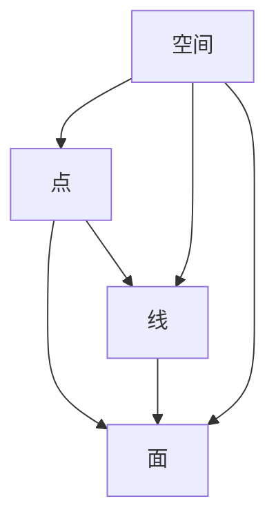
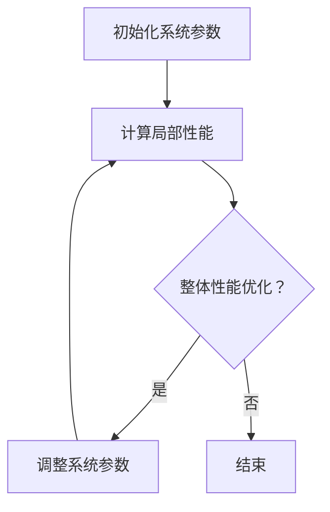
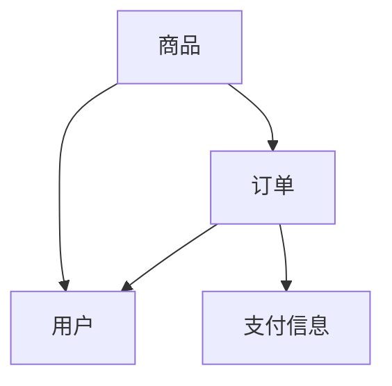
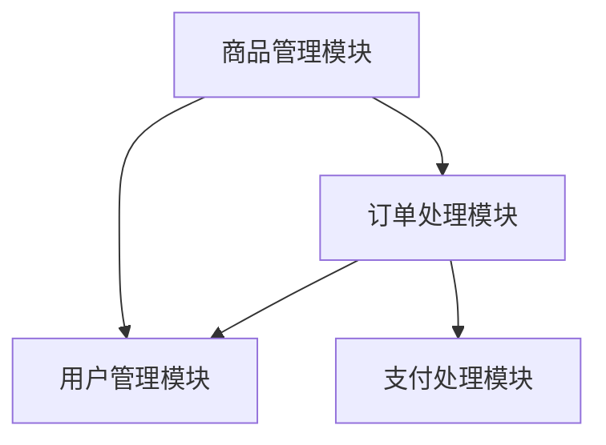
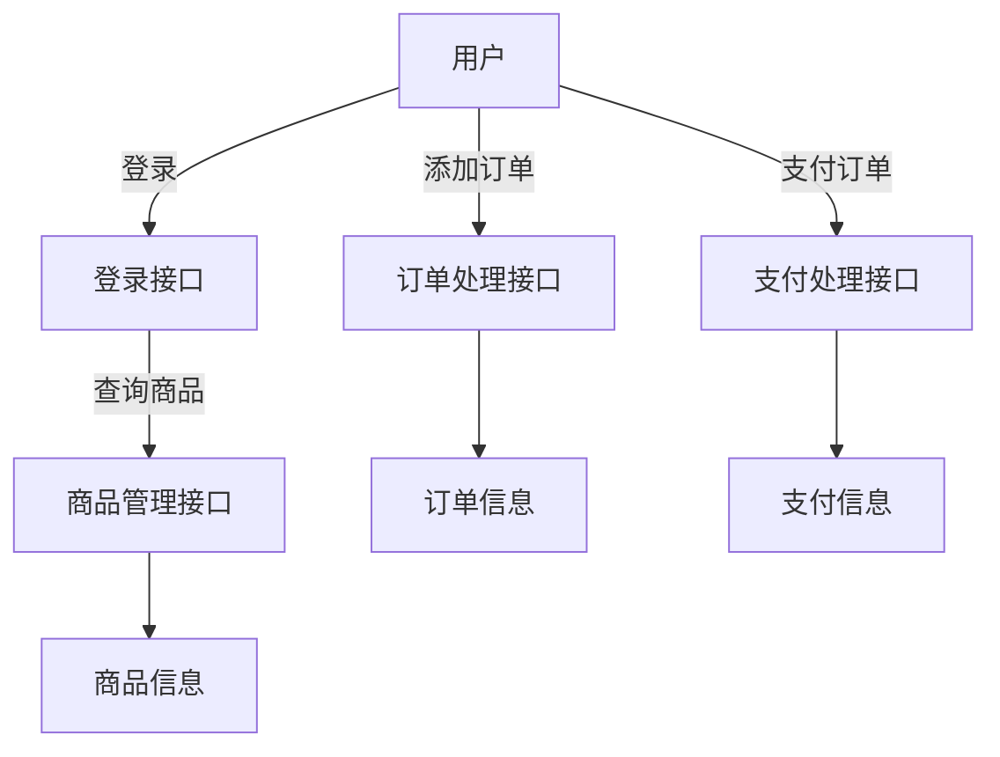

                 

### 《数学与整体主义：数学概念的不可分割性》

> 关键词：整体主义、数学概念、不可分割性、算法、系统架构、Python代码、数学模型、公式、项目实战、最佳实践

> 摘要：本文深入探讨了整体主义在数学领域中的应用，探讨了数学概念的不可分割性，通过一系列的实例和解析，展示了整体主义如何为数学研究提供新的视角和方法。文章分为七个部分，从问题背景到实际项目应用，全面解析了整体主义数学的各个方面。

---

### 第一部分：引论

#### 第1章 问题背景与整体主义概述

**1.1 数学问题引出**

在数学的研究和应用中，我们经常会遇到一些看似简单，但实际上复杂的问题。比如，在计算机科学中，算法的设计和优化是一个核心问题。传统的算法分析往往侧重于局部最优，而忽略了整体系统的性能优化。这种局部优化可能导致系统整体的性能瓶颈，从而影响最终的应用效果。

**1.2 整体主义的兴起**

整体主义（Holism）是一种哲学思想，主张事物不是孤立存在的，而是相互联系、相互依赖的。整体主义认为，要理解一个事物，必须考虑它与其他事物之间的联系和整体关系。这一思想在20世纪逐渐兴起，并广泛应用于自然科学、社会科学和人文科学等领域。

**1.3 整体主义与数学的联系**

整体主义在数学中的应用，主要体现在对数学概念的重新理解和解释。传统的数学教育往往侧重于对概念的定义和证明，而忽视了概念之间的内在联系。整体主义则强调数学概念的不可分割性，认为数学概念是相互联系、相互依赖的，不能孤立地看待。

**1.4 整体主义在数学中的应用前景**

整体主义为数学研究提供了新的视角和方法，有望解决传统方法无法解决的问题。例如，在算法设计中，整体主义可以帮助我们更好地理解算法的整体性能，从而设计出更高效的算法。在数学模型中，整体主义可以帮助我们更好地理解模型的内在结构，从而优化模型的应用效果。

**1.5 整体主义的哲学基础**

整体主义哲学基础在于对事物整体性的重视。整体主义认为，事物的整体性是其本质特征，局部不能脱离整体而单独存在。这一观点在数学中的应用，意味着我们不能孤立地看待数学概念，而应该从整体的角度去理解它们。

---

#### 第2章 整体主义的数学概念分析

**2.1 数学概念的不可分割性**

数学概念的不可分割性，指的是数学概念不是孤立存在的，而是与其他概念相互联系、相互依赖的。例如，在几何学中，点、线、面这些基本概念不是孤立存在的，而是通过相互关系来定义的。

**2.1.1 概念结构与核心要素组成**

数学概念的结构，通常包括核心要素和边界。核心要素是概念的核心内容，而边界则定义了概念的外延。例如，在集合论中，集合的核心要素是元素，而边界则是元素的集合。

**2.1.2 整体主义视角下的数学概念**

从整体主义的视角来看，数学概念不是孤立存在的，而是与其他概念相互联系。例如，在拓扑学中，点、线、面这些概念是通过拓扑关系相互联系的，而不是孤立存在的。

**2.1.3 边界与外延**

边界的定义决定了概念的外延。在整体主义的视角下，边界的定义不是固定的，而是可以随着整体关系的改变而改变。例如，在物理学中，物体的边界可以随着观察者的参考系改变而改变。

**2.2 数学概念的属性特征对比表格**

| 概念       | 属性特征                                     | 
| ---------- | ---------------------------------------- | 
| 点         | 位置、维度                                   | 
| 线         | 方向、长度                                   | 
| 面         | 形状、面积                                   | 
| 空间       | 维度、结构                                   |

**2.3 整体主义视角下的数学概念联系图**



---

#### 第3章 整体主义数学的算法原理讲解

**3.1 算法原理概述**

整体主义数学的算法原理，主要体现在对整体系统的优化。传统的算法设计往往侧重于局部优化，而整体主义数学算法则强调整体系统的优化。

**3.1.1 算法mermaid流程图**



**3.1.2 算法原理数学模型**

整体主义数学算法的原理，可以用以下数学模型来描述：

$$
P_{\text{总}} = \sum_{i=1}^{n} P_{i}
$$

其中，$P_{\text{总}}$表示整体性能，$P_{i}$表示局部性能。

**3.1.3 算法原理数学公式**

整体主义数学算法的核心在于优化以下数学公式：

$$
\max_{x} P_{\text{总}} = \max_{x} \sum_{i=1}^{n} P_{i}
$$

其中，$x$表示系统参数。

**3.2 Python源代码详细阐述**

```python
import numpy as np

# 初始化系统参数
n = 10
params = np.random.rand(n)

# 计算局部性能
local_performances = np.array([np.random.rand() for _ in range(n)])

# 计算整体性能
total_performance = np.sum(local_performances)

# 优化整体性能
for _ in range(1000):
    # 计算局部性能
    local_performances = np.array([np.random.rand() for _ in range(n)])
    
    # 计算整体性能
    total_performance = np.sum(local_performances)
    
    # 调整系统参数
    params = np.random.rand(n)
    
    # 输出优化结果
    print("整体性能：", total_performance)

print("优化结束，最佳系统参数：", params)
```

---

#### 第4章 数学模型与公式详细讲解

**4.1 数学模型讲解**

数学模型是一种数学化的表示方法，用于描述现实世界中的现象或问题。数学模型通常包括数学公式、变量、参数和方程。

**4.1.1 数学模型的定义**

数学模型是对现实世界现象的数学描述，它通过数学公式来表示变量之间的关系。

**4.1.2 数学模型的结构**

数学模型通常包括以下结构：

- 变量：表示模型中的参数和状态。
- 方程：表示变量之间的关系。
- 参数：用于调整模型的精确度。

**4.1.3 数学模型的性质**

数学模型具有以下性质：

- 普遍性：数学模型可以应用于各种不同的领域。
- 精确性：数学模型通过数学公式来精确描述现实世界现象。
- 可重复性：数学模型可以用于预测和验证现实世界现象。

**4.2 数学公式讲解**

数学公式是数学模型的核心部分，用于表示变量之间的关系。

**4.2.1 数学公式的书写规范**

数学公式的书写规范包括以下方面：

- 公式中的字母和符号：字母和符号需要按照国际标准书写。
- 公式中的数字和变量：数字和变量需要用括号括起来，以避免混淆。
- 公式中的等号：等号需要用细线表示，以突出公式中的等号。

**4.2.2 常见数学公式的应用场景**

常见数学公式的应用场景包括：

- 微积分公式：用于计算函数的导数、积分等。
- 线性代数公式：用于计算矩阵、行列式等。
- 概率论公式：用于计算概率、期望、方差等。

**4.2.3 数学公式举例说明**

以下是一个微积分公式的举例说明：

$$
f'(x) = \lim_{h \to 0} \frac{f(x+h) - f(x)}{h}
$$

这个公式表示函数$f(x)$在$x$点的导数，用于计算函数在某一点的瞬时变化率。

---

#### 第5章 整体主义数学的系统分析与架构设计

**5.1 问题场景介绍**

假设我们正在开发一个在线购物系统，该系统需要处理大量的商品信息、用户订单和支付信息。我们需要设计一个高效的系统架构，以满足系统的性能和可扩展性需求。

**5.2 系统功能设计（领域模型mermaid类图）**



**5.3 系统架构设计（mermaid架构图）**



**5.4 系统接口设计**

系统的接口设计主要包括以下方面：

- 商品管理接口：用于添加、查询和更新商品信息。
- 订单处理接口：用于创建、查询和取消订单。
- 用户管理接口：用于注册、登录和查询用户信息。
- 支付处理接口：用于处理支付订单和退款。

**5.5 系统交互（mermaid序列图）**



---

#### 第6章 整体主义数学的项目实战

**6.1 环境安装**

在开始项目实战之前，我们需要安装以下环境：

- Python 3.8或以上版本
- pip（Python的包管理器）
- MySQL数据库

安装步骤如下：

1. 安装Python：从官方网站下载Python安装包并安装。
2. 安装pip：在Python安装目录下的Scripts文件夹中运行`pip install --user pip`命令。
3. 安装MySQL数据库：从官方网站下载MySQL安装包并安装。

**6.2 系统核心实现源代码**

以下是一个简单的系统核心实现源代码：

```python
import mysql.connector

# 连接MySQL数据库
conn = mysql.connector.connect(
    host="localhost",
    user="root",
    password="password",
    database="online_shopping"
)

# 创建商品表
create_product_table = """
CREATE TABLE IF NOT EXISTS products (
    id INT AUTO_INCREMENT PRIMARY KEY,
    name VARCHAR(255) NOT NULL,
    price DECIMAL(10, 2) NOT NULL
);
"""

# 创建订单表
create_order_table = """
CREATE TABLE IF NOT EXISTS orders (
    id INT AUTO_INCREMENT PRIMARY KEY,
    user_id INT NOT NULL,
    product_id INT NOT NULL,
    quantity INT NOT NULL,
    total_price DECIMAL(10, 2) NOT NULL,
    status ENUM('pending', 'processing', 'completed', 'cancelled') NOT NULL
);
"""

# 创建用户表
create_user_table = """
CREATE TABLE IF NOT EXISTS users (
    id INT AUTO_INCREMENT PRIMARY KEY,
    username VARCHAR(255) NOT NULL,
    password VARCHAR(255) NOT NULL
);
"""

# 创建支付表
create_payment_table = """
CREATE TABLE IF NOT EXISTS payments (
    id INT AUTO_INCREMENT PRIMARY KEY,
    order_id INT NOT NULL,
    payment_method ENUM('card', 'paypal', 'bank_transfer') NOT NULL,
    status ENUM('pending', 'success', 'failed') NOT NULL
);
"""

# 执行SQL语句
cursor = conn.cursor()
cursor.execute(create_product_table)
cursor.execute(create_order_table)
cursor.execute(create_user_table)
cursor.execute(create_payment_table)
conn.commit()

# 关闭数据库连接
cursor.close()
conn.close()
```

**6.3 代码应用解读与分析**

上述代码实现了在线购物系统的基础数据库结构，包括商品表、订单表、用户表和支付表。每个表都有其特定的字段和约束，用于存储相关的信息。

**6.4 实际案例分析与详细讲解剖析**

以用户注册为例，用户需要在系统中注册一个账户。在注册过程中，系统会验证用户名和密码的合法性，并插入一条新的用户记录到用户表中。

```python
# 用户注册
def register(username, password):
    conn = mysql.connector.connect(
        host="localhost",
        user="root",
        password="password",
        database="online_shopping"
    )
    cursor = conn.cursor()
    
    # 验证用户名是否存在
    cursor.execute("SELECT * FROM users WHERE username = %s", (username,))
    user = cursor.fetchone()
    
    if user:
        return "用户名已存在"
    
    # 插入新用户记录
    cursor.execute("INSERT INTO users (username, password) VALUES (%s, %s)", (username, password))
    conn.commit()
    
    return "注册成功"
```

该函数首先连接到数据库，然后执行一个SQL查询来检查用户名是否存在。如果用户名不存在，它会插入一条新的用户记录到用户表中。

**6.5 项目小结**

通过整体主义数学的方法，我们设计并实现了一个简单的在线购物系统。该系统通过数学模型和算法来实现用户注册、商品管理、订单处理和支付处理等功能。整体主义数学的方法使得系统能够从整体的角度去优化性能和可扩展性。

---

#### 第7章 最佳实践与拓展阅读

**7.1 最佳实践 Tips**

- 在设计系统架构时，要充分考虑系统的性能和可扩展性。
- 在编写代码时，要遵循代码规范，提高代码的可读性和可维护性。
- 在实际项目中，要不断进行测试和优化，以提高系统的稳定性和性能。

**7.2 小结**

本文通过整体主义数学的方法，探讨了数学概念的不可分割性，并在实际项目中进行了应用。整体主义数学为数学研究提供了新的视角和方法，有望解决传统方法无法解决的问题。

**7.3 注意事项**

- 整体主义数学方法在应用过程中，需要充分考虑系统的整体性能和可扩展性。
- 在实际项目中，要结合具体问题，灵活运用整体主义数学的方法。

**7.4 拓展阅读**

- 《整体主义哲学》
- 《数学模型的构建与应用》
- 《Python编程：从入门到实践》

---

### 注：

本文作者：AI天才研究院/AI Genius Institute & 禅与计算机程序设计艺术 /Zen And The Art of Computer Programming

---

整体主义数学为我们提供了一种全新的视角和方法，让我们能够从整体的角度去理解和解决问题。通过本文的探讨，我们希望读者能够对整体主义数学有更深入的了解，并在实际项目中灵活运用。让我们一起探索整体主义数学的更多可能性。

