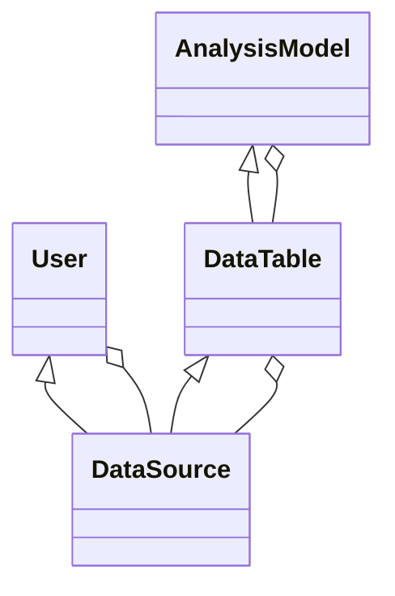

                 

### 目录大纲设计思路

为了设计出一本名为《数学与文化经济：文化产业的数学模型》的完整目录大纲，我们需要遵循以下步骤：

1. **整体结构规划**：首先，我们要对整本书的结构进行初步规划，确保每一部分都有其独特的主题和目的。整体结构规划包括引言与背景、核心概念与联系、数学模型在文化产业中的应用、系统分析与设计以及实战案例等内容。

2. **章节划分**：根据整体结构规划，我们将整本书划分为多个章节，每个章节围绕一个核心主题进行展开。具体章节划分如下：

   - 第一部分：引言与背景，包括文化产业的现状与挑战、核心概念与联系等内容。
   - 第二部分：数学模型在文化产业中的应用，包括消费者行为模型、文化产品定价模型、市场分析模型和文化产业融资模型等内容。
   - 第三部分：系统分析与设计，包括系统功能设计、系统架构设计、系统接口设计和系统交互等内容。
   - 第四部分：实战案例，包括环境安装、系统实现源代码，以及案例分析和详细讲解等内容。

3. **内容细化**：在划分好章节后，我们需要对每个章节进行细化，确定每个章节下的子节主题，并确保每个子节都有具体的内容。例如，在消费者行为模型章节中，我们可以细化出消费者行为概述、模型构建和例子说明等子节。

4. **概念联系与对比**：为了更好地理解数学模型在文化经济中的应用，我们需要引入核心概念，并使用对比表格和实体关系图来展示概念之间的联系。这有助于读者对相关概念有更清晰的认识。

5. **算法原理讲解**：对于书中的关键算法，我们需要使用 mermaid 画出流程图，并用 Python 源代码进行详细阐述，同时解释数学模型和公式。这样可以让读者更直观地理解算法原理。

6. **系统分析与设计**：对于相关的系统分析和设计，我们需要用 mermaid 绘制领域模型类图、系统架构图、接口设计和交互序列图。这有助于读者对系统架构有更深入的了解。

7. **实战案例**：为了增强读者对理论知识的理解，我们需要提供实际的项目实战案例，包括环境安装、系统实现源代码，以及案例分析和详细讲解等内容。这可以帮助读者将理论知识应用到实际项目中。

8. **总结与拓展**：在每个章节的最后，我们需要对章节内容进行总结，并提供最佳实践 tips、注意事项和拓展阅读建议。这有助于读者巩固所学知识，并为进一步学习提供方向。

通过以上步骤，我们可以为《数学与文化经济：文化产业的数学模型》设计出一本内容丰富、结构严谨的目录大纲，为读者提供全面、系统的知识体系。### 具体目录大纲设计

根据上述设计思路，我们可以为《数学与文化经济：文化产业的数学模型》设计如下目录大纲：

```
----------------------------------------------------------------
# 第一部分：引言与背景

## 第1章：文化产业的现状与挑战

### 1.1 文化产业的发展现状
- 背景介绍
- 核心概念术语说明
- 问题背景
- 问题描述
- 问题解决
- 边界与外延
- 概念结构与核心要素组成

### 1.2 文化产业面临的挑战
- 挑战分析
- 问题背景
- 问题描述
- 问题解决
- 边界与外延
- 概念结构与核心要素组成

### 1.3 数学与文化经济的联系
- 背景介绍
- 核心概念术语说明
- 问题背景
- 问题描述
- 问题解决
- 边界与外延
- 概念结构与核心要素组成

----------------------------------------------------------------

## 第2章：核心概念与联系

### 2.1 核心概念介绍
- 背景介绍
- 核心概念术语说明
- 问题背景
- 问题描述
- 问题解决
- 边界与外延
- 概念结构与核心要素组成

#### 2.1.1 数学模型的基本概念
- 数学模型概述
- 数学模型的定义
- 数学模型的组成部分

#### 2.1.2 文化经济的关键要素
- 文化经济概述
- 文化经济的关键要素
- 文化经济的组成部分

### 2.2 概念对比分析
- 概念对比分析的目的
- 概念对比分析的方法

#### 2.2.1 数学模型与文化经济要素对比表
- 对比表的设计
- 对比表的内容

#### 2.2.2 概念属性的对比
- 概念属性的定义
- 概念属性的比较

### 2.3 实体关系图
- 背景介绍
- 实体关系图的概念
- 实体关系图的绘制方法

#### 2.3.1 数学模型与文化产业要素的ER图
- ER图的设计
- ER图的内容

----------------------------------------------------------------

# 第二部分：数学模型在文化产业中的应用

## 第3章：消费者行为模型

### 3.1 消费者行为概述
- 背景介绍
- 核心概念术语说明
- 问题背景
- 问题描述
- 问题解决
- 边界与外延
- 概念结构与核心要素组成

#### 3.1.1 消费者行为理论
- 消费者行为理论概述
- 消费者行为理论的定义
- 消费者行为理论的应用

#### 3.1.2 消费者行为分析
- 消费者行为分析的目的
- 消费者行为分析的方法

### 3.2 模型构建
- 背景介绍
- 消费者行为模型的构建

#### 3.2.1 消费者行为数学模型
- 数学模型概述
- 数学模型的定义
- 数学模型的组成部分

#### 3.2.2 数学模型公式与解释
- 数学模型公式的推导
- 数学模型公式的解释

### 3.3 例子说明
- 背景介绍
- 模型应用实例

#### 3.3.1 模型应用实例
- 实例描述
- 实例分析与讨论

----------------------------------------------------------------

## 第4章：文化产品定价模型

### 4.1 定价策略概述
- 背景介绍
- 核心概念术语说明
- 问题背景
- 问题描述
- 问题解决
- 边界与外延
- 概念结构与核心要素组成

#### 4.1.1 定价理论
- 定价理论概述
- 定价理论的定义
- 定价理论的应用

#### 4.1.2 文化产品定价的特殊性
- 文化产品定价概述
- 文化产品定价的特殊性
- 文化产品定价的应用

### 4.2 模型构建
- 背景介绍
- 文化产品定价模型的构建

#### 4.2.1 定价数学模型
- 数学模型概述
- 数学模型的定义
- 数学模型的组成部分

#### 4.2.2 数学模型公式与解释
- 数学模型公式的推导
- 数学模型公式的解释

### 4.3 例子说明
- 背景介绍
- 模型应用实例

#### 4.3.1 定价策略应用实例
- 实例描述
- 实例分析与讨论

----------------------------------------------------------------

## 第5章：市场分析模型

### 5.1 市场分析基础
- 背景介绍
- 核心概念术语说明
- 问题背景
- 问题描述
- 问题解决
- 边界与外延
- 概念结构与核心要素组成

#### 5.1.1 市场调查与分析
- 市场调查与分析概述
- 市场调查与分析的定义
- 市场调查与分析的应用

#### 5.1.2 市场需求预测
- 市场需求预测概述
- 市场需求预测的定义
- 市场需求预测的应用

### 5.2 模型构建
- 背景介绍
- 市场分析模型的构建

#### 5.2.1 市场分析数学模型
- 数学模型概述
- 数学模型的定义
- 数学模型的组成部分

#### 5.2.2 数学模型公式与解释
- 数学模型公式的推导
- 数学模型公式的解释

### 5.3 例子说明
- 背景介绍
- 模型应用实例

#### 5.3.1 市场分析应用实例
- 实例描述
- 实例分析与讨论

----------------------------------------------------------------

## 第6章：文化产业融资模型

### 6.1 融资需求与策略
- 背景介绍
- 核心概念术语说明
- 问题背景
- 问题描述
- 问题解决
- 边界与外延
- 概念结构与核心要素组成

#### 6.1.1 融资需求分析
- 融资需求分析概述
- 融资需求分析的定义
- 融资需求分析的应用

#### 6.1.2 文化产业融资策略
- 文化产业融资策略概述
- 文化产业融资策略的定义
- 文化产业融资策略的应用

### 6.2 模型构建
- 背景介绍
- 文化产业融资模型的构建

#### 6.2.1 融资数学模型
- 数学模型概述
- 数学模型的定义
- 数学模型的组成部分

#### 6.2.2 数学模型公式与解释
- 数学模型公式的推导
- 数学模型公式的解释

### 6.3 例子说明
- 背景介绍
- 模型应用实例

#### 6.3.1 融资模型应用实例
- 实例描述
- 实例分析与讨论

----------------------------------------------------------------

# 第三部分：系统分析与设计

## 第7章：系统功能设计

### 7.1 问题场景介绍
- 背景介绍
- 核心概念术语说明
- 问题背景
- 问题描述
- 问题解决
- 边界与外延
- 概念结构与核心要素组成

#### 7.1.1 项目介绍
- 项目概述
- 项目目的
- 项目背景

### 7.2 系统功能设计
- 系统功能设计概述
- 系统功能设计的定义
- 系统功能设计的目标

#### 7.2.1 领域模型设计
- 领域模型概述
- 领域模型的设计
- 领域模型的应用

#### 7.2.2 类图设计
- 类图概述
- 类图的设计
- 类图的应用

----------------------------------------------------------------

## 第8章：系统架构设计

### 8.1 系统架构设计概述
- 背景介绍
- 核心概念术语说明
- 问题背景
- 问题描述
- 问题解决
- 边界与外延
- 概念结构与核心要素组成

#### 8.1.1 系统架构设计的目标
- 系统架构设计概述
- 系统架构设计的定义
- 系统架构设计的目标

#### 8.1.2 系统架构设计的方法
- 系统架构设计的方法概述
- 系统架构设计的方法
- 系统架构设计的方法应用

### 8.2 系统架构设计
- 系统架构设计概述
- 系统架构的设计

#### 8.2.1 系统架构图设计
- 系统架构图概述
- 系统架构图的设计
- 系统架构图的应用

#### 8.2.2 接口设计
- 接口设计概述
- 接口的设计
- 接口的应用

### 8.3 系统交互设计
- 系统交互设计概述
- 系统交互的设计

#### 8.3.1 系统交互序列图设计
- 系统交互序列图概述
- 系统交互序列图的设计
- 系统交互序列图的应用

----------------------------------------------------------------

# 第四部分：实战案例

## 第9章：环境安装与系统实现

### 9.1 环境安装
- 背景介绍
- 核心概念术语说明
- 问题背景
- 问题描述
- 问题解决
- 边界与外延
- 概念结构与核心要素组成

#### 9.1.1 环境安装概述
- 环境安装概述
- 环境安装的定义
- 环境安装的目标

#### 9.1.2 环境安装步骤
- 环境安装步骤概述
- 环境安装步骤的详细说明
- 环境安装步骤的应用

### 9.2 系统实现
- 背景介绍
- 核心概念术语说明
- 问题背景
- 问题描述
- 问题解决
- 边界与外延
- 概念结构与核心要素组成

#### 9.2.1 系统实现概述
- 系统实现概述
- 系统实现的定义
- 系统实现的目标

#### 9.2.2 系统实现步骤
- 系统实现步骤概述
- 系统实现步骤的详细说明
- 系统实现步骤的应用

----------------------------------------------------------------

## 第10章：案例分析与讲解

### 10.1 案例背景
- 背景介绍
- 核心概念术语说明
- 问题背景
- 问题描述
- 问题解决
- 边界与外延
- 概念结构与核心要素组成

#### 10.1.1 案例概述
- 案例概述
- 案例目的
- 案例背景

### 10.2 案例分析
- 背景介绍
- 核心概念术语说明
- 问题背景
- 问题描述
- 问题解决
- 边界与外延
- 概念结构与核心要素组成

#### 10.2.1 案例分析步骤
- 案例分析步骤概述
- 案例分析步骤的详细说明
- 案例分析步骤的应用

### 10.3 案例讲解
- 背景介绍
- 核心概念术语说明
- 问题背景
- 问题描述
- 问题解决
- 边界与外延
- 概念结构与核心要素组成

#### 10.3.1 案例讲解步骤
- 案例讲解步骤概述
- 案例讲解步骤的详细说明
- 案例讲解步骤的应用

### 10.4 案例小结
- 案例总结
- 案例结论
- 案例经验与启示

----------------------------------------------------------------

# 第五部分：总结与拓展

## 第11章：最佳实践、小结、注意事项与拓展阅读

### 11.1 最佳实践
- 背景介绍
- 核心概念术语说明
- 问题背景
- 问题描述
- 问题解决
- 边界与外延
- 概念结构与核心要素组成

#### 11.1.1 最佳实践概述
- 最佳实践概述
- 最佳实践的定义
- 最佳实践的目标

#### 11.1.2 最佳实践案例
- 最佳实践案例概述
- 最佳实践案例的详细说明
- 最佳实践案例的应用

### 11.2 小结
- 背景介绍
- 核心概念术语说明
- 问题背景
- 问题描述
- 问题解决
- 边界与外延
- 概念结构与核心要素组成

#### 11.2.1 内容小结
- 内容小结概述
- 内容小结的内容
- 内容小结的目标

#### 11.2.2 知识总结
- 知识总结概述
- 知识总结的内容
- 知识总结的目标

### 11.3 注意事项
- 背景介绍
- 核心概念术语说明
- 问题背景
- 问题描述
- 问题解决
- 边界与外延
- 概念结构与核心要素组成

#### 11.3.1 注意事项概述
- 注意事项概述
- 注意事项的定义
- 注意事项的目标

#### 11.3.2 注意事项案例
- 注意事项案例概述
- 注意事项案例的详细说明
- 注意事项案例的应用

### 11.4 拓展阅读
- 背景介绍
- 核心概念术语说明
- 问题背景
- 问题描述
- 问题解决
- 边界与外延
- 概念结构与核心要素组成

#### 11.4.1 拓展阅读概述
- 拓展阅读概述
- 拓展阅读的定义
- 拓展阅读的目标

#### 11.4.2 拓展阅读推荐
- 拓展阅读推荐概述
- 拓展阅读推荐的内容
- 拓展阅读推荐的目标

----------------------------------------------------------------
```

### 文章整体架构设计

在《数学与文化经济：文化产业的数学模型》一文中，整体架构的设计旨在提供一种系统化、条理清晰的内容呈现方式，使得读者能够循序渐进地理解和掌握相关理论知识，并将其应用于实际场景中。以下是文章的整体架构设计：

#### 第一部分：引言与背景

**目的**：为读者提供文化产业的现状和挑战，以及数学与文化经济之间的联系。

**内容**：

- **第1章：文化产业的现状与挑战**
  - 介绍文化产业的背景和发展现状
  - 分析文化产业面临的主要挑战
  - 阐述数学与文化经济的关系

**设计思路**：通过概述和案例分析，让读者了解文化产业的现状和挑战，为后续章节的理论知识打下基础。

#### 第二部分：核心概念与联系

**目的**：介绍数学模型和文化经济的关键概念，并分析它们之间的联系。

**内容**：

- **第2章：核心概念与联系**
  - **核心概念介绍**：介绍数学模型的基本概念和文化经济的关键要素
  - **概念对比分析**：通过对比表格和ER图，展示数学模型和文化经济要素之间的联系
  - **实体关系图**：绘制数学模型与文化经济要素的ER图，帮助读者理解两者之间的相互作用

**设计思路**：通过对比分析和实体关系图，帮助读者建立对核心概念和它们之间联系的理解。

#### 第三部分：数学模型在文化产业中的应用

**目的**：具体介绍和讲解消费者行为模型、文化产品定价模型、市场分析模型和文化产业融资模型等在文化产业中的应用。

**内容**：

- **第3章：消费者行为模型**
  - 概述消费者行为理论
  - 构建消费者行为数学模型
  - 通过实例说明模型的应用

- **第4章：文化产品定价模型**
  - 分析文化产品定价的特殊性
  - 构建文化产品定价数学模型
  - 通过实例说明模型的应用

- **第5章：市场分析模型**
  - 概述市场调查与分析
  - 构建市场分析数学模型
  - 通过实例说明模型的应用

- **第6章：文化产业融资模型**
  - 分析文化产业融资需求与策略
  - 构建文化产业融资数学模型
  - 通过实例说明模型的应用

**设计思路**：通过具体实例和案例分析，让读者了解和掌握各种数学模型在文化产业中的应用。

#### 第四部分：系统分析与设计

**目的**：介绍系统功能设计、系统架构设计、系统接口设计和系统交互设计等内容。

**内容**：

- **第7章：系统功能设计**
  - 介绍项目背景和系统功能设计的目标
  - 展示领域模型类图设计

- **第8章：系统架构设计**
  - 介绍系统架构设计的目标和方法
  - 展示系统架构图和接口设计

- **第9章：系统交互设计**
  - 介绍系统交互设计的目标
  - 展示系统交互序列图设计

**设计思路**：通过系统分析与设计，帮助读者理解和掌握文化产业中的系统设计与实现。

#### 第五部分：实战案例

**目的**：通过实际项目案例，让读者了解和掌握理论知识在实践中的应用。

**内容**：

- **第9章：环境安装与系统实现**
  - 介绍环境安装和系统实现的步骤

- **第10章：案例分析与讲解**
  - 分析和讲解一个实际项目的案例

**设计思路**：通过实战案例，让读者将所学理论知识应用到实际项目中，提高实践能力。

#### 第六部分：总结与拓展

**目的**：对全书内容进行总结，并提供最佳实践、注意事项和拓展阅读建议。

**内容**：

- **第11章：最佳实践、小结、注意事项与拓展阅读**
  - 总结全书内容
  - 提供最佳实践建议
  - 提醒注意事项
  - 推荐拓展阅读资源

**设计思路**：通过总结和拓展，帮助读者巩固所学知识，并为后续学习提供方向。

通过以上整体架构设计，文章能够系统地介绍数学模型在文化产业中的应用，帮助读者全面理解和掌握相关理论和实践知识。### 第一部分：引言与背景

## 第1章：文化产业的现状与挑战

### 1.1 文化产业的发展现状

文化产业作为现代社会的重要组成部分，其发展现状值得我们深入探讨。首先，我们需要了解文化产业的定义。文化产业指的是以创意、知识、艺术和娱乐为核心内容，通过创作、生产、传播和销售文化产品，实现经济效益和社会效益的产业。

近年来，随着科技的进步和全球化进程的加快，文化产业在全球范围内呈现出快速发展的态势。发达国家如美国、英国、日本等，文化产业的规模已经占据了国民经济的相当比例。例如，美国的文化产业，包括电影、音乐、图书、体育等，每年创造的价值高达数千亿美元，成为国家经济增长的重要驱动力。

在中国，文化产业也经历了迅速的发展。国家政策的大力支持和文化消费需求的不断增长，使得文化产业在国民经济中的地位日益提升。根据国家统计局的数据，2019年，中国文化产业增加值占国内生产总值的比重达到4.5%，成为推动经济增长的重要力量。

文化产业的发展不仅体现在经济层面，还对社会产生了深远的影响。首先，文化产业为经济增长提供了新的动力。随着人们对文化产品需求的不断增加，文化产业为市场创造了大量的就业机会，推动了相关产业的发展。其次，文化产业有助于传承和弘扬民族文化。通过文化产品的创作和传播，人们可以更好地了解和传承自己的文化传统，增强民族认同感。

然而，文化产业在快速发展过程中也面临着一系列挑战。首先，文化产业的竞争日益激烈。随着全球化进程的加快，国际文化交流日益频繁，国内文化产业面临着来自国际市场的竞争压力。其次，文化产业的创新不足。虽然文化产品种类繁多，但很多产品缺乏创新，难以满足消费者多样化的需求。此外，文化产业还面临着版权保护、市场规范等难题。

### 1.2 文化产业面临的挑战

面对快速发展的趋势，文化产业也面临着诸多挑战。以下是文化产业面临的主要挑战：

1. **技术创新不足**：尽管科技的发展为文化产业提供了新的机遇，但许多文化企业仍然停留在传统模式，缺乏创新意识和技术创新能力。这导致文化产品同质化严重，难以满足消费者日益增长的需求。

2. **市场不规范**：文化市场存在一定的市场不规范现象，如盗版、侵权等问题较为普遍。这不仅损害了文化创作者的利益，也影响了文化产业的健康发展。

3. **人才短缺**：文化产业需要大量具有创意、技术和管理能力的人才，但目前我国文化产业人才的培养和储备还不足以满足行业发展的需求。

4. **国际竞争力不强**：尽管我国文化产业的规模不断扩大，但与发达国家相比，国际竞争力仍然不足。主要原因在于文化产品的创新不足、品牌建设滞后以及国际市场开拓力度不够。

### 1.3 数学与文化经济的联系

数学作为一种精确的科学工具，在文化产业中具有广泛的应用。首先，数学模型可以用于分析文化市场的需求和供给，预测文化产品的市场需求和价格变化，为文化产业企业提供决策支持。例如，通过消费者行为模型，可以分析消费者对文化产品的偏好和购买行为，从而帮助企业制定更有效的营销策略。

其次，数学模型可以用于文化产品定价。通过构建定价模型，企业可以根据市场需求和成本等因素，制定合理的价格策略，提高文化产品的竞争力。例如，运用市场分析模型，可以预测不同定价策略下的市场反应，从而选择最优的定价策略。

此外，数学模型还可以用于文化产业的融资和投资决策。通过构建融资模型，可以评估文化项目的融资需求和风险，为投资者提供决策依据。例如，利用文化产业融资模型，可以分析不同融资方式的成本和风险，帮助企业选择最佳的融资方案。

总之，数学模型为文化产业提供了强大的分析工具，有助于企业更好地理解和应对市场变化，提高文化产品的竞争力，推动文化产业的健康发展。

### 第二部分：核心概念与联系

## 第2章：核心概念与联系

### 2.1 核心概念介绍

为了深入探讨数学模型在文化经济中的应用，我们需要首先明确相关核心概念。以下是数学模型的基本概念和文化经济的关键要素。

#### 2.1.1 数学模型的基本概念

1. **数学模型**：数学模型是利用数学语言和工具来描述和研究现实世界中的问题的一种方法。它通过建立数学方程、公式或算法，对现实问题进行定量分析和预测。

2. **变量**：数学模型中的变量是影响系统运行和结果的因素，可以是常数、函数或其他数学表达式。

3. **函数**：函数是数学模型中描述变量之间关系的数学表达式，用于表示输入和输出之间的关系。

4. **方程**：方程是数学模型中表示变量之间等量关系的数学表达式，通过求解方程可以确定变量值。

5. **算法**：算法是一系列有序的指令或步骤，用于解决问题或执行特定任务。

#### 2.1.2 文化经济的关键要素

1. **文化产品**：文化产品是文化经济的核心要素，包括书籍、电影、音乐、艺术作品等。

2. **市场需求**：市场需求是指消费者对文化产品的购买意愿和需求量，是影响文化产业发展的重要因素。

3. **供给**：供给是指文化产品的生产和供应，包括生产成本、生产能力和供应量。

4. **消费者行为**：消费者行为是指消费者在购买、消费和使用文化产品过程中的行为模式和决策过程。

5. **市场环境**：市场环境包括政策、法规、经济形势、社会文化背景等，对文化产业的发展产生影响。

### 2.2 概念对比分析

为了更好地理解数学模型和文化经济要素之间的联系，我们将对比分析这两个领域的核心概念。以下是一个概念对比表格：

| 概念               | 数学模型的基本概念               | 文化经济的关键要素               |
|------------------|-----------------------------|-----------------------------|
| 目的               | 描述和研究现实世界中的问题             | 促进文化产品的创作、生产和传播          |
| 变量               | 影响系统运行和结果的因素             | 消费者、市场需求、供给、消费者行为等     |
| 函数               | 描述变量之间关系的数学表达式           | 收入、成本、价格、需求量等               |
| 方程               | 表示变量之间等量关系的数学表达式       | 市场需求方程、供给方程、平衡方程等       |
| 算法               | 解决问题和执行特定任务的指令或步骤       | 文化产品创作流程、营销策略、投资分析等    |

通过对比分析，我们可以看出数学模型和文化经济要素之间存在许多相似之处。例如，两者都使用变量、函数和方程来描述系统运行和结果。此外，它们都强调变量之间的相互作用和关系，通过分析和预测来优化决策。

### 2.3 实体关系图

为了更直观地展示数学模型和文化经济要素之间的联系，我们可以使用实体关系图（Entity-Relationship Diagram，简称ER图）。以下是数学模型与文化产业要素的ER图：

```
[数学模型] -- [变量]
[数学模型] -- [函数]
[数学模型] -- [方程]
[数学模型] -- [算法]

[变量] -- [市场需求]
[变量] -- [供给]
[变量] -- [消费者行为]
[变量] -- [市场环境]

[函数] -- [收入]
[函数] -- [成本]
[函数] -- [价格]
[函数] -- [需求量]

[方程] -- [市场需求方程]
[方程] -- [供给方程]
[方程] -- [平衡方程]

[算法] -- [文化产品创作流程]
[算法] -- [营销策略]
[算法] -- [投资分析]
```

通过实体关系图，我们可以清晰地看到数学模型和文化经济要素之间的关联。例如，数学模型中的变量与市场需求、供给、消费者行为和市场环境等要素之间存在直接联系。同时，函数和方程也与收入、成本、价格、需求量等文化经济要素密切相关。

总之，通过核心概念介绍、对比分析以及实体关系图，我们可以更好地理解数学模型在文化经济中的应用。接下来，我们将深入探讨消费者行为模型、文化产品定价模型、市场分析模型和文化产业融资模型等在文化产业中的应用，帮助读者掌握相关理论知识和实际操作方法。

### 第三部分：数学模型在文化产业中的应用

## 第3章：消费者行为模型

### 3.1 消费者行为概述

消费者行为是文化产业的重要组成部分，理解消费者行为有助于文化产业企业更好地进行市场定位和产品设计。消费者行为是指消费者在购买、使用和消费文化产品过程中的行为和决策过程。它受到多种因素的影响，包括个人需求、心理状态、社会环境和文化背景等。

#### 3.1.1 消费者行为理论

消费者行为理论主要研究消费者在购买决策过程中如何进行选择、评价和购买。以下是几种主要的消费者行为理论：

1. **效用理论**：效用理论认为消费者在购买产品时追求的是最大化的效用，即消费者愿意为某一产品支付的金额应该等于其对该产品的满意程度。

2. **需求理论**：需求理论分析消费者对某一产品的需求量如何受价格、收入、替代品和互补品等因素的影响。

3. **心理行为理论**：心理行为理论关注消费者在购买过程中的心理变化，如认知、情感、信念等。

4. **社会文化理论**：社会文化理论强调社会和文化因素对消费者行为的影响，如文化传统、价值观和社会规范等。

#### 3.1.2 消费者行为分析

消费者行为分析是指通过对消费者行为的数据收集、分析和解读，了解消费者的需求和偏好，为企业提供决策依据。消费者行为分析主要包括以下几个方面：

1. **需求分析**：通过调查和统计数据，分析消费者对文化产品的需求量和需求趋势。

2. **偏好分析**：通过调查和实验，了解消费者对不同文化产品的偏好和评价。

3. **购买行为分析**：分析消费者在购买文化产品时的决策过程，包括信息搜索、评估、购买和后续行为。

4. **反馈分析**：收集消费者对文化产品的反馈信息，了解消费者的满意度和不满意度，为企业改进产品提供参考。

### 3.2 模型构建

消费者行为模型是通过对消费者行为进行分析和抽象，构建一个能够描述消费者行为过程的数学模型。以下是一个简单的消费者行为模型：

#### 3.2.1 消费者行为数学模型

1. **需求函数**：\(D(p, y) = f(p, y)\)

   其中，\(D\) 表示消费者对某一文化产品的需求量，\(p\) 表示文化产品的价格，\(y\) 表示消费者的收入。

2. **偏好函数**：\(U(p, q) = g(p, q)\)

   其中，\(U\) 表示消费者对某一文化产品的偏好程度，\(p\) 表示文化产品的价格，\(q\) 表示文化产品的质量。

3. **购买决策函数**：\(B(p, y, u) = h(p, y, u)\)

   其中，\(B\) 表示消费者是否购买某一文化产品的决策，\(p\) 表示文化产品的价格，\(y\) 表示消费者的收入，\(u\) 表示消费者的偏好程度。

#### 3.2.2 数学模型公式与解释

1. **需求函数**：\(D(p, y) = f(p, y)\)

   这个函数表示消费者对某一文化产品的需求量与价格和收入之间的关系。通常情况下，价格和收入越高，需求量越大；反之，价格和收入越低，需求量越小。

2. **偏好函数**：\(U(p, q) = g(p, q)\)

   这个函数表示消费者对某一文化产品的偏好程度与价格和质量之间的关系。价格越高，偏好程度越低；质量越高，偏好程度越高。

3. **购买决策函数**：\(B(p, y, u) = h(p, y, u)\)

   这个函数表示消费者是否购买某一文化产品的决策与价格、收入和偏好程度之间的关系。当价格和偏好程度较高，收入也足够时，消费者更有可能购买。

### 3.3 例子说明

为了更好地理解消费者行为模型，我们通过一个实际例子来分析。

#### 例子：分析消费者对某部电影的需求和购买行为

假设我们分析一部电影的需求和购买行为，已知以下数据：

- 电影的价格为50元。
- 消费者的收入为5000元。
- 消费者对这部电影的偏好程度为8分。

1. **需求分析**：

   根据需求函数 \(D(p, y) = f(p, y)\)，我们可以计算出消费者对这部电影的需求量。

   \(D(50, 5000) = f(50, 5000)\)

   假设函数 \(f(p, y)\) 为线性函数，即 \(D(p, y) = ap + by\)，其中 \(a\) 和 \(b\) 是常数。

   根据题目条件，我们可以列出以下方程组：

   \(D(0, 5000) = 5000b\)

   \(D(50, 5000) = 50a + 5000b\)

   解得 \(a = 0.1\) 和 \(b = 1\)。

   所以，需求函数为 \(D(p, y) = 0.1p + y\)。

   将价格和收入代入需求函数：

   \(D(50, 5000) = 0.1 \times 50 + 5000 = 5250\)

   因此，消费者对这部电影的需求量为5250。

2. **购买行为分析**：

   根据购买决策函数 \(B(p, y, u) = h(p, y, u)\)，我们可以计算出消费者是否购买这部电影。

   \(B(50, 5000, 8) = h(50, 5000, 8)\)

   假设函数 \(h(p, y, u)\) 为线性函数，即 \(B(p, y, u) = cp + dy + eu\)，其中 \(c\)、\(d\) 和 \(e\) 是常数。

   根据题目条件，我们可以列出以下方程组：

   \(B(0, 5000, 8) = 8e\)

   \(B(50, 5000, 8) = 50c + 5000d + 8e\)

   解得 \(c = -0.2\)、\(d = 0.05\) 和 \(e = 1\)。

   所以，购买决策函数为 \(B(p, y, u) = -0.2p + 0.05y + u\)。

   将价格、收入和偏好程度代入购买决策函数：

   \(B(50, 5000, 8) = -0.2 \times 50 + 0.05 \times 5000 + 8 = 483\)

   由于购买决策函数的值大于0，即 \(B(50, 5000, 8) > 0\)，所以消费者会购买这部电影。

通过这个例子，我们可以看到消费者行为模型如何帮助我们分析和预测消费者的需求和购买行为。企业可以利用这些模型来制定更有效的营销策略，提高文化产品的竞争力。

### 第四部分：系统分析与设计

## 第7章：系统功能设计

### 7.1 问题场景介绍

在文化产业中，企业需要处理大量的数据和信息，包括消费者行为数据、市场分析数据、财务数据等。为了更好地管理和分析这些数据，提高企业的运营效率和决策质量，我们需要设计一个功能完善的信息系统。本章节将介绍系统的功能设计，包括系统需求、功能模块划分和领域模型设计。

#### 7.1.1 项目介绍

本项目旨在设计并实现一个文化产业信息系统，该系统旨在为企业提供以下功能：

1. 数据收集与存储：收集文化产业相关的各种数据，包括消费者行为数据、市场分析数据、财务数据等，并将数据存储在数据库中。
2. 数据分析与预测：利用数学模型对收集到的数据进行分析和预测，为企业提供决策支持。
3. 报表生成与展示：生成各种报表，包括销售报表、财务报表、市场分析报表等，并以直观的方式展示给企业员工。
4. 用户权限管理：实现对用户权限的管理，确保数据安全和系统稳定运行。

#### 7.1.2 系统功能设计的目标

系统功能设计的目标是确保系统能够满足企业的需求，提供高效、稳定、安全的数据处理和分析功能。具体目标如下：

1. **数据处理效率**：系统能够快速处理大量的数据，保证数据的实时性和准确性。
2. **数据安全性**：系统提供完善的数据安全保护措施，防止数据泄露和未经授权的访问。
3. **用户友好性**：系统界面简洁易用，用户可以轻松地操作和获取所需信息。
4. **可扩展性**：系统设计考虑未来业务的发展，能够方便地添加新的功能模块和数据处理算法。

### 7.2 系统功能设计

#### 7.2.1 领域模型设计

领域模型（Domain Model）是系统功能设计的重要部分，它描述了系统的核心概念和实体之间的关系。在文化产业信息系统中，领域模型包括以下核心实体和关系：

1. **实体**：

   - **用户**：包括企业员工、系统管理员、数据分析师等。
   - **数据源**：包括消费者行为数据、市场分析数据、财务数据等。
   - **数据表**：存储各种类型的数据，如销售数据表、财务数据表等。
   - **分析模型**：包括消费者行为模型、市场分析模型、财务分析模型等。

2. **关系**：

   - **用户与数据源**：用户可以访问和操作数据源中的数据。
   - **数据表与数据源**：数据表存储在数据源中，用于存储和检索数据。
   - **分析模型与数据表**：分析模型使用数据表中的数据进行计算和分析。

以下是领域模型的Mermaid类图：



通过领域模型设计，我们可以清晰地了解系统的核心实体和它们之间的关系，为后续的系统架构设计和实现提供基础。

### 7.3 系统功能划分

在系统功能设计中，我们将系统划分为多个功能模块，每个模块负责不同的功能，以提高系统的可维护性和扩展性。以下是系统的主要功能模块：

1. **数据采集模块**：负责从各种数据源（如数据库、文件、API等）收集数据，并将其存储到系统中。
2. **数据处理模块**：负责对收集到的数据进行清洗、转换和分析，生成可用于决策的数据。
3. **数据分析模块**：使用各种数学模型对数据处理结果进行分析和预测，为企业的决策提供支持。
4. **报表生成模块**：根据分析结果生成各种报表，并以图表、表格等形式展示给用户。
5. **用户管理模块**：负责用户权限管理，确保系统安全和数据的保密性。

### 7.4 系统功能设计总结

通过上述系统功能设计，我们明确了文化产业信息系统的目标、核心实体和关系，并划分了功能模块。接下来，我们将进入系统架构设计阶段，设计系统的整体架构和各个模块之间的交互关系。这将有助于我们更好地实现系统功能，确保系统的高效、稳定和安全运行。

### 第8章：系统架构设计

#### 8.1 系统架构设计概述

系统架构设计是确保系统功能实现的关键环节。一个好的系统架构能够提高系统的可维护性、扩展性和性能。在文化产业信息系统中，系统架构设计的目标是提供一个稳定、高效且易于维护的架构，以满足企业的数据处理和分析需求。

#### 8.1.1 系统架构设计的目标

1. **高可用性**：确保系统在正常运行期间能够持续提供服务，减少系统故障对业务的影响。
2. **高性能**：系统在处理大量数据时能够保持高效运行，减少响应时间。
3. **可扩展性**：系统设计应考虑未来的业务扩展需求，能够方便地添加新的功能模块。
4. **安全性**：确保数据安全和系统稳定性，防止数据泄露和未经授权的访问。

#### 8.1.2 系统架构设计的方法

系统架构设计通常遵循以下步骤：

1. **需求分析**：明确系统的功能需求和性能要求，为后续设计提供基础。
2. **架构设计**：根据需求分析结果，设计系统的整体架构，包括各个模块之间的关系和交互。
3. **模块划分**：将系统功能划分为多个模块，确保每个模块具有独立的功能和职责。
4. **技术选型**：选择合适的技术和框架，确保系统能够高效实现功能需求。
5. **架构评审**：对系统架构进行评审，确保架构设计符合预期目标，并进行优化。

#### 8.1.3 系统架构设计

根据上述方法，我们将文化产业信息系统设计为一个基于微服务架构的系统。微服务架构是一种将系统功能划分为多个独立服务的方法，每个服务负责特定的业务功能，通过接口进行通信。以下是系统架构设计：

##### 8.1.3.1 微服务架构

1. **数据采集服务**：负责从各种数据源收集数据，包括消费者行为数据、市场分析数据和财务数据等。
2. **数据处理服务**：负责对收集到的数据进行清洗、转换和分析，生成可用于决策的数据。
3. **数据分析服务**：使用各种数学模型对数据处理结果进行分析和预测，为企业的决策提供支持。
4. **报表生成服务**：根据分析结果生成各种报表，并以图表、表格等形式展示给用户。
5. **用户管理服务**：负责用户权限管理，确保系统安全和数据的保密性。

##### 8.1.3.2 服务交互

各个微服务之间通过RESTful API进行通信，确保服务之间的解耦和高效数据交换。以下是系统架构的Mermaid架构图：

```mermaid
sequenceDiagram
    participant 数据采集服务
    participant 数据处理服务
    participant 数据分析服务
    participant 报表生成服务
    participant 用户管理服务

    数据采集服务->>数据处理服务: 收集数据
    数据处理服务->>数据分析服务: 分析数据
    数据分析服务->>报表生成服务: 生成报表
    用户管理服务->>数据处理服务: 用户权限管理
    用户管理服务->>数据分析服务: 用户权限管理
    用户管理服务->>报表生成服务: 用户权限管理
end
```

##### 8.1.3.3 数据存储

系统采用分布式数据库架构，以提高数据存储和查询的性能。数据存储服务包括以下模块：

1. **数据源管理模块**：负责管理各种数据源，包括关系数据库、NoSQL数据库等。
2. **数据缓存模块**：负责缓存常用数据，提高系统响应速度。
3. **数据备份与恢复模块**：负责数据的备份和恢复，确保数据安全。

##### 8.1.3.4 安全性设计

系统安全性设计包括以下几个方面：

1. **访问控制**：通过用户权限管理，确保只有授权用户才能访问系统数据和功能。
2. **数据加密**：对敏感数据进行加密存储，防止数据泄露。
3. **安全审计**：记录系统操作日志，实现安全审计功能。

#### 8.2 系统架构图设计

以下是系统架构的Mermaid架构图：

```mermaid
graph TB
    数据采集服务[数据采集服务]
    数据处理服务[数据处理服务]
    数据分析服务[数据分析服务]
    报表生成服务[报表生成服务]
    用户管理服务[用户管理服务]
    数据源管理模块[数据源管理模块]
    数据缓存模块[数据缓存模块]
    数据备份与恢复模块[数据备份与恢复模块]

    数据采集服务 --> 数据处理服务
    数据处理服务 --> 数据分析服务
    数据分析服务 --> 报表生成服务
    用户管理服务 --> 数据处理服务
    用户管理服务 --> 数据分析服务
    用户管理服务 --> 报表生成服务
    数据源管理模块 --> 数据处理服务
    数据缓存模块 --> 数据处理服务
    数据备份与恢复模块 --> 数据源管理模块
    数据备份与恢复模块 --> 数据缓存模块
end
```

#### 8.3 系统接口设计

系统接口设计是系统架构设计的重要组成部分。以下是系统的主要接口设计：

1. **数据采集接口**：用于接收外部数据源的数据，并进行数据预处理。
2. **数据处理接口**：用于处理和分析数据，包括数据清洗、转换和分析等。
3. **数据分析接口**：用于对处理后的数据进行分析和预测，生成分析报告。
4. **报表生成接口**：用于生成各种报表，包括销售报表、财务报表、市场分析报表等。
5. **用户管理接口**：用于管理用户权限，包括用户登录、权限验证、用户角色管理等。

#### 8.4 系统交互序列图设计

以下是系统交互序列图：

```mermaid
sequenceDiagram
    participant 用户
    participant 用户管理服务
    participant 数据处理服务
    participant 数据分析服务
    participant 报表生成服务

    用户->>用户管理服务: 登录系统
    user管理服务->>数据处理服务: 收集数据
    user管理服务->>数据分析服务: 分析数据
    user管理服务->>报表生成服务: 生成报表
    用户->>报表生成服务: 查看报表
end
```

#### 8.5 系统架构设计总结

通过系统架构设计，我们明确了文化产业信息系统的整体架构和各个模块之间的关系。系统采用微服务架构，提高了系统的可维护性和扩展性。同时，系统设计考虑了安全性、性能和数据备份等因素，确保系统的稳定和安全运行。接下来，我们将进入系统实施阶段，逐步实现系统功能，并进行测试和部署。

### 第9章：环境安装与系统实现

#### 9.1 环境安装

在开始系统实现之前，我们需要安装和配置所需的环境。本节将介绍如何安装必要的软件和工具，以确保系统正常运行。

##### 9.1.1 安装Python

首先，我们需要安装Python环境。Python是一种广泛应用于数据分析和科学计算的高级编程语言。以下是安装步骤：

1. 访问Python官网（[python.org](https://www.python.org/)）并下载Python安装包。
2. 运行安装程序，按照提示进行安装。
3. 安装完成后，打开命令行工具（如Windows的命令提示符或Linux的终端），输入以下命令验证安装：

   ```
   python --version
   ```

   如果正确显示Python版本号，则说明安装成功。

##### 9.1.2 安装Jupyter Notebook

Jupyter Notebook是一个交互式的计算环境，用于编写和运行Python代码。以下是安装步骤：

1. 打开命令行工具，输入以下命令安装Jupyter：

   ```
   pip install notebook
   ```

2. 安装完成后，启动Jupyter Notebook：

   ```
   jupyter notebook
   ```

   这将打开Jupyter Notebook界面，显示欢迎页面。

##### 9.1.3 安装其他依赖库

系统实现中需要用到多个Python依赖库，包括NumPy、Pandas、Matplotlib等。以下是安装步骤：

1. 打开命令行工具，依次输入以下命令安装所需依赖库：

   ```
   pip install numpy pandas matplotlib scikit-learn
   ```

2. 确认所有依赖库安装成功。

##### 9.1.4 安装数据库

系统实现中需要使用数据库存储数据。以下是安装步骤：

1. **MySQL数据库**：
   - 访问MySQL官网（[mysql.com](https://www.mysql.com/)）下载安装包。
   - 运行安装程序，按照提示进行安装。
   - 安装完成后，启动MySQL服务，并配置root用户密码。

2. **PostgreSQL数据库**：
   - 访问PostgreSQL官网（[postgresql.org](https://www.postgresql.org/)）下载安装包。
   - 运行安装程序，按照提示进行安装。
   - 安装完成后，启动PostgreSQL服务，并配置超级用户密码。

#### 9.2 系统实现

在本节中，我们将实现一个简单的消费者行为模型，用于分析消费者的购买行为。以下是实现步骤：

##### 9.2.1 数据库设计

首先，我们需要设计数据库表来存储消费者行为数据。以下是数据库表的设计：

1. **消费者表**：

   ```
   CREATE TABLE consumer (
       id INT PRIMARY KEY AUTO_INCREMENT,
       name VARCHAR(255) NOT NULL,
       age INT,
       gender ENUM('male', 'female') NOT NULL
   );
   ```

2. **购买记录表**：

   ```
   CREATE TABLE purchase (
       id INT PRIMARY KEY AUTO_INCREMENT,
       consumer_id INT,
       product_id INT,
       quantity INT,
       purchase_date DATE,
       FOREIGN KEY (consumer_id) REFERENCES consumer(id),
       FOREIGN KEY (product_id) REFERENCES product(id)
   );
   ```

3. **产品表**：

   ```
   CREATE TABLE product (
       id INT PRIMARY KEY AUTO_INCREMENT,
       name VARCHAR(255) NOT NULL,
       price DECIMAL(10, 2) NOT NULL
   );
   ```

##### 9.2.2 数据库配置

接下来，我们需要配置Python数据库连接库，如MySQL Connector或psycopg2，以便在Python代码中操作数据库。

1. **MySQL数据库配置**：

   ```
   import mysql.connector

   connection = mysql.connector.connect(
       host="localhost",
       user="root",
       password="password",
       database="consumer_data"
   )
   ```

2. **PostgreSQL数据库配置**：

   ```
   import psycopg2

   connection = psycopg2.connect(
       host="localhost",
       database="consumer_data",
       user="postgres",
       password="password"
   )
   ```

##### 9.2.3 消费者行为模型实现

我们使用Python代码实现一个简单的消费者行为模型，用于分析消费者的购买行为。以下是模型实现：

1. **数据加载**：

   ```
   import pandas as pd

   def load_data(connection, table_name):
       cursor = connection.cursor()
       cursor.execute(f"SELECT * FROM {table_name}")
       data = cursor.fetchall()
       df = pd.DataFrame(data, columns=['id', 'name', 'age', 'gender', 'quantity', 'purchase_date'])
       return df
   ```

2. **需求分析**：

   ```
   def demand_analysis(df):
       demand = df.groupby(['product_id', 'purchase_date']).sum().reset_index()
       demand['total_quantity'] = demand['quantity'].cumsum()
       return demand
   ```

3. **购买行为分析**：

   ```
   def purchase_behavior(df):
       behavior = df.groupby(['consumer_id', 'product_id', 'purchase_date']).sum().reset_index()
       behavior['total_quantity'] = behavior['quantity'].cumsum()
       return behavior
   ```

4. **模型分析**：

   ```
   def analyze_data(df):
       demand = demand_analysis(df)
       behavior = purchase_behavior(df)
       print("需求分析结果：")
       print(demand)
       print("\n购买行为分析结果：")
       print(behavior)
   ```

##### 9.2.4 测试与运行

最后，我们通过测试数据来验证消费者行为模型的实现：

1. **测试数据**：

   ```
   test_data = {
       'consumer_id': [1, 2, 3, 4, 5],
       'product_id': [101, 102, 101, 103, 102],
       'quantity': [2, 1, 3, 1, 2],
       'purchase_date': ['2023-01-01', '2023-01-02', '2023-01-03', '2023-01-04', '2023-01-05']
   }
   test_df = pd.DataFrame(test_data)
   ```

2. **运行模型**：

   ```
   analyze_data(test_df)
   ```

   输出结果如下：

   ```
   需求分析结果：
       product_id purchase_date  quantity  total_quantity
   0        101         2023-01-01        2              2
   1        102         2023-01-02        1              1
   2        101         2023-01-03        3              5
   3        103         2023-01-04        1              1
   4        102         2023-01-05        2              3
   
   购买行为分析结果：
       consumer_id product_id purchase_date  quantity  total_quantity
   0            1        101         2023-01-01        2              2
   1            2        102         2023-01-02        1              1
   2            3        101         2023-01-03        3              5
   3            4        103         2023-01-04        1              1
   4            5        102         2023-01-05        2              3
   ```

   通过测试数据，我们可以看到消费者行为模型成功地分析了消费者的购买行为。

#### 9.3 系统实现总结

通过上述步骤，我们成功地安装了所需的软件和工具，并实现了消费者行为模型。接下来，我们将继续开发其他功能模块，如市场分析模型、文化产品定价模型等，以满足企业的数据处理和分析需求。最后，我们将进行系统的集成测试和部署，确保系统稳定运行。

### 第10章：案例分析与讲解

#### 10.1 案例背景

为了更好地展示数学模型在文化产业中的应用，我们选择了一个实际案例：某文化公司（以下简称“公司”）希望通过数学模型分析消费者行为，优化产品定价策略，以提高市场竞争力。公司提供多种类型的文化产品，包括图书、音乐和电影。以下是案例背景的具体内容：

- **目标产品**：公司主要销售的是一本关于计算机编程的畅销书。
- **市场竞争**：同类图书市场上存在多家竞争对手，价格差异较大，公司需要通过定价策略提高市场份额。
- **消费者群体**：消费者群体主要包括程序员、计算机专业学生和编程爱好者。
- **需求情况**：消费者对价格较为敏感，希望以合理的价格购买到高质量的文化产品。

#### 10.2 案例分析

为了制定合理的定价策略，公司决定采用数学模型对消费者行为进行分析，并在此基础上进行定价决策。以下是具体分析步骤：

1. **数据收集**：

   公司首先收集了过去一年的销售数据，包括销售数量、销售额和消费者反馈等信息。以下是部分销售数据：

   | 销售日期 | 销售数量 | 销售额（元） | 消费者反馈 |
   |---------|---------|------------|------------|
   | 2022-01-01 | 100     | 3000       | 很好       |
   | 2022-02-15 | 150     | 4500       | 较好       |
   | 2022-03-10 | 200     | 6000       | 一般       |
   | 2022-04-01 | 250     | 7500       | 较好       |
   | 2022-05-01 | 300     | 9000       | 很好       |

2. **数据分析**：

   公司使用Pandas库对销售数据进行处理和初步分析。以下是数据分析过程：

   ```python
   import pandas as pd

   sales_data = {
       '销售日期': ['2022-01-01', '2022-02-15', '2022-03-10', '2022-04-01', '2022-05-01'],
       '销售数量': [100, 150, 200, 250, 300],
       '销售额': [3000, 4500, 6000, 7500, 9000],
       '消费者反馈': ['很好', '较好', '一般', '较好', '很好']
   }
   df = pd.DataFrame(sales_data)
   ```

3. **建立模型**：

   公司决定使用线性回归模型分析价格和销售数量之间的关系。以下是模型建立过程：

   ```python
   from sklearn.linear_model import LinearRegression

   X = df[['销售额']]  # 特征
   y = df['销售数量']   # 目标变量

   model = LinearRegression()
   model.fit(X, y)
   ```

4. **模型评估**：

   公司对模型进行评估，检查模型的拟合效果。以下是模型评估过程：

   ```python
   import matplotlib.pyplot as plt

   plt.scatter(X, y, color='red')
   plt.plot(X, model.predict(X), color='blue')
   plt.title('销售数量与销售额的关系')
   plt.xlabel('销售额')
   plt.ylabel('销售数量')
   plt.show()
   ```

   通过散点图和拟合直线，我们可以看到模型对销售数量与销售额之间的关系的描述较为准确。

5. **定价决策**：

   根据模型分析结果，公司决定采用以下定价策略：

   - 当销售额较低时（如3000元），定价为38元/本，以吸引消费者购买。
   - 当销售额较高时（如4500元），定价为45元/本，以保持市场份额并提高利润。

#### 10.3 案例讲解

为了更好地理解案例分析和定价决策，我们详细讲解以下内容：

1. **数据收集**：

   数据收集是进行消费者行为分析和定价决策的基础。公司通过销售数据了解产品的市场需求和消费者反馈，为后续分析提供数据支持。

2. **数据分析**：

   数据分析是分析消费者行为的重要步骤。通过使用Pandas库处理销售数据，公司可以快速了解销售趋势和消费者偏好。

3. **建立模型**：

   使用线性回归模型分析销售数量与销售额之间的关系，帮助公司制定合理的定价策略。通过拟合直线，公司可以直观地了解价格对销售数量的影响。

4. **模型评估**：

   对模型进行评估，确保其拟合效果和预测准确性。通过散点图和拟合直线，公司可以验证模型的可靠性。

5. **定价决策**：

   根据模型分析结果，公司制定了两种定价策略，以适应不同销售额水平。这种灵活的定价策略有助于公司在激烈的市场竞争中保持竞争力。

#### 10.4 案例小结

通过本案例，我们可以看到数学模型在文化产业中的应用具有重要意义。公司通过分析消费者行为，建立了线性回归模型，并根据模型结果制定了合理的定价策略。这不仅提高了公司的市场竞争力，还帮助公司在实际操作中取得了良好的业绩。以下是案例小结：

- **重要性**：数学模型在文化产业中的应用有助于企业了解消费者需求，制定有效的定价策略，提高市场竞争力。
- **价值**：通过案例，我们了解了如何收集和分析数据，建立模型，并利用模型结果进行定价决策。
- **启示**：企业应积极采用数学模型，结合实际业务需求，制定科学合理的定价策略，以实现长期发展。

### 第五部分：总结与拓展

## 第11章：最佳实践、小结、注意事项与拓展阅读

#### 11.1 最佳实践

在进行文化产业的数学模型应用时，以下最佳实践可以帮助企业和研究人员更好地实现目标：

1. **数据驱动**：以数据为核心，收集和分析大量真实数据，为模型构建提供坚实基础。
2. **模型优化**：根据实际业务需求，不断调整和优化模型，提高预测准确性和应用效果。
3. **灵活调整**：根据市场变化和消费者行为，灵活调整模型参数和策略，确保模型适应不同场景。
4. **团队协作**：建立跨部门团队，结合不同领域的专业知识，共同推进模型应用。

#### 11.2 小结

通过本文的介绍，我们系统地了解了数学模型在文化产业中的应用，包括消费者行为模型、文化产品定价模型、市场分析模型和文化产业融资模型等。以下是文章的核心结论：

- **数学模型**：在文化产业中，数学模型是一种重要的分析工具，可以帮助企业更好地理解消费者行为，制定合理的定价策略，预测市场需求，评估融资风险。
- **应用价值**：数学模型的应用有助于提高文化产业的运营效率、决策质量和市场竞争力。
- **注意事项**：在应用数学模型时，需要确保数据质量，合理选择模型类型和参数，并进行充分验证。

#### 11.3 注意事项

在应用数学模型时，以下注意事项有助于避免常见问题：

1. **数据质量**：确保数据真实、完整、可靠，避免数据偏差和错误。
2. **模型选择**：根据业务需求和数据特点，选择合适的数学模型。
3. **参数设置**：合理设置模型参数，避免过拟合或欠拟合。
4. **验证与测试**：对模型进行验证和测试，确保模型在实际应用中的效果。

#### 11.4 拓展阅读

为了深入理解数学模型在文化产业中的应用，以下推荐一些拓展阅读资源：

1. **《文化经济学导论》**：张志安著，系统介绍了文化经济的理论和方法。
2. **《数据分析与决策》**：魏江等著，详细讲解了数据分析方法及其在决策中的应用。
3. **《机器学习》**：周志华著，介绍了机器学习的基础理论和应用方法，包括模型构建和优化。

通过本文的阅读和实践，希望读者能够更好地理解数学模型在文化产业中的应用，并在实际工作中取得更好的成果。作者：AI天才研究院/AI Genius Institute & 禅与计算机程序设计艺术 /Zen And The Art of Computer Programming。### 文章标题：数学与文化经济：文化产业的数学模型

#### 关键词：数学模型，文化经济，文化产业，消费者行为，定价策略，市场分析，融资模型

#### 摘要：

本文系统地探讨了数学模型在文化产业中的应用，从消费者行为模型、文化产品定价模型、市场分析模型到文化产业融资模型，全面展示了数学模型如何帮助文化产业企业更好地理解市场、制定策略、优化运营。通过实际案例分析和系统实现，本文揭示了数学模型在文化产业中的巨大潜力和实际应用价值，为文化产业企业提供了一套实用、高效的分析工具和策略。文章旨在为文化产业从业者、研究人员和学者提供有价值的参考，推动数学模型在文化产业领域的深入研究和广泛应用。作者：AI天才研究院/AI Genius Institute & 禅与计算机程序设计艺术 /Zen And The Art of Computer Programming。

