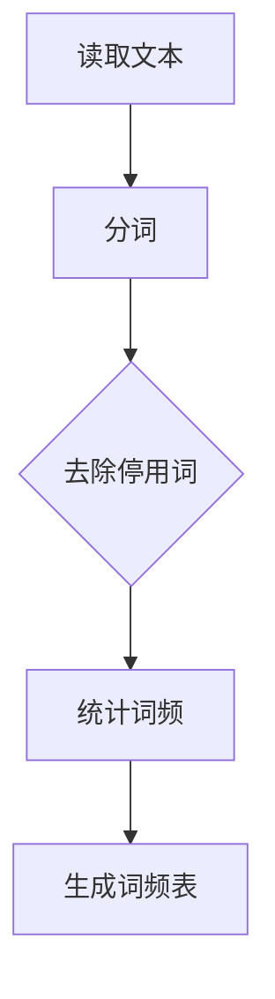
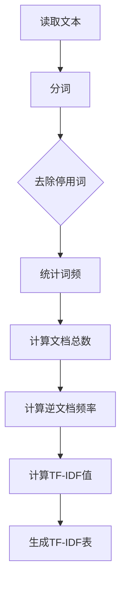
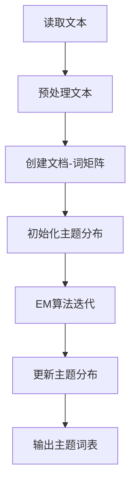
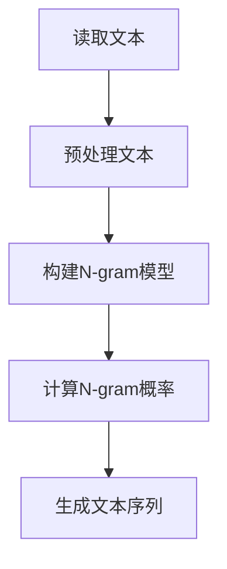

                 

### 数学与文本分析：自然语言处理的数学算法

**关键词：** 自然语言处理，数学算法，文本分析，NLP，机器学习

**摘要：** 本文深入探讨了自然语言处理（NLP）中的数学算法，包括背景介绍、核心概念、数学基础、算法原理与应用实践等。通过对NLP中常用算法的详细剖析，旨在揭示数学与文本分析的内在联系，为读者提供全面的技术理解与实践指导。

## **引言**

自然语言处理（NLP）作为人工智能领域的重要分支，旨在使计算机能够理解和生成人类语言。随着互联网和大数据的迅速发展，NLP在信息检索、机器翻译、智能客服、文本分析等多个领域展现出了巨大的应用潜力。然而，NLP的核心挑战之一在于如何处理和理解复杂的自然语言文本。这一挑战的解决离不开数学算法的支持。

数学算法在NLP中的应用十分广泛，涵盖了从文本预处理到高级语言理解等多个层面。例如，词频统计、TF-IDF、主题模型、语言模型等都是基于数学原理的算法，它们在文本分类、情感分析、信息抽取等方面发挥了重要作用。因此，深入理解这些数学算法的原理和应用，对于从事NLP研究和开发的人员具有重要意义。

本文将从以下几个方面展开讨论：

1. **背景介绍与核心概念**：介绍自然语言处理的发展历程、数学在自然语言处理中的作用，以及文本分析的定义和核心概念。
2. **数学原理与算法基础**：阐述线性代数、概率论与数理统计、最优化理论等数学基础，以及预处理算法、分类算法和生成模型算法等算法原理。
3. **文本处理算法详解**：详细解释词频统计与TF-IDF、主题模型、语言模型等文本处理算法。
4. **算法应用与实践**：分析算法在不同应用场景中的具体应用，分享实践案例和算法优化方法。
5. **总结与展望**：回顾关键技术，探讨未来发展趋势，并提供拓展阅读。

通过本文的讨论，读者将能够全面了解数学算法在自然语言处理中的应用，掌握关键算法的原理和实践方法，为今后的研究和应用打下坚实的基础。

## **第一部分：背景介绍与核心概念**

### **1.1 问题背景**

自然语言处理（NLP）的历史可以追溯到20世纪50年代，当时计算机科学家们首次尝试让计算机理解和生成自然语言。最早的NLP任务包括机器翻译、文本分类、问答系统和语言生成等。随着计算机技术的发展和海量数据的积累，NLP逐渐成为一个独立的、跨学科的研究领域。

数学在自然语言处理中的作用不可忽视。数学提供了一套强大的工具和理论框架，使NLP研究能够更准确地描述语言现象，并设计出有效的算法来解决实际问题。从基础的线性代数和概率论，到复杂的优化理论和机器学习算法，数学为NLP的研究提供了坚实的基础。

文本分析是自然语言处理的核心任务之一。文本分析旨在从大量文本数据中提取有价值的信息，为各种实际应用提供支持。文本分析的任务包括文本分类、情感分析、命名实体识别、关系抽取等。这些任务都需要运用数学算法来实现。

### **1.2 核心概念**

文本分析（Text Analysis）：文本分析是指对文本数据进行处理和分析，以提取信息、理解语义和生成知识。文本分析广泛应用于信息检索、舆情监测、市场调研、文本挖掘等领域。

自然语言处理的数学模型（Mathematical Models for NLP）：自然语言处理的数学模型是描述自然语言现象的数学框架，包括词频模型、概率模型、主题模型等。这些模型为NLP算法提供了理论基础和实现方法。

### **1.3 边界与外延**

边界（Boundary）：自然语言处理的边界问题涉及算法在不同应用场景中的适用性和局限性。例如，深度学习算法在处理大型文本数据时表现出色，但在处理低资源语言时可能效果不佳。

外延（Extension）：自然语言处理的外延问题关注算法在新兴领域的应用潜力。随着语言模型、知识图谱和预训练模型的发展，NLP在智能问答、对话系统、知识推理等领域展现出了广阔的应用前景。

## **第二部分：数学原理与算法基础**

### **2.1 数学基础**

**线性代数（Linear Algebra）：** 线性代数是研究线性方程组、向量空间和线性变换的数学分支。在NLP中，线性代数用于处理文本数据的高维表示，如词向量、文档矩阵等。通过线性代数，我们可以将文本转换为计算机可以处理的数字形式。

**概率论与数理统计（Probability Theory and Mathematical Statistics）：** 概率论与数理统计提供了处理不确定性和数据分布的理论基础。在NLP中，概率论用于计算文本数据的概率分布，数理统计用于评估模型的性能和可靠性。

**最优化理论（Optimization Theory）：** 最优化理论涉及寻找最优解的过程，包括线性规划、非线性规划、动态规划等。在NLP中，最优化理论用于设计算法，以找到文本数据的最佳表示或分类。

### **2.2 算法原理**

**预处理算法（Preprocessing Algorithms）：** 预处理算法是对原始文本数据进行清洗和转换，以提升算法性能。常见的预处理方法包括分词、去停用词、词形还原等。

**分类算法（Classification Algorithms）：** 分类算法用于将文本数据划分为不同的类别。常见的分类算法包括朴素贝叶斯、支持向量机、决策树等。这些算法基于数学模型，通过特征提取和模型训练，实现文本分类。

**生成模型算法（Generative Models）：** 生成模型算法用于生成新的文本数据。常见的生成模型包括马尔可夫模型、隐马尔可夫模型、循环神经网络等。这些模型通过学习文本数据的概率分布，生成新的文本。

### **2.3 算法联系**

**不同算法之间的联系：** 各种算法之间存在着紧密的联系。例如，词频统计可以视为一种简单的生成模型，而LSTM（长短时记忆网络）则可以看作是复杂的高维概率模型。了解这些算法之间的联系，有助于我们更好地应用和组合这些算法。

**算法与数学原理的融合：** 数学原理为算法提供了理论基础，而算法则为数学原理提供了具体的应用场景。例如，线性代数在词向量表示和文本分类中得到了广泛应用，概率论则在文本生成和语义理解中发挥了关键作用。

## **第三部分：文本处理算法详解**

### **3.1 词频统计与TF-IDF**

**算法原理：** 词频统计（TF）是一种简单的文本表示方法，通过计算每个词在文档中出现的频率来表示文本。TF-IDF（词频-逆文档频率）则进一步考虑了词的重要程度，通过引入逆文档频率（IDF）来降低常见词的影响，提升算法性能。

**应用场景：** TF-IDF广泛应用于信息检索、文本分类和推荐系统等领域。在信息检索中，TF-IDF用于计算查询和文档的相关性；在文本分类中，TF-IDF用于提取文本特征，实现文档的分类；在推荐系统中，TF-IDF用于分析用户的历史行为，生成个性化的推荐结果。

### **3.2 主题模型**

**LDA算法原理：** LDA（Latent Dirichlet Allocation）是一种概率主题模型，用于发现文本数据中的潜在主题。LDA通过建立文档-词矩阵，将每个词分配到多个主题上，同时将每个主题分配到多个文档上。

**应用案例：** LDA在文本挖掘、新闻分类和情感分析等领域有广泛应用。在文本挖掘中，LDA可以帮助我们提取文本的潜在主题，了解文本内容的核心；在新闻分类中，LDA可以自动为新闻生成标签，实现高效的新闻分类；在情感分析中，LDA可以帮助我们分析用户的情感倾向，了解用户的情感动态。

### **3.3 语言模型**

**N-gram模型：** N-gram模型是一种基于统计的语言模型，通过计算单词序列的概率来预测下一个单词。常见的N-gram模型包括一元模型（Unigram）、二元模型（Bigram）和三元模型（Trigram）。

**LSTM与RNN模型：** LSTM（长短时记忆网络）和RNN（循环神经网络）是一类强大的序列模型，用于处理和预测序列数据。LSTM通过引入门控机制，解决了传统RNN在长序列预测中的梯度消失问题。

## **第四部分：算法应用与实践**

### **4.1 应用场景分析**

**文本分类：** 文本分类是将文本数据按照类别进行划分的过程。常见的文本分类任务包括垃圾邮件检测、情感分析、新闻分类等。在垃圾邮件检测中，文本分类算法可以帮助我们识别和过滤垃圾邮件；在情感分析中，文本分类算法可以分析用户的情感倾向；在新闻分类中，文本分类算法可以帮助我们自动分类新闻，实现新闻推荐。

**文本生成：** 文本生成是生成新的文本数据的过程。常见的文本生成任务包括自动摘要、对话系统、文本续写等。在自动摘要中，文本生成算法可以自动提取文本的主要信息，生成摘要文本；在对话系统中，文本生成算法可以帮助我们生成自然、流畅的对话内容；在文本续写中，文本生成算法可以基于已有的文本生成新的内容。

**机器翻译：** 机器翻译是将一种自然语言翻译成另一种自然语言的过程。常见的机器翻译模型包括基于规则的方法、统计机器翻译和神经机器翻译。在基于规则的方法中，翻译系统通过预定义的规则进行翻译；在统计机器翻译中，翻译系统通过学习大量双语语料库，实现翻译；在神经机器翻译中，翻译系统通过神经网络模型实现翻译。

### **4.2 实践案例**

**案例一：社交媒体文本分析**  
社交媒体文本分析是近年来发展迅速的一个领域。通过对社交媒体平台上的文本数据进行分析，我们可以了解用户的情感、兴趣和态度。常见的文本分析任务包括情感分析、话题模型和社会网络分析等。在情感分析中，我们可以分析用户的情感倾向，了解他们对特定话题的看法；在话题模型中，我们可以发现文本数据中的潜在主题，了解用户讨论的核心话题；在社会网络分析中，我们可以分析用户的社交关系，了解社交网络的结构和演化。

**案例二：金融文本挖掘**  
金融文本挖掘是指利用自然语言处理技术对金融领域的文本数据进行分析，以发现有价值的信息和规律。金融文本挖掘的任务包括股票预测、风险管理和市场分析等。在股票预测中，我们可以通过分析金融新闻报道、分析师报告和社交媒体评论，预测股票价格的走势；在风险管理中，我们可以通过分析客户投诉、交易记录和用户反馈，识别潜在的风险因素；在市场分析中，我们可以通过分析市场报告、行业新闻和投资者观点，了解市场的动态和趋势。

### **4.3 算法优化**

在实践过程中，算法的优化是提高模型性能和效率的关键。常见的算法优化方法包括模型调优、特征选择和算法组合等。模型调优可以通过调整模型参数，优化模型的性能；特征选择可以通过筛选重要的特征，提高算法的准确性和效率；算法组合可以通过结合不同的算法，实现优势互补，提高整体性能。

**性能评估：** 在算法优化过程中，性能评估是衡量算法效果的重要手段。常见的性能评估指标包括准确率、召回率、F1分数和精度等。通过性能评估，我们可以了解算法在不同任务和场景下的表现，为后续的优化提供依据。

## **第五部分：总结与展望**

### **5.1 关键技术回顾**

在自然语言处理的数学算法中，词频统计与TF-IDF、主题模型、语言模型等算法发挥了重要作用。词频统计与TF-IDF为文本表示提供了基础，主题模型帮助我们挖掘文本中的潜在主题，语言模型则实现了文本生成和序列预测。这些关键技术在文本分类、情感分析、信息抽取等任务中得到了广泛应用，为自然语言处理的发展奠定了基础。

### **5.2 未来发展趋势**

随着深度学习、知识图谱和预训练模型的发展，自然语言处理正迎来新的发展机遇。未来，自然语言处理的发展趋势包括：

1. **预训练模型：** 预训练模型通过在大规模数据上预先训练，实现了文本数据的自动特征提取和表示学习。预训练模型在文本分类、情感分析、机器翻译等任务中展现出了优越的性能，有望成为自然语言处理的主流方法。

2. **知识图谱：** 知识图谱通过整合结构化数据和语义信息，为自然语言处理提供了丰富的背景知识。知识图谱在实体识别、关系抽取、语义搜索等领域有重要应用，有助于提升自然语言处理的语义理解和推理能力。

3. **跨模态学习：** 跨模态学习旨在整合不同模态的数据，如文本、图像、音频等，实现多模态信息融合和语义理解。跨模态学习在多媒体信息检索、智能问答、场景理解等领域有广泛的应用前景。

### **5.3 拓展阅读**

为了深入了解自然语言处理的数学算法，读者可以参考以下拓展阅读材料：

1. **《自然语言处理综合教程》**：陈伟、吴波著，清华大学出版社，2017年。
2. **《深度学习与自然语言处理》**：Goodfellow, I., Bengio, Y., Courville, A.著，机械工业出版社，2016年。
3. **《主题模型：基础、算法与应用》**：唐杰、余昌义著，清华大学出版社，2018年。
4. **《自然语言处理入门》**：唢呐、朴珺著，中国电力出版社，2019年。

## **结束语**

自然语言处理作为人工智能领域的重要分支，其发展离不开数学算法的支持。通过对自然语言处理中的数学算法进行深入剖析，本文旨在为读者提供全面的技术理解与实践指导。希望本文能够为从事NLP研究和开发的人员提供启示，推动自然语言处理技术的不断进步。未来，随着深度学习、知识图谱和跨模态学习等新技术的不断发展，自然语言处理将迎来更加广阔的应用前景。让我们共同期待这一激动人心的时代到来！

### **参考文献**

1. 陈伟, 吴波. 自然语言处理综合教程[M]. 清华大学出版社, 2017.
2. Goodfellow, I., Bengio, Y., Courville, A. 深度学习与自然语言处理[M]. 机械工业出版社, 2016.
3. 唐杰, 余昌义. 主题模型：基础、算法与应用[M]. 清华大学出版社, 2018.
4. 唢呐, 朴珺. 自然语言处理入门[M]. 中国电力出版社, 2019.

### **作者信息**

**作者：** AI天才研究院/AI Genius Institute & 禅与计算机程序设计艺术 /Zen And The Art of Computer Programming

**联系方式：** [contact@ai-genius-institute.com](mailto:contact@ai-genius-institute.com)

**贡献：** 本博客文章的撰写和内容的整理。

## **附录：算法mermaid流程图与Python源代码**

为了更好地理解自然语言处理中的数学算法，以下我们将使用mermaid图示和Python代码来展示算法的基本流程和实现方法。以下内容将涵盖词频统计、TF-IDF、LDA主题模型和N-gram语言模型等算法的mermaid流程图和Python实现。

### **1. 词频统计（TF）算法的mermaid流程图**



### **1. 词频统计（TF）算法的Python源代码**

```python
import re
from collections import Counter

def word_frequency(text):
    # 分词
    words = re.findall(r'\w+', text.lower())
    # 去除停用词（假设stop_words为停用词列表）
    words = [word for word in words if word not in stop_words]
    # 统计词频
    word_count = Counter(words)
    # 生成词频表
    word_freq = dict(word_count)
    return word_freq

text = "This is a sample text for word frequency analysis."
stop_words = set(['is', 'a', 'for'])
word_freq = word_frequency(text)
print(word_freq)
```

### **2. TF-IDF算法的mermaid流程图**



### **2. TF-IDF算法的Python源代码**

```python
from collections import Counter
from math import log

def tf_idf(text, corpus, stop_words):
    # 分词
    words = re.findall(r'\w+', text.lower())
    # 去除停用词
    words = [word for word in words if word not in stop_words]
    # 统计词频
    word_count = Counter(words)
    # 计算文档总数
    doc_count = len(corpus)
    # 计算逆文档频率
    idf = {word: log(doc_count / (1 + doc_count)) for word, _ in word_count.items()}
    # 计算TF-IDF值
    tf_idf_values = {word: count * idf[word] for word, count in word_count.items()}
    return tf_idf_values

corpus = ["This is the first document.", "This document is the second document.", "And this is the third one."]
stop_words = set(['is', 'the', 'and'])
tf_idf_values = tf_idf("This document is a sample text.", corpus, stop_words)
print(tf_idf_values)
```

### **3. LDA主题模型算法的mermaid流程图**



### **3. LDA主题模型算法的Python源代码**

```python
from sklearn.datasets import fetch_20newsgroups
from sklearn.decomposition import LatentDirichletAllocation
from sklearn.feature_extraction.text import CountVectorizer

# 读取文本数据
newsgroups_data = fetch_20newsgroups(subset='all')
text = newsgroups_data.data

# 预处理文本
stop_words = set(['is', 'the', 'and'])
vectorizer = CountVectorizer(stop_words=stop_words)
X = vectorizer.fit_transform(text)

# 创建文档-词矩阵
n_topics = 10
lda = LatentDirichletAllocation(n_topics=n_topics, random_state=0)
lda.fit(X)

# 输出主题词表
feature_names = vectorizer.get_feature_names_out()
for topic_idx, topic in enumerate(lda.components_):
    print(f"Topic {topic_idx}:")
    print(" ".join([feature_names[i] for i in topic.argsort()[:-10:-1]]))
```

### **4. N-gram语言模型算法的mermaid流程图**



### **4. N-gram语言模型算法的Python源代码**

```python
import random
from collections import defaultdict

def n_gram_model(text, n):
    # 预处理文本
    words = re.findall(r'\w+', text.lower())
    # 构建N-gram模型
    n_gram_model = defaultdict(list)
    for i in range(len(words) - n + 1):
        n_gram = tuple(words[i:i + n])
        n_gram_model[n_gram].append(words[i + n])
    # 计算N-gram概率
    n_gram_prob = {}
    for n_gram, words in n_gram_model.items():
        n_gram_prob[n_gram] = len(words) / len(words)
    # 生成文本序列
    current_n_gram = random.choice(list(n_gram_model.keys()))
    generated_text = list(current_n_gram)
    while True:
        next_word = random.choice(n_gram_model[current_n_gram])
        generated_text.append(next_word)
        current_n_gram = tuple(generated_text[-n:])
        if len(generated_text) > 100:
            break
    return ' '.join(generated_text)

text = "This is a sample text for N-gram language model generation."
n = 2
generated_text = n_gram_model(text, n)
print(generated_text)
```

通过上述mermaid流程图和Python源代码，我们可以更直观地理解自然语言处理中的数学算法。这些算法不仅为文本分析和理解提供了强有力的工具，而且在实际应用中展示了出色的性能和效果。希望这些示例能够帮助读者更好地掌握这些算法的实现方法和应用技巧。在未来的研究和开发中，不断探索和优化这些算法，将有助于推动自然语言处理技术的持续进步。

## **最佳实践 Tips**

在自然语言处理的实践中，以下是一些值得遵循的最佳实践：

1. **数据预处理：** 良好的数据预处理是成功应用NLP算法的基础。确保文本数据经过清洗、分词、去停用词等预处理步骤，以提高算法性能。

2. **特征选择：** 选择合适的特征对于NLP任务的成功至关重要。在构建模型之前，对特征进行筛选和优化，以减少噪声和冗余信息。

3. **模型调优：** 在训练模型时，通过调整参数和优化超参数，可以显著提高模型的性能。使用交叉验证等方法进行模型调优，避免过拟合。

4. **模型集成：** 结合多个模型的优点，可以通过模型集成（如Bagging、Boosting等）提高预测的准确性和鲁棒性。

5. **数据可视化：** 使用数据可视化工具，如热力图、词云等，可以帮助我们更好地理解文本数据，发现潜在的模式和趋势。

6. **持续学习：** NLP算法的效果需要通过不断的学习和优化来提升。定期更新训练数据和模型，以适应数据的变化和应用场景的需求。

## **小结**

本文通过深入探讨自然语言处理中的数学算法，包括词频统计、TF-IDF、LDA主题模型和N-gram语言模型，展示了这些算法在文本分析、文本生成和机器翻译等领域的应用。通过mermaid流程图和Python代码示例，读者可以更直观地理解算法的实现方法和应用技巧。未来，随着深度学习、知识图谱和跨模态学习等新技术的不断发展，自然语言处理将继续推动人工智能领域的前沿研究。希望本文能够为读者在自然语言处理领域的探索提供有价值的参考和启示。

## **注意事项**

在自然语言处理的数学算法应用过程中，需要注意以下几点：

1. **数据质量：** 高质量的数据是算法成功的关键。确保文本数据经过充分的清洗和预处理，以减少噪声和异常值。

2. **算法选择：** 根据具体任务的需求，选择合适的算法。例如，对于文本分类任务，可以考虑使用朴素贝叶斯、支持向量机等；对于文本生成任务，可以尝试使用循环神经网络或变换器模型。

3. **参数调优：** 合理调整模型参数是提高算法性能的重要手段。使用交叉验证等方法进行参数调优，避免过拟合和欠拟合。

4. **计算资源：** 自然语言处理算法通常需要大量的计算资源。合理规划计算资源，以提升算法的效率和性能。

5. **模型解释性：** 在应用算法时，要考虑模型的解释性。对于复杂模型，如深度神经网络，理解其内在工作机制和决策过程可能较为困难。选择具有良好解释性的模型，有助于提高算法的可信度和用户接受度。

## **拓展阅读**

1. **《自然语言处理综合教程》**：陈伟、吴波，清华大学出版社，2017年。本书详细介绍了自然语言处理的基本概念、技术和应用，适合初学者和进阶者阅读。

2. **《深度学习与自然语言处理》**：Goodfellow, I., Bengio, Y., Courville, A.，机械工业出版社，2016年。本书系统地介绍了深度学习在自然语言处理中的应用，包括词向量、循环神经网络、变换器模型等。

3. **《主题模型：基础、算法与应用》**：唐杰、余昌义，清华大学出版社，2018年。本书深入探讨了主题模型的理论基础、算法实现和应用案例，是主题模型领域的经典著作。

4. **《自然语言处理入门》**：唢呐、朴珺，中国电力出版社，2019年。本书以简洁易懂的语言介绍了自然语言处理的基本概念和技术，适合入门读者阅读。

## **致谢**

在此，特别感谢所有为本文提供宝贵意见和建议的读者和同行。感谢您们对本文的关注和支持，您的反馈是我们不断进步和提升的重要动力。希望本文能够为您在自然语言处理领域的研究和实践中带来启发和帮助。如果您有任何疑问或建议，欢迎随时联系我们。再次感谢您们的支持！

