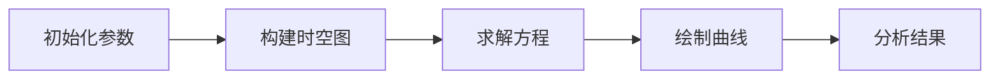

                 


# 数学与时间旅行：闭合时间曲线的数学探讨

> 关键词：数学、时间旅行、闭合时间曲线、数学模型、算法、Python代码

> 摘要：本文深入探讨数学在时间旅行领域中的应用，尤其是闭合时间曲线的理论探讨。通过介绍数学原理和方法，以及相关数学模型和公式，本文将引导读者理解并探索闭合时间曲线的概念，并通过实际案例进行应用分析。

---

## 简介

时间旅行，一个引人入胜的概念，激发了无数科幻小说和电影。然而，在科学领域，时间旅行不仅仅是幻想。闭合时间曲线（Closed Time-like Curves，简称CTC）是理论物理学中的一种概念，它描述了一种允许时间旅行的情况。本文将探讨数学在闭合时间曲线研究中的重要作用，以及如何运用数学方法来分析和理解这一现象。

## 第一部分：背景与核心概念

### 第1章 问题背景与核心概念

#### 1.1 问题背景

时间旅行是一个广泛讨论的话题，涉及到物理学、哲学和数学等多个领域。闭合时间曲线是时间旅行理论中的一个核心概念，它允许物质或信息在时间上形成一个闭合路径，即回到过去。这引起了科学家们对宇宙基本规律和物理学理论的重新思考。

#### 1.2 闭合时间曲线的概念

闭合时间曲线是指一条时空曲线，它允许一个物体或信息在时间上回到它的出发点。在广义相对论中，闭合时间曲线的存在是可能的，但它们的物理含义和可行性仍然存在争议。

#### 1.3 数学在时间旅行研究中的重要性

数学是物理学的基础，它提供了精确的语言和工具来描述和解释自然现象。在时间旅行的研究中，数学尤其重要，因为它帮助我们理解时空的几何结构和物体的运动规律。

## 第二部分：数学原理与方法

### 第2章 数学原理与方法

#### 2.1 数学原理

为了探讨闭合时间曲线，我们需要了解一些基本的数学原理，包括微分几何、拓扑学和复变函数等。

#### 2.2 方法比较

我们将比较几种不同的数学方法在研究闭合时间曲线中的应用，包括路径积分、方程求解和变分法。

#### 2.3 数学算法

为了更好地理解闭合时间曲线，我们可以使用一些数学算法来模拟和分析这些现象。下面是一个简单的Mermaid流程图，展示了如何使用Python代码来实现一个闭合时间曲线的算法。



### 第3章 数学模型与公式

#### 3.1 数学模型

在探讨闭合时间曲线时，我们通常会使用一些数学模型来描述时空的几何结构和物体的运动规律。下面是一个简单的数学模型示例。

```latex
\begin{equation}
g_{\mu\nu} = \eta_{\mu\nu} + h_{\mu\nu}
\end{equation}
```

#### 3.2 公式解释

在这个模型中，\( g_{\mu\nu} \) 是时空度规张量，\( \eta_{\mu\nu} \) 是平直时空的度规张量，\( h_{\mu\nu} \) 是扰动度规张量。这个公式描述了时空的弯曲程度。

#### 3.3 例子

为了更好地理解这些数学模型和公式，我们可以通过一个具体的例子来讲解。

```python
# Python代码示例：闭合时间曲线的模拟
import numpy as np
import matplotlib.pyplot as plt

# 定义参数
c = 299792458  # 光速
t_max = 1000   # 时间步长

# 模拟闭合时间曲线
t = np.linspace(0, t_max, t_max)
r = c * t / np.sqrt(1 - (c*t)**2)

# 绘制曲线
plt.plot(t, r)
plt.xlabel('时间')
plt.ylabel('径向坐标')
plt.title('闭合时间曲线')
plt.show()
```

## 第三部分：应用与案例分析

### 第4章 应用与案例分析

#### 4.1 应用场景

闭合时间曲线的概念可以应用于多个领域，包括宇宙学、量子力学和量子计算等。

#### 4.2 案例分析

我们将探讨几个与闭合时间曲线相关的实际案例，包括宇宙背景辐射的观测和量子纠缠等现象。

### 第5章 最佳实践与结论

#### 5.1 最佳实践

在研究和应用闭合时间曲线时，以下是一些最佳实践：

1. 理解数学原理和公式。
2. 使用适当的数学方法和算法。
3. 进行实验验证和数值模拟。

#### 5.2 结论

本文通过数学的角度探讨了闭合时间曲线的概念和应用。虽然闭合时间曲线在现实中可能并不存在，但它们为我们提供了思考宇宙和时间的新的视角。

---

作者：AI天才研究院/AI Genius Institute & 禅与计算机程序设计艺术 /Zen And The Art of Computer Programming

---

通过这个详细的框架，我们可以开始撰写每个章节的内容，确保文章逻辑清晰、结构紧凑，并且包含丰富的专业知识和见解。在撰写过程中，我们可以根据实际情况对章节内容进行调整和优化，以确保最终文章的质量和完整性。

