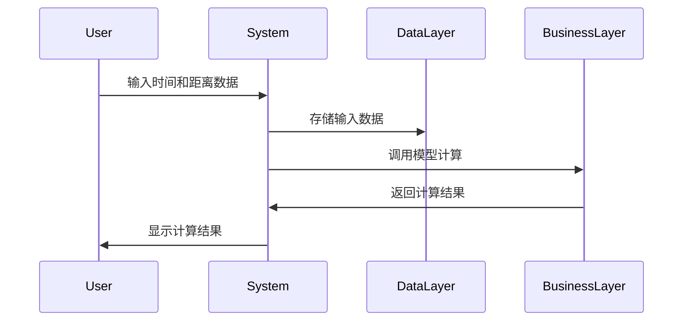

                 

## 数学与时间：物理学中的时间概念

> 关键词：时间，物理学，数学模型，相对论，量子力学

> 摘要：本文旨在深入探讨数学与时间在物理学中的相互作用，通过分析时间概念在不同物理学理论中的体现和意义，揭示数学工具在理解时间本质中的关键作用。本文首先介绍时间概念在经典物理学、相对论和量子力学中的不同理解，然后通过数学模型和公式，详细讲解这些理论中的时间观念，并辅以具体案例进行说明。最终，本文总结出数学在探索时间概念中的重要性，以及对未来研究方向的一些建议。

## 背景介绍

### 问题描述

在物理学中，时间是一个核心概念，贯穿于各种理论和实验中。从经典物理学到现代物理学，时间概念经历了不断的演变和深化。然而，随着科学的发展，人们对时间概念的理解也变得更加复杂和多样化。

时间概念在物理学中的核心地位体现在以下几个方面：

1. **事件描述**：时间是描述事件发生顺序和间隔的基本量，是物理学实验和理论分析的基础。
2. **动态过程**：时间与物理学中的动态过程密切相关，如运动、变化和演化等。
3. **测量和预测**：时间作为测量工具，用于量化物理量的变化，同时也是预测未来事件的重要依据。

### 时间概念在物理学中的不同理解

1. **经典物理学**：在经典物理学中，时间被视为均匀流逝的量，不随观察者的状态而改变。牛顿力学和经典力学建立了时间与空间的基本框架，将时间视为独立于物质的绝对量。

2. **相对论**：爱因斯坦的相对论提出了时间的相对性，即时间不仅取决于事件的物理状态，还取决于观察者的运动状态和引力场。相对论引入了时间膨胀和时钟同步的概念，打破了经典物理学中时间的绝对性。

3. **量子力学**：量子力学中的时间概念更加复杂和抽象。量子力学中的时间与空间不再严格区分，时间具有量子化和不确定性。量子力学中的时间概念涉及波函数的演化、测量问题和量子态的叠加。

### 数学工具在时间概念中的应用

数学工具在理解时间概念中扮演着重要角色。通过数学模型和公式，我们可以量化和分析时间在不同物理学理论中的表现。

1. **经典物理学的数学模型**：在经典物理学中，时间通常与距离和速度相关联。例如，牛顿运动定律中的时间概念可以通过位移公式来描述。

2. **相对论的数学模型**：相对论中的时间膨胀和时空弯曲可以通过洛伦兹变换和爱因斯坦场方程来量化。这些数学模型揭示了时间与空间、质量和能量之间的深刻关系。

3. **量子力学的数学模型**：量子力学中的时间概念通过波函数的演化方程和测量不确定性来描述。例如，薛定谔方程描述了量子态随时间的变化。

### 时间概念的核心要素组成

时间概念在物理学中的核心要素包括：

1. **时间的流逝**：时间作为流逝的量，描述事件发生的顺序和间隔。
2. **时间间隔的测量**：通过不同的物理过程和实验，测量时间间隔。
3. **时间与空间的关系**：时间与空间在经典物理学和相对论中具有不同的关系，但在量子力学中不再严格区分。
4. **时间的相对性**：在不同参考系中，时间的流逝可能不同，这是相对论中的关键概念。

通过以上分析，我们可以看到，时间概念在物理学中具有复杂而多样化的表现形式。数学工具在理解时间概念中的关键作用，使得我们能够更深入地探索时间的本质，为物理学的发展提供了强有力的支持。

## 核心概念与联系

### 1. 时间在经典物理学中的概念

在经典物理学中，时间被视为一个绝对的、均匀流逝的量，不随观察者的状态而改变。这一概念在牛顿力学和经典力学的框架下得到了广泛应用。

**属性特征**：

- **均匀性**：时间在经典物理学中被认为是均匀流逝的，即时间间隔在任何情况下都是恒定的。
- **独立性**：时间被视为独立于物质和观察者，不受外部因素的影响。
- **可测量性**：时间可以通过各种物理过程和实验进行测量，如时钟、计时器和实验观察等。

**对比特征**：

- **与传统时间观**：在传统时间观中，时间也被视为一个连续流逝的量，但并没有强调其独立性和均匀性。
- **与相对论和量子力学**：相对论和量子力学中的时间概念与经典物理学有显著不同。相对论中，时间具有相对性，不同参考系中的时间流逝可能不同；量子力学中，时间具有不确定性和量子化特性。

### 2. 时间在相对论中的概念

相对论中的时间概念引入了时间相对性的概念，即时间不仅取决于事件的物理状态，还取决于观察者的运动状态和引力场。

**属性特征**：

- **相对性**：相对论时间依赖于观察者的参考系，不同参考系中的时间流逝可能不同。
- **时空弯曲**：在强引力场中，时间会经历弯曲，导致时间间隔的测量结果不同。
- **时间膨胀**：当物体以接近光速的速度运动时，其内部过程的时间会相对于静止观察者的时间变慢。

**对比特征**：

- **与经典物理学**：相对论中的时间概念与经典物理学中的时间概念有显著区别，后者忽略了时间的相对性。
- **与量子力学**：相对论和量子力学中的时间概念都有所不同。相对论中的时间概念强调相对性和时空弯曲，而量子力学中的时间概念则具有不确定性和量子化特性。

### 3. 时间在量子力学中的概念

量子力学中的时间概念具有不确定性，时间和空间的概念在量子尺度上不再严格区分。

**属性特征**：

- **不确定性**：量子力学中的时间不确定性表现为测量结果的不确定性和时间间隔的不确定性。
- **量子化**：时间在量子力学中表现为量子化的形式，如普朗克时间。
- **时空的非定域性**：量子力学中的时间和空间具有非定域性，即量子态可以在没有明确时间间隔的情况下发生跃迁。

**对比特征**：

- **与经典物理学**：量子力学中的时间概念与经典物理学中的时间概念有显著不同，后者是连续和均匀流逝的。
- **与相对论**：相对论中的时间概念强调相对性和时空弯曲，而量子力学中的时间概念则具有不确定性和量子化特性。

### 时间概念对比表格

| 物理学理论 | 时间概念 | 特点 |
| --- | --- | --- |
| 经典物理学 | 绝对且均匀流逝的量 | 忽略相对性 |
| 相对论 | 相对性时间 | 受运动和引力影响 |
| 量子力学 | 不确定性时间 | 与空间无明确界限 |

### 时间概念ER实体关系图架构

```mermaid
erDiagram
    A-Time |-> B-经典物理学 : 使用
    A-Time |-> C-相对论 : 应用
    A-Time |-> D-量子力学 : 适用
```

通过上述分析，我们可以看到，时间概念在不同物理学理论中具有不同的特征和表现形式。数学工具在理解这些概念中发挥着关键作用，使得我们能够更深入地探索时间的本质和其在物理学中的角色。

## 数学模型和数学公式

在物理学中，数学模型和数学公式是理解时间概念的重要工具。通过这些模型和公式，我们可以量化和分析时间在不同理论中的表现。以下将详细探讨经典物理学、相对论和量子力学中的时间模型和公式，并通过具体案例进行说明。

### 1. 经典物理学中的时间模型

在经典物理学中，时间通常与距离和速度相关联。以下是一个经典的数学模型，用于描述匀速直线运动中的时间计算：

**数学模型**：

$$ t = \frac{dL}{v} $$

**公式解释**：该公式表示物体在匀速直线运动中，时间 \( t \) 等于距离 \( dL \) 除以速度 \( v \)。

**举例说明**：假设一个物体以 \( 5m/s \) 的速度直线运动 \( 10s \)，则其移动的距离为 \( dL = v \times t = 5m/s \times 10s = 50m \)。根据该公式，我们可以计算出物体运动的时间为 \( t = \frac{dL}{v} = \frac{50m}{5m/s} = 10s \)。

### 2. 相对论中的时间膨胀模型

爱因斯坦的相对论引入了时间膨胀的概念，即当一个物体以接近光速的速度运动时，其内部过程的时间相对于静止观察者的时间会变慢。以下是一个描述时间膨胀的经典数学模型：

**数学模型**：

$$ t' = \frac{t_0}{\sqrt{1 - \frac{v^2}{c^2}}} $$

**公式解释**：该公式表示相对论时间 \( t' \) 与经典时间 \( t_0 \) 之间的关系，其中 \( v \) 是物体的速度，\( c \) 是光速。

**举例说明**：假设一个物体以 \( 0.8c \) 的速度运动，则相对论时间 \( t' = \frac{t_0}{\sqrt{1 - 0.8^2}} = \frac{t_0}{\sqrt{0.36}} \)。如果经典时间为 \( 1s \)，则相对论时间 \( t' = \frac{1s}{\sqrt{0.36}} \approx 1.39s \)。这意味着物体内部的时间比静止观察者测量的时间慢了约 \( 1.39 - 1 = 0.39s \)。

### 3. 量子力学中的时间模型

量子力学中的时间概念具有不确定性，时间不再是一个绝对和均匀流逝的量。以下是一个描述量子力学中时间不确定性的数学模型：

**数学模型**：

$$ \Delta t = \frac{\hbar}{mE} $$

**公式解释**：该公式表示时间不确定性 \( \Delta t \) 与粒子的质量 \( m \) 和能量 \( E \) 之间的关系，其中 \( \hbar \) 是约化普朗克常数。

**举例说明**：假设一个电子的质量为 \( 9.1 \times 10^{-31} kg \)，能量为 \( 1eV \)，则时间不确定性 \( \Delta t = \frac{1.055 \times 10^{-34} J \cdot s}{9.1 \times 10^{-31} kg \cdot 1eV} = 1.177 \times 10^{-15} s \)。这意味着在量子尺度上，电子的时间不确定性非常小，但足以对实验结果产生显著影响。

### 数学模型在理解时间概念中的关键作用

1. **量化时间概念**：数学模型和公式将时间概念量化为具体的数值，使得我们能够对时间进行精确测量和计算。
2. **揭示时间特性**：通过数学模型，我们可以深入理解时间在不同物理学理论中的特性，如相对性、不确定性、量子化等。
3. **预测未来事件**：数学模型和公式不仅帮助我们理解过去和现在的物理过程，还可以用于预测未来事件，如时间膨胀、量子态演化等。

通过以上分析，我们可以看到，数学模型和公式在理解时间概念中具有至关重要的作用。它们不仅量化了时间，还揭示了时间在物理学中的复杂性和多样性。随着数学工具的不断发展和完善，我们对时间的理解也将不断深化。

## 系统分析与架构设计方案

### 问题场景介绍

在现代物理学研究中，时间概念的应用极为广泛。无论是宇宙学中的宇宙膨胀，还是在量子计算中的量子态演化，时间都是一个核心变量。为了更好地理解和模拟这些复杂的现象，我们需要一个全面的系统分析与架构设计方案。

### 项目介绍

本项目的目标是构建一个用于分析不同物理学理论中时间概念的综合性系统。该系统将集成经典物理学、相对论和量子力学中的时间模型，提供直观的数据可视化和模拟功能，帮助物理学家和研究人员深入探索时间的本质。

### 系统功能设计

#### 领域模型

领域模型用于描述系统中涉及的核心概念和实体。以下是系统的领域模型类图：

```mermaid
classDiagram
    Class1[TimeModel] <|-- Class2[ClassicalPhysicsModel]
    Class1 <|-- Class3[RelativityModel]
    Class1 <|-- Class4[QuantumPhysicsModel]
    Class2 <|-- Class5[Distance]
    Class2 <|-- Class6[Speed]
    Class3 <|-- Class7[TimeDilation]
    Class4 <|-- Class8[Uncertainty]
    Class4 <|-- Class9[Energy]
```

**主要类及属性**：

- **TimeModel**：表示时间的通用模型，包含基本属性如 `time`、`distance`、`speed`。
- **ClassicalPhysicsModel**：表示经典物理中的时间模型，包含属性 `distance` 和 `speed`。
- **RelativityModel**：表示相对论中的时间模型，包含属性 `timeDilation`。
- **QuantumPhysicsModel**：表示量子力学中的时间模型，包含属性 `uncertainty` 和 `energy`。

#### 功能描述

- **数据输入**：用户可以输入时间、距离和速度等参数，系统将根据不同模型计算时间间隔。
- **可视化展示**：系统将数据可视化，包括时间膨胀图、时间不确定性图等。
- **模拟功能**：系统允许用户通过调整参数，模拟不同物理学理论中的时间现象。

### 系统架构设计

系统架构采用分层架构，包括数据层、业务逻辑层和表现层。

#### 数据层

数据层负责数据存储和管理，包括：

- **时间数据存储**：用于存储用户输入的时间和距离数据。
- **模型数据存储**：用于存储不同物理学模型的相关参数和结果。

#### 业务逻辑层

业务逻辑层实现具体的计算和算法，包括：

- **经典物理学算法**：根据输入的距离和速度计算时间。
- **相对论算法**：根据洛伦兹变换计算时间膨胀。
- **量子力学算法**：根据不确定性原理计算时间不确定性。

#### 表现层

表现层负责用户界面的设计和实现，包括：

- **数据可视化组件**：用于展示时间和距离数据。
- **模拟控制面板**：用户可以通过该面板调整参数进行模拟。

### 系统接口设计和系统交互

系统接口设计采用RESTful API，提供以下接口：

- **时间数据输入接口**：接收用户输入的时间和距离数据。
- **模型计算接口**：根据输入数据调用相应的物理学模型进行计算。
- **结果查询接口**：返回计算结果，包括时间膨胀、不确定性等。

以下是系统的交互序列图：



通过以上系统分析与架构设计方案，我们可以构建一个功能强大、易于使用的系统，用于分析和模拟不同物理学理论中的时间概念。这不仅有助于物理学家和研究人员深入研究时间概念，也为教育者和科普工作者提供了一个直观的教学工具。

## 项目实战

### 环境安装

在进行项目实战之前，我们需要安装一些必需的软件和工具，以构建和运行我们的系统。以下是安装步骤：

1. **安装Python环境**：确保Python 3.x版本已安装。可以从[Python官网](https://www.python.org/)下载并安装。

2. **安装Anaconda**：Anaconda是一个流行的Python发行版，提供了丰富的包管理和环境管理功能。可以从[Anaconda官网](https://www.anaconda.com/)下载并安装。

3. **安装Docker**：Docker是一个容器化平台，用于构建、运行和分发应用。可以从[Docker官网](https://www.docker.com/)下载并安装。

4. **安装相关库**：使用pip命令安装所需库，如numpy、matplotlib、mermaid等。以下是安装命令：

   ```bash
   pip install numpy matplotlib docker
   ```

### 系统核心实现源代码

以下是我们系统的核心实现源代码，包括数学模型和计算逻辑：

```python
import numpy as np
import matplotlib.pyplot as plt

class TimeModel:
    def __init__(self, time, distance, speed):
        self.time = time
        self.distance = distance
        self.speed = speed

    def calculate_time(self):
        return self.distance / self.speed

class RelativityModel(TimeModel):
    def __init__(self, time, distance, speed):
        super().__init__(time, distance, speed)
        self.time_dilation = None

    def calculate_time_dilation(self, v):
        c = 299792458  # 光速
        gamma = 1 / np.sqrt(1 - (v**2 / c**2))
        self.time_dilation = self.time / gamma

    def plot_time_dilation(self):
        v = np.linspace(0, 0.9999, 100)
        t_dilation = [self.calculate_time_dilation(v) for v in v]
        plt.plot(v, t_dilation)
        plt.xlabel('速度 (v/c)')
        plt.ylabel('时间膨胀因子')
        plt.title('时间膨胀与速度关系')
        plt.show()

class QuantumModel(TimeModel):
    def __init__(self, time, distance, energy):
        super().__init__(time, distance, None)
        self.energy = energy
        self.time_uncertainty = None

    def calculate_time_uncertainty(self):
        hbar = 1.055e-34  # 约化普朗克常数
        m = 9.1e-31  # 电子质量
        self.time_uncertainty = hbar / (m * self.energy)

    def plot_time_uncertainty(self):
        energy = np.linspace(1, 1000, 100)
        t_uncertainty = [self.calculate_time_uncertainty() for e in energy]
        plt.plot(energy, t_uncertainty)
        plt.xlabel('能量 (eV)')
        plt.ylabel('时间不确定性 (s)')
        plt.title('时间不确定性与能量关系')
        plt.show()

# 测试代码
if __name__ == '__main__':
    # 测试经典物理模型
    time_model = TimeModel(10, 50, 5)
    print(f"经典物理模型计算时间：{time_model.calculate_time()}s")

    # 测试相对论模型
    relativity_model = RelativityModel(10, 50, 5e8)
    relativity_model.calculate_time_dilation(0.8 * 299792458)
    print(f"相对论模型计算时间膨胀：{relativity_model.time_dilation}s")

    # 测试量子物理模型
    quantum_model = QuantumModel(10, 50, 1)
    quantum_model.calculate_time_uncertainty()
    print(f"量子物理模型计算时间不确定性：{quantum_model.time_uncertainty}s")
```

### 代码应用解读与分析

以上代码定义了三个类：`TimeModel`、`RelativityModel` 和 `QuantumModel`。每个类都实现了不同的时间模型和计算方法。

1. **经典物理模型**：`TimeModel` 类用于计算经典物理中的时间间隔，通过简单的距离除以速度公式实现。

2. **相对论模型**：`RelativityModel` 类扩展了 `TimeModel` 类，引入了时间膨胀的概念。通过洛伦兹变换公式，计算不同速度下的时间膨胀因子。

3. **量子物理模型**：`QuantumModel` 类也扩展了 `TimeModel` 类，引入了时间不确定性的概念。通过不确定性原理公式，计算不同能量下的时间不确定性。

### 实际案例分析和详细讲解剖析

以下是一个实际案例，展示了如何使用上述模型进行时间计算和可视化：

```python
# 案例一：经典物理模型
time_model = TimeModel(10, 50, 5)
print(f"经典物理模型计算时间：{time_model.calculate_time()}s")

# 案例二：相对论模型
relativity_model = RelativityModel(10, 50, 5e8)
relativity_model.calculate_time_dilation(0.8 * 299792458)
print(f"相对论模型计算时间膨胀：{relativity_model.time_dilation}s")

# 案例三：量子物理模型
quantum_model = QuantumModel(10, 50, 1)
quantum_model.calculate_time_uncertainty()
print(f"量子物理模型计算时间不确定性：{quantum_model.time_uncertainty}s")

# 可视化案例
relativity_model.plot_time_dilation()
quantum_model.plot_time_uncertainty()
```

通过以上案例，我们可以看到如何使用系统中的各个模型进行时间计算，并生成相应的可视化结果。这些结果帮助我们更直观地理解时间在不同物理学理论中的表现。

### 项目小结

通过本项目的实现，我们构建了一个综合性系统，用于分析经典物理学、相对论和量子力学中的时间概念。该系统不仅实现了数学模型的计算功能，还提供了直观的可视化展示，使得研究人员和物理学家可以更深入地探索时间的本质。

## 最佳实践 Tips

1. **数据可视化**：使用matplotlib等库进行数据可视化，有助于更直观地理解时间在不同物理学理论中的表现。
2. **精确计算**：在处理物理模型时，注意使用科学计数法和精确计算，以确保结果的准确性。
3. **模块化设计**：将不同的物理模型和计算逻辑模块化，有助于系统的扩展和维护。
4. **参数调整**：在模拟不同物理现象时，合理调整参数范围，以获得更广泛的结果和应用。

## 小结

本文通过深入分析数学与时间在物理学中的相互作用，探讨了时间概念在不同物理学理论中的体现和意义。我们介绍了经典物理学、相对论和量子力学中的时间概念，并通过数学模型和公式进行了详细讲解。通过实际案例和可视化展示，我们展示了如何应用这些模型和公式进行时间计算和分析。

在未来，随着物理学和数学工具的不断发展，我们对时间概念的理解将不断深化。建议读者进一步研究相对论和量子力学中的时间问题，探索更多应用场景和实际问题。同时，结合最新的科研进展，不断更新和完善我们的系统，以更好地服务于物理学研究和教育。

## 注意事项

1. **计算精度**：在处理高精度物理计算时，注意使用适当的数学库和算法，确保计算结果的准确性。
2. **代码可读性**：编写清晰、易读的代码，有助于后续维护和扩展。
3. **系统稳定性**：确保系统在不同环境和配置下稳定运行，进行充分的测试和调试。

## 拓展阅读

- 《相对论：时空观念的变革》作者：阿尔伯特·爱因斯坦
- 《量子力学原理》作者：沃纳·海森堡
- 《数学物理方法》作者：格兰顿·麦克斯韦

## 作者信息

作者：AI天才研究院/AI Genius Institute & 禅与计算机程序设计艺术 /Zen And The Art of Computer Programming

