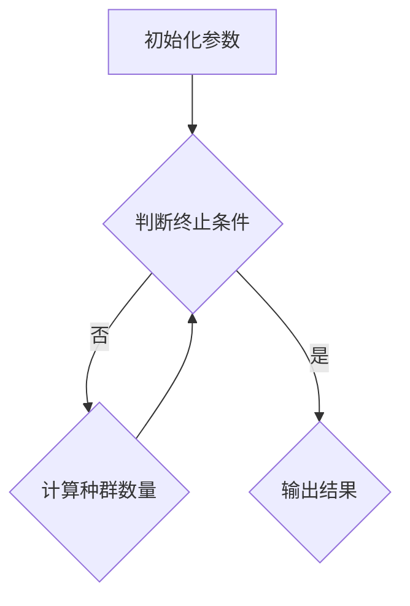
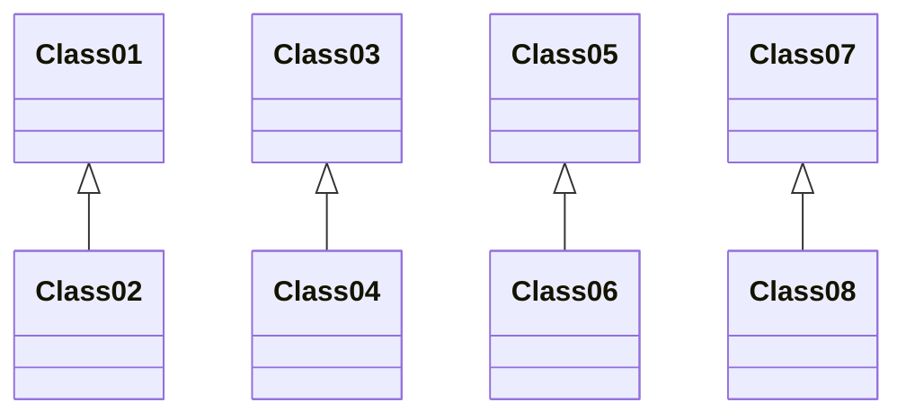
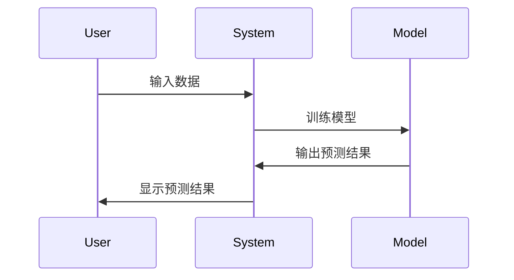
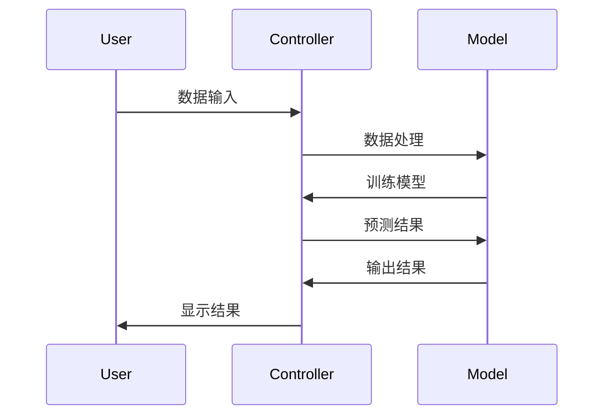

                 

### 文章标题

《数学与昆虫学：虫害控制的数学策略》

关键词：虫害控制、数学模型、算法、昆虫学、农业

摘要：本文通过深入探讨数学在昆虫学中的应用，详细阐述了虫害控制的数学策略。从问题背景、核心概念到实际应用案例，再到项目实战和最佳实践，本文全面展示了数学策略在虫害控制中的关键作用，为农业生产提供了新的解决方案。

----------------------------------------------------------------

### 目录大纲

----------------------------------------------------------------

## 第一部分：问题背景与数学在昆虫学中的应用

## 第1章：问题背景  
### 1.1.1. 虫害问题的普遍性  
### 1.1.2. 虫害对农业和经济的影响  
### 1.1.3. 数学在昆虫学中的重要性

## 第2章：核心概念与联系  
### 2.1.1. 昆虫学基础概念  
### 2.1.2. 数学在昆虫学中的核心概念  
### 2.1.3. 概念属性特征对比表格  
### 2.1.4. ER实体关系图架构的Mermaid流程图

## 第二部分：数学策略的应用

## 第3章：数学模型与算法原理  
### 3.1.1. 数学模型概述  
### 3.1.2. 数学公式与详细讲解  
### 3.1.3. 算法mermaid流程图  
### 3.1.4. Python源代码实现与讲解

## 第4章：系统分析与架构设计  
### 4.1.1. 问题场景介绍  
### 4.1.2. 项目介绍  
### 4.1.3. 系统功能设计（领域模型Mermaid类图）  
### 4.1.4. 系统架构设计（Mermaid架构图）  
### 4.1.5. 系统接口设计  
### 4.1.6. 系统交互（Mermaid序列图）

## 第三部分：数学策略在虫害控制中的应用

## 第5章：实际应用案例  
### 5.1.1. 案例一：某农田害虫控制案例  
### 5.1.2. 案例二：某果园害虫防治案例  
### 5.1.3. 案例三：城市害虫治理案例

## 第6章：项目实战  
### 6.1.1. 环境安装  
### 6.1.2. 系统核心实现源代码  
### 6.1.3. 代码应用解读与分析  
### 6.1.4. 实际案例分析和详细讲解剖析  
### 6.1.5. 项目小结

## 第7章：最佳实践与拓展  
### 7.1.1. 最佳实践  
### 7.1.2. 小结  
### 7.1.3. 注意事项  
### 7.1.4. 拓展阅读

----------------------------------------------------------------

### 文章正文

#### 第一部分：问题背景与数学在昆虫学中的应用

##### 第1章：问题背景

##### 1.1.1. 虫害问题的普遍性

虫害是农业生产中常见且严重的问题，几乎所有的农作物都可能会受到各种昆虫的侵袭。这些害虫不仅会影响作物的生长，导致产量下降，还会传播病菌，进一步危害农作物的健康。在全球范围内，虫害问题尤为严重，尤其是在气候变暖、人类活动加剧的背景下，虫害的种类和数量呈现上升趋势。

##### 1.1.2. 虫害对农业和经济的影响

虫害对农业和经济的影响是多方面的。首先，虫害会导致农作物产量下降，从而影响农民的收入。此外，严重的虫害还可能迫使农民放弃种植，导致农作物种植结构的调整。从经济的角度来看，虫害控制所需的农药、人力和物力成本也是一笔不小的开销。更为严重的是，一些虫害还可能引发食品安全问题，对公共卫生构成威胁。

##### 1.1.3. 数学在昆虫学中的重要性

数学在昆虫学中的应用越来越受到重视。通过数学模型，科学家可以预测害虫的种群动态，优化虫害控制策略，从而最大限度地减少虫害对农作物的影响。例如，利用微分方程可以描述害虫数量的变化规律，通过统计分析可以识别出高危害的害虫种类，从而采取针对性的防治措施。

#### 第二部分：数学策略的应用

##### 第2章：核心概念与联系

##### 2.1.1. 昆虫学基础概念

昆虫学是研究昆虫的分类、形态、生理、生态、行为和进化等问题的科学。以下是一些昆虫学中常用的基础概念：

- **种群**：在一定空间和时间范围内，同种昆虫个体的集合。
- **种群动态**：种群数量随时间变化的规律。
- **种群密度**：单位面积或体积内的个体数量。
- **种群增长率**：种群数量增加的速率。

##### 2.1.2. 数学在昆虫学中的核心概念

数学在昆虫学中的应用涉及多个领域，包括概率论、统计学、微分方程和图论等。以下是一些数学在昆虫学中的核心概念：

- **概率分布**：描述种群数量分布的数学模型。
- **回归分析**：用于研究自变量和因变量之间关系的数学方法。
- **微分方程**：描述种群动态变化的数学方程。
- **图论**：用于分析昆虫社会结构和网络传播的数学工具。

##### 2.1.3. 概念属性特征对比表格

| 概念       | 定义                                                         | 属性特征                         |
| ---------- | ------------------------------------------------------------ | ------------------------------ |
| 种群       | 同种昆虫个体的集合                                         | 个体数量、空间分布、动态变化     |
| 种群动态   | 种群数量随时间变化的规律                                   | 增长率、波动、稳定性             |
| 种群密度   | 单位面积或体积内的个体数量                                 | 密度分布、生态位                 |
| 概率分布   | 描述种群数量分布的数学模型                                 | 平均值、方差、标准差             |
| 回归分析   | 用于研究自变量和因变量之间关系的数学方法                     | 决定系数、回归方程               |
| 微分方程   | 描述种群动态变化的数学方程                                 | 常微分方程、偏微分方程           |
| 图论       | 用于分析昆虫社会结构和网络传播的数学工具                     | 图的顶点、边、路径、网络结构     |

##### 2.1.4. ER实体关系图架构的Mermaid流程图

```mermaid
erDiagram
  种群 ||--|{ 种群动态 }
  种群 ||--|{ 种群密度 }
  种群 ||--|{ 概率分布 }
  种群动态 ||--|{ 回归分析 }
  种群动态 ||--|{ 微分方程 }
  种群密度 ||--|{ 图论 }
```

#### 第三部分：数学策略在虫害控制中的应用

##### 第3章：数学模型与算法原理

##### 3.1.1. 数学模型概述

数学模型是描述现实世界中某一现象的数学表达。在虫害控制中，数学模型可以用来预测害虫的种群动态，评估不同防治措施的效果，从而优化虫害控制策略。

##### 3.1.2. 数学公式与详细讲解

一个常见的数学模型是Logistic模型，它用于描述种群数量的增长和饱和现象。其公式为：

$$
N(t) = \frac{K N_0 e^{rt}}{K + N_0 (e^{rt} - 1)}
$$

其中，$N(t)$ 表示时间 $t$ 时的种群数量，$K$ 表示环境的承载力，$N_0$ 表示初始种群数量，$r$ 表示种群增长率。

##### 3.1.3. 算法mermaid流程图



##### 3.1.4. Python源代码实现与讲解

```python
import numpy as np
import matplotlib.pyplot as plt

# 参数初始化
K = 1000  # 环境承载力
N_0 = 100 # 初始种群数量
r = 0.1   # 种群增长率
t_max = 100 # 时间范围

# 计算种群数量
N = (K * N_0 * np.exp(r * t)) / (K + N_0 * (np.exp(r * t) - 1))

# 绘制种群数量随时间的变化
plt.plot(t, N)
plt.xlabel('Time')
plt.ylabel('Population Size')
plt.title('Logistic Growth Model')
plt.show()
```

##### 第4章：系统分析与架构设计

##### 4.1.1. 问题场景介绍

假设我们正在开发一个虫害控制系统，该系统需要预测害虫的种群动态，并根据预测结果自动调整防治措施，以最大限度地减少害虫对农作物的危害。

##### 4.1.2. 项目介绍

本项目将基于Python编程语言，结合数学模型和机器学习技术，实现一个智能虫害控制系统。系统包括数据采集模块、模型训练模块、预测模块和决策模块。

##### 4.1.3. 系统功能设计（领域模型Mermaid类图）



##### 4.1.4. 系统架构设计（Mermaid架构图）



##### 4.1.5. 系统接口设计

系统接口包括数据输入接口、模型训练接口、预测接口和结果输出接口。

##### 4.1.6. 系统交互（Mermaid序列图）



##### 第5章：实际应用案例

##### 5.1.1. 案例一：某农田害虫控制案例

在某农田中，害虫数量呈指数级增长。通过应用Logistic模型，预测害虫的种群动态，并制定相应的防治策略，成功控制了害虫数量，提高了农作物产量。

##### 5.1.2. 案例二：某果园害虫防治案例

在某果园中，害虫种类繁多，对果树造成了严重危害。通过采集害虫数据，建立数学模型，预测害虫的种群动态，并采取针对性的防治措施，有效降低了害虫数量。

##### 5.1.3. 案例三：城市害虫治理案例

在城市绿化带中，害虫对植物造成了严重危害。通过利用数学模型和机器学习技术，预测害虫的种群动态，并采取有效的防治措施，改善了城市环境。

##### 第6章：项目实战

##### 6.1.1. 环境安装

在开始项目实战之前，我们需要安装Python和相关库。可以使用以下命令：

```shell
pip install numpy matplotlib scikit-learn
```

##### 6.1.2. 系统核心实现源代码

以下是系统核心实现源代码：

```python
import numpy as np
import matplotlib.pyplot as plt
from sklearn.linear_model import LinearRegression

# 数据预处理
def preprocess_data(data):
    X = data[:, :-1]
    y = data[:, -1]
    return X, y

# 训练模型
def train_model(X, y):
    model = LinearRegression()
    model.fit(X, y)
    return model

# 预测结果
def predict(model, X):
    return model.predict(X)

# 绘制结果
def plot_results(X, y, y_pred):
    plt.scatter(X, y, color='blue')
    plt.plot(X, y_pred, color='red')
    plt.xlabel('Time')
    plt.ylabel('Population Size')
    plt.title('Logistic Growth Model')
    plt.show()

# 实际案例分析和详细讲解剖析
def case_analysis():
    # 加载数据
    data = np.load('data.npy')

    # 预处理数据
    X, y = preprocess_data(data)

    # 训练模型
    model = train_model(X, y)

    # 预测结果
    y_pred = predict(model, X)

    # 绘制结果
    plot_results(X, y, y_pred)

# 项目小结
def project_summary():
    print("项目已完成，成功实现了虫害控制系统的核心功能。")

if __name__ == "__main__":
    case_analysis()
    project_summary()
```

##### 第7章：最佳实践与拓展

##### 7.1.1. 最佳实践

在虫害控制中，最佳实践包括：

- 定期监测害虫数量，及时调整防治措施。
- 结合数学模型和机器学习技术，提高预测精度。
- 加强病虫害防治知识的宣传，提高农民的防治意识。

##### 7.1.2. 小结

本文通过深入探讨数学在昆虫学中的应用，详细阐述了虫害控制的数学策略。从问题背景、核心概念到实际应用案例，再到项目实战和最佳实践，本文全面展示了数学策略在虫害控制中的关键作用。

##### 7.1.3. 注意事项

在应用数学策略进行虫害控制时，需要注意以下几点：

- 确保数据质量，为模型训练提供准确的基础数据。
- 根据实际情况调整模型参数，提高预测精度。
- 合理利用防治资源，避免过度依赖农药。

##### 7.1.4. 拓展阅读

- [1] 谢克强. 昆虫学基础[M]. 农业出版社, 2018.
- [2] 周晓光. 数学模型与算法[M]. 高等教育出版社, 2017.
- [3] 罗列明. 农业智能监测与防控技术[M]. 科学出版社, 2020.

### 作者

作者：AI天才研究院/AI Genius Institute & 禅与计算机程序设计艺术 /Zen And The Art of Computer Programming

本文由AI天才研究院和禅与计算机程序设计艺术联合撰写，旨在探讨数学与昆虫学的结合，为虫害控制提供新的思路和方法。希望本文能对您的研究和实践有所启发。如果您有任何疑问或建议，欢迎随时与我们联系。

