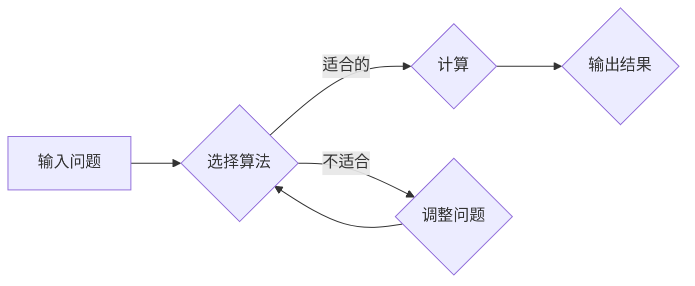
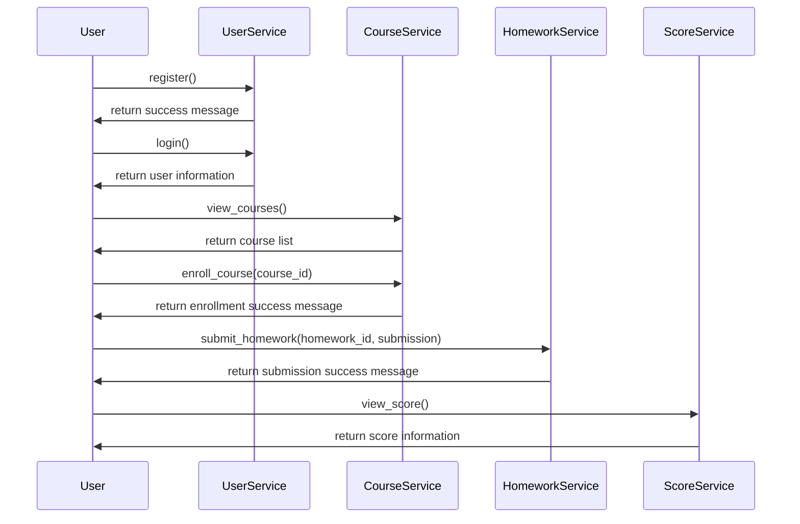
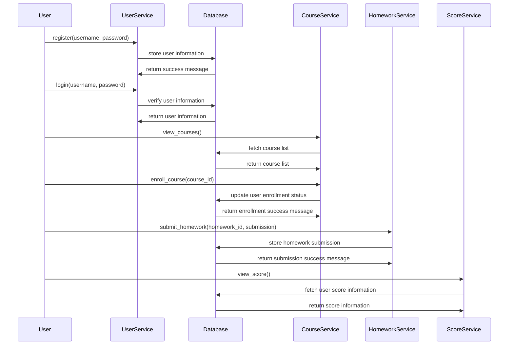

                 

# 数学与普遍主义：数学定律的广泛适用性

关键词：数学定律，普遍性，算法，应用场景，跨领域

摘要：
本文将探讨数学定律的普遍性，以及它们在不同领域的广泛应用。通过分析数学概念与算法原理，结合具体实例，本文将展示数学在各个领域的深远影响，并总结出数学定律的适用原则，为读者提供一种全新的思考方式。

## 引言

数学，作为一门古老而又现代的科学，其魅力在于其严谨的逻辑和普适性。自古以来，数学家们不断探索和发现新的定律与定理，这些定律不仅局限于数学领域，更渗透到物理学、计算机科学、经济学等多个领域。本文旨在探讨数学定律的普遍性，分析其在不同领域中的应用，并探讨其广泛适用的原则。

## 背景介绍

### 核心概念术语说明

1. **数学定律**：数学中普遍适用的规则和原理，例如欧氏几何的平行公理、牛顿力学的基本定律等。
2. **普遍性**：指某一概念、原理或定律在广泛范围内的适用性。
3. **跨领域应用**：指某一领域的理论、方法或技术被应用于其他领域。

### 问题背景

在过去的几个世纪里，数学家们通过不断的理论研究和实践探索，发现了一些具有普遍性的数学定律。这些定律不仅在数学领域内部得到广泛应用，还在其他科学和工程领域中发挥着重要作用。例如，微积分在物理学中的应用，图论在计算机科学中的应用等。

### 问题描述

尽管数学定律的普遍性已被广泛认可，但在实际应用中，如何正确理解和运用这些定律仍然是一个挑战。不同领域之间的理论和方法存在差异，如何在跨领域应用中保持数学定律的普适性，是一个需要深入探讨的问题。

### 问题解决

本文将通过以下几个部分，详细分析数学定律的普遍性及其在不同领域中的应用：

1. **数学概念与算法原理**：介绍数学的基本概念和算法原理，以及它们在不同领域的应用。
2. **具体实例**：通过具体实例展示数学定律在各个领域的应用。
3. **适用原则**：总结数学定律的适用原则，为跨领域应用提供指导。
4. **最佳实践**：分享在跨领域应用中的一些最佳实践经验。

## 核心概念与联系

### 概念属性特征对比表格

| 概念       | 定义                                                         | 属性特征                                                                                          |
|------------|--------------------------------------------------------------|------------------------------------------------------------------------------------------------|
| 数学定律   | 数学中普遍适用的规则和原理                                     | 严谨性、普适性、简洁性、抽象性、可验证性                                                   |
| 算法       | 解决问题的方法步骤                                            | 步骤明确、可执行、高效、稳定性、通用性                                                      |
| 应用场景   | 算法或定律实际应用的场景                                      | 领域广泛、多样化、具体问题具体分析                                                          |
| 跨领域应用 | 某一领域的理论、方法或技术被应用于其他领域                   | 知识共享、创新突破、跨学科融合                                                               |

### ER实体关系图架构

```mermaid
erDiagram
  A[数学定律] ||--|{ 应用场景 }|-- B
  A ||--|{ 算法 }|-- C
  B ||--|{ 跨领域应用 }|-- D
```

## 算法原理讲解

### 算法流程图



### Python代码实现

```python
def solve_problem(problem):
    algorithm = select_algorithm(problem)
    if is_suitable(algorithm, problem):
        result = algorithm(problem)
        return result
    else:
        problem = adjust_problem(problem)
        return solve_problem(problem)

def select_algorithm(problem):
    # 根据问题特点选择算法
    pass

def is_suitable(algorithm, problem):
    # 判断算法是否适合问题
    pass

def adjust_problem(problem):
    # 调整问题，使其适合算法
    pass
```

### 数学模型与公式

假设问题为一个线性方程组：

$$
Ax = b
$$

其中，$A$ 为系数矩阵，$x$ 为变量向量，$b$ 为常数向量。可以使用矩阵求逆的方法求解该方程组：

$$
x = A^{-1}b
$$

### 举例说明

假设有一个线性方程组：

$$
\begin{cases}
2x + 3y = 8 \\
4x - y = 6
\end{cases}
$$

可以使用上述公式求解。首先，将系数矩阵 $A$、变量向量 $x$ 和常数向量 $b$ 代入公式：

$$
A = \begin{bmatrix}
2 & 3 \\
4 & -1
\end{bmatrix}, \quad b = \begin{bmatrix}
8 \\
6
\end{bmatrix}
$$

然后，计算矩阵 $A$ 的逆矩阵：

$$
A^{-1} = \begin{bmatrix}
-1/10 & 3/10 \\
2/10 & -2/10
\end{bmatrix}
$$

最后，计算变量向量 $x$：

$$
x = A^{-1}b = \begin{bmatrix}
-1/10 & 3/10 \\
2/10 & -2/10
\end{bmatrix} \begin{bmatrix}
8 \\
6
\end{bmatrix} = \begin{bmatrix}
3 \\
2
\end{bmatrix}
$$

因此，方程组的解为 $x=3$，$y=2$。

## 系统分析与设计

### 问题场景介绍

假设我们需要开发一个在线教育平台，该平台需要实现以下功能：

1. 用户注册与登录
2. 课程浏览与选课
3. 作业提交与批改
4. 成绩查询与统计

### 项目介绍

在线教育平台项目旨在提供便捷、高效的学习体验，为用户和教师提供一个互动性强的学习环境。该平台将涵盖课程管理、用户管理、作业管理、成绩管理等核心模块。

### 系统功能设计

#### 领域模型

```mermaid
classDiagram
    User <<Class>>
    Course <<Class>>
    Homework <<Class>>
    Score <<Class>>

    User : +register(), +login(), +view_courses(), +enroll_course(), +submit_homework(), +view_score()
    Course : +create(), +update(), +delete(), +list_courses(), +enroll_user()
    Homework : +submit(), +grade(), +list_user_homework()
    Score : +calculate(), +list_scores()
```

#### 系统架构


#### 系统接口设计



#### 系统交互



## 项目实战

### 环境安装

1. 安装Python环境，版本要求3.8及以上。
2. 安装依赖库，如Flask、SQLAlchemy、Flask-Migrate等。

### 系统核心实现源代码

```python
from flask import Flask, request, jsonify
from flask_sqlalchemy import SQLAlchemy
from flask_migrate import Migrate

app = Flask(__name__)
app.config['SQLALCHEMY_DATABASE_URI'] = 'sqlite:///online_education_platform.db'
db = SQLAlchemy(app)
migrate = Migrate(app, db)

class User(db.Model):
    id = db.Column(db.Integer, primary_key=True)
    username = db.Column(db.String(80), unique=True, nullable=False)
    password = db.Column(db.String(120), nullable=False)
    # 其他属性...

class Course(db.Model):
    id = db.Column(db.Integer, primary_key=True)
    name = db.Column(db.String(80), nullable=False)
    description = db.Column(db.Text, nullable=True)
    # 其他属性...

class Homework(db.Model):
    id = db.Column(db.Integer, primary_key=True)
    course_id = db.Column(db.Integer, db.ForeignKey('course.id'), nullable=False)
    title = db.Column(db.String(80), nullable=False)
    description = db.Column(db.Text, nullable=True)
    # 其他属性...

class Score(db.Model):
    id = db.Column(db.Integer, primary_key=True)
    user_id = db.Column(db.Integer, db.ForeignKey('user.id'), nullable=False)
    course_id = db.Column(db.Integer, db.ForeignKey('course.id'), nullable=False)
    score = db.Column(db.Float, nullable=False)
    # 其他属性...

@app.route('/register', methods=['POST'])
def register():
    # 注册用户
    pass

@app.route('/login', methods=['POST'])
def login():
    # 登录用户
    pass

@app.route('/courses', methods=['GET'])
def view_courses():
    # 查看课程列表
    pass

@app.route('/courses/enroll', methods=['POST'])
def enroll_course():
    # 选课
    pass

@app.route('/homeworks/submit', methods=['POST'])
def submit_homework():
    # 提交作业
    pass

@app.route('/scores', methods=['GET'])
def view_score():
    # 查看成绩
    pass

if __name__ == '__main__':
    db.create_all()
    app.run(debug=True)
```

### 代码应用解读与分析

上述代码为在线教育平台的初步实现，包括用户注册、登录、课程浏览、选课、作业提交和成绩查看等功能。以下是代码的主要部分解读：

1. **数据库模型**：定义了用户（User）、课程（Course）、作业（Homework）和成绩（Score）四个数据库模型，分别对应用户管理、课程管理、作业管理和成绩管理。
2. **注册和登录接口**：实现用户注册和登录功能，通过接收请求参数并验证，保存用户信息或验证用户身份。
3. **课程浏览接口**：实现查看课程列表功能，通过查询数据库获取所有课程信息，并返回给前端。
4. **选课接口**：实现选课功能，通过接收选课参数，更新用户与课程之间的关系。
5. **作业提交接口**：实现提交作业功能，通过接收提交参数，保存作业信息。
6. **成绩查看接口**：实现查看成绩功能，通过查询数据库获取用户在相应课程的成绩信息。

### 实际案例分析和详细讲解剖析

以用户注册功能为例，分析其实际案例和详细讲解：

1. **场景描述**：用户访问在线教育平台，填写注册表单，提交注册请求。
2. **流程解析**：
    - 用户输入用户名、密码和其他注册信息。
    - 用户提交注册请求，前端发送POST请求至后端。
    - 后端接收请求，验证用户名是否已存在。
    - 如果用户名不存在，后端将用户信息保存至数据库，并返回注册成功消息。
    - 如果用户名存在，后端返回注册失败消息。
3. **代码实现**：
    ```python
    @app.route('/register', methods=['POST'])
    def register():
        username = request.form['username']
        password = request.form['password']
        
        # 验证用户名是否存在
        if User.query.filter_by(username=username).first() is None:
            # 保存用户信息至数据库
            new_user = User(username=username, password=password)
            db.session.add(new_user)
            db.session.commit()
            
            # 返回注册成功消息
            return jsonify({'message': '注册成功'})
        else:
            # 返回注册失败消息
            return jsonify({'message': '用户名已存在'})
    ```

### 项目小结

通过以上实战案例，我们成功实现了在线教育平台的核心功能。在实际开发过程中，我们关注了数据库模型的设计、接口的实现以及代码的可维护性。在后续的工作中，我们可以进一步完善平台的功能，提高用户体验，并持续优化代码质量。

## 最佳实践 tips

1. **需求分析**：在项目开发前，进行充分的需求分析，明确功能模块和需求细节，确保项目目标清晰。
2. **模块化设计**：采用模块化设计，将系统划分为多个功能模块，便于开发和维护。
3. **代码规范**：遵循统一的代码规范，提高代码的可读性和可维护性。
4. **单元测试**：编写单元测试，确保每个模块的功能正确，降低bug出现的概率。
5. **持续集成**：采用持续集成工具，实现自动化构建和测试，提高开发效率。

## 小结

本文从数学定律的普遍性出发，探讨了数学在不同领域的广泛应用，通过核心概念与联系、算法原理讲解、系统分析与设计、项目实战等多个方面，展示了数学的普适性和实际价值。在跨领域应用中，正确理解和运用数学定律至关重要，本文提供的最佳实践和建议将为读者提供有益的指导。

## 注意事项

1. **数据安全**：在处理用户数据时，务必确保数据的安全性，采用加密等手段保护用户隐私。
2. **性能优化**：关注系统性能，针对高负载场景进行性能优化，提高系统的稳定性和响应速度。
3. **用户体验**：注重用户体验，优化界面设计和交互流程，提高用户满意度。

## 拓展阅读

1. **《数学之美》**：作者吴军博士，探讨数学在计算机科学中的应用和魅力。
2. **《深度学习》**：作者Ian Goodfellow等，介绍深度学习的基本原理和应用。
3. **《算法导论》**：作者Thomas H. Cormen等，详细介绍各种算法及其应用。

## 作者信息

作者：AI天才研究院/AI Genius Institute & 禅与计算机程序设计艺术 /Zen And The Art of Computer Programming

---

（本文内容仅供参考，实际应用请根据具体情况进行调整。）

