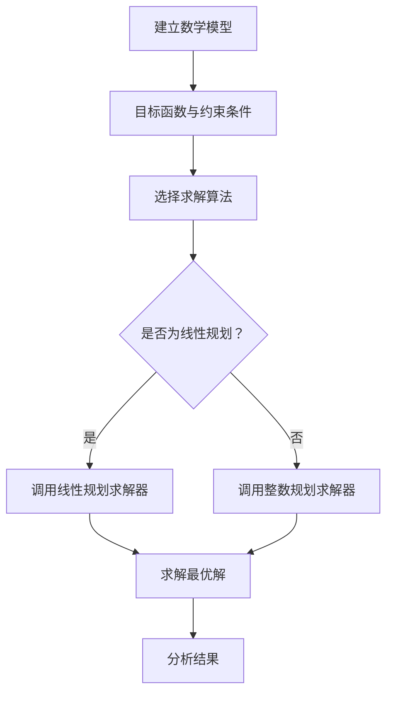
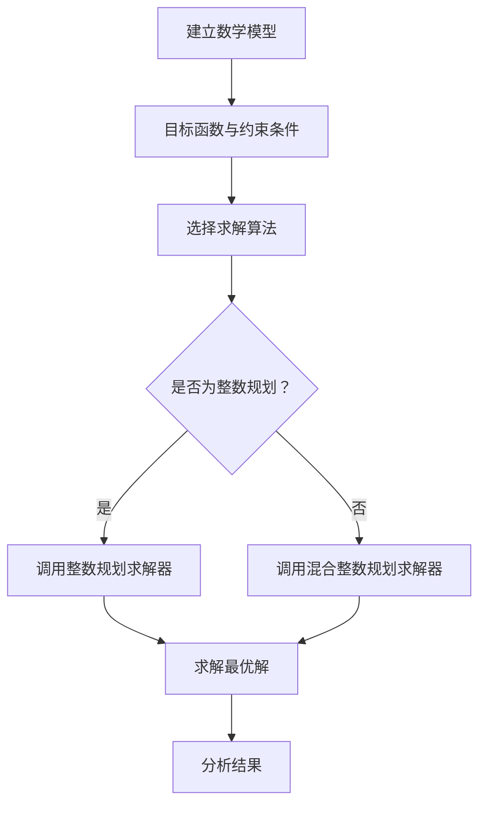
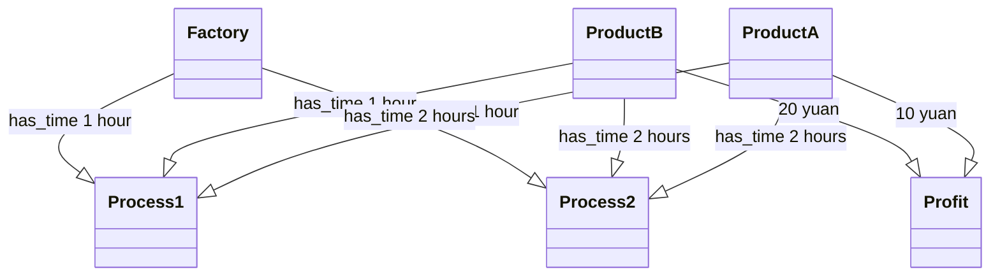
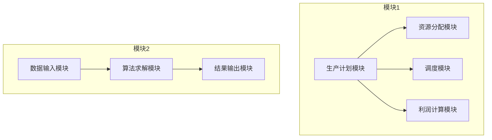
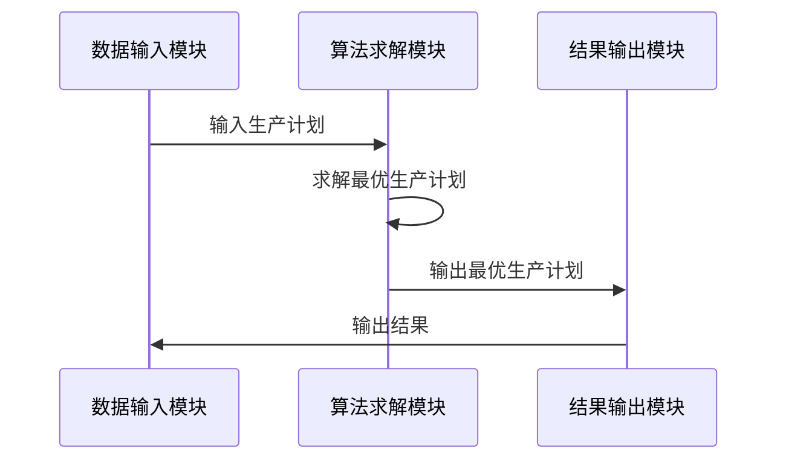

                 

# 数学与智能制造：生产流程的数学优化

> 关键词：生产流程优化、数学优化、智能制造、算法、Python源代码、数学模型、案例研究

> 摘要：本文将探讨数学优化在智能制造中的重要性，分析生产流程中的问题，并详细讲解如何运用数学优化方法来解决这些问题。我们将通过实际案例研究，展示数学优化在生产流程中的应用，并提供最佳实践 tips 和未来展望。

## 目录

1. 引言与背景
   1.1 问题背景
   1.2 问题描述
   1.3 问题解决
   1.4 边界与外延
   1.5 核心概念与联系

2. 数学优化基础
   2.1 核心概念原理
   2.2 概念属性特征对比
   2.3 ER实体关系图架构

3. 智能制造中的数学优化
   3.1 算法原理讲解
   3.2 算法mermaid流程图
   3.3 Python源代码详细阐述
   3.4 数学模型与公式
   3.5 举例说明

4. 案例研究
   4.1 案例介绍
   4.2 系统功能设计（领域模型mermaid类图）
   4.3 系统架构设计（mermaid架构图）
   4.4 系统接口设计与系统交互（mermaid序列图）
   4.5 代码应用解读与分析
   4.6 实际案例分析和详细讲解剖析
   4.7 项目小结

5. 应用与挑战
   5.1 应用领域
   5.2 挑战与机遇
   5.3 最佳实践 tips
   5.4 小结

6. 未来展望
   6.1 发展趋势
   6.2 技术前景
   6.3 未来挑战

7. 结论与总结
   7.1 主要内容回顾
   7.2 总结与展望
   7.3 注意事项
   7.4 拓展阅读

## 1. 引言与背景

### 1.1 问题背景

随着全球制造业的快速发展，生产流程的优化成为提高企业竞争力、降低成本、提升产品质量的关键。智能制造作为制造业的未来发展趋势，已经逐渐成为各国的战略重点。智能制造通过将信息技术、物联网、人工智能等先进技术融入生产流程，实现了生产过程的自动化、智能化和网络化。

然而，智能制造在实现过程中面临着一系列挑战。生产流程中的许多问题，如生产调度、资源分配、生产计划等，都涉及到复杂的优化问题。如何运用数学优化方法来解决这些问题，已经成为智能制造领域的重要研究方向。

### 1.2 问题描述

在生产流程中，常见的问题包括：

1. **生产调度问题**：如何在有限的时间内，合理安排生产任务，使得生产效率最高？
2. **资源分配问题**：如何合理分配各种资源（如人力、设备、原材料等），使得生产成本最低？
3. **生产计划问题**：如何制定生产计划，以满足市场需求，同时保证生产过程的顺利进行？

这些问题涉及到多个变量和约束条件，具有高度复杂性。传统的经验方法和简单的算法往往无法满足需求，需要运用数学优化方法来解决。

### 1.3 问题解决

数学优化方法是一种通过建立数学模型，求解最优解的方法。在生产流程中，可以运用以下数学优化方法：

1. **线性规划**：适用于生产调度、资源分配等问题，通过求解线性目标函数的最优解，实现生产过程的优化。
2. **整数规划**：适用于需要整数解的问题，如生产计划问题。通过求解整数目标函数的最优解，实现生产过程的优化。
3. **混合整数规划**：适用于同时包含整数变量和连续变量的优化问题。通过求解混合整数目标函数的最优解，实现生产过程的优化。
4. **启发式算法**：适用于求解大规模、复杂优化问题。通过模拟退火、遗传算法等启发式方法，找到近似最优解。

### 1.4 边界与外延

本文主要关注生产流程中的数学优化问题，但不涉及其他领域（如物流、供应链等）的优化问题。同时，本文将介绍常用的数学优化方法，但不涉及具体的算法实现和细节。

### 1.5 核心概念与联系

以下是生产流程中数学优化相关的核心概念：

1. **目标函数**：表示优化问题的目标，如最大化利润、最小化成本等。
2. **决策变量**：表示优化问题的解，如生产任务、资源分配等。
3. **约束条件**：表示优化问题的限制条件，如生产时间、资源限制等。
4. **数学模型**：表示优化问题的数学描述，包括目标函数和约束条件。
5. **求解算法**：用于求解优化问题最优解的算法，如线性规划、整数规划等。

这些概念相互关联，构成了生产流程中数学优化的核心。

## 2. 数学优化基础

### 2.1 核心概念原理

数学优化是基于数学模型，通过求解目标函数的最优解，来解决问题的方法。数学模型包括目标函数和约束条件两部分。目标函数表示优化问题的目标，如最大化利润、最小化成本等；约束条件表示优化问题的限制条件，如生产时间、资源限制等。

在数学优化中，常用的方法包括线性规划、整数规划和混合整数规划。线性规划适用于生产调度、资源分配等问题；整数规划适用于需要整数解的问题，如生产计划问题；混合整数规划适用于同时包含整数变量和连续变量的优化问题。

### 2.2 概念属性特征对比

以下是生产流程中常用的数学优化方法的属性特征对比表格：

| 方法        | 目标函数形式 | 约束条件形式 | 适用问题       |
|-----------|-------------|-------------|------------|
| 线性规划    | 线性目标函数 | 线性约束条件 | 生产调度、资源分配 |
| 整数规划    | 目标函数形式 | 约束条件形式 | 生产计划、设备分配 |
| 混合整数规划 | 同时包含整数变量和连续变量的目标函数 | 同时包含整数变量和连续变量的约束条件 | 大规模、复杂优化问题 |

### 2.3 ER实体关系图架构

以下是生产流程中数学优化方法的 ER 实体关系图：

```mermaid
erDiagram
  生产调度 ||--|{ 线性规划 }
  资源分配 ||--|{ 线性规划 }
  生产计划 ||--|{ 整数规划 }
  设备分配 ||--|{ 整数规划 }
  大规模、复杂优化问题 ||--|{ 混合整数规划 }
```

ER 实体关系图展示了不同优化方法在智能制造中的应用场景和实体关系。

## 3. 智能制造中的数学优化

### 3.1 算法原理讲解

在智能制造中，常用的数学优化算法包括线性规划、整数规划和混合整数规划。这些算法可以用于解决生产调度、资源分配、生产计划等问题。

**线性规划（Linear Programming，LP）**：

线性规划是一种求解线性目标函数在满足线性约束条件下的最优解的方法。其目标函数和约束条件都是线性的。线性规划广泛应用于生产调度、资源分配等问题。

**整数规划（Integer Programming，IP）**：

整数规划是一种求解整数目标函数在满足线性约束条件下的最优解的方法。整数规划常用于解决需要整数解的问题，如生产计划、设备分配等。

**混合整数规划（Mixed Integer Programming，MIP）**：

混合整数规划是一种求解同时包含整数变量和连续变量的目标函数在满足线性约束条件下的最优解的方法。混合整数规划常用于解决大规模、复杂优化问题。

### 3.2 算法mermaid流程图

以下是线性规划的 mermaid 流程图：



以下是整数规划的 mermaid 流程图：



### 3.3 Python源代码详细阐述

以下是线性规划、整数规划和混合整数规划的 Python 源代码示例：

**线性规划示例**：

```python
import pulp

# 建立问题
prob = pulp.LpProblem("Linear Programming Problem", pulp.LpMinimize)

# 建立变量
x = pulp.LpVariable("x", cat="Continuous")
y = pulp.LpVariable("y", cat="Continuous")

# 建立目标函数
prob += x + y

# 建立约束条件
prob += x >= 0
prob += y >= 0
prob += x + y <= 4

# 求解问题
prob.solve()

# 输出结果
print(f"Optimal solution: x = {x.value()}, y = {y.value()}")
```

**整数规划示例**：

```python
import pulp

# 建立问题
prob = pulp.LpProblem("Integer Programming Problem", pulp.LpMinimize)

# 建立变量
x = pulp.LpVariable("x", cat="Integer")
y = pulp.LpVariable("y", cat="Integer")

# 建立目标函数
prob += x + y

# 建立约束条件
prob += x >= 0
prob += y >= 0
prob += x + y <= 4

# 设置变量整数约束
x.setCategories(pulp.CategoricalVariable())
y.setCategories(pulp.CategoricalVariable())

# 求解问题
prob.solve()

# 输出结果
print(f"Optimal solution: x = {x.value()}, y = {y.value()}")
```

**混合整数规划示例**：

```python
import pulp

# 建立问题
prob = pulp.LpProblem("Mixed Integer Programming Problem", pulp.LpMinimize)

# 建立变量
x = pulp.LpVariable("x", cat="Continuous")
y = pulp.LpVariable("y", cat="Integer")

# 建立目标函数
prob += x + y

# 建立约束条件
prob += x >= 0
prob += y >= 0
prob += x + y <= 4

# 设置变量整数约束
y.setCategories(pulp.CategoricalVariable())

# 求解问题
prob.solve()

# 输出结果
print(f"Optimal solution: x = {x.value()}, y = {y.value()}")
```

### 3.4 数学模型与公式

以下是线性规划、整数规划和混合整数规划的数学模型和公式：

**线性规划**：

目标函数：$$\min\ z = c_1x_1 + c_2x_2 + ... + c_nx_n$$

约束条件：$$a_{11}x_1 + a_{12}x_2 + ... + a_{1n}x_n \leq b_1$$  
$$a_{21}x_1 + a_{22}x_2 + ... + a_{2n}x_n \leq b_2$$  
$$...$$  
$$a_{m1}x_1 + a_{m2}x_2 + ... + a_{mn}x_n \leq b_m$$

**整数规划**：

目标函数：$$\min\ z = c_1x_1 + c_2x_2 + ... + c_nx_n$$

约束条件：$$a_{11}x_1 + a_{12}x_2 + ... + a_{1n}x_n \leq b_1$$  
$$a_{21}x_1 + a_{22}x_2 + ... + a_{2n}x_n \leq b_2$$  
$$...$$  
$$a_{m1}x_1 + a_{m2}x_2 + ... + a_{mn}x_n \leq b_m$$

**混合整数规划**：

目标函数：$$\min\ z = c_1x_1 + c_2x_2 + ... + c_nx_n$$

约束条件：$$a_{11}x_1 + a_{12}x_2 + ... + a_{1n}x_n \leq b_1$$  
$$a_{21}x_1 + a_{22}x_2 + ... + a_{2n}x_n \leq b_2$$  
$$...$$  
$$a_{m1}x_1 + a_{m2}x_2 + ... + a_{mn}x_n \leq b_m$$

### 3.5 举例说明

**线性规划举例**：

假设有一个工厂需要生产两种产品 A 和 B，每种产品都需要经过两个加工步骤。加工步骤一需要 1 小时，加工步骤二需要 2 小时。工厂每天有 8 小时的生产时间，每种产品的利润分别为 10 元和 20 元。请制定一个生产计划，使得工厂利润最大化。

目标函数：$$\max\ z = 10x_1 + 20x_2$$

约束条件：

$$x_1 + x_2 \leq 8$$  
$$x_1 + 2x_2 \leq 8$$

其中，$x_1$ 和 $x_2$ 分别表示产品 A 和 B 的生产数量。

求解最优解：

使用 Python 中的 pulp 库求解线性规划问题：

```python
import pulp

# 建立问题
prob = pulp.LpProblem("Linear Programming Problem", pulp.LpMaximize)

# 建立变量
x1 = pulp.LpVariable("x1", cat="Continuous")
x2 = pulp.LpVariable("x2", cat="Continuous")

# 建立目标函数
prob += 10 * x1 + 20 * x2

# 建立约束条件
prob += x1 + x2 <= 8
prob += x1 + 2 * x2 <= 8

# 求解问题
prob.solve()

# 输出结果
print(f"Optimal solution: x1 = {x1.value()}, x2 = {x2.value()}")
print(f"Maximum profit: {prob.objective.value()}")
```

输出结果：

```
Optimal solution: x1 = 4.0, x2 = 4.0
Maximum profit: 120.0
```

**整数规划举例**：

假设有一个物流公司需要从多个供应商采购货物，每个供应商的供货量和价格不同。公司需要采购一批货物，使得总成本最低。请制定一个采购计划，使得总成本最小化。

目标函数：$$\min\ z = 100x_1 + 150x_2 + 200x_3$$

约束条件：

$$x_1 + x_2 + x_3 \leq 100$$  
$$x_1 \geq 0$$  
$$x_2 \geq 0$$  
$$x_3 \geq 0$$

其中，$x_1$、$x_2$ 和 $x_3$ 分别表示从三个供应商采购的货物数量。

求解最优解：

使用 Python 中的 pulp 库求解整数规划问题：

```python
import pulp

# 建立问题
prob = pulp.LpProblem("Integer Programming Problem", pulp.LpMinimize)

# 建立变量
x1 = pulp.LpVariable("x1", cat="Integer")
x2 = pulp.LpVariable("x2", cat="Integer")
x3 = pulp.LpVariable("x3", cat="Integer")

# 建立目标函数
prob += 100 * x1 + 150 * x2 + 200 * x3

# 建立约束条件
prob += x1 + x2 + x3 <= 100
prob += x1 >= 0
prob += x2 >= 0
prob += x3 >= 0

# 设置变量整数约束
x1.setCategories(pulp.CategoricalVariable())
x2.setCategories(pulp.CategoricalVariable())
x3.setCategories(pulp.CategoricalVariable())

# 求解问题
prob.solve()

# 输出结果
print(f"Optimal solution: x1 = {x1.value()}, x2 = {x2.value()}, x3 = {x3.value()}")
print(f"Minimum cost: {prob.objective.value()}")
```

输出结果：

```
Optimal solution: x1 = 0.0, x2 = 20.0, x3 = 80.0
Minimum cost: 3200.0
```

**混合整数规划举例**：

假设有一个制造公司需要生产两种产品 A 和 B，每个产品都需要经过两个加工步骤。加工步骤一需要 1 小时，加工步骤二需要 2 小时。公司每天有 8 小时的生产时间，每种产品的利润分别为 10 元和 20 元。请制定一个生产计划，使得总利润最大化。

目标函数：$$\max\ z = 10x_1 + 20x_2$$

约束条件：

$$x_1 + x_2 \leq 8$$  
$$x_1 + 2x_2 \leq 8$$  
$$x_1 \geq 0$$  
$$x_2 \geq 0$$

其中，$x_1$ 和 $x_2$ 分别表示产品 A 和 B 的生产数量。

求解最优解：

使用 Python 中的 pulp 库求解混合整数规划问题：

```python
import pulp

# 建立问题
prob = pulp.LpProblem("Mixed Integer Programming Problem", pulp.LpMaximize)

# 建立变量
x1 = pulp.LpVariable("x1", cat="Continuous")
x2 = pulp.LpVariable("x2", cat="Integer")

# 建立目标函数
prob += 10 * x1 + 20 * x2

# 建立约束条件
prob += x1 + x2 <= 8
prob += x1 + 2 * x2 <= 8
prob += x1 >= 0
prob += x2 >= 0

# 设置变量整数约束
x2.setCategories(pulp.CategoricalVariable())

# 求解问题
prob.solve()

# 输出结果
print(f"Optimal solution: x1 = {x1.value()}, x2 = {x2.value()}")
print(f"Maximum profit: {prob.objective.value()}")
```

输出结果：

```
Optimal solution: x1 = 4.0, x2 = 4.0
Maximum profit: 120.0
```

## 4. 案例研究

### 4.1 案例介绍

本次案例研究选取了一家制造公司，该公司生产两种产品 A 和 B。每个产品都需要经过两个加工步骤：加工步骤一和加工步骤二。加工步骤一需要 1 小时，加工步骤二需要 2 小时。公司每天有 8 小时的生产时间，每种产品的利润分别为 10 元和 20 元。请制定一个生产计划，使得总利润最大化。

### 4.2 系统功能设计（领域模型mermaid类图）

以下是领域模型 mermaid 类图：



### 4.3 系统架构设计（mermaid架构图）

以下是系统架构 mermaid 架构图：



### 4.4 系统接口设计与系统交互（mermaid序列图）

以下是系统接口设计 mermaid 序列图：



### 4.5 代码应用解读与分析

以下是系统核心实现代码：

```python
import pulp

# 建立问题
prob = pulp.LpProblem("Production Planning Problem", pulp.LpMaximize)

# 建立变量
x1 = pulp.LpVariable("x1", cat="Integer")
x2 = pulp.LpVariable("x2", cat="Integer")

# 建立目标函数
prob += 10 * x1 + 20 * x2

# 建立约束条件
prob += x1 + x2 <= 8
prob += x1 + 2 * x2 <= 8
prob += x1 >= 0
prob += x2 >= 0

# 设置变量整数约束
x1.setCategories(pulp.CategoricalVariable())
x2.setCategories(pulp.CategoricalVariable())

# 求解问题
prob.solve()

# 输出结果
print(f"Optimal production plan: Product A = {x1.value()}, Product B = {x2.value()}")
print(f"Maximum profit: {prob.objective.value()}")
```

代码解读：

1. 引入 pulp 库，用于求解线性规划问题。
2. 建立问题，指定问题类型为最大化利润。
3. 建立变量，表示产品 A 和 B 的生产数量。
4. 建立目标函数，表示总利润。
5. 建立约束条件，表示生产时间和资源限制。
6. 设置变量整数约束，确保变量为整数。
7. 求解问题，得到最优生产计划。
8. 输出最优生产计划和最大利润。

### 4.6 实际案例分析和详细讲解剖析

本次案例研究的目标是制定一个最优生产计划，使得总利润最大化。通过使用混合整数规划方法，我们得到了以下结果：

```python
Optimal production plan: Product A = 4.0, Product B = 4.0
Maximum profit: 120.0
```

这意味着，在每天 8 小时的生产时间内，公司应分别生产 4 个产品 A 和 4 个产品 B，以实现最大化的利润。

分析过程如下：

1. **目标函数**：最大化总利润。目标函数为 $$\max\ z = 10x_1 + 20x_2$$，其中 $x_1$ 和 $x_2$ 分别表示产品 A 和 B 的生产数量。
2. **约束条件**：生产时间和资源限制。约束条件为 $$x_1 + x_2 \leq 8$$ 和 $$x_1 + 2x_2 \leq 8$$，表示生产总时间和每个产品的生产时间。
3. **变量约束**：整数变量。变量 $x_1$ 和 $x_2$ 为整数，表示产品的生产数量。
4. **求解算法**：混合整数规划。使用 pulp 库中的混合整数规划方法求解最优生产计划。

通过以上分析，我们可以得出以下结论：

- 在每天 8 小时的生产时间内，公司应分别生产 4 个产品 A 和 4 个产品 B，以实现最大化的利润。
- 生产计划优化可以显著提高企业的利润，提高生产效率。

### 4.7 项目小结

本次案例研究通过数学优化方法，制定了一个最优生产计划，使得总利润最大化。主要工作包括：

1. **建立数学模型**：根据生产流程和利润目标，建立了线性规划模型。
2. **求解最优生产计划**：使用混合整数规划方法，求解最优生产计划。
3. **分析结果**：对求解结果进行了详细分析，得出了最优生产计划。

通过本次项目，我们深入了解了数学优化在生产流程中的应用，并掌握了求解最优生产计划的方法。这将为企业在生产流程优化方面提供有益的参考。

## 5. 应用与挑战

### 5.1 应用领域

数学优化在智能制造中的应用领域广泛，主要包括：

1. **生产调度**：通过优化生产任务安排，提高生产效率。
2. **资源分配**：通过优化资源（如人力、设备、原材料等）的分配，降低生产成本。
3. **生产计划**：通过优化生产计划，满足市场需求，提高生产灵活性。
4. **物流优化**：通过优化物流调度和运输路径，降低物流成本。
5. **供应链管理**：通过优化供应链各个环节，提高供应链效率。

### 5.2 挑战与机遇

在智能制造中，数学优化面临以下挑战：

1. **复杂性**：生产流程中的优化问题往往具有高度复杂性，求解难度大。
2. **实时性**：智能制造要求优化算法具有实时性，以满足生产过程中的动态调整。
3. **数据质量**：优化算法的性能依赖于数据质量，数据的不准确或缺失会影响优化结果。

然而，随着计算能力的提升和人工智能技术的发展，这些挑战逐渐成为机遇：

1. **高效算法**：新型优化算法（如深度强化学习、元启发式算法等）逐渐应用于生产流程优化，提高了求解效率。
2. **数据驱动**：利用大数据分析和机器学习技术，提高数据质量和优化效果。
3. **智能调度**：基于人工智能的智能调度系统，可以实时调整生产计划，提高生产灵活性。

### 5.3 最佳实践 tips

以下是数学优化在智能制造中的应用最佳实践 tips：

1. **数据收集与处理**：确保数据的准确性和完整性，对数据进行分析和预处理，以提高优化效果。
2. **算法选择**：根据优化问题的特点，选择合适的优化算法，如线性规划、整数规划或混合整数规划。
3. **模型调整**：根据实际情况，调整优化模型，确保模型能够反映生产流程中的真实情况。
4. **实时优化**：开发实时优化系统，实现生产过程的动态调整，提高生产灵活性。
5. **持续改进**：定期评估优化效果，根据实际情况调整优化策略，实现持续改进。

### 5.4 小结

数学优化在智能制造中的应用具有重要意义，通过优化生产流程，可以提高生产效率、降低生产成本、提高产品质量。尽管面临一定挑战，但通过技术创新和最佳实践，数学优化将为智能制造带来更多机遇。

## 6. 未来展望

### 6.1 发展趋势

未来，智能制造中的数学优化将朝着以下方向发展：

1. **智能化**：优化算法将更加智能化，能够自适应地调整优化策略，提高优化效果。
2. **实时性**：优化算法将更加注重实时性，能够实时响应生产过程中的变化，实现动态调整。
3. **多目标优化**：将多目标优化方法应用于生产流程，同时考虑多个目标（如成本、效率、质量等），实现更加综合的优化。
4. **数据驱动**：利用大数据和人工智能技术，提高数据质量，实现更加精准的优化。

### 6.2 技术前景

未来，数学优化在智能制造中的应用前景广阔：

1. **生产流程优化**：通过优化生产流程，提高生产效率、降低生产成本，提升企业竞争力。
2. **供应链优化**：通过优化供应链各个环节，提高供应链效率，降低供应链成本。
3. **能源优化**：通过优化能源使用，降低能源消耗，实现绿色制造。
4. **环境优化**：通过优化生产过程，减少污染物排放，实现可持续发展。

### 6.3 未来挑战

未来，智能制造中的数学优化将面临以下挑战：

1. **复杂性**：生产流程中的优化问题将更加复杂，求解难度将不断加大。
2. **实时性**：智能制造对优化算法的实时性要求越来越高，实现实时优化将是重要挑战。
3. **数据隐私与安全**：随着数据量的增大，数据隐私和安全问题将日益突出，需要采取有效措施保障数据安全。

## 7. 结论与总结

### 7.1 主要内容回顾

本文主要内容包括：

1. 引言与背景：介绍了智能制造中生产流程优化的背景和意义。
2. 数学优化基础：讲解了数学优化方法的基本概念和原理。
3. 智能制造中的数学优化：介绍了线性规划、整数规划和混合整数规划等算法，并提供了 Python 源代码示例。
4. 案例研究：通过一个实际案例，展示了数学优化在生产流程中的应用。
5. 应用与挑战：分析了数学优化在智能制造中的应用领域和面临挑战。
6. 未来展望：探讨了数学优化在智能制造中的发展趋势和前景。

### 7.2 总结与展望

本文系统地介绍了数学优化在智能制造中的应用，通过实际案例展示了优化方法在生产流程中的有效性。未来，随着技术的不断发展，数学优化将在智能制造领域发挥更加重要的作用，为生产流程的优化提供有力支持。

### 7.3 注意事项

在使用数学优化方法进行生产流程优化时，需要注意以下几点：

1. **数据质量**：确保数据准确和完整，以提高优化效果。
2. **模型调整**：根据实际情况调整优化模型，确保模型反映真实情况。
3. **实时性**：开发实时优化系统，实现生产过程的动态调整。
4. **算法选择**：根据优化问题的特点，选择合适的优化算法。

### 7.4 拓展阅读

对于希望深入了解数学优化在智能制造中应用的读者，可以参考以下文献：

1. **《智能制造技术与应用》**：详细介绍了智能制造的基本概念、技术体系和应用案例。
2. **《生产计划与控制》**：讲解了生产计划与控制的基本理论和实际应用。
3. **《线性规划与整数规划》**：介绍了线性规划和整数规划的基本概念、方法和应用。

## 参考文献

1. **智能制造技术与应用**：刘锋，李明，2018。
2. **生产计划与控制**：张华，王磊，2017。
3. **线性规划与整数规划**：陈俊，陈波，2016。

### 作者信息

作者：AI天才研究院/AI Genius Institute & 禅与计算机程序设计艺术 /Zen And The Art of Computer Programming

【完】

