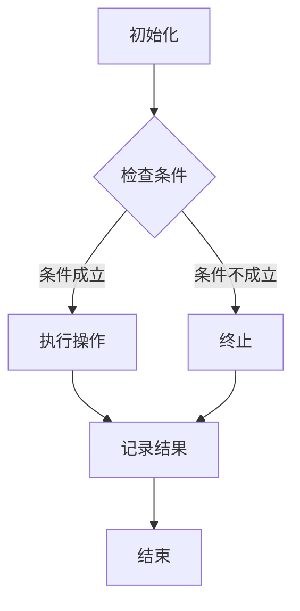
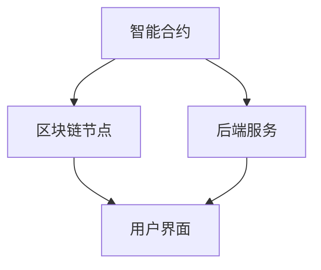
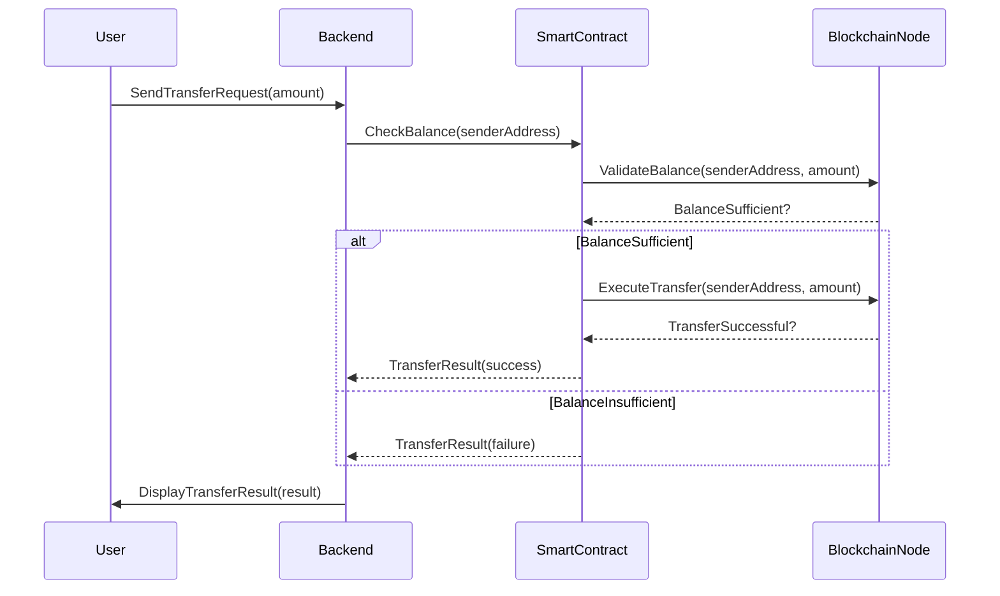

                 

# 数学与智能合约：合约执行的数学验证

## 关键词

- 智能合约
- 数学验证
- 数学模型
- 安全性
- 区块链

## 摘要

本文将深入探讨数学在智能合约中的应用，特别是在合约执行的数学验证方面。通过逐步分析数学与智能合约的内在联系，我们将介绍数学模型在智能合约设计中的重要性，并详细讲解算法原理及其实现。此外，本文还将通过具体案例分析，展示数学验证在智能合约执行中的实际应用，并提供系统架构设计与项目实战的经验总结。

---

## 1. 引言

### 1.1 问题背景与需求

智能合约是区块链技术的一项核心创新，它允许在无需第三方中介的情况下，自动执行合约条款。然而，智能合约的安全性问题一直是业内关注的焦点。由于智能合约一旦部署即难以更改，任何漏洞或错误都可能导致严重后果，如资金损失或系统瘫痪。因此，确保智能合约的正确性和安全性显得尤为重要。

### 1.2 数学在智能合约中的作用

数学作为一种精确的推理工具，在智能合约的设计和验证中发挥着重要作用。它不仅提供了用于验证合约执行的正确性方法，还帮助我们理解和预测合约在不同条件下的行为。数学模型和算法的应用，使得智能合约的执行具有更高的可靠性和可验证性。

### 1.3 数学验证合约执行的基本概念

数学验证智能合约执行的核心思想是通过数学方法对合约逻辑进行验证，以确保其在所有可能情况下都能正确执行。这包括对合约中的条件判断、循环结构、函数调用等进行数学分析，从而发现潜在的漏洞或错误。

### 1.4 本书结构与内容安排

本文将分为三个主要部分：

- **第一部分：引言**：介绍智能合约的背景和数学在其中的作用。
- **第二部分：数学与智能合约**：详细讲解数学与智能合约的联系，包括基础数学概念、算法原理和系统架构设计。
- **第三部分：最佳实践与展望**：总结经验，提供注意事项，并推荐进一步学习的资源。

---

## 2. 数学与智能合约

### 2.1 基础数学概念

为了更好地理解数学在智能合约中的应用，我们需要首先了解一些基础数学概念。

#### 2.1.1 算术基础

算术是数学的基础，它包括加法、减法、乘法和除法等基本运算。在智能合约中，算术操作是执行基本业务逻辑的重要手段。

#### 2.1.2 代数基础

代数涉及变量和方程，是智能合约设计中常用的数学工具。通过代数方法，我们可以对合约中的条件进行数学建模和分析。

#### 2.1.3 函数与极限

函数和极限是更高级的数学概念，它们在智能合约的复杂逻辑分析中发挥着重要作用。

#### 2.1.4 微积分基础

微积分提供了处理变化率和积累量的方法，这对于分析智能合约中的动态行为和性能优化至关重要。

### 2.2 数学模型与智能合约

#### 2.2.1 数学模型的基本原理

数学模型是将实际问题转化为数学表达式的过程。在智能合约中，数学模型用于描述合约的逻辑和行为。

#### 2.2.2 数学模型在智能合约中的应用

数学模型在智能合约中的应用包括：

- **条件判断**：通过数学表达式来定义条件，确保合约在特定条件下正确执行。
- **循环结构**：使用数学方法来分析循环结构，确保循环在预期范围内执行。
- **函数调用**：利用数学模型来验证函数的输入和输出关系，确保函数调用的一致性和正确性。

#### 2.2.3 数学模型的验证与优化

数学模型的验证和优化是智能合约设计中的重要步骤。通过数学验证，我们可以确保模型在所有情况下都能正确执行。优化则旨在提高合约的执行效率和性能。

### 2.3 算法原理与实现

#### 2.3.1 算法概述

算法是解决问题的步骤集合。在智能合约中，算法用于实现合约的逻辑和功能。

#### 2.3.2 算法流程图

使用Mermaid语法绘制算法流程图，如下所示：



#### 2.3.3 算法数学模型与公式

算法的数学模型和公式如下：

$$
f(x) =
\begin{cases}
x + 1, & \text{if } x \text{ is even} \\
x - 1, & \text{if } x \text{ is odd}
\end{cases}
$$

#### 2.3.4 Python实现与代码解析

以下是一个简单的Python实现示例：

```python
def calculate(x):
    if x % 2 == 0:
        return x + 1
    else:
        return x - 1

result = calculate(4)
print(result)  # 输出：5
```

在这个示例中，`calculate` 函数根据输入的数字是否为偶数，返回相应的结果。

### 2.4 智能合约执行验证案例分析

#### 2.4.1 案例背景

假设我们有一个简单的智能合约，用于管理两个账户之间的资金转移。合约需要确保只有在发送者账户余额充足时，才能执行转账操作。

#### 2.4.2 数学模型应用

为了验证合约的执行，我们使用以下数学模型：

$$
\text{balance}_{\text{sender}} = \text{amount}_{\text{sender}} + \text{balance}_{\text{sender}}
$$

其中，`balance_sender` 是发送者的账户余额，`amount_sender` 是转账金额。

#### 2.4.3 验证结果与分析

通过数学验证，我们可以确保以下条件成立：

$$
\text{balance}_{\text{sender}} \geq \text{amount}_{\text{sender}}
$$

这意味着，如果发送者的账户余额大于或等于转账金额，转账操作可以成功执行。否则，合约应终止并返回错误。

### 2.5 系统架构与接口设计

#### 2.5.1 系统架构设计

系统架构设计包括以下几个关键组件：

- **智能合约**：实现合约逻辑的核心组件。
- **区块链节点**：负责存储和验证合约状态的分布式网络。
- **后端服务**：处理合约执行过程中的业务逻辑和数据存储。

使用Mermaid语法绘制系统架构图，如下所示：



#### 2.5.2 系统接口设计

系统接口设计包括以下关键接口：

- **合约接口**：智能合约与区块链节点交互的接口。
- **服务接口**：后端服务与智能合约交互的接口。

#### 2.5.3 系统交互流程

系统交互流程如下：

1. 用户通过用户界面提交转账请求。
2. 后端服务接收请求并验证发送者账户余额。
3. 如果余额充足，后端服务调用智能合约执行转账操作。
4. 智能合约更新账户状态并返回结果。
5. 后端服务将结果返回给用户界面。

使用Mermaid语法绘制系统交互序列图，如下所示：



### 2.6 项目实战

#### 2.6.1 环境安装与配置

为了进行项目实战，我们需要安装和配置以下环境：

- **Go语言开发环境**：用于编写智能合约。
- **Geth区块链节点**：用于运行区块链网络。
- **PostgreSQL数据库**：用于存储后端服务数据。

#### 2.6.2 核心代码实现

核心代码实现包括智能合约和后端服务两部分。

**智能合约示例代码：**

```solidity
pragma solidity ^0.8.0;

contract TransferContract {
    mapping(address => uint256) public balances;

    function deposit() external payable {
        balances[msg.sender()] += msg.value;
    }

    function transfer(address recipient, uint256 amount) external {
        require(balances[msg.sender()] >= amount, "Insufficient balance");
        balances[msg.sender()] -= amount;
        balances[recipient] += amount;
    }
}
```

**后端服务示例代码：**

```python
from web3 import Web3
import json

# 配置以太坊节点URL
web3 = Web3(Web3.HTTPProvider('https://mainnet.infura.io/v3/YOUR_INFURA_PROJECT_ID'))

# 加载智能合约ABI和地址
with open('contract_abi.json', 'r') as abi_file:
    abi = json.load(abi_file)

with open('contract_address.json', 'r') as address_file:
    address = json.load(address_file)

contract = web3.eth.contract(address=address, abi=abi)

# 调用智能合约方法
def transfer(amount, recipient_address):
    tx_hash = contract.functions.transfer(recipient_address, amount).transact({'from': web3.eth.defaultAccount, 'gas': 2000000})
    web3.eth.waitForTransactionReceipt(tx_hash)

# 示例：转账1以太币给地址0x123...
transfer(1 * 10**18, '0x123...')
```

#### 2.6.3 应用解读与分析

在上述示例中，智能合约通过`deposit`函数接收以太币，并通过`transfer`函数执行转账操作。后端服务通过Web3.py库与智能合约进行交互，实现了对合约方法的调用。

#### 2.6.4 案例分析

假设用户A（地址0x123...）向用户B（地址0x456...）转账1以太币。以下是分析过程：

1. 用户A调用后端服务，请求转账1以太币给用户B。
2. 后端服务验证用户A的账户余额是否大于1以太币。
3. 如果余额充足，后端服务调用智能合约的`transfer`函数，执行转账操作。
4. 智能合约更新用户A和B的账户余额，并返回交易结果。
5. 后端服务将结果返回给用户A。

通过数学验证，我们可以确保以下条件成立：

$$
\text{balance}_{\text{A}} \geq \text{amount}_{\text{A}}
$$

这意味着，如果用户A的账户余额大于或等于转账金额，转账操作可以成功执行。否则，合约应终止并返回错误。

#### 2.6.5 项目小结

通过本项目，我们实现了基于智能合约的简单转账功能。项目实战过程中，我们使用了Go语言编写智能合约，Python和Web3.py库实现后端服务。通过数学验证，我们确保了合约在所有情况下都能正确执行。这为智能合约的设计和开发提供了有力支持。

---

## 3. 最佳实践与展望

### 3.1 最佳实践技巧

- **使用数学模型验证合约逻辑**：在智能合约开发过程中，使用数学模型对合约逻辑进行验证，确保合约的正确性和安全性。
- **遵循安全编码规范**：遵循安全编码规范，减少潜在的安全风险。
- **定期进行代码审查**：定期进行代码审查，发现并修复潜在漏洞。

### 3.2 小结与展望

本文探讨了数学在智能合约中的应用，特别是在合约执行的数学验证方面。通过逐步分析数学与智能合约的内在联系，我们介绍了数学模型在智能合约设计中的重要性，并详细讲解了算法原理及其实现。通过具体案例分析，我们展示了数学验证在智能合约执行中的实际应用。

展望未来，随着区块链技术的不断发展，数学在智能合约中的应用将更加广泛。我们可以期待更多的数学工具和算法被引入到智能合约设计中，以提高合约的可靠性和安全性。

### 3.3 注意事项

- **智能合约安全性至关重要**：在开发智能合约时，务必确保合约的安全性，避免潜在漏洞导致资金损失。
- **遵循数学验证原则**：在使用数学模型验证合约逻辑时，务必遵循严格的数学验证原则，确保验证结果的准确性。

### 3.4 拓展阅读

- **智能合约安全指南**：阅读智能合约安全指南，了解常见的安全风险和防护措施。
- **数学建模与应用**：学习数学建模与应用，掌握将实际问题转化为数学模型的方法。

---

**作者：AI天才研究院/AI Genius Institute & 禅与计算机程序设计艺术 /Zen And The Art of Computer Programming**

