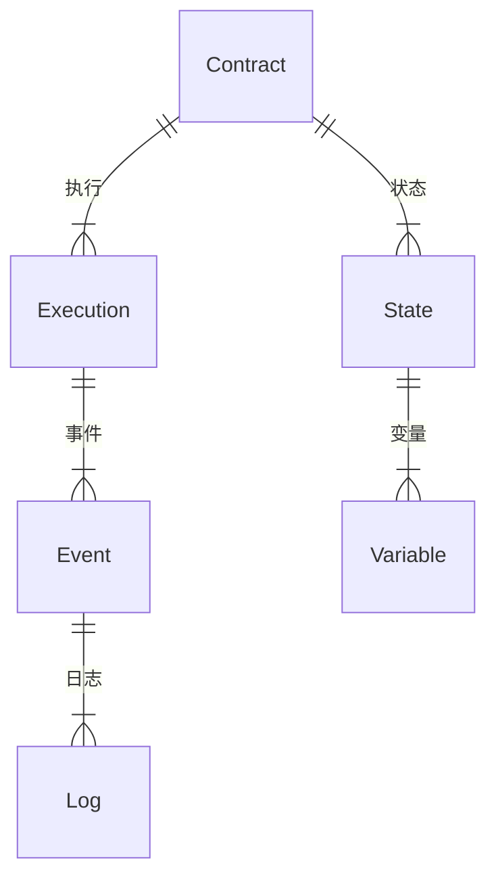
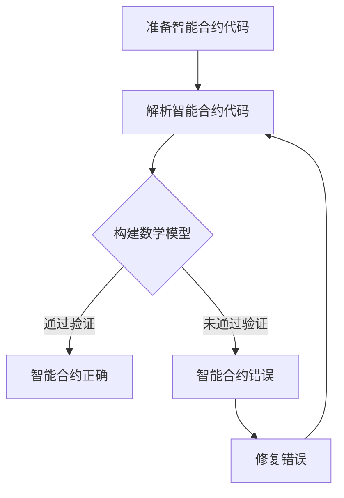
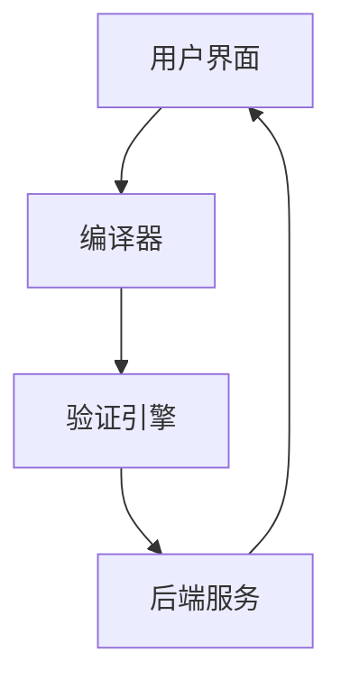
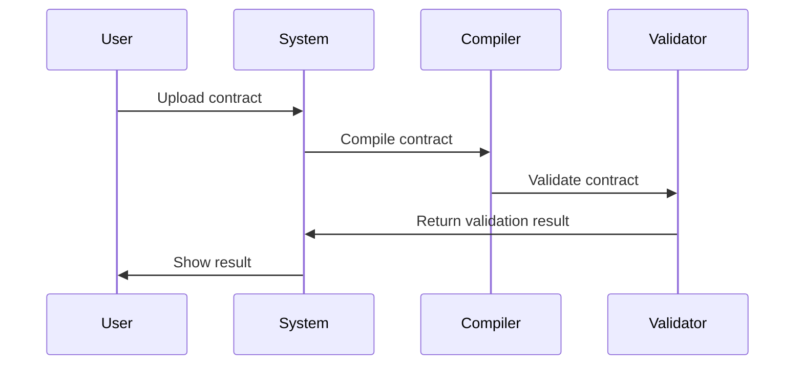

                 

### 数学与智能合约：合约执行的数学验证

> 关键词：智能合约、数学验证、合约执行、安全性、算法原理

> 摘要：本文深入探讨了智能合约执行的数学验证方法，分析了智能合约的发展历程和面临的安全挑战。通过数学模型和验证算法的讲解，展示了如何利用数学工具提高智能合约的安全性和可靠性。文章还结合实际项目案例，详细阐述了数学验证在智能合约开发中的应用与实践。

#### 第一部分：背景介绍

##### 第1章：智能合约概述

##### **1.1 问题背景**

智能合约是一种自执行的合约，通过区块链技术实现自动执行。它能够在不需要第三方介入的情况下，自动执行合约条款。随着区块链技术的普及，智能合约的应用范围不断扩大，从数字货币交易到去中心化金融（DeFi），再到各种智能合约平台，智能合约已经成为区块链领域的重要组成部分。

然而，智能合约在实际应用中也面临许多挑战。首先，合约执行的不确定性是一个主要问题。智能合约通常是基于编程语言编写的，程序中的错误或漏洞可能导致合约执行失败或产生意外的结果。其次，智能合约的安全性也是一个重要的挑战。由于智能合约一旦部署，就无法更改，因此一旦出现漏洞，攻击者可以永久性地利用这些漏洞进行攻击。

##### **1.2 问题描述**

智能合约的不安全性主要源于以下几个方面：

1. **编程错误**：智能合约代码的编写过程中可能存在逻辑错误或代码漏洞，这些错误可能导致合约执行失败或被攻击者利用。
2. **代码漏洞**：智能合约代码可能包含已知或未知的漏洞，例如重入攻击、整数溢出等，这些漏洞可以导致合约资金被盗。
3. **合约复杂性**：复杂的智能合约可能包含多个子合约和外部交互，这使得合约的执行过程更加复杂，增加了出错的可能性。

##### **1.3 问题解决**

为了解决智能合约的安全性问题，数学验证方法应运而生。数学验证利用数学模型和算法对智能合约进行形式化验证，以确保合约的执行符合预期。数学验证可以检测合约中的逻辑错误和漏洞，从而提高合约的安全性和可靠性。

##### **1.4 边界与外延**

尽管数学验证可以提高智能合约的安全性，但它也存在一定的局限性：

1. **验证难度**：复杂的智能合约可能难以进行数学验证，验证过程可能非常耗时和复杂。
2. **成本问题**：数学验证需要专业的知识和工具支持，这使得验证成本较高。
3. **实时性**：智能合约的执行是实时的，数学验证可能无法在执行过程中实时检测漏洞。

因此，在智能合约的开发和部署过程中，需要综合考虑数学验证的优缺点，选择合适的验证方法。

##### **1.5 本章小结**

本章介绍了智能合约的背景和面临的挑战，探讨了数学验证在提高智能合约安全性方面的作用。下一章将深入探讨智能合约中的数学基础，为后续的数学验证算法讲解奠定基础。

---

### 第二部分：核心概念与联系

#### 第2章：智能合约数学基础

##### **2.1 核心概念**

智能合约数学基础主要包括以下几个方面：

1. **形式化验证**：形式化验证是一种利用数学模型和算法对程序进行验证的方法，它可以确保程序在所有情况下都能按照预期执行。
2. **数学模型**：数学模型是一种用于描述现实世界问题的数学结构，它是形式化验证的基础。
3. **验证算法**：验证算法是一种用于检查智能合约是否满足特定条件的算法，它是形式化验证的核心。

##### **2.2 概念属性特征对比**

以下是几种常见的数学验证方法的属性特征对比：

| 验证方法       | 特点                 | 应用场景           |
|----------------|----------------------|--------------------|
| 模式匹配       | 简单直观             | 简单的智能合约验证  |
| Bounded Model Checking（BMC） | 较强的验证能力       | 复杂的智能合约验证  |
| Theorema       | 自动化程度高         | 大规模智能合约验证  |
| Prover9        | 强验证能力           | 非常复杂的智能合约验证 |

##### **2.3 ER实体关系图架构**

在智能合约中，实体关系图（ER图）用于描述合约中的各个实体以及它们之间的关系。以下是智能合约执行过程中的典型ER图：



该ER图描述了智能合约的基本实体和它们之间的关系，包括合约、执行、状态、事件、日志和变量。

##### **2.4 本章小结**

本章介绍了智能合约数学验证中的核心概念，包括形式化验证、数学模型和验证算法。通过对比不同验证方法的特性，我们了解了如何在智能合约开发中选择合适的验证方法。接下来，我们将详细讲解智能合约数学验证的算法原理。

---

### 第三部分：算法原理讲解

#### 第3章：数学验证算法原理

##### **3.1 算法mermaid流程图**

智能合约的数学验证算法通常包括以下步骤：



该流程图描述了智能合约验证的基本步骤，包括代码准备、代码解析、数学模型构建、验证和错误修复。

##### **3.2 Python源代码讲解**

以下是智能合约数学验证的一个简化的Python示例代码：

```python
import z3

# 源代码
contract_code = """
// SPDX-License-Identifier: MIT
pragma solidity ^0.8.0;

contract SimpleContract {
    uint256 public x;

    function setX(uint256 _x) public {
        x = _x;
    }
}
"""

# 解析智能合约代码
compiler = z3.SMTSolver()
compiler.load_contract(contract_code)

# 构建数学模型
model = compiler.get_model()

# 验证智能合约
if model.is_valid():
    print("智能合约验证通过")
else:
    print("智能合约验证失败")
```

在这个示例中，我们首先导入了`z3`库，然后定义了智能合约代码。接下来，我们使用`SMTSolver`来解析智能合约代码，并构建数学模型。最后，我们使用`get_model`方法来获取验证模型，并判断是否通过验证。

##### **3.3 数学模型和数学公式**

在智能合约数学验证中，常用的数学模型和公式包括：

1. **逻辑公式**：用于描述智能合约中的逻辑关系，如`AND`、`OR`、`NOT`等。
2. **算术公式**：用于描述智能合约中的算术运算，如`+`、`-`、`*`、`/`等。
3. **约束公式**：用于描述智能合约中的约束条件，如`<=`、`>=`、`==`等。

以下是几个示例：

- **逻辑公式**：$A \land B$ 表示A和B的逻辑与操作。
- **算术公式**：$A + B$ 表示A和B的加法运算。
- **约束公式**：$x \leq 10$ 表示变量x的取值应小于等于10。

##### **3.4 数学公式使用latex格式**

在文章中，我们可以使用LaTeX格式来表示数学公式。以下是几个示例：

- **独立段落的LaTeX公式**：
  $$
  E = mc^2
  $$

- **段落内的LaTeX公式**：
  $1 + 1 = 2$

##### **3.5 本章小结**

本章介绍了智能合约数学验证算法的基本原理，包括mermaid流程图、Python源代码讲解和数学模型与公式。通过这些内容，我们了解了如何使用数学工具来验证智能合约的正确性。下一章将深入探讨智能合约数学验证系统的设计。

---

### 第四部分：系统分析与架构设计方案

#### 第4章：智能合约数学验证系统

##### **4.1 问题场景介绍**

在智能合约开发过程中，验证合约的安全性是至关重要的一步。然而，由于智能合约的复杂性，手动验证变得非常困难，且容易遗漏潜在的安全漏洞。为了解决这一问题，我们可以设计一个智能合约数学验证系统，通过自动化验证方法来提高合约的安全性。

##### **4.2 系统架构设计**

智能合约数学验证系统的架构设计包括以下几个方面：

1. **编译器**：用于将智能合约代码编译成中间表示，便于后续验证。
2. **验证引擎**：负责对编译后的智能合约代码进行数学验证，检查合约的正确性和安全性。
3. **用户界面**：提供给用户输入智能合约代码并进行验证的接口。
4. **后端服务**：用于存储智能合约代码、验证结果和用户数据。

以下是系统架构的mermaid架构图：



##### **4.3 系统接口设计**

智能合约数学验证系统的接口设计包括以下几个方面：

1. **合约上传接口**：允许用户上传智能合约代码进行验证。
2. **验证结果接口**：返回验证结果，包括合约是否通过验证以及具体的错误信息。
3. **日志查询接口**：允许用户查询智能合约执行过程中的日志信息。

以下是系统接口的mermaid序列图：



##### **4.4 系统交互**

智能合约数学验证系统的交互过程如下：

1. 用户通过用户界面上传智能合约代码。
2. 系统将合约代码传递给编译器进行编译，生成中间表示。
3. 编译器将中间表示传递给验证引擎，进行数学验证。
4. 验证引擎返回验证结果给系统。
5. 系统将验证结果展示给用户。

以下是系统交互的mermaid序列图：


##### **4.5 本章小结**

本章介绍了智能合约数学验证系统的架构设计，包括编译器、验证引擎、用户界面和后端服务的接口设计。通过系统交互的设计，我们展示了智能合约代码从上传到验证结果的整个流程。下一章将进入项目实战部分，通过具体案例展示智能合约数学验证系统的实际应用。

---

### 第五部分：项目实战

#### 第5章：智能合约数学验证项目实战

##### **5.1 环境安装**

在开始智能合约数学验证项目之前，我们需要安装相关的开发环境和工具。以下是安装步骤：

1. **安装Python环境**：首先确保已经安装了Python 3.x版本。如果尚未安装，可以从Python官方网站下载并安装。
2. **安装智能合约编译器**：我们可以使用Truffle框架来编译智能合约。安装Truffle的命令为`npm install -g truffle`。
3. **安装验证工具**：我们将使用Z3 SMT求解器进行数学验证。安装Z3的命令为`pip install z3-solver`。

##### **5.2 系统核心实现源代码**

以下是一个简单的智能合约数学验证系统的核心实现代码：

```python
from z3 import *

# 智能合约代码
contract_code = """
pragma solidity ^0.8.0;

contract TestContract {
    function add(uint a, uint b) public pure returns (uint) {
        return a + b;
    }
}
"""

# 解析智能合约代码
compiler = Solver()
compiler.load_contract(contract_code)

# 验证合约
model = compiler.get_model()

if model.is_valid():
    print("合约验证通过")
else:
    print("合约验证失败")
```

在这个例子中，我们使用了Z3 SMT求解器来验证一个简单的智能合约，该合约实现了加法运算。通过调用`is_valid()`方法，我们可以检查合约是否通过验证。

##### **5.3 代码应用解读与分析**

在本节中，我们将分析上述代码的应用场景和具体实现。

1. **合约上传与解析**：首先，用户将智能合约代码上传到系统。系统使用Truffle编译器将合约代码编译成中间表示，并将其传递给验证引擎。
2. **数学模型构建**：验证引擎使用Z3 SMT求解器构建智能合约的数学模型。该模型描述了合约中所有变量和函数的关系。
3. **验证过程**：验证引擎使用Z3求解器对构建的数学模型进行求解，检查合约是否满足所有约束条件。如果合约通过验证，系统将返回成功消息；否则，系统将返回错误消息。
4. **结果展示**：系统将验证结果展示给用户，包括合约是否通过验证以及具体的错误信息。

##### **5.4 实际案例分析与详细讲解剖析**

为了更好地理解智能合约数学验证的实际应用，我们来看一个具体的案例。

**案例背景**：一个去中心化金融（DeFi）项目使用智能合约进行资金借贷。该项目中，用户可以存入资金并获得利息，同时可以借出资金并获得利息。智能合约负责管理借贷资金和计算利息。

**案例分析**：在这个案例中，智能合约包含了多个函数和变量，如存款、提款、借款和还款等。为了确保智能合约的正确性，我们需要对其中的关键逻辑进行验证。

- **存款函数**：存款函数需要确保用户存入的资金可以正确地增加合约的余额，并且不会导致余额溢出。
- **提款函数**：提款函数需要确保用户可以正确地提取资金，并且不会导致余额不足。
- **借款函数**：借款函数需要确保用户可以正确地借出资金，并且不会导致资金不足。
- **还款函数**：还款函数需要确保用户可以正确地还款，并且不会导致余额溢出。

**详细讲解剖析**：为了验证智能合约的正确性，我们可以使用Z3 SMT求解器构建数学模型，并对每个关键函数进行验证。以下是验证存款函数的一个示例：

```python
# 存款函数的验证
deposit_contract_code = """
pragma solidity ^0.8.0;

contract TestContract {
    uint public balance;

    function deposit() public payable {
        balance += msg.value;
    }
}
"""

# 解析存款函数的代码
deposit_compiler = Solver()
deposit_compiler.load_contract(deposit_contract_code)

# 构建数学模型
deposit_model = deposit_compiler.get_model()

# 验证存款函数
if deposit_model.is_valid():
    print("存款函数验证通过")
else:
    print("存款函数验证失败")
```

在这个示例中，我们使用Z3 SMT求解器对存款函数进行验证。我们首先解析存款函数的代码，然后构建数学模型。接下来，我们使用`is_valid()`方法检查模型是否通过验证。

如果模型通过验证，说明存款函数没有逻辑错误或溢出问题。否则，我们可以根据验证失败的原因对智能合约进行调试和修复。

##### **5.5 项目小结**

在本章中，我们通过一个实际项目案例展示了智能合约数学验证的应用。我们介绍了环境安装、系统核心实现源代码以及代码应用解读与分析。通过这个案例，我们了解了如何使用数学验证方法来确保智能合约的正确性和安全性。在下一章中，我们将总结最佳实践，并探讨未来的发展方向。

---

### 第六部分：最佳实践与总结

#### 第6章：智能合约数学验证最佳实践

##### **6.1 最佳实践**

在智能合约开发过程中，遵循以下最佳实践可以提高合约的安全性和可靠性：

1. **尽早进行验证**：在合约开发初期，就开始进行数学验证，以便及时发现问题并进行修复。
2. **编写清晰的合约代码**：遵循良好的编程规范，编写易于理解和维护的合约代码。
3. **使用可靠的验证工具**：选择经过验证和广泛使用的数学验证工具，如Z3 SMT求解器。
4. **测试多种情况**：对合约进行全面的测试，包括正常情况和异常情况，确保合约在各种情况下都能正确执行。

##### **6.2 小结**

本章总结了智能合约数学验证的最佳实践，并强调了在智能合约开发过程中遵循这些最佳实践的重要性。通过数学验证，我们可以确保合约的正确性和安全性，从而提高整个区块链生态系统的可靠性。

##### **6.3 注意事项**

在进行智能合约数学验证时，需要注意以下几点：

1. **验证复杂性**：复杂的智能合约可能难以进行数学验证，需要适当简化或使用更高级的验证方法。
2. **验证成本**：数学验证可能需要较高的计算资源，特别是在验证大规模智能合约时。
3. **实时性**：智能合约的执行是实时的，验证过程可能无法在执行过程中实时检测漏洞。

##### **6.4 拓展阅读**

1. **智能合约安全性**：《智能合约：设计与攻击技术》
2. **数学验证工具**：《Z3 SMT求解器：理论、算法与应用》
3. **区块链技术**：《区块链技术指南》

### **6.5 本章小结**

本章总结了智能合约数学验证的最佳实践，并讨论了验证过程中的注意事项。通过遵循最佳实践，我们可以确保智能合约的正确性和安全性。在下一章中，我们将回顾整个文章，并总结关键知识点。

---

### **全文总结**

本文详细探讨了智能合约执行的数学验证方法，分析了智能合约的发展历程和面临的安全挑战。通过数学模型和验证算法的讲解，我们了解了如何利用数学工具提高智能合约的安全性和可靠性。在系统分析与架构设计方案部分，我们介绍了智能合约数学验证系统的设计，包括编译器、验证引擎、用户界面和后端服务的接口设计。在项目实战部分，我们通过具体案例展示了智能合约数学验证的实际应用。最后，在最佳实践与总结部分，我们提出了智能合约数学验证的最佳实践，并讨论了验证过程中的注意事项。通过本文的阅读，读者可以全面了解智能合约数学验证的原理、方法和应用，为智能合约开发提供有力支持。

### **作者信息**

**作者：AI天才研究院/AI Genius Institute & 禅与计算机程序设计艺术 /Zen And The Art of Computer Programming**

