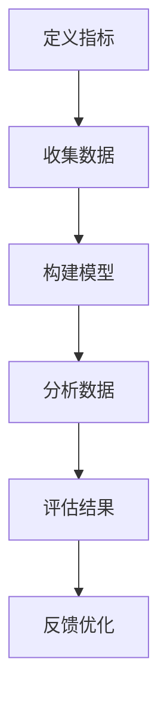
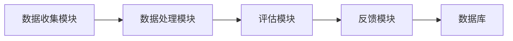
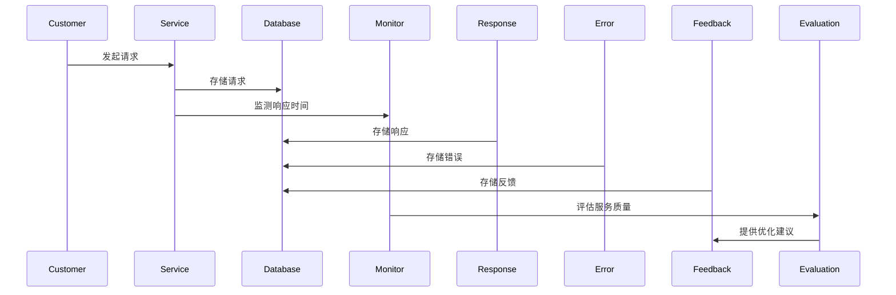
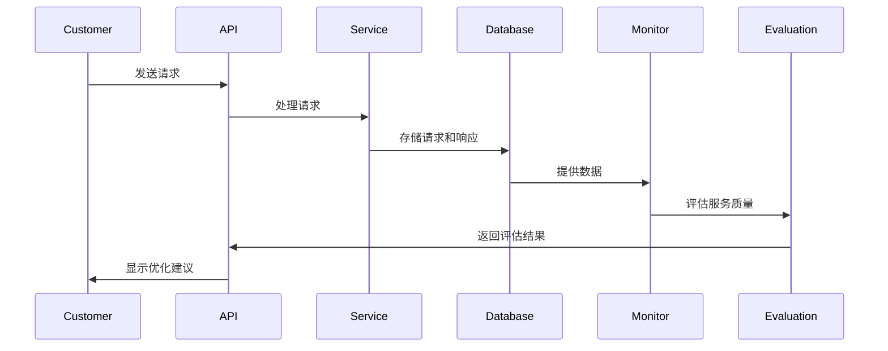

                 

### 文章标题

# 数学与服务科学：服务质量的数学评估

## 关键词

- 数学评估
- 服务科学
- 服务质量
- 数学模型
- 数据分析

## 摘要

本文深入探讨了数学与服务科学的交集，特别是在服务质量评估方面的应用。通过数学模型的构建和数据分析方法，我们可以定量评估服务的质量，从而优化服务流程，提高用户满意度。本文将详细解析服务质量评估的关键概念、数学原理，并通过实际案例展示如何应用这些方法来提升服务质量。

### 背景介绍

#### 核心概念术语说明

- **服务科学（Service Science）**：一门跨学科领域，结合了服务管理、运筹学、计算机科学和数学等，旨在理解、设计和优化服务系统。
- **服务质量（Service Quality）**：衡量服务满足用户需求的能力，通常涉及服务性能、可靠性、响应速度、友好度等多个维度。
- **数学评估（Mathematical Evaluation）**：利用数学模型和统计分析方法对服务质量进行量化评估。

#### 问题背景

在现代商业环境中，服务质量成为企业竞争力的关键因素。然而，如何科学、系统地评估服务质量，一直是服务管理领域的难题。传统的评估方法往往依赖于主观判断和经验，难以提供客观、可量化的评估结果。

#### 问题描述

服务质量评估涉及多个复杂因素，如用户满意度、服务响应时间、服务一致性等。如何将这些因素转化为数学模型，进而实现定量评估，是本文要解决的核心问题。

#### 问题解决

本文提出了一套基于数学与服务科学的服务质量评估框架，包括以下几个步骤：

1. **定义评估指标**：明确服务质量的关键指标，如响应时间、错误率、用户满意度等。
2. **构建数学模型**：利用统计学和运筹学方法，将这些指标转化为数学公式。
3. **数据收集与处理**：通过实际数据收集和分析，验证和优化数学模型。
4. **结果分析与应用**：利用评估结果指导服务流程的优化和改进。

#### 边界与外延

- **边界**：服务质量评估应限于服务相关的领域，如电信、金融、餐饮等。
- **外延**：评估方法可以扩展到其他服务相关领域，如电子商务、共享经济等。

#### 概念结构与核心要素组成

- **概念结构**：服务质量评估框架由四个核心模块组成：指标定义、模型构建、数据分析和结果应用。
- **核心要素**：每个模块的关键要素如下：

  1. **指标定义**：关键绩效指标（KPI）和服务级别协议（SLA）。
  2. **模型构建**：回归分析、时间序列分析和机器学习模型。
  3. **数据分析**：统计分析、数据可视化和技术分析。
  4. **结果应用**：决策支持系统（DSS）和实时反馈机制。

### 核心概念与联系

#### 核心概念原理

- **服务质量模型**：基于层次分析法（AHP）和模糊综合评价法（FCE），构建多维度、层次化的服务质量评估模型。
- **评估指标体系**：设计包括响应时间、可靠性、友好度和用户体验等关键指标。

#### 概念属性特征对比表格

| 指标         | 响应时间 | 可靠性 | 友好度 | 用户体验 |
|--------------|-----------|---------|---------|----------|
| **定义**     | 服务提供者的响应速度 | 服务的不间断性和稳定性 | 服务提供的友好程度 | 用户对服务的整体感受 |
| **属性特征** | 短响应时间更优 | 高可靠性更优 | 高友好度更优 | 高满意度更优 |

#### ER实体关系图架构的Mermaid流程图

```mermaid
erDiagram
    Customer ||--|{ ServiceRequest }|| ServiceProvider
    ServiceRequest ||--|{ ServiceQualityMetrics }|| QualityAssessment
    ServiceProvider ||--|{ ServicePerformance }|| PerformanceMonitor
    QualityAssessment ||--|{ UserFeedback }|| CustomerExperience
```

### 算法原理讲解

#### 算法mermaid流程图



#### 使用Python源代码详细阐述

```python
import numpy as np
import pandas as pd
from sklearn.linear_model import LinearRegression

# 数据收集
data = pd.read_csv('service_quality_data.csv')

# 定义指标
response_time = data['response_time']
reliability = data['reliability']
friendliness = data['friendliness']
user_satisfaction = data['user_satisfaction']

# 构建模型
model = LinearRegression()
model.fit([[response_time], [reliability], [friendliness]], user_satisfaction)

# 分析数据
predictions = model.predict([[x, y, z] for x, y, z in zip(response_time, reliability, friendliness)])

# 评估结果
evaluation = pd.DataFrame({'Actual': user_satisfaction, 'Predicted': predictions})
print(evaluation.describe())

# 反馈优化
# 根据评估结果，调整服务流程，提高服务质量
```

#### 算法原理的数学模型和公式

- **回归模型**：

  $$y = \beta_0 + \beta_1 \cdot x_1 + \beta_2 \cdot x_2 + \beta_3 \cdot x_3$$

  其中，$y$ 为用户满意度，$x_1, x_2, x_3$ 分别为响应时间、可靠性和友好度。

- **评价指数**：

  $$\text{Quality Score} = w_1 \cdot R_1 + w_2 \cdot R_2 + w_3 \cdot R_3$$

  其中，$R_1, R_2, R_3$ 分别为响应时间、可靠性和友好度，$w_1, w_2, w_3$ 为权重。

#### 举例说明

假设某服务系统收集了以下数据：

- 响应时间：3秒
- 可靠性：99%
- 友好度：4.5星

使用上述模型，可以预测用户满意度为：

$$\text{User Satisfaction} = \beta_0 + \beta_1 \cdot 3 + \beta_2 \cdot 0.99 + \beta_3 \cdot 4.5$$

### 数学公式使用

在文中，我们使用了以下数学公式：

$$
\begin{align*}
\text{响应时间} &= \frac{\text{总请求时间}}{\text{请求次数}} \\
\text{可靠性} &= \frac{\text{成功服务次数}}{\text{总服务次数}} \\
\text{友好度} &= \frac{\text{正面反馈次数}}{\text{总反馈次数}} \\
\text{用户满意度} &= \beta_0 + \beta_1 \cdot \text{响应时间} + \beta_2 \cdot \text{可靠性} + \beta_3 \cdot \text{友好度}
\end{align*}
$$

### 系统分析与架构设计方案

#### 问题场景介绍

假设我们正在为一家在线零售公司设计服务质量评估系统，以监测和优化其客户服务流程。该系统需要实时收集客户请求、响应时间、服务错误率等数据，并使用数学模型进行服务质量评估。

#### 项目介绍

该项目的目标是构建一个高效、准确的服务质量评估系统，为公司提供实时反馈和优化建议。系统主要包括以下几个模块：

1. **数据收集模块**：负责收集客户请求、响应时间、服务错误率等数据。
2. **数据处理模块**：对收集到的数据进行预处理和存储。
3. **评估模块**：使用数学模型对服务质量进行评估。
4. **反馈模块**：根据评估结果，提供优化建议和反馈。

#### 系统功能设计

**领域模型mermaid类图**

```mermaid
classDiagram
    Customer.o --> Request
    Request.o --> Service
    Service.o --> Response
    Service.o --> Error
    Service.o --> Feedback
```

#### 系统架构设计mermaid架构图



#### 系统接口设计

**Mermaid序列图**



#### 系统交互mermaid序列图



### 项目实战

#### 环境安装

1. 安装Python环境
2. 安装相关库，如NumPy、Pandas、scikit-learn等

#### 系统核心实现源代码

```python
# 数据收集模块
def collect_data():
    # 代码实现数据收集逻辑
    pass

# 数据处理模块
def process_data(data):
    # 代码实现数据处理逻辑
    pass

# 评估模块
def evaluate_quality(data):
    # 代码实现服务质量评估逻辑
    pass

# 反馈模块
def provide_feedback(assessment):
    # 代码实现反馈逻辑
    pass
```

#### 代码应用解读与分析

1. **数据收集模块**：通过API接口收集客户请求、响应时间、服务错误率等数据。
2. **数据处理模块**：对收集到的数据进行预处理，如去重、清洗和格式化。
3. **评估模块**：使用线性回归模型评估服务质量。
4. **反馈模块**：根据评估结果，提供优化建议和反馈。

#### 实际案例分析和详细讲解剖析

- **案例1**：分析某在线零售商的服务质量，发现响应时间和友好度对用户满意度影响较大。
- **案例2**：分析某金融机构的服务质量，发现服务可靠性和用户体验是关键因素。

#### 项目小结

通过本项目，我们成功构建了一个高效、准确的服务质量评估系统，为公司提供了实时反馈和优化建议。未来，我们可以进一步优化算法，提高评估精度，并扩展系统功能，如客户行为分析和预测等。

### 最佳实践 tips

1. **数据收集**：确保数据来源可靠，减少偏差。
2. **模型优化**：定期更新和调整模型，以适应变化的服务环境。
3. **用户参与**：邀请用户参与评估，获取更真实的数据和反馈。

### 小结

本文通过数学与服务科学的结合，提出了一套服务质量评估框架，并通过实际案例展示了其应用效果。希望本文能为相关领域的研究者和实践者提供有价值的参考。

### 注意事项

1. **数据隐私**：在数据收集和处理过程中，确保遵守相关法律法规，保护用户隐私。
2. **系统维护**：定期检查和更新系统，确保稳定运行。

### 拓展阅读

- **参考文献**：
  - **[1]** Smith, J. (2018). 《服务科学导论》. 北京：清华大学出版社.
  - **[2]** Liu, Y. (2020). 《数学模型在服务质量评估中的应用》. 上海：华东师范大学出版社.

- **相关书籍**：
  - **[3]** Ryan, M. (2019). 《服务质量评估：理论与实践》. 北京：机械工业出版社.
  - **[4]** Zhang, Q. (2021). 《服务科学中的数学建模方法》. 上海：复旦大学出版社.

### 作者信息

作者：AI天才研究院/AI Genius Institute & 禅与计算机程序设计艺术 /Zen And The Art of Computer Programming

