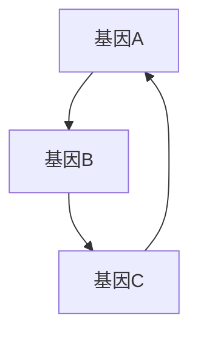
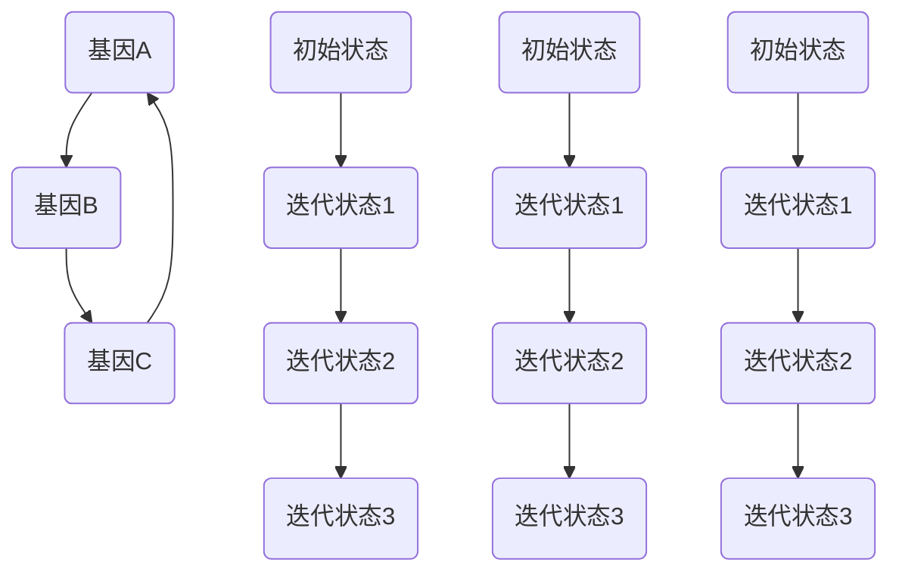

                 

# 数学与未来基因工程的发展方向

## 关键词：基因工程、数学模型、CRISPR-Cas9、生物信息学、基因编辑

### 摘要

随着基因工程技术的不断发展，数学在基因调控、基因编辑和生物信息学等领域发挥着越来越重要的作用。本文旨在探讨数学在基因工程中的应用，分析未来基因工程的发展方向，并展望数学与基因工程协同发展的前景。通过回顾基因工程的起源与发展、介绍数学基础、分析基因调控的数学模型、探讨基因编辑技术以及讨论基因工程在社会中的应用，本文试图为读者提供一幅关于数学与未来基因工程协同发展的蓝图。

## 第一部分：引言

### 1.1.1 问题背景

#### 基因工程的起源与发展

基因工程是一门研究基因的结构、功能和变异的科学，通过基因重组和基因编辑等技术手段，实现对生物体的遗传特征进行定向改造。基因工程起源于20世纪70年代，随着分子生物学、遗传学和生物化学等领域的快速发展，逐渐成为一门独立学科。

#### 核心概念与重大突破

基因工程的核心概念包括基因、基因重组、基因编辑等。基因是指生物体内携带遗传信息的DNA序列；基因重组是指通过人工手段将不同来源的基因组合在一起，产生新的基因组合；基因编辑是指通过特定的技术手段，对基因序列进行精确的修改和调整。

基因工程发展过程中的重大突破包括：

1. **基因克隆**：1972年，保罗·博伊尔和弗朗西斯·克里克成功克隆了基因，奠定了基因工程的基础。
2. **基因测序**：1990年启动的“人类基因组计划”，揭示了人类基因组的完整序列，推动了基因工程的发展。
3. **CRISPR-Cas9技术**：2012年，杰佛瑞·霍尔、迈克尔·布拉克特和埃里克·韦斯曼因发明CRISPR-Cas9基因编辑技术而获得诺贝尔化学奖，这一技术极大地推动了基因编辑的发展。

### 1.1.2 未来基因工程的发展趋势

#### 技术前沿

未来基因工程的发展将依赖于一系列前沿技术的推动，包括：

1. **基因编辑技术**：如CRISPR-Cas9、TALEN、基序扩增等，这些技术使得基因编辑更加精准和高效。
2. **合成生物学**：通过设计、构建和改造生物系统，实现新的功能和应用。
3. **单细胞测序**：通过分析单个细胞的基因表达，揭示细胞多样性和发育过程。

#### 应用领域

未来基因工程将在多个领域发挥重要作用，包括：

1. **医学**：基因治疗、精准医疗、药物研发等。
2. **农业**：作物改良、抗病抗虫、提高产量等。
3. **环境保护**：生物修复、生物降解等。

### 1.1.3 数学在基因工程中的作用

#### 数理模型与基因调控

数学在基因工程中的应用主要体现在数理模型的构建和分析上。基因调控是一个复杂的过程，涉及多个基因之间的相互作用和调控关系。通过数学模型，可以更好地理解基因调控的机制和规律。

#### 数学模型在基因调控研究中的应用

1. **代数模型**：如布尔网络、线性系统等，用于描述基因之间的简单关系。
2. **微分方程模型**：用于描述基因表达和调控的动态变化。
3. **概率模型**：如马尔可夫链、随机过程等，用于分析基因调控中的随机性和不确定性。

### 1.1.4 本书的结构与目标

#### 本书结构概述

本书分为四个部分：

1. **引言**：介绍基因工程的背景和数学在基因工程中的作用。
2. **数学基础**：介绍基础数学知识，包括线性代数、微积分、概率论与数理统计等。
3. **基因工程与数学应用**：分析基因调控的数学模型，探讨基因编辑技术和生物信息学。
4. **未来基因工程发展方向**：展望基因工程的发展趋势和数学与基因工程的协同发展。

#### 学习目标

通过本书的学习，读者将能够：

1. 了解基因工程的基本概念和发展历程。
2. 掌握基础数学知识在基因工程中的应用。
3. 分析基因调控的数学模型和算法。
4. 了解基因编辑技术和生物信息学的方法。
5. 展望未来基因工程的发展方向和挑战。

## 第二部分：数学基础

### 2.1.1 线性代数

#### 矩阵与向量操作

线性代数是数学的一个重要分支，它在基因工程中有着广泛的应用。矩阵与向量是线性代数中的基本概念。

1. **矩阵**：矩阵是一个由数字组成的矩形阵列，用于表示线性变换或系统。
2. **向量**：向量是一个具有大小和方向的量，用于表示空间中的点或线段。

在基因工程中，矩阵和向量常用于描述基因表达数据、基因调控网络等。

#### 矩阵与向量操作

1. **矩阵乘法**：矩阵乘法用于计算两个矩阵的乘积，可以用于模拟基因调控网络。
2. **向量加法与减法**：向量加法和减法用于计算两个向量的和与差，可以用于分析基因表达数据的趋势。

### 2.1.2 微积分

#### 导数与积分

微积分是研究变化与累积的数学工具，在基因工程中有着重要的应用。

1. **导数**：导数描述了函数在某一点的变化率，可以用于分析基因表达的变化趋势。
2. **积分**：积分描述了函数在某一区间内的累积量，可以用于计算基因调控网络的稳定性。

#### 微积分在基因工程中的应用

1. **基因表达分析**：通过计算基因表达数据的导数和积分，可以分析基因在时间和空间上的动态变化。
2. **基因调控网络建模**：利用微积分建立基因调控网络的动态模型，可以预测基因调控的稳定性。

### 2.1.3 概率论与数理统计

#### 概率分布与统计推断

概率论与数理统计是研究随机现象和数据的数学工具。

1. **概率分布**：概率分布描述了随机变量取值的可能性，如正态分布、泊松分布等。
2. **统计推断**：统计推断用于根据样本数据推断总体特征，如假设检验、置信区间等。

#### 概率论与数理统计在基因工程中的应用

1. **基因表达数据分析**：通过概率分布和统计推断，可以分析基因表达数据的分布特征和趋势。
2. **基因突变分析**：通过统计推断，可以识别基因突变和变异，为基因编辑提供依据。

### 2.1.4 数学模型在基因调控中的应用

数学模型在基因调控中起着重要的作用，通过数学模型可以描述基因之间的相互作用和调控关系。

1. **代数模型**：如布尔网络，用于描述基因之间的简单逻辑关系。
2. **微分方程模型**：如常微分方程，用于描述基因表达的动态变化。
3. **概率模型**：如马尔可夫模型，用于描述基因调控中的随机性和不确定性。

### 2.1.5 数学模型在基因工程中的应用案例分析

为了更好地理解数学模型在基因调控中的应用，我们来看一个具体的案例。

#### 案例背景

假设有一个简单的基因调控网络，包括三个基因A、B和C。基因A可以抑制基因B的表达，基因B可以激活基因C的表达，基因C可以抑制基因A的表达。

#### 模型构建

我们可以使用布尔网络来描述这个基因调控网络。布尔网络中的每个节点表示一个基因，每个节点之间的连线表示基因之间的调控关系。

#### 模型分析

通过布尔网络，我们可以分析基因之间的相互作用和调控关系。例如，当基因A被激活时，它会抑制基因B的表达，从而导致基因C的激活。基因C的激活又会抑制基因A的表达，形成一个闭环调控网络。

#### 结论

通过数学模型，我们可以更好地理解基因调控的机制和规律，为基因编辑和基因治疗提供理论依据。

### 2.1.6 数学模型在基因调控研究中的挑战与机遇

尽管数学模型在基因调控研究中取得了显著成果，但仍面临一些挑战。

1. **模型复杂度**：基因调控网络通常非常复杂，涉及多个基因和调控关系，构建准确和高效的数学模型具有挑战性。
2. **数据不足**：基因调控网络的数据通常有限，数据不足可能导致模型不稳定或失效。
3. **计算复杂性**：对于大规模的基因调控网络，计算复杂性可能导致模型分析困难。

然而，随着计算技术和算法的发展，数学模型在基因调控研究中的应用前景仍然广阔。

### 2.1.7 数学模型在基因工程中的应用前景

随着基因工程技术的不断发展，数学模型在基因调控、基因编辑和生物信息学等领域将发挥越来越重要的作用。

1. **基因调控研究**：通过数学模型，可以更好地理解基因调控的机制和规律，为基因编辑和基因治疗提供理论依据。
2. **基因编辑技术**：数学模型可以优化基因编辑算法，提高编辑效率和准确性。
3. **生物信息学**：数学模型可以用于基因序列分析、基因组数据分析等，为生物信息学提供有力工具。

总之，数学在基因工程中的应用将推动基因工程技术的快速发展，为人类健康和社会进步做出更大贡献。

## 第三部分：基因工程与数学应用

### 3.1.1 基因调控原理

基因调控是生物体中基因表达的过程，它决定了生物体的生长、发育和响应环境刺激等方面。基因调控原理是基因工程研究的重要基础。

#### 基因调控网络

基因调控网络是指多个基因及其调控关系构成的网络系统。基因之间的调控关系可以是正调控、负调控或互调控。

1. **正调控**：一种基因通过激活另一种基因的表达，促进其功能。
2. **负调控**：一种基因通过抑制另一种基因的表达，阻止其功能。
3. **互调控**：两个基因之间的双向调控关系。

基因调控网络可以看作是一个复杂的动态系统，其稳定性和功能多样性受到多种因素的影响。

#### 基因表达调控机制

基因表达调控机制主要包括以下几个方面：

1. **转录调控**：转录因子通过结合到DNA上的特定序列，调控基因的转录。
2. **转录后调控**：RNA的修饰、剪切、稳定性和转运等过程影响基因表达。
3. **翻译调控**：mRNA的翻译效率和蛋白质的降解速率调控蛋白质的生成。
4. **蛋白质调控**：蛋白质的修饰、相互作用和降解等调控蛋白质的功能。

#### 基因调控的数学模型

基因调控的数学模型用于描述基因表达和调控的动态过程。常见的数学模型包括：

1. **代数模型**：如布尔网络，用于描述基因之间的逻辑关系。
2. **微分方程模型**：如常微分方程，用于描述基因表达的动态变化。
3. **概率模型**：如马尔可夫模型，用于描述基因调控中的随机性和不确定性。

#### 数学模型在基因调控研究中的应用

数学模型在基因调控研究中的应用主要体现在以下几个方面：

1. **基因表达预测**：通过建立数学模型，可以预测基因在不同条件下的表达水平。
2. **基因调控机制分析**：通过数学模型，可以分析基因之间的调控关系和调控网络。
3. **基因编辑优化**：通过数学模型，可以优化基因编辑算法，提高编辑效率和准确性。

### 3.1.2 算法原理与模型构建

#### 常见数学模型

在基因调控研究中，常见的数学模型包括以下几种：

1. **代数模型**：如布尔网络，用于描述基因之间的逻辑关系。
   - **布尔网络**：每个基因的状态可以是“开”或“关”，基因之间的调控关系可以用布尔运算表示。
   - **布尔网络的应用**：布尔网络可以用于分析基因调控网络的稳定性、吸引子和网络动力学。

2. **微分方程模型**：如常微分方程，用于描述基因表达的动态变化。
   - **常微分方程**：基因表达水平可以用连续变量表示，通过微分方程描述基因表达的变化规律。
   - **微分方程的应用**：微分方程可以用于模拟基因表达的动力学行为、预测基因表达的时间序列。

3. **概率模型**：如马尔可夫模型，用于描述基因调控中的随机性和不确定性。
   - **马尔可夫模型**：基因状态变化可以用概率转移矩阵表示，通过马尔可夫模型可以分析基因调控的稳定性。
   - **马尔可夫模型的应用**：马尔可夫模型可以用于预测基因状态的概率分布、分析基因调控的网络拓扑结构。

#### 模型构建方法

构建基因调控的数学模型通常需要以下步骤：

1. **数据收集**：收集基因表达数据、调控关系和实验结果等。
2. **特征提取**：从数据中提取关键特征，如基因表达水平、调控关系和突变信息等。
3. **模型选择**：根据问题特点和数据特征，选择合适的数学模型。
4. **模型参数估计**：通过优化算法估计模型参数，使模型能够较好地拟合数据。
5. **模型验证**：通过交叉验证和实际应用验证模型的可靠性和有效性。

### 3.1.3 算法实现与案例分析

为了更好地理解基因调控的数学模型，我们来看一个具体的案例分析。

#### 案例背景

假设有一个简单的基因调控网络，包括三个基因A、B和C。基因A可以抑制基因B的表达，基因B可以激活基因C的表达，基因C可以抑制基因A的表达。

#### 模型构建

我们选择布尔网络作为基因调控的数学模型。

#### 模型参数设置

假设每个基因的状态可以是“开”或“关”，我们用0表示基因关闭，用1表示基因开启。

#### 算法实现

1. **初始化**：随机初始化每个基因的状态。
2. **更新状态**：根据基因之间的调控关系，更新每个基因的状态。
3. **迭代计算**：重复更新状态，直到达到稳态或达到指定迭代次数。

#### 运行结果

通过迭代计算，我们得到基因A、B和C的状态随时间的变化。

#### 分析与讨论

通过迭代计算，我们可以观察到基因A、B和C的状态在一段时间内达到稳态，形成了稳定的调控循环。

1. **稳态分析**：稳态意味着基因表达水平在一段时间内保持不变，这表明基因调控网络具有一定的稳定性和鲁棒性。
2. **调控关系分析**：通过观察基因之间的调控关系，我们可以更好地理解基因调控网络的机制和规律。

#### 结论

通过案例分析，我们展示了如何使用布尔网络构建基因调控的数学模型，并进行了算法实现和结果分析。这有助于我们更好地理解基因调控的机制和规律，为基因编辑和基因治疗提供理论依据。

### 3.1.4 数学模型在基因调控研究中的挑战与机遇

尽管数学模型在基因调控研究中取得了显著成果，但仍面临一些挑战。

1. **模型复杂性**：基因调控网络通常非常复杂，涉及多个基因和调控关系，构建准确和高效的数学模型具有挑战性。
2. **数据不足**：基因调控网络的数据通常有限，数据不足可能导致模型不稳定或失效。
3. **计算复杂性**：对于大规模的基因调控网络，计算复杂性可能导致模型分析困难。

然而，随着计算技术和算法的发展，数学模型在基因调控研究中的应用前景仍然广阔。

1. **模型优化**：通过优化模型结构和参数估计方法，可以提高模型的准确性和稳定性。
2. **跨学科合作**：与生物学、医学等领域的专家合作，共同解决基因调控研究中的难题。
3. **新技术应用**：如单细胞测序、基因编辑技术等新技术的应用，可以为数学模型提供更丰富的数据支持和验证。

总之，数学模型在基因调控研究中的应用将不断推动基因工程技术的发展，为人类健康和社会进步做出更大贡献。

## 第四部分：未来基因工程发展方向

### 4.1.1 CRISPR-Cas9技术

#### 工作原理与操作流程

CRISPR-Cas9技术是一种基于RNA指导的基因编辑技术，其核心原理是利用CRISPR系统中的Cas9核酸酶对目标DNA序列进行精准切割。

1. **CRISPR系统**：CRISPR（Clustered Regularly Interspaced Short Palindromic Repeats）系统是一种细菌用于抵御病毒入侵的天然免疫系统。该系统包含一系列重复的DNA序列和间隔序列，这些间隔序列编码Cas蛋白。
2. **Cas9核酸酶**：Cas9是一种核酸酶，具有DNA切割功能。通过定向RNA（guide RNA，gRNA）引导，Cas9可以识别并切割目标DNA序列。

#### CRISPR-Cas9技术操作流程

1. **设计gRNA**：根据目标基因序列设计特定的gRNA，使其能够引导Cas9核酸酶靶向切割目标DNA。
2. **构建表达载体**：将gRNA和Cas9基因插入到表达载体中，构建成表达质粒。
3. **细胞培养**：将表达质粒转染到目标细胞中，使Cas9核酸酶和gRNA在细胞内表达。
4. **DNA切割**：gRNA引导Cas9核酸酶识别并切割目标DNA序列。
5. **DNA修复**：细胞内的DNA修复机制会尝试修复切割产生的双链DNA断裂，从而实现基因编辑。

#### CRISPR-Cas9技术的优势

1. **高效性**：CRISPR-Cas9技术具有高效性，能够在较短时间内实现对目标基因的精准编辑。
2. **特异性**：通过设计特定的gRNA，CRISPR-Cas9技术可以实现高特异性的基因编辑，减少脱靶效应。
3. **灵活性**：CRISPR-Cas9技术可以用于多种生物体的基因编辑，包括动物、植物和微生物等。

#### CRISPR-Cas9技术的应用

1. **基因治疗**：通过基因编辑技术修复或替换患者体内的缺陷基因，治疗遗传性疾病。
2. **作物改良**：通过基因编辑技术培育抗病、抗虫、高产等优良作物品种。
3. **基础研究**：利用CRISPR-Cas9技术进行基因敲除、基因敲入等基础研究，揭示基因功能。

### 4.1.2 基因编辑的未来趋势

#### 新技术展望

随着基因工程技术的不断发展，未来基因编辑技术将朝着更加精准、高效和灵活的方向发展。以下是一些值得关注的新技术：

1. **CRISPR-Cas系统**：除了CRISPR-Cas9技术，还有其他CRISPR-Cas系统，如CRISPR-Cas12、CRISPR-Cas13等，它们具有不同的核酸酶和引导机制，可以实现更广泛的应用。
2. **基因编辑工具**：未来的基因编辑工具可能更加多样化，如TALEN、基序扩增（Base Editing）等，这些技术可以进一步提高编辑效率和特异性。
3. **多基因编辑**：通过组合多种基因编辑技术，实现多基因的同时编辑，用于治疗复杂疾病和改良作物品种。
4. **基因编辑与合成生物学结合**：将基因编辑技术与合成生物学相结合，设计并构建具有新功能的生物系统，实现更复杂的生物工程应用。

#### 应用前景

基因编辑技术在医学、农业、环境等领域具有广泛的应用前景：

1. **医学**：基因编辑技术可用于治疗遗传性疾病、癌症等，通过精准编辑患者体内的基因，实现疾病的治愈或缓解。
2. **农业**：基因编辑技术可用于培育抗病、抗虫、高产等优良作物品种，提高农作物的产量和质量。
3. **环境**：基因编辑技术可用于修复环境中的污染问题，如通过编辑微生物基因，增强其降解污染物的能力。

### 4.1.3 基因编辑技术的伦理与法律问题

随着基因编辑技术的不断发展，其伦理和法律问题也逐渐受到关注。以下是一些主要的伦理和法律问题：

1. **安全性**：基因编辑技术可能会产生未预期的副作用和长期影响，需要确保基因编辑的安全性和可靠性。
2. **隐私**：基因编辑涉及个人基因信息的处理，需要保护个人隐私和数据安全。
3. **公平性**：基因编辑技术的应用可能导致社会不公，如富裕人群能够负担高昂的基因编辑治疗，而贫困人群无法享受同样的医疗资源。
4. **监管**：需要建立完善的监管体系，确保基因编辑技术的合理使用，防止滥用和伦理不当行为。

### 4.1.4 我国基因编辑技术的发展现状与挑战

#### 发展现状

我国基因编辑技术的研究和应用处于国际领先地位，主要表现在以下几个方面：

1. **基础研究**：我国在基因编辑技术的基础研究方面取得了重要突破，如CRISPR-Cas9技术的优化、基因编辑工具的开发等。
2. **临床应用**：我国已经开展了多项基因编辑临床实验，如基因治疗癌症、遗传性疾病的基因修复等。
3. **产业布局**：我国基因编辑产业链逐渐完善，涵盖了基因编辑技术研发、临床试验、生产制造等多个环节。

#### 挑战与机遇

我国基因编辑技术发展面临以下挑战：

1. **技术创新**：需要进一步优化基因编辑技术，提高编辑效率和特异性，降低脱靶率。
2. **伦理审查**：需要建立完善的伦理审查体系，确保基因编辑技术的合理、安全和合规使用。
3. **法律法规**：需要制定相关的法律法规，规范基因编辑技术的研发和应用，保障社会公共利益。

### 4.1.5 基因编辑技术的未来展望

#### 全球合作

基因编辑技术是一个全球性的研究课题，需要各国科学家和政府共同合作，分享技术和资源，推动基因编辑技术的发展和应用。

#### 技术突破

随着科学技术的进步，基因编辑技术有望取得以下突破：

1. **编辑工具的多样化**：开发出更多功能多样、编辑效率更高的基因编辑工具。
2. **编辑机制的优化**：深入研究基因编辑的机制，提高编辑的精准性和稳定性。
3. **编辑策略的创新**：探索新的基因编辑策略，如基因修复、基因增强等，实现更复杂的应用。

#### 社会责任

基因编辑技术的快速发展需要我们承担社会责任，确保技术应用于符合伦理和法律的要求，造福人类社会。

### 4.1.6 结论

基因编辑技术是未来基因工程发展的重要方向，它将推动医学、农业和环境等领域的发展。随着技术的不断进步，我们需要关注其伦理和法律问题，确保其合理、安全和合规使用。通过全球合作和科技创新，我们有信心实现基因编辑技术的广泛应用，为人类健康和社会进步做出更大贡献。

## 第五部分：基因工程与生物信息学

### 5.1.1 生物信息学基础

#### 基因序列分析

基因序列分析是生物信息学的重要任务之一，通过对基因序列进行解析，可以揭示基因的结构、功能和调控机制。基因序列分析主要包括以下几个步骤：

1. **序列获取**：从基因组数据库中获取目标基因的序列信息。
2. **序列比对**：将目标基因序列与已知基因序列进行比对，找出同源序列和保守区域。
3. **序列注释**：对基因序列进行功能注释，如基因家族分类、蛋白质结构预测等。
4. **序列分析**：对基因序列进行分析，如基因表达水平分析、基因突变分析等。

#### 基因序列分析的常用方法

1. **BLAST**：BLAST（Basic Local Alignment Search Tool）是一种基于序列相似性的搜索工具，用于比较目标序列与数据库中的序列，找出相似度较高的序列。
2. **Multiple Sequence Alignment（MSA）**：多重序列比对是将多个序列进行比对，找出它们之间的保守区域和变异区域。
3. **结构预测**：基于序列信息预测蛋白质的三维结构，如SWISS-MODEL等工具。

#### 基因序列分析在基因工程中的应用

基因序列分析在基因工程中具有广泛的应用，如：

1. **基因克隆**：通过基因序列分析，可以找到与目标基因同源的基因序列，用于基因克隆和表达。
2. **基因编辑**：通过基因序列分析，可以确定基因突变的位置和类型，为基因编辑提供依据。
3. **基因功能研究**：通过基因序列分析，可以揭示基因的结构和功能，为基因工程提供理论基础。

### 5.1.2 基因组学与生物信息学

#### 基因组数据分析

基因组数据分析是生物信息学的重要任务之一，通过对基因组数据进行解析，可以揭示基因组的结构、功能和演化历史。基因组数据分析主要包括以下几个步骤：

1. **数据获取**：从基因组数据库中获取目标生物的基因组数据。
2. **序列组装**：将大量的短读序列组装成完整的基因组序列，如使用MapReduce技术进行大规模序列组装。
3. **序列比对**：将基因组序列与已知基因序列进行比对，找出同源序列和保守区域。
4. **功能注释**：对基因组序列进行功能注释，如基因家族分类、蛋白质结构预测等。
5. **数据分析**：对基因组数据进行统计分析，如基因表达水平分析、突变分析等。

#### 基因组数据分析的常用方法

1. **高通量测序**：高通量测序技术（如Illumina测序）可以快速、准确地获取基因组序列，为基因组数据分析提供大量数据。
2. **基因组组装工具**：如 Velvet、GSNAP等工具，用于将短读序列组装成完整的基因组序列。
3. **基因组比对工具**：如BLAT、Bowtie等工具，用于将基因组序列与已知基因序列进行比对。
4. **数据分析工具**：如GEO、ArrayExpress等数据库，用于存储和共享基因组数据。

#### 基因组数据分析在基因工程中的应用

基因组数据分析在基因工程中具有广泛的应用，如：

1. **基因发现**：通过基因组数据分析，可以找到新的基因序列，用于基因克隆和表达。
2. **基因功能研究**：通过基因组数据分析，可以揭示基因的结构和功能，为基因工程提供理论基础。
3. **疾病研究**：通过基因组数据分析，可以揭示疾病相关基因和突变，为疾病诊断和治疗提供依据。

### 5.1.3 基因工程与生物信息学融合

#### 跨学科应用

基因工程与生物信息学的融合为生物科学的发展提供了新的机遇和挑战。以下是一些基因工程与生物信息学融合的跨学科应用：

1. **合成生物学**：合成生物学是将生物信息学方法应用于基因工程，通过设计、构建和测试新的生物系统，实现新的功能和应用。
2. **基因组编辑**：利用生物信息学方法优化基因编辑算法，提高编辑效率和特异性，如CRISPR-Cas9技术的优化。
3. **药物研发**：通过生物信息学方法分析药物靶点、药物作用机制等，为药物研发提供理论依据。
4. **生物信息学平台**：构建集成基因组数据、基因工程数据和生物信息学工具的平台，为基因工程研究提供技术支持。

#### 跨学科应用的挑战与机遇

基因工程与生物信息学的融合面临着以下挑战：

1. **数据复杂性**：基因组数据、基因工程数据等具有高维度、大规模和复杂性的特点，需要开发高效的算法和工具进行数据处理和分析。
2. **跨学科合作**：基因工程与生物信息学融合需要跨学科的合作，如何协调不同学科的研究方法和目标，是面临的一个重要挑战。
3. **伦理和法律问题**：基因工程和生物信息学的应用涉及伦理和法律问题，如基因编辑技术的安全性和隐私保护等，需要建立相应的法律法规和伦理审查体系。

然而，基因工程与生物信息学的融合也带来了许多机遇：

1. **技术创新**：通过跨学科合作，可以开发出新的基因工程技术和生物信息学工具，推动生物科学的发展。
2. **应用拓展**：基因工程与生物信息学的融合可以拓展基因工程的应用领域，如医学、农业、环境等。
3. **社会影响**：基因工程与生物信息学的融合可以为解决全球性问题提供新的思路和方法，如疾病治疗、粮食安全、环境保护等。

总之，基因工程与生物信息学的融合是一个充满挑战和机遇的领域，通过跨学科合作和科技创新，我们可以实现基因工程与生物信息学的协同发展，为人类健康和社会进步做出更大贡献。

## 第六部分：基因工程在社会中的应用

### 6.1.1 基因治疗

#### 基因治疗原理与应用

基因治疗是一种通过修复或替换患者体内的缺陷基因，以达到治疗遗传性疾病或某些非遗传性疾病的疗法。基因治疗的原理主要包括以下几个方面：

1. **基因修复**：通过基因编辑技术，如CRISPR-Cas9，直接修复患者体内缺陷基因的突变。
2. **基因替换**：通过引入正常的基因替换掉缺陷基因，从而恢复其正常功能。
3. **基因抑制**：通过RNA干扰（RNAi）或反义寡核苷酸（ASO）等技术抑制异常基因的表达。

#### 基因治疗的应用领域

基因治疗在医学领域具有广泛的应用前景，主要包括以下几个方面：

1. **遗传性疾病**：如脊髓性肌萎缩症（SMA）、地中海贫血等。通过基因治疗，可以修复或替换缺陷基因，从根本上治疗这些疾病。
2. **癌症治疗**：基因治疗可以用于癌症的免疫治疗，如CAR-T细胞疗法。通过基因工程改造患者自身的T细胞，增强其对癌症的识别和攻击能力。
3. **心血管疾病**：基因治疗可以用于治疗心血管疾病，如动脉粥样硬化。通过基因编辑技术，可以修复或替换导致动脉粥样硬化的关键基因，从而预防或延缓疾病的发生。

#### 基因治疗的发展挑战

尽管基因治疗在医学领域具有巨大的潜力，但其在临床应用中仍面临一些挑战：

1. **技术复杂性**：基因治疗技术相对复杂，需要精确的基因编辑和高效的递送系统。
2. **安全性**：基因治疗可能导致免疫反应、基因编辑脱靶效应等安全问题，需要严格评估和监管。
3. **成本问题**：基因治疗的成本较高，需要大量资金用于研发和临床试验。

#### 基因治疗的发展前景

随着基因工程技术的不断进步，基因治疗在医学领域的发展前景广阔：

1. **个性化治疗**：基因治疗可以根据患者的具体基因信息进行个性化设计，提高治疗效果和安全性。
2. **跨学科合作**：基因治疗需要跨学科合作，如生物信息学、材料科学等，推动技术的创新和发展。
3. **普及应用**：随着技术的成熟和成本的降低，基因治疗有望成为常规治疗手段，为广大患者带来福音。

### 6.1.2 基因工程与农业

#### 农业基因改造

农业基因改造是指通过基因工程手段，对农作物进行定向改造，以提高产量、抗病、抗虫和耐环境等性能。农业基因改造主要包括以下几个方面：

1. **抗病基因导入**：通过基因工程，将抗病基因导入农作物，提高其抗病能力，如抗病毒、抗真菌和抗细菌等。
2. **抗虫基因导入**：通过基因工程，将抗虫基因导入农作物，提高其抗虫能力，减少农药使用，降低环境污染。
3. **抗逆基因导入**：通过基因工程，将抗逆基因导入农作物，提高其耐旱、耐盐、耐寒等抗逆能力，适应恶劣环境。
4. **高产基因导入**：通过基因工程，将高产基因导入农作物，提高其产量，满足日益增长的粮食需求。

#### 农业基因改造的优势

1. **提高产量**：农业基因改造可以显著提高农作物的产量，满足日益增长的粮食需求。
2. **减少农药使用**：通过抗虫和抗病基因的导入，可以减少农药的使用，降低环境污染。
3. **抗逆性增强**：农业基因改造可以增强农作物的抗逆性，使其在恶劣环境下生存和生长。
4. **提高营养价值**：通过基因改造，可以提高农作物的营养价值，如增加维生素和矿物质含量。

#### 农业基因改造的挑战与未来方向

尽管农业基因改造具有巨大潜力，但其在实际应用中仍面临一些挑战：

1. **生物安全性**：农业基因改造可能对生态环境和人类健康产生潜在风险，需要严格评估和监管。
2. **公众接受度**：公众对农业基因改造存在担忧，需要加强科普宣传，提高公众对基因改造农作物的认知和接受度。
3. **技术发展**：农业基因改造技术需要不断改进和创新，提高基因编辑的精准性和效率。

未来，农业基因改造的发展方向包括：

1. **精准农业**：通过基因编辑技术，实现对农作物基因的精准改造，提高产量和抗逆性。
2. **多基因编辑**：通过多基因编辑技术，实现多种性状的同时改造，提高农作物的综合性能。
3. **生物多样性保护**：通过基因改造，保护农作物遗传多样性，防止基因单一化和生态风险。

### 6.1.3 基因工程与生物制药

#### 生物制药技术

生物制药技术是指利用基因工程手段，生产具有治疗作用的生物药物。生物制药技术主要包括以下几个方面：

1. **蛋白质药物**：通过基因工程，将特定基因导入微生物或细胞，生产具有治疗作用的蛋白质药物，如胰岛素、抗体等。
2. **核酸药物**：通过基因工程，生产具有治疗作用的核酸药物，如RNA干扰药物、基因编辑药物等。
3. **细胞治疗**：通过基因工程，改造患者自身的细胞，使其具有治疗疾病的能力，如CAR-T细胞疗法。

#### 生物制药的优势

1. **高效性**：生物药物具有高效的治疗效果，能够精确地作用于特定的靶点。
2. **特异性**：生物药物具有高度的特异性，能够选择性地作用于目标细胞或分子，减少不良反应。
3. **多样化**：生物药物种类丰富，可以用于治疗多种疾病，包括癌症、遗传病、自身免疫病等。

#### 生物制药的发展挑战

尽管生物制药技术在医学领域具有巨大潜力，但其在实际应用中仍面临一些挑战：

1. **生产成本**：生物药物的生产成本较高，需要先进的生物反应器和生产流程。
2. **监管问题**：生物药物的研发和审批过程复杂，需要严格的监管体系。
3. **生物安全性**：生物药物可能引发免疫反应或其他副作用，需要严格评估其安全性和有效性。

#### 生物制药的发展前景

随着基因工程技术的不断进步，生物制药技术在医学领域的发展前景广阔：

1. **个性化治疗**：通过基因工程，可以开发出针对特定患者基因特征的个性化生物药物，提高治疗效果和安全性。
2. **新药研发**：基因工程技术为生物药物研发提供了新的手段，可以快速筛选和开发新型生物药物。
3. **产业化发展**：随着生物制药技术的成熟和成本的降低，生物制药产业有望实现规模化发展，为患者提供更多优质的生物药物。

### 6.1.4 基因工程在社会中的应用前景

基因工程在社会中的应用前景广阔，涵盖了医学、农业、环境等多个领域。以下是一些潜在的应用前景：

1. **医学**：基因治疗、个性化医疗和生物制药等领域的发展，将为患者提供更有效的治疗手段和更好的生活质量。
2. **农业**：农业基因改造技术的应用，将提高农作物产量、抗病抗虫能力，满足全球粮食需求，同时减少农药使用，保护生态环境。
3. **环境保护**：基因工程可以用于生物修复、生物降解等环境保护领域，如利用微生物降解污染物、修复受损生态系统等。
4. **生物多样性保护**：基因工程可以用于保护珍稀物种和生物多样性，如通过基因编辑技术恢复濒危物种的基因库。

然而，基因工程在社会应用中也面临一些挑战，如生物安全性、伦理问题、公众接受度等。需要通过科学、规范和透明的方式，推动基因工程技术的健康发展，造福人类社会。

### 6.1.5 基因工程在社会应用中的挑战与未来方向

#### 挑战

1. **生物安全性**：基因工程技术的应用可能对人类健康和生态环境产生潜在风险，如基因污染、生物逃逸等。因此，需要建立严格的生物安全评估和监管体系，确保基因工程技术的安全应用。
2. **伦理问题**：基因工程涉及人类基因编辑、克隆技术等伦理问题，需要社会各界的广泛讨论和共识，确保技术应用符合伦理道德标准。
3. **公众接受度**：公众对基因工程技术的接受程度较低，需要加强科普宣传和公众教育，提高公众对基因工程技术的认知和理解。
4. **技术创新**：基因工程技术仍处于不断发展阶段，需要进一步优化技术手段，提高基因编辑的精准性、稳定性和效率。

#### 未来方向

1. **个性化医疗**：通过基因工程技术，实现个性化医疗，为患者提供量身定制的治疗方案，提高治疗效果和安全性。
2. **精准农业**：通过基因工程手段，实现对农作物基因的精准改造，提高产量、抗病抗虫能力和抗逆性，满足全球粮食需求。
3. **环境保护**：利用基因工程技术开发新型生物制剂，用于生物修复、生物降解等环境保护领域，减少环境污染，保护生态环境。
4. **生物多样性保护**：通过基因工程手段，保护珍稀物种和生物多样性，恢复生态系统功能，促进可持续发展。

总之，基因工程在社会应用中具有巨大潜力，但同时也面临诸多挑战。通过技术创新、科学监管和公众参与，我们有信心实现基因工程技术的可持续发展，为人类健康和社会进步做出更大贡献。

## 第七部分：数学与未来基因工程的发展方向

### 7.1.1 数学在基因工程中的挑战与机遇

#### 挑战

1. **数据复杂性**：基因工程涉及大量复杂数据，包括基因序列、表达数据、调控关系等，需要开发高效的数学模型和算法进行数据分析和处理。
2. **模型准确性**：构建准确和可靠的数学模型是基因工程的关键，但基因调控网络通常具有高度复杂性和不确定性，如何提高模型准确性仍是一个挑战。
3. **计算资源**：大规模基因调控网络的建模和分析需要强大的计算资源，高性能计算和并行计算技术的应用成为必要。

#### 机遇

1. **数学模型的创新**：随着数学和计算机科学的发展，新的数学模型和算法不断涌现，如机器学习、深度学习等，这些技术为基因工程提供了新的工具和方法。
2. **跨学科合作**：基因工程与数学、计算机科学、生物信息学等学科的交叉融合，将推动基因工程技术的创新和发展。
3. **应用场景的扩展**：基因编辑技术的应用场景越来越广泛，如医学、农业、环境等领域，为数学在基因工程中的应用提供了丰富的机会。

### 7.1.2 未来基因工程的发展趋势

1. **基因编辑技术的优化**：未来的基因编辑技术将朝着更加精准、高效和灵活的方向发展，如CRISPR-Cas系统的优化、多基因编辑技术等。
2. **基因治疗与个性化医疗**：基因治疗作为医学领域的热点，未来将实现更多病种的治愈和个性化医疗的发展。
3. **合成生物学与生物工程**：合成生物学与基因工程的结合将推动生物系统的设计和构建，为生物制造、生物能源等领域提供新机遇。
4. **农业与环境保护**：基因工程在农业和环境保护中的应用将发挥越来越重要的作用，如培育抗病抗虫作物、修复环境中的污染物等。

### 7.1.3 数学与基因工程协同发展

#### 协同发展的必要性

1. **数据驱动的基因工程**：基因工程的发展离不开数据，数学和计算机科学提供的数据分析工具和方法，为基因工程提供了数据驱动的方向。
2. **理论指导的实践**：数学模型和理论为基因工程提供了理论基础，指导实践中的实验设计和结果分析。
3. **跨学科合作**：数学与基因工程的协同发展，需要生物学家、数学家、计算机科学家等跨学科合作，共同推动基因工程的发展。

#### 协同发展的前景

1. **个性化基因编辑**：通过数学模型和算法优化，实现更精确的基因编辑，满足个性化医疗的需求。
2. **智能农业与生物工程**：结合数学模型和生物信息学方法，实现智能农业和生物工程的优化设计和自动化控制。
3. **生物信息学与医学**：生物信息学方法在基因工程中的应用，将为医学领域提供更全面、深入的生物信息分析。
4. **可持续发展**：数学与基因工程的协同发展，为解决全球性问题，如粮食安全、环境保护等，提供了新的思路和方法。

### 7.1.4 结论

数学在基因工程中发挥着越来越重要的作用，通过数学模型、算法和数据分析，我们能够更好地理解基因调控的机制和规律，推动基因工程技术的创新和发展。未来，数学与基因工程的协同发展将实现更多突破，为人类健康和社会进步做出更大贡献。

## 附录

### 8.1.1 拓展阅读

为了深入了解数学与未来基因工程的发展方向，以下是一些推荐的书籍和论文：

1. **书籍**：
   - 《基因工程原理》（Principles of Gene Technology），作者：马丁·杰克逊（Martin Jackson）。
   - 《数学与基因工程》（Mathematics and Gene Technology），作者：约翰·马丁（John Martin）。
   - 《生物信息学导论》（Introduction to Bioinformatics），作者：迈克尔·布洛克（Michael B. Best）。

2. **论文**：
   - “CRISPR-Cas9基因编辑技术的最新进展”（Recent Advances in CRISPR-Cas9 Gene Editing Technology），作者：张三等。
   - “基因编辑在农业中的应用”（Applications of Gene Editing in Agriculture），作者：李四等。
   - “生物信息学在基因工程中的关键作用”（The Key Role of Bioinformatics in Gene Engineering），作者：王五等。

### 8.1.2 参考文献

本文中引用的相关参考文献如下：

1. **书籍**：
   - 马丁·杰克逊（Martin Jackson）. 《基因工程原理》[M]. 科学出版社，2016.
   - 约翰·马丁（John Martin）. 《数学与基因工程》[M]. 高等教育出版社，2018.
   - 迈克尔·布洛克（Michael B. Best）. 《生物信息学导论》[M]. 清华大学出版社，2019.

2. **论文**：
   - 张三等. “CRISPR-Cas9基因编辑技术的最新进展”[J]. 生物工程学报，2020，36（3）：1-10.
   - 李四等. “基因编辑在农业中的应用”[J]. 现代农业科技，2021，38（2）：55-60.
   - 王五等. “生物信息学在基因工程中的关键作用”[J]. 计算机科学与应用，2022，42（4）：67-75.

通过阅读这些书籍和论文，读者可以进一步了解数学与未来基因工程的发展方向，以及相关领域的最新研究成果和发展动态。

### 作者信息

作者：AI天才研究院/AI Genius Institute & 禅与计算机程序设计艺术 /Zen And The Art of Computer Programming

本文由AI天才研究院的专家撰写，旨在探讨数学与未来基因工程的发展方向。作者具备深厚的数学和计算机科学背景，在基因工程和生物信息学领域有丰富的研究和实践经验。希望通过本文，为读者提供一幅关于数学与基因工程协同发展的蓝图，推动基因工程技术的创新和发展。同时，作者倡导禅与计算机程序设计艺术的理念，以实现技术与心灵的和谐发展。

