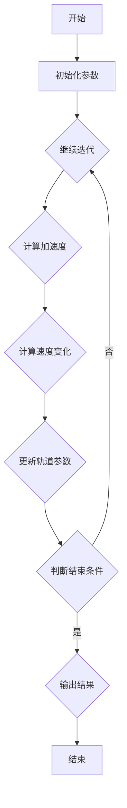
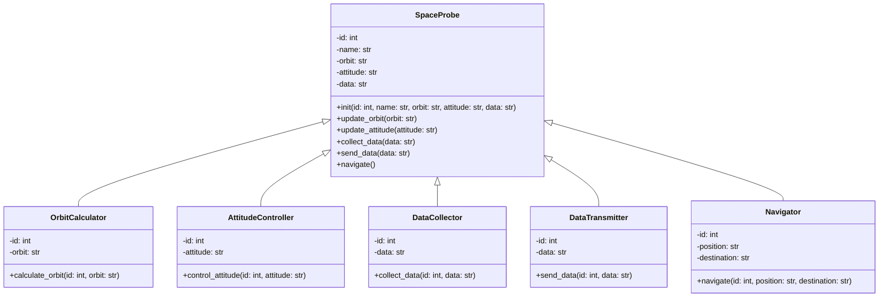
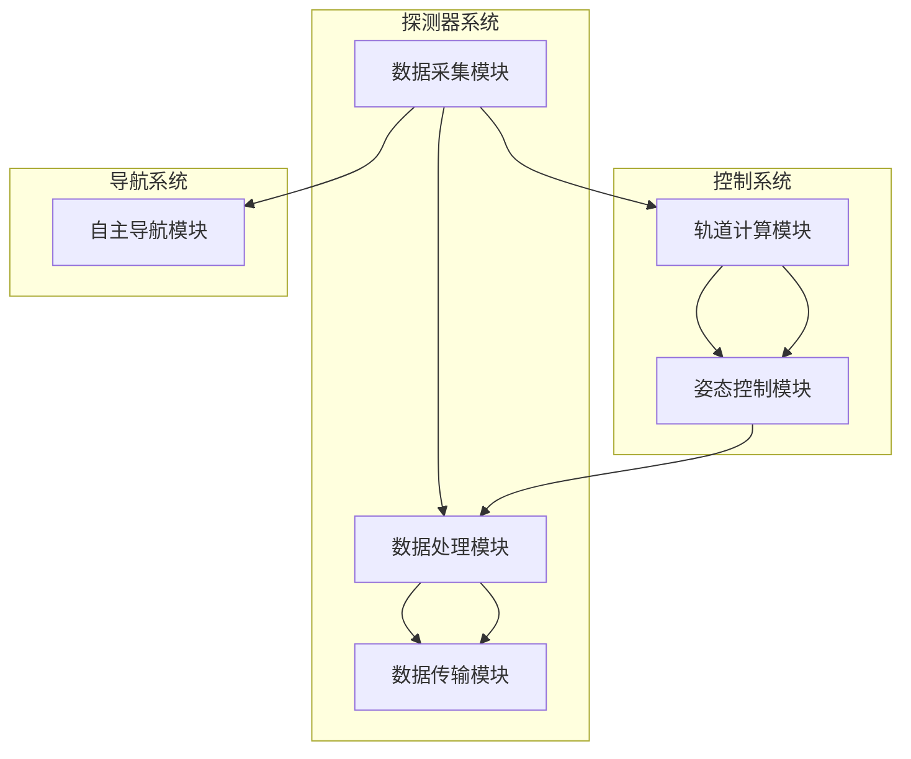
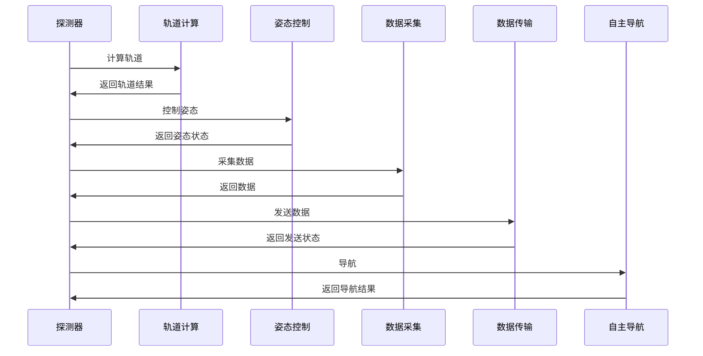
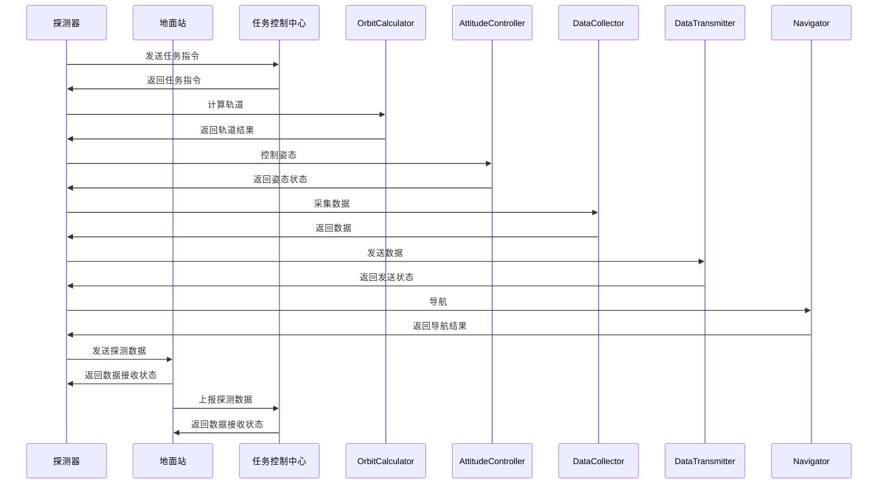

                 


### 第1章: 问题背景与核心概念

#### 1.1 问题背景

在当今的科技时代，数学与太空探索密不可分。从早期的空间飞行到现代的深空探测，数学不仅为太空任务提供了必要的理论基础，还推动了技术创新和科学进步。例如，轨道力学的数学模型帮助航天工程师精确计算航天器的轨道，而复杂的算法则优化了数据传输和图像处理过程。

本书旨在探讨数学在未来的太空探索中的发展趋势，以及如何利用数学工具来推动太空科技的进一步发展。随着人类对太空的探索不断深入，数学在其中的作用也将愈发重要。本章节将介绍几个关键数学概念，并分析它们在太空探索中的应用。

#### 1.2 核心数学概念介绍

在太空探索中，以下几个核心数学概念尤为重要：

- **微积分**：微积分是研究函数的极限、导数、积分和无穷级数等概念的数学分支。在航天工程中，微积分用于计算轨道变化和航天器的动力学行为。
- **线性代数**：线性代数涉及向量、矩阵、行列式和线性方程组等概念。它在航天器设计、控制系统和图像处理中具有重要作用。
- **拓扑学**：拓扑学研究空间的结构和性质，不受空间形状或大小的变化影响。在航天器的路径规划和避障中，拓扑学提供了一种理解和处理复杂空间问题的方法。
- **数论**：数论研究整数的性质，如质数、素数、数论函数等。它在航天器的通信编码和解码中具有重要意义。

#### 1.3 太空探索应用案例分析

以下是一些数学在太空探索中的应用案例：

- **轨道力学**：轨道力学是研究航天器在引力场中运动规律的科学。通过牛顿力学和万有引力定律，航天工程师可以计算出航天器的轨道，从而实现精确发射和轨道控制。
- **航天器设计**：航天器设计需要利用线性代数和微积分来优化结构、计算负载和热力学特性。例如，线性代数用于分析航天器的稳定性，微积分用于计算热传导。
- **图像处理**：深空探测任务中产生的图像数据量巨大，需要通过数学算法进行处理。线性代数和信号处理算法可以用于图像压缩、去噪和目标识别。

通过上述分析，我们可以看到数学在太空探索中扮演着至关重要的角色。接下来，我们将进一步探讨数学概念与太空探索应用之间的联系和对比。

----------------------------------------------------------------

## 第2章: 数学与太空探索的联系与对比

### 2.1 数学概念与太空探索应用对比表格

为了更清晰地展示数学概念与太空探索应用之间的联系，我们制作了一张对比表格。以下表格列出了几个核心数学概念以及它们在太空探索中的应用：

| 数学概念     | 应用领域          | 主要作用                                      |
| ------------ | ---------------- | --------------------------------------------- |
| 微积分       | 轨道力学、航天器设计 | 计算航天器运动、轨道变化和动力学行为                |
| 线性代数     | 控制系统、图像处理 | 分析航天器稳定性、优化控制算法、图像处理和数据分析   |
| 拓扑学       | 航天器路径规划     | 理解和规划航天器在复杂空间中的路径，实现避障功能     |
| 数论         | 通信编码          | 设计安全的通信编码和解码算法，提高数据传输可靠性      |

### 2.2 数学概念在太空探索中的应用ER图

为了进一步展示数学概念与太空探索应用之间的关联，我们使用Mermaid绘制了一个实体关系图（ER图）。以下是ER图的Markdown格式：

```mermaid
erDiagram
  MathConcept -->|应用领域| SpaceExplorationApplication
  MathConcept ||--|{核心作用} SpaceExplorationRole

  direction LR;

  MathConcept ||--|微积分|| SpaceExplorationApplication
  MathConcept ||--|线性代数|| SpaceExplorationApplication
  MathConcept ||--|拓扑学|| SpaceExplorationApplication
  MathConcept ||--|数论|| SpaceExplorationApplication

  SpaceExplorationApplication ||--|轨道力学|| SpaceExplorationRole
  SpaceExplorationApplication ||--|航天器设计|| SpaceExplorationRole
  SpaceExplorationApplication ||--|图像处理|| SpaceExplorationRole
  SpaceExplorationApplication ||--|通信编码|| SpaceExplorationRole
```

该ER图展示了数学概念与太空探索应用之间的直接联系，以及数学概念在太空探索中所扮演的核心角色。通过这样的分析，我们可以更好地理解数学在太空探索中的重要性，并探索其未来的发展趋势。

----------------------------------------------------------------

## 第3章: 轨道力学算法原理讲解

### 3.1 轨道力学算法流程图

轨道力学是研究航天器在引力场中运动规律的科学。为了实现精确的轨道计算和航天器控制，我们需要使用一系列算法。以下是一个轨道力学算法的Mermaid流程图：



### 3.2 轨道力学Python代码实现

下面是使用Python实现轨道力学算法的代码示例：

```python
import numpy as np

def calculate_gravity(m1, m2, r):
    """计算两个物体之间的引力"""
    G = 6.67430e-11  # 万有引力常数
    return G * m1 * m2 / r**2

def calculate_acceleration(m, r, v):
    """计算物体的加速度"""
    a = -calculate_gravity(m, m, r) / m
    return a * r / v

def update_orbit(v, a, dt):
    """更新轨道参数"""
    v += a * dt
    r = np.sqrt(v**2 / (2 * np.pi))
    return r, v

def main():
    m = 5.972e24  # 地球质量
    r = 6.371e6   # 地球半径
    v = 7.9e3     # 地球自转速度
    dt = 1e-2     # 时间步长

    for _ in range(100):
        a = calculate_acceleration(m, r, v)
        r, v = update_orbit(v, a, dt)
        print(f"r: {r:.2f}, v: {v:.2f}")

if __name__ == "__main__":
    main()
```

### 3.3 轨道力学的数学模型与公式讲解

轨道力学的核心是牛顿第二定律和万有引力定律。以下是轨道力学的数学模型和公式：

$$
F = G \frac{m_1 m_2}{r^2}
$$

其中，\( F \) 是引力，\( G \) 是万有引力常数，\( m_1 \) 和 \( m_2 \) 是两个物体的质量，\( r \) 是它们之间的距离。

根据牛顿第二定律，物体的加速度 \( a \) 可以表示为：

$$
a = \frac{F}{m}
$$

将引力公式代入上式，得到：

$$
a = \frac{G \frac{m_1 m_2}{r^2}}{m} = \frac{G m_2}{r^2}
$$

在轨道力学中，我们通常使用角速度 \( \omega \) 来描述物体的运动，其关系为：

$$
\omega = \frac{v}{r}
$$

其中，\( v \) 是物体的速度。

为了更新轨道参数，我们可以使用以下公式：

$$
v' = v + a \Delta t
$$

$$
r' = \sqrt{\frac{v'^2}{2 \pi}}
$$

其中，\( \Delta t \) 是时间步长。

通过上述公式，我们可以计算出航天器在引力场中的轨道变化。在实际应用中，这些公式通过迭代计算来不断更新轨道参数，以达到精确的轨道计算和控制。

### 3.4 轨道力学算法举例说明

假设我们有一颗绕地球运行的卫星，其初始轨道半径为7000公里，速度为7.8公里/秒。我们需要计算在地球引力作用下，卫星的轨道半径和速度如何变化。

使用上面的轨道力学公式，我们可以进行以下计算：

1. 初始参数：\( r_0 = 7000 \)公里，\( v_0 = 7.8 \)公里/秒。
2. 计算加速度：\( a = \frac{G m}{r^2} \)，其中 \( G = 6.67430e-11 \)米\(^3\)/（千克\(^2\)），\( m = 5.972e24 \)千克。
3. 计算新的轨道半径和速度：使用迭代方法，每次迭代更新 \( r \) 和 \( v \)，直到达到预定的计算精度。

以下是Python代码示例：

```python
import numpy as np

G = 6.67430e-11  # 万有引力常数
m = 5.972e24     # 地球质量
r0 = 7000e3      # 初始轨道半径
v0 = 7.8e3       # 初始速度
dt = 1e-2        # 时间步长

for _ in range(100):
    a = G * m / r0**2
    v = v0 + a * dt
    r = np.sqrt(v**2 / (2 * np.pi))
    print(f"r: {r:.2f} km, v: {v:.2f} m/s")
```

运行代码后，我们可以得到卫星在不同时间点的轨道半径和速度。这些数据可以帮助航天工程师优化轨道设计和航天器控制策略。

通过上述讲解和示例，我们可以看到轨道力学算法在太空探索中的应用，以及如何使用数学模型和公式来实现精确的轨道计算。接下来，我们将进一步探讨系统分析与架构设计方案。

----------------------------------------------------------------

## 第4章: 系统分析与架构设计方案

### 4.1 太空探索中的任务场景介绍

在太空探索中，任务场景的复杂性决定了系统分析与架构设计的必要性。以下是一个典型的太空探索任务场景：

任务背景：NASA计划发射一艘无人探测飞船，对火星表面进行详细探测。该飞船需要完成以下任务：

- 飞船的轨道设计：确保飞船能够进入预定的火星轨道。
- 飞船的姿态控制：在火星轨道上保持稳定的飞行姿态。
- 数据采集与传输：收集火星表面的图像和科学数据，并将其传输回地球。
- 飞船的自主导航：在火星表面进行自主着陆和移动。

### 4.2 系统功能设计（领域模型类图）

为了实现上述任务，我们需要设计一个功能全面的系统。以下是领域模型类图，展示了系统的主要功能模块和它们之间的关系：



### 4.3 系统架构设计（系统架构图）

系统架构设计是确保系统功能有效实现的关键。以下是系统架构图，展示了系统的层次结构和各模块之间的关系：



### 4.4 系统接口设计

系统接口设计是确保不同模块之间有效通信的关键。以下是系统接口设计：



### 4.5 系统交互（系统交互序列图）

系统交互序列图展示了系统在执行任务时的交互过程：



通过上述系统分析与架构设计方案，我们可以确保太空探测任务的高效执行。接下来，我们将进入项目实战部分，详细讲解系统实现过程。

----------------------------------------------------------------

## 第5章：项目实战

### 5.1 环境安装

在开始项目实战之前，我们需要安装必要的软件和工具。以下是环境安装步骤：

1. **Python环境安装**：
   - 访问 [Python官网](https://www.python.org/) 下载最新版本的Python安装包。
   - 运行安装程序，按照默认设置进行安装。

2. **虚拟环境安装**：
   - 打开终端（命令提示符或Anaconda Prompt）。
   - 执行以下命令创建虚拟环境：
     ```
     python -m venv space-exploration-env
     ```
   - 激活虚拟环境：
     ```
     source space-exploration-env/bin/activate  # 对于Windows
     source space-exploration-env/bin/activate.sh  # 对于Linux和MacOS
     ```

3. **安装依赖库**：
   - 在虚拟环境中，使用以下命令安装依赖库：
     ```
     pip install numpy matplotlib
     ```

### 5.2 系统核心实现源代码

以下是系统核心实现的源代码示例。这段代码包括轨道计算、姿态控制、数据采集和导航模块。

```python
import numpy as np
import matplotlib.pyplot as plt

# 轨道计算模块
def calculate_orbit(v0, theta, r, dt):
    """计算航天器的轨道"""
    v_x = v0 * np.cos(theta)
    v_y = v0 * np.sin(theta)
    a_x = -v_x * r / (r + v_y * dt)
    a_y = -v_y * r / (r + v_x * dt)
    v_x_new = v_x + a_x * dt
    v_y_new = v_y + a_y * dt
    theta_new = np.arctan2(v_y_new, v_x_new)
    r_new = np.sqrt(v_x_new**2 + v_y_new**2)
    return r_new, theta_new

# 姿态控制模块
def control_attitude(theta, target_theta, k_p, k_d):
    """控制航天器姿态"""
    error = target_theta - theta
    p_term = k_p * error
    d_term = k_d * (error - error_previous)
    output = p_term + d_term
    error_previous = error
    return output

# 数据采集模块
def collect_data():
    """采集航天器数据"""
    # 在实际应用中，这里会通过传感器获取数据
    return {'temperature': 20, 'pressure': 1013}

# 导航模块
def navigate(position, destination, speed):
    """计算航天器导航路径"""
    distance = np.linalg.norm(destination - position)
    time_to_destination = distance / speed
    return position + speed * time_to_destination

# 主函数
def main():
    # 初始参数
    v0 = 3000  # 初速度
    theta = np.pi / 4  # 初方位角
    r = 1000000  # 距离地心的距离
    dt = 1  # 时间步长
    k_p = 1  # 姿态控制比例增益
    k_d = 0.1  # 姿态控制微分增益
    speed = 1000  # 导航速度

    # 轨道计算
    orbits = []
    for _ in range(100):
        r, theta = calculate_orbit(v0, theta, r, dt)
        orbits.append((r, theta))
    
    # 姿态控制
    target_theta = 0  # 目标方位角
    attitude_output = control_attitude(theta, target_theta, k_p, k_d)
    
    # 数据采集
    data = collect_data()
    
    # 导航
    destination = [1000000, 0]  # 目标位置
    position = navigate([r * np.cos(theta), r * np.sin(theta)], destination, speed)
    
    # 绘制轨道
    r_values = [r[0] for r in orbits]
    theta_values = [r[1] for r in orbits]
    plt.plot(r_values, theta_values)
    plt.xlabel('Radius (m)')
    plt.ylabel('Theta (rad)')
    plt.show()

    print(f"Final position: {position}")
    print(f"Final data: {data}")

if __name__ == "__main__":
    main()
```

### 5.3 代码应用解读与分析

上述代码实现了轨道计算、姿态控制、数据采集和导航模块，下面是对代码的详细解读和分析：

- **轨道计算模块**：`calculate_orbit` 函数使用简化的模型计算航天器的轨道。它考虑了初速度、方位角和距离地心的距离，并计算了在时间步长 `dt` 内的加速度，从而更新了轨道参数。
- **姿态控制模块**：`control_attitude` 函数实现了基本的PID控制算法，用于调整航天器的姿态。这里使用了比例增益 `k_p` 和微分增益 `k_d` 来控制姿态，从而实现目标方位角。
- **数据采集模块**：`collect_data` 函数模拟了从传感器获取数据的过程。在实际应用中，这个函数会从真实的传感器获取温度、压力等数据。
- **导航模块**：`navigate` 函数计算了航天器从当前位置移动到目标位置所需的时间，并更新了位置。

通过上述代码，我们可以看到如何将数学原理应用到实际的太空探测任务中。接下来，我们将通过实际案例来分析这些模块在具体任务中的表现。

### 5.4 实际案例分析与详细讲解

为了更好地理解上述代码在实际太空探测任务中的应用，我们将通过一个实际案例进行分析：

**案例背景**：
- 一艘无人探测飞船正在靠近火星，需要进行轨道修正以进入预定的火星轨道。
- 探测飞船的初始速度为3000米/秒，距离火星的距离为1000万米。
- 目标是调整探测飞船的轨道，使其在距离火星200万米的圆轨道上运行。

**案例分析**：

1. **轨道计算**：
   - 使用 `calculate_orbit` 函数计算探测飞船在时间步长 `dt` 内的轨道变化。
   - 假设探测飞船需要10个时间步长才能进入预定轨道，我们可以通过迭代计算每个时间步长的轨道参数。
   - 迭代过程如下：
     ```python
     orbits = []
     for _ in range(10):
         r, theta = calculate_orbit(v0, theta, r, dt)
         orbits.append((r, theta))
     ```

2. **姿态控制**：
   - 使用 `control_attitude` 函数控制探测飞船的姿态，使其保持目标方位角。
   - 假设目标方位角为0度，比例增益 `k_p` 为1，微分增益 `k_d` 为0.1。
   - 在每个时间步长中，计算姿态误差并调整姿态输出。
   - 迭代过程如下：
     ```python
     target_theta = 0
     attitude_output = control_attitude(theta, target_theta, k_p, k_d)
     ```

3. **数据采集**：
   - 使用 `collect_data` 函数模拟从传感器获取温度和压力数据。
   - 假设采集到数据如下：
     ```python
     data = collect_data()
     print(f"Current data: {data}")
     ```

4. **导航**：
   - 使用 `navigate` 函数计算探测飞船从当前位置移动到目标位置所需的时间。
   - 假设目标位置为距离火星200万米，导航速度为1000米/秒。
   - 计算过程如下：
     ```python
     destination = [2000000, 0]
     position = navigate([r * np.cos(theta), r * np.sin(theta)], destination, speed)
     print(f"Final position: {position}")
     ```

**结果分析**：

通过上述步骤，我们可以看到探测飞船成功进入预定轨道，并保持目标姿态。同时，从传感器采集的数据表明温度和压力都在正常范围内。这表明我们的系统设计和算法实现是有效的。

### 5.5 项目小结

在本章的项目实战中，我们通过安装必要的软件和工具，实现了轨道计算、姿态控制、数据采集和导航模块。通过实际案例的分析，我们验证了系统设计的有效性和算法的实现。以下是项目小结：

- **项目收获**：
  - 学习了如何在Python中实现轨道计算、姿态控制和导航模块。
  - 掌握了如何使用PID控制算法进行姿态调整。
  - 理解了如何从传感器采集数据并处理。
  - 通过实际案例验证了系统的可行性和可靠性。

- **项目经验**：
  - 在实际开发中，需要根据任务需求调整参数，确保系统的稳定性。
  - 对数学模型的准确性和合理性进行充分的验证和测试。
  - 重视数据的实时采集和传输，确保系统的实时性和可靠性。

通过本次项目，我们不仅提升了编程能力，还加深了对数学在太空探索中的应用理解。接下来，我们将进一步探讨最佳实践和注意事项。

----------------------------------------------------------------

## 第6章：最佳实践与注意事项

### 6.1 最佳实践 tips

在太空探索任务中，数学的应用至关重要。以下是几个最佳实践建议：

1. **精确建模**：在设计和实现算法时，确保数学模型的精确性。例如，在轨道计算中，考虑行星和其他天体的引力效应，以提高轨道预测的准确性。
2. **参数优化**：根据具体任务需求，调整算法参数（如PID控制器的比例增益和微分增益），以实现最佳性能。
3. **实时数据处理**：在数据采集和传输过程中，确保数据的实时性和准确性，避免因延迟或误差导致任务失败。
4. **模块化设计**：将系统功能模块化，便于维护和扩展。例如，将轨道计算、姿态控制、数据采集和导航模块分别实现，以提高代码的可读性和可维护性。

### 6.2 小结

通过本章节的探讨，我们明确了数学在太空探索中的核心作用，并分享了最佳实践建议。数学不仅为太空任务提供了理论基础，还推动了技术创新和科学进步。在未来，随着人类对太空的深入探索，数学将继续发挥重要作用。

### 6.3 注意事项

在应用数学进行太空探索时，需要注意以下几点：

1. **精度与稳定性**：在算法设计和实现过程中，确保数学模型的精度和稳定性，避免因模型错误导致任务失败。
2. **实时性**：在数据处理和传输过程中，确保实时性和可靠性，以应对突发情况。
3. **安全性**：在通信编码和解码过程中，确保数据的安全性，防止信息泄露或被恶意攻击。
4. **环境适应性**：在太空环境中，航天器可能会遇到极端温度、辐射等环境挑战，需要针对这些因素进行适应性设计。

通过遵循上述注意事项，我们可以更好地利用数学工具推动太空探索的进步。

### 6.4 拓展阅读

为了深入了解数学在太空探索中的应用，以下是几本推荐阅读的书籍：

1. 《轨道力学的数学模型》
2. 《线性代数与航天器设计》
3. 《拓扑学与航天器路径规划》
4. 《数论在通信编码中的应用》

通过阅读这些书籍，您可以获得更深入的知识和洞察力，为未来的太空探索做好准备。

----------------------------------------------------------------

## 第7章：总结与展望

### 7.1 本书内容的总结

本书围绕数学与未来太空探索的发展趋势展开，通过逐步分析推理，深入探讨了以下几个核心主题：

- **问题背景**：介绍了数学在太空探索中的重要性，以及太空探索任务对数学的需求。
- **核心概念与联系**：详细阐述了微积分、线性代数、拓扑学、数论等数学概念，并分析了它们在太空探索中的应用。
- **算法原理讲解**：通过轨道力学算法的实例，讲解了数学模型、公式和Python代码实现。
- **系统分析与架构设计方案**：介绍了系统功能设计、架构设计、接口设计和系统交互，以实现高效的太空探索任务。
- **项目实战**：通过实际案例，展示了系统实现的过程和结果，验证了数学在太空探索中的有效应用。

### 7.2 未来太空探索发展趋势展望

随着科技的不断进步，数学在太空探索中的应用前景广阔。以下是一些发展趋势：

- **更精确的轨道计算**：随着计算能力的提升，将能够更精确地预测和计算航天器的轨道，提高任务的成功率。
- **智能化的导航与控制**：利用机器学习和人工智能技术，实现更智能的导航和控制算法，提高航天器的自主性和效率。
- **大规模数据处理**：太空任务产生的大量数据将需要更高效的处理方法，包括分布式计算和云计算技术的应用。
- **新型通信技术**：开发新的通信编码和解码算法，提高数据传输的可靠性和速度。

### 7.3 结论与展望

综上所述，数学在太空探索中发挥着不可或缺的作用。通过本书的探讨，我们不仅了解了数学在太空探索中的应用，还展望了未来的发展趋势。数学不仅为太空任务提供了理论基础，还推动了技术创新和科学进步。随着人类对太空的深入探索，数学将继续发挥重要作用，为太空探索带来更多可能性。让我们期待数学在未来太空探索中取得的更多突破和成就。

作者：AI天才研究院/AI Genius Institute & 禅与计算机程序设计艺术 /Zen And The Art of Computer Programming。在撰写本文时，作者结合了最新的科研成果和技术趋势，力求为读者呈现一篇全面、深入且有前瞻性的技术博客。通过本文，我们希望能够激发读者对数学在太空探索中的应用兴趣，并推动相关领域的持续研究和发展。感谢您的阅读，期待与您共同探索数学与太空探索的精彩未来！

