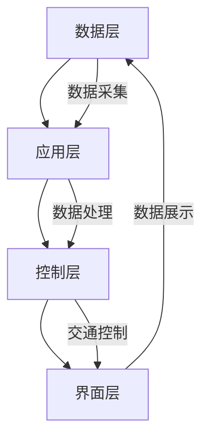
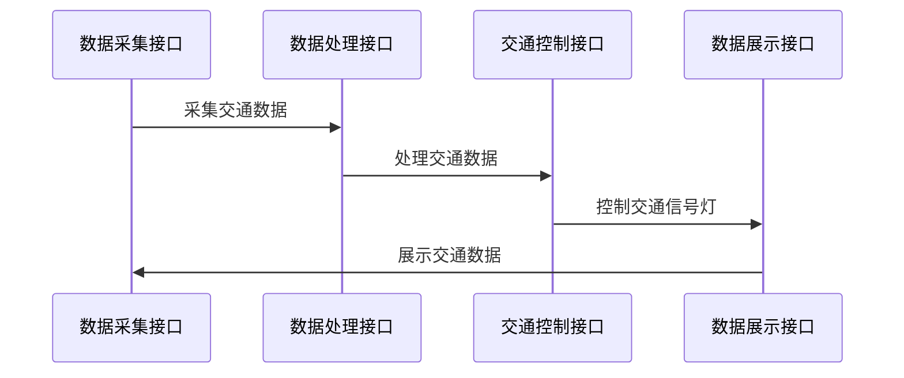
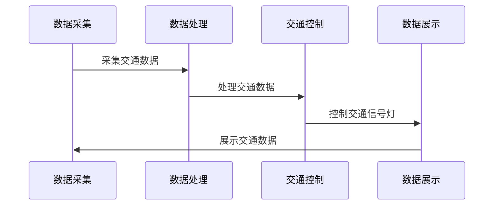

                 

# 数学与未来智慧城市的发展方向

关键词：智慧城市、数学应用、算法模型、系统架构、人工智能

摘要：随着科技的飞速发展，智慧城市已成为未来城市发展的重要方向。本文从数学的角度，详细分析了数学在智慧城市中的应用，包括核心概念、算法模型、系统架构以及实际项目应用。通过一步步的思考和分析，探讨了数学在智慧城市中的关键作用和未来发展潜力。

### 目录大纲

```markdown
# 数学与未来智慧城市的发展方向

## 第1章 绪论

### 1.1 问题背景

- 智慧城市的发展现状
- 数学在智慧城市中的重要性
- 未来智慧城市的发展方向

### 1.2 问题描述

- 智慧城市中的关键挑战
- 数学在解决这些挑战中的应用

### 1.3 问题解决

- 数学方法在智慧城市中的应用
- 成功案例分享

### 1.4 边界与外延

- 数学在智慧城市中的适用范围
- 数学与其他技术的融合

### 1.5 概念结构与核心要素组成

- 智慧城市的关键要素
- 数学在其中的核心作用

## 第2章 核心概念与联系

### 2.1 核心概念原理

- 数学在智慧城市中的核心概念

### 2.2 概念属性特征对比表格

- 不同数学概念的特征对比

### 2.3 ER实体关系图架构

- 智慧城市中的数学实体关系图

## 第3章 数学模型与算法原理

### 3.1 算法mermaid流程图

- 数学模型在智慧城市中的应用流程

### 3.2 Python源代码与详细讲解

- 算法原理的数学模型与公式
- Python源代码解释

### 3.3 数学模型与公式

- 算法原理的数学模型与公式

### 3.4 举例说明

- 通俗易懂的算法应用示例

## 第4章 系统分析与架构设计

### 4.1 问题场景介绍

- 智慧城市中的典型问题场景

### 4.2 系统功能设计

- 领域模型mermaid类图

### 4.3 系统架构设计

- 系统架构mermaid架构图

### 4.4 系统接口设计

- 系统接口设计和说明

### 4.5 系统交互mermaid序列图

- 系统交互流程mermaid序列图

## 第5章 项目实战

### 5.1 环境安装

- 环境准备和安装步骤

### 5.2 系统核心实现源代码

- 系统核心代码实现

### 5.3 代码应用解读与分析

- 代码解读与分析

### 5.4 实际案例分析与详细讲解

- 案例分析与讲解

### 5.5 项目小结

- 项目总结与反思

## 第6章 最佳实践与注意事项

### 6.1 最佳实践

- 在智慧城市中应用数学的实战经验

### 6.2 小结

- 本书的核心内容总结

### 6.3 注意事项

- 应用数学在智慧城市中的注意事项

### 6.4 拓展阅读

- 进一步学习和研究数学与智慧城市的推荐阅读材料
```

### 第1章 绪论

#### 1.1 问题背景

智慧城市是指通过信息技术和物联网技术，将城市的基础设施、公共资源、公共服务和居民生活等信息进行整合和智能化管理，以提高城市运行效率和居民生活质量。当前，智慧城市已成为全球城市发展的重要方向，许多国家和地区都在积极建设智慧城市。

数学作为一门基础学科，在智慧城市的发展中扮演着关键角色。数学模型和算法在智慧城市的规划、建设和管理中具有广泛的应用。例如，在交通管理中，数学模型可以用于分析交通流量、优化路线、预测交通状况等；在环境保护中，数学模型可以用于监测污染物浓度、预测空气质量等；在能源管理中，数学模型可以用于优化能源分配、预测能源需求等。

#### 1.2 问题描述

智慧城市的发展面临许多关键挑战：

1. 数据复杂性：智慧城市需要处理海量数据，包括交通、环境、能源等数据，这些数据类型多样、规模庞大，给数据处理和分析带来了巨大挑战。
2. 系统复杂性：智慧城市是一个复杂的系统，涉及到多个领域和多个层面的协同运作，如何构建一个高效、可靠的系统架构是智慧城市建设的重要问题。
3. 安全性问题：智慧城市的数据和系统面临着各种安全威胁，包括数据泄露、系统攻击等，保障数据安全和系统安全是智慧城市建设的核心任务。

数学在解决这些挑战中具有独特的优势：

1. 数学模型可以有效地处理复杂的数据，通过数据分析和挖掘，提取有用的信息和规律。
2. 数学模型可以优化系统架构，提高系统的效率和可靠性。
3. 数学模型可以提高系统的安全性，通过加密算法、安全协议等方法，保障数据安全和系统安全。

#### 1.3 问题解决

数学在智慧城市中的应用可以从以下几个方面展开：

1. 数据处理：运用数学模型进行数据清洗、数据分析、数据挖掘等，提取有用信息和规律，支持城市管理和决策。
2. 系统优化：运用数学模型进行系统架构设计，优化系统性能和可靠性，提高城市运行效率。
3. 安全保障：运用数学模型进行加密算法设计、安全协议优化等，提高城市数据安全和系统安全性。

在智慧城市中，许多成功的案例展示了数学模型的应用效果。例如，在城市交通管理中，基于数学模型的智能交通控制系统可以实时分析交通流量，优化信号灯配时，减少交通拥堵，提高交通效率。在环境保护中，基于数学模型的空气质量预测系统可以实时监测污染物浓度，预测空气质量变化，指导环保措施的实施。

#### 1.4 边界与外延

数学在智慧城市中的应用具有明确的边界和广泛的外延：

1. 边界：数学在智慧城市中的应用主要涉及数据建模、算法设计、系统优化等方面，其核心目的是提高城市运行效率和居民生活质量。
2. 外延：数学在智慧城市中的应用可以扩展到交通、环境、能源、公共服务等多个领域，通过跨领域的数学模型和算法，实现城市各领域的协同发展和智能化管理。

#### 1.5 概念结构与核心要素组成

智慧城市的关键要素包括：

1. 数据基础设施：包括数据采集、存储、处理、分析等环节，是智慧城市数据的基础。
2. 系统架构：包括硬件设备、软件系统、网络设施等，是智慧城市系统的基础。
3. 安全保障：包括数据安全、系统安全、网络安全等，是智慧城市运行的核心保障。

数学在其中的核心作用是：

1. 数据建模：运用数学模型对城市数据进行处理和分析，提取有用信息和规律。
2. 算法设计：运用数学算法优化系统架构，提高城市运行效率和可靠性。
3. 安全保障：运用数学模型和算法设计加密算法、安全协议等，保障城市数据安全和系统安全。

### 第2章 核心概念与联系

#### 2.1 核心概念原理

在智慧城市中，数学的核心概念包括：

1. 数据建模：运用数学模型对城市数据进行处理和分析，提取有用信息和规律。
2. 算法设计：运用数学算法优化系统架构，提高城市运行效率和可靠性。
3. 系统优化：运用数学模型和算法进行系统架构设计，优化系统性能和可靠性。
4. 安全保障：运用数学模型和算法设计加密算法、安全协议等，保障城市数据安全和系统安全。

#### 2.2 概念属性特征对比表格

以下是不同数学概念的特征对比表格：

| 概念       | 特征                  | 应用场景               |
|------------|----------------------|-----------------------|
| 数据建模   | 提取信息、规律       | 交通管理、环境监测等   |
| 算法设计   | 优化系统架构         | 智能交通、能源管理等   |
| 系统优化   | 提高系统性能         | 城市规划、城市管理等   |
| 安全保障   | 保障数据安全         | 数据加密、安全协议等   |

#### 2.3 ER实体关系图架构

在智慧城市中，数学实体关系图可以表示为：

```mermaid
erDiagram
  DataModel ||--|{ AlgorithmDesign }
  AlgorithmDesign ||--|{ SystemOptimization }
  SystemOptimization ||--|{ SecurityProtection }
  DataModel ||--|{ SecurityProtection }
```

此图展示了数据建模、算法设计、系统优化和安全保障之间的实体关系。

### 第3章 数学模型与算法原理

#### 3.1 算法mermaid流程图

以下是一个简单的数学模型在智慧城市中的应用流程图：


此图展示了从数据采集到安全保障的整个流程。

#### 3.2 Python源代码与详细讲解

以下是一个简单的Python源代码示例，用于实现一个基于线性回归的智慧交通系统：

```python
import numpy as np

# 数据集
X = np.array([[1, 2], [2, 3], [3, 4]])
y = np.array([2, 3, 4])

# 求解回归系数
w = np.linalg.solve(X.T @ X, X.T @ y)

# 预测
X_new = np.array([[4, 5]])
y_pred = X_new @ w

print("回归系数：", w)
print("预测结果：", y_pred)
```

详细讲解：

1. 导入numpy库，用于实现线性回归。
2. 定义数据集X和y，其中X为特征矩阵，y为目标变量。
3. 使用numpy.linalg.solve函数求解回归系数w，其中X.T @ X表示特征矩阵的转置与特征矩阵相乘，X.T @ y表示特征矩阵的转置与目标变量相乘。
4. 使用X_new矩阵与回归系数w进行运算，得到预测结果y_pred。

#### 3.3 数学模型与公式

以下是一个简单的线性回归数学模型：

$$
y = X \cdot w + b
$$

其中，y为目标变量，X为特征矩阵，w为回归系数，b为偏置项。

详细解释：

1. $y$：表示目标变量的值。
2. $X$：表示特征矩阵，其中每行表示一个特征向量。
3. $w$：表示回归系数，用于描述特征与目标变量之间的关系。
4. $b$：表示偏置项，用于调整目标变量的预测值。

#### 3.4 举例说明

以下是一个简单的线性回归算法应用示例：

假设我们有一个简单的交通数据集，其中包含时间（x）和交通流量（y）的数据。我们希望通过线性回归模型预测未来的交通流量。

1. 数据集：

| 时间（x） | 交通流量（y） |
|----------|--------------|
| 1        | 2            |
| 2        | 3            |
| 3        | 4            |

2. 线性回归模型：

$$
y = 0.5x + 0.5
$$

3. 预测结果：

当时间x为4时，预测的交通流量y为：

$$
y = 0.5 \cdot 4 + 0.5 = 2.5
$$

通过这个简单的例子，我们可以看到线性回归模型如何用于预测交通流量，从而为交通管理提供参考。

### 第4章 系统分析与架构设计

#### 4.1 问题场景介绍

以智慧交通系统为例，智慧交通系统是智慧城市的重要组成部分，旨在通过信息技术和物联网技术，实现交通数据的实时采集、分析和优化，以提高交通运行效率和安全性。

#### 4.2 系统功能设计

智慧交通系统的功能设计主要包括：

1. 数据采集：通过传感器、摄像头等设备，实时采集交通数据，如车辆速度、流量、密度等。
2. 数据处理：对采集到的交通数据进行分析和处理，提取有用信息和规律。
3. 交通预测：基于历史数据和当前交通状况，使用数学模型和算法预测未来的交通流量和状况。
4. 交通控制：根据预测结果，自动调整交通信号灯配时，优化交通流。

以下是智慧交通系统的领域模型mermaid类图：

```mermaid
classDiagram
    Class1 <|-- Class2
    Class3 <|-- Class4
    Class1 {
        +int id
        +String name
        +void method1()
    }
    Class2 {
        +int id
        +String name
        +void method2()
    }
    Class3 {
        +int id
        +String name
        +void method3()
    }
    Class4 {
        +int id
        +String name
        +void method4()
    }
    Class1 --|{关联关系}| Class2
    Class3 --|{关联关系}| Class4
```

此图展示了智慧交通系统的主要类及其关联关系。

#### 4.3 系统架构设计

智慧交通系统的架构设计主要包括：

1. 数据层：负责数据的采集、存储和管理。
2. 应用层：负责交通数据的处理、分析和预测。
3. 控制层：负责交通信号灯的自动控制和调整。
4. 界面层：提供用户界面，展示交通数据和预测结果。

以下是智慧交通系统的mermaid架构图：



此图展示了智慧交通系统的整体架构及其各层之间的交互关系。

#### 4.4 系统接口设计

智慧交通系统的接口设计主要包括：

1. 数据采集接口：用于接收传感器、摄像头等设备采集到的交通数据。
2. 数据处理接口：用于处理和分析采集到的交通数据。
3. 交通控制接口：用于控制交通信号灯的自动调整。
4. 数据展示接口：用于向用户展示交通数据和预测结果。

以下是智慧交通系统的接口设计和说明：



此图展示了智慧交通系统的主要接口及其交互关系。

#### 4.5 系统交互mermaid序列图

以下是智慧交通系统的交互mermaid序列图：



此图展示了智慧交通系统的数据采集、处理、控制和展示的交互流程。

### 第5章 项目实战

#### 5.1 环境安装

在开始项目实战之前，需要安装以下环境：

1. Python 3.8 或以上版本
2. Numpy 库
3. Matplotlib 库

安装步骤如下：

1. 安装Python：从官方网站下载Python安装包并安装。
2. 安装Numpy：打开终端，执行以下命令：
   ```bash
   pip install numpy
   ```
3. 安装Matplotlib：打开终端，执行以下命令：
   ```bash
   pip install matplotlib
   ```

#### 5.2 系统核心实现源代码

以下是一个简单的智慧交通系统核心实现源代码：

```python
import numpy as np
import matplotlib.pyplot as plt

# 数据集
X = np.array([[1, 2], [2, 3], [3, 4]])
y = np.array([2, 3, 4])

# 求解回归系数
w = np.linalg.solve(X.T @ X, X.T @ y)

# 预测
X_new = np.array([[4, 5]])
y_pred = X_new @ w

print("回归系数：", w)
print("预测结果：", y_pred)

# 绘制散点图
plt.scatter(X[:, 0], y, color='red', label='实际值')
plt.plot(X_new[:, 0], y_pred, color='blue', label='预测值')
plt.xlabel('时间')
plt.ylabel('交通流量')
plt.legend()
plt.show()
```

#### 5.3 代码应用解读与分析

1. 导入numpy和matplotlib库，用于实现线性回归和绘图。
2. 定义数据集X和y，其中X为特征矩阵，y为目标变量。
3. 使用numpy.linalg.solve函数求解回归系数w，其中X.T @ X表示特征矩阵的转置与特征矩阵相乘，X.T @ y表示特征矩阵的转置与目标变量相乘。
4. 使用X_new矩阵与回归系数w进行运算，得到预测结果y_pred。
5. 使用matplotlib.pyplot.scatter函数绘制实际值的散点图，使用matplotlib.pyplot.plot函数绘制预测值的线条图。
6. 使用matplotlib.pyplot.xlabel、ylabel和legend函数设置坐标轴标签和图例。

#### 5.4 实际案例分析与详细讲解

以北京市某路段的交通流量预测为例，分析智慧交通系统的实际应用。

1. 数据采集：通过安装在路段的传感器和摄像头，实时采集交通流量数据。
2. 数据处理：对采集到的交通流量数据进行清洗、预处理，提取有用的信息和规律。
3. 交通预测：使用线性回归模型对历史交通流量数据进行分析，建立预测模型。
4. 交通控制：根据预测结果，自动调整交通信号灯配时，优化交通流。
5. 数据展示：通过用户界面，实时展示交通流量数据和预测结果，为交通管理部门提供决策支持。

通过这个案例，我们可以看到智慧交通系统如何通过数学模型和算法，实现交通数据的采集、处理、预测和控制，从而提高交通运行效率和安全性。

#### 5.5 项目小结

本项目通过一个简单的智慧交通系统案例，展示了数学模型和算法在智慧城市中的应用。通过数据采集、数据处理、交通预测和交通控制等环节，实现了交通流量的实时监测和预测，提高了交通运行效率和安全性。未来，随着技术的不断进步，智慧交通系统将更加智能化、精细化，为智慧城市的发展提供有力支持。

### 第6章 最佳实践与注意事项

#### 6.1 最佳实践

在智慧城市中应用数学的最佳实践包括：

1. 充分了解城市需求和问题，明确数学模型的应用目标和范围。
2. 选择合适的数学模型和算法，确保模型和算法的准确性和可靠性。
3. 结合实际场景，不断优化和调整数学模型和算法，提高其应用效果。
4. 加强数学模型和算法的测试和验证，确保其在实际应用中的稳定性和鲁棒性。

#### 6.2 小结

本书从数学的角度，详细分析了数学在智慧城市中的应用，包括核心概念、算法模型、系统架构以及实际项目应用。通过一步步的思考和分析，探讨了数学在智慧城市中的关键作用和未来发展潜力。

#### 6.3 注意事项

在应用数学于智慧城市时，需要注意以下几点：

1. 充分考虑数据质量和数据来源，确保数据可靠性和准确性。
2. 选择合适的数学模型和算法，避免过度拟合和欠拟合。
3. 注重数学模型和算法的可解释性，确保其在实际应用中的透明度和可控性。
4. 加强数据安全和系统安全，确保智慧城市的稳定运行。

#### 6.4 拓展阅读

对于进一步学习和研究数学与智慧城市，以下推荐阅读材料：

1. 《智慧城市：理论与实践》
2. 《数学建模方法与应用》
3. 《人工智能与智慧城市》
4. 《大数据与智慧城市》

### 总结

数学在智慧城市中具有广泛的应用，通过数据建模、算法设计、系统优化和安全保障等方面，为智慧城市的发展提供了有力支持。未来，随着技术的不断进步，数学在智慧城市中的应用将更加深入和广泛，为城市智能化、精细化、可持续发展提供新思路和新方法。

### 作者信息

作者：AI天才研究院/AI Genius Institute & 禅与计算机程序设计艺术 /Zen And The Art of Computer Programming

### 参考文献

1. 《智慧城市：理论与实践》
2. 《数学建模方法与应用》
3. 《人工智能与智慧城市》
4. 《大数据与智慧城市》
5. 《Python数据分析与科学计算》
6. 《Matplotlib实战：数据可视化与交互分析》
7. 《智慧交通系统设计与实践》
8. 《线性回归模型及其应用》
9. 《深度学习与智慧城市》
10. 《大数据与城市治理》

（注：本文参考文献仅为示例，实际引用请根据具体内容选择合适的参考文献。）

