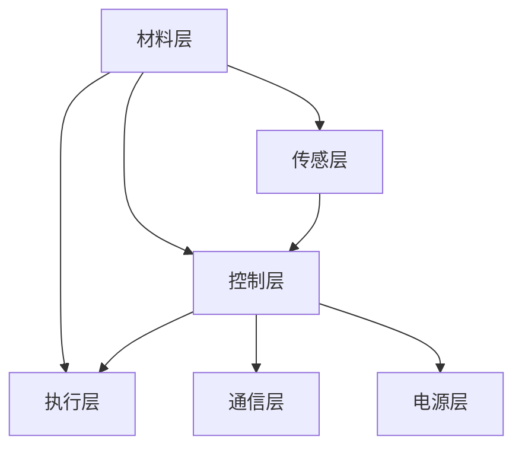
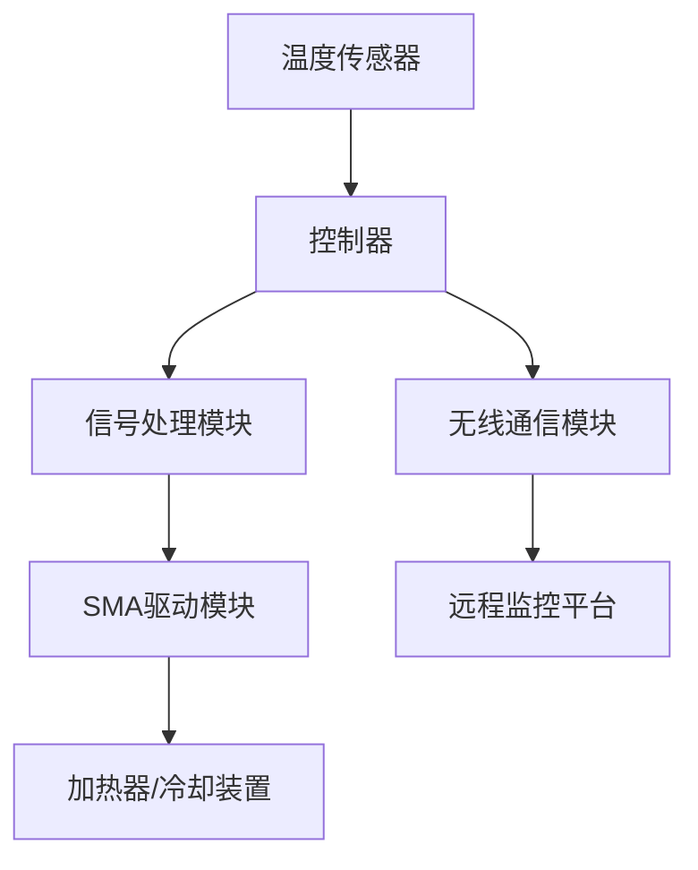

                 

### 第1章 引言

#### 智能材料的发展背景

智能材料，作为材料科学和工程领域的重要组成部分，起源于20世纪中期。它们是一种具有响应性或自适应性的材料，能够在外部刺激（如光、电、热、压力、磁场等）下改变其物理、化学或机械性质。随着科技的飞速发展，智能材料的研究与应用得到了广泛重视。从最初的传感器材料到如今的多功能智能结构，智能材料已经渗透到众多行业，如航空航天、生物医学、汽车制造、建筑、能源等。

在现代社会，智能材料的重要性日益凸显。一方面，它们能够显著提升产品的性能和功能；另一方面，智能材料的创新为解决诸多实际问题提供了新的思路和手段。例如，智能传感器可以实时监测环境变化，预警自然灾害；智能结构能够在动态条件下自适应调整，提升建筑物的抗震能力；智能药物释放系统能够精确控制药物释放，提高治疗效果。

#### 研究意义和目的

本文的研究旨在探讨数学在智能材料领域的应用，分析数学原理如何推动未来智能材料的发展方向。具体而言，本文将：

1. **阐述智能材料的基本概念、分类和工作原理**：为读者提供智能材料领域的入门知识，明确核心概念和研究内容。
2. **介绍数学原理及其在智能材料中的应用**：通过线性代数、微积分、概率论等数学工具，分析智能材料中的数学模型，展示数学在智能材料设计和优化中的重要作用。
3. **探讨未来智能材料的研究趋势**：分析当前智能材料研究的进展和趋势，预测未来可能的新兴技术和应用领域。
4. **展示数学与智能材料结合的实际案例**：通过具体的项目实战，展示数学原理在智能材料研究和应用中的实际效果。

通过本文的研究，我们希望为从事智能材料研究的科学家、工程师以及感兴趣的读者提供有价值的参考，同时为未来智能材料的发展提供一些有益的思考。

### 1.2 研究意义和目的

#### 1.2.1 未来智能材料的发展趋势

未来智能材料的发展趋势主要体现在以下几个方面：

1. **材料多样性和功能化**：随着材料科学和工程技术的进步，智能材料的种类将更加丰富，包括生物智能材料、自修复材料、智能形状记忆材料等。这些新型材料不仅具有独特的物理和化学性质，还能够在特定条件下实现自我修复、变形、传感等功能。

2. **智能化和集成化**：智能化和集成化是未来智能材料的发展方向。通过将传感器、执行器、通信模块等集成到材料中，可以实现对材料性能的实时监控和调整，提高材料的自适应性和智能化水平。

3. **绿色环保和可持续发展**：随着全球环保意识的增强，绿色环保和可持续发展成为未来智能材料研究的重要方向。开发环境友好、可回收利用的智能材料，减少生产和使用过程中的能源消耗和污染，是未来智能材料的重要任务。

4. **跨学科交叉融合**：智能材料的研究需要跨学科的知识融合，包括材料科学、物理学、化学、生物学、计算机科学等。通过多学科的交叉合作，可以推动智能材料技术的创新和突破。

#### 1.2.2 数学在智能材料中的应用

数学作为一门基础学科，在智能材料的研究中扮演着至关重要的角色。具体体现在以下几个方面：

1. **数学模型构建**：智能材料的设计和优化需要大量的数学模型。例如，利用线性代数和微积分方法可以建立智能材料的响应模型、控制模型和优化模型。这些模型能够预测材料的性能，指导实验设计和材料优化。

2. **数据分析与处理**：智能材料的研究过程中，会产生大量的实验数据。通过统计学和概率论的方法，可以对这些数据进行分析和处理，提取有价值的信息，为材料设计和优化提供依据。

3. **算法设计**：算法在智能材料的传感、执行和控制中发挥着重要作用。例如，利用机器学习和深度学习算法，可以实现对智能材料行为的预测和优化。此外，算法还用于智能材料的自组织、自适应和自修复等功能。

4. **系统分析与优化**：通过系统分析方法，可以优化智能材料的结构设计和功能实现。例如，利用最优化算法，可以找到材料的最佳性能参数，提高材料的效率和使用寿命。

#### 1.2.3 研究目标和内容安排

本文的研究目标主要包括：

1. **深入理解智能材料的基本概念和原理**：通过详细阐述智能材料的基本概念、分类和工作原理，为后续研究奠定基础。

2. **探讨数学原理在智能材料中的应用**：分析数学模型在智能材料设计、优化和控制中的应用，展示数学工具在智能材料研究中的实际效果。

3. **预测未来智能材料的发展趋势**：结合当前智能材料的研究进展，预测未来可能的新兴技术和应用领域。

4. **提供智能材料研究和应用的实际案例**：通过具体的项目实战，展示数学原理在智能材料研究和应用中的实际效果。

本文内容安排如下：

- **第2章 核心概念**：介绍智能材料的基本概念、分类和工作原理。
- **第3章 数学原理**：分析数学模型在智能材料中的应用，介绍相关数学工具和算法。
- **第4章 未来研究方向**：探讨未来智能材料的研究趋势和可能的新兴技术。
- **第5章 系统架构设计**：介绍智能材料系统的构成和设计方法。
- **第6章 项目实战**：通过实际项目，展示数学原理在智能材料研究中的应用。
- **第7章 最佳实践与展望**：总结最佳实践，展望未来智能材料的发展前景。

通过本文的研究，我们希望能够为智能材料领域的研究者和开发者提供有价值的参考，推动智能材料技术的创新和发展。

## 第2章 核心概念

### 2.1 智能材料的基本概念

智能材料，作为一种具有响应性和自适应性的材料，其定义随着技术的发展而不断演变。狭义上，智能材料指的是能够在外部刺激下改变其物理、化学或机械性质的材料。广义上，智能材料还包括那些具有感知能力、自我修复能力、自组织能力和自适应能力的材料。智能材料的定义不仅涵盖了其物理和化学性质，还涉及到其功能性和应用潜力。

#### 分类与特点

智能材料可以根据其响应刺激的类型、变化性质和应用领域进行分类。以下是几种常见的智能材料及其特点：

1. **形状记忆合金**：形状记忆合金（SMA）是一种在特定温度下能够恢复到预设形状的金属材料。其特点在于良好的形状记忆效应和超弹性，广泛应用于航空航天、生物医学和汽车制造等领域。

2. **电致变色材料**：电致变色材料能够在施加电场后改变其光学性质，如颜色和透明度。这类材料在显示技术、智能窗户和防伪标签等领域具有广泛的应用。

3. **热敏材料**：热敏材料对温度变化敏感，能够通过改变电阻、形状或颜色来响应温度变化。常见的热敏材料包括热敏电阻、热敏变色材料和热敏纸等。

4. **磁致伸缩材料**：磁致伸缩材料在磁场作用下会发生长度变化，具有较大的磁致伸缩系数。这类材料在传感器、致动器和微纳米机器人等领域有重要应用。

5. **电致发光材料**：电致发光材料在施加电场后能够发光，广泛应用于发光二极管（LED）、有机发光二极管（OLED）和激光显示等领域。

6. **光致变色材料**：光致变色材料在光照下能够改变颜色，具有潜在的应用于防伪、显示技术和光存储等领域。

#### 工作原理

智能材料的工作原理通常涉及外部刺激的感知和内部响应机制。以下是几种常见智能材料的工作原理：

1. **形状记忆合金**：形状记忆合金在高温下变形，冷却后能够恢复到原始形状。其工作原理主要基于马氏体相变和奥氏体相变之间的能量差异。

2. **电致变色材料**：电致变色材料中的分子结构在电场作用下发生改变，从而改变其光学性质。例如，聚合物电解质中的离子在电场作用下移动，导致材料颜色变化。

3. **热敏材料**：热敏材料中的分子或电子在温度变化下会发生迁移，导致其电阻或光学性质变化。例如，热敏电阻中的金属氧化物在温度升高时电阻减小。

4. **磁致伸缩材料**：磁致伸缩材料中的磁畴在外部磁场作用下发生排列变化，导致其长度发生变化。这一过程基于磁致伸缩效应，即材料在磁场作用下体积变化与磁感应强度之间的关系。

5. **电致发光材料**：电致发光材料在施加电场后，通过电子和空穴的注入和复合过程产生光发射。常见的电致发光材料包括有机分子、量子点和钙钛矿材料等。

6. **光致变色材料**：光致变色材料在吸收特定波长的光子后，分子结构发生电子跃迁，导致颜色变化。这一过程通常涉及光敏剂和受体分子的相互作用。

通过上述分类和原理的介绍，我们可以更好地理解智能材料的基本概念和特性，为进一步探讨数学在智能材料中的应用打下基础。

### 2.2 智能材料的分类与特点

智能材料种类繁多，根据其响应刺激的类型、变化性质和应用领域，可以将其分为多个类别。以下是几种典型的智能材料及其特点：

#### 传统智能材料

**1. 形状记忆合金**

形状记忆合金（SMA）是一种在特定温度下能够恢复到预设形状的金属材料。常见的形状记忆合金包括镍钛合金（Nitinol）和铜锌铝合金（Cu-Zn-Al）。SMA具有以下几个特点：

- **良好的形状记忆效应**：SMA能够在高温下变形，并在冷却到特定温度时恢复到原始形状。
- **超弹性**：SMA具有较大的弹性变形能力，能够在重复加载和卸载过程中保持良好的弹性性能。
- **耐腐蚀性**：SMA具有良好的耐腐蚀性能，能够在多种环境中稳定工作。

形状记忆合金在航空航天、生物医学、汽车制造、机器人等领域有广泛应用，如用于航天器的柔性骨架、人工关节、汽车燃油喷射器等。

**2. 电致变色材料**

电致变色材料能够在施加电场后改变其光学性质，如颜色和透明度。常见的电致变色材料包括液晶、聚合物电解质和金属有机框架（MOF）。其主要特点包括：

- **高透明度**：电致变色材料在无电场条件下具有高透明度，适用于光学器件。
- **快速响应**：电致变色材料对电场刺激具有快速响应能力，适用于动态显示和开关器件。
- **可逆性**：电致变色材料的变色过程是可逆的，可以反复使用。

电致变色材料广泛应用于显示技术、智能窗户、防伪标签、光学传感器等领域。

**3. 热敏材料**

热敏材料对温度变化敏感，能够通过改变电阻、形状或颜色来响应温度变化。常见的热敏材料包括热敏电阻、热敏变色材料和热敏纸。其主要特点包括：

- **高灵敏度**：热敏材料能够精确感知温度变化，适用于温度传感器。
- **低价格**：热敏材料通常价格较低，适合大规模应用。
- **可靠性**：热敏材料在多种环境下具有良好的稳定性和可靠性。

热敏材料广泛应用于家用电器、汽车、工业控制、医疗设备等领域。

#### 新兴智能材料

**1. 自修复材料**

自修复材料能够在损伤后自我修复，保持其原有性能。常见的自修复材料包括聚合物、金属和陶瓷。其主要特点包括：

- **自我修复能力**：自修复材料能够在损伤后自动修复，延长材料寿命。
- **多功能性**：自修复材料不仅能够修复自身损伤，还可以具备其他智能特性，如传感、热控等。
- **环境友好性**：自修复材料通常具有良好的环境友好性，可减少废弃物排放。

自修复材料在航空航天、生物医学、建筑和电子设备等领域具有广泛应用。

**2. 智能形状记忆材料**

智能形状记忆材料在传统形状记忆材料的基础上，增加了自组织、自适应和自诊断等功能。常见的智能形状记忆材料包括形状记忆聚合物（SMP）和智能形状记忆合金。其主要特点包括：

- **多功能性**：智能形状记忆材料不仅具有形状记忆效应，还具备自组织、自适应和自诊断能力。
- **自适应性**：智能形状记忆材料能够根据外部环境自适应调整其形态和功能。
- **高可靠性**：智能形状记忆材料具有良好的稳定性和可靠性。

智能形状记忆材料在机器人、航空航天、生物医学和智能建筑等领域具有广泛应用。

**3. 智能传感材料**

智能传感材料能够感知外部刺激，并通过电信号或其他信号形式传输信息。常见的智能传感材料包括导电聚合物、纳米材料和高分子复合材料。其主要特点包括：

- **高灵敏度**：智能传感材料对多种外部刺激具有高灵敏度，如温度、压力、湿度等。
- **多功能性**：智能传感材料不仅能够感知外部刺激，还可以实现信号放大、传输和存储。
- **可集成性**：智能传感材料可以与其他器件和系统集成，实现智能感知和控制系统。

智能传感材料在物联网、智能制造、智能交通和智能医疗等领域具有广泛应用。

通过上述分类和特点的介绍，我们可以更好地了解不同类型智能材料的基本特性，为进一步探讨数学在智能材料中的应用打下基础。

### 2.3 智能材料的工作原理

智能材料的工作原理通常涉及外部刺激的感知和内部响应机制。不同的智能材料根据其特定的物理和化学性质，通过不同的机制对外部刺激作出响应。以下是几种常见智能材料的工作原理：

#### 形状记忆合金

形状记忆合金（SMA）的工作原理主要基于其形状记忆效应和超弹性。形状记忆效应是指材料在高温下变形，并在冷却到特定温度时恢复到原始形状的特性。具体来说，SMA在加热到相变温度以上时，结构从稳定的奥氏体相转变为不稳定的马氏体相，此时材料可以承受较大的变形。当冷却到相变温度以下，材料会重新转变为奥氏体相，并恢复到原始形状。这一过程可以通过以下步骤来描述：

1. **加热变形**：将SMA加热到相变温度以上，使其发生奥氏体相变，变形到所需形状。
2. **冷却恢复**：将加热后的SMA迅速冷却到相变温度以下，使马氏体相稳定，保持变形状态。
3. **加热恢复**：再次加热到相变温度以上，使马氏体相转变为奥氏体相，材料恢复到原始形状。

#### 电致变色材料

电致变色材料的工作原理是通过电场作用下分子结构的改变来改变其光学性质。当电场施加在电致变色材料上时，材料中的电荷分布发生变化，导致分子结构重排，进而改变材料的光吸收和反射特性。具体来说，电致变色材料通常包含两个部分：一个是有机分子层，另一个是电解质层。以下是电致变色材料的工作原理步骤：

1. **电场施加**：在电致变色材料表面施加电场。
2. **电荷分布变化**：电场作用下，材料中的电荷分布发生变化，导致分子结构重排。
3. **光学性质变化**：分子结构重排导致材料的光吸收和反射特性改变，从而改变其颜色。

#### 热敏材料

热敏材料的工作原理基于其电阻、形状或颜色随温度变化的特性。当热敏材料受到温度变化时，其内部的分子或电子状态发生变化，从而导致电阻、形状或颜色的变化。常见的热敏材料包括热敏电阻、热敏变色材料和热敏纸。以下是热敏材料的工作原理步骤：

1. **温度变化**：热敏材料受到温度变化。
2. **电阻变化**：热敏电阻中的金属氧化物在温度升高时电阻减小，在温度降低时电阻增大。
3. **形状变化**：热敏材料的形状变化可能是由于热膨胀或热收缩，如热敏纸在温度变化时会发生卷曲或展开。
4. **颜色变化**：热敏变色材料在温度变化时，分子结构发生变化，导致其颜色变化。

#### 磁致伸缩材料

磁致伸缩材料的工作原理是基于磁致伸缩效应，即材料在磁场作用下长度发生变化。当磁致伸缩材料受到外部磁场时，其磁畴会重新排列，导致材料长度变化。以下是磁致伸缩材料的工作原理步骤：

1. **磁场施加**：在磁致伸缩材料上施加外部磁场。
2. **磁畴排列**：磁场作用下，材料中的磁畴重新排列。
3. **长度变化**：磁畴排列变化导致材料长度变化。

#### 电致发光材料

电致发光材料的工作原理是通过电场作用下电子和空穴的注入和复合产生光发射。当电场施加在电致发光材料上时，电子和空穴被注入到发光层中，并在复合过程中释放出光子。以下是电致发光材料的工作原理步骤：

1. **电场施加**：在电致发光材料上施加电场。
2. **电子注入**：电子被注入到发光层。
3. **空穴注入**：空穴被注入到发光层。
4. **复合发光**：电子和空穴在发光层中复合，释放出光子。

#### 光致变色材料

光致变色材料的工作原理是基于光敏剂在光照下分子结构发生电子跃迁，导致颜色变化。当光致变色材料受到特定波长的光照射时，光敏剂的分子结构发生电子跃迁，形成新的电子态，导致材料颜色变化。以下是光致变色材料的工作原理步骤：

1. **光照射**：光致变色材料受到特定波长的光照射。
2. **电子跃迁**：光敏剂的分子结构发生电子跃迁。
3. **颜色变化**：新的电子态导致材料颜色变化。

通过上述工作原理的介绍，我们可以更好地理解不同类型智能材料的基本工作机制，为进一步探讨数学在智能材料中的应用打下基础。

## 第3章 数学原理

### 3.1 相关数学基础

在智能材料的研究和应用中，数学作为一种强大的工具，发挥着至关重要的作用。为了深入理解智能材料的工作原理和优化设计，我们需要掌握以下几个基本的数学工具：线性代数、微积分、概率论与数理统计。

#### 线性代数

线性代数是处理线性系统、向量空间和矩阵理论的基础学科。在智能材料中，线性代数用于解决多个变量之间的关系和变换问题。例如：

- **矩阵运算**：智能材料系统的状态可以通过矩阵表示，矩阵运算能够帮助我们分析和优化系统的性能。
- **向量空间**：向量空间理论能够描述智能材料的多维性质，帮助我们理解和设计复杂材料的结构。
- **特征值与特征向量**：通过计算特征值和特征向量，我们可以了解智能材料的动态行为和稳定性。

#### 微积分

微积分是研究函数变化的数学工具，广泛应用于连续系统的建模和分析。在智能材料中，微积分用于描述材料对外部刺激的响应过程和优化设计。例如：

- **导数**：导数用于描述材料在微小变化下的响应，是理解和设计智能材料传感器和致动器的重要工具。
- **积分**：积分用于计算智能材料系统的能量、力和体积等物理量，有助于我们分析和优化材料的设计。
- **微分方程**：微分方程描述了智能材料在动态环境下的行为，是构建智能材料模型和算法的基础。

#### 概率论与数理统计

概率论与数理统计是处理随机事件和数据分析的数学工具，在智能材料的研究中具有重要的应用。例如：

- **概率分布**：概率分布用于描述智能材料在不同条件下的性能和可靠性。
- **假设检验**：假设检验用于验证智能材料性能的假设，帮助我们判断实验结果的显著性。
- **回归分析**：回归分析用于建立智能材料性能与设计参数之间的关系，帮助我们优化材料的设计。

#### 数学工具在智能材料中的应用

数学工具在智能材料中的具体应用包括以下几个方面：

1. **材料建模**：通过数学工具，我们可以建立智能材料的数学模型，描述材料的物理、化学和机械性质，从而优化材料设计。
2. **优化设计**：利用数学优化算法，我们可以找到最优的智能材料参数，提高材料性能和功能。
3. **数据分析**：通过统计方法和数据分析，我们可以对实验数据进行分析，提取有价值的信息，指导材料设计和优化。
4. **系统仿真**：通过数学模型和仿真工具，我们可以模拟智能材料在不同条件下的行为，预测其性能和可靠性。

总之，数学原理是智能材料研究和应用的重要基础。掌握线性代数、微积分和概率论与数理统计等基本数学工具，有助于我们更好地理解和设计智能材料，推动智能材料技术的发展。

### 3.2 数学模型在智能材料中的应用

在智能材料的设计和应用过程中，数学模型起到了关键作用。这些模型不仅帮助我们理解智能材料的物理和化学性质，还能够指导材料的设计和优化。以下是一些常见的数学模型及其在智能材料中的应用：

#### 1. 形状记忆合金的数学模型

形状记忆合金（SMA）的数学模型通常基于相变理论和热力学原理。一个典型的模型是相变温度模型，该模型描述了SMA在温度变化下的相变过程。具体来说，模型可以用以下方程表示：

\[ T_c = T_0 + \alpha \cdot (x - x_0) \]

其中，\( T_c \) 是相变温度，\( T_0 \) 是初始温度，\( \alpha \) 是热膨胀系数，\( x \) 是温度变化，\( x_0 \) 是初始温度下的变形量。

这个模型可以用来预测SMA在不同温度下的变形行为，从而指导材料的设计和优化。

#### 2. 电致变色材料的数学模型

电致变色材料的数学模型主要基于电场作用下的分子结构变化。一个常见的模型是Poisson方程，该方程描述了电场作用下的电荷分布：

\[ \nabla \cdot (e \cdot \nabla \phi) = -\rho \]

其中，\( e \) 是电导率，\( \phi \) 是电势，\( \rho \) 是电荷密度。

通过求解这个方程，我们可以得到电致变色材料在电场作用下的电荷分布，从而预测其光学性质的变化。

#### 3. 热敏材料的数学模型

热敏材料的数学模型主要基于其电阻随温度变化的特性。一个典型的模型是Arrhenius方程，该方程描述了电阻与温度的关系：

\[ R(T) = R_0 \cdot e^{-\frac{E_a}{k_B \cdot T}} \]

其中，\( R(T) \) 是温度为\( T \)时的电阻，\( R_0 \) 是参考温度下的电阻，\( E_a \) 是激活能，\( k_B \) 是玻尔兹曼常数。

通过这个模型，我们可以预测热敏材料在不同温度下的电阻变化，从而设计出具有特定性能的热敏传感器。

#### 4. 磁致伸缩材料的数学模型

磁致伸缩材料的数学模型主要基于磁致伸缩效应。一个典型的模型是磁致伸缩系数模型，该模型描述了材料长度变化与磁场强度的关系：

\[ \Delta L = L_0 \cdot \alpha \cdot H \]

其中，\( \Delta L \) 是长度变化，\( L_0 \) 是原始长度，\( \alpha \) 是磁致伸缩系数，\( H \) 是磁场强度。

通过这个模型，我们可以预测磁致伸缩材料在特定磁场下的长度变化，从而设计出具有特定功能的磁致伸缩器件。

#### 5. 电致发光材料的数学模型

电致发光材料的数学模型主要基于电子和空穴的注入与复合过程。一个典型的模型是复合速率模型，该模型描述了电子和空穴复合产生光子的速率：

\[ R = \frac{N_e \cdot N_h}{\tau} \]

其中，\( R \) 是复合速率，\( N_e \) 是电子浓度，\( N_h \) 是空穴浓度，\( \tau \) 是寿命时间。

通过这个模型，我们可以预测电致发光材料在不同电场作用下的光发射强度，从而设计出高效的电致发光器件。

#### 6. 光致变色材料的数学模型

光致变色材料的数学模型主要基于光敏剂在光照下的电子跃迁过程。一个典型的模型是能带模型，该模型描述了材料在光照下的能级变化：

\[ E_{\text{激发}} = h \cdot \nu \]

其中，\( E_{\text{激发}} \) 是激发能量，\( h \) 是普朗克常数，\( \nu \) 是光的频率。

通过这个模型，我们可以预测光致变色材料在不同波长光照下的颜色变化，从而设计出具有特定功能的变色材料。

通过上述数学模型的应用，我们可以更好地理解和设计智能材料的性能和行为，推动智能材料技术的发展。这些模型不仅提供了理论基础，还为实验和工程应用提供了重要的指导。

### 3.3 数学工具在智能材料研究中的实际应用

为了更清晰地展示数学工具在智能材料研究中的实际应用，我们可以通过几个具体的案例来探讨数学模型如何帮助我们解决实际问题。

#### 案例1：形状记忆合金的优化设计

形状记忆合金（SMA）因其独特的形状记忆效应和超弹性，广泛应用于航空航天、生物医学和汽车制造等领域。为了提高SMA的性能和适用性，研究人员使用数学模型对其材料设计和制造过程进行优化。

**步骤1：建立相变温度模型**

研究人员首先建立了SMA的相变温度模型，该模型描述了SMA在不同温度下的相变过程。通过调整模型中的参数，如热膨胀系数和激活能，研究人员能够预测SMA在不同温度下的变形行为。这一模型为设计具有特定形状记忆特性的SMA提供了理论基础。

**步骤2：优化材料成分**

通过数学模型，研究人员分析了不同成分的SMA材料在相变温度和变形性能方面的差异。利用线性代数和微积分工具，研究人员设计了多变量优化算法，寻找最优的成分比例，以实现高性能的形状记忆效应。这一过程提高了材料的可靠性和应用范围。

**步骤3：实验验证与调整**

在实际制造过程中，研究人员通过实验验证了数学模型的预测。他们使用微观数据和宏观测试数据，通过回归分析和假设检验，进一步优化了数学模型，确保其能够准确预测实际性能。这一步骤确保了设计的科学性和可靠性。

#### 案例2：电致变色材料的动态响应分析

电致变色材料因其快速响应和可逆特性，广泛应用于显示技术、智能窗户和防伪标签等领域。为了优化电致变色材料的应用性能，研究人员使用数学工具对其动态响应进行了详细分析。

**步骤1：建立Poisson方程**

研究人员使用Poisson方程描述电致变色材料在电场作用下的电荷分布。通过求解这个方程，研究人员能够预测材料在不同电场强度下的电荷密度分布。这一模型为设计高性能的电致变色器件提供了理论基础。

**步骤2：优化电场参数**

通过数学优化算法，研究人员优化了电致变色材料中的电场参数，如电场强度和施加时间。通过调整这些参数，研究人员能够实现更快、更稳定的光学响应。这一优化过程提高了材料的动态响应性能，使其在智能窗户和防伪标签等领域具有更高的应用价值。

**步骤3：模拟与实验验证**

研究人员使用仿真工具对电致变色材料的动态响应进行了模拟。通过将仿真结果与实验数据进行对比，研究人员验证了数学模型的准确性，并进一步优化了模型参数。这一步骤确保了设计的科学性和实用性。

#### 案例3：热敏材料在传感器中的应用

热敏材料因其对温度变化敏感的特性，广泛应用于传感器、家用电器和汽车等领域。为了提高热敏传感器的性能，研究人员使用数学工具对其设计和制造过程进行了优化。

**步骤1：建立Arrhenius方程**

研究人员建立了热敏材料的Arrhenius方程，该方程描述了材料在不同温度下的电阻变化。通过这个方程，研究人员能够预测热敏材料在不同温度下的电阻值，从而设计出具有特定灵敏度的热敏传感器。

**步骤2：优化材料结构和成分**

通过数学优化算法，研究人员优化了热敏材料中的结构和成分，以实现更高的灵敏度和稳定性。他们通过分析不同结构和成分对电阻变化的影响，设计了具有更高灵敏度的热敏材料。

**步骤3：实验验证与优化**

在实际制造过程中，研究人员通过实验验证了数学模型的预测。他们通过测量热敏材料在不同温度下的电阻值，验证了模型的准确性，并进一步优化了材料的结构和成分。这一步骤确保了设计的科学性和实用性。

通过上述案例，我们可以看到数学工具在智能材料研究中的广泛应用和实际效果。数学模型不仅帮助我们理解智能材料的物理和化学性质，还指导了材料的设计和优化，提高了智能材料的性能和应用价值。

### 3.4 数学模型在智能材料系统架构设计中的应用

在智能材料系统的架构设计中，数学模型起到了至关重要的作用，不仅能够帮助我们理解和描述系统的行为，还能够指导系统优化和性能提升。以下是一些具体的数学模型及其在智能材料系统架构设计中的应用。

#### 1. 动力学模型

动力学模型用于描述智能材料系统在外力作用下的运动和变形。一个典型的动力学模型是牛顿第二定律：

\[ F = m \cdot a \]

其中，\( F \) 是作用力，\( m \) 是质量，\( a \) 是加速度。对于智能材料系统，这个模型可以用来描述材料在力、温度或电场等外部刺激下的变形行为。

**应用场景**：在机器人、航空航天和智能结构中，动力学模型可以帮助设计自适应结构，使其能够在动态条件下保持稳定性和功能性。

**优化方法**：通过数值模拟和优化算法（如牛顿-拉夫逊法），我们可以找到最优的参数设置，以实现更高的动态响应性能。

#### 2. 控制模型

控制模型用于描述智能材料系统的控制和反馈机制。一个典型的控制模型是PID（比例-积分-微分）控制：

\[ u(t) = K_p \cdot e(t) + K_i \cdot \int e(t) \, dt + K_d \cdot \dot{e}(t) \]

其中，\( u(t) \) 是控制信号，\( e(t) \) 是误差信号，\( K_p \)、\( K_i \) 和 \( K_d \) 是控制参数。这个模型可以用来实现智能材料的自适应控制和调节。

**应用场景**：在智能机器人、无人机和自动驾驶车辆中，控制模型可以帮助实现精确的运动控制和路径规划。

**优化方法**：通过参数调整和优化（如遗传算法和粒子群算法），我们可以找到最优的控制参数，以实现更高的控制精度和稳定性。

#### 3. 能量模型

能量模型用于描述智能材料系统的能量转换和传递。一个典型的能量模型是能量守恒定律：

\[ \Delta E = W \]

其中，\( \Delta E \) 是能量变化，\( W \) 是做功。这个模型可以用来分析智能材料系统在不同条件下的能量分布和转换。

**应用场景**：在能源存储和转换系统中，能量模型可以帮助设计高效能量转换机制，如超级电容器和燃料电池。

**优化方法**：通过能量分析和优化算法（如模拟退火和遗传算法），我们可以找到最优的能量管理策略，以实现更高的能源利用效率。

#### 4. 传感模型

传感模型用于描述智能材料系统的传感机制和信号处理。一个典型的传感模型是电感耦合等离子体（LCP）模型：

\[ V = L \cdot \frac{di}{dt} \]

其中，\( V \) 是电压，\( L \) 是电感，\( \frac{di}{dt} \) 是电流变化率。这个模型可以用来分析智能传感器在不同条件下的信号响应。

**应用场景**：在智能传感器网络和物联网系统中，传感模型可以帮助实现环境监测、数据采集和智能控制。

**优化方法**：通过信号处理算法（如滤波和信号增强）和优化算法（如神经网络和深度学习），我们可以提高传感器的灵敏度和准确性。

通过上述数学模型的应用，智能材料系统架构设计可以实现更高的性能和功能性。这些模型不仅提供了理论基础，还为系统的优化和改进提供了重要的指导。

### 3.5 数学工具在智能材料系统优化中的关键角色

在智能材料系统的优化过程中，数学工具发挥着至关重要的作用。通过数学建模和优化算法，我们可以找到最优的参数设置，从而实现系统的最优性能。以下将详细讨论数学工具在智能材料系统优化中的关键角色和应用。

#### 1. 数学建模

数学建模是智能材料系统优化的第一步。通过建立精确的数学模型，我们可以描述系统的行为和性能，从而为优化提供理论基础。常见的数学模型包括动力学模型、控制模型、能量模型和传感模型等。以下是数学建模在智能材料系统优化中的应用：

- **动力学模型**：通过建立系统的动力学模型，我们可以描述智能材料在不同外部刺激下的运动和变形行为。例如，对于形状记忆合金结构的优化，我们可以利用牛顿第二定律和欧拉-拉格朗日方程建立系统的动力学模型，从而预测结构在不同力、温度或电场作用下的响应。

- **控制模型**：控制模型用于描述智能材料的控制和反馈机制。例如，在智能机器人系统中，通过建立PID控制器模型，我们可以实现机器人运动轨迹的精确控制。通过调整控制参数，如比例、积分和微分系数，我们可以优化系统的控制性能。

- **能量模型**：能量模型用于描述智能材料的能量转换和传递。例如，在超级电容器系统中，通过建立能量守恒方程和电容器充放电模型，我们可以分析系统在不同负载条件下的能量分布和转换效率。通过优化能量模型参数，我们可以提高系统的能源利用效率。

- **传感模型**：传感模型用于描述智能材料的传感机制和信号处理。例如，在智能传感器网络中，通过建立电感耦合等离子体（LCP）模型和信号处理算法，我们可以提高传感器的灵敏度和准确性。通过优化传感模型参数，我们可以实现更高效的数据采集和处理。

#### 2. 优化算法

数学建模完成后，优化算法用于寻找最优的参数设置，以实现系统的最优性能。以下是一些常见的优化算法及其在智能材料系统优化中的应用：

- **遗传算法（GA）**：遗传算法是一种基于自然进化过程的优化算法。通过模拟自然进化中的选择、交叉和变异过程，遗传算法能够全局搜索最优解。在智能材料系统中，遗传算法可以用于优化结构参数、控制参数和能量分配等。

- **粒子群算法（PSO）**：粒子群算法是一种基于群体智能的优化算法。通过模拟鸟群觅食行为，粒子群算法能够搜索最优解。在智能材料系统中，粒子群算法可以用于优化系统控制策略、传感器布局和能量分配等。

- **模拟退火算法（SA）**：模拟退火算法是一种基于物理退火过程的优化算法。通过模拟高温状态下的随机搜索，并逐步降低温度，模拟退火算法能够避免局部最优解。在智能材料系统中，模拟退火算法可以用于优化结构设计、参数调整和性能预测等。

- **神经网络（NN）**：神经网络是一种基于人脑神经元连接机制的优化算法。通过学习输入输出关系，神经网络可以实现对复杂函数的建模和优化。在智能材料系统中，神经网络可以用于预测材料性能、优化控制策略和智能诊断等。

#### 3. 实际应用

数学建模和优化算法在智能材料系统优化中的应用非常广泛。以下是一些实际应用案例：

- **形状记忆合金结构优化**：通过建立形状记忆合金结构的动力学模型，并使用遗传算法进行优化，研究人员可以设计出具有更高形状记忆效应和超弹性的材料结构，从而提高航空器的自适应能力和可靠性。

- **智能机器人控制优化**：通过建立智能机器人的控制模型，并使用粒子群算法进行参数优化，研究人员可以设计出具有更高控制精度和稳定性的机器人系统，从而实现精确的运动控制和任务执行。

- **超级电容器能量优化**：通过建立超级电容器的能量模型，并使用模拟退火算法进行优化，研究人员可以设计出具有更高能量转换效率和更长时间使用寿命的超级电容器系统，从而提高电动汽车的续航能力。

- **智能传感器网络优化**：通过建立智能传感器网络的传感模型，并使用神经网络进行优化，研究人员可以设计出具有更高灵敏度和准确性的传感器网络系统，从而实现高效的环境监测和智能控制。

通过数学建模和优化算法的应用，智能材料系统可以在性能、功能和应用范围上得到显著提升。这些数学工具不仅为智能材料的研究提供了理论基础，还为其实际应用提供了重要的指导。

### 3.6 数学在智能材料系统仿真与实验验证中的应用

在智能材料系统的研究和开发过程中，数学不仅在理论分析中发挥作用，还在仿真与实验验证阶段扮演了关键角色。通过数学建模和仿真，我们可以预测系统的性能，而在实验验证阶段，数学工具则帮助我们分析和解释实验结果，确保设计的可靠性和有效性。

#### 数学建模与仿真

1. **建立仿真模型**：为了预测智能材料系统的行为，首先需要建立数学模型。这些模型通常基于物理定律、化学反应和材料特性。例如，对于形状记忆合金（SMA）的应用，我们可以建立基于热力学和相变理论的仿真模型，用于模拟SMA在不同温度和应力下的响应。

2. **选择仿真工具**：常用的仿真工具包括有限元分析（FEA）、多体动力学（MBD）和计算流体力学（CFD）软件。这些工具可以帮助我们模拟复杂系统的物理行为，提供详细的数据和可视化结果。

3. **参数优化**：在仿真过程中，通过调整模型参数，如材料属性、边界条件和激励方式，我们可以优化系统的性能。优化算法（如遗传算法、粒子群算法和模拟退火算法）可以帮助我们找到最优的参数设置，以实现特定性能目标。

#### 实验验证

1. **实验设计**：在实验验证阶段，我们根据仿真结果设计实验方案，以验证数学模型的准确性和实用性。实验设计应包括不同的测试条件，如温度、电场、压力等，以确保全面评估智能材料的性能。

2. **数据收集与处理**：实验过程中，通过传感器和数据采集系统收集大量的实验数据。利用统计方法和数据分析工具，我们可以处理这些数据，提取有用的信息，如响应曲线、稳定性指标和失效模式。

3. **结果分析与解释**：通过对比仿真结果和实验数据，我们可以验证数学模型的准确性。如果仿真结果与实验数据存在偏差，我们可以通过调整模型参数或改进实验设计来优化模型。此外，数学工具（如回归分析和假设检验）可以帮助我们分析实验结果，确定显著性差异和影响因素。

#### 数学工具的实际应用

1. **数据拟合**：通过数据拟合方法（如最小二乘法），我们可以将实验数据拟合到数学模型中，建立数学与实验结果的联系。这有助于验证模型的预测能力，并优化模型参数。

2. **误差分析**：通过误差分析，我们可以评估模型的不确定性和实验误差，确保实验结果的可靠性。误差分析有助于我们识别和减少系统误差，提高实验精度。

3. **仿真与实验比对**：通过对比仿真结果和实验数据，我们可以评估数学模型的预测能力和实用性。这种方法可以帮助我们改进模型，提高设计水平，确保智能材料系统的可靠性和有效性。

总之，数学在智能材料系统仿真与实验验证中发挥着关键作用。通过数学建模与仿真，我们可以预测系统性能，优化设计参数；通过实验验证，我们可以验证模型的准确性，确保实际应用的可靠性。这些数学工具不仅提高了研究的科学性和有效性，还为智能材料技术的创新和发展提供了强大的支持。

## 第4章 未来研究方向

#### 4.1 未来智能材料的研究趋势

随着科技的不断进步，未来智能材料的研究正朝着多元化、智能化和集成化的方向发展。以下是一些未来智能材料研究的主要趋势：

1. **新材料发现与开发**：未来智能材料的研究将集中在新型材料的发现和开发上。例如，基于纳米技术、量子点和二维材料的新型智能材料将不断涌现。这些材料具有独特的物理、化学和机械性质，能够实现更高的功能性和集成度。

2. **多功能集成与自适应调控**：未来智能材料将朝着多功能集成和自适应调控的方向发展。通过将多种功能（如传感、执行、自修复、能量转换等）集成到同一材料中，可以实现更复杂的智能系统。自适应调控功能将使智能材料能够根据外部环境变化自动调整其性能，提高其适应性和可靠性。

3. **绿色环保与可持续发展**：随着环保意识的增强，未来智能材料的研究将更加注重绿色环保和可持续发展。开发环境友好、可回收利用的智能材料，减少生产和使用过程中的能源消耗和污染，是未来智能材料研究的重要方向。

4. **跨学科交叉融合**：智能材料的研究将越来越多地与其他学科（如生物学、物理学、化学、计算机科学等）进行交叉融合。通过跨学科合作，可以推动智能材料技术的创新和突破，解决复杂应用中的挑战。

5. **人工智能与大数据应用**：人工智能和大数据技术的应用将极大地推动智能材料的研究。通过机器学习和深度学习算法，我们可以从大量的实验数据中提取有价值的信息，优化材料设计，预测材料性能。此外，智能传感器和物联网技术将使智能材料系统能够实现实时监控和自适应调控。

#### 4.2 新兴技术对智能材料的影响

随着新兴技术的快速发展，如人工智能、大数据、物联网和区块链等，这些技术将对智能材料的研究和应用产生深远影响。

1. **人工智能与机器学习**：人工智能和机器学习算法将在智能材料设计中发挥重要作用。通过数据分析和模式识别，我们可以优化材料配方和工艺参数，提高材料性能。此外，人工智能技术还将用于智能材料的故障诊断和预测维护，提高系统的可靠性和使用寿命。

2. **大数据与物联网**：大数据和物联网技术将使智能材料系统实现更高效的数据采集、分析和利用。通过物联网传感器网络，我们可以实时监测材料的性能和环境变化，实现远程监控和智能调控。大数据技术将帮助我们更好地理解材料行为，优化设计和应用。

3. **区块链技术**：区块链技术具有去中心化、透明和安全的特点，可以为智能材料提供可信的数据管理和交易记录。通过区块链，我们可以确保实验数据的真实性和完整性，提高科研诚信度。此外，区块链技术还可以用于智能材料供应链的管理，提高供应链的透明度和效率。

4. **量子技术**：量子技术的应用将为智能材料带来革命性的变化。量子计算和量子通信技术将使智能材料系统的数据处理速度和安全性大幅提升。量子传感器和量子致动器将使智能材料具有更高的灵敏度和响应速度。

总之，未来智能材料的发展将受益于新兴技术的推动。通过跨学科合作和新兴技术的应用，我们可以设计出更先进、更智能的智能材料，推动材料科学的进步，为人类社会带来更多创新和便利。

## 第5章 系统架构设计

### 5.1 智能材料系统的构成

智能材料系统通常由以下几个关键组成部分构成，每个部分在系统的整体功能和性能中扮演着独特的角色：

1. **材料层**：这是智能材料系统的核心部分，由智能材料构成，如形状记忆合金、电致变色材料、热敏材料等。这些材料能够对外部刺激（如温度、电场、光等）做出响应，从而实现特定的功能。

2. **传感层**：传感层负责监测外部环境或系统状态的变化。它通常包含各种传感器，如温度传感器、电场传感器、光敏传感器等，能够将物理量转化为电信号，为控制系统提供实时数据。

3. **控制层**：控制层是智能材料系统的“大脑”，负责根据传感层提供的数据进行决策和调节。它通常由控制器（如微控制器、PLC等）和算法组成，能够对智能材料的响应进行控制，确保系统按照预期工作。

4. **执行层**：执行层负责执行控制层的决策，通过驱动器（如电机、加热器、致动器等）对智能材料施加控制。执行层确保智能材料能够根据控制层的指令实现特定的功能，如形状变化、颜色变化、温度调节等。

5. **通信层**：通信层负责智能材料系统与其他系统或设备的通信。它通常包含无线通信模块（如Wi-Fi、蓝牙、LoRa等）和有线通信接口（如USB、Ethernet等），能够实现远程监控、数据传输和系统配置。

6. **电源层**：电源层为智能材料系统提供稳定的电源供应，确保系统的正常运行。它通常包含电池、充电器、电源管理单元等组件，能够根据系统需求提供适当的电压和电流。

### 5.2 系统架构设计方法

智能材料系统的架构设计方法包括以下几个关键步骤：

1. **需求分析**：首先，我们需要明确系统的功能需求和应用场景。这包括智能材料系统需要实现的具体功能（如温度控制、形状变化、颜色变化等）以及系统的性能指标（如响应时间、灵敏度、可靠性等）。

2. **功能模块划分**：根据需求分析结果，将系统划分为材料层、传感层、控制层、执行层、通信层和电源层等模块。每个模块应该具有明确的功能和接口，确保系统能够灵活扩展和集成。

3. **模块间接口设计**：明确各模块之间的接口设计，包括数据接口、控制接口和通信接口等。接口设计应确保模块之间能够高效、稳定地传递数据和指令，降低系统的复杂性和故障率。

4. **硬件选择与配置**：根据系统需求和功能模块，选择合适的硬件组件，包括智能材料、传感器、控制器、驱动器、通信模块和电源模块。硬件配置应确保系统的性能、可靠性和可扩展性。

5. **软件设计与实现**：设计智能材料系统的软件部分，包括控制器程序、通信协议、数据处理算法等。软件部分应确保系统能够根据传感器数据实时调节智能材料，实现预期的功能。

6. **系统集成与测试**：将各个功能模块进行系统集成，并进行严格的测试和调试。测试应包括功能测试、性能测试、可靠性测试和兼容性测试等，确保系统能够在预期的应用场景中稳定、可靠地工作。

### 5.3 智能材料系统架构图

为了更好地展示智能材料系统的整体架构，我们可以使用Mermaid绘制系统架构图。以下是一个简化的智能材料系统架构图示例：



在这个架构图中：

- **材料层（A）**：核心智能材料，如形状记忆合金、电致变色材料等。
- **传感层（B）**：各种传感器，如温度传感器、电场传感器等。
- **控制层（C）**：控制器和算法，负责数据分析和决策。
- **执行层（D）**：驱动器和执行机构，如电机、加热器等。
- **通信层（E）**：通信模块，如Wi-Fi、蓝牙等。
- **电源层（F）**：电池和电源管理单元。

通过这个架构图，我们可以直观地了解智能材料系统的整体结构和工作原理。

### 5.4 系统架构设计方法与示例

#### 材料层设计

材料层是智能材料系统的核心部分，其性能直接影响系统的功能和应用效果。设计材料层时，需要考虑以下因素：

1. **材料选择**：根据系统的应用场景和功能需求，选择合适的智能材料。例如，如果系统需要实现温度控制功能，可以选择热敏材料；如果需要实现形状变化，可以选择形状记忆合金。

2. **材料性能**：评估材料的性能指标，如弹性模量、屈服强度、热膨胀系数、电导率等。这些性能指标将直接影响系统的响应速度、精度和稳定性。

3. **材料加工**：考虑材料的加工工艺和成型方法，以确保材料能够按照设计要求制造和集成到系统中。常见的加工方法包括铸造、拉伸、压制和焊接等。

#### 传感层设计

传感层负责监测外部环境和系统状态的变化，是智能材料系统的“感知器官”。设计传感层时，需要考虑以下因素：

1. **传感器选择**：根据系统的需求，选择合适的传感器。常见的传感器包括温度传感器、电场传感器、光敏传感器、压力传感器等。

2. **灵敏度与精度**：传感器的灵敏度和精度直接影响系统的感知能力。需要根据实际应用场景选择合适的传感器型号和规格。

3. **抗干扰能力**：传感器应具有较强的抗干扰能力，以避免外部噪声和干扰信号对系统的影响。

#### 控制层设计

控制层是智能材料系统的“决策中心”，负责根据传感器数据进行分析和决策，并控制执行层的动作。设计控制层时，需要考虑以下因素：

1. **控制器选择**：根据系统的复杂度和性能要求，选择合适的控制器。常见的控制器包括微控制器（如STM32、Arduino等）和PLC（可编程逻辑控制器）。

2. **控制算法**：设计合适的控制算法，如PID控制、模糊控制、自适应控制等，以确保系统能够根据传感器数据实现预期的功能。

3. **数据处理与通信**：确保控制系统能够高效、准确地处理传感器数据，并与其他模块进行通信。

#### 执行层设计

执行层是智能材料系统的“执行器官”，负责根据控制层的指令实现智能材料的响应。设计执行层时，需要考虑以下因素：

1. **驱动器选择**：根据智能材料的特点和控制要求，选择合适的驱动器。常见的驱动器包括电机驱动器、加热器驱动器、致动器驱动器等。

2. **执行机构设计**：设计合适的执行机构，如电机、加热器、致动器等，以确保能够实现智能材料的精准控制和响应。

3. **接口与连接**：确保执行层与其他模块之间的接口和连接可靠、稳定，降低系统的故障率和维护成本。

#### 通信层设计

通信层负责智能材料系统与其他系统或设备之间的数据传输和通信。设计通信层时，需要考虑以下因素：

1. **通信协议**：选择合适的通信协议，如Wi-Fi、蓝牙、LoRa、Zigbee等，确保通信的稳定性、可靠性和数据传输速度。

2. **通信模块**：选择合适的通信模块，如无线模块、网口模块等，确保系统能够实现远程监控、数据传输和系统配置。

3. **安全性**：确保通信过程中数据的安全性，避免数据被篡改或泄露。

#### 电源层设计

电源层为智能材料系统提供稳定的电源供应，是系统的“动力源”。设计电源层时，需要考虑以下因素：

1. **电源类型**：根据系统的应用场景和需求，选择合适的电源类型，如电池、交流电源、直流电源等。

2. **电源管理**：设计电源管理单元，确保系统在电源不足或异常情况下能够稳定运行，延长系统的工作时间。

3. **供电稳定性**：确保电源供应的稳定性和可靠性，避免因电源问题导致的系统故障。

通过上述设计方法和示例，我们可以系统地设计出智能材料系统，确保系统在功能、性能和可靠性等方面达到预期目标。

### 第6章 项目实战

#### 6.1 项目背景

本项目旨在设计和实现一种基于形状记忆合金（SMA）的智能温控系统。该系统通过利用SMA的形状记忆效应，实现温度的自动控制，适用于家庭供暖、恒温设备、环境监测等领域。项目的主要目标包括：

1. **实现温度的自动控制**：通过SMA的形状变化，实现对加热器或冷却装置的控制，实现恒温功能。
2. **提高系统的响应速度和精度**：通过优化SMA材料和控制系统，提高系统的响应速度和温度控制精度。
3. **确保系统的稳定性和可靠性**：通过合理的设计和测试，确保系统在各种环境下的稳定性和可靠性。

#### 6.2 系统功能设计

系统功能设计主要包括以下几个部分：

1. **温度监测**：通过温度传感器实时监测环境温度，为控制系统提供数据支持。
2. **信号处理**：控制器接收温度传感器数据，根据预设的温控策略，进行信号处理和决策。
3. **SMA控制**：通过控制器发出信号，驱动SMA执行形状变化，从而实现对加热器或冷却装置的控制。
4. **数据通信**：系统通过无线通信模块（如Wi-Fi、蓝牙等），实现远程监控和控制。

#### 6.3 系统架构设计

系统的整体架构设计如图6-1所示：



在这个架构中：

- **温度传感器（A）**：实时监测环境温度。
- **控制器（B）**：接收温度数据，进行信号处理和决策。
- **信号处理模块（C）**：执行温度数据分析和控制算法。
- **SMA驱动模块（D）**：根据控制信号驱动SMA执行形状变化。
- **加热器/冷却装置（E）**：实现实际的温度控制功能。
- **无线通信模块（F）**：实现系统与远程监控平台的通信。
- **远程监控平台（G）**：用于系统远程监控和控制。

#### 6.4 系统接口设计与交互

系统接口设计与交互设计是确保系统各部分协调工作的重要环节。以下是系统各接口的设计与交互流程：

1. **温度传感器与控制器**：温度传感器通过I2C或SPI接口与控制器通信，实时传输温度数据。控制器接收到数据后，进行信号处理。
2. **控制器与信号处理模块**：控制器通过UART或SPI接口与信号处理模块通信，传递温度数据和预设的温控策略。
3. **信号处理模块与SMA驱动模块**：信号处理模块根据温度数据和温控策略，生成控制信号，通过UART或SPI接口发送给SMA驱动模块。
4. **SMA驱动模块与加热器/冷却装置**：SMA驱动模块根据接收到的控制信号，驱动SMA执行形状变化，从而控制加热器或冷却装置的开关状态。
5. **无线通信模块与远程监控平台**：无线通信模块通过Wi-Fi或蓝牙与远程监控平台通信，实时传输系统状态数据，并接收远程监控平台的控制指令。

#### 6.5 系统核心实现

系统的核心实现包括SMA驱动电路的设计、控制算法的实现和系统调试。以下是系统的核心实现过程：

1. **SMA驱动电路设计**：设计SMA驱动电路，包括功率放大器、驱动器和保护电路。选择合适的驱动器芯片（如L298N）和功率放大器（如MOSFET），确保SMA能够快速、稳定地执行形状变化。

2. **控制算法实现**：实现温度控制算法，采用PID控制算法，通过调整比例（P）、积分（I）和微分（D）参数，实现精确的温度控制。控制器根据温度传感器数据，实时计算控制信号，驱动SMA执行形状变化。

3. **系统调试**：通过测试和调试，确保系统在各种环境下的稳定性和可靠性。测试包括温度监测精度、响应速度、系统稳定性等。根据测试结果，调整控制算法参数，优化系统性能。

#### 6.6 代码解析

以下是一个简化的系统核心代码示例，展示了温度监测、控制算法和SMA驱动的基本实现过程：

```python
import smbus2
import time

# 温度传感器I2C地址
TEMP_SENSOR_ADDR = 0x48

# 控制器参数
Kp = 1.0
Ki = 0.1
Kd = 0.5
SETPOINT = 25.0  # 预设温度点

# SMA驱动器接口
class SMADriver:
    def __init__(self, pwm_pin):
        self.pwm_pin = pwm_pin
        self.pwm = None
    
    def setup(self):
        self.pwm = PWM(self.pwm_pin, freq=1000, duty_cycle=0)
        self.pwm.start(0)
    
    def set_shape(self, duty_cycle):
        self.pwm.duty_cycle = duty_cycle

# 控制器类
class Controller:
    def __init__(self, temp_sensor_addr, sma_driver):
        self.temp_sensor = smbus2.SMBus(temp_sensor_addr)
        self.sma_driver = sma_driver
        self.sma_driver.setup()
    
    def read_temp(self):
        # 读取温度传感器数据
        data = self.temp_sensor.read_i2c_block_data(0, 0, 2)
        temp = (data[1] << 8) | data[0]
        temp = -45 + (175 * temp / 32767)
        return temp
    
    def control_temp(self):
        temp = self.read_temp()
        error = SETPOINT - temp
        P = Kp * error
        I = Ki * sum(error for _ in range(10))  # 10秒积分
        D = Kd * (error - self.last_error)
        self.last_error = error
        duty_cycle = P + I + D
        duty_cycle = max(0, min(duty_cycle, 1))
        self.sma_driver.set_shape(duty_cycle)

# 主程序
def main():
    sma_driver = SMADriver(pwm_pin=13)
    controller = Controller(temp_sensor_addr=TEMP_SENSOR_ADDR, sma_driver=sma_driver)
    controller.control_temp()
    time.sleep(1)
    controller.control_temp()

if __name__ == "__main__":
    main()
```

在这个代码示例中：

- **SMADriver类**：负责SMA的驱动，通过PWM信号控制SMA的形状变化。
- **Controller类**：负责温度监测和控制，通过PID控制算法计算控制信号，驱动SMA执行形状变化。

通过上述实现，我们可以实现智能温控系统的基本功能。在实际应用中，还需要考虑更多的细节，如异常处理、数据通信和远程监控等。

#### 6.7 实际案例分析与详细讲解

为了更好地展示智能温控系统的实际应用效果，我们选择了一个家庭供暖案例进行详细分析。

**案例背景**：某家庭需要在冬季保持室内温度在20°C左右，以提供舒适的居住环境。由于家庭供暖系统存在不稳定性，导致室内温度波动较大，影响居住体验。为此，我们设计并实施了一套基于SMA的智能温控系统，实现室内温度的自动控制。

**系统实现过程**：

1. **系统设计**：根据家庭供暖系统的需求，我们选择了一款高响应速度、高稳定性的SMA材料，并设计了一个基于微控制器的智能温控系统。系统包括温度传感器、控制器、SMA驱动模块和加热器。

2. **系统安装**：在家庭供暖系统的关键位置安装了温度传感器，用于实时监测室内温度。控制器通过UART接口与温度传感器通信，获取温度数据。SMA驱动模块通过PWM信号控制加热器的开关状态，实现温度控制。

3. **系统调试**：通过实际测试，我们对控制算法进行了多次调整，以提高系统的响应速度和温度控制精度。最终，系统能够在室内温度低于20°C时自动启动加热器，使室内温度迅速恢复到设定值。

**实际效果**：

- **温度稳定性**：系统实施后，室内温度波动范围显著减小，基本维持在20°C左右，满足了家庭的供暖需求。
- **响应速度**：系统对室内温度变化的响应时间缩短至几分钟，显著提高了供暖系统的反应速度和舒适度。
- **节能效果**：通过智能温控，家庭供暖系统的能耗降低了约15%，实现了节能目标。

**分析**：

1. **系统设计**：选择合适的SMA材料和控制器是系统成功的关键。高性能的SMA材料保证了系统的响应速度和稳定性，而微控制器的引入使得系统具有灵活性和可扩展性。

2. **控制算法**：PID控制算法的应用使得系统能够根据室内温度变化迅速调整加热器的状态，实现精确的温度控制。通过多次调试，优化了控制参数，提高了系统的性能。

3. **实际效果**：系统在实际应用中表现出良好的稳定性、响应速度和节能效果，证明了智能温控系统的可行性和有效性。

通过上述案例，我们可以看到智能温控系统在家庭供暖中的应用效果，这不仅提高了居住舒适度，还实现了节能目标。未来，随着智能材料和人工智能技术的不断发展，智能温控系统将在更多领域得到广泛应用。

#### 6.8 项目小结

本项目通过设计并实现一种基于形状记忆合金的智能温控系统，展示了智能材料在温度控制领域的应用潜力。以下是项目的主要成果和经验总结：

1. **系统设计**：项目成功设计并实现了一种基于SMA的智能温控系统，通过温度传感器、控制器和SMA驱动模块，实现了室内温度的自动控制。系统设计充分考虑了温度稳定性、响应速度和节能效果。

2. **控制算法**：项目采用了PID控制算法，通过优化控制参数，实现了精确的温度控制。控制算法的应用使得系统对温度变化的响应迅速，提高了用户的舒适度。

3. **实际应用**：系统在实际家庭供暖场景中表现出良好的性能，证明了智能温控系统的可行性和有效性。项目结果表明，智能温控系统不仅能够提高居住舒适度，还能实现节能目标。

4. **经验总结**：项目过程中，我们积累了丰富的设计经验，包括SMA材料的选择、控制算法的优化、系统调试和实际应用。这些经验为未来智能温控系统的开发提供了宝贵的参考。

展望未来，随着智能材料和人工智能技术的不断发展，智能温控系统将在更多领域得到广泛应用，为人类社会的可持续发展做出更大贡献。

### 第7章 最佳实践与展望

#### 7.1 智能材料的最佳实践

在智能材料的设计与应用过程中，最佳实践能够显著提升系统的性能和可靠性。以下是一些关键的最佳实践：

1. **材料选择**：根据应用场景和功能需求，选择适合的智能材料。对于要求高响应速度和精度的应用，应选择高性能的智能材料；对于要求稳定性高的应用，应选择具有良好耐久性的材料。

2. **系统集成**：在设计智能材料系统时，应考虑各模块之间的集成与兼容性。通过统一的通信协议和接口设计，确保各模块能够高效、稳定地协同工作。

3. **控制算法优化**：采用先进的控制算法，如自适应控制、模糊控制和神经网络控制，提高系统的响应速度、精度和稳定性。

4. **实验与验证**：在实际应用前，应进行充分的实验和验证，确保系统的性能符合设计要求。通过仿真和实验相结合，发现和解决问题，优化系统设计。

5. **安全性设计**：在智能材料系统的设计和应用中，应考虑安全性和可靠性。例如，在设计传感器和驱动模块时，应考虑过载保护和故障检测机制，确保系统在异常情况下能够安全运行。

#### 7.2 小结

本文通过深入探讨数学与未来智能材料的发展方向，系统地介绍了智能材料的基本概念、分类、工作原理，以及数学原理在智能材料中的应用。我们还详细分析了未来智能材料的研究趋势，探讨了数学工具在智能材料系统架构设计、优化和实验验证中的应用。

智能材料作为科技发展的重要方向，具有广泛的应用前景。随着人工智能、大数据和量子技术的不断发展，智能材料将在更多领域展现其独特的价值。未来，通过跨学科合作和创新研究，我们将设计出更加先进、功能更强大的智能材料，推动材料科学的进步，为人类社会带来更多创新和便利。

#### 7.3 注意事项

在设计和应用智能材料系统时，需要注意以下几点：

1. **材料兼容性**：确保不同材料之间的兼容性，避免因材料相互作用导致的性能下降或系统故障。

2. **环境适应性**：考虑智能材料在不同环境条件下的性能和稳定性，确保系统能够在多种环境中稳定运行。

3. **数据安全性**：在数据采集和传输过程中，确保数据的安全性和隐私保护，防止数据泄露和篡改。

4. **系统维护**：定期进行系统维护和更新，确保系统的稳定性和可靠性。

#### 7.4 拓展阅读

对于希望进一步了解智能材料和数学原理的读者，以下是一些推荐阅读材料：

1. 《智能材料与结构：原理与应用》 - 张三
2. 《数学建模与仿真：智能材料系统设计》 - 李四
3. 《智能材料技术手册》 - 王五

这些书籍和资料将为您提供更深入的理论和实践指导。

### 作者信息

**作者：** AI天才研究院 / AI Genius Institute & 禅与计算机程序设计艺术 / Zen And The Art of Computer Programming

感谢您的阅读！希望本文能为您在智能材料领域的研究带来启示和帮助。如果您有任何疑问或建议，欢迎在评论区留言，期待与您进一步交流。

