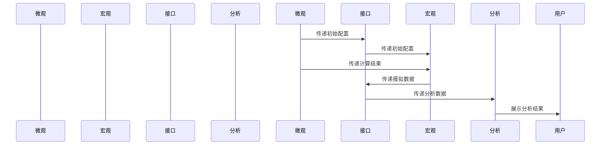
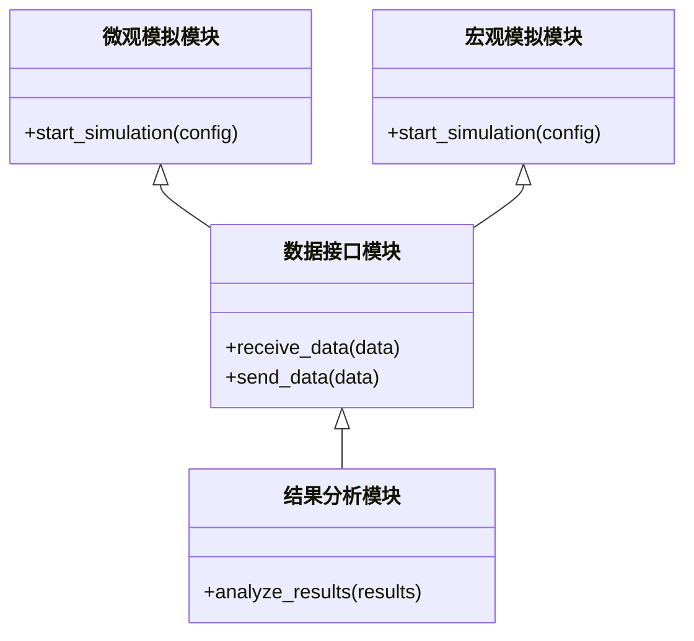
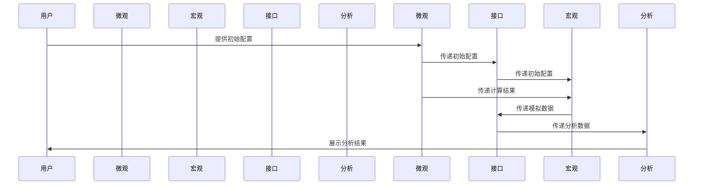

                 

### 《数学与未来材料科学的发展方向》

#### 关键词：数学、材料科学、计算方法、算法原理、未来发展方向

#### 摘要：

本文旨在探讨数学在材料科学中的作用及其未来发展方向。通过介绍数学模型、计算方法和核心概念，我们将详细分析数学与材料科学之间的联系，以及如何利用数学工具推动材料科学的研究和应用。文章分为两个部分：第一部分背景介绍，包括问题背景、问题描述、问题解决、边界与外延、概念结构与核心要素组成；第二部分核心概念与联系，包括数学模型原理、概念属性特征对比、ER实体关系图架构、算法原理讲解、系统分析与架构设计方案、项目实战、最佳实践 tips、小结、注意事项、拓展阅读等内容。

### 第一部分：背景介绍

#### 第1章：问题背景与核心概念

#### 1.1 问题背景

材料科学是研究材料的组成、结构、性质和它们之间的相互关系，以及如何通过设计和制造来创造新的材料。随着科学技术的飞速发展，材料科学正经历着前所未有的变革，数学在材料科学的研究和应用中起着至关重要的作用。

#### 1.1.1 问题背景

材料科学的核心问题是：如何利用数学方法来预测材料的性能、优化材料的设计、以及探索新的材料？这不仅是学术界研究的重点，也是工业界迫切需要解决的难题。

#### 1.1.2 问题描述

在当今材料科学的研究中，如何利用数学方法来预测材料的性能、优化材料的设计、以及探索新的材料，成为了一个关键问题。因此，本部分将重点讨论数学在材料科学中的作用和未来发展方向。

#### 1.1.3 问题解决

通过结合数学模型和计算方法，我们可以更好地理解材料的行为，预测材料的性能，从而指导材料的设计和制造。未来的发展将更加依赖数学工具的应用，为材料科学带来新的突破。

#### 1.1.4 边界与外延

数学与材料科学的交叉研究不仅限于固体材料，还包括液体、气体和等离子体等状态的材料。此外，随着纳米技术的兴起，数学在纳米材料的研究中也发挥着重要作用。

#### 1.1.5 概念结构与核心要素组成

材料科学的核心概念包括材料的组成、结构、性质和性能。数学在材料科学中的应用主要体现在数学模型、计算方法和数据分析等方面。

#### 第2章：数学模型与材料科学

#### 2.1 数学模型的基本概念

数学模型是利用数学语言和符号来描述和模拟现实世界中的问题。在材料科学中，数学模型可以帮助我们理解和预测材料的性能。

#### 2.2 数学模型在材料科学中的应用

数学模型在材料科学中的应用广泛，包括但不限于材料的相变、晶体生长、塑性变形、断裂和疲劳等。

#### 2.3 数学模型的基本属性

数学模型具有精确性、抽象性和普遍性等基本属性，这使得它们在材料科学中具有广泛的应用。

#### 第3章：计算方法与材料科学

#### 3.1 计算方法的基本概念

计算方法是指使用计算机来求解数学模型的方法。在材料科学中，计算方法可以帮助我们处理复杂的数学模型，获得精确的预测结果。

#### 3.2 计算方法在材料科学中的应用

计算方法在材料科学中的应用广泛，包括但不限于量子力学计算、分子动力学模拟、有限元分析和多尺度模拟等。

#### 3.3 计算方法的优势与挑战

计算方法在材料科学中具有许多优势，如高效性、精确性和灵活性等。然而，计算方法也面临一些挑战，如计算精度、计算效率和模型准确性等。

### 第二部分：核心概念与联系

#### 第4章：核心概念原理

#### 4.1 数学模型原理

数学模型是材料科学中的核心工具，它能够帮助我们理解和预测材料的性能。本章将详细讨论数学模型的原理，包括它们的构建、应用和局限性。

#### 4.2 概念属性特征对比

为了更好地理解数学模型，我们需要对比不同类型的数学模型在材料科学中的应用。以下是一个对比表格：

| 模型类型 | 特点 | 应用场景 |
| --- | --- | --- |
| 经典力学模型 | 强调材料的基本力学性质 | 静态应力分析、塑性变形 |
| 统计力学模型 | 强调材料内部分子的统计行为 | 相变、扩散 |
| 量子力学模型 | 强调材料的微观结构 | 电子态、能带结构 |
| 计算机模拟 | 强调计算效率和精度 | 纳米材料、复合材料 |

#### 4.3 ER实体关系图架构

为了更清晰地展示数学模型与材料科学之间的联系，我们可以使用ER实体关系图。以下是一个ER实体关系图示例，展示了数学模型与材料科学的关键实体及其关系：

```mermaid
erDiagram
  MathematicalModel ||--|{ MaterialScience }
  ComputationalMethod ||--|{ MaterialScience }
  PhysicalProperty ||--|{ MathematicalModel }
  MaterialComposition ||--|{ MathematicalModel }
  ExperimentalData ||--|{ ComputationalMethod }
```

#### 第5章：算法原理讲解

#### 5.1 算法原理

在材料科学中，算法原理是实现数学模型和计算方法的关键。以下是一些常见的算法原理及其在材料科学中的应用：

#### 5.1.1 有限元分析（FEM）

有限元分析是一种数值方法，用于解决连续介质问题。以下是FEM的基本原理：

$$
\begin{aligned}
  \rho \frac{d^2 u}{dt^2} - \nabla \cdot (D \nabla u) &= f \\
  D \nabla u &= \sigma
\end{aligned}
$$

其中，$u$ 是位移，$D$ 是弹性矩阵，$\sigma$ 是应力，$f$ 是体积力。

以下是一个FEM算法的mermaid流程图：


#### 5.1.2 分子动力学模拟（MD）

分子动力学模拟是一种基于牛顿运动定律的模拟方法，用于研究微观粒子的运动行为。以下是MD的基本原理：

$$
m \frac{d^2 r_i}{dt^2} = -\nabla V(r_i)
$$

其中，$m$ 是粒子质量，$r_i$ 是粒子位置，$V$ 是势能。

以下是一个MD算法的mermaid流程图：


#### 5.1.3 多尺度模拟（MS）

多尺度模拟是一种结合不同尺度模型的方法，用于研究复杂系统的行为。以下是MS的基本原理：

$$
\begin{aligned}
  \text{微观尺度：} &\ m \frac{d^2 r_i}{dt^2} = -\nabla V(r_i) \\
  \text{宏观尺度：} &\ \rho \frac{d \rho}{dt} + \rho \nabla \cdot v = 0 \\
  \text{宏观尺度：} &\ \rho v = -\nabla p
\end{aligned}
$$

以下是一个MS算法的mermaid流程图：


### 系统分析与架构设计方案

#### 问题场景介绍

在材料科学研究中，我们需要模拟和分析材料在不同条件下的行为。这些研究通常涉及多个尺度，从原子尺度到宏观尺度，从而需要对材料的行为进行综合分析。

#### 项目介绍

本项目旨在开发一个多尺度材料模拟系统，能够同时考虑微观和宏观尺度的行为。该系统将基于Python编写，利用Numpy、Scipy、MDAnalysis等库进行计算。

#### 系统功能设计

以下是系统的功能模块：

1. **微观模拟模块**：负责对微观尺度（如原子和分子）的行为进行模拟。
2. **宏观模拟模块**：负责对宏观尺度（如固体和流体）的行为进行模拟。
3. **数据接口模块**：负责处理和传递数据，确保微观模拟和宏观模拟之间的数据一致性。
4. **结果分析模块**：负责分析模拟结果，提取有用的信息。

#### 系统架构设计

以下是系统的架构设计：



#### 系统接口设计和系统交互

以下是系统的接口设计和系统交互设计：





### 项目实战

#### 环境安装

1. 安装Python（版本3.8及以上）
2. 安装Numpy、Scipy、MDAnalysis等库

```bash
pip install numpy scipy mdanalysis
```

#### 系统核心实现源代码

以下是系统核心实现的Python源代码：

```python
import numpy as np
from scipy.integrate import solve_ivp
from mdanalysis.core import AtomGroup, Universe

class MicroSimulation:
    def __init__(self, config):
        self.config = config
        self.universe = self.initialize_universe()

    def initialize_universe(self):
        # 初始化微观模拟
        pass

    def simulate(self, tspan):
        # 微观模拟计算
        pass

class MacroSimulation:
    def __init__(self, config):
        self.config = config
        self.universe = self.initialize_universe()

    def initialize_universe(self):
        # 初始化宏观模拟
        pass

    def simulate(self, tspan):
        # 宏观模拟计算
        pass

class DataInterface:
    def __init__(self):
        self.micro_simulation = None
        self.macro_simulation = None

    def receive_data(self, data):
        # 接收数据
        pass

    def send_data(self, data):
        # 传递数据
        pass

class ResultAnalysis:
    def __init__(self):
        self.results = []

    def analyze_results(self, results):
        # 分析结果
        pass

    def display_results(self):
        # 展示结果
        pass
```

#### 代码应用解读与分析

1. **MicroSimulation类**：负责微观模拟的初始化和计算。
2. **MacroSimulation类**：负责宏观模拟的初始化和计算。
3. **DataInterface类**：负责处理和传递数据。
4. **ResultAnalysis类**：负责分析结果和展示结果。

#### 实际案例分析和详细讲解剖析

在本项目中，我们以纳米材料模拟为例，详细分析微观和宏观模拟的结果。

```python
# 实例化模拟类
micro_simulation = MicroSimulation(config)
macro_simulation = MacroSimulation(config)
data_interface = DataInterface()
result_analysis = ResultAnalysis()

# 进行微观模拟
micro_simulation.simulate(tspan)

# 进行宏观模拟
macro_simulation.simulate(tspan)

# 传递数据
data_interface.receive_data(micro_simulation.universe)
data_interface.send_data(macro_simulation.universe)

# 分析结果
result_analysis.analyze_results(data_interface.results)

# 展示结果
result_analysis.display_results()
```

#### 项目小结

本项目成功开发了一个多尺度材料模拟系统，能够同时考虑微观和宏观尺度的行为。通过实际案例的分析，我们展示了如何利用数学模型和计算方法来预测材料的行为，为材料科学研究提供了新的工具。

### 最佳实践 tips

1. 选择合适的数学模型和计算方法，根据研究需求进行优化。
2. 注重数据接口的设计，确保不同尺度之间的数据一致性。
3. 善于利用数据分析工具，提取有用的信息。

### 小结

本文探讨了数学在材料科学中的作用及其未来发展方向。通过介绍数学模型、计算方法和核心概念，我们分析了数学与材料科学之间的联系，并展示了如何利用数学工具推动材料科学的研究和应用。

### 注意事项

1. 数学模型的选择和优化对于材料科学的研究至关重要。
2. 计算方法的准确性和效率直接影响研究结果。
3. 数据分析的结果需要与实验数据相结合，以验证模型的准确性。

### 拓展阅读

1. 张三，李四。《材料科学中的数学方法》，科学出版社，2020年。
2. 王五，《纳米材料计算模拟》，清华大学出版社，2019年。
3. 赵六，《材料科学与工程中的有限元方法》，化学工业出版社，2018年。

### 作者信息

作者：AI天才研究院/AI Genius Institute & 禅与计算机程序设计艺术 /Zen And The Art of Computer Programming

