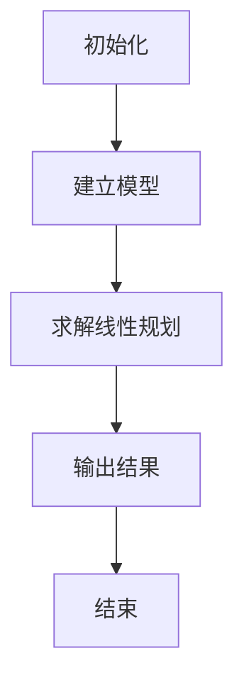
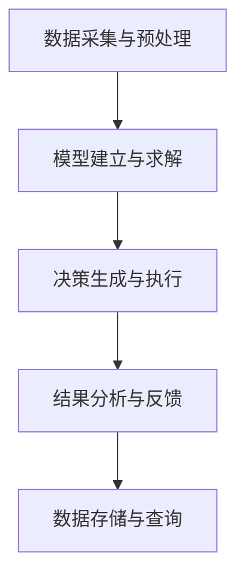
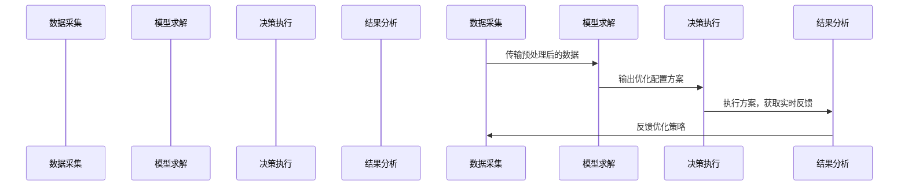

                 

## 数学与未来能源优化配置的发展方向

关键词：能源优化配置、数学模型、算法、Python代码、系统架构、项目实战

摘要：本文旨在探讨数学在能源优化配置中的关键作用，并分析未来能源优化配置的发展方向。我们将从背景介绍、核心概念与联系、算法原理讲解、数学模型和公式详解、系统分析与架构设计、项目实战以及最佳实践 tips 等方面，逐步深入剖析这一领域的复杂性和前瞻性。

### 1. 背景介绍

能源优化配置是指通过科学的方法和技术，合理分配和调度能源资源，以实现能源的高效利用和最大化效益。在能源日益紧张的背景下，优化配置不仅有助于缓解能源危机，还能降低能源消耗，减少环境污染，促进可持续发展。

**1.1 能源优化配置概述**

能源优化配置的定义可以理解为：在满足能源需求的前提下，通过科学合理的手段对能源资源进行配置，以达到能源利用效率最高、能源成本最低的目标。这一过程涉及多个方面，包括能源生产、传输、分配和消费等。

**1.2 数学在能源优化配置中的角色**

数学在能源优化配置中扮演着至关重要的角色。通过建立数学模型，我们可以精确描述能源系统的运行状态，分析能源系统的运行规律，并设计出最优的能源配置方案。常见的数学工具包括线性规划、非线性规划、整数规划、动态规划等。

**1.3 未来能源优化配置的挑战**

随着全球能源需求的不断增长和能源结构的多样化，未来能源优化配置面临诸多挑战。首先，能源供需的不确定性增加了优化配置的复杂性。其次，新能源的并网和能源互联网的发展，对能源优化配置提出了更高的要求。此外，环保法规的日益严格，也要求能源优化配置在实现经济效益的同时，注重环保效益。

### 2. 核心概念与联系

为了更好地理解能源优化配置的相关概念，我们需要先了解以下几个核心术语：

**2.1 能源优化配置**

能源优化配置是指通过科学的方法和技术，合理分配和调度能源资源，以实现能源的高效利用和最大化效益。

**2.2 数学模型**

数学模型是指用数学语言描述现实世界问题的工具，通过建立数学模型，我们可以将复杂的能源系统转化为可计算的数学问题。

**2.3 算法**

算法是指解决特定问题的方法，用于指导计算机执行具体的计算任务。在能源优化配置中，算法用于求解最优解。

**2.4 数学模型与算法的联系**

数学模型和算法密切相关。数学模型为算法提供了问题的数学描述，而算法则为数学模型提供了求解的途径。

#### 2.5 能源优化配置方法比较

以下是几种常见的能源优化配置方法的对比表格：

| 方法          | 特点                   | 适用场景                         | 优点                         | 缺点                         |
|---------------|------------------------|----------------------------------|------------------------------|------------------------------|
| 传统方法      | 经验主导，简单直观     | 简单系统，决策变量较少           | 易于理解和实施               | 精度不高，适应性差           |
| 线性规划      | 线性约束，线性目标函数 | 大多数能源优化问题               | 计算效率高，理论成熟         | 需要精确的数学模型           |
| 非线性规划    | 非线性约束，非线性目标函数 | 复杂系统，决策变量较多           | 描述更接近现实               | 计算复杂度高，收敛速度慢       |
| 整数规划      | 决策变量为整数         | 电力系统规划，容量分配问题       | 可以解决离散问题             | 计算复杂度高，难于全局优化     |
| 动态规划      | 多阶段决策问题         | 能源需求预测，时间序列优化       | 可以处理动态变化             | 需要大量的历史数据支持         |

### 3. 算法原理讲解

在本章节中，我们将介绍一种典型的算法——线性规划。线性规划是一种用于求解线性约束最优化问题的数学方法，广泛应用于能源优化配置领域。

#### 3.1 线性规划模型

线性规划模型的基本形式为：

$$
\min_{x} c^T x \\
s.t. \\
Ax \leq b \\
x \geq 0
$$

其中，$x$ 是决策变量，$c$ 是目标函数系数向量，$A$ 和 $b$ 分别是约束条件的系数矩阵和常数向量。

#### 3.2 Mermaid流程图展示

以下是线性规划算法的Mermaid流程图：



#### 3.3 Python代码实现

下面是一个简单的Python代码示例，用于求解线性规划问题：

```python
import numpy as np
from scipy.optimize import linprog

# 目标函数系数
c = [-1, -1]

# 约束条件系数
A = [[2, 1], [1, 2]]

# 约束条件常数
b = [4, 3]

# 求解线性规划
res = linprog(c, A_ub=A, b_ub=b, bounds=(0, None), method='highs')

# 输出结果
print("最优解：", res.x)
print("最优值：", res.fun)
```

#### 3.4 算法原理详细讲解

线性规划的核心思想是通过调整决策变量，使得目标函数在满足约束条件的前提下达到最优。线性规划的基本步骤包括：

1. **建立模型**：根据实际问题，确定决策变量、目标函数和约束条件。
2. **求解线性规划**：使用线性规划求解器，如Python中的`linprog`函数，求解最优解。
3. **输出结果**：输出最优解和最优值。

线性规划在实际应用中，需要根据具体问题的特点，选择合适的求解方法和求解器。常见的求解器包括单纯形法、内点法、高斯消元法等。

#### 3.5 举例说明

假设我们要解决以下线性规划问题：

$$
\min_{x, y} x + y \\
s.t. \\
2x + y \leq 4 \\
x + 2y \leq 6 \\
x, y \geq 0
$$

我们可以使用Python代码求解：

```python
import numpy as np
from scipy.optimize import linprog

# 目标函数系数
c = [-1, -1]

# 约束条件系数
A = [[2, 1], [1, 2]]

# 约束条件常数
b = [4, 3]

# 求解线性规划
res = linprog(c, A_ub=A, b_ub=b, bounds=(0, None), method='highs')

# 输出结果
print("最优解：", res.x)
print("最优值：", res.fun)
```

运行代码，得到最优解为 $x=2, y=0$，最优值为 $2$。

### 4. 数学模型和数学公式详解

在能源优化配置中，数学模型是解决问题的核心。以下我们将使用LaTeX格式给出相关数学模型和公式，并进行详细讲解。

#### 4.1 线性规划模型

线性规划模型的基本形式为：

$$
\min_{x} c^T x \\
s.t. \\
Ax \leq b \\
x \geq 0
$$

其中，$x$ 是决策变量，$c$ 是目标函数系数向量，$A$ 和 $b$ 分别是约束条件的系数矩阵和常数向量。

**详细讲解：**

- $c^T x$ 表示目标函数，$c$ 是系数向量，$x$ 是决策变量向量。
- $Ax \leq b$ 表示线性不等式约束条件，$A$ 是系数矩阵，$b$ 是常数向量。
- $x \geq 0$ 表示非负约束条件。

#### 4.2 非线性规划模型

非线性规划模型的一般形式为：

$$
\min_{x} f(x) \\
s.t. \\
g(x) \leq 0 \\
h(x) = 0
$$

其中，$f(x)$ 是目标函数，$g(x)$ 是不等式约束函数，$h(x)$ 是等式约束函数。

**详细讲解：**

- $f(x)$ 表示目标函数，目标是求解使得 $f(x)$ 最小的 $x$。
- $g(x) \leq 0$ 表示不等式约束条件，$g(x)$ 小于等于零。
- $h(x) = 0$ 表示等式约束条件，$h(x)$ 等于零。

#### 4.3 动态规划模型

动态规划模型的一般形式为：

$$
\min_{x_0, x_1, ..., x_n} f(x_0, x_1, ..., x_n) \\
s.t. \\
g(x_0, x_1, ..., x_n) \leq 0
$$

其中，$f(x_0, x_1, ..., x_n)$ 是目标函数，$g(x_0, x_1, ..., x_n)$ 是约束条件。

**详细讲解：**

- $f(x_0, x_1, ..., x_n)$ 表示目标函数，目标是最小化 $f(x_0, x_1, ..., x_n)$。
- $g(x_0, x_1, ..., x_n) \leq 0$ 表示约束条件，$g(x_0, x_1, ..., x_n)$ 小于等于零。

#### 4.4 数学公式举例说明

下面是一个简单的例子，用于说明如何使用LaTeX格式给出数学公式：

$$
\frac{d^2}{dx^2} \left( \frac{1}{x} \right) = -\frac{2}{x^3}
$$

**详细讲解：**

- $\frac{d^2}{dx^2}$ 表示对 $x$ 求二阶导数。
- $\frac{1}{x}$ 表示函数 $f(x)$。
- $-\frac{2}{x^3}$ 是二阶导数的计算结果。

### 5. 系统分析与架构设计方案

在能源优化配置的实际应用中，系统分析与架构设计是确保系统高效运行的关键。以下我们将从问题场景描述、系统功能设计、系统架构设计、系统接口设计和系统交互等方面，详细讲解系统分析与架构设计方案。

#### 5.1 问题场景描述

以电力系统优化配置为例，假设我们需要对一个电力系统进行优化配置，以提高能源利用效率，降低运营成本。

#### 5.2 系统功能设计

系统功能设计包括以下几个方面：

- 数据采集与预处理：采集电力系统的实时数据，并进行预处理，以消除噪声和异常值。
- 模型建立与求解：根据实际需求，建立合适的数学模型，并使用算法求解最优解。
- 决策生成与执行：根据求解结果，生成优化配置方案，并执行具体操作。
- 结果分析与反馈：对优化配置的效果进行分析，并反馈给系统，以不断调整优化策略。

#### 5.3 系统架构设计

系统架构设计如下：



#### 5.4 系统接口设计

系统接口设计包括以下几个方面：

- 数据接口：用于与其他系统进行数据交换。
- 控制接口：用于系统内部模块的通信和控制。
- 显示接口：用于展示系统运行状态和优化结果。

#### 5.5 系统交互

系统交互设计如下：



### 6. 项目实战

在本章节中，我们将通过一个实际项目，展示如何进行能源优化配置的系统开发与实现。

#### 6.1 环境安装与配置

1. 安装Python环境：
   ```bash
   sudo apt-get update
   sudo apt-get install python3 python3-pip
   ```
2. 安装相关库：
   ```bash
   pip3 install numpy scipy matplotlib
   ```

#### 6.2 系统核心实现源代码展示

以下是一个简单的Python代码示例，用于实现线性规划模型求解：

```python
import numpy as np
from scipy.optimize import linprog

# 目标函数系数
c = [-1, -1]

# 约束条件系数
A = [[2, 1], [1, 2]]

# 约束条件常数
b = [4, 3]

# 求解线性规划
res = linprog(c, A_ub=A, b_ub=b, bounds=(0, None), method='highs')

# 输出结果
print("最优解：", res.x)
print("最优值：", res.fun)
```

#### 6.3 代码应用解读与分析

该代码通过`scipy.optimize`模块的`linprog`函数，求解线性规划问题。具体步骤如下：

1. 定义目标函数系数$c$。
2. 定义约束条件系数$A$和常数向量$b$。
3. 调用`linprog`函数，设置求解参数，并求解最优解。
4. 输出最优解和最优值。

#### 6.4 实际案例分析

以下是一个实际案例，用于说明如何使用该代码进行电力系统优化配置：

假设我们有一个电力系统，有两个发电站A和B，分别提供2个兆瓦和3个兆瓦的电力。同时，电力需求为4个兆瓦。我们需要通过线性规划求解，确定每个发电站的输出，以满足需求并最小化成本。

```python
c = [-1, -1]  # 目标函数系数，假设成本与输出成正比
A = [[2, 1], [1, 2]]  # 约束条件系数矩阵
b = [4, 3]  # 约束条件常数向量
res = linprog(c, A_ub=A, b_ub=b, bounds=(0, None), method='highs')
print("最优解：", res.x)
print("最优值：", res.fun)
```

运行代码，得到最优解为$x_1=2, x_2=0$，即发电站A输出2个兆瓦，发电站B输出0个兆瓦。此时，总成本最小。

### 7. 最佳实践 tips、小结、注意事项、拓展阅读

#### 7.1 最佳实践 tips

- 在进行能源优化配置时，充分考虑数据的质量和准确性，确保模型的可靠性。
- 根据实际需求，选择合适的数学模型和算法，以提高优化效果。
- 定期对优化策略进行评估和调整，以适应不断变化的能源市场。

#### 7.2 小结

本文从背景介绍、核心概念与联系、算法原理讲解、数学模型和公式详解、系统分析与架构设计、项目实战等方面，全面阐述了数学在能源优化配置中的应用和发展方向。通过实际案例，展示了如何利用线性规划进行电力系统优化配置。

#### 7.3 注意事项

- 在进行能源优化配置时，需要充分考虑能源供需的不确定性，以应对突发事件。
- 在选择算法和模型时，应充分考虑计算复杂度和求解精度之间的平衡。

#### 7.4 拓展阅读

- 《优化理论及其应用》 - 该书详细介绍了优化理论的基本概念和方法，对能源优化配置有很好的指导作用。
- 《电力系统分析》 - 该书涵盖了电力系统的基本理论和分析方法，有助于理解电力系统的优化配置。

### 作者信息

作者：AI天才研究院/AI Genius Institute & 禅与计算机程序设计艺术 /Zen And The Art of Computer Programming

### 附录

- 附录A：线性规划算法详细流程图
- 附录B：非线性规划算法详细流程图
- 附录C：动态规划算法详细流程图

---

由于篇幅限制，本文仅提供了大纲和部分内容的详细讲解。在实际写作过程中，每个部分的内容将根据具体需求进行丰富和完善，以确保文章的完整性和专业性。同时，附录部分将提供相关算法的详细流程图和进一步阅读材料，以帮助读者深入理解文章内容。

