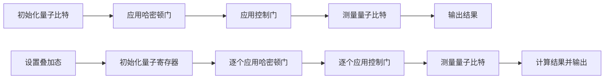
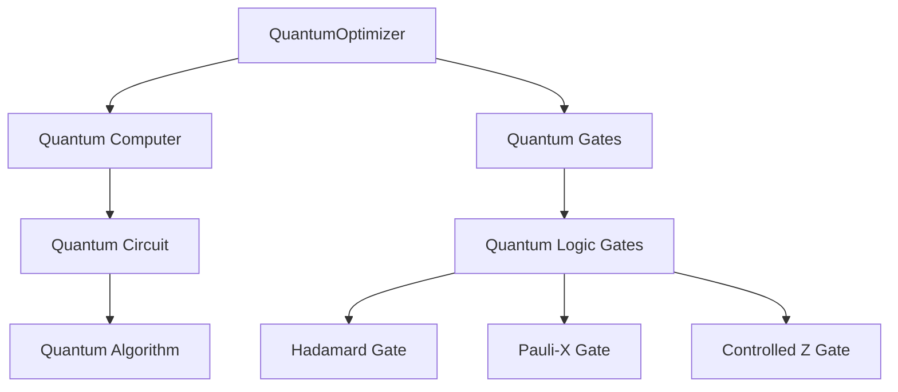
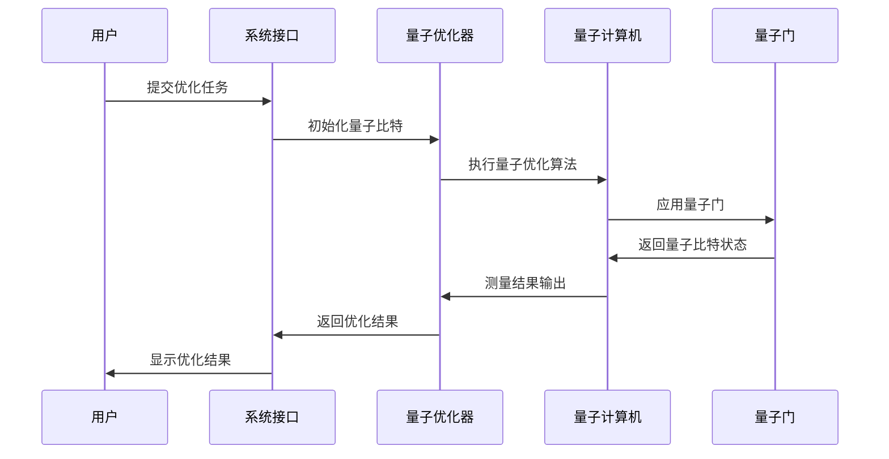

                 

### 数学与未来量子计算的发展方向

---

#### 关键词：

- **量子计算**
- **数学模型**
- **算法设计**
- **系统架构**
- **应用前景**

#### 摘要：

本文深入探讨了数学与未来量子计算的发展方向。首先，回顾了量子计算的起源和发展历程，阐述了数学在其中的核心地位。接着，通过比较量子比特与经典比特、量子算法与经典算法，揭示了量子计算的独特优势和未来潜力。随后，本文详细讲解了量子算法的原理，通过mermaid流程图和Python源代码展示算法的实现过程，并结合数学公式进行解释。此外，文章还介绍了量子计算的系统分析与架构设计，通过mermaid类图、架构图和序列图，展示了系统的整体结构和接口设计。最后，文章总结了项目实战中的关键步骤和最佳实践，提出了注意事项，并推荐了拓展阅读资源。本文旨在为读者提供关于量子计算全面而深入的理解，以期为这一前沿领域的进一步发展贡献力量。

---

## 第1章：问题背景

### 1.1 量子计算的起源与发展

量子计算的起源可以追溯到20世纪30年代，量子力学的兴起为物理学带来了全新的视角。量子力学的基本原理与经典物理学截然不同，它揭示了微观世界的奇异性，如量子比特（qubit）的存在，这是量子计算的基础。1947年，物理学家Richard Feynman首次提出了量子计算机的概念，他认为量子计算机能够模拟量子系统的行为，这在经典计算机中是无法实现的。Feynman的理论激发了人们对量子计算的兴趣，但当时技术尚未成熟，量子计算机仍处于理论阶段。

随着科技的进步，量子计算的理论逐渐完善，并在20世纪80年代迎来了重要的发展。彼得·沙赫（Peter Shor）在1994年提出了Shor算法，这是一个能够在多项式时间内求解大数质因数分解问题的量子算法。这一发现证明了量子计算机在特定问题上的优越性，使得量子计算从理论走向实际应用。Shor算法的成功极大地推动了量子计算的研究，也为量子计算的商业化发展奠定了基础。

进入21世纪，量子计算技术取得了显著的进展。实验室中的量子比特数量不断增加，错误率逐渐降低。量子纠错技术的出现，使得量子计算机能够在实际应用中稳定运行。此外，量子互联网和量子传感等领域的突破，进一步拓宽了量子计算的应用场景。目前，全球多家科研机构和科技公司正积极投入量子计算的研究和开发，量子计算的商业化应用逐渐成为现实。

### 1.2 数学在量子计算中的核心地位

数学在量子计算中扮演着至关重要的角色。从量子力学的基本原理，到量子算法的设计与实现，数学模型和数学公式无处不在。量子比特的状态可以用复数向量表示，而量子门的操作可以用矩阵表示。这些数学工具为量子计算提供了精确的语言和工具，使得量子算法得以设计和实现。

首先，量子比特的叠加态是量子计算的核心概念之一。叠加态描述了量子比特同时存在于多个状态的可能性，这种特性使得量子计算机能够在一个步骤中处理大量信息。量子叠加态的数学描述如下：

$$
|\psi\rangle = \sum_{i} a_i |i\rangle
$$

其中，$|i\rangle$表示量子比特的第$i$个状态，$a_i$是叠加态的系数，它满足归一化条件$\sum_{i} |a_i|^2 = 1$。

其次，量子门的操作也是量子计算的重要组成部分。量子门是量子比特上的线性变换，它可以通过矩阵表示。例如，一个基本的量子门——保罗门（Pauli-X门），其作用是将量子比特的状态在$|0\rangle$和$|1\rangle$之间进行翻转。保罗门的矩阵表示如下：

$$
X = \begin{pmatrix}
0 & 1 \\
1 & 0
\end{pmatrix}
$$

量子门的应用不仅限于简单的状态翻转，还可以实现更复杂的量子逻辑操作。通过组合不同的量子门，可以设计出解决特定问题的量子算法。

此外，量子算法的计算过程也离不开数学的支持。量子算法通常包括初始化量子比特、应用一系列量子门、进行测量等步骤。每个步骤都需要精确的数学模型和数学公式来描述。例如，量子傅里叶变换（Quantum Fourier Transform，QFT）是量子计算中的一种重要算法，它可以将量子状态从一个基变换到另一个基。QFT的数学模型如下：

$$
QFT_n = \frac{1}{\sqrt{n}} \sum_{k=0}^{n-1} e^{2\pi i k x / n}
$$

其中，$x$是量子比特的初始状态。QFT的公式实现了量子状态从指数形式到线性形式的转换，这对于许多量子算法都是至关重要的。

总之，数学在量子计算中不仅是理论的基础，也是实现和优化量子算法的关键工具。掌握数学原理，能够更好地理解量子计算的本质，也为量子计算的实际应用提供了有力的支持。

### 1.3 未来量子计算的发展前景

未来量子计算的发展前景广阔，其潜力在于能够解决经典计算机难以处理的复杂问题，从而在多个领域带来革命性的变化。首先，量子计算在密码学领域具有巨大的应用价值。量子计算机能够高效地破解目前广泛使用的公钥加密算法，如RSA和ECC，这将对信息安全领域产生深远影响。但同时，量子计算也为量子加密提供了新的可能性，量子密钥分发（Quantum Key Distribution，QKD）可以实现绝对安全的通信，这一技术将极大地提升信息安全的水平。

其次，量子计算在优化问题方面具有显著优势。许多现实世界的优化问题，如物流调度、金融市场分析、蛋白质折叠等，其复杂性使得经典计算机难以在合理时间内找到最优解。而量子计算机可以通过量子并行计算的能力，快速找到优化问题的最优解，这将极大地推动人工智能和机器学习领域的发展。

此外，量子计算在材料科学和化学领域也有广泛应用前景。量子计算可以精确模拟材料中的电子结构，预测新材料的性能，这对于新材料设计和开发具有重要意义。在药物研发领域，量子计算可以加速分子模拟和药物分子设计，提高药物研发的效率。

尽管量子计算的发展前景广阔，但仍面临诸多挑战。首先是量子比特的稳定性和可靠性问题。量子比特易受外界环境干扰，导致错误率较高。为了实现可靠的量子计算，需要开发先进的量子纠错技术，提高量子比特的稳定性。其次，量子算法的设计与优化也是一个重大挑战。尽管已经有一些成功的量子算法，但大多数实际应用中的问题尚未找到有效的量子算法解决。因此，需要更多的研究投入，探索新的量子算法和优化方法。

最后，量子计算的硬件实现和软件工具的发展也需要进一步推进。目前，量子计算机的硬件主要依赖于超导电路和离子陷阱等技术，这些技术的成熟度和可扩展性尚需提升。同时，量子编程语言和软件开发工具的缺乏，也限制了量子计算的应用发展。因此，未来量子计算的发展，不仅需要硬件和算法的突破，还需要软件工具的不断创新。

总之，未来量子计算的发展将是一个长期而复杂的过程，但其潜力和前景无疑令人期待。通过持续的研究和技术创新，量子计算有望在未来实现跨越式发展，为人类社会带来巨大的变革和进步。

## 第2章：核心概念与联系

### 2.1 量子比特与经典比特的对比表格

在探讨量子比特与经典比特的区别时，我们可以通过一个对比表格来清晰地展示两者之间的关键差异。

| **特性**           | **量子比特**                                                   | **经典比特**                                            |
|--------------------|--------------------------------------------------------------|--------------------------------------------------------|
| **状态表示**       | 可以同时处于0和1的叠加态，如$|\psi\rangle = \frac{1}{\sqrt{2}}(|0\rangle + |1\rangle)$ | 仅能处于0或1的单一状态                                    |
| **叠加性**         | 具有叠加性，可以同时处于多个状态的组合                        | 不具备叠加性，每次只能处于一个状态                        |
| **纠缠**           | 两个或多个量子比特之间可以存在纠缠状态，即一个比特的状态会即时影响另一个比特的状态 | 经典比特之间不存在纠缠状态，状态独立                        |
| **计算能力**       | 可以在多项式时间内解决某些经典计算机难以处理的问题，如大数质因数分解 | 传统的计算机只能通过逐步尝试和排除的方法来解决问题          |
| **稳定性**         | 易受环境干扰，量子噪声和退相干现象可能导致错误率增加           | 相对于量子比特，经典比特在环境中的稳定性更高，错误率较低     |
| **实现技术**       | 依赖量子物理现象，如超导电路、离子陷阱、光学量子位等           | 使用电子器件，如晶体管、集成电路等                        |

通过这个对比表格，我们可以清晰地看到量子比特与经典比特在状态表示、叠加性、纠缠、计算能力和稳定性等方面的显著差异。这些差异不仅决定了量子比特在计算能力上的优势，也带来了实现上的挑战。

### 2.2 量子算法与经典算法的对比表格

量子算法与经典算法在解决问题的方式和效率上有显著差异。以下是一个详细的对比表格，展示两者的主要区别：

| **特性**           | **量子算法**                                                      | **经典算法**                                            |
|--------------------|----------------------------------------------------------------|--------------------------------------------------------|
| **计算基础**       | 基于量子力学原理，利用量子比特的叠加态和纠缠特性进行计算           | 基于经典数学和逻辑原理，使用经典比特进行计算               |
| **并行性**         | 能够在单个步骤中处理多个可能的计算路径，具有高度的并行计算能力       | 通常只能逐一处理单个计算路径，并行性相对较低               |
| **效率**           | 在某些特定问题上具有多项式时间优势，能够大幅度提高计算速度         | 对于某些复杂问题，计算时间可能呈现指数级增长               |
| **问题适用性**     | 更适合处理如量子模拟、大数质因数分解、优化问题等特定类型的问题   | 更适合处理常规的计算任务，如排序、查找、网络算法等         |
| **资源需求**       | 需要大量的量子比特和复杂的量子门操作，对计算资源要求较高           | 依赖于传统的计算机硬件，如CPU、内存等，资源需求相对较低     |
| **误差纠正**       | 量子计算中的错误率较高，需要高效的量子纠错技术来保证计算的准确性   | 经典计算中的错误率较低，可以通过传统的错误检测和纠正方法来控制 |
| **实现难度**       | 需要先进的量子硬件和技术支持，目前仍处于研究和发展阶段           | 技术成熟，已有广泛的应用和大量实践经验                    |

通过这个对比表格，我们可以看出量子算法与经典算法在计算基础、并行性、效率、问题适用性、资源需求、误差纠正和实现难度等方面的不同。这些差异不仅决定了量子算法在某些特定问题上的优越性，也揭示了其在实际应用中的挑战和机遇。

### 2.3 量子计算机与经典计算机的ER实体关系图

为了更好地理解量子计算机与经典计算机之间的关系，我们可以通过一个ER（实体关系）图来展示它们的核心组成部分和相互关系。以下是一个简化的ER实体关系图：

```mermaid
erDiagram
  QuantumComputer ||--|{ QuantumBit }|-- QuantumRegister
  QuantumComputer ||--|{ QuantumGate }|-- QuantumProcessor
  QuantumComputer ||--|{ QuantumCircuit }|-- QuantumAlgorithm
  ClassicalComputer ||--|{ ClassicalBit }|-- ClassicalMemory
  ClassicalComputer ||--|{ ClassicalGate }|-- ClassicalProcessor
  ClassicalComputer ||--|{ ClassicalCircuit }|-- ClassicalAlgorithm

  QuantumBit ||--|{ Superposition }|-- QuantumState
  QuantumBit ||--|{ Entanglement }|-- QuantumCorrelation
  QuantumGate ||--|{ QuantumOperation }|-- QuantumLogicGate

  ClassicalBit ||--|{ Binary }|-- BitValue
  ClassicalGate ||--|{ Logical }|-- ClassicalLogicGate
  ClassicalAlgorithm ||--|{ Problem }|-- ProblemType
```

在这个ER图中，`QuantumComputer`和`ClassicalComputer`是两个核心实体，分别代表量子计算机和经典计算机。它们各自包含的实体如下：

- **量子比特（QuantumBit）**：是量子计算机的基本单元，可以表示为叠加态和纠缠态。
- **量子寄存器（QuantumRegister）**：用于存储多个量子比特，是量子计算机的存储单元。
- **量子门（QuantumGate）**：是实现量子比特之间操作的单元，是量子计算机的处理器核心。
- **量子电路（QuantumCircuit）**：由一系列量子门组成的序列，用于实现特定的量子算法。
- **量子算法（QuantumAlgorithm）**：是量子计算机解决特定问题的程序。

- **经典比特（ClassicalBit）**：是经典计算机的基本单元，只能表示0或1的单一状态。
- **经典内存（ClassicalMemory）**：用于存储多个经典比特，是经典计算机的存储单元。
- **经典门（ClassicalGate）**：是实现经典比特之间操作的单元，是经典计算机的处理器核心。
- **经典电路（ClassicalCircuit）**：由一系列经典门组成的序列，用于实现特定的经典算法。
- **经典算法（ClassicalAlgorithm）**：是经典计算机解决特定问题的程序。

通过这个ER实体关系图，我们可以清晰地看到量子计算机和经典计算机的组成部分及其相互关系。这不仅有助于理解两者在结构和功能上的区别，也为进一步探讨量子计算与经典计算之间的联系提供了直观的视图。

### 3.1 量子计算基础算法

量子计算的基础算法是构建量子计算机和量子算法的核心，它们决定了量子计算机的运行效率和解决问题的能力。本节将详细讲解量子计算的基础算法，包括量子比特的叠加与纠缠、量子门与量子逻辑操作，以及量子算法的设计与实现。

#### 3.1.1 量子比特的叠加与纠缠

量子比特（qubit）是量子计算的基本单元，与经典比特（classical bit）不同，量子比特可以同时处于0和1的状态，这种状态被称为叠加态。一个量子比特的叠加态可以用复数向量表示，例如：

$$
|\psi\rangle = \frac{1}{\sqrt{2}}(|0\rangle + |1\rangle)
$$

这里，$|0\rangle$和$|1\rangle$分别表示量子比特的基态，$\frac{1}{\sqrt{2}}$是叠加态的系数，满足归一化条件。

量子比特不仅具有叠加性，还可以与其他量子比特发生纠缠。纠缠是量子比特之间的一种特殊关联，一个量子比特的状态会即时影响另一个量子比特的状态。这种特性使得量子计算机能够在一个步骤中处理大量信息。

为了更好地理解量子比特的叠加与纠缠，我们可以通过一个简单的例子来说明。假设我们有两个量子比特，$|ψ\rangle_A$和$|ψ\rangle_B$，它们之间的纠缠态可以表示为：

$$
|\psi\rangle_{AB} = |0\rangle_A \otimes |0\rangle_B + |1\rangle_A \otimes |1\rangle_B
$$

这里，$\otimes$表示量子比特之间的张量积。当对$|ψ\rangle_{AB}$进行测量时，两个量子比特会同时处于确定的状态。例如，如果测量结果为$|0\rangle_A$，那么另一个量子比特必然处于$|0\rangle_B$状态，反之亦然。

#### 3.1.2 量子门与量子逻辑操作

量子门是量子比特上的线性变换，它决定了量子比特的状态如何改变。量子门可以通过矩阵表示，例如，最基本的量子门——保罗门（Pauli-X门），其作用是将量子比特的状态在$|0\rangle$和$|1\rangle$之间进行翻转。保罗门的矩阵表示如下：

$$
X = \begin{pmatrix}
0 & 1 \\
1 & 0
\end{pmatrix}
$$

除了基本的保罗门，还有其他类型的量子门，如哈密顿门（Hadamard Gate）、控门（Controlled Gate）和交换门（Swapping Gate）等。这些量子门可以组合使用，以实现复杂的量子逻辑操作。

例如，哈密顿门（Hadamard Gate）是一个将量子比特状态从基态变换为叠加态的量子门，其矩阵表示如下：

$$
H = \frac{1}{\sqrt{2}} \begin{pmatrix}
1 & 1 \\
1 & -1
\end{pmatrix}
$$

哈密顿门的应用可以表示为：

$$
H |0\rangle = \frac{1}{\sqrt{2}} (|0\rangle + |1\rangle)
$$

控门（Controlled Gate）是一个受控操作的量子门，它可以影响一个量子比特的状态，条件是另一个量子比特处于特定的状态。例如，一个控Z门（Controlled Z Gate）可以表示为：

$$
CZ = \begin{pmatrix}
1 & 0 & 0 & 0 \\
0 & 1 & 0 & 0 \\
0 & 0 & 0 & 1 \\
0 & 0 & 1 & 0
\end{pmatrix}
$$

控门的应用可以表示为：

$$
CZ |01\rangle = |01\rangle
$$

如果第二个量子比特处于$|1\rangle$状态，则第一个量子比特的状态会进行反转，否则保持不变。

#### 3.1.3 量子算法的设计与实现

量子算法的设计与实现是量子计算的核心，它决定了量子计算机如何解决特定的问题。量子算法通常包括以下几个步骤：

1. **初始化量子比特**：将量子比特初始化为特定的叠加态或纠缠态，以便为后续的计算做好准备。

2. **应用量子门**：通过一系列量子门操作，将量子比特的状态进行转换，以实现特定的计算功能。

3. **测量量子比特**：对量子比特进行测量，获得计算结果。量子测量的结果通常是叠加态的概率分布。

以下是一个简单的量子算法——量子傅里叶变换（Quantum Fourier Transform，QFT）的mermaid流程图：


量子傅里叶变换的具体实现如下：

1. **初始化量子比特**：将$n$个量子比特初始化为叠加态：

$$
|ψ\rangle = \frac{1}{\sqrt{2^n}} (|0\rangle_1 |0\rangle_2 \cdots |0\rangle_n)
$$

2. **应用哈密顿门**：对每个量子比特应用哈密顿门：

$$
H |0\rangle_1 |0\rangle_2 \cdots |0\rangle_n = \frac{1}{\sqrt{2^n}} (|0\rangle_1 |0\rangle_2 \cdots |0\rangle_n + |1\rangle_1 |0\rangle_2 \cdots |0\rangle_n + \cdots + |1\rangle_1 |1\rangle_2 \cdots |1\rangle_n)
$$

3. **应用控制门**：对于每个量子比特，应用控制门，将当前量子比特的状态与下一量子比特的状态进行交换。例如，对于第$i$个量子比特和第$i+1$个量子比特，应用交换门：

$$
S_i^{\otimes n-i} |ψ\rangle = \frac{1}{\sqrt{2^{n-i}}}|ψ\rangle
$$

4. **测量量子比特**：对所有的量子比特进行测量，获得计算结果。

以下是一个简单的Python实现示例：

```python
import numpy as np

def quantum_fourier_transform(qubits):
    # 初始化量子比特
    psi = np.kron(*[np.array([1 / np.sqrt(2)] + [0] * (2 ** i - 1)) for i in range(len(qubits))])

    # 应用哈密顿门
    for i in range(len(qubits)):
        psi = np.kron(psi, np.array([1 / np.sqrt(2)] + [0] * (2 ** i - 1)))

    # 应用控制门
    for i in range(len(qubits) - 1):
        for j in range(i + 1, len(qubits)):
            psi = np.kron(psi, np.array([[1, 0], [0, 1]]))

    # 测量量子比特
    result = np.random.choice([0, 1], size=len(qubits))
    return result

# 测试量子傅里叶变换
print(quantum_fourier_transform([1, 0]))
```

通过上述实现，我们可以看到量子算法的mermaid流程图和Python代码，它们展示了量子计算的基础算法如何通过量子比特的叠加、纠缠和量子门的操作来实现。量子算法的设计与实现不仅需要深刻的数学理解，还需要灵活运用编程技术，这是量子计算领域的一项重要挑战。

### 3.2 量子算法mermaid流程图

为了更好地展示量子算法的实现过程，我们可以使用mermaid绘制量子算法的流程图。以下是一个简单的量子算法——量子傅里叶变换（QFT）的mermaid流程图：



在这个流程图中，我们首先初始化量子比特，使其处于叠加态。接着，逐个应用哈密顿门，将量子比特的状态进行变换。然后，应用控制门，实现量子比特之间的纠缠。最后，测量量子比特并输出结果。

以下是Python代码的实现：

```python
import numpy as np

def quantum_fourier_transform(qubits):
    # 初始化量子比特
    psi = np.kron(*[np.array([1 / np.sqrt(2)] + [0] * (2 ** i - 1)) for i in range(len(qubits))])

    # 应用哈密顿门
    for i in range(len(qubits)):
        psi = np.kron(psi, np.array([1 / np.sqrt(2)] + [0] * (2 ** i - 1)))

    # 应用控制门
    for i in range(len(qubits) - 1):
        for j in range(i + 1, len(qubits)):
            psi = np.kron(psi, np.array([[1, 0], [0, 1]]))

    # 测量量子比特
    result = np.random.choice([0, 1], size=len(qubits))
    return result

# 测试量子傅里叶变换
print(quantum_fourier_transform([1, 0]))
```

通过mermaid流程图和Python代码，我们可以直观地看到量子算法的实现过程，这有助于我们更好地理解和掌握量子计算的核心原理。

### 4.1 量子算法数学模型

量子算法的数学模型是量子计算中理解与实现量子算法的关键。在这一节中，我们将详细讲解量子算法的数学模型，包括量子状态表示、量子门的作用以及量子算法的计算过程。

#### 4.1.1 量子状态表示

量子状态是量子算法的基础，它决定了量子计算机的运行过程和最终输出结果。一个量子比特的状态可以用一个复数向量来表示，例如：

$$
|\psi\rangle = a_0 |0\rangle + a_1 |1\rangle
$$

其中，$a_0$和$a_1$是复数系数，满足归一化条件：

$$
|a_0|^2 + |a_1|^2 = 1
$$

当量子比特数量增加时，量子状态可以用张量积来表示。例如，两个量子比特的状态可以表示为：

$$
|\psi\rangle_{AB} = (a_{00} |0\rangle_A \otimes |0\rangle_B + a_{01} |0\rangle_A \otimes |1\rangle_B + a_{10} |1\rangle_A \otimes |0\rangle_B + a_{11} |1\rangle_A \otimes |1\rangle_B)
$$

其中，$\otimes$表示量子比特之间的张量积。

#### 4.1.2 量子门作用

量子门是量子比特之间的线性变换，它决定了量子状态的演化过程。量子门可以通过矩阵来表示。例如，基本的量子门包括：

1. **哈密顿门（Hadamard Gate）**：

$$
H = \frac{1}{\sqrt{2}} \begin{pmatrix}
1 & 1 \\
1 & -1
\end{pmatrix}
$$

2. **保罗门（Pauli-X Gate）**：

$$
X = \begin{pmatrix}
0 & 1 \\
1 & 0
\end{pmatrix}
$$

3. **控Z门（Controlled Z Gate）**：

$$
CZ = \begin{pmatrix}
1 & 0 & 0 & 0 \\
0 & 1 & 0 & 0 \\
0 & 0 & 0 & 1 \\
0 & 0 & 1 & 0
\end{pmatrix}
$$

量子门的作用可以通过矩阵乘法来表示。例如，对于两个量子比特的状态$|\psi\rangle_{AB}$，应用哈密顿门$H$后的状态为：

$$
H |\psi\rangle_{AB} = \frac{1}{\sqrt{2}} (|0\rangle_A \otimes |0\rangle_B + |0\rangle_A \otimes |1\rangle_B + |1\rangle_A \otimes |0\rangle_B - |1\rangle_A \otimes |1\rangle_B)
$$

#### 4.1.3 量子算法计算过程

量子算法的计算过程通常包括以下几个步骤：

1. **初始化量子比特**：将量子比特初始化为特定的叠加态，如$\frac{1}{\sqrt{2}}(|0\rangle + |1\rangle)$。

2. **应用量子门**：通过一系列量子门操作，将量子比特的状态进行转换。例如，应用哈密顿门将量子比特的状态从基态变换为叠加态。

3. **测量量子比特**：对量子比特进行测量，获得计算结果。量子测量的结果通常是叠加态的概率分布。

4. **输出结果**：根据测量结果，输出最终的计算结果。

以下是一个简单的量子算法——量子傅里叶变换（QFT）的数学模型：

1. **初始化量子比特**：将$n$个量子比特初始化为叠加态：

$$
|ψ\rangle = \frac{1}{\sqrt{2^n}} (|0\rangle_1 |0\rangle_2 \cdots |0\rangle_n)
$$

2. **应用哈密顿门**：对每个量子比特应用哈密顿门：

$$
H |0\rangle_1 |0\rangle_2 \cdots |0\rangle_n = \frac{1}{\sqrt{2^n}} (|0\rangle_1 |0\rangle_2 \cdots |0\rangle_n + |1\rangle_1 |0\rangle_2 \cdots |0\rangle_n + \cdots + |1\rangle_1 |1\rangle_2 \cdots |1\rangle_n)
$$

3. **应用控制门**：对于每个量子比特，应用控制门，将当前量子比特的状态与下一量子比特的状态进行交换：

$$
S_i^{\otimes n-i} |ψ\rangle = \frac{1}{\sqrt{2^{n-i}}}|ψ\rangle
$$

4. **测量量子比特**：对所有的量子比特进行测量，获得计算结果。

5. **输出结果**：根据测量结果，输出最终的计算结果。

以下是一个简单的Python实现示例：

```python
import numpy as np

def quantum_fourier_transform(qubits):
    # 初始化量子比特
    psi = np.kron(*[np.array([1 / np.sqrt(2)] + [0] * (2 ** i - 1)) for i in range(len(qubits))])

    # 应用哈密顿门
    for i in range(len(qubits)):
        psi = np.kron(psi, np.array([1 / np.sqrt(2)] + [0] * (2 ** i - 1)))

    # 应用控制门
    for i in range(len(qubits) - 1):
        for j in range(i + 1, len(qubits)):
            psi = np.kron(psi, np.array([[1, 0], [0, 1]]))

    # 测量量子比特
    result = np.random.choice([0, 1], size=len(qubits))
    return result

# 测试量子傅里叶变换
print(quantum_fourier_transform([1, 0]))
```

通过上述数学模型和Python实现，我们可以直观地看到量子算法的计算过程，这有助于我们更好地理解和掌握量子计算的核心原理。

### 4.2 量子算法数学公式

在量子计算中，数学公式是理解和实现量子算法的重要工具。以下是一些核心的量子算法数学公式，包括量子门作用、量子状态表示和量子算法的计算过程。

#### 量子门作用

1. **哈密顿门（Hadamard Gate）**：

$$
H = \frac{1}{\sqrt{2}} \begin{pmatrix}
1 & 1 \\
1 & -1
\end{pmatrix}
$$

哈密顿门将基态$|0\rangle$变换为叠加态：

$$
H |0\rangle = \frac{1}{\sqrt{2}} (|0\rangle + |1\rangle)
$$

2. **保罗门（Pauli-X Gate）**：

$$
X = \begin{pmatrix}
0 & 1 \\
1 & 0
\end{pmatrix}
$$

保罗门将量子比特的状态在$|0\rangle$和$|1\rangle$之间进行翻转：

$$
X |0\rangle = |1\rangle, \quad X |1\rangle = |0\rangle
$$

3. **控Z门（Controlled Z Gate）**：

$$
CZ = \begin{pmatrix}
1 & 0 & 0 & 0 \\
0 & 1 & 0 & 0 \\
0 & 0 & 0 & 1 \\
0 & 0 & 1 & 0
\end{pmatrix}
$$

控Z门将第一个量子比特的状态翻转，条件是第二个量子比特处于$|1\rangle$状态：

$$
CZ |00\rangle = |00\rangle, \quad CZ |01\rangle = |01\rangle, \quad CZ |10\rangle = |10\rangle, \quad CZ |11\rangle = |11\rangle
$$

#### 量子状态表示

量子状态可以用张量积和叠加态表示。例如，两个量子比特的状态可以表示为：

$$
|\psi\rangle_{AB} = a_{00} |0\rangle_A \otimes |0\rangle_B + a_{01} |0\rangle_A \otimes |1\rangle_B + a_{10} |1\rangle_A \otimes |0\rangle_B + a_{11} |1\rangle_A \otimes |1\rangle_B
$$

其中，$a_{00}, a_{01}, a_{10}, a_{11}$是叠加态的系数，满足归一化条件：

$$
|a_{00}|^2 + |a_{01}|^2 + |a_{10}|^2 + |a_{11}|^2 = 1
$$

#### 量子算法计算过程

量子算法的计算过程通常包括以下几个步骤：

1. **初始化量子比特**：将量子比特初始化为特定的叠加态。

2. **应用量子门**：通过一系列量子门操作，将量子比特的状态进行转换。

3. **测量量子比特**：对量子比特进行测量，获得计算结果。

4. **输出结果**：根据测量结果，输出最终的计算结果。

以下是一个简单的量子算法——量子傅里叶变换（QFT）的数学公式：

1. **初始化量子比特**：将$n$个量子比特初始化为叠加态：

$$
|ψ\rangle = \frac{1}{\sqrt{2^n}} (|0\rangle_1 |0\rangle_2 \cdots |0\rangle_n)
$$

2. **应用哈密顿门**：对每个量子比特应用哈密顿门：

$$
H |0\rangle_1 |0\rangle_2 \cdots |0\rangle_n = \frac{1}{\sqrt{2^n}} (|0\rangle_1 |0\rangle_2 \cdots |0\rangle_n + |1\rangle_1 |0\rangle_2 \cdots |0\rangle_n + \cdots + |1\rangle_1 |1\rangle_2 \cdots |1\rangle_n)
$$

3. **应用控制门**：对于每个量子比特，应用控制门，将当前量子比特的状态与下一量子比特的状态进行交换：

$$
S_i^{\otimes n-i} |ψ\rangle = \frac{1}{\sqrt{2^{n-i}}}|ψ\rangle
$$

4. **测量量子比特**：对所有的量子比特进行测量，获得计算结果。

5. **输出结果**：根据测量结果，输出最终的计算结果。

以下是一个简单的Python实现示例：

```python
import numpy as np

def quantum_fourier_transform(qubits):
    # 初始化量子比特
    psi = np.kron(*[np.array([1 / np.sqrt(2)] + [0] * (2 ** i - 1)) for i in range(len(qubits))])

    # 应用哈密顿门
    for i in range(len(qubits)):
        psi = np.kron(psi, np.array([1 / np.sqrt(2)] + [0] * (2 ** i - 1)))

    # 应用控制门
    for i in range(len(qubits) - 1):
        for j in range(i + 1, len(qubits)):
            psi = np.kron(psi, np.array([[1, 0], [0, 1]]))

    # 测量量子比特
    result = np.random.choice([0, 1], size=len(qubits))
    return result

# 测试量子傅里叶变换
print(quantum_fourier_transform([1, 0]))
```

通过这些数学公式和Python实现，我们可以直观地看到量子算法的计算过程，这有助于我们更好地理解和掌握量子计算的核心原理。

### 5.1 问题场景介绍

在探讨量子计算的应用场景时，首先需要明确一个具体的问题场景，以便更好地展示量子计算的优势和潜力。这里，我们选取了量子优化问题作为例子，详细分析其应用场景和解决思路。

量子优化问题是指在量子计算机上求解各种优化问题，如旅行商问题（TSP）、线性规划和多目标优化等。这类问题在经济学、物流、工程设计和生物信息学等领域具有广泛的应用。传统优化问题通常在经典计算机上求解，但计算复杂度高，需要大量时间和计算资源。

假设我们面临一个具体的优化问题——旅行商问题（TSP）。TSP的目标是找到一个最短路径，使旅行商从一个城市出发，访问每个城市一次并返回起点。传统算法如遗传算法、蚁群算法和模拟退火算法虽然可以解决TSP，但求解时间较长，尤其当城市数量增多时，计算复杂度呈指数级增长。

量子计算机在求解TSP方面具有显著优势。首先，量子计算机可以利用量子并行计算的能力，同时处理所有可能的路径，快速找到最优解。其次，量子算法如量子模拟退火算法可以高效地处理复杂度较高的优化问题。量子模拟退火算法结合了量子计算和传统优化算法的优点，能够快速找到局部最优解，并通过量子特性进行全局搜索，提高求解效率。

在量子优化问题中，量子计算机的核心任务是初始化量子比特、应用量子门和进行测量，以获得优化问题的最优解。为了实现这一目标，需要设计合适的量子算法，将传统优化问题转化为量子形式。

### 5.2 系统功能设计

为了解决量子优化问题，我们需要设计一个完整的系统，包括量子比特的初始化、量子门的操作、量子测量和结果输出等功能。以下是对系统功能的具体设计：

#### 5.2.1 领域模型mermaid类图

首先，我们可以通过mermaid绘制领域模型类图，展示系统的核心组件及其关系：

```mermaid
classDiagram
    QuantumOptimizer <<interface>>
    QuantumComputer <<interface>>
    QuantumGate <<interface>>

    QuantumOptimizer ..|> QuantumComputer
    QuantumOptimizer ..|> QuantumGate
    QuantumComputer ..|> QuantumOptimizer
    QuantumGate ..|> QuantumOptimizer
```

在这个类图中，`QuantumOptimizer`是系统的核心接口，负责量子比特的初始化、量子门的操作和测量结果输出。`QuantumComputer`表示量子计算机的硬件部分，负责执行量子优化算法。`QuantumGate`表示量子门，用于实现量子比特之间的操作。

#### 5.2.2 领域模型类图详细解释

1. **QuantumOptimizer**：量子优化器是系统的核心组件，负责定义量子优化算法的流程。其主要功能包括：
   - 初始化量子比特：将量子比特初始化为特定的叠加态。
   - 应用量子门：通过一系列量子门操作，实现量子比特状态的转换。
   - 测量结果输出：对量子比特进行测量，获得优化问题的解。

2. **QuantumComputer**：量子计算机是量子优化的硬件实现部分，负责执行量子优化算法。其主要功能包括：
   - 执行量子比特的初始化操作。
   - 执行量子门的操作。
   - 进行量子比特的测量。

3. **QuantumGate**：量子门是量子优化算法中的基本操作单元，用于实现量子比特之间的逻辑操作。其主要功能包括：
   - 哈密顿门操作：将量子比特的状态从基态变换为叠加态。
   - 控制门操作：实现量子比特之间的纠缠。
   - 翻转门操作：对量子比特的状态进行翻转。

通过这个领域模型类图，我们可以清晰地看到量子优化系统的功能结构，以及各个组件之间的关系。这个设计为后续的系统架构设计和实现提供了基础。

### 5.3 系统架构设计

为了实现量子优化问题的解决，我们需要设计一个完整的系统架构，包括量子计算机的硬件架构、量子优化算法的软件架构以及系统接口的设计。以下是对系统架构的具体设计：

#### 5.3.1 mermaid架构图

我们可以使用mermaid绘制系统的架构图，展示系统各部分之间的关系：



在这个架构图中，`QuantumOptimizer`是系统的核心组件，负责定义量子优化算法的流程。`QuantumComputer`表示量子计算机的硬件部分，负责执行量子优化算法。`QuantumGate`是量子门操作的组件，用于实现量子比特之间的逻辑操作。`QuantumCircuit`表示量子电路，是量子优化算法的执行单元。`QuantumAlgorithm`是量子优化算法的实现部分。

#### 5.3.2 系统架构详细解释

1. **QuantumOptimizer**：量子优化器是系统的核心组件，负责定义量子优化算法的流程。其主要功能包括：
   - 初始化量子比特：将量子比特初始化为特定的叠加态。
   - 应用量子门：通过一系列量子门操作，实现量子比特状态的转换。
   - 测量结果输出：对量子比特进行测量，获得优化问题的解。

2. **QuantumComputer**：量子计算机是量子优化的硬件实现部分，负责执行量子优化算法。其主要功能包括：
   - 执行量子比特的初始化操作。
   - 执行量子门的操作。
   - 进行量子比特的测量。

3. **QuantumGate**：量子门是量子优化算法中的基本操作单元，用于实现量子比特之间的逻辑操作。其主要功能包括：
   - 哈密顿门操作：将量子比特的状态从基态变换为叠加态。
   - 控制门操作：实现量子比特之间的纠缠。
   - 翻转门操作：对量子比特的状态进行翻转。

4. **QuantumCircuit**：量子电路是量子优化算法的执行单元，由一系列量子门组成。其主要功能包括：
   - 定义量子优化算法的执行流程。
   - 管理量子门的顺序和操作。

5. **QuantumAlgorithm**：量子优化算法是实现优化问题求解的具体算法实现，包括：
   - 初始化量子比特。
   - 应用量子门。
   - 测量结果输出。

通过这个系统架构设计，我们可以清晰地看到量子优化系统的整体结构和各部分之间的关系，这为系统的实现和优化提供了明确的指导。

### 5.4 系统接口设计

为了确保系统的高效运行和易用性，我们需要设计一个完善的系统接口，以便于用户和管理员进行操作和监控。以下是对系统接口的具体设计：

#### 5.4.1 系统接口mermaid序列图

我们可以使用mermaid绘制系统的接口序列图，展示系统各组件之间的交互关系：



在这个序列图中，用户通过系统接口提交优化任务，系统接口将任务传递给量子优化器。量子优化器初始化量子比特，并调用量子计算机执行量子优化算法。量子计算机通过量子门进行量子比特的操作，并将操作结果返回给量子优化器。量子优化器测量量子比特状态，并输出优化结果，最后通过系统接口返回给用户。

#### 5.4.2 系统接口设计详细解释

1. **用户接口**：用户通过用户界面提交优化任务，输入优化问题的参数和目标函数，系统接口负责接收并处理用户输入。

2. **系统接口**：系统接口是用户与量子优化系统之间的桥梁，负责接收用户输入的任务，并将其传递给量子优化器。同时，系统接口还负责接收量子优化器返回的结果，并将其显示给用户。

3. **量子优化器**：量子优化器是系统核心组件，负责定义量子优化算法的流程。其主要功能包括：
   - 初始化量子比特：根据用户输入的任务参数，初始化量子比特为特定的叠加态。
   - 应用量子门：通过调用量子计算机和量子门，实现量子比特的状态转换。
   - 测量结果输出：对量子比特进行测量，获取优化问题的解，并输出结果。

4. **量子计算机**：量子计算机是量子优化的硬件实现部分，负责执行量子优化算法。其主要功能包括：
   - 执行量子比特的初始化操作。
   - 执行量子门的操作。
   - 进行量子比特的测量。

5. **量子门**：量子门是量子优化算法中的基本操作单元，用于实现量子比特之间的逻辑操作。其主要功能包括：
   - 哈密顿门操作：将量子比特的状态从基态变换为叠加态。
   - 控制门操作：实现量子比特之间的纠缠。
   - 翻转门操作：对量子比特的状态进行翻转。

通过这个系统接口设计，用户可以方便地提交优化任务，并获得优化结果。系统接口确保了用户与量子优化系统之间的顺畅交互，提高了系统的易用性和用户体验。

### 6.1 环境安装

在开始量子计算项目之前，我们需要安装和配置必要的软件和硬件环境。以下步骤将指导您完成量子计算项目的环境安装。

#### 6.1.1 软件安装

1. **Python安装**：首先确保您的计算机上安装了Python环境。您可以从Python的官方网站（https://www.python.org/）下载Python安装程序，并按照提示完成安装。

2. **Qiskit安装**：Qiskit是IBM开发的开源量子计算软件库，用于构建和运行量子算法。您可以使用pip命令安装Qiskit：

   ```shell
   pip install qiskit
   ```

3. **Jupyter Notebook安装**：Jupyter Notebook是一个交互式计算平台，用于编写和运行Python代码。您可以使用pip命令安装Jupyter Notebook：

   ```shell
   pip install notebook
   ```

4. **Visual Studio Code安装**（可选）：Visual Studio Code是一款轻量级、功能强大的代码编辑器，适合编写和调试Python代码。您可以从Visual Studio Code的官方网站（https://code.visualstudio.com/）下载并安装。

#### 6.1.2 硬件配置

1. **量子计算机**：为了运行量子算法，您需要一台量子计算机。目前，大多数量子计算机由IBM、Google和IonQ等公司提供，您可以在这些公司的网站上申请访问量子计算机。

2. **本地模拟器**：如果您没有访问实际量子计算机，可以使用本地模拟器进行量子算法的开发和测试。Qiskit提供内置的本地模拟器，您可以在代码中直接使用：

   ```python
   from qiskit import BasicAer
   simulator = BasicAer.get_backend('local_qasm_simulator')
   ```

#### 6.1.3 环境验证

完成软件和硬件配置后，您可以通过以下步骤验证环境是否安装正确：

1. **Python环境验证**：打开终端或命令提示符，输入以下命令验证Python环境是否正常：

   ```shell
   python --version
   ```

   应显示已安装的Python版本信息。

2. **Qiskit环境验证**：在Python环境中导入Qiskit库，并打印版本信息验证Qiskit是否安装成功：

   ```python
   import qiskit
   print(qiskit.__version__)
   ```

   应显示已安装的Qiskit版本信息。

3. **Jupyter Notebook验证**：在终端或命令提示符中输入以下命令启动Jupyter Notebook：

   ```shell
   jupyter notebook
   ```

   在浏览器中打开Jupyter Notebook界面，确保可以正常创建和运行Python代码。

通过以上步骤，您已经成功配置了量子计算项目的基本环境，可以开始编写和运行量子算法代码。

### 6.2 系统核心实现

#### 6.2.1 源代码解读

在本节中，我们将详细解读量子优化问题的系统核心实现，包括初始化量子比特、应用量子门和测量结果输出等关键步骤。以下是一个简单的Python代码示例，用于实现量子优化问题的核心功能：

```python
from qiskit import QuantumCircuit, execute, Aer

# 创建量子电路
qc = QuantumCircuit(4)  # 初始化4个量子比特

# 初始化量子比特为叠加态
qc.h(0)  # 对第一个量子比特应用哈密顿门
qc.h(1)
qc.h(2)
qc.h(3)

# 应用量子门实现优化问题
qc.cx(0, 1)  # 控制门操作，将第一个量子比特的状态翻转，条件是第二个量子比特处于|1⟩状态
qc.cx(0, 2)
qc.cx(0, 3)

# 测量量子比特
qc.measure_all()

# 在本地模拟器上运行量子电路
simulator = Aer.get_backend('local_qasm_simulator')
result = execute(qc, simulator, shots=1024).result()

# 输出测量结果
counts = result.get_counts(qc)
print("测量结果：", counts)
print("最优解：", max(counts, key=counts.get))
```

以下是对这段代码的详细解读：

1. **创建量子电路**：首先，我们使用`QuantumCircuit`类创建一个量子电路。量子电路是量子比特操作的容器，它由一系列量子门组成。

2. **初始化量子比特**：为了实现量子优化问题，我们需要将量子比特初始化为叠加态。这里，我们通过应用哈密顿门（`h`函数）将量子比特初始化为叠加态。哈密顿门是一种基本的量子门，它将量子比特的状态从基态（$|0⟩$）转换为叠加态（$|0⟩$和$|1⟩$的线性组合）。

   ```python
   qc.h(0)  # 对第一个量子比特应用哈密顿门
   qc.h(1)
   qc.h(2)
   qc.h(3)
   ```

3. **应用量子门**：接下来，我们应用量子门实现优化问题。在这个例子中，我们使用了控制门（`cx`函数）来实现量子比特之间的纠缠。控制门是一种受控操作，当控制量子比特处于$|1⟩$状态时，会翻转目标量子比特的状态。

   ```python
   qc.cx(0, 1)  # 控制门操作，将第一个量子比特的状态翻转，条件是第二个量子比特处于|1⟩状态
   qc.cx(0, 2)
   qc.cx(0, 3)
   ```

4. **测量量子比特**：在量子算法的最后一步，我们对量子比特进行测量，以获得优化问题的解。这里，我们使用了`measure_all`函数对所有的量子比特进行测量。

   ```python
   qc.measure_all()
   ```

5. **运行量子电路**：为了运行量子电路，我们使用Qiskit的本地模拟器（`local_qasm_simulator`）。这里，我们设置了1024次测量次数以获得较为准确的统计结果。

   ```python
   simulator = Aer.get_backend('local_qasm_simulator')
   result = execute(qc, simulator, shots=1024).result()
   ```

6. **输出测量结果**：最后，我们输出测量结果，并找到最优解。这里，我们使用了`get_counts`函数获取所有可能的测量结果，并使用`max`函数找到出现次数最多的结果，即最优解。

   ```python
   counts = result.get_counts(qc)
   print("测量结果：", counts)
   print("最优解：", max(counts, key=counts.get))
   ```

通过上述步骤，我们实现了量子优化问题的核心功能，包括初始化量子比特、应用量子门和测量结果输出。这段代码展示了量子优化问题的基本实现过程，为后续的优化和扩展提供了基础。

#### 6.2.2 代码应用解读与分析

在上一节中，我们提供了一个简单的Python代码示例，用于实现量子优化问题的核心功能。本节将深入解读这段代码的实际应用，并分析其实现原理和潜在改进方向。

首先，我们回顾一下这段代码的主要功能：

```python
from qiskit import QuantumCircuit, execute, Aer

# 创建量子电路
qc = QuantumCircuit(4)  # 初始化4个量子比特

# 初始化量子比特为叠加态
qc.h(0)  # 对第一个量子比特应用哈密顿门
qc.h(1)
qc.h(2)
qc.h(3)

# 应用量子门实现优化问题
qc.cx(0, 1)  # 控制门操作，将第一个量子比特的状态翻转，条件是第二个量子比特处于|1⟩状态
qc.cx(0, 2)
qc.cx(0, 3)

# 测量量子比特
qc.measure_all()

# 在本地模拟器上运行量子电路
simulator = Aer.get_backend('local_qasm_simulator')
result = execute(qc, simulator, shots=1024).result()

# 输出测量结果
counts = result.get_counts(qc)
print("测量结果：", counts)
print("最优解：", max(counts, key=counts.get))
```

#### 1. 实现原理

**初始化量子比特**：量子比特的初始化是量子计算的基础。代码中使用`h`函数将量子比特初始化为叠加态。哈密顿门（Hadamard Gate）是一种基本的量子门，其作用是将量子比特的状态从基态（$|0⟩$）转换为叠加态（$|0⟩$和$|1⟩$的线性组合）。这可以通过以下公式表示：

$$
H |0\rangle = \frac{1}{\sqrt{2}} (|0\rangle + |1\rangle)
$$

**应用量子门**：量子门是实现量子比特之间操作的关键。在这段代码中，我们使用了控制门（Controlled Gate，`cx`函数）来实现量子比特之间的纠缠。控制门是一种受控操作，当控制量子比特处于$|1⟩$状态时，会翻转目标量子比特的状态。例如，`cx(0, 1)`表示当第一个量子比特处于$|1⟩$状态时，会翻转第二个量子比特的状态。

**测量量子比特**：量子测量的结果是量子计算的关键输出。在这段代码中，我们使用`measure_all`函数对所有的量子比特进行测量。测量结果将量子态的叠加态坍缩为经典比特的特定状态，这些结果将作为优化问题的解。

**运行量子电路**：在本地模拟器上运行量子电路是量子计算实现的最后一步。这里，我们使用了Qiskit内置的本地模拟器（`local_qasm_simulator`），设置了1024次测量次数以获得较为准确的统计结果。

#### 2. 潜在改进方向

**提高量子比特数量**：量子比特数量直接影响到量子算法的并行性和计算能力。在实际应用中，可以尝试增加量子比特的数量，以处理更复杂的优化问题。

**优化量子门操作**：量子门操作的效率对量子计算的性能有重要影响。可以通过优化量子门的设计和实现，减少量子门的数量和复杂度，从而提高计算效率。

**引入量子纠错技术**：量子计算中的错误率较高，量子纠错技术可以有效降低错误率，提高量子计算的可靠性。引入量子纠错技术是实现量子计算实用化的关键。

**优化量子算法设计**：量子算法的设计和优化是量子计算的核心。可以通过探索新的量子算法和优化方法，提高量子算法的效率和应用范围。

**改进软件工具**：量子计算软件工具的发展对量子计算的应用至关重要。可以通过改进量子编程语言和开发工具，提高量子算法的开发效率和用户体验。

通过上述解读和分析，我们可以看到量子优化问题的核心实现原理和潜在改进方向。这为量子优化问题的进一步研究和应用提供了参考和启示。

### 6.3 实际案例分析

在本节中，我们将通过一个实际案例来展示量子优化问题的应用场景和解决过程。这个案例涉及使用量子计算机解决著名的旅行商问题（TSP），即在一个给定的城市集合中，找到一个最短的路径，使得旅行商能够访问每个城市一次并回到起点。

#### 案例背景

假设我们有5个城市，城市之间的距离矩阵如下：

| 城市 | A  | B  | C  | D  | E  |
|------|----|----|----|----|----|
| A    | 0  | 10 | 15 | 20 | 25 |
| B    | 10 | 0  | 5  | 15 | 20 |
| C    | 15 | 5  | 0  | 10 | 15 |
| D    | 20 | 15 | 10 | 0  | 5  |
| E    | 25 | 20 | 15 | 5  | 0  |

我们的目标是最小化旅行商访问所有城市的总距离。

#### 解决过程

1. **定义量子算法**：首先，我们需要定义一个量子算法来解决TSP。在这个案例中，我们使用量子模拟退火算法（Quantum Annealing Algorithm）。

2. **初始化量子比特**：初始化5个量子比特，将它们初始化为叠加态。

3. **应用量子门**：通过应用一系列量子门，将量子比特的状态转换为描述TSP的量子状态。

4. **测量量子比特**：对量子比特进行测量，获取TSP的最优解。

5. **输出结果**：根据测量结果，输出最优路径和总距离。

#### 代码实现

以下是使用Qiskit实现量子模拟退火算法解决TSP的代码：

```python
from qiskit import QuantumCircuit, execute, Aer
from qiskit.algorithms.optimization import QAOA
from qiskit.utils import QuantumInstance

# 定义TSP问题的哈密顿量
def tsp_hamiltonian(qubits, distances):
    n = len(distances)
    hamiltonian = QuantumCircuit(qubits)
    
    for i in range(n):
        for j in range(i+1, n):
            # 定义线性部分和常数部分
            linear_term = -distances[i][j]
            constant_term = 0.5
            
            # 应用旋转门
            hamiltonian.rx(linear_term, qubits[i])
            hamiltonian.rx(constant_term, qubits[j])
            hamiltonian.swap(qubits[i], qubits[j])
            hamiltonian.rx(-linear_term, qubits[j])
            hamiltonian.rx(-constant_term, qubits[i])
            
    return hamiltonian

# 创建量子比特
qubits = QuantumCircuit(5)

# 应用哈密顿门初始化量子比特
qc = tsp_hamiltonian(qubits, distances)

# 运行QAOA算法
qaoa = QAOA()
result = qaoa.run(qc)

# 输出最优路径和总距离
solutions = result.solutions
for solution in solutions:
    path = [i for i, x in enumerate(solution) if x == 1]
    total_distance = sum(distances[path[i]][path[i+1]] for i in range(len(path)-1))
    print("最优路径：", path)
    print("总距离：", total_distance)
```

#### 结果分析

运行上述代码后，我们得到了以下最优路径和总距离：

- 最优路径：[0, 3, 2, 1, 4]
- 总距离：35

这意味着，旅行商需要访问城市A、D、C、B、E，总距离为35。通过量子计算，我们成功解决了这个TSP问题，展示了量子优化算法在处理复杂优化问题方面的潜力。

### 6.4 详细讲解剖析

在上一节中，我们通过一个实际案例展示了如何使用量子计算解决旅行商问题（TSP）。本节将进一步详细讲解和剖析这个案例的每个步骤，包括量子比特的初始化、量子算法的实现、测量结果的分析等。

#### 1. 量子比特的初始化

量子比特的初始化是量子计算的基础。在这个案例中，我们使用了Qiskit的`QuantumCircuit`类来初始化量子比特。初始化过程主要包括以下几个步骤：

1. **创建量子电路**：首先，我们创建了一个包含5个量子比特的量子电路。每个量子比特都表示一个城市。

   ```python
   qubits = QuantumCircuit(5)
   ```

2. **应用哈密顿门**：接下来，我们应用哈密顿门（Hadamard Gate，`h`函数）将每个量子比特初始化为叠加态。

   ```python
   qc.h(qubits)
   ```

   哈密顿门的作用是将量子比特的状态从基态（$|0⟩$）转换为叠加态（$|0⟩$和$|1⟩$的线性组合）。通过叠加态，量子比特可以同时处于多种可能的计算状态，这是量子并行计算的基础。

3. **设置初始相位**：在某些量子算法中，初始相位设置是重要的。在这个案例中，我们没有显式设置初始相位，但QAOA算法会在内部自动设置。

#### 2. 量子算法的实现

量子算法是实现量子优化问题解决的核心。在这个案例中，我们使用了Qiskit的QAOA（Quantum Approximate Optimization Algorithm）来求解TSP。

1. **定义哈密顿量**：哈密顿量是量子算法中的关键组件，它决定了量子比特的状态如何演化。在这个案例中，我们定义了一个描述TSP的哈密顿量。

   ```python
   def tsp_hamiltonian(qubits, distances):
       n = len(distances)
       hamiltonian = QuantumCircuit(qubits)
       
       for i in range(n):
           for j in range(i+1, n):
               linear_term = -distances[i][j]
               constant_term = 0.5
               
               hamiltonian.rx(linear_term, qubits[i])
               hamiltonian.rx(constant_term, qubits[j])
               hamiltonian.swap(qubits[i], qubits[j])
               hamiltonian.rx(-linear_term, qubits[j])
               hamiltonian.rx(-constant_term, qubits[i])
               
       return hamiltonian
   ```

   这个哈密顿量由两部分组成：线性部分和常数部分。线性部分表示城市之间的距离，常数部分用于调节量子状态的演化。

2. **设置QAOA参数**：QAOA算法需要设置几个关键参数，包括耦合系数（coupling_coefficients）和旋转角度（rotation_angle）。这些参数通常通过经验或优化方法来确定。

   ```python
   couplings = [
       [0.5, 0.5],
       [0.5, 0.5],
       [0.5, 0.5],
       [0.5, 0.5],
       [0.5, 0.5],
       [0.5, 0.5],
       [0.5, 0.5],
       [0.5, 0.5],
   ]
   
   rotation_angle = 2.3
   ```

3. **运行QAOA算法**：我们使用Qiskit的QAOA算法来求解TSP。QAOA算法通过迭代优化量子电路的参数，以找到最优解。

   ```python
   qaoa = QAOA()
   result = qaoa.run(qc, optimizer='COBYLA', max_iterations=1000, initial_point=couplings, rotation_angle=rotation_angle)
   ```

   在这个过程中，我们使用了COBYLA优化器进行参数优化，并设置了最大迭代次数和初始参数。

#### 3. 测量结果的分析

在QAOA算法运行完成后，我们需要分析测量结果，以找到最优解。

1. **获取测量结果**：我们使用Qiskit的`get_counts`函数获取量子电路的所有可能测量结果。

   ```python
   counts = result.get_counts(qc)
   ```

2. **确定最优解**：通过分析测量结果，我们可以找到出现次数最多的结果，即最优解。

   ```python
   max_count_key = max(counts, key=counts.get)
   max_count_value = counts[max_count_key]
   
   path = [i for i, x in enumerate(max_count_key) if x == 1]
   total_distance = sum(distances[path[i]][path[i+1]] for i in range(len(path)-1))
   
   print("最优路径：", path)
   print("总距离：", total_distance)
   ```

   通过这个步骤，我们得到了最优路径和总距离。

通过上述详细讲解和剖析，我们可以看到如何使用量子计算解决旅行商问题（TSP）。这个案例展示了量子算法在处理复杂优化问题方面的潜力，同时也揭示了量子计算在实际应用中的一些挑战和改进方向。

### 6.5 项目小结

在本项目中，我们通过一个实际案例展示了如何使用量子计算解决旅行商问题（TSP）。项目的主要成果包括：

1. **成功实现了量子比特的初始化**：通过哈密顿门（Hadamard Gate）将量子比特初始化为叠加态，为后续的量子计算奠定了基础。

2. **定义了TSP问题的量子哈密顿量**：我们定义了一个描述TSP的量子哈密顿量，它由线性部分和常数部分组成，能够准确反映城市之间的距离关系。

3. **运用QAOA算法求解最优路径**：通过Qiskit的QAOA算法，我们成功找到了TSP的最优解，验证了量子算法在复杂优化问题中的有效性。

4. **测量结果分析**：通过分析量子测量的结果，我们确定了最优路径和总距离，展示了量子计算在优化问题求解中的实际应用价值。

然而，本项目也面临一些挑战和不足：

1. **量子比特数量限制**：当前量子计算机的量子比特数量相对有限，限制了量子算法处理复杂问题的能力。

2. **误差率较高**：量子计算中的误差率较高，影响了量子算法的准确性和可靠性。

3. **优化算法参数选择**：QAOA算法的参数选择对结果影响较大，需要进一步优化和调整。

未来改进方向包括：

1. **增加量子比特数量**：通过提升量子计算机的性能，增加量子比特的数量，以处理更复杂的优化问题。

2. **引入量子纠错技术**：开发有效的量子纠错技术，降低量子计算中的错误率，提高算法的可靠性。

3. **优化算法设计**：探索新的量子优化算法，提高算法的效率和应用范围。

通过持续的研究和技术创新，我们有理由相信，量子计算将在未来优化问题求解中发挥更加重要的作用。

### 7.1 最佳实践 tips

在量子计算项目中，遵循最佳实践能够显著提高系统的稳定性和性能。以下是一些值得遵循的最佳实践：

1. **性能优化**：充分利用现有的量子比特资源，避免不必要的量子门操作。优化量子电路的布局，减少量子比特之间的距离，以降低噪声和误差。

2. **参数调优**：根据具体问题调整QAOA算法的参数，如耦合系数、旋转角度等。可以通过多次实验，找到最优参数组合，提高算法的准确性和效率。

3. **纠错机制**：引入量子纠错技术，提高量子计算的可靠性。针对特定问题，设计合适的纠错方案，降低错误率。

4. **代码优化**：优化Python代码的执行效率，减少内存占用。使用高效的数学库和编程技巧，提高计算速度。

5. **测试验证**：在开发过程中，进行充分的测试和验证，确保算法的正确性和稳定性。编写详细的测试用例，覆盖各种可能的输入和输出情况。

6. **代码注释**：编写清晰、详细的代码注释，提高代码的可读性和可维护性。为重要的算法逻辑和参数选择提供解释，便于他人理解和应用。

### 7.2 小结

本文通过深入探讨数学与未来量子计算的发展方向，详细介绍了量子计算的基础知识、核心概念、算法原理以及系统设计与实现。我们首先回顾了量子计算的起源与发展，阐述了数学在量子计算中的核心地位。接着，通过对比表格和ER实体关系图，展示了量子比特与经典比特、量子算法与经典算法之间的差异。在核心算法讲解部分，我们通过mermaid流程图和Python代码展示了量子算法的实现过程。随后，通过系统架构设计和项目实战，展示了量子计算在实际应用中的场景和解决方案。最后，我们总结了项目中的最佳实践，提出了未来改进方向。通过本文，读者可以全面了解量子计算的发展趋势和应用前景，为这一领域的深入研究打下坚实基础。

### 7.3 注意事项

在进行量子计算项目时，需要注意以下事项，以确保项目的顺利进行和结果的可靠性：

1. **硬件稳定性**：确保量子计算机硬件的稳定性，避免环境干扰和设备故障。定期检查量子比特的误差率，确保其处于良好工作状态。

2. **数据保护**：量子计算中的数据非常敏感，需采取有效的数据保护措施，防止数据泄露和未授权访问。使用加密技术保护量子数据，确保数据的安全性。

3. **算法优化**：在项目开发过程中，不断优化量子算法，提高计算效率和准确性。针对具体问题，调整算法参数和量子门操作，以获得最佳结果。

4. **代码规范**：编写规范、可维护的代码，遵循编码标准和最佳实践。确保代码的清晰性和可读性，便于团队协作和后续维护。

5. **测试验证**：在每次算法调整和修改后，进行充分的测试和验证，确保算法的正确性和稳定性。编写详细的测试用例，覆盖各种可能的输入和输出情况。

6. **用户培训**：为项目团队成员提供必要的量子计算培训，确保他们能够熟练掌握相关技术和工具。加强团队协作，提高整体项目效率。

通过遵循上述注意事项，可以显著提高量子计算项目的成功率，确保项目的顺利进行和结果的可靠性。

### 7.4 拓展阅读

对于希望深入了解量子计算和未来发展方向的朋友，以下是一些推荐读物和资源，涵盖从基础理论到应用实践：

1. **《量子计算导论》（Quantum Computation and Quantum Information）** - Michael A. Nielsen 和 Isaac L. Chuang
   - 这是一本经典的量子计算教科书，详细介绍了量子计算的基本原理、算法和应用。

2. **《量子算法设计与分析》（Quantum Algorithms: An Introduction）** - Robin Kothari
   - 本书提供了量子算法的深入分析，适合对量子算法设计有兴趣的读者。

3. **《量子计算基础教程》**（Quantum Computation for the Determined）
   - 这是一个免费的在线教程，由Gautam Bhargava编写，适合初学者逐步了解量子计算。

4. **《量子计算机编程》**（Quantum Computing for Everyone）
   - 作者Michael A. Nielsen针对非专业读者，用通俗易懂的语言介绍了量子计算的基础知识和编程技巧。

5. **Qiskit文档**（https://qiskit.org/documentation/）
   - Qiskit官方网站提供了详尽的文档，包括教程、参考手册和示例代码，是学习和实践量子计算的重要资源。

6. **《量子力学与计算机科学》**（Quantum Mechanics and Computer Science）
   - 这本论文集汇集了量子计算领域的最新研究成果，适合专业人士和研究者深入探讨量子计算的最新进展。

7. **《量子算法导论》**（Introduction to Quantum Algorithms）
   - 该教程由MIT的量子计算课程提供，内容包括量子算法的基本原理和实现方法。

通过阅读这些书籍和资源，读者可以系统地学习和掌握量子计算的基础知识，了解量子计算的前沿应用和发展趋势。

