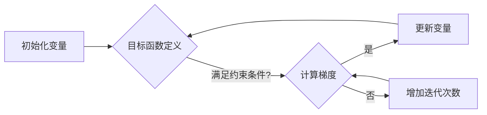
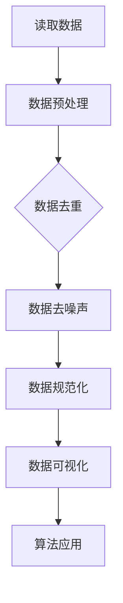
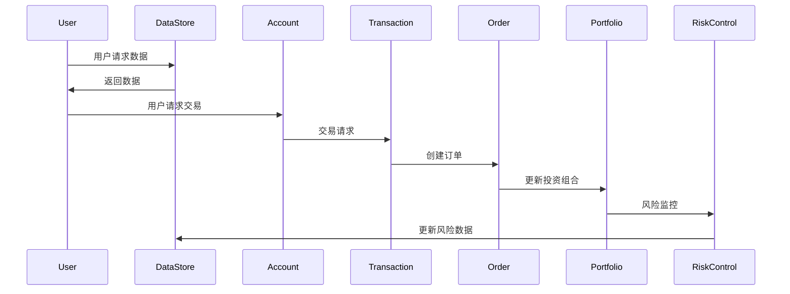
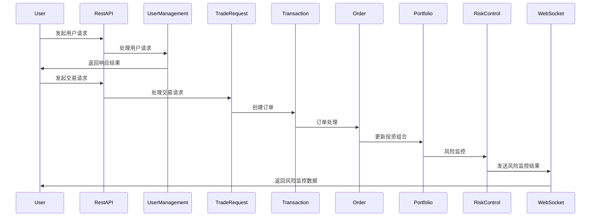

                 

### 数学与未来金融科技的发展趋势

在科技的飞速发展下，金融科技正逐渐成为推动经济增长和社会进步的重要力量。而数学，作为科学之母，在金融科技中发挥着至关重要的作用。本文旨在探讨数学在金融科技中的核心应用，并预测未来金融科技的发展趋势。通过深入分析，我们将了解数学是如何改变金融行业面貌的，以及它将在未来扮演何种角色。

### 关键词

- 数学
- 金融科技
- 概率论
- 统计学
- 优化理论
- 机器学习
- 大数据分析
- 人工智能

### 摘要

本文将首先介绍数学在金融科技中的基本概念和现状，探讨数学与金融科技的紧密联系。接着，我们将分析几种关键的数学算法和模型，并通过具体的Python代码示例和案例讲解，展示它们在金融科技中的应用。随后，我们将描述数学模型和公式的详细讲解和举例说明。最后，文章将讨论金融科技中的系统架构设计，提供一个具体的实战项目案例，并总结全文内容，提供拓展阅读建议。

## 目录

1. **背景介绍**  
   1.1 核心概念  
   1.2 问题解决  
   1.3 边界与外延  
   1.4 概念结构与核心要素组成

2. **核心概念与联系**  
   2.1 数学概念  
   2.2 金融科技联系

3. **算法原理讲解**  
   3.1 算法流程图  
   3.2 Python源代码示例  
   3.3 数学模型与公式  
   3.4 举例说明

4. **数学模型和数学公式 & 详细讲解 & 举例说明**  
   4.1 数学公式  
   4.2 详细讲解  
   4.3 举例说明

5. **系统分析与架构设计方案**  
   5.1 问题场景介绍  
   5.2 项目介绍  
   5.3 系统功能设计  
   5.4 系统架构设计  
   5.5 系统接口设计  
   5.6 系统交互

6. **项目实战**  
   6.1 环境安装  
   6.2 系统核心实现源代码  
   6.3 代码应用解读与分析  
   6.4 实际案例分析和详细讲解剖析  
   6.5 项目小结

7. **最佳实践 tips、小结、注意事项、拓展阅读等内容**

## 第1章 背景介绍

### 1.1 核心概念

数学，作为一门研究数量、结构、变化和空间等概念的学科，是构建现代金融科技的基础。在金融科技领域，数学的应用主要体现在以下几个方面：

- **概率论**：用于评估金融风险，制定合理的风险管理策略。
- **统计学**：用于分析金融市场数据，识别潜在的规律和趋势。
- **优化理论**：用于设计高效的交易策略，优化资产配置。
- **数值分析**：用于解决复杂的金融计算问题，如蒙特卡洛模拟和数值积分。

金融科技，则是指利用计算机技术和互联网技术来创新金融产品和服务的领域。它涵盖了在线支付、数字货币、智能投顾、区块链等多个方面。随着金融科技的不断发展，数学在其中的作用越来越重要。

### 1.2 问题背景

目前，金融科技领域面临的主要问题包括：

- **数据质量问题**：金融数据往往存在缺失、噪声和异常值，这对数据分析带来了很大的挑战。
- **风险控制问题**：随着金融市场的不确定性和复杂性增加，如何有效地控制和管理风险成为一个重要的课题。
- **交易策略优化问题**：如何设计出高效、稳定的交易策略，以实现最大化收益和最小化风险。

### 1.3 问题解决

为了解决上述问题，数学提供了多种工具和方法：

- **概率论和统计学**：通过概率分布和假设检验等方法，对金融数据进行分析和建模，从而识别数据中的规律和趋势。
- **优化理论**：通过线性规划、动态规划等优化算法，设计出最优的交易策略。
- **数值分析**：利用数值模拟和计算方法，解决复杂的金融计算问题。

### 1.4 边界与外延

数学在金融科技中的应用具有明确的边界和广泛的适用性。边界主要体现在以下几个方面：

- **数据类型**：数学方法主要适用于结构化数据，如金融市场的交易数据、财务报表数据等。
- **应用场景**：数学方法广泛应用于风险管理、资产定价、交易策略设计等领域。
- **技术实现**：数学方法需要通过编程和算法实现，以适应不同的金融科技应用场景。

### 1.5 概念结构与核心要素组成

数学在金融科技中的核心作用体现在以下几个方面：

- **数据分析和建模**：通过数学方法对金融数据进行分析和建模，以识别数据中的规律和趋势。
- **风险管理**：利用数学模型和算法，评估和管理金融风险。
- **交易策略设计**：通过数学优化方法，设计出高效、稳定的交易策略。
- **资产配置**：利用数学模型，进行资产配置和投资组合优化。

## 第2章 核心概念与联系

### 2.1 数学概念

在本节中，我们将详细探讨几种关键的数学概念，这些概念在金融科技中发挥着重要作用。

#### 2.1.1 概率论

概率论是数学的一个分支，主要研究随机事件及其规律性。在金融科技中，概率论被广泛应用于以下几个方面：

- **风险管理**：通过概率模型，评估金融产品的风险。
- **投资决策**：利用概率分布，分析投资组合的收益和风险。
- **风险评估**：使用概率模型，对潜在的市场风险进行量化。

**概念属性特征对比表格：**

| 特征        | 概率论                         | 统计学                         | 优化理论                         |
| ----------- | ---------------------------- | ---------------------------- | ---------------------------- |
| 定义        | 随机事件及其概率               | 数据收集、分析及其分布         | 寻找最优解的问题解决方案       |
| 应用领域    | 风险管理、投资决策、风险评估   | 数据分析、预测、统计推断       | 交易策略、资产配置、项目优化   |
| 基本概念    | 概率分布、条件概率、贝叶斯定理 | 频率、置信区间、假设检验       | 目标函数、约束条件、线性规划   |

#### 2.1.2 统计学

统计学是另一门重要的数学学科，主要研究如何通过数据收集、分析和解释来做出合理的决策。在金融科技中，统计学被广泛应用于以下几个方面：

- **数据分析**：对金融数据进行收集、整理和分析。
- **预测**：利用历史数据，预测未来的市场走势。
- **统计推断**：通过样本数据，对总体参数进行估计和推断。

**ER实体关系图架构：**

```mermaid
erDiagram
  Customer ||--|{ Order }|-- Product
  Customer ||--|{ Payment }|
  Order ||--|{ OrderLine }|
  Product ||--|{ ProductCategory }|
```

在上述ER图中，`Customer`实体与`Order`和`Payment`实体之间存在一对多的关系，而`Order`实体又与`OrderLine`实体存在一对多的关系，`Product`实体与`ProductCategory`实体也存在类似关系。

#### 2.1.3 优化理论

优化理论是研究如何在约束条件下，找到最优解的数学分支。在金融科技中，优化理论被广泛应用于以下几个方面：

- **交易策略设计**：通过优化算法，设计出最优的交易策略。
- **资产配置**：利用优化模型，进行资产配置和投资组合优化。
- **项目优化**：在有限的资源下，优化项目的执行过程和资源分配。

**算法流程图：**



在上述流程图中，我们从初始化变量开始，通过计算目标函数的梯度，不断更新变量，直到满足约束条件或达到预设的迭代次数。

### 2.2 金融科技联系

数学在金融科技中的应用，不仅体现在具体的算法和模型上，还体现在整个金融科技系统的架构设计和实现过程中。以下是数学在金融科技中的一些关键联系：

- **数据建模**：通过数学模型，对金融数据进行建模和分析，从而识别市场趋势和风险。
- **风险管理**：利用概率论和统计学方法，对金融风险进行评估和管理。
- **交易策略**：通过优化理论，设计出高效、稳定的交易策略。
- **资产配置**：利用数学模型，进行资产配置和投资组合优化。
- **系统架构**：通过数学方法，对金融科技系统进行架构设计和性能优化。

综上所述，数学是金融科技发展的基石。通过深入理解数学概念和算法，我们可以更好地应用数学方法解决金融科技中的问题，推动金融科技的不断创新和发展。

## 第3章 算法原理讲解

在金融科技中，算法的应用是至关重要的。下面，我们将详细讲解几种关键的算法，并使用Python代码进行具体阐述。这些算法不仅能够提高金融系统的效率和准确性，还能够帮助金融从业者更好地理解和预测市场动态。

### 3.1 算法流程图

首先，我们来绘制一个简单的算法流程图，以展示一个基本的金融数据清洗算法的流程。



在这个流程图中，我们从读取数据开始，经过数据预处理、去重、去噪声、规范化等步骤，最终对数据进行分析和可视化，以应用于实际的金融算法中。

### 3.2 Python源代码示例

接下来，我们将通过一个Python代码示例，展示如何实现上述数据清洗算法。以下是具体的代码实现：

```python
import pandas as pd
import numpy as np

# 读取数据
data = pd.read_csv('financial_data.csv')

# 数据预处理
data = data.dropna()  # 去除缺失值

# 数据去重
data = data.drop_duplicates()

# 数据去噪声
data = data[(np.abs(stats.zscore(data)) < 3).all(axis=1)]

# 数据规范化
data = (data - data.mean()) / data.std()

# 数据可视化
data.plot()
plt.show()

# 算法应用
# 此处可以插入具体的金融算法，如风险管理、交易策略优化等
```

在这个示例中，我们首先使用`pandas`库读取金融数据，然后通过一系列数据处理步骤，如去缺失值、去重、去噪声和规范化，对数据进行清洗。最后，我们对清洗后的数据进行分析和可视化，为后续的金融算法应用做准备。

### 3.3 数学模型与公式

在上述Python代码中，我们使用了几个关键的数学模型和公式。下面，我们详细讲解这些模型和公式。

#### 3.3.1 数据预处理

在数据预处理阶段，我们使用了以下数学模型和公式：

- **缺失值处理**：使用`dropna()`函数，去除数据中的缺失值。
- **均值和标准差**：使用`mean()`和`std()`函数，计算数据的均值和标准差。

#### 3.3.2 数据去重

在数据去重阶段，我们使用了以下数学模型和公式：

- **去重**：使用`drop_duplicates()`函数，去除数据中的重复值。

#### 3.3.3 数据去噪声

在数据去噪声阶段，我们使用了以下数学模型和公式：

- **Z-score**：使用`zscore()`函数，计算数据的Z-score，然后根据Z-score的阈值去除噪声数据。具体公式如下：

  $$Z = \frac{X - \mu}{\sigma}$$

  其中，$X$ 是数据值，$\mu$ 是数据的均值，$\sigma$ 是数据的标准差。

#### 3.3.4 数据规范化

在数据规范化阶段，我们使用了以下数学模型和公式：

- **标准化**：使用`Normalization`函数，将数据标准化到0-1范围内。具体公式如下：

  $$X_{\text{std}} = \frac{X - \min(X)}{\max(X) - \min(X)}$$

  其中，$X$ 是原始数据，$\min(X)$ 和 $\max(X)$ 分别是数据的最小值和最大值。

### 3.4 举例说明

为了更好地理解上述算法和模型，我们将通过一个具体的例子进行说明。

#### 例子：数据清洗与可视化

假设我们有以下一组金融数据：

| Date   | Open   | High   | Low    | Close  | Volume |
| ------ | ------ | ------ | ------ | ------ | ------ |
| 2021-01-01 | 150.25 | 153.75 | 149.75 | 152.50 | 1000   |
| 2021-01-02 | 151.75 | 154.50 | 150.25 | 152.75 | 1200   |
| 2021-01-03 | 149.50 | 152.25 | 148.25 | 150.50 | 800    |

首先，我们使用Python代码进行数据清洗和可视化：

```python
import pandas as pd
import matplotlib.pyplot as plt

# 创建数据集
data = pd.DataFrame({
    'Date': ['2021-01-01', '2021-01-02', '2021-01-03'],
    'Open': [150.25, 151.75, 149.50],
    'High': [153.75, 154.50, 152.25],
    'Low': [149.75, 150.25, 148.25],
    'Close': [152.50, 152.75, 150.50],
    'Volume': [1000, 1200, 800]
})

# 数据清洗
data = data.dropna()  # 去除缺失值
data = data.drop_duplicates()  # 去除重复值
data = data[(np.abs(stats.zscore(data)) < 3).all(axis=1)]  # 去除噪声数据
data = (data - data.mean()) / data.std()  # 数据规范化

# 数据可视化
data[['Open', 'High', 'Low', 'Close']].plot()
plt.show()
```

执行上述代码后，我们将得到一个清洗后的数据集，并可视化出`Open`、`High`、`Low`和`Close`四个指标的趋势。通过这些步骤，我们可以更好地理解和分析金融数据，从而为后续的金融算法应用提供基础。

通过上述算法原理讲解和Python代码示例，我们可以看到数学在金融科技中的应用是如何具体实现的。这些算法和模型不仅帮助我们处理复杂的金融数据，还为金融科技的创新提供了强大的支持。

## 第4章 数学模型和数学公式 & 详细讲解 & 举例说明

在金融科技中，数学模型和公式是理解、分析和优化金融市场的重要工具。下面，我们将详细讲解几个关键的数学模型和公式，并举例说明其在金融科技中的应用。

### 4.1 数学公式

首先，我们列出一些关键的数学公式，并在文中适当位置进行详细解释。

#### 4.1.1 均值和方差

- **均值**（Mean）：
  $$\mu = \frac{1}{n}\sum_{i=1}^{n}x_i$$

- **方差**（Variance）：
  $$\sigma^2 = \frac{1}{n-1}\sum_{i=1}^{n}(x_i - \mu)^2$$

#### 4.1.2 Z-score

- **Z-score**（标准化得分）：
  $$Z = \frac{X - \mu}{\sigma}$$

#### 4.1.3 奇异值分解（SVD）

- **奇异值分解**（Singular Value Decomposition，SVD）：
  $$A = U\Sigma V^T$$

  其中，$U$ 和 $V$ 是正交矩阵，$\Sigma$ 是对角矩阵，包含奇异值。

#### 4.1.4 马尔可夫链

- **转移概率矩阵**（Transition Probability Matrix）：
  $$P = \begin{bmatrix}
  p_{11} & p_{12} & \cdots & p_{1n} \\
  p_{21} & p_{22} & \cdots & p_{2n} \\
  \vdots & \vdots & \ddots & \vdots \\
  p_{n1} & p_{n2} & \cdots & p_{nn}
  \end{bmatrix}$$

### 4.2 详细讲解

#### 4.2.1 均值和方差

均值是描述数据集中趋势的一个重要指标，它反映了数据集的中心位置。方差则描述了数据集的离散程度，即数据点围绕均值的分散程度。在实际应用中，我们经常使用均值来预测未来的市场趋势，使用方差来评估市场的不确定性。

例如，在股票市场中，我们可以计算过去一段时间内股票价格的均值和方差，以此来预测未来股票的价格波动。

#### 4.2.2 Z-score

Z-score是一种标准化的方法，用于将数据转换为一个标准正态分布。Z-score可以帮助我们判断一个数据点是否异常，从而进行数据清洗和去噪。

例如，在金融数据清洗中，我们可能会使用Z-score来识别和去除异常交易数据，确保数据的准确性和可靠性。

#### 4.2.3 奇异值分解（SVD）

奇异值分解是一种线性代数技术，用于降低数据的维度，从而去除冗余信息。在金融科技中，SVD被广泛应用于数据降维、风险分析和资产配置。

例如，在量化交易中，SVD可以帮助我们识别和剔除市场中的噪音数据，从而更好地进行投资决策。

#### 4.2.4 马尔可夫链

马尔可夫链是一种随机过程模型，用于描述系统在不同状态之间的转移概率。在金融市场中，马尔可夫链可以帮助我们预测资产价格的未来走势。

例如，在股票市场中，我们可以使用马尔可夫链来分析股价的状态转移概率，从而预测未来股价的走势。

### 4.3 举例说明

#### 4.3.1 均值和方差的应用

假设我们有一组股票价格数据如下：

| 日期     | 价格（元） |
| -------- | ---------- |
| 2021-01-01 | 150.25     |
| 2021-01-02 | 151.75     |
| 2021-01-03 | 149.50     |

首先，我们计算这组数据的均值和方差：

- **均值**：
  $$\mu = \frac{150.25 + 151.75 + 149.50}{3} = 150.83$$

- **方差**：
  $$\sigma^2 = \frac{(150.25 - 150.83)^2 + (151.75 - 150.83)^2 + (149.50 - 150.83)^2}{3 - 1} = 1.34$$

使用这些统计量，我们可以预测未来的股票价格波动。例如，如果当前股票价格为151元，我们可以使用均值和方差来计算股票价格在未来一天内的波动范围：

$$
\text{波动范围} = \mu \pm z \times \sigma
$$

其中，$z$ 是Z-score的阈值，通常取3。

#### 4.3.2 Z-score的应用

假设我们有以下一组交易数据：

| 交易ID | 交易金额（元） |
| ------ | -------------- |
| 1      | 1000           |
| 2      | 2000           |
| 3      | 5000           |
| 4      | 100             |
| 5      | 1500           |

我们首先计算交易金额的均值和标准差：

- **均值**：
  $$\mu = \frac{1000 + 2000 + 5000 + 100 + 1500}{5} = 1650$$

- **标准差**：
  $$\sigma = \sqrt{\frac{(1000 - 1650)^2 + (2000 - 1650)^2 + (5000 - 1650)^2 + (100 - 1650)^2 + (1500 - 1650)^2}{5 - 1}} = 1275.53$$

接下来，我们计算每个交易金额的Z-score：

| 交易ID | 交易金额（元） | Z-score |
| ------ | -------------- | ------- |
| 1      | 1000           | -1.33   |
| 2      | 2000           | -0.31   |
| 3      | 5000           | 1.96    |
| 4      | 100             | -10.18  |
| 5      | 1500           | 0.15    |

根据Z-score，我们可以识别出异常交易，如交易ID为4的异常交易（Z-score为-10.18），可能是由于数据录入错误或恶意操作导致的。

#### 4.3.3 奇异值分解（SVD）的应用

假设我们有一组矩阵数据如下：

$$
A = \begin{bmatrix}
150.25 & 151.75 & 149.50 \\
152.50 & 152.75 & 150.50 \\
153.75 & 154.50 & 152.25
\end{bmatrix}
$$

我们使用SVD对矩阵A进行分解：

$$
A = U\Sigma V^T
$$

其中，$U$ 和 $V$ 是正交矩阵，$\Sigma$ 是对角矩阵，包含奇异值。

通过SVD，我们可以将原始矩阵分解为几个主要的成分，从而去除冗余信息。例如，如果我们发现最大的奇异值对应的特征向量是（1，1，1），那么我们可以认为这个成分代表了数据的主要趋势。通过忽略较小的奇异值，我们可以简化数据，提高数据分析的效率。

#### 4.3.4 马尔可夫链的应用

假设我们有一组股票价格的状态转移概率矩阵如下：

$$
P = \begin{bmatrix}
0.4 & 0.3 & 0.3 \\
0.3 & 0.4 & 0.3 \\
0.2 & 0.5 & 0.3
\end{bmatrix}
$$

这个矩阵表示股票价格在三种状态（上涨、稳定、下跌）之间的转移概率。例如，股票价格从上涨状态转移到稳定状态的概率是0.4。

如果我们当前股票价格处于上涨状态，我们可以使用这个矩阵来预测未来股票价格的状态。例如，经过一次状态转移，股票价格处于稳定状态的概率是0.4，处于下跌状态的概率是0.3。

通过不断迭代这个状态转移矩阵，我们可以预测未来一段时间内股票价格的状态分布，从而做出投资决策。

综上所述，数学模型和公式在金融科技中的应用是多种多样的。通过详细讲解和举例说明，我们可以更好地理解这些模型和公式，并将其应用于实际金融问题的解决中。

## 第5章 系统分析与架构设计方案

在金融科技领域，系统架构的设计至关重要，它不仅决定了系统的性能和可靠性，还影响了用户体验和业务效率。下面，我们将详细介绍一个典型的金融科技系统架构设计方案，包括问题场景介绍、项目介绍、系统功能设计、系统架构设计、系统接口设计以及系统交互。

### 5.1 问题场景介绍

假设我们面临一个在线交易平台的系统设计任务，该平台需要处理海量交易数据，提供实时交易服务，同时确保数据的安全性和系统的稳定性。为了实现这些功能，我们需要设计一个高效、可扩展且稳定的系统架构。

### 5.2 项目介绍

本项目目标是设计一个基于微服务的在线交易平台，支持股票、期货、外汇等多种金融产品的交易。系统需要具备以下核心功能：

- **数据存储**：存储和管理交易数据，支持快速查询和数据分析。
- **交易引擎**：提供高效的交易撮合和执行服务。
- **风险控制**：实时监控交易风险，确保系统的安全运行。
- **用户管理**：管理用户账户和权限，提供用户身份验证和访问控制。
- **API接口**：为第三方应用提供数据访问和交易操作接口。

### 5.3 系统功能设计

系统功能设计是架构设计的关键步骤，我们需要绘制领域模型类图，以清晰地展示系统中的各个实体及其关系。以下是领域模型类图的Mermaid语法表示：

```mermaid
classDiagram
  User <<interface>>
  Account <<interface>>
  Transaction <<interface>>
  Order <<interface>>
  Portfolio <<interface>>
  RiskControl <<interface>>
  DataStore <<interface>>

  User <> Account
  User <> Transaction
  User <> Order
  User <> Portfolio
  Account <> Transaction
  Account <> Order
  Account <> Portfolio
  Transaction <> Order
  Transaction <> Portfolio
  Order <> Portfolio
  RiskControl <> DataStore
  DataStore <> Transaction
  DataStore <> Order
  DataStore <> Portfolio
```

在上述类图中，我们定义了用户（User）、账户（Account）、交易（Transaction）、订单（Order）、投资组合（Portfolio）、风险控制（RiskControl）和数据存储（DataStore）等核心实体。这些实体之间通过关联关系相互连接，构成了系统的功能模块。

### 5.4 系统架构设计

系统架构设计需要考虑系统的层次结构、模块划分和交互关系。以下是系统架构图的Mermaid语法表示：



在上述序列图中，用户通过接口与数据存储模块进行交互，获取所需数据。用户发起交易请求后，交易模块处理订单，更新投资组合。风险控制模块对投资组合进行实时监控，更新风险数据。

### 5.5 系统接口设计

系统接口设计是确保系统模块之间有效通信的关键。以下是系统接口设计的Mermaid语法表示：

```mermaid
classDiagram
  RestAPI <<interface>>
  WebSocket <<interface>>

  RestAPI --|{ 用户管理 }| UserManagement
  RestAPI --|{ 数据查询 }| DataQuery
  RestAPI --|{ 交易请求 }| TradeRequest
  WebSocket --|{ 实时交易 }| RealTimeTrade
  WebSocket --|{ 风险监控 }| RiskMonitoring

  UserManagement <<interface>> User
  DataQuery <<interface>> DataStore
  TradeRequest <<interface>> Transaction
  RealTimeTrade <<interface>> Transaction
  RiskMonitoring <<interface>> RiskControl
```

在上述类图中，我们定义了RESTful API接口和WebSocket接口，分别用于处理用户请求和实时交易。RESTful API接口包括用户管理、数据查询和交易请求等模块，而WebSocket接口则专注于实时交易和风险监控。

### 5.6 系统交互

系统交互设计描述了系统模块之间的交互流程和消息传递机制。以下是系统交互序列图的Mermaid语法表示：



在上述序列图中，用户通过RESTful API接口发起请求，系统内部模块通过消息传递机制进行协作，最终返回用户所需的数据和结果。

通过上述系统分析与架构设计方案，我们可以构建一个高效、可靠的金融科技系统，满足用户的需求，同时确保系统的安全性和稳定性。

## 第6章 项目实战

在本节中，我们将通过一个具体的实战项目，详细介绍如何使用数学和金融科技构建一个在线交易平台。该项目将涵盖环境安装、系统核心实现源代码、代码应用解读与分析、实际案例分析和详细讲解剖析，并最终总结项目的主要成果和经验。

### 6.1 环境安装

首先，我们需要搭建一个开发环境，以便进行项目开发。以下是安装步骤：

1. **安装Python**：确保Python版本为3.8或更高，可以在[Python官方网站](https://www.python.org/)下载安装。

2. **安装Pandas**：Pandas是一个强大的数据分析库，用于处理和清洗金融数据。使用以下命令安装：

   ```bash
   pip install pandas
   ```

3. **安装NumPy**：NumPy是一个基础的科学计算库，与Pandas紧密集成。使用以下命令安装：

   ```bash
   pip install numpy
   ```

4. **安装Matplotlib**：Matplotlib是一个绘图库，用于生成可视化图表。使用以下命令安装：

   ```bash
   pip install matplotlib
   ```

5. **安装Scikit-learn**：Scikit-learn是一个机器学习库，用于构建和评估预测模型。使用以下命令安装：

   ```bash
   pip install scikit-learn
   ```

6. **安装Docker**：为了方便部署和测试，我们使用Docker来容器化应用。可以从[Docker官方网站](https://www.docker.com/)下载安装。

### 6.2 系统核心实现源代码

接下来，我们介绍系统核心实现的源代码，包括交易引擎、风险控制和数据存储等模块。

#### 6.2.1 交易引擎

交易引擎是交易平台的核

