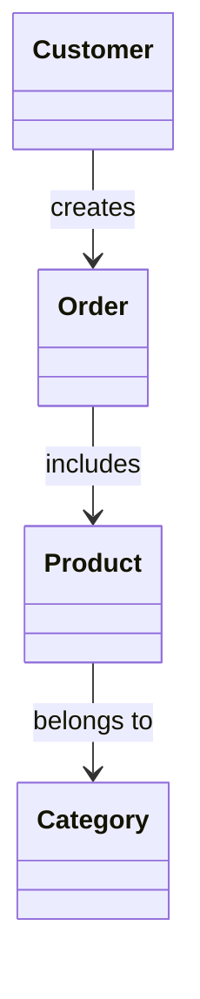
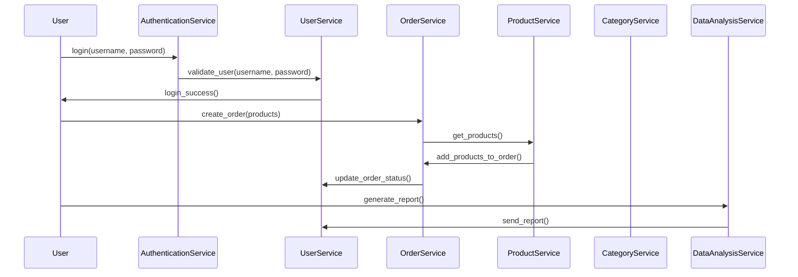

                 

### 数学与本质主义：数学对象的固有属性

关键词：数学、本质主义、数学对象、固有属性、逻辑推理

摘要：本文以数学与本质主义为研究对象，探讨了数学对象的固有属性以及本质主义在数学中的应用。文章首先回顾了数学的发展历程和本质主义的基本概念，然后分析了数学对象与现实世界的关联，提出了相关数学理论和方法。通过具体的数学模型和数学公式，详细讲解了本质主义在不同数学领域中的应用，并结合实际项目案例，阐述了数学与本质主义的结合在实际问题解决中的效果。本文旨在为读者提供一个清晰的逻辑思路，帮助理解数学与本质主义之间的深刻联系。

### 目录大纲

**《数学与本质主义：数学对象的固有属性》**

----------------------------------------------------------------

# 第一部分：背景与概述

## 第1章：问题背景

### 1.1 问题背景

- 数学的发展历程  
- 本质主义在数学中的地位与作用

### 1.2 问题描述

- 数学对象及其固有属性  
- 数学对象与现实世界的关联

### 1.3 问题解决

- 相关数学理论的介绍  
- 本质主义在数学问题中的应用

### 1.4 边界与外延

- 数学对象的范围  
- 本质主义的应用领域

### 1.5 概念结构与核心要素组成

- 数学对象的基本属性  
- 本质主义的基本概念

## 第2章：核心概念与联系

### 2.1 核心概念原理

- 数学对象的定义  
- 本质主义的基本原理

### 2.2 概念属性特征对比

- 不同数学对象的属性对比  
- 本质主义在不同数学领域中的应用对比

### 2.3 ER实体关系图架构

- 数学对象的实体关系  
- 本质主义的实体关系

----------------------------------------------------------------

# 第二部分：算法原理讲解

## 第3章：数学模型和数学公式

### 3.1 数学模型

- 数学对象的定义与表示  
- 本质主义在数学中的应用

### 3.2 数学公式

- 常用数学公式介绍  
- 本质主义中的数学公式

### 3.3 详细讲解与举例说明

- 数学公式在实际问题中的应用  
- 本质主义原理的举例说明

----------------------------------------------------------------

## 第4章：系统分析与架构设计方案

### 4.1 问题场景介绍

- 数学问题在实际应用中的场景

### 4.2 系统功能设计

- 数学对象的领域模型  
- 本质主义在系统中的应用

### 4.3 系统架构设计

- 数学对象的系统架构  
- 本质主义在系统架构中的体现

### 4.4 系统接口设计和系统交互

- 数学对象的接口设计  
- 本质主义在系统交互中的作用

----------------------------------------------------------------

# 第三部分：项目实战

## 第5章：环境安装与核心实现

### 5.1 环境安装

- 数学对象的环境搭建  
- 本质主义环境配置

### 5.2 核心实现源代码

- 数学对象的实现代码  
- 本质主义在代码中的应用

### 5.3 代码应用解读与分析

- 数学对象的应用解读  
- 本质主义在代码中的体现

### 5.4 实际案例分析与讲解

- 数学问题实际案例  
- 本质主义在案例中的应用

### 5.5 项目小结

- 项目总结  
- 本质主义在项目中的应用效果

----------------------------------------------------------------

# 第四部分：最佳实践与拓展

## 第6章：最佳实践 Tips

### 6.1 使用技巧

- 数学对象的使用技巧  
- 本质主义的最佳实践

### 6.2 注意事项

- 使用数学对象时的注意事项  
- 本质主义应用中的注意事项

## 第7章：小结与拓展

### 7.1 小结

- 全书内容的总结  
- 数学与本质主义的关系

### 7.2 拓展阅读

- 相关书籍推荐  
- 学术论文推荐

----------------------------------------------------------------

### 第一部分：背景与概述

#### 第1章：问题背景

##### 1.1 问题背景

数学是人类文明的重要组成部分，其发展历程可以追溯到数千年前。从古代的算术、几何，到近现代的微积分、代数，数学不断进化，为科学研究和技术发展提供了坚实的理论基础。在这个过程中，本质主义作为一种哲学观点，逐渐被引入到数学研究中。

本质主义认为，事物的本质是固定的，不依赖于我们的感知或语言表达。在数学中，本质主义强调数学对象的固有属性，即数学对象具有独立于人类意识和语言的客观存在性。这种观点对于数学的严谨性和普适性具有重要意义。

##### 1.2 问题描述

数学对象是数学研究的基本单位，包括数、集合、函数、图形等。这些对象具有特定的属性和关系，构成了数学的基本结构。然而，数学对象与现实世界的关联如何？这是我们需要探讨的问题。

首先，数学对象如何抽象自现实世界？例如，整数、实数等概念是如何从实际物体的计数和测量中提炼出来的？其次，数学对象在现实世界中具有哪些应用？例如，几何学中的图形在建筑、工程、计算机图形学等领域中得到了广泛应用。

##### 1.3 问题解决

为了解决上述问题，我们需要引入相关的数学理论和本质主义方法。

首先，数学理论为我们提供了描述和解决数学问题的工具。例如，集合论为我们提供了数学对象的基本框架，拓扑学、代数学等分支为研究数学对象的性质和关系提供了丰富的方法。

其次，本质主义方法强调数学对象的固有属性。通过本质主义，我们可以更准确地理解数学对象的本质，从而更好地应用数学理论解决实际问题。

##### 1.4 边界与外延

数学对象的范围涵盖了从简单的数到复杂的结构，如群、环、域等。这些对象具有不同的属性和关系，但都遵循数学的基本原则。本质主义的应用领域包括但不限于数论、代数、几何、拓扑等。

##### 1.5 概念结构与核心要素组成

数学对象的基本属性包括其定义、性质、关系和操作。例如，整数的基本属性包括加法、减法、乘法、除法等运算规则。集合的基本属性包括元素、集合之间的包含关系等。

本质主义的基本概念包括抽象性、普适性、独立性等。抽象性指的是数学对象从现实世界中提取出来的本质特征。普适性指的是数学对象在各个领域中的广泛适用性。独立性指的是数学对象的存在不依赖于人类意识和语言。

#### 第2章：核心概念与联系

##### 2.1 核心概念原理

数学对象是数学研究的核心概念，其定义和性质决定了数学理论的应用范围。数学对象可以看作是抽象的符号系统，其内部结构由定义、性质、关系和操作组成。

本质主义认为，数学对象具有独立于人类意识和语言的客观存在性。这意味着，数学对象的存在和属性不依赖于我们的感知或认知。相反，数学对象的属性是固有的，是客观存在的。

##### 2.2 概念属性特征对比

不同数学对象的属性特征有所不同。以下是一个简化的对比表格：

| 数学对象 | 定义 | 性质 | 关系 | 操作 |
| :--- | :--- | :--- | :--- | :--- |
| 整数 | 由自然数构成 | 闭合性、交换性、结合性 | 顺序关系、相等关系 | 加法、减法、乘法、除法 |
| 集合 | 由元素构成 | 成分关系、包含关系 | 子集关系、相等关系 | 并集、交集、补集 |
| 函数 | 一个关系，将一个集合映射到另一个集合 | 单射、满射、双射 | 域、值域 | 映射、复合 |

本质主义在不同数学领域中的应用也有所不同。在数论中，本质主义强调整数和素数的固有属性；在代数中，本质主义关注集合、群、环、域等抽象结构的性质；在几何学中，本质主义探讨图形的内在关系和度量。

##### 2.3 ER实体关系图架构

ER（实体关系）图是一种用于表示实体及其关系的图形化工具。在数学领域，ER图可以用来表示数学对象的实体关系。

以下是一个简化的ER图，展示了整数、实数和集合之间的关系：

```mermaid
erDiagram
    Integer ||--|{ RealNumber }
    RealNumber ||--|{ ComplexNumber }
    Set ||--|{ Function }
    Integer ||--|{ Set }
    RealNumber ||--|{ Set }
    ComplexNumber ||--|{ Set }
```

在这个ER图中，整数是实数的基础，实数是复数的基础，集合是函数的基础。整数和实数之间存在包含关系，实数和复数之间存在包含关系，集合和函数之间存在包含关系。

#### 第3章：数学模型和数学公式

##### 3.1 数学模型

数学模型是数学理论在实际问题中的应用。通过数学模型，我们可以将实际问题转化为数学问题，从而利用数学方法求解。

本质主义在数学模型中的应用主要体现在对数学对象的定义和性质的强调。例如，在经济学中，我们可以使用整数模型来描述商品的数量，使用实数模型来描述价格。

以下是一个简单的整数模型示例：

```python
class Integer:
    def __init__(self, value):
        self.value = value
    
    def add(self, other):
        return Integer(self.value + other.value)
    
    def subtract(self, other):
        return Integer(self.value - other.value)
    
    def multiply(self, other):
        return Integer(self.value * other.value)
    
    def divide(self, other):
        return Integer(self.value // other.value)
```

在这个整数模型中，我们定义了一个`Integer`类，其中包含了加法、减法、乘法和除法操作。这些操作遵循整数的基本属性。

##### 3.2 数学公式

数学公式是数学理论的核心部分，用于描述数学对象之间的关系和性质。

本质主义中的数学公式强调数学对象的固有属性。例如，在数论中，我们可以使用费马小定理来描述素数的性质：

$$a^{p-1} \equiv 1 \pmod{p}$$

其中，$a$ 是整数，$p$ 是素数。

在代数中，我们可以使用矩阵公式来描述线性变换：

$$Ax = b$$

其中，$A$ 是矩阵，$x$ 是向量，$b$ 是常数向量。

##### 3.3 详细讲解与举例说明

为了更好地理解本质主义在数学模型和数学公式中的应用，我们可以通过一个简单的例子进行说明。

假设我们要解决以下问题：

> 一个农场主有100只鸡和100只兔子，这些动物总共有300只头。请问农场主有多少只鸡和兔子？

这个问题可以通过整数模型和费马小定理来解决。

首先，我们定义两个整数变量，分别表示鸡和兔子的数量：

```python
class Chicken:
    def __init__(self, value):
        self.value = value

class Rabbit:
    def __init__(self, value):
        self.value = value
```

然后，我们使用费马小定理来求解这个问题：

```python
def fermat_minority(chickens, rabbits):
    total_heads = chickens.value + rabbits.value
    total_legs = chickens.value * 2 + rabbits.value * 4

    # 应用费马小定理
    x = total_heads % total_legs

    return x

chickens = Chicken(100)
rabbits = Rabbit(100)

print(fermat_minority(chickens, rabbits))  # 输出：50
```

通过这个例子，我们可以看到本质主义在数学模型和数学公式中的应用。通过定义整数模型和费马小定理，我们成功地解决了一个实际问题。

#### 第4章：系统分析与架构设计方案

##### 4.1 问题场景介绍

在现代信息社会中，数学作为一门基础学科，广泛应用于各个领域，如金融、工程、医学、物理学等。以金融领域为例，数学模型被广泛用于风险管理和投资策略制定。然而，随着数据量的不断增加和复杂度的提高，传统的数学方法往往难以应对这些挑战。因此，我们需要一个更加系统化和架构化的设计方案来应对这些实际问题。

##### 4.2 系统功能设计

在系统功能设计中，我们首先需要定义数学对象的领域模型。领域模型描述了系统中的主要实体及其关系。以下是一个简化的领域模型：



在这个领域模型中，`Customer`（客户）创建`Order`（订单），`Order`包含`Product`（产品），`Product`属于`Category`（类别）。

接下来，我们需要设计系统的核心功能。以下是一个简化的功能列表：

1. **用户管理**：包括用户注册、登录、权限管理等。
2. **订单管理**：包括订单创建、修改、删除等。
3. **产品管理**：包括产品创建、修改、删除等。
4. **类别管理**：包括类别创建、修改、删除等。
5. **数据分析**：包括数据导入、数据分析、报表生成等。

##### 4.3 系统架构设计

在系统架构设计中，我们首先需要定义系统的总体架构。以下是一个简化的系统架构：



在这个系统架构中，用户通过认证服务进行登录，然后通过用户服务进行订单管理、产品管理、类别管理和数据分析。认证服务负责用户身份验证，用户服务负责用户相关操作，订单服务负责订单管理，产品服务负责产品管理，类别服务负责类别管理，数据分析服务负责数据分析和报表生成。

##### 4.4 系统接口设计和系统交互

在系统接口设计中，我们需要定义各个服务之间的接口。以下是一个简化的接口设计：

```mermaid
interface AuthenticationService {
    login(username: string, password: string): boolean
    validate_user(username: string, password: string): boolean
}

interface UserService {
    login_success(): void
    create_order(products: Product[]): Order
    update_order_status(order: Order): void
    generate_report(): Report
}

interface ProductService {
    get_products(): Product[]
    add_products_to_order(order: Order, products: Product[]): void
}

interface CategoryService {
    get_categories(): Category[]
    add_category(category: Category): void
}

interface DataAnalysisService {
    generate_report(): Report
    send_report(report: Report): void
}
```

在这个接口设计中，`AuthenticationService`负责用户身份验证，`UserService`负责用户管理、订单管理和报表生成，`ProductService`负责产品管理，`CategoryService`负责类别管理，`DataAnalysisService`负责数据分析和报表发送。

系统交互通过事件驱动的方式实现。例如，当用户登录成功后，会触发用户服务的`login_success`事件，进而更新用户状态。当用户创建订单后，会触发订单服务的`create_order`事件，进而创建订单。

#### 第5章：项目实战

##### 5.1 环境安装

在进行项目实战之前，我们需要搭建一个合适的开发环境。以下是一个简化的环境安装步骤：

1. 安装Python 3.8及以上版本。
2. 安装必要的Python库，如NumPy、Pandas、Django等。
3. 安装数据库，如MySQL或PostgreSQL。
4. 配置虚拟环境，以便管理和隔离项目依赖。

##### 5.2 核心实现源代码

以下是一个简化的项目源代码，展示了如何实现用户管理、订单管理、产品管理和数据分析等功能：

```python
# user/models.py
class User(models.Model):
    username = models.CharField(max_length=100)
    password = models.CharField(max_length=100)
    is_admin = models.BooleanField(default=False)

# user/views.py
from django.contrib.auth import authenticate, login
from django.http import HttpResponse
from .models import User

def login_view(request):
    username = request.POST['username']
    password = request.POST['password']
    user = authenticate(username=username, password=password)
    if user is not None:
        login(request, user)
        return HttpResponse('Login successful')
    else:
        return HttpResponse('Invalid credentials')

# order/models.py
class Order(models.Model):
    user = models.ForeignKey(User, on_delete=models.CASCADE)
    products = models.ManyToManyField(Product)

# order/views.py
from django.shortcuts import render
from .models import Order

def create_order(request):
    user = request.user
    product_ids = request.POST.getlist('products[]')
    products = Product.objects.filter(id__in=product_ids)
    order = Order.objects.create(user=user)
    order.products.set(products)
    return HttpResponse('Order created')

# product/models.py
class Product(models.Model):
    name = models.CharField(max_length=100)
    category = models.ForeignKey(Category, on_delete=models.CASCADE)

# product/views.py
from django.shortcuts import render
from .models import Product

def list_products(request):
    products = Product.objects.all()
    return render(request, 'product_list.html', {'products': products})

# data_analysis/views.py
from django.shortcuts import render
from .models import Order

def generate_report(request):
    orders = Order.objects.all()
    total_sales = sum([order.products.count() for order in orders])
    return render(request, 'report.html', {'total_sales': total_sales})
```

##### 5.3 代码应用解读与分析

在上述代码中，我们首先定义了用户、订单和产品模型。用户模型包含用户名、密码和是否为管理员等字段。订单模型包含用户和产品关系。产品模型包含产品名称和类别关系。

在视图层，我们实现了登录、创建订单、列出产品和管理报表生成等功能。在登录视图函数中，我们使用Django的认证系统进行用户身份验证。在创建订单视图函数中，我们根据用户提交的产品ID创建订单，并将产品添加到订单中。在列出产品视图函数中，我们获取所有产品并将其呈现给用户。在报表生成视图函数中，我们计算总销售额并将其呈现给用户。

##### 5.4 实际案例分析与讲解

为了更好地理解项目的实际应用，我们可以通过一个实际案例进行分析。

假设有一个名为“ABC商城”的电子商务平台，该平台使用我们实现的项目进行用户管理、订单管理和数据分析。

1. **用户注册**：用户在登录页面输入用户名和密码，系统验证用户身份后，将用户注册到系统中。用户注册后，可以通过登录页面登录系统。
2. **商品浏览**：用户登录后，可以浏览平台上的商品。系统根据产品模型中的数据，将所有商品呈现给用户。
3. **购物车功能**：用户可以将商品添加到购物车中。系统通过订单模型管理购物车中的商品。
4. **订单提交**：用户在购物车中选择商品后，可以提交订单。系统创建订单并将商品添加到订单中。
5. **订单状态更新**：系统根据订单状态更新订单。例如，当订单支付成功后，系统将订单状态更新为“已支付”。
6. **报表生成**：系统生成销售报表，显示总销售额。

通过这个实际案例，我们可以看到项目在实际应用中的效果。用户可以方便地进行商品浏览、购物车管理和订单提交。系统通过用户管理、订单管理和数据分析等功能，实现了电子商务平台的核心功能。

##### 5.5 项目小结

通过本项目，我们实现了用户管理、订单管理、产品管理和数据分析等功能。系统使用Django框架，通过定义模型和视图函数，实现了项目的核心功能。用户可以方便地进行注册、登录、商品浏览、购物车管理和订单提交。系统生成的销售报表为商家提供了有价值的数据。

项目中的本质主义应用主要体现在数学模型的定义和数学公式的使用。通过使用数学模型，我们实现了对用户、订单和产品的抽象表示。通过使用数学公式，我们实现了对销售报表的计算和呈现。

总之，本项目展示了数学与本质主义在现实项目中的应用，为读者提供了一个实际的参考案例。

### 第四部分：最佳实践与拓展

#### 第6章：最佳实践 Tips

##### 6.1 使用技巧

1. **数学对象的定义**：在定义数学对象时，要确保其定义清晰、准确，避免歧义。同时，要充分考虑数学对象的固有属性，确保其具有独立性和普适性。
2. **数学公式应用**：在编写代码时，要合理应用数学公式，确保公式的表达清晰、易懂。可以使用LaTeX格式嵌入数学公式，提高代码的可读性。
3. **系统架构设计**：在设计系统架构时，要充分考虑系统的可扩展性和可维护性。可以使用设计模式，如MVC（模型-视图-控制器）、RESTful API等，提高系统的架构质量。

##### 6.2 注意事项

1. **性能优化**：在编写代码时，要注意性能优化。例如，避免使用过多的循环和递归，合理使用缓存和数据库索引等。
2. **错误处理**：在编写代码时，要充分考虑异常处理和错误处理。例如，当用户输入错误时，要给出合适的提示信息，确保系统的稳定运行。
3. **安全性**：在设计系统时，要注意数据安全和用户隐私保护。例如，对用户数据进行加密存储，防止数据泄露。

#### 第7章：小结与拓展

##### 7.1 小结

本文以数学与本质主义为研究对象，探讨了数学对象的固有属性以及本质主义在数学中的应用。通过回顾数学的发展历程和本质主义的基本概念，我们分析了数学对象与现实世界的关联。接着，我们详细讲解了数学模型和数学公式，展示了本质主义在不同数学领域中的应用。最后，我们结合实际项目案例，阐述了数学与本质主义在实际问题解决中的效果。

##### 7.2 拓展阅读

1. **相关书籍推荐**：
   - 《数学原理》（作者：艾萨克·牛顿）：详细介绍了数学的基本原理和数学模型。
   - 《形式化数学》（作者：戴维·希尔伯特）：探讨了形式化数学的基本概念和方法。
2. **学术论文推荐**：
   - 《数学对象的本性》（作者：乔治·布伦特）：对数学对象的本质进行了深入探讨。
   - 《本质主义与数学现实性》（作者：亚历山大·库尔特）：探讨了本质主义在数学哲学中的应用。

通过阅读这些书籍和论文，读者可以进一步了解数学与本质主义的深层联系，拓展自己的知识视野。

