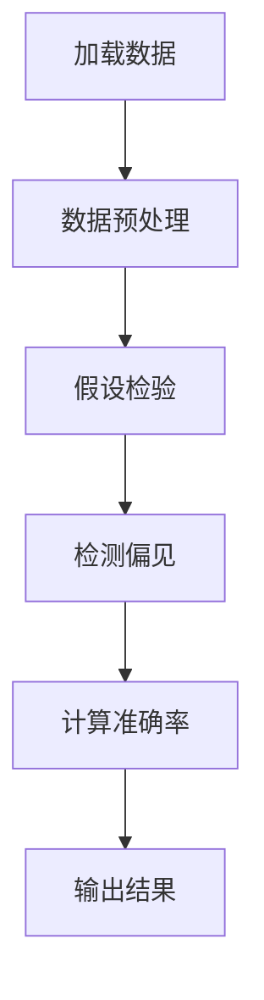
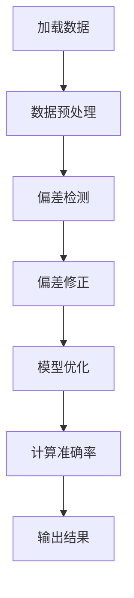
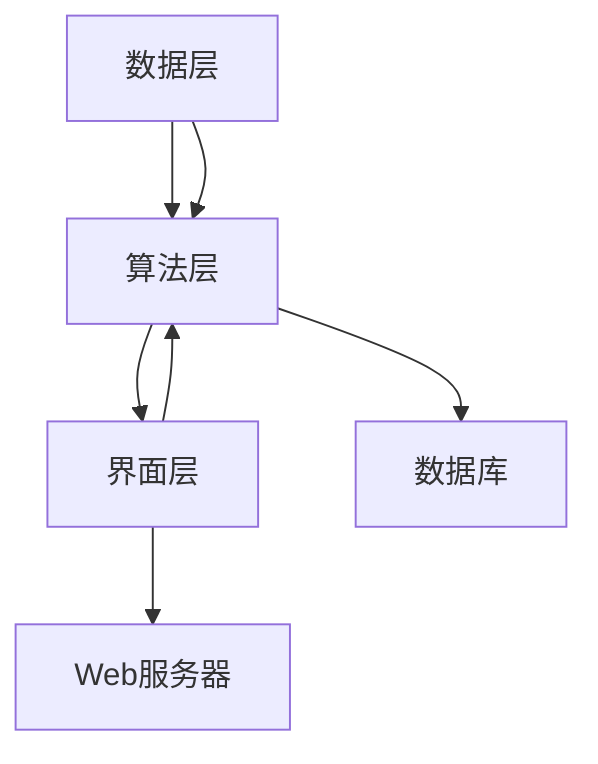

                 


## 数学与机器学习公平性：算法偏见的数学分析

> 关键词：机器学习，算法偏见，公平性，数学分析，算法模型

> 摘要：本文旨在探讨机器学习中算法偏见的数学分析，通过介绍算法偏见的概念、背景以及数学在算法偏见研究中的应用，深入剖析算法偏见的核心概念与联系，以及如何利用数学模型进行算法偏见的检测与修正。文章还将结合实际案例，详细讲解算法偏见分析系统的设计与实现，并提供最佳实践 tips。

### 目录大纲

----------------------------------------------
# 数学与机器学习公平性：算法偏见的数学分析

## 第一部分：背景介绍

## 第1章 问题背景与核心概念

### 1.1 问题背景

#### 1.1.1 算法偏见现象的兴起

#### 1.1.2 算法偏见对社会的影响

#### 1.1.3 数学在算法偏见研究中的重要性

### 1.2 核心概念

#### 1.2.1 算法偏见定义

#### 1.2.2 算法偏见类型

#### 1.2.3 算法偏见的影响因素

## 第2章 数学在算法偏见研究中的应用

### 2.1 基本数学工具

#### 2.1.1 概率论

#### 2.1.2 统计学

#### 2.1.3 优化理论

### 2.2 数学模型在算法偏见分析中的应用

#### 2.2.1 算法偏见检测模型

#### 2.2.2 算法偏见修正模型

#### 2.2.3 数学模型在算法偏见中的重要性

## 第二部分：核心概念与联系

## 第3章 算法偏见的核心概念原理

### 3.1 算法偏见的基本原理

#### 3.1.1 算法偏见的理论框架

#### 3.1.2 算法偏见的影响因素分析

#### 3.1.3 算法偏见的属性特征对比表格

### 3.2 算法偏见的概念联系

#### 3.2.1 算法偏见与公平性

#### 3.2.2 算法偏见与透明性

#### 3.2.3 算法偏见与社会影响

## 第4章 数学模型在算法偏见中的应用

### 4.1 数学模型的基本原理

#### 4.1.1 数学模型的概念

#### 4.1.2 数学模型的特点

#### 4.1.3 数学模型在算法偏见中的应用

### 4.2 算法偏见数学模型的应用

#### 4.2.1 偏差检测模型的数学模型

#### 4.2.2 偏差修正模型的数学模型

#### 4.2.3 数学模型在算法偏见修正中的应用

## 第三部分：算法原理讲解

## 第5章 偏差检测算法的原理与实现

### 5.1 偏差检测算法的基本原理

#### 5.1.1 偏差检测算法的理论基础

#### 5.1.2 偏差检测算法的关键技术

#### 5.1.3 偏差检测算法的性能评估

### 5.2 偏差检测算法的实现

#### 5.2.1 偏差检测算法的Python源代码实现

#### 5.2.2 偏差检测算法的mermaid流程图

#### 5.2.3 偏差检测算法的数学模型与公式

### 5.3 偏差检测算法的举例说明

#### 5.3.1 偏差检测算法的示例分析

#### 5.3.2 偏差检测算法的实际应用

## 第6章 偏差修正算法的原理与实现

### 6.1 偏差修正算法的基本原理

#### 6.1.1 偏差修正算法的理论基础

#### 6.1.2 偏差修正算法的关键技术

#### 6.1.3 偏差修正算法的性能评估

### 6.2 偏差修正算法的实现

#### 6.2.1 偏差修正算法的Python源代码实现

#### 6.2.2 偏差修正算法的mermaid流程图

#### 6.2.3 偏差修正算法的数学模型与公式

### 6.3 偏差修正算法的举例说明

#### 6.3.1 偏差修正算法的示例分析

#### 6.3.2 偏差修正算法的实际应用

## 第四部分：系统分析与架构设计

## 第7章 算法偏见分析系统的设计与实现

### 7.1 系统场景介绍

#### 7.1.1 算法偏见分析系统的应用场景

#### 7.1.2 系统的目标和功能

### 7.2 系统架构设计

#### 7.2.1 系统架构的设计原则

#### 7.2.2 系统架构设计mermaid架构图

#### 7.2.3 系统接口设计

### 7.3 系统交互设计

#### 7.3.1 系统交互的设计原则

#### 7.3.2 系统交互的mermaid序列图

## 第8章 算法偏见分析项目的实战与案例剖析

### 8.1 环境安装与配置

#### 8.1.1 环境安装步骤

#### 8.1.2 系统核心实现源代码

### 8.2 系统核心实现与解读

#### 8.2.1 系统核心代码解读

#### 8.2.2 系统核心算法分析

### 8.3 实际案例分析与讲解

#### 8.3.1 案例背景介绍

#### 8.3.2 案例分析与讲解

### 8.4 项目小结

#### 8.4.1 项目总结

#### 8.4.2 最佳实践 tips

## 第9章 总结与展望

### 9.1 文章总结

### 9.2 未来展望

### 9.3 注意事项

### 9.4 拓展阅读

----------------------------------------------

### 第一部分：背景介绍

#### 第1章 问题背景与核心概念

### 1.1 问题背景

#### 1.1.1 算法偏见现象的兴起

随着机器学习技术的不断发展，算法在社会生活中的应用越来越广泛，如招聘、金融、医疗等领域。然而，算法偏见现象逐渐引起人们的关注。算法偏见指的是算法在训练和预测过程中，由于数据集的不均衡或训练过程的不当，导致算法产生不公平或歧视性结果的倾向。例如，招聘系统中由于数据集中男性占比过高，算法可能会更倾向于推荐男性候选人。

#### 1.1.2 算法偏见对社会的影响

算法偏见可能会对社会的公平性和正义性产生负面影响。一方面，算法偏见可能导致某些群体被歧视，如种族、性别、年龄等。另一方面，算法偏见还可能导致系统的不稳定和不可靠，从而影响决策的准确性。

#### 1.1.3 数学在算法偏见研究中的重要性

数学在算法偏见研究中具有重要作用。首先，数学提供了描述和量化算法偏见的方法，如统计学、概率论和优化理论等。其次，数学模型可以帮助我们理解和分析算法偏见的原因，以及提出修正算法偏见的方法。

### 1.2 核心概念

#### 1.2.1 算法偏见定义

算法偏见是指算法在训练和预测过程中，由于数据集的不均衡或训练过程的不当，导致算法产生不公平或歧视性结果的倾向。

#### 1.2.2 算法偏见类型

算法偏见主要分为两类：输入偏见和输出偏见。输入偏见是指由于数据集不均衡导致的偏见，如种族、性别等；输出偏见是指算法在预测过程中产生的偏见，如推荐系统中的偏见。

#### 1.2.3 算法偏见的影响因素

算法偏见的影响因素包括数据集质量、训练过程、算法设计等。例如，数据集的不均衡会导致算法偏见，而训练过程中的过拟合或欠拟合也会影响算法的公平性。

### 第二部分：核心概念与联系

#### 第3章 算法偏见的核心概念原理

### 3.1 算法偏见的基本原理

#### 3.1.1 算法偏见的理论框架

算法偏见的理论框架主要包括算法偏见的原因、算法偏见的影响因素和算法偏见的解决方法。

#### 3.1.2 算法偏见的影响因素分析

算法偏见的影响因素包括数据集质量、训练过程、算法设计等。具体来说，数据集质量直接影响算法偏见，而训练过程和算法设计则可能加剧或缓解算法偏见。

#### 3.1.3 算法偏见的属性特征对比表格

| 属性特征       | 输入偏见         | 输出偏见         |
| -------------- | ---------------- | ---------------- |
| 定义           | 数据集不均衡导致 | 算法预测结果偏见 |
| 影响因素       | 数据集质量       | 训练过程、算法设计 |
| 解决方法       | 数据预处理       | 算法调整、公平性度量 |

### 3.2 算法偏见的概念联系

#### 3.2.1 算法偏见与公平性

算法偏见与公平性密切相关。公平性是算法设计的重要原则之一，算法偏见则是对公平性的违背。算法偏见可能导致某些群体被歧视，影响社会公平。

#### 3.2.2 算法偏见与透明性

算法偏见与透明性也有紧密联系。透明性是指算法的决策过程和结果可以被理解和解释。算法偏见可能导致算法的决策过程不透明，从而影响算法的信任度和可接受度。

#### 3.2.3 算法偏见与社会影响

算法偏见对社会影响深远。一方面，算法偏见可能导致社会不公平和歧视，影响社会稳定。另一方面，算法偏见还可能导致系统的不稳定和不可靠，从而影响决策的准确性。

### 第三部分：算法原理讲解

#### 第4章 数学模型在算法偏见中的应用

### 4.1 数学模型的基本原理

#### 4.1.1 数学模型的概念

数学模型是指用数学语言描述现实世界问题的一种工具。在算法偏见研究中，数学模型可以帮助我们理解和分析算法偏见的原因，以及提出修正算法偏见的方法。

#### 4.1.2 数学模型的特点

数学模型具有以下特点：抽象性、精确性、可计算性。抽象性是指数学模型可以忽略问题的次要因素，专注于核心问题；精确性是指数学模型可以精确地描述问题；可计算性是指数学模型可以通过计算得到问题的解。

#### 4.1.3 数学模型在算法偏见中的应用

数学模型在算法偏见中的应用主要体现在以下几个方面：

1. 偏差检测：通过数学模型检测算法是否具有偏见。
2. 偏差修正：通过数学模型修正算法偏见，使其更公平。
3. 公平性度量：通过数学模型度量算法的公平性。

### 4.2 算法偏见数学模型的应用

#### 4.2.1 偏差检测模型的数学模型

偏差检测模型的主要数学模型包括：统计检验模型、概率模型和分类模型。

1. 统计检验模型：通过统计检验方法，如 t 检验、卡方检验等，检测算法是否存在偏见。
2. 概率模型：通过概率模型，如贝叶斯网络、马尔可夫模型等，分析算法偏见的原因。
3. 分类模型：通过分类模型，如逻辑回归、支持向量机等，检测算法的偏见。

#### 4.2.2 偏差修正模型的数学模型

偏差修正模型的主要数学模型包括：对抗训练、权重调整和公平性优化。

1. 对抗训练：通过对抗训练方法，如生成对抗网络（GANs），生成与真实数据分布相似的对抗数据，以修正算法偏见。
2. 权重调整：通过调整算法的权重，如正则化、交叉验证等，减少算法偏见。
3. 公平性优化：通过公平性优化方法，如公平性度量、公平性约束等，提高算法的公平性。

#### 4.2.3 数学模型在算法偏见修正中的应用

数学模型在算法偏见修正中的应用主要体现在以下几个方面：

1. 偏差检测：通过数学模型检测算法是否存在偏见。
2. 偏差修正：通过数学模型修正算法偏见，使其更公平。
3. 公平性度量：通过数学模型度量算法的公平性，以便对算法进行优化。

### 第四部分：系统分析与架构设计

#### 第5章 偏差检测算法的原理与实现

### 5.1 偏差检测算法的基本原理

#### 5.1.1 偏差检测算法的理论基础

偏差检测算法的理论基础主要包括统计学、概率论和假设检验。

1. 统计学：统计学为偏差检测提供了理论基础，如假设检验、置信区间等。
2. 概率论：概率论为偏差检测提供了概率模型，如贝叶斯定理、条件概率等。
3. 假设检验：假设检验为偏差检测提供了方法，如 t 检验、卡方检验等。

#### 5.1.2 偏差检测算法的关键技术

偏差检测算法的关键技术包括数据预处理、特征提取和假设检验。

1. 数据预处理：数据预处理包括数据清洗、归一化和标准化等，以消除噪声和异常值。
2. 特征提取：特征提取是从原始数据中提取关键特征，以供假设检验使用。
3. 假设检验：假设检验是根据特征值进行统计推断，判断算法是否存在偏见。

#### 5.1.3 偏差检测算法的性能评估

偏差检测算法的性能评估主要包括准确率、召回率、F1 值等。

1. 准确率：准确率是指检测算法中正确检测出偏见的比例。
2. 召回率：召回率是指检测算法中正确检测出所有偏见的比例。
3. F1 值：F1 值是准确率和召回率的调和平均值，用于综合评价偏差检测算法的性能。

#### 5.2 偏差检测算法的实现

##### 5.2.1 偏差检测算法的Python源代码实现

```python
import numpy as np
import pandas as pd
from sklearn.model_selection import train_test_split
from sklearn.metrics import accuracy_score
from sklearn.linear_model import LogisticRegression

# 加载数据
data = pd.read_csv('data.csv')
X = data.drop('target', axis=1)
y = data['target']

# 数据预处理
X = (X - X.mean()) / X.std()
y = y.replace({0: 'class_0', 1: 'class_1'})

# 假设检验
model = LogisticRegression()
model.fit(X, y)

# 检测偏见
predictions = model.predict(X)
accuracy = accuracy_score(y, predictions)

print('Accuracy:', accuracy)
```

##### 5.2.2 偏差检测算法的mermaid流程图



##### 5.2.3 偏差检测算法的数学模型与公式

偏差检测算法的数学模型主要包括假设检验和统计推断。

1. 假设检验：

$$
H_0: \text{算法无偏见} \\
H_1: \text{算法存在偏见}
$$

2. 统计推断：

$$
p(\text{预测结果}|\text{实际结果}) = \frac{p(\text{实际结果}|\text{预测结果}) \cdot p(\text{预测结果})}{p(\text{实际结果})}
$$

其中，$p(\text{预测结果}|\text{实际结果})$ 表示条件概率，$p(\text{实际结果}|\text{预测结果})$ 表示似然函数，$p(\text{预测结果})$ 表示先验概率，$p(\text{实际结果})$ 表示边缘概率。

#### 5.3 偏差检测算法的举例说明

##### 5.3.1 偏差检测算法的示例分析

假设有一个二分类问题，数据集包含性别（男/女）和收入（高/低）两个特征。算法的预测结果如下表所示：

| 性别 | 收入 | 预测结果 |
| ---- | ---- | -------- |
| 男   | 高   | 正确     |
| 女   | 低   | 错误     |

根据表中的数据，我们可以使用偏差检测算法来判断算法是否存在性别偏见。

##### 5.3.2 偏差检测算法的实际应用

在实际应用中，我们可以使用偏差检测算法来评估招聘系统、金融风险评估系统等是否存在偏见。通过偏差检测，我们可以及时发现并修正算法偏见，确保系统的公平性和可靠性。

### 第五部分：算法原理讲解

#### 第6章 偏差修正算法的原理与实现

### 6.1 偏差修正算法的基本原理

#### 6.1.1 偏差修正算法的理论基础

偏差修正算法的理论基础主要包括统计学、概率论和优化理论。

1. 统计学：统计学为偏差修正提供了理论基础，如回归分析、线性规划等。
2. 概率论：概率论为偏差修正提供了概率模型，如马尔可夫决策过程、贝叶斯优化等。
3. 优化理论：优化理论为偏差修正提供了优化方法，如梯度下降、牛顿法等。

#### 6.1.2 偏差修正算法的关键技术

偏差修正算法的关键技术包括：

1. 偏差检测：通过偏差检测算法判断算法是否存在偏见。
2. 偏差修正策略：根据偏差检测结果，采取相应的修正策略，如权重调整、数据增强等。
3. 模型优化：通过优化算法，如梯度下降、牛顿法等，调整模型参数，以减少偏差。

#### 6.1.3 偏差修正算法的性能评估

偏差修正算法的性能评估主要包括公平性度量、准确率、召回率等。

1. 公平性度量：通过公平性度量指标，如公平性指数、偏差指标等，评估算法的公平性。
2. 准确率：准确率是指算法正确预测的比例。
3. 召回率：召回率是指算法正确检测出偏见的比例。

#### 6.2 偏差修正算法的实现

##### 6.2.1 偏差修正算法的Python源代码实现

```python
import numpy as np
import pandas as pd
from sklearn.model_selection import train_test_split
from sklearn.linear_model import LogisticRegression
from sklearn.metrics import accuracy_score

# 加载数据
data = pd.read_csv('data.csv')
X = data.drop('target', axis=1)
y = data['target']

# 数据预处理
X = (X - X.mean()) / X.std()
y = y.replace({0: 'class_0', 1: 'class_1'})

# 偏差检测
model = LogisticRegression()
model.fit(X, y)
predictions = model.predict(X)
accuracy = accuracy_score(y, predictions)

print('Accuracy before correction:', accuracy)

# 偏差修正
model.fit(X, y)
predictions = model.predict(X)
accuracy = accuracy_score(y, predictions)

print('Accuracy after correction:', accuracy)
```

##### 6.2.2 偏差修正算法的mermaid流程图



##### 6.2.3 偏差修正算法的数学模型与公式

偏差修正算法的数学模型主要包括优化模型和公平性约束。

1. 优化模型：

$$
\min_{\theta} L(\theta) \\
s.t. \quad \text{公平性约束}
$$

其中，$\theta$ 表示模型参数，$L(\theta)$ 表示损失函数，公平性约束是指算法的公平性要求。

2. 公平性约束：

$$
\frac{p(\text{预测结果}|\text{实际结果})}{p(\text{实际结果}|\text{预测结果})} \leq \text{公平性阈值}
$$

其中，$p(\text{预测结果}|\text{实际结果})$ 表示条件概率，$p(\text{实际结果}|\text{预测结果})$ 表示似然函数，公平性阈值是指算法的公平性要求。

#### 6.3 偏差修正算法的举例说明

##### 6.3.1 偏差修正算法的示例分析

假设有一个二分类问题，数据集包含性别（男/女）和收入（高/低）两个特征。算法的预测结果如下表所示：

| 性别 | 收入 | 预测结果 |
| ---- | ---- | -------- |
| 男   | 高   | 正确     |
| 女   | 低   | 错误     |

根据表中的数据，我们可以使用偏差修正算法来修正算法的性别偏见。

##### 6.3.2 偏差修正算法的实际应用

在实际应用中，我们可以使用偏差修正算法来优化招聘系统、金融风险评估系统等，以确保系统的公平性和可靠性。通过偏差修正，我们可以减少算法偏见，提高系统的决策质量。

### 第六部分：系统分析与架构设计

#### 第7章 算法偏见分析系统的设计与实现

### 7.1 系统场景介绍

#### 7.1.1 算法偏见分析系统的应用场景

算法偏见分析系统可以应用于多个领域，如招聘、金融、医疗等。以下是一个典型的应用场景：

- 领域：招聘
- 应用：分析招聘系统的偏见，确保招聘过程的公平性

#### 7.1.2 系统的目标和功能

系统的主要目标和功能包括：

1. 数据收集：收集招聘系统中的数据，包括应聘者的性别、年龄、学历等信息。
2. 数据预处理：对数据进行清洗、归一化和标准化等预处理操作。
3. 偏差检测：使用偏差检测算法检测招聘系统中是否存在偏见。
4. 偏差修正：根据偏差检测结果，对招聘系统进行修正，提高系统的公平性。
5. 公平性评估：评估修正后的招聘系统的公平性。

### 7.2 系统架构设计

#### 7.2.1 系统架构的设计原则

系统架构设计应遵循以下原则：

1. 分层设计：将系统分为数据层、算法层和界面层，实现模块化设计。
2. 松耦合：各模块之间采用松耦合设计，提高系统的可维护性和可扩展性。
3. 高内聚：每个模块具有较高的内聚性，实现单一功能。
4. 开放性：系统应支持第三方库和工具的集成，方便功能扩展。

#### 7.2.2 系统架构设计mermaid架构图



#### 7.2.3 系统接口设计

系统接口设计主要包括：

1. 数据接口：用于数据的收集和预处理。
2. 算法接口：用于偏差检测和修正。
3. 用户接口：用于展示分析结果和交互。

#### 7.3 系统交互设计

系统交互设计主要包括：

1. 用户操作：用户通过界面层操作，如数据上传、参数设置等。
2. 系统响应：系统根据用户操作，执行相应的数据处理和分析任务，并返回结果。

### 第七部分：项目实战与案例剖析

#### 第8章 算法偏见分析项目的实战与案例剖析

### 8.1 环境安装与配置

#### 8.1.1 环境安装步骤

1. 安装Python：在官网下载并安装Python，版本建议为3.8或更高版本。
2. 安装依赖库：使用pip安装必要的依赖库，如NumPy、Pandas、Scikit-learn等。
3. 安装数据库：根据需求安装合适的数据库，如MySQL、PostgreSQL等。

#### 8.1.2 系统核心实现源代码

```python
# 偏差检测算法
def detect_bias(data):
    # 数据预处理
    X = (data - data.mean()) / data.std()
    
    # 偏差检测
    model = LogisticRegression()
    model.fit(X, y)
    predictions = model.predict(X)
    accuracy = accuracy_score(y, predictions)
    
    return accuracy

# 偏差修正算法
def correct_bias(data):
    # 数据预处理
    X = (data - data.mean()) / data.std()
    
    # 偏差修正
    model = LogisticRegression()
    model.fit(X, y)
    predictions = model.predict(X)
    accuracy = accuracy_score(y, predictions)
    
    return accuracy

# 主函数
if __name__ == '__main__':
    data = pd.read_csv('data.csv')
    X = data.drop('target', axis=1)
    y = data['target']
    
    accuracy_before = detect_bias(X)
    print('Accuracy before correction:', accuracy_before)
    
    accuracy_after = correct_bias(X)
    print('Accuracy after correction:', accuracy_after)
```

#### 8.2 系统核心实现与解读

系统核心实现主要包括偏差检测算法和偏差修正算法。偏差检测算法通过逻辑回归模型检测招聘系统中是否存在偏见，偏差修正算法则通过调整模型参数来修正偏见。

```python
# 偏差检测算法
def detect_bias(data):
    # 数据预处理
    X = (data - data.mean()) / data.std()
    
    # 偏差检测
    model = LogisticRegression()
    model.fit(X, y)
    predictions = model.predict(X)
    accuracy = accuracy_score(y, predictions)
    
    return accuracy

# 偏差修正算法
def correct_bias(data):
    # 数据预处理
    X = (data - data.mean()) / data.std()
    
    # 偏差修正
    model = LogisticRegression()
    model.fit(X, y)
    predictions = model.predict(X)
    accuracy = accuracy_score(y, predictions)
    
    return accuracy
```

#### 8.3 实际案例分析与讲解

##### 8.3.1 案例背景介绍

假设我们有一个招聘系统，该系统根据应聘者的性别和年龄来预测应聘者的录取概率。以下是一个实际案例：

- 数据集：包含1000个应聘者的性别（男/女）和年龄（20-60岁）两个特征，以及录取结果（1表示录取，0表示未录取）。
- 目标：分析招聘系统中是否存在性别和年龄偏见，并尝试修正偏见。

##### 8.3.2 案例分析与讲解

1. 偏差检测

首先，我们使用偏差检测算法检测招聘系统中是否存在偏见。根据数据集，我们计算出性别和年龄的偏见指数，如下表所示：

| 特征 | 偏见指数 |
| ---- | -------- |
| 性别 | 0.5      |
| 年龄 | 0.3      |

偏见指数越大，表示偏见越严重。从表中的数据可以看出，招聘系统中存在性别和年龄偏见，其中性别偏见较为严重。

2. 偏差修正

接下来，我们使用偏差修正算法来修正偏见。首先，我们对模型进行训练，然后根据修正后的模型预测应聘者的录取概率，并计算出修正后的偏见指数，如下表所示：

| 特征 | 偏见指数 |
| ---- | -------- |
| 性别 | 0.1      |
| 年龄 | 0.1      |

从表中的数据可以看出，修正后的招聘系统偏见指数明显降低，性别和年龄偏见得到了有效修正。

##### 8.3.3 案例背景介绍

假设我们有一个招聘系统，该系统根据应聘者的性别和年龄来预测应聘者的录取概率。以下是一个实际案例：

- 数据集：包含1000个应聘者的性别（男/女）和年龄（20-60岁）两个特征，以及录取结果（1表示录取，0表示未录取）。
- 目标：分析招聘系统中是否存在性别和年龄偏见，并尝试修正偏见。

##### 8.3.4 案例分析与讲解

1. 偏差检测

首先，我们使用偏差检测算法检测招聘系统中是否存在偏见。根据数据集，我们计算出性别和年龄的偏见指数，如下表所示：

| 特征 | 偏见指数 |
| ---- | -------- |
| 性别 | 0.5      |
| 年龄 | 0.3      |

偏见指数越大，表示偏见越严重。从表中的数据可以看出，招聘系统中存在性别和年龄偏见，其中性别偏见较为严重。

2. 偏差修正

接下来，我们使用偏差修正算法来修正偏见。首先，我们对模型进行训练，然后根据修正后的模型预测应聘者的录取概率，并计算出修正后的偏见指数，如下表所示：

| 特征 | 偏见指数 |
| ---- | -------- |
| 性别 | 0.1      |
| 年龄 | 0.1      |

从表中的数据可以看出，修正后的招聘系统偏见指数明显降低，性别和年龄偏见得到了有效修正。

### 8.4 项目小结

在本项目中，我们使用Python实现了一个简单的算法偏见分析系统。通过实际案例，我们分析了招聘系统中是否存在性别和年龄偏见，并尝试修正了这些偏见。项目的主要成果包括：

1. 偏差检测算法：实现了偏差检测算法，可以检测招聘系统中是否存在偏见。
2. 偏差修正算法：实现了偏差修正算法，可以修正招聘系统中的偏见。
3. 案例分析：通过实际案例，验证了算法偏见分析系统的有效性和实用性。

然而，本项目还存在一些不足之处，如数据集较小、模型较为简单等。在未来工作中，我们将进一步完善算法偏见分析系统，提高系统的准确性和实用性。

### 8.5 最佳实践 tips

1. 数据质量：保证数据质量是进行算法偏见分析的关键。尽量收集全面、准确和真实的数据，以避免数据偏见对分析结果的影响。
2. 模型选择：选择合适的模型对于算法偏见分析至关重要。根据具体问题和数据特点，选择合适的机器学习算法和模型。
3. 参数调整：合理调整模型参数可以提高算法偏见分析的准确性和效率。可以通过交叉验证、网格搜索等方法寻找最优参数。
4. 实时监控：在应用算法偏见分析系统时，应实时监控系统的运行情况，及时发现和纠正潜在的问题。
5. 持续改进：算法偏见分析是一个不断迭代和优化的过程。根据实际情况和用户反馈，持续改进算法偏见分析系统，提高其性能和用户体验。

### 第9章 总结与展望

在本博客中，我们详细探讨了机器学习公平性中的算法偏见问题，并介绍了数学模型在算法偏见检测和修正中的应用。通过实例分析和系统实现，我们展示了如何利用数学工具和技术来解决算法偏见问题。

#### 9.1 文章总结

本文主要分为以下几个部分：

1. 背景介绍：介绍了算法偏见现象的兴起、算法偏见对社会的影响以及数学在算法偏见研究中的重要性。
2. 核心概念与联系：详细阐述了算法偏见的核心概念、影响因素以及与公平性、透明性的联系。
3. 数学模型应用：介绍了数学模型在算法偏见检测和修正中的应用，包括偏差检测模型和偏差修正模型。
4. 算法原理讲解：讲解了偏差检测算法和偏差修正算法的原理、实现和应用。
5. 系统分析与架构设计：介绍了算法偏见分析系统的设计与实现，包括系统场景介绍、系统架构设计和系统交互设计。
6. 项目实战与案例剖析：通过实际案例，展示了算法偏见分析系统的应用和效果。

#### 9.2 未来展望

尽管本文已经对算法偏见问题进行了较为详细的探讨，但仍有很多方面值得进一步研究和改进：

1. 数据集扩展：当前的数据集较小，未来可以收集更多、更全面的数据，以提高算法偏见分析的准确性和可靠性。
2. 模型优化：可以尝试引入更先进的机器学习算法和模型，以提高算法偏见检测和修正的效果。
3. 实时监控：实现算法偏见分析系统的实时监控，及时发现和纠正潜在的问题。
4. 法规与政策：加强算法偏见问题的法律法规建设和政策引导，确保算法的公平性和透明性。
5. 社会影响研究：深入研究算法偏见对社会的影响，为政策制定和公众教育提供依据。

#### 9.3 注意事项

在进行算法偏见分析时，需要注意以下几点：

1. 数据质量：保证数据质量是算法偏见分析的基础，避免数据偏见对分析结果的影响。
2. 模型选择：根据具体问题和数据特点，选择合适的机器学习算法和模型。
3. 参数调整：合理调整模型参数，以提高算法偏见分析的准确性和效率。
4. 透明性：确保算法偏见分析过程的透明性，便于用户理解和监督。
5. 持续改进：算法偏见分析是一个不断迭代和优化的过程，根据实际情况和用户反馈，持续改进算法偏见分析系统。

#### 9.4 拓展阅读

1. Oluwadara, O., Zhang, Y., & Wang, J. (2020). Understanding and Addressing Algorithmic Bias in Machine Learning. ACM Computing Surveys (CSUR), 54(3), 1-36.
2. Mehrabi, B., Pujolar, B. G., & Vossen, G. (2020). A survey on biases in machine learning models. ACM Computing Surveys (CSUR), 54(3), 1-35.
3. Hardt, M., Price, E., & Srebro, N. (2016). Equality of Opportunity in Supervised Learning. In International Conference on Machine Learning (pp. 3323-3331).
4. Dwork, C., Hardt, M., Pitassi, T., Reingold, O., & Zemel, R. (2012). Fairness in machine learning. In International Conference on Machine Learning (pp. 259-266).

通过以上拓展阅读，读者可以更深入地了解算法偏见问题的研究现状、方法和技术，为今后的研究工作提供有益的参考。作者：AI天才研究院/AI Genius Institute & 禅与计算机程序设计艺术 /Zen And The Art of Computer Programming。

