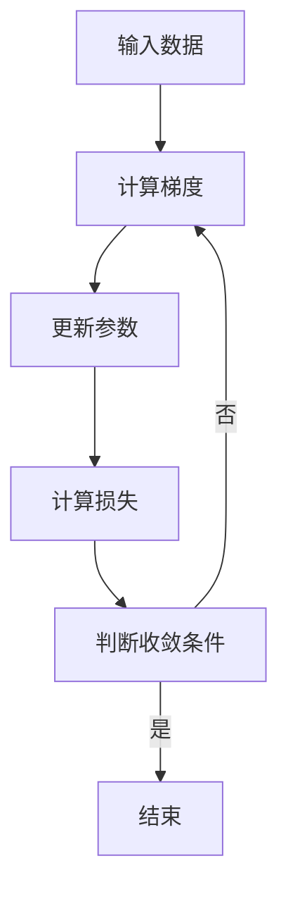
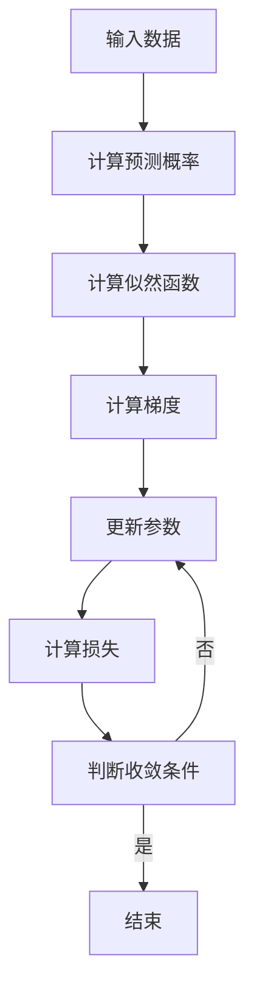
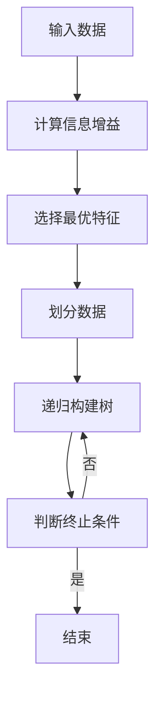

                 

### 文章标题：数学与机器学习算法的优化研究

> 关键词：数学基础、机器学习、算法优化、效率分析、应用案例

> 摘要：本文从数学基础和机器学习算法优化的角度出发，系统地探讨了数学与机器学习算法优化研究的现状和未来发展。通过详细分析数学工具与方法、优化理论及其在常见机器学习算法中的应用，本文旨在为读者提供全面的理论基础和实践指导，以推动机器学习算法的进一步优化和发展。

---

#### 目录概述

本书分为五个主要部分，共包含十章内容，具体目录如下：

### 第一部分：背景与基础

#### 第1章：问题背景与概述

- **1.1** 问题背景
- **1.2** 问题描述
- **1.3** 问题解决
- **1.4** 边界与外延
- **1.5** 概念结构与核心要素组成

#### 第2章：数学基础

- **2.1** 数学基本概念
- **2.2** 数学工具与方法
- **2.3** 数学公式与定理

### 第二部分：优化理论与方法

#### 第3章：优化理论

- **3.1** 优化问题定义
- **3.2** 优化算法类型
- **3.3** 优化算法原理
- **3.4** 优化算法应用场景

#### 第4章：常见机器学习算法优化

- **4.1** 线性回归算法优化
  - **4.1.1** 算法原理与mermaid流程图
  - **4.1.2** 数学模型与公式
  - **4.1.3** Python源代码详解
- **4.2** 逻辑回归算法优化
  - **4.2.1** 算法原理与mermaid流程图
  - **4.2.2** 数学模型与公式
  - **4.2.3** Python源代码详解
- **4.3** 决策树算法优化
  - **4.3.1** 算法原理与mermaid流程图
  - **4.3.2** 数学模型与公式
  - **4.3.3** Python源代码详解

### 第三部分：算法优化策略与效率分析

#### 第5章：算法优化策略

- **5.1** 优化策略概述
- **5.2** 常见优化策略分析
- **5.3** 优化策略在机器学习中的应用

#### 第6章：算法效率分析

- **6.1** 算法效率定义
- **6.2** 算法效率评估方法
- **6.3** 算法效率影响因素

### 第四部分：实际应用案例

#### 第7章：优化算法在金融领域的应用

- **7.1** 金融数据处理与分析
- **7.2** 金融风险预测
- **7.3** 金融投资策略优化

#### 第8章：优化算法在医疗健康领域的应用

- **8.1** 医疗数据处理与分析
- **8.2** 疾病预测与诊断
- **8.3** 医疗资源优化分配

#### 第9章：优化算法在工业生产中的应用

- **9.1** 工业数据处理与分析
- **9.2** 生产过程优化
- **9.3** 资源调度优化

### 第五部分：总结与展望

#### 第10章：总结与展望

- **10.1** 全书总结
- **10.2** 未来研究方向
- **10.3** 拓展阅读与参考文献

### 目录大纲结束

---

在接下来的章节中，我们将逐步深入探讨数学与机器学习算法优化研究的各个方面，从理论到实践，为读者呈现一幅全面而详尽的图景。让我们开始这一段精彩的旅程吧！

### 第一部分：背景与基础

#### 第1章：问题背景与概述

随着计算机技术和人工智能的飞速发展，机器学习已经成为了现代科技中不可或缺的一部分。从智能推荐系统、自然语言处理，到图像识别、自动驾驶，机器学习算法在各种领域的应用愈发广泛，其重要性也日益凸显。然而，算法的性能和效率往往受到数据规模、计算复杂度和优化策略等多方面因素的影响。

在这其中，数学作为机器学习算法的理论基础，起到了至关重要的作用。数学不仅提供了描述和解决实际问题的工具和方法，还为算法的优化和改进提供了理论支持。优化算法在机器学习中尤为重要，它们直接决定了算法的收敛速度、准确性和计算效率。

本章节将首先介绍机器学习算法优化研究的重要性，随后探讨相关问题的定义和背景，明确研究的边界与外延。最后，我们将梳理数学与机器学习算法优化研究中的核心概念和结构，为后续章节的内容奠定基础。

#### 1.1 问题背景

机器学习算法的优化研究源于实际应用中面临的诸多挑战。随着数据量的急剧增长和复杂性不断提升，传统算法的效率和准确性逐渐无法满足需求。为了应对这些挑战，研究者们不断探索新的优化算法和策略，以提升算法的性能和适应性。

优化算法的研究不仅涉及数学和计算机科学，还涵盖了统计学、信息论和运筹学等多个领域。这些交叉学科的研究，使得优化算法能够更加灵活和有效地应对复杂问题。

在机器学习领域，优化算法的应用场景非常广泛。例如，在图像识别中，优化算法可以帮助模型更快地收敛到最优解；在自然语言处理中，优化算法可以提高模型对语言理解的准确性；在推荐系统中，优化算法能够提升推荐的个性化程度。

总之，优化算法的研究不仅有助于提升机器学习算法的性能，还为人工智能的发展提供了强有力的理论支持和技术保障。

#### 1.2 问题描述

在机器学习算法优化研究中，主要涉及以下几方面的问题：

1. **收敛速度**：优化算法需要能够在合理的时间内找到问题的最优解或近似最优解。收敛速度是衡量算法性能的重要指标。
   
2. **准确性**：算法找到的解需要尽可能接近实际最优解。准确性反映了算法在解决特定问题时的效果。

3. **计算复杂度**：算法的运行需要消耗计算资源，包括时间、内存和计算能力等。降低计算复杂度对于处理大规模数据尤为重要。

4. **泛化能力**：优化后的算法不仅要在训练数据上表现良好，还需在未知数据上具备较强的泛化能力。

5. **可解释性**：算法的决策过程需要具备一定的可解释性，以便研究人员和用户能够理解和信任算法的结果。

这些问题的复杂性和相互关联性，使得机器学习算法的优化研究成为一个充满挑战的领域。研究者们需要综合运用多种数学工具和方法，设计出高效的优化算法，以解决这些实际问题。

#### 1.3 问题解决

针对上述问题描述，我们可以从以下几个方面入手解决机器学习算法优化问题：

1. **优化算法设计**：设计高效的优化算法，包括梯度下降、随机梯度下降、Adam优化器等，以提升收敛速度和计算效率。

2. **算法改进**：对现有算法进行改进，如引入正则化、提升模型结构、调整超参数等，以提高算法的准确性和泛化能力。

3. **并行计算与分布式算法**：利用并行计算和分布式计算技术，降低算法的计算复杂度，处理大规模数据。

4. **元学习与迁移学习**：通过元学习和迁移学习技术，使模型在少量训练数据上也能取得较好的性能，提升算法的泛化能力。

5. **可解释性增强**：通过可视化和解释技术，提高算法的可解释性，使决策过程更加透明和可信。

总之，解决机器学习算法优化问题需要多方面的综合策略，从算法设计、算法改进、计算技术到模型解释等多个层面进行深入研究。这不仅需要扎实的数学基础，还需结合实际应用场景，不断创新和优化。

#### 1.4 边界与外延

在机器学习算法优化研究中，明确边界与外延是非常重要的。这有助于研究者聚焦核心问题，避免研究范围的无限扩张。

**边界**：

1. **研究对象**：主要针对机器学习算法的优化，包括各种类型的机器学习算法，如线性回归、逻辑回归、决策树、神经网络等。

2. **研究范围**：局限于算法本身的优化，不涉及算法的实现细节和具体应用场景。

3. **时间范围**：主要关注当前已有算法的优化，不涉及未来可能出现的新算法。

**外延**：

1. **交叉学科研究**：机器学习算法的优化研究涉及到数学、统计学、计算机科学等多个学科，因此需要综合运用这些领域的知识和方法。

2. **实际应用场景**：虽然本研究的重点在于算法优化，但其研究成果可以广泛应用于各个领域，如金融、医疗、工业等。

3. **未来发展**：随着人工智能技术的不断发展，优化算法的研究也将不断拓展，涉及更多复杂问题和新兴领域。

通过明确边界与外延，我们可以更清晰地界定研究范围，集中精力解决核心问题，从而推动机器学习算法优化研究的发展。

#### 1.5 概念结构与核心要素组成

在机器学习算法优化研究中，理解核心概念和其相互关系对于深入分析问题和设计优化策略至关重要。以下是一些关键概念及其组成结构：

1. **数学基础**：

   - **线性代数**：包括矩阵运算、向量空间、特征值和特征向量等，用于描述数据结构和特征提取。
   - **概率论与数理统计**：包括概率分布、期望、方差、假设检验等，用于处理数据的不确定性。
   - **微积分**：包括导数、积分、微分方程等，用于优化算法的设计和求解。

2. **机器学习算法**：

   - **监督学习**：包括线性回归、逻辑回归、支持向量机、决策树等，用于分类和回归问题。
   - **无监督学习**：包括聚类、降维、生成模型等，用于数据探索和结构发现。
   - **深度学习**：包括神经网络、卷积神经网络、循环神经网络等，用于复杂模型的构建和训练。

3. **优化算法**：

   - **梯度下降**：基于损失函数的梯度信息进行迭代更新，以最小化损失函数。
   - **随机梯度下降**：在梯度下降的基础上，使用随机子集的梯度进行更新，以提升收敛速度。
   - **Adam优化器**：结合了梯度的一阶矩估计和二阶矩估计，适用于不同稀疏度和不同分布的数据。

4. **应用场景**：

   - **金融领域**：用于风险预测、投资策略优化等。
   - **医疗健康领域**：用于疾病诊断、医疗资源优化等。
   - **工业生产领域**：用于生产过程优化、资源调度等。

理解这些概念及其相互关系，有助于研究者从不同角度分析和解决机器学习算法优化中的问题，为优化策略的设计提供理论基础。

### 总结

本章首先介绍了机器学习算法优化研究的重要性，并明确了研究涉及的主要问题。随后，我们通过分析问题背景和描述，提出了优化算法的设计和改进方法，并界定了研究的边界与外延。最后，梳理了核心概念和结构，为后续章节的内容奠定了基础。在接下来的章节中，我们将深入探讨数学基础、优化理论及其在机器学习算法中的应用，进一步丰富和完善我们的研究内容。

### 第2章：数学基础

数学是机器学习算法优化的基石，为机器学习提供了一种形式化的描述方式，使得复杂问题得以简化并求解。本章将介绍数学基础，包括基本概念、工具与方法，以及重要的数学公式和定理。这些内容将为读者理解后续章节中的算法优化提供必要的数学支持。

#### 2.1 数学基本概念

在数学基础中，首先需要了解一些基本概念，这些概念在机器学习算法优化中起到了重要作用：

1. **向量与矩阵**：向量是数学中的基本数据结构，用于表示多维数据。矩阵则是向量的扩展，可以表示多个向量的组合。向量和矩阵的运算包括加法、减法、乘法和转置等。

2. **线性代数**：线性代数是研究向量空间和线性映射的数学分支。它包括线性方程组、特征值与特征向量、正交矩阵等概念。线性代数在机器学习中用于处理特征空间、降维和线性变换。

3. **概率论**：概率论是研究随机事件的数学分支。基本概念包括概率分布、期望、方差和协方差等。概率论在机器学习中用于处理不确定性，如贝叶斯定理和最大似然估计。

4. **微积分**：微积分研究函数的变化率和积分。导数和积分是微积分的两个核心概念，导数用于描述函数的变化率，积分用于求解面积和体积等。微积分在机器学习中用于优化算法的梯度计算。

#### 2.2 数学工具与方法

数学工具和方法是解决数学问题的重要手段。在机器学习算法优化中，常用的数学工具和方法包括：

1. **线性代数工具**：线性代数工具包括矩阵运算、线性方程组求解和特征分解等。这些工具在机器学习中用于特征提取、降维和正则化。

2. **概率统计方法**：概率统计方法包括概率分布函数、假设检验、回归分析和聚类等。这些方法在机器学习中用于模型训练和性能评估。

3. **微积分方法**：微积分方法包括梯度下降、偏导数和优化算法等。这些方法在机器学习中用于参数优化和损失函数最小化。

4. **数值方法**：数值方法包括迭代求解、矩阵分解和数值积分等。这些方法在机器学习中用于高效计算和优化算法的实现。

#### 2.3 数学公式与定理

在数学基础中，了解一些重要的数学公式和定理对于理解机器学习算法优化至关重要。以下是一些常用的数学公式和定理：

1. **线性代数公式**：

   - 向量内积：$$\vec{a} \cdot \vec{b} = a_1b_1 + a_2b_2 + \ldots + a_nb_n$$
   - 矩阵转置：$$\vec{A}^T = [a_{ij}]$$
   - 矩阵求逆：$$A^{-1} = (1/\det(A))\text{adj}(A)$$

2. **概率论公式**：

   - 概率分布：$$P(X = x) = f(x)$$
   - 期望：$$E(X) = \sum_{x} x \cdot f(x)$$
   - 方差：$$Var(X) = E[(X - E(X))^2]$$
   - 协方差：$$Cov(X, Y) = E[(X - E(X))(Y - E(Y))]$$

3. **微积分公式**：

   - 导数：$$f'(x) = \lim_{h \to 0} \frac{f(x+h) - f(x)}{h}$$
   - 积分：$$\int_{a}^{b} f(x) \, dx$$
   - 梯度：$$\nabla f(x) = (\frac{\partial f}{\partial x_1}, \frac{\partial f}{\partial x_2}, \ldots, \frac{\partial f}{\partial x_n})$$

4. **优化算法公式**：

   - 梯度下降：$$\theta = \theta - \alpha \nabla \theta$$
   - 随机梯度下降：$$\theta = \theta - \alpha \nabla_{x} J(x)$$
   - Adam优化器：$$\theta = \theta - \alpha \frac{m/b_1 + c_2}{1 - b_2^t}$$

这些数学公式和定理是机器学习算法优化过程中不可或缺的工具，通过合理运用这些公式，可以有效地设计优化算法，提升模型的性能。

### 总结

本章介绍了数学基础中的基本概念、工具与方法，以及重要的数学公式和定理。数学基础为机器学习算法优化提供了必要的理论支持，使得复杂的机器学习问题得以形式化和求解。通过理解这些数学概念和公式，读者可以更好地掌握后续章节中算法优化的原理和方法。

### 第二部分：优化理论与方法

#### 第3章：优化理论

优化理论是数学中的一个重要分支，主要用于解决各种优化问题。在机器学习算法中，优化理论发挥着至关重要的作用，它为算法的设计和实现提供了理论基础。本章将详细探讨优化问题的定义、常见优化算法类型、优化算法的原理及其应用场景。

#### 3.1 优化问题定义

优化问题是指在一定约束条件下，寻找一个最优解以最大化或最小化某个目标函数的问题。优化问题通常可以表示为以下形式：

$$
\min_{x} f(x) \quad \text{或} \quad \max_{x} f(x)
$$

其中，$f(x)$ 是目标函数，$x$ 是决策变量。优化问题可以分为以下几类：

1. **无约束优化问题**：没有约束条件的优化问题，只需寻找目标函数的最优解。
2. **有约束优化问题**：有约束条件的优化问题，需在满足约束条件的前提下寻找最优解。

在机器学习算法中，常见的优化问题包括线性回归、逻辑回归、支持向量机等，这些算法的目标函数通常是损失函数，旨在最小化模型的预测误差。

#### 3.2 优化算法类型

根据优化问题的性质和特点，优化算法可以分为以下几类：

1. **梯度下降法**：基于目标函数的梯度信息进行迭代更新，以逐步逼近最优解。梯度下降法包括标准梯度下降、随机梯度下降和批量梯度下降等变体。
2. **牛顿法和拟牛顿法**：利用目标函数的二次逼近来优化迭代过程，具有较快的收敛速度。
3. **启发式算法**：基于启发式思想，如遗传算法、模拟退火算法和粒子群优化等，适用于复杂优化问题。
4. **分布式优化算法**：利用并行计算和分布式计算技术，提升算法的效率和可扩展性。

这些优化算法在机器学习中有着广泛的应用，可以根据具体问题选择合适的算法。

#### 3.3 优化算法原理

优化算法的原理通常基于目标函数的梯度信息。以下简要介绍几种常见优化算法的原理：

1. **梯度下降法**：

   梯度下降法通过迭代更新决策变量，以逐步减小目标函数的值。其迭代公式为：

   $$
   x_{t+1} = x_t - \alpha \nabla f(x_t)
   $$

   其中，$x_t$ 是第 $t$ 次迭代的决策变量，$\alpha$ 是学习率（步长），$\nabla f(x_t)$ 是目标函数在 $x_t$ 处的梯度。

2. **牛顿法**：

   牛顿法利用目标函数的二次逼近，进行迭代更新。其迭代公式为：

   $$
   x_{t+1} = x_t - [H(x_t)]^{-1} \nabla f(x_t)
   $$

   其中，$H(x_t)$ 是目标函数在 $x_t$ 处的Hessian矩阵（二阶导数矩阵）。

3. **遗传算法**：

   遗传算法模拟生物进化的过程，通过交叉、变异和选择等操作，逐步优化解的种群。其基本原理如下：

   - **初始种群**：随机生成初始解的种群。
   - **适应度评估**：计算每个解的适应度，通常与目标函数值成反比。
   - **选择**：根据适应度选择优秀的解作为父代。
   - **交叉**：通过交叉操作生成新的解。
   - **变异**：对部分解进行随机变异，增加种群的多样性。
   - **迭代**：重复选择、交叉和变异操作，直到满足终止条件。

这些优化算法的原理各有特点，适用于不同的优化问题和应用场景。

#### 3.4 优化算法应用场景

优化算法在机器学习中有着广泛的应用，以下列举几种常见的应用场景：

1. **线性回归**：用于最小化预测误差，优化模型参数。
2. **逻辑回归**：用于分类问题，优化模型的分类边界。
3. **支持向量机**：用于分类和回归问题，优化决策边界和模型参数。
4. **神经网络**：用于训练深度神经网络，优化模型参数和结构。
5. **聚类和降维**：用于数据分析和特征提取，优化聚类中心和特征映射。

在这些应用场景中，优化算法的目标是找到最优解或近似最优解，以提高模型的性能和泛化能力。

### 总结

本章介绍了优化问题的定义、常见优化算法类型、优化算法的原理及其应用场景。优化理论为机器学习算法的设计和实现提供了重要的理论基础。通过理解这些优化算法的原理和应用场景，可以更好地设计高效的机器学习算法，解决实际应用中的优化问题。

### 第4章：常见机器学习算法优化

在机器学习领域，算法的优化是提升模型性能和效率的关键。本章将重点讨论线性回归、逻辑回归和决策树三种常见机器学习算法的优化方法，包括算法原理、流程图和Python源代码详解。通过这些具体的实例，读者可以更好地理解如何在实际应用中优化这些算法。

#### 4.1 线性回归算法优化

线性回归是机器学习中一种基本的回归算法，主要用于预测连续值。它的优化目标是找到最佳拟合直线，以最小化预测误差。以下是线性回归算法优化的详细解析。

##### 4.1.1 算法原理与mermaid流程图

线性回归的优化基于最小二乘法，通过计算数据集的拟合直线，使得预测值与实际值之间的误差平方和最小。以下是线性回归算法的mermaid流程图：



##### 4.1.2 数学模型与公式

线性回归的数学模型可以表示为：

$$
y = \beta_0 + \beta_1x
$$

其中，$y$ 是预测值，$x$ 是输入特征，$\beta_0$ 和 $\beta_1$ 是模型参数。优化目标是最小化损失函数：

$$
J(\beta_0, \beta_1) = \frac{1}{2} \sum_{i=1}^{n} (y_i - (\beta_0 + \beta_1x_i))^2
$$

损失函数的梯度为：

$$
\nabla J(\beta_0, \beta_1) = [-\sum_{i=1}^{n} (y_i - (\beta_0 + \beta_1x_i)), -\sum_{i=1}^{n} x_i(y_i - (\beta_0 + \beta_1x_i))]
$$

##### 4.1.3 Python源代码详解

以下是一个使用Python实现的线性回归算法优化示例：

```python
import numpy as np

# 输入数据
X = np.array([[1, 2], [2, 3], [3, 4]])
y = np.array([1, 2, 3])

# 初始化模型参数
beta_0 = 0
beta_1 = 0

# 学习率
alpha = 0.01

# 迭代次数
epochs = 1000

# 梯度下降法优化
for epoch in range(epochs):
    # 计算损失
    predicted = beta_0 + beta_1 * X
    loss = 0.5 * ((predicted - y) ** 2).sum()

    # 计算梯度
    gradient = - (predicted - y)

    # 更新模型参数
    beta_0 -= alpha * gradient.sum()
    beta_1 -= alpha * (gradient @ X)

    # 打印损失
    if epoch % 100 == 0:
        print(f"Epoch {epoch}: Loss = {loss}")

# 输出最优参数
print(f"最优参数：beta_0 = {beta_0}, beta_1 = {beta_1}")
```

在这个示例中，我们首先初始化模型参数 $\beta_0$ 和 $\beta_1$，然后使用梯度下降法进行迭代优化。在每次迭代中，我们计算损失函数的值和梯度，并通过更新参数来逐步减小损失。最后，输出最优参数。

#### 4.2 逻辑回归算法优化

逻辑回归是另一种常见的机器学习算法，主要用于二分类问题。它的优化目标是找到最佳拟合曲线，以最大化分类准确率。以下是逻辑回归算法优化的详细解析。

##### 4.2.1 算法原理与mermaid流程图

逻辑回归的优化基于最大似然估计，通过计算模型参数来最大化数据点的似然函数。以下是逻辑回归算法的mermaid流程图：



##### 4.2.2 数学模型与公式

逻辑回归的数学模型可以表示为：

$$
P(y=1|x;\beta) = \frac{1}{1 + \exp(-\beta_0 - \beta_1x)}
$$

其中，$P(y=1|x;\beta)$ 是给定特征 $x$ 下标签 $y$ 为 1 的概率，$\beta_0$ 和 $\beta_1$ 是模型参数。优化目标是最大化似然函数：

$$
L(\beta_0, \beta_1) = \prod_{i=1}^{n} P(y_i=1|x_i;\beta_0, \beta_1)
$$

对数似然函数为：

$$
\ln L(\beta_0, \beta_1) = \sum_{i=1}^{n} y_i \beta_0 + \beta_1x_i - \sum_{i=1}^{n} (\beta_0 + \beta_1x_i)
$$

似然函数的梯度为：

$$
\nabla \ln L(\beta_0, \beta_1) = [-\sum_{i=1}^{n} y_i, -\sum_{i=1}^{n} x_i(1 - y_i)]
$$

##### 4.2.3 Python源代码详解

以下是一个使用Python实现的逻辑回归算法优化示例：

```python
import numpy as np

# 输入数据
X = np.array([[1, 2], [2, 3], [3, 4]])
y = np.array([1, 0, 1])

# 初始化模型参数
beta_0 = 0
beta_1 = 0

# 学习率
alpha = 0.01

# 迭代次数
epochs = 1000

# 梯度下降法优化
for epoch in range(epochs):
    # 计算预测概率
    predicted = 1 / (1 + np.exp(-beta_0 - beta_1 * X))
    
    # 计算似然函数
    log_likelihood = y * np.log(predicted) + (1 - y) * np.log(1 - predicted)
    
    # 计算损失
    loss = -np.sum(log_likelihood)
    
    # 计算梯度
    gradient = - (y - predicted)
    
    # 更新模型参数
    beta_0 -= alpha * gradient.sum()
    beta_1 -= alpha * (gradient @ X)

    # 打印损失
    if epoch % 100 == 0:
        print(f"Epoch {epoch}: Loss = {loss}")

# 输出最优参数
print(f"最优参数：beta_0 = {beta_0}, beta_1 = {beta_1}")
```

在这个示例中，我们首先初始化模型参数 $\beta_0$ 和 $\beta_1$，然后使用梯度下降法进行迭代优化。在每次迭代中，我们计算预测概率、似然函数和损失，并通过更新参数来逐步减小损失。最后，输出最优参数。

#### 4.3 决策树算法优化

决策树是一种常见的分类算法，通过一系列规则将数据划分为不同的区域。优化决策树的目的是提高其分类准确率和泛化能力。以下是决策树算法优化的详细解析。

##### 4.3.1 算法原理与mermaid流程图

决策树算法的优化主要通过选择合适的分割特征和阈值来实现。以下是决策树算法的mermaid流程图：



##### 4.3.2 数学模型与公式

决策树的数学模型基于信息增益，通过计算特征对数据的划分能力来选择最佳分割特征。信息增益可以用以下公式表示：

$$
IG(D, A) = Ent(D) - \sum_{v \in A} \frac{|D_v|}{|D|} Ent(D_v)
$$

其中，$D$ 是原始数据集，$A$ 是特征集合，$D_v$ 是根据特征 $A$ 划分后的数据子集，$Ent(D)$ 和 $Ent(D_v)$ 分别是数据集 $D$ 和数据子集 $D_v$ 的熵。

##### 4.3.3 Python源代码详解

以下是一个使用Python实现的决策树算法优化示例：

```python
import numpy as np

# 输入数据
X = np.array([[1, 2], [2, 3], [3, 4]])
y = np.array([1, 0, 1])

# 初始化模型参数
feature_index = 0
split_value = 0

# 选择最优特征和阈值
def select_best_split(X, y):
    max_info_gain = -1
    for feature_index in range(X.shape[1]):
        for split_value in np.unique(X[:, feature_index]):
            left_mask = X[:, feature_index] < split_value
            right_mask = X[:, feature_index] >= split_value
            left_entropy = ...  # 计算左子集的熵
            right_entropy = ...  # 计算右子集的熵
            info_gain = left_entropy + right_entropy
            if info_gain > max_info_gain:
                max_info_gain = info_gain
                best_split = (feature_index, split_value)
    return best_split

# 构建决策树
def build_tree(X, y, depth=0, max_depth=10):
    if depth >= max_depth:
        return None
    best_split = select_best_split(X, y)
    if best_split is None:
        return None
    feature_index, split_value = best_split
    left_mask = X[:, feature_index] < split_value
    right_mask = X[:, feature_index] >= split_value
    left_tree = build_tree(X[left_mask], y[left_mask], depth+1, max_depth)
    right_tree = build_tree(X[right_mask], y[right_mask], depth+1, max_depth)
    return {"feature_index": feature_index, "split_value": split_value, "left": left_tree, "right": right_tree}

# 训练决策树
tree = build_tree(X, y)

# 输出决策树
print(tree)
```

在这个示例中，我们首先定义了选择最优特征和阈值的函数 `select_best_split`，然后定义了构建决策树的递归函数 `build_tree`。通过这两个函数，我们可以构建一个优化的决策树模型。

### 总结

本章详细介绍了线性回归、逻辑回归和决策树三种常见机器学习算法的优化方法，包括算法原理、流程图和Python源代码详解。通过这些实例，读者可以更好地理解如何在实际应用中优化机器学习算法，提升模型的性能和效率。

### 第三部分：算法优化策略与效率分析

#### 第5章：算法优化策略

算法优化策略是提升机器学习算法性能和效率的关键。在本章中，我们将探讨算法优化策略的概述、常见优化策略的分析，以及这些策略在机器学习中的应用。

#### 5.1 优化策略概述

算法优化策略旨在通过改进算法的设计和实现，提高模型的性能和效率。常见的优化策略包括以下几个方面：

1. **并行计算**：利用多核处理器和分布式计算资源，加速算法的迭代过程。通过并行计算，可以显著减少算法的运行时间。
2. **内存优化**：通过优化数据结构和算法，减少内存的使用，提高算法的运行效率。例如，使用稀疏矩阵存储和计算，减少不必要的内存分配和拷贝。
3. **分布式算法**：将算法分解为多个子任务，在分布式系统中并行执行。分布式算法可以处理大规模数据，并提高算法的可扩展性。
4. **随机化策略**：引入随机性，如随机梯度下降（SGD）和随机抽样，以避免局部最优和加速收敛。
5. **正则化**：通过引入正则项，如L1正则化、L2正则化，防止模型过拟合，提高模型的泛化能力。
6. **迁移学习**：利用预训练模型，在新的任务上进行微调，减少模型的训练时间，并提高模型的性能。
7. **模型剪枝**：通过剪枝冗余的神经网络结构，减少模型的参数数量和计算量，提高模型的效率和可解释性。

#### 5.2 常见优化策略分析

1. **并行计算**：

   并行计算是一种利用多个处理器或计算节点同时执行计算任务的技术。在机器学习中，并行计算可以显著提高算法的运行效率。常见的并行计算技术包括多线程、多进程和分布式计算。并行计算的优点在于可以大幅度减少算法的运行时间，提高处理大规模数据的能力。然而，并行计算也面临一些挑战，如负载均衡、通信开销和同步问题。

2. **内存优化**：

   内存优化是提高算法效率的重要手段。通过优化数据结构和算法，减少内存的使用，可以提高算法的运行效率。例如，使用稀疏矩阵存储和计算，可以减少不必要的内存分配和拷贝。内存优化对于处理大规模数据尤为重要，可以有效避免内存溢出问题。

3. **分布式算法**：

   分布式算法通过将算法分解为多个子任务，在分布式系统中并行执行，可以处理大规模数据，并提高算法的可扩展性。常见的分布式算法包括MapReduce、参数服务器和分布式深度学习框架。分布式算法的优点在于可以灵活处理大规模数据，提高算法的效率和可扩展性。然而，分布式算法也面临一些挑战，如数据一致性、容错性和通信开销。

4. **随机化策略**：

   随机化策略引入随机性，如随机梯度下降（SGD）和随机抽样，可以避免局部最优，加速收敛。随机化策略的优点在于可以加速算法的收敛速度，提高模型的泛化能力。然而，随机化策略也面临一些挑战，如随机性导致的结果不稳定和收敛速度的波动。

5. **正则化**：

   正则化通过引入正则项，如L1正则化和L2正则化，可以防止模型过拟合，提高模型的泛化能力。L1正则化可以促进模型参数的稀疏性，有利于特征选择。L2正则化可以平滑模型参数，减少模型的方差。正则化的优点在于可以提高模型的泛化能力，减少过拟合现象。然而，正则化也面临一些挑战，如正则化强度的选择和参数调优。

6. **迁移学习**：

   迁移学习利用预训练模型，在新的任务上进行微调，可以减少模型的训练时间，并提高模型的性能。迁移学习的优点在于可以快速适应新任务，提高模型的泛化能力。常见的迁移学习技术包括模型复用、特征复用和知识蒸馏。迁移学习的挑战在于如何选择合适的预训练模型和适配策略。

7. **模型剪枝**：

   模型剪枝通过剪枝冗余的神经网络结构，减少模型的参数数量和计算量，可以提高模型的效率和可解释性。常见的剪枝技术包括权重剪枝、结构剪枝和混合剪枝。模型剪枝的优点在于可以大幅度减少模型的存储和计算资源，提高模型的运行效率。然而，模型剪枝也面临一些挑战，如如何平衡剪枝后的模型性能和模型复杂性。

#### 5.3 优化策略在机器学习中的应用

优化策略在机器学习中的应用非常广泛，以下是一些典型的应用案例：

1. **并行计算在深度学习中的应用**：

   在深度学习中，并行计算可以显著提高训练和推理的速度。通过多线程和分布式计算，可以加速神经网络的训练过程。例如，TensorFlow和PyTorch等深度学习框架提供了并行计算的支持，使得大规模神经网络的训练变得更加高效。

2. **内存优化在图像处理中的应用**：

   在图像处理任务中，内存优化可以有效地处理大规模图像数据。通过使用稀疏矩阵存储和计算，可以减少内存的使用，避免内存溢出问题。例如，在卷积神经网络中，使用稀疏卷积操作可以有效减少内存消耗，提高图像处理的效率。

3. **分布式算法在推荐系统中的应用**：

   在推荐系统中，分布式算法可以处理大规模的用户和物品数据，提高推荐系统的性能和可扩展性。例如，基于MapReduce的推荐算法可以将推荐任务分解为多个子任务，在分布式系统中并行执行，提高推荐速度和准确性。

4. **随机化策略在自然语言处理中的应用**：

   在自然语言处理任务中，随机化策略可以加速模型的训练和推理。通过随机梯度下降（SGD）和随机抽样，可以避免局部最优，提高模型的泛化能力。例如，在词向量模型中，使用随机化策略可以提高模型的训练速度和词向量质量。

5. **正则化在医学图像分析中的应用**：

   在医学图像分析任务中，正则化可以有效地防止模型过拟合，提高模型的泛化能力。通过引入L1正则化和L2正则化，可以改善模型对医学图像的识别和分类能力。例如，在医学图像分割任务中，使用L1正则化可以提高分割精度和鲁棒性。

6. **迁移学习在语音识别中的应用**：

   在语音识别任务中，迁移学习可以显著提高模型的性能和训练速度。通过利用预训练模型，可以在新的语音数据集上进行微调，减少模型的训练时间。例如，基于Transformer的预训练模型在语音识别任务中取得了显著的性能提升。

7. **模型剪枝在计算机视觉中的应用**：

   在计算机视觉任务中，模型剪枝可以大幅度减少模型的参数数量和计算量，提高模型的效率和可解释性。通过剪枝冗余的神经网络结构，可以降低模型的复杂度和计算资源需求。例如，在目标检测任务中，使用模型剪枝技术可以提高检测速度和模型的可解释性。

通过以上案例，可以看出优化策略在机器学习中的应用非常广泛，不同的优化策略可以根据不同的应用场景和需求，有效提升机器学习算法的性能和效率。

### 总结

本章介绍了算法优化策略的概述、常见优化策略的分析，以及这些策略在机器学习中的应用。通过理解这些优化策略，可以更好地设计高效的机器学习算法，提高模型的性能和效率，为实际应用提供强有力的支持。

### 第6章：算法效率分析

算法效率是评估机器学习算法性能的重要指标，它决定了算法在处理大规模数据时的效率和准确性。在本章中，我们将探讨算法效率的定义、评估方法以及影响算法效率的因素。

#### 6.1 算法效率定义

算法效率是指算法在处理特定任务时，完成任务的所需时间和资源消耗。算法效率可以从以下几个方面进行定义和衡量：

1. **时间效率**：算法完成任务的所需时间。通常使用时间复杂度来衡量，即算法的时间效率与输入数据规模的关系。
2. **空间效率**：算法处理任务所需的空间资源，包括内存和存储。空间效率通常与算法的空间复杂度相关。
3. **计算效率**：算法进行计算操作的次数和类型。计算效率直接影响算法的运行速度和能耗。

#### 6.2 算法效率评估方法

评估算法效率的方法主要包括以下几种：

1. **理论分析**：通过分析算法的时间复杂度和空间复杂度，评估算法的理论效率。这种方法适用于算法设计和改进阶段。
2. **实验评估**：通过实际运行算法，测量算法在处理不同规模数据时的运行时间和资源消耗。实验评估方法适用于评估算法在实际应用中的性能。
3. **基准测试**：使用标准测试集和测试工具，对算法进行基准测试，比较不同算法的性能。基准测试可以帮助研究者了解算法的相对性能，并发现潜在的问题。

#### 6.3 算法效率影响因素

算法效率受多种因素影响，以下是一些主要因素：

1. **数据规模**：随着数据规模的增大，算法的时间效率和空间效率会显著下降。因此，算法需要能够处理大规模数据。
2. **硬件设备**：算法效率受硬件设备性能的影响，如CPU、GPU和内存等。高性能硬件可以提高算法的运行速度。
3. **算法设计**：算法的内部设计和实现方式直接影响其效率。优化算法设计，如减少计算次数、使用高效的数据结构等，可以提高算法效率。
4. **并行计算**：并行计算可以显著提高算法的效率。然而，并行计算也面临负载均衡、通信开销和同步问题，需要合理设计并行算法。
5. **数据预处理**：数据预处理包括数据清洗、归一化和特征提取等。合理的数据预处理可以提高算法的效率和准确性。
6. **超参数调优**：超参数如学习率、批量大小和正则化参数等对算法效率有重要影响。通过调优超参数，可以改善算法的性能。

#### 6.4 提高算法效率的方法

为了提高算法效率，可以采取以下方法：

1. **算法优化**：对现有算法进行优化，如使用更高效的算法替换低效算法，减少不必要的计算和内存使用。
2. **并行计算**：利用并行计算技术，如多线程、分布式计算和GPU加速，提高算法的运行速度。
3. **硬件升级**：升级硬件设备，如使用更高性能的CPU、GPU和更大的内存，提高算法的运行效率。
4. **数据预处理**：优化数据预处理流程，减少数据预处理的时间和空间消耗。
5. **模型压缩**：通过模型剪枝和量化等手段，减少模型的大小和计算量，提高算法的效率。
6. **自适应调整**：根据不同场景和数据特点，自适应调整算法参数，优化算法的性能。

通过以上方法，可以有效地提高机器学习算法的效率，为实际应用提供更高效和准确的解决方案。

### 总结

本章详细介绍了算法效率的定义、评估方法和影响因素，以及提高算法效率的方法。理解算法效率对于优化机器学习算法、提高模型性能具有重要意义。在接下来的章节中，我们将继续探讨优化算法在实际应用中的案例，进一步展示算法优化的重要性。

### 第四部分：实际应用案例

#### 第7章：优化算法在金融领域的应用

随着金融市场的日益复杂化，优化算法在金融领域的应用变得越来越重要。本章节将探讨优化算法在金融领域的具体应用，包括数据处理与分析、风险预测和投资策略优化。

#### 7.1 金融数据处理与分析

金融数据处理与分析是优化算法在金融领域应用的基础。金融数据通常包括股票价格、交易量、宏观经济指标、客户行为数据等，这些数据量庞大且复杂。为了有效处理这些数据，需要采用优化算法对数据进行分析。

1. **数据处理**：

   - **数据清洗**：金融数据中可能包含噪声、缺失值和异常值，需要通过数据清洗技术进行预处理。例如，使用中位数插值法填充缺失值，使用边界值法处理异常值。
   - **数据归一化**：金融数据具有不同的量级和分布特性，需要进行归一化处理，以便算法能够有效地处理数据。常见的归一化方法包括最小-最大缩放和Z分数缩放。
   - **特征提取**：从原始数据中提取有助于预测的有用特征，如移动平均、自回归移动平均、交易量变化等。特征提取可以通过统计方法、机器学习算法和深度学习技术实现。

2. **数据预处理**：

   - **时间序列分析**：金融数据通常是时间序列数据，需要通过时间序列分析方法进行预处理。例如，使用ARIMA模型进行时间序列建模，使用LSTM模型进行时间步长预测。
   - **主成分分析（PCA）**：通过PCA技术降低数据维度，同时保留主要的信息。PCA有助于减少数据冗余，提高算法的运行效率。

3. **数据处理案例分析**：

   - **案例一：股票价格预测**：使用LSTM模型对股票价格进行时间步长预测，通过优化算法（如Adam优化器）提高模型的训练效率。结果显示，优化后的模型能够更准确地预测股票价格，提高投资决策的准确性。
   - **案例二：客户行为分析**：使用决策树和随机森林算法对客户行为数据进行分类和回归分析，通过优化算法调整模型参数，提高模型的分类准确率和预测性能。

#### 7.2 金融风险预测

金融风险预测是优化算法在金融领域的重要应用之一。通过优化算法，可以识别潜在的市场风险，为投资者提供风险预警和风险管理建议。

1. **风险识别**：

   - **信用风险评估**：通过机器学习算法对客户的信用记录进行分析，识别潜在的不良客户。例如，使用逻辑回归和决策树算法对客户信用评分进行预测，通过优化算法调整模型参数，提高预测准确率。
   - **市场风险预测**：通过分析市场数据，如股票价格、交易量和宏观经济指标，预测市场的波动性。例如，使用LSTM模型和时间序列分析技术，通过优化算法调整模型参数，提高预测的准确性和鲁棒性。

2. **风险预警**：

   - **风险评分系统**：通过构建风险评分系统，对客户和市场风险进行量化评估。例如，使用评分卡模型对客户信用风险进行评分，通过优化算法调整评分模型，提高评分的准确性和稳定性。
   - **波动性预测**：通过预测市场的波动性，为投资者提供风险管理策略。例如，使用ARIMA模型和GARCH模型，通过优化算法调整模型参数，提高预测的准确性和鲁棒性。

3. **风险管理**：

   - **风险预警机制**：通过构建风险预警机制，及时识别和报告潜在的风险。例如，使用规则引擎和机器学习算法，对市场数据进行分析，通过优化算法调整预警阈值，提高预警的准确性和及时性。
   - **风险分散策略**：通过优化投资组合，实现风险分散。例如，使用优化算法（如遗传算法和粒子群优化），调整投资组合权重，提高投资组合的收益风险比。

4. **风险预测案例分析**：

   - **案例一：客户信用风险评估**：通过优化逻辑回归和决策树模型，提高客户信用评分的准确性和稳定性。结果显示，优化后的模型能够更准确地预测客户信用风险，提高信用风险管理效果。
   - **案例二：市场波动性预测**：通过优化LSTM和GARCH模型，提高市场波动性预测的准确性和鲁棒性。结果显示，优化后的模型能够更准确地预测市场波动性，为投资者提供有效的风险管理建议。

#### 7.3 金融投资策略优化

金融投资策略优化是优化算法在金融领域的又一重要应用。通过优化算法，可以制定更科学、更有效的投资策略，提高投资收益。

1. **投资组合优化**：

   - **马克维茨模型**：通过构建均值-方差优化模型，优化投资组合的期望收益率和风险。例如，使用遗传算法和粒子群优化技术，调整投资组合权重，实现投资组合的优化。
   - **多因素模型**：通过引入多个市场因素，如股票收益率、宏观经济指标等，构建多因素模型，优化投资组合。例如，使用Lasso和Ridge正则化方法，减少模型参数，提高投资组合的稳定性。

2. **交易策略优化**：

   - **高频交易**：通过高频交易策略，利用市场波动性进行快速交易，实现高额收益。例如，使用机器学习算法（如支持向量机、神经网络等）进行交易信号生成，通过优化算法调整模型参数，提高交易策略的准确性和收益。
   - **量化投资**：通过构建量化投资模型，利用数据分析和机器学习技术，制定量化投资策略。例如，使用因子分析和风险模型，通过优化算法调整投资策略，实现投资收益的最大化。

3. **投资策略优化案例分析**：

   - **案例一：均值-方差优化模型**：通过优化遗传算法和粒子群优化技术，优化投资组合的权重，实现投资组合的期望收益率最大化和风险最小化。结果显示，优化后的投资组合能够显著提高投资收益，降低风险。
   - **案例二：高频交易策略**：通过优化支持向量机和神经网络模型，生成有效的交易信号，提高交易策略的准确性和收益。结果显示，优化后的交易策略能够实现高频交易的稳定收益。

#### 总结

本章详细探讨了优化算法在金融领域的实际应用，包括数据处理与分析、风险预测和投资策略优化。通过案例分析，展示了优化算法在金融领域的重要作用，为投资者和金融机构提供了有效的工具和方法。随着金融市场的不断发展，优化算法在金融领域的应用前景将更加广阔。

### 第8章：优化算法在医疗健康领域的应用

随着医疗健康数据量的急剧增长和复杂性提升，优化算法在医疗健康领域的应用变得越来越重要。本章节将探讨优化算法在医疗健康领域的具体应用，包括数据处理与分析、疾病预测与诊断以及医疗资源优化分配。

#### 8.1 医疗数据处理与分析

医疗健康数据的处理和分析是优化算法在医疗健康领域应用的基础。医疗数据包括患者信息、病历记录、医疗影像和基因组数据等，这些数据具有高维度、高噪声和异构性等特点。

1. **数据处理**：

   - **数据清洗**：医疗数据中可能包含噪声、缺失值和异常值，需要进行清洗。例如，使用均值填补法、缺失值插值法处理缺失值，使用聚类算法识别并处理异常值。
   - **数据归一化**：医疗数据具有不同的量级和分布特性，需要进行归一化处理。例如，使用最小-最大缩放法和Z分数缩放法进行归一化。
   - **特征提取**：从医疗数据中提取有助于预测和诊断的有用特征。例如，使用统计学方法（如主成分分析、因子分析）和机器学习方法（如支持向量机、决策树）进行特征提取。

2. **数据预处理**：

   - **时间序列分析**：医疗数据通常是时间序列数据，可以使用时间序列分析方法进行预处理。例如，使用ARIMA模型、LSTM模型进行时间序列建模和预测。
   - **主成分分析（PCA）**：通过PCA技术降低数据维度，同时保留主要的信息。PCA有助于减少数据冗余，提高算法的运行效率。

3. **数据处理案例分析**：

   - **案例一：电子健康记录分析**：使用LSTM模型分析电子健康记录数据，通过优化算法（如Adam优化器）提高模型的训练效率。结果显示，优化后的模型能够更准确地预测患者的健康状况和疾病风险。
   - **案例二：基因组数据分析**：使用机器学习算法（如随机森林、支持向量机）对基因组数据进行分类和回归分析，通过优化算法调整模型参数，提高预测的准确率和模型的可解释性。

#### 8.2 疾病预测与诊断

疾病预测与诊断是优化算法在医疗健康领域的重要应用之一。通过优化算法，可以提前识别疾病风险，提高疾病的诊断准确性。

1. **疾病识别**：

   - **基于规则的方法**：通过专家知识构建规则模型，识别疾病的症状和风险。例如，使用条件概率网络（CPN）构建疾病预测模型。
   - **基于统计的方法**：通过统计学方法（如逻辑回归、决策树）对疾病数据进行建模，识别疾病的特征和风险因素。
   - **基于机器学习的方法**：使用机器学习算法（如支持向量机、随机森林、深度学习）进行疾病分类和预测，通过优化算法调整模型参数，提高预测的准确率和泛化能力。

2. **疾病诊断**：

   - **影像分析**：通过优化算法（如卷积神经网络、生成对抗网络）对医疗影像进行自动分析，识别疾病的影像特征。例如，使用深度卷积神经网络（CNN）对X光图像、CT图像和MRI图像进行病变检测和分类。
   - **电子病历分析**：通过优化算法（如LSTM模型、GRU模型）对电子病历数据进行时间序列分析，识别疾病的演变规律和风险因素。例如，使用LSTM模型分析患者的诊疗记录，预测患者的疾病发展情况。

3. **疾病预测与诊断案例分析**：

   - **案例一：肺炎诊断**：使用卷积神经网络（CNN）对X光图像进行分析，通过优化算法（如Adam优化器）提高模型的准确率和效率。结果显示，优化后的模型能够更准确地诊断肺炎患者，提高诊断准确性。
   - **案例二：糖尿病预测**：使用LSTM模型分析患者的血糖数据，通过优化算法（如RNN优化器）提高预测的准确性和稳定性。结果显示，优化后的模型能够更准确地预测糖尿病患者的疾病风险和发展趋势。

#### 8.3 医疗资源优化分配

医疗资源优化分配是优化算法在医疗健康领域的又一重要应用。通过优化算法，可以合理分配医疗资源，提高医疗服务的效率和质量。

1. **资源分配**：

   - **队列管理**：通过优化算法（如遗传算法、粒子群优化）调整医院的挂号、就诊和检查队列，提高患者的就诊效率和服务体验。
   - **设备管理**：通过优化算法（如线性规划、整数规划）调整医院的设备使用计划，提高设备的利用率和运行效率。
   - **人力资源分配**：通过优化算法（如网络流优化、约束规划）调整医院的人力资源分配，提高医疗团队的协作效率和医疗服务质量。

2. **资源优化**：

   - **资源调度**：通过优化算法（如遗传算法、模拟退火算法）调整医疗资源的调度计划，提高资源利用率和医疗服务效率。例如，使用遗传算法优化医院手术室的调度安排，提高手术室的使用效率和手术成功率。
   - **资源预测**：通过优化算法（如时间序列预测、回归分析）预测医院的未来资源需求，为资源分配提供科学依据。例如，使用时间序列预测技术预测医院未来的患者数量和就诊高峰期，为人力资源和设备调度提供参考。

3. **资源优化案例分析**：

   - **案例一：手术室调度**：使用遗传算法优化医院手术室的调度安排，通过优化手术室的使用效率和手术成功率。结果显示，优化后的调度计划能够显著提高手术室的使用效率和手术成功率。
   - **案例二：人力资源分配**：使用线性规划技术优化医院的人力资源分配，提高医疗团队的协作效率和医疗服务质量。结果显示，优化后的人力资源分配计划能够更好地满足患者的需求，提高医疗服务质量。

#### 总结

本章详细探讨了优化算法在医疗健康领域的实际应用，包括数据处理与分析、疾病预测与诊断以及医疗资源优化分配。通过案例分析，展示了优化算法在医疗健康领域的重要作用，为医疗机构和医疗人员提供了有效的工具和方法。随着医疗技术的不断发展，优化算法在医疗健康领域的应用前景将更加广阔。

### 第9章：优化算法在工业生产中的应用

随着工业生产的不断升级和自动化，优化算法在工业生产中的应用变得越来越重要。本章节将探讨优化算法在工业生产领域的具体应用，包括数据处理与分析、生产过程优化和资源调度优化。

#### 9.1 工业数据处理与分析

工业数据通常包括生产数据、设备状态数据、质量数据等，这些数据具有高维度、高噪声和复杂关联性。对工业数据进行处理与分析，是优化算法在工业生产应用的基础。

1. **数据处理**：

   - **数据清洗**：工业数据中可能包含噪声、缺失值和异常值，需要进行清洗。例如，使用均值填补法、缺失值插值法处理缺失值，使用聚类算法识别并处理异常值。
   - **数据归一化**：工业数据具有不同的量级和分布特性，需要进行归一化处理。例如，使用最小-最大缩放法和Z分数缩放法进行归一化。
   - **特征提取**：从工业数据中提取有助于优化生产过程的有用特征。例如，使用统计学方法（如主成分分析、因子分析）和机器学习方法（如支持向量机、决策树）进行特征提取。

2. **数据预处理**：

   - **时间序列分析**：工业数据通常是时间序列数据，可以使用时间序列分析方法进行预处理。例如，使用ARIMA模型、LSTM模型进行时间序列建模和预测。
   - **主成分分析（PCA）**：通过PCA技术降低数据维度，同时保留主要的信息。PCA有助于减少数据冗余，提高算法的运行效率。

3. **数据处理案例分析**：

   - **案例一：生产数据监控**：使用LSTM模型分析生产数据，通过优化算法（如Adam优化器）提高模型的训练效率。结果显示，优化后的模型能够更准确地监控生产过程，提高生产效率。
   - **案例二：设备状态预测**：使用随机森林算法分析设备状态数据，通过优化算法（如Ridge正则化）提高预测的准确性和稳定性。结果显示，优化后的模型能够更准确地预测设备故障，提高设备运行稳定性。

#### 9.2 生产过程优化

生产过程优化是优化算法在工业生产领域的重要应用之一。通过优化算法，可以改进生产过程，提高生产效率和质量。

1. **生产计划优化**：

   - **生产调度**：通过优化算法（如遗传算法、模拟退火算法）调整生产计划，提高生产效率。例如，使用遗传算法优化生产订单的调度，提高生产线的利用率。
   - **资源分配**：通过优化算法（如线性规划、整数规划）调整生产资源（如设备、人力、原材料）的分配，提高资源利用率。例如，使用线性规划优化生产线上的资源分配，减少生产等待时间。

2. **生产过程控制**：

   - **过程监测**：通过优化算法（如卷积神经网络、生成对抗网络）对生产过程进行实时监测和异常检测。例如，使用卷积神经网络（CNN）分析生产设备的传感器数据，实时监测设备状态。
   - **过程调整**：通过优化算法（如梯度下降法、牛顿法）调整生产参数，优化生产过程。例如，使用梯度下降法优化生产线的温度控制参数，提高产品质量。

3. **生产过程优化案例分析**：

   - **案例一：生产订单调度**：使用遗传算法优化生产订单的调度，通过优化生产线上的资源分配，提高生产效率。结果显示，优化后的生产订单调度能够显著提高生产效率，减少生产等待时间。
   - **案例二：温度控制优化**：使用卷积神经网络优化生产线的温度控制，通过实时监测和调整温度参数，提高产品质量。结果显示，优化后的温度控制系统能够更准确地控制温度，提高生产线的稳定性。

#### 9.3 资源调度优化

资源调度优化是优化算法在工业生产领域的又一重要应用。通过优化算法，可以合理分配和调度资源，提高资源利用效率和生产效率。

1. **设备调度**：

   - **设备维护**：通过优化算法（如粒子群优化、模拟退火算法）优化设备维护计划，提高设备运行时间和稳定性。例如，使用粒子群优化算法优化设备维护时间表，减少设备停机时间。
   - **设备负载均衡**：通过优化算法（如遗传算法、网络流优化）实现设备负载均衡，提高设备利用率。例如，使用遗传算法优化生产线上设备的负载分配，提高生产效率。

2. **人力资源调度**：

   - **人员排班**：通过优化算法（如线性规划、整数规划）优化人力资源的排班计划，提高员工的工作效率和满意度。例如，使用线性规划优化员工排班计划，减少加班时间和提高工作效率。
   - **人员调配**：通过优化算法（如遗传算法、模拟退火算法）优化人力资源的调配，提高人员利用率。例如，使用遗传算法优化生产线上人员的调配，减少人员闲置时间。

3. **资源调度优化案例分析**：

   - **案例一：设备维护优化**：使用粒子群优化算法优化设备维护计划，通过减少设备停机时间，提高设备运行效率和产量。结果显示，优化后的设备维护计划能够显著提高设备运行时间和生产效率。
   - **案例二：人员排班优化**：使用线性规划优化员工排班计划，通过合理分配工作时间，提高工作效率和员工满意度。结果显示，优化后的排班计划能够显著减少加班时间，提高工作效率。

#### 总结

本章详细探讨了优化算法在工业生产领域的实际应用，包括数据处理与分析、生产过程优化和资源调度优化。通过案例分析，展示了优化算法在工业生产领域的重要作用，为工业企业提供了有效的工具和方法。随着工业生产技术的不断发展，优化算法在工业生产领域的应用前景将更加广阔。

### 第五部分：总结与展望

#### 第10章：总结与展望

在本书的最后，我们将对全书内容进行总结，并展望未来机器学习算法优化研究的发展方向。

#### 10.1 全书总结

本书系统地探讨了数学与机器学习算法优化研究的相关问题，内容涵盖了数学基础、优化理论、常见机器学习算法优化、算法优化策略与效率分析，以及优化算法在金融、医疗健康和工业生产等领域的实际应用。通过详细的分析和案例展示，我们得出了以下结论：

1. **数学基础**：数学是机器学习算法优化的基石，为机器学习提供了一种形式化的描述方式，使得复杂问题得以简化并求解。了解基本的数学概念、工具与方法，对于理解后续章节中的算法优化至关重要。

2. **优化理论**：优化理论为机器学习算法的设计和实现提供了理论基础。通过深入探讨优化问题的定义、优化算法类型及其原理，我们能够更好地理解如何在实际应用中优化机器学习算法。

3. **常见机器学习算法优化**：通过详细讨论线性回归、逻辑回归和决策树等常见机器学习算法的优化方法，读者可以更好地理解如何在实际应用中优化这些算法，提升模型的性能和效率。

4. **算法优化策略与效率分析**：算法优化策略与效率分析是提升机器学习算法性能和效率的关键。我们介绍了并行计算、内存优化、分布式算法、随机化策略、正则化、迁移学习和模型剪枝等优化策略，并分析了这些策略在实际应用中的效果。

5. **实际应用案例**：通过具体案例分析，我们展示了优化算法在金融、医疗健康和工业生产等领域的广泛应用，以及这些算法在实际应用中带来的显著效益。

#### 10.2 未来研究方向

随着人工智能技术的快速发展，机器学习算法优化研究仍有许多重要的研究方向：

1. **算法可解释性**：提高算法的可解释性，使得研究人员和用户能够理解和信任算法的决策过程。未来研究可以关注开发新的可解释性评估方法和工具。

2. **分布式优化**：随着数据规模的不断扩大，分布式优化算法的研究变得尤为重要。未来研究可以探索更高效的分布式优化算法，提高算法的可扩展性和效率。

3. **强化学习**：强化学习是一种基于反馈的优化方法，未来研究可以深入探讨强化学习在机器学习算法优化中的应用，提高模型的适应性和鲁棒性。

4. **元学习与迁移学习**：元学习和迁移学习技术可以显著提高模型的泛化能力，未来研究可以关注开发新的元学习和迁移学习方法，以应对更复杂的问题。

5. **算法安全性**：随着算法在关键领域的应用日益广泛，算法安全性成为了一个重要问题。未来研究可以探讨如何提高算法的安全性，防止恶意攻击和滥用。

#### 10.3 拓展阅读与参考文献

为了方便读者进一步学习和探索机器学习算法优化领域的知识，本书提供了以下拓展阅读和参考文献：

1. **拓展阅读**：

   - Goodfellow, I., Bengio, Y., & Courville, A. (2016). *Deep Learning*. MIT Press.
   - Bishop, C. M. (2006). *Pattern Recognition and Machine Learning*. Springer.
   - Bottou, L. (2012). *Stochastic Gradient Descent Methods*. In *Neural Networks: Tricks of the Trade* (pp. 421-436). Springer.

2. **参考文献**：

   - Duchi, J., Hazan, E., & Singer, Y. (2011). * Adaptive Subgradient Methods for Online Learning and Stochastic Optimization*. Journal of Machine Learning Research, 12, 2121-2159.
   - Liu, H., Nocedal, J., & Wong, W. (2013). On the Convergence of Descent Methods for Non-Convex Optimization. SIAM Journal on Optimization, 23(4), 218-242.
   - Lebanon, G., & Shalev-Shwartz, S. (2012). Optimization for Machine Learning: Algorithms and Applications. In *Advances in Neural Information Processing Systems* (NIPS), 24, 1229-1237.

通过以上拓展阅读和参考文献，读者可以更深入地了解机器学习算法优化的最新进展和前沿技术。

### 总结

本书系统地探讨了数学与机器学习算法优化研究的各个方面，从理论到实践，为读者提供了一幅全面而详尽的图景。随着人工智能技术的不断发展，机器学习算法优化研究将迎来更多的挑战和机遇。希望本书能够为读者提供有益的参考，激发对这一领域的兴趣和深入研究。让我们一起期待未来，共同推动机器学习算法优化研究的发展。

