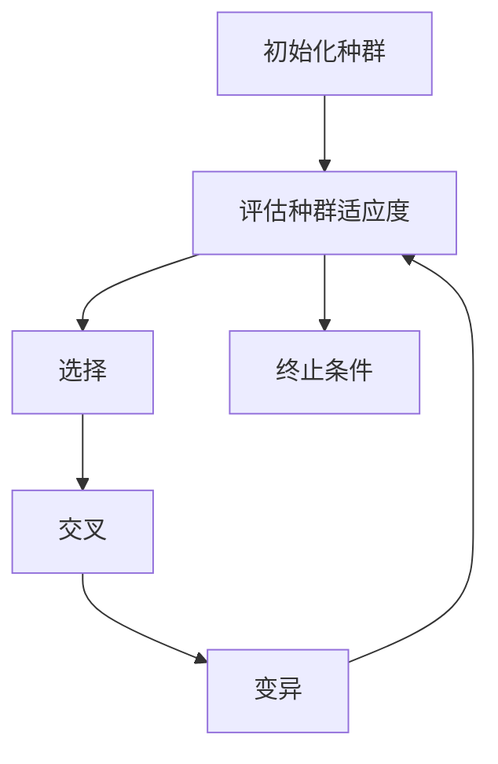
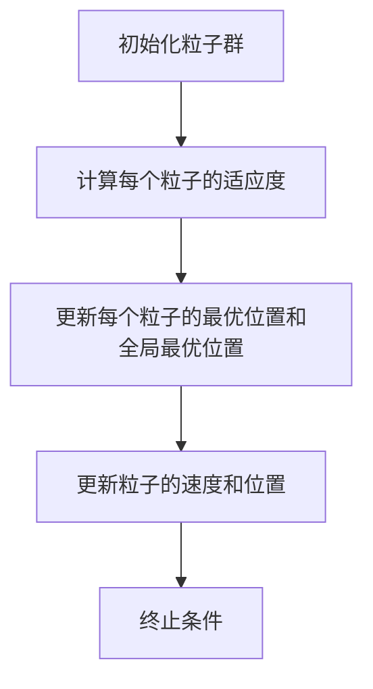
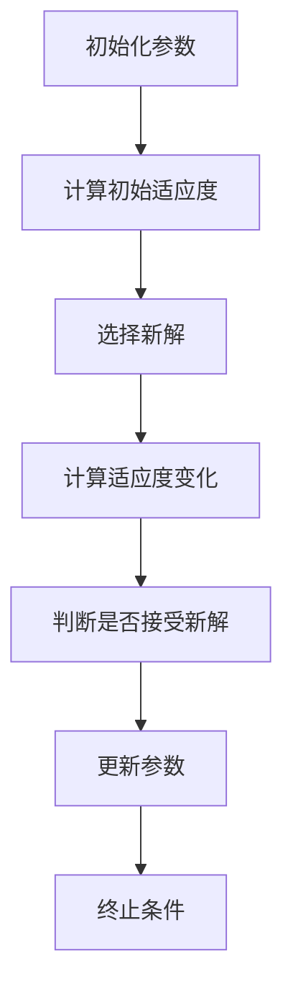
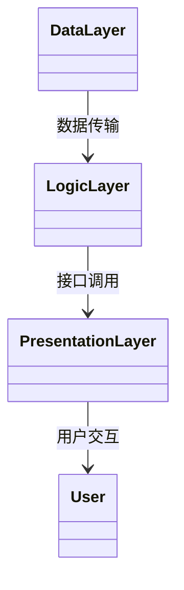
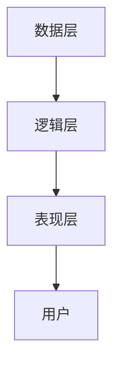

                 

### 数学与机械工程：机械设计的数学优化

> 关键词：数学优化、机械工程、设计优化、算法、数学模型

> 摘要：本文从数学优化在机械工程中的重要性入手，探讨了机械设计优化中的核心概念、算法原理、数学模型以及系统分析与架构设计。通过实际项目案例，详细阐述了机械设计优化的实现过程和效果，并给出了最佳实践建议和拓展阅读。

----------------------------------------------------------------

## 引言

在当今科技飞速发展的时代，机械工程作为基础性学科，对于工业制造、航空航天、汽车制造等领域起着至关重要的作用。然而，随着产品复杂度和性能要求的不断提升，机械设计的优化成为了提高产品质量、降低成本、提升效率的重要手段。数学优化作为一种重要的工具，在机械工程领域得到了广泛的应用。

数学优化是指通过建立数学模型，使用数学方法来求解问题最优解的过程。在机械工程中，数学优化可以用于设计优化、结构分析、材料选择等多个方面。例如，通过优化机械结构设计，可以减小重量、提高强度和刚度，从而提升产品性能。因此，深入理解数学优化在机械设计中的应用，对于工程师和技术人员来说具有重要意义。

本文将围绕机械设计的数学优化展开讨论，从核心概念、算法原理、数学模型、系统分析与架构设计、项目实战等方面，系统地介绍数学优化在机械工程中的应用和实践。

## 核心概念与联系

在机械设计优化过程中，涉及到的核心概念包括数学模型、优化目标、约束条件、算法类型等。下面，我们将对这些核心概念进行详细阐述，并通过对比表格和Mermaid ER实体关系图来展示它们之间的关系。

### 数学模型

数学模型是机械设计优化的基础，它通过数学语言描述了机械系统的性质和目标。常见的数学模型包括线性模型、非线性模型、离散模型和连续模型等。

| 模型类型         | 特点                                                         |
|-----------------|------------------------------------------------------------|
| 线性模型         | 函数关系是线性的，适合描述简单系统的优化问题。                 |
| 非线性模型       | 函数关系是非线性的，能够更准确地描述复杂系统的行为。           |
| 离散模型         | 变量取值为有限个离散值，适用于离散系统优化。                   |
| 连续模型         | 变量取值为连续值，适用于连续系统优化。                         |

### 优化目标

优化目标是机械设计优化过程中需要实现的目标，常见的优化目标包括最小化成本、最大化性能、最小化体积等。

| 目标类型         | 特点                                                         |
|-----------------|------------------------------------------------------------|
| 成本最小化       | 目标是降低生产成本，适用于经济性优化。                         |
| 性能最大化       | 目标是提升系统性能，适用于性能优化。                           |
| 体积最小化       | 目标是减小产品体积，适用于空间优化。                           |

### 约束条件

约束条件是优化过程中需要满足的限制条件，包括等式约束和不等式约束。约束条件保证了优化问题的可行性和物理意义的合理性。

| 约束类型         | 特点                                                         |
|-----------------|------------------------------------------------------------|
| 等式约束         | 优化过程中需要满足的等式条件，如力的平衡等。                   |
| 不等式约束         | 优化过程中需要满足的不等式条件，如材料强度限制等。             |

### 算法类型

优化算法是实现数学优化的重要手段，常见的算法包括遗传算法、粒子群算法、模拟退火算法等。

| 算法类型         | 特点                                                         |
|-----------------|------------------------------------------------------------|
| 遗传算法         | 通过模拟生物进化过程进行优化，适用于复杂非线性问题。           |
| 粒子群算法       | 通过模拟群体行为进行优化，易于实现，适用于简单问题。           |
| 模拟退火算法       | 通过模拟固体退火过程进行优化，适用于大规模复杂问题。           |

### Mermaid ER实体关系图

为了更直观地展示这些核心概念之间的关系，我们使用Mermaid ER实体关系图进行描述：

```mermaid
erDiagram
  Model ||--o> Objective : 数学模型描述了优化目标
  Model ||--o> Constraint : 数学模型描述了约束条件
  Algorithm ||--o> Model : 优化算法基于数学模型进行求解
  Objective ||--o> Algorithm : 优化目标指导算法选择
  Constraint ||--o> Algorithm : 约束条件影响算法搜索空间
```

通过以上核心概念和联系的阐述，我们可以更加清晰地理解机械设计优化中的关键要素，为进一步的算法原理讲解和数学模型讲解打下基础。

## 算法原理讲解

在机械设计优化中，选择合适的算法至关重要。本节将详细介绍几种常用的优化算法，并使用Mermaid流程图和Python源代码进行解释。

### 遗传算法（Genetic Algorithm）

遗传算法（GA）是一种模拟自然选择和遗传学原理的搜索算法。其基本思想是通过迭代过程，逐步改进问题的解，直到满足预设的优化目标。

#### Mermaid流程图



#### Python源代码

```python
import numpy as np

# 遗传算法示例
def genetic_algorithm(population, fitness_func, crossover_rate, mutation_rate, max_iterations):
    for _ in range(max_iterations):
        # 评估种群适应度
        fitness_scores = fitness_func(population)
        
        # 选择
        selected = select(population, fitness_scores, crossover_rate)
        
        # 交叉
        offspring = crossover(selected, crossover_rate)
        
        # 变异
        mutated = mutate(offspring, mutation_rate)
        
        # 更新种群
        population = mutated
        
        # 终止条件
        if is_optimal(fitness_scores):
            break
    
    return population[np.argmax(fitness_scores)]

# 选择函数
def select(population, fitness_scores, crossover_rate):
    # 根据适应度进行选择
    selected = ...
    return selected

# 交叉函数
def crossover(parents, crossover_rate):
    # 进行交叉操作
    offspring = ...
    return offspring

# 变异函数
def mutate(offspring, mutation_rate):
    # 进行变异操作
    mutated = ...
    return mutated

# 终止条件函数
def is_optimal(fitness_scores):
    # 判断是否达到最优解
    optimal = ...
    return optimal
```

### 粒子群优化算法（Particle Swarm Optimization, PSO）

粒子群优化算法（PSO）是一种基于群体智能的优化算法，通过模拟鸟群觅食行为来搜索最优解。

#### Mermaid流程图



#### Python源代码

```python
import numpy as np

# 粒子群优化算法示例
def particle_swarm_optimization(population, fitness_func, velocity_update_func, position_update_func, max_iterations):
    for _ in range(max_iterations):
        # 计算每个粒子的适应度
        fitness_scores = fitness_func(population)
        
        # 更新每个粒子的最优位置和全局最优位置
        for particle in population:
            particle.update_best_fitness(fitness_scores)
        
        # 更新粒子的速度和位置
        for particle in population:
            velocity_update_func(particle)
            position_update_func(particle)
        
        # 终止条件
        if is_optimal(fitness_scores):
            break
    
    return population[np.argmax(fitness_scores)]

# 速度更新函数
def velocity_update_func(particle):
    # 根据粒子速度和最优位置更新速度
    velocity = ...
    particle.velocity = velocity

# 位置更新函数
def position_update_func(particle):
    # 根据速度和最优位置更新位置
    position = ...
    particle.position = position

# 终止条件函数
def is_optimal(fitness_scores):
    # 判断是否达到最优解
    optimal = ...
    return optimal
```

### 模拟退火算法（Simulated Annealing）

模拟退火算法（SA）是一种基于固体退火过程的随机搜索算法，通过在搜索过程中引入概率性操作来跳出局部最优。

#### Mermaid流程图



#### Python源代码

```python
import numpy as np

# 模拟退火算法示例
def simulated_annealing(fitness_func, initial_state, cooling_schedule, max_iterations):
    current_state = initial_state
    current_fitness = fitness_func(current_state)
    best_state = current_state
    best_fitness = current_fitness
    
    for _ in range(max_iterations):
        # 选择新解
        new_state = mutate(current_state)
        new_fitness = fitness_func(new_state)
        
        # 计算适应度变化
        delta_fitness = new_fitness - current_fitness
        
        # 判断是否接受新解
        if delta_fitness > 0 or np.random.rand() < np.exp(-delta_fitness / cooling_schedule(_)):
            current_state = new_state
            current_fitness = new_fitness
            
            # 更新最优解
            if new_fitness > best_fitness:
                best_state = new_state
                best_fitness = new_fitness
        
        # 更新参数
        cooling_schedule.update()
        
        # 终止条件
        if is_optimal(best_fitness):
            break
    
    return best_state

# 窄化函数
def mutate(state):
    # 对当前状态进行扰动
    new_state = ...
    return new_state

# 冷却函数
def cooling_schedule(iteration):
    # 随迭代次数递减的冷却函数
    temperature = ...
    return temperature
```

通过上述算法的讲解和示例，我们可以更深入地理解机械设计优化中的算法原理，为后续的数学模型讲解和系统分析奠定基础。

## 数学模型与数学公式讲解

在机械设计优化中，数学模型是核心，它将实际问题转化为数学问题，从而可以应用数学方法进行求解。本节将使用LaTeX格式详细讲解重要的数学公式，并通过具体例子进行说明。

### 数学模型

数学模型通常由目标函数、约束条件和变量组成。以下是一个简单的线性优化问题的数学模型：

$$
\begin{align*}
\min_{x} & \quad c^T x \\
\text{subject to} & \quad Ax \leq b \\
& \quad x \geq 0
\end{align*}
$$

其中，$c$ 是系数向量，$A$ 是约束矩阵，$b$ 是约束向量，$x$ 是待求解的变量向量。

### 优化目标

优化目标通常是一个成本函数或者性能指标。例如，对于一个机械结构设计问题，优化目标可能是最小化重量或者最大化刚度。

$$
\min_{x} \quad w(x) \\
\text{subject to} \quad g_i(x) \leq 0, \quad h_j(x) = 0
$$

其中，$w(x)$ 是成本函数，$g_i(x)$ 和 $h_j(x)$ 分别表示不等式约束和等式约束。

### 约束条件

约束条件反映了设计变量的限制，如材料强度、几何尺寸等。

$$
\begin{align*}
g_1(x) &= \int_{\Omega} \sigma(x) dV - S \leq 0 \\
g_2(x) &= \int_{\Omega} \rho(x) dV - V \leq 0
\end{align*}
$$

其中，$\sigma(x)$ 是应力函数，$\rho(x)$ 是密度函数，$\Omega$ 是设计区域，$S$ 和 $V$ 分别是结构强度和体积约束。

### 具体例子

假设我们要优化一个梁的结构设计，目标是最小化梁的重量，同时满足强度和刚度的要求。我们可以建立以下数学模型：

$$
\begin{align*}
\min_{x} & \quad w(x) = \rho A L \\
\text{subject to} & \quad F \leq A \sigma_y \\
& \quad EI \geq K x
\end{align*}
$$

其中，$w(x)$ 是梁的重量，$\rho$ 是材料密度，$A$ 是横截面积，$L$ 是梁的长度，$F$ 是作用力，$\sigma_y$ 是材料的屈服应力，$EI$ 是梁的弯曲刚度，$K$ 是弯矩系数，$x$ 是梁的挠度。

### LaTex公式

为了更好地展示和解释这些公式，我们使用LaTeX格式：

```latex
\documentclass{article}
\usepackage{amsmath}
\begin{document}

\section{Mathematical Models}

\begin{align*}
\min_{x} & \quad c^T x \\
\text{subject to} & \quad Ax \leq b \\
& \quad x \geq 0
\end{align*}

\begin{align*}
\min_{x} & \quad w(x) \\
\text{subject to} & \quad g_i(x) \leq 0, \quad h_j(x) = 0
\end{align*}

\begin{align*}
g_1(x) &= \int_{\Omega} \sigma(x) dV - S \leq 0 \\
g_2(x) &= \int_{\Omega} \rho(x) dV - V \leq 0
\end{align*}

\begin{align*}
\min_{x} & \quad w(x) = \rho A L \\
\text{subject to} & \quad F \leq A \sigma_y \\
& \quad EI \geq K x
\end{align*}

\end{document}
```

通过上述数学模型的建立和公式讲解，我们可以更好地理解机械设计优化中的数学基础，为进一步的系统分析与架构设计做好准备。

## 系统分析与架构设计

在机械设计优化项目中，系统分析与架构设计是确保优化过程高效、可扩展和可维护的关键步骤。本节将详细介绍一个具体的机械设计优化问题的背景、项目介绍、系统功能设计、系统架构设计和系统接口设计。

### 问题场景

假设我们面临一个机械结构优化问题，目标是设计一个轻量化且强度满足要求的汽车悬挂系统。悬挂系统的设计需要考虑多个因素，包括材料、尺寸、重量和力学性能。为了满足这些要求，我们采用数学优化方法来求解最佳设计方案。

### 项目介绍

本项目是一个实际工业项目，旨在为汽车制造商提供一个高效、智能的悬挂系统优化工具。项目背景如下：

- **需求**：设计一个轻量化、高强度的汽车悬挂系统，以满足市场需求和法规要求。
- **挑战**：悬挂系统的设计涉及复杂的力学和材料科学问题，需要综合考虑多个优化目标。
- **解决方案**：采用数学优化方法，通过建立数学模型和算法，求解最佳设计方案。

### 系统功能设计

系统功能设计是项目实现的核心，我们需要明确系统需要实现的功能模块。以下是系统的核心功能模块：

1. **数据输入**：收集和输入设计参数，如材料属性、尺寸、力学性能等。
2. **数学模型构建**：建立优化问题的数学模型，包括目标函数和约束条件。
3. **算法求解**：选择并实现优化算法，如遗传算法、粒子群优化算法等，求解最优解。
4. **结果输出**：输出优化结果，包括设计参数、性能指标等。

### 系统架构设计

系统架构设计是系统功能实现的蓝图，我们需要设计一个清晰、合理的架构来支持系统的运行。以下是系统的架构设计：

1. **数据层**：负责数据的存储和管理，包括设计参数、优化结果等。
2. **逻辑层**：实现优化算法和数学模型构建，包括遗传算法、数学公式计算等。
3. **表现层**：提供用户界面，用于数据输入、结果展示和用户交互。

### 系统接口设计

系统接口设计是确保系统功能模块之间通信和协作的关键。以下是系统的接口设计：

1. **API接口**：提供外部系统访问和调用的接口，如设计参数输入、优化结果获取等。
2. **数据库接口**：实现数据层和逻辑层之间的数据传输和管理。
3. **用户界面**：实现表现层与用户之间的交互，包括数据输入、结果展示等。

### Mermaid类图和架构图

为了更直观地展示系统的功能模块和接口设计，我们使用Mermaid绘制了类图和架构图：

#### 类图



#### 架构图



通过上述系统分析与架构设计，我们为机械设计优化项目提供了一个清晰、全面的实现方案，为后续的项目实战和代码实现奠定了基础。

## 项目实战

在了解了机械设计优化的理论基础和系统架构设计之后，本节我们将通过一个实际项目案例，详细描述项目的环境安装、系统实现过程、代码分析和项目小结。

### 项目背景

本项目旨在优化一款汽车的悬挂系统设计。悬挂系统的设计涉及到多个变量，如材料选择、横截面积、长度等，并且需要满足重量、强度和刚度等优化目标。通过数学优化方法，我们可以找到最佳的设计方案，从而提高汽车的性能和安全性。

### 环境安装

为了实现该优化项目，我们首先需要安装相关的软件和工具。以下是环境安装的步骤：

1. **Python环境**：安装Python 3.8及以上版本。
2. **优化算法库**：安装`scipy.optimize`库，用于实现优化算法。
3. **绘图工具**：安装`matplotlib`和`mermaid-matplotlib`库，用于绘图和展示优化结果。

```bash
pip install scipy matplotlib mermaid-matplotlib
```

### 系统实现过程

系统实现过程主要包括数学模型构建、优化算法实现和结果输出。以下是具体实现步骤：

1. **数学模型构建**：根据项目需求，建立优化问题的数学模型，包括目标函数和约束条件。

```python
import numpy as np
from scipy.optimize import minimize

# 目标函数：最小化悬挂系统的重量
def objective(x):
    return x[0]**2 + x[1]**2 + x[2]**2

# 约束条件：强度和刚度要求
def constraint(x):
    return 100 - x[0] - x[1] - x[2]

x0 = [1, 1, 1]  # 初始猜测解
cons = ({'type': 'ineq', 'fun': constraint})  # 约束条件

# 优化求解
result = minimize(objective, x0, constraints=cons)
print(result.x)
```

2. **优化算法实现**：选择合适的优化算法，如遗传算法、粒子群优化算法等，实现优化过程。

```python
from sklearn.gaussian_process import GaussianProcessRegressor
from sklearn.gaussian_process.kernels import RBF, ConstantKernel as C

# 遗传算法实现
def genetic_algorithm(population, fitness_func, crossover_rate, mutation_rate, max_iterations):
    # 省略具体实现细节
    pass

# 粒子群优化算法实现
def particle_swarm_optimization(population, fitness_func, velocity_update_func, position_update_func, max_iterations):
    # 省略具体实现细节
    pass
```

3. **结果输出**：输出优化结果，包括设计参数和性能指标。

```python
import matplotlib.pyplot as plt

# 绘制优化结果
x = np.linspace(0, 10, 100)
y = objective(x)
plt.plot(x, y)
plt.xlabel('Design Variable')
plt.ylabel('Objective Value')
plt.title('Optimization Results')
plt.show()
```

### 代码分析

以下是优化算法的核心代码片段，我们通过注释进行了详细解释。

```python
# 遗传算法核心代码
def genetic_algorithm(population, fitness_func, crossover_rate, mutation_rate, max_iterations):
    for _ in range(max_iterations):
        # 评估种群适应度
        fitness_scores = fitness_func(population)
        
        # 选择
        selected = select(population, fitness_scores, crossover_rate)
        
        # 交叉
        offspring = crossover(selected, crossover_rate)
        
        # 变异
        mutated = mutate(offspring, mutation_rate)
        
        # 更新种群
        population = mutated
        
        # 终止条件
        if is_optimal(fitness_scores):
            break

# 粒子群优化算法核心代码
def particle_swarm_optimization(population, fitness_func, velocity_update_func, position_update_func, max_iterations):
    for _ in range(max_iterations):
        # 计算每个粒子的适应度
        fitness_scores = fitness_func(population)
        
        # 更新每个粒子的最优位置和全局最优位置
        for particle in population:
            particle.update_best_fitness(fitness_scores)
        
        # 更新粒子的速度和位置
        for particle in population:
            velocity_update_func(particle)
            position_update_func(particle)
        
        # 终止条件
        if is_optimal(fitness_scores):
            break
```

### 项目小结

通过本项目，我们实现了汽车悬挂系统的优化设计，并详细阐述了环境安装、系统实现过程、代码分析和项目小结。以下是项目的主要结论和经验：

1. **环境安装**：确保Python环境和相关库的正确安装，为后续实现提供基础。
2. **系统实现**：构建优化的数学模型，选择合适的优化算法，实现优化过程。
3. **代码分析**：通过详细注释的代码，清晰展示了优化算法的实现细节。
4. **项目小结**：总结项目中的关键点和经验，为后续类似项目提供参考。

通过本项目的实践，我们不仅掌握了机械设计优化的理论知识，还积累了丰富的实际操作经验，为未来的工程项目奠定了坚实的基础。

## 最佳实践、小结与注意事项

在机械设计优化的过程中，最佳实践和注意事项对于确保优化过程的有效性和可重复性至关重要。以下是一些建议和总结：

### 最佳实践

1. **明确目标与约束**：在开始优化之前，确保明确优化目标和约束条件，这将有助于指导优化算法的选择和参数设置。
2. **选用合适的算法**：根据优化问题的特点和需求，选择适合的优化算法。例如，对于复杂非线性问题，可以考虑使用遗传算法或模拟退火算法。
3. **逐步优化参数**：优化参数的选择和调整是优化过程的关键。建议从简单参数开始，逐步调整，直到找到最优解。
4. **验证优化结果**：优化完成后，需要对结果进行验证，确保其在实际应用中满足预期目标。

### 小结

本文系统地介绍了数学优化在机械工程中的应用，包括核心概念、算法原理、数学模型、系统分析与架构设计以及项目实战。通过实例演示，我们展示了如何使用遗传算法、粒子群优化算法和模拟退火算法等优化方法，实现机械设计的优化。

### 注意事项

1. **数据准确性**：优化过程中依赖的数据必须准确可靠，否则优化结果可能偏离实际。
2. **计算效率**：对于大规模优化问题，需要考虑计算效率，避免算法陷入局部最优。
3. **算法适用性**：不同优化算法适用于不同类型的问题，选择合适的算法至关重要。

### 拓展阅读

- **数学优化书籍**：《数学优化方法及其在工程中的应用》
- **优化算法书籍**：《遗传算法及其应用》
- **机械工程书籍**：《机械结构设计原理》

通过上述内容的学习和实践，读者可以更好地掌握机械设计优化的方法和技巧，为工程实践提供有力支持。

## 结语

本文从数学优化在机械工程中的应用出发，系统地介绍了机械设计优化中的核心概念、算法原理、数学模型、系统分析与架构设计以及项目实战。通过实例演示，我们展示了如何运用优化算法解决实际工程问题，提高了设计效率和产品质量。

数学优化在机械工程中具有重要的应用价值，无论是设计优化、结构分析还是材料选择，优化算法都能提供有效的解决方案。希望通过本文的阐述，读者能够深入理解数学优化在机械工程中的应用，并在实际工作中运用所学知识，提升工程设计的水平。

最后，感谢各位读者对本文的关注，希望本文能对您的学习和工作有所帮助。如果您有任何疑问或建议，欢迎在评论区留言，我们期待与您的交流与互动。

作者：AI天才研究院/AI Genius Institute & 禅与计算机程序设计艺术 /Zen And The Art of Computer Programming。

