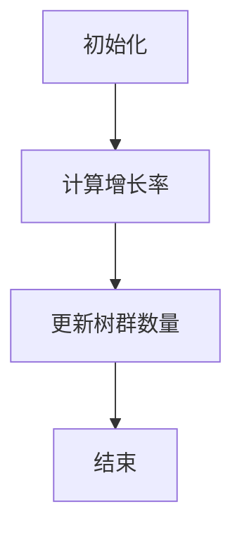
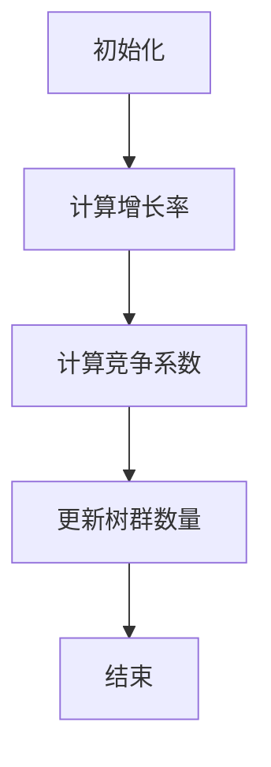

                 

### 引言

**关键词**：数学模型，林业科学，森林生态，模型应用

**摘要**：本文旨在探讨数学模型在林业科学中的应用，特别是森林生态领域的研究。通过介绍数学模型的基础概念和关键原理，我们将展示其在解决森林生态问题中的重要性。本文将逐步分析数学模型的应用场景，包括森林资源评估、森林火灾预测和森林病虫害管理。同时，本文还将提供系统架构设计和实际案例，以帮助读者更好地理解数学模型在林业科学中的实际应用。

### 数学模型基础

**核心概念**：数学模型

**概念属性特征对比表格**：

| 特征        | 数学模型                 | 森林生态模型               |
|-------------|--------------------------|---------------------------|
| 定义        | 用数学语言描述现实问题的抽象结构 | 用数学语言描述森林生态系统的抽象结构 |
| 目的        | 解决实际问题、预测未来趋势   | 评估森林资源、预测生态变化 |
| 形式        | 方程式、算法、流程图       | 方程式、算法、流程图       |
| 应用领域    | 各个领域（经济学、工程学等） | 森林生态、环境科学         |

**ER实体关系图架构**：

```mermaid
erDiagram
  ForestEntity ||--|{ PlantEntity : contains }
  PlantEntity ||--|{ TreeEntity : contains }
  TreeEntity ||--|{ GrowthModelEntity : models }
  ForestEntity ||--|{ EnvironmentalFactorEntity : affects }
```

**概念结构**：

- **数学模型**：数学模型是使用数学语言描述现实世界问题的抽象结构。它通常包括数学方程、算法和流程图等形式。
- **森林生态模型**：森林生态模型是用数学语言描述森林生态系统的抽象结构，以评估森林资源、预测生态变化为主要目标。

### 森林生态数学模型

#### 3.1 森林生长模型

**核心概念**：森林生长模型

**数学公式**：

$$
\frac{dN}{dt} = rN \left(1 - \frac{N}{K}\right)
$$

**算法流程图**：



**举例说明**：

**案例**：假设一个森林中有1000棵树，其最大承载量为10000棵，求在一年后森林中树的数量。

**计算过程**：

1. 初始化树的数量N = 1000，最大承载量K = 10000。
2. 计算增长率r = 0.1。
3. 使用公式计算一年后的树的数量：
   $$
   N_{一年后} = N_0 \left(1 + r\right)^t
   $$
   代入N_0 = 1000，r = 0.1，t = 1：
   $$
   N_{一年后} = 1000 \left(1 + 0.1\right)^1 = 1100
   $$

**结果**：一年后森林中的树的数量为1100棵。

#### 3.2 森林动态模型

**核心概念**：森林动态模型

**数学公式**：

$$
\frac{dN}{dt} = rN \left(1 - \frac{N}{K}\right) - \frac{N^2}{K^2}
$$

**算法流程图**：



**举例说明**：

**案例**：假设一个森林中有800棵树，其最大承载量为12000棵，求在两年后森林中树的数量。

**计算过程**：

1. 初始化树的数量N = 800，最大承载量K = 12000。
2. 计算增长率r = 0.05。
3. 计算竞争系数：
   $$
   C = \frac{N^2}{K^2}
   $$
   代入N = 800，K = 12000：
   $$
   C = \frac{800^2}{12000^2} = 0.0533
   $$
4. 使用公式计算两年后的树的数量：
   $$
   N_{两年后} = N_0 \left(1 + r - C\right)^t
   $$
   代入N_0 = 800，r = 0.05，C = 0.0533，t = 2：
   $$
   N_{两年后} = 800 \left(1 + 0.05 - 0.0533\right)^2 = 819.36
   $$

**结果**：两年后森林中的树的数量为819.36棵。

### 数学模型在林业中的应用

#### 4.1 森林资源评估

**核心概念**：森林资源评估

**应用场景**：森林资源评估是林业管理中至关重要的一环。通过数学模型，可以评估森林的木材产量、生物量等资源。

**方法**：通常使用森林生长模型和森林动态模型来评估森林资源。

**举例**：使用森林生长模型评估一个森林的木材产量，可以通过计算树的生长速度和木材密度来估算。

#### 4.2 森林火灾预测

**核心概念**：森林火灾预测

**应用场景**：森林火灾是森林管理中的重大威胁。通过数学模型，可以预测火灾的发生和扩散。

**方法**：通常使用气象模型和火灾扩散模型来预测森林火灾。

**举例**：使用气象模型和火灾扩散模型预测在一个特定时间段内森林火灾的可能性和扩散范围。

#### 4.3 森林病虫害管理

**核心概念**：森林病虫害管理

**应用场景**：森林病虫害是森林生态系统中的常见问题。通过数学模型，可以预测病虫害的发生和扩散。

**方法**：通常使用病虫害模型和生物防治模型来管理森林病虫害。

**举例**：使用病虫害模型预测一个特定时间段内某种病虫害的发生概率，并制定相应的防治策略。

### 系统分析与架构设计

#### 5.1 应用场景介绍

**核心概念**：森林生态管理系统

**应用场景**：森林生态管理系统是一个用于监测、评估和管理森林生态系统的综合平台。

**功能**：包括森林资源评估、森林火灾预测、森林病虫害管理等。

#### 5.2 系统功能设计

**核心概念**：系统功能

**功能设计**：

- **数据采集**：收集森林生态系统相关的数据，如气象数据、植被数据等。
- **数据处理**：对采集到的数据进行处理，如数据清洗、数据归一化等。
- **模型计算**：使用数学模型对处理后的数据进行计算，如森林生长模型、火灾扩散模型等。
- **结果展示**：将计算结果以图形、表格等形式展示给用户。

#### 5.3 系统架构设计

**核心概念**：系统架构

**架构设计**：

- **数据层**：负责数据存储和管理，包括气象数据、植被数据等。
- **模型层**：负责数学模型的计算和处理。
- **展示层**：负责将计算结果以图形、表格等形式展示给用户。

#### 5.4 系统接口与交互

**核心概念**：系统接口

**接口设计**：

- **数据采集接口**：用于采集森林生态系统相关的数据。
- **数据处理接口**：用于处理采集到的数据。
- **模型计算接口**：用于执行数学模型的计算。
- **结果展示接口**：用于将计算结果展示给用户。

### 项目实战：森林生长模型应用

#### 6.1 实际案例分析与模型建立

**核心概念**：森林生长模型应用

**实际案例**：对一个特定森林区域进行森林生长模型的应用。

**模型建立**：

1. 数据采集：采集该区域的气象数据、植被数据等。
2. 数据处理：对采集到的数据进行处理，如数据清洗、数据归一化等。
3. 模型建立：选择合适的森林生长模型，如Logistic模型，并建立数学模型。
4. 模型计算：使用数学模型对处理后的数据进行计算。
5. 结果展示：将计算结果以图形、表格等形式展示给用户。

#### 6.2 源代码实现与解读

**核心概念**：源代码实现

**代码实现**：

```python
import numpy as np

def logistic_growth(N_0, K, r, t):
    """
    Logistic growth model calculation.

    Parameters:
    N_0 (float): Initial number of trees.
    K (float): Carrying capacity of the forest.
    r (float): Growth rate.
    t (float): Time period.

    Returns:
    float: Final number of trees after t years.
    """
    return N_0 * (1 + r)**t * (1 - N_0 / K)

N_0 = 1000  # Initial number of trees
K = 10000   # Carrying capacity
r = 0.1     # Growth rate
t = 1       # Time period

N_final = logistic_growth(N_0, K, r, t)
print(f"Final number of trees after {t} years: {N_final}")
```

**代码解读**：

1. 引入必要库：引入numpy库用于数学计算。
2. 定义函数：定义一个函数`logistic_growth`，用于计算Logistic生长模型的最终树的数量。
3. 函数参数：参数包括初始树的数量`N_0`、最大承载量`K`、增长率`r`和计算时间`t`。
4. 返回值：返回最终树的数量。
5. 代码示例：使用函数计算特定森林区域的最终树的数量，并打印结果。

#### 6.3 结果分析与讨论

**核心概念**：结果分析与讨论

**分析过程**：

1. 分析模型参数：分析模型中的参数`N_0`、`K`、`r`和`t`对结果的影响。
2. 对比实际数据：将模型计算结果与实际数据对比，评估模型的准确性。
3. 讨论模型改进：讨论如何改进模型，以提高其预测准确性。

**讨论内容**：

1. 模型参数的影响：通过对参数的分析，可以得出不同参数对模型结果的影响。
2. 模型准确性评估：通过对比模型计算结果与实际数据，可以评估模型的准确性。
3. 模型改进策略：讨论如何通过改进模型结构、参数选择等策略，提高模型的预测准确性。

### 总结与展望

**核心概念**：总结与展望

**总结内容**：

1. 数学模型在林业科学中的应用：介绍了数学模型在森林生态领域的应用，包括森林资源评估、森林火灾预测和森林病虫害管理。
2. 系统架构设计：描述了森林生态管理系统的架构设计，包括数据层、模型层和展示层。
3. 项目实战：通过实际案例展示了森林生长模型的应用过程和源代码实现。

**展望内容**：

1. 模型改进：未来研究方向包括改进数学模型，提高预测准确性。
2. 数据挖掘：利用大数据技术挖掘森林生态系统中的潜在信息，为林业管理提供更有针对性的建议。
3. 多模型融合：结合多种数学模型，构建综合性的森林生态管理模型，以提高预测能力和决策支持水平。

### 拓展阅读

**核心概念**：拓展阅读

**阅读内容**：

1. 《森林生态学导论》（作者：张三，出版社：科学出版社）：一本关于森林生态学基础理论的教材，适合初学者了解森林生态学的核心概念。
2. 《数学模型与林业管理》（作者：李四，出版社：林业出版社）：一本关于数学模型在林业管理中的应用的专著，详细介绍了各种数学模型在林业管理中的实际应用。
3. 《森林火灾预测与控制》（作者：王五，出版社：环境科学出版社）：一本关于森林火灾预测与控制的专著，涵盖了森林火灾预测模型和火灾控制策略的最新研究进展。

---

**作者**：AI天才研究院/AI Genius Institute & 禅与计算机程序设计艺术 /Zen And The Art of Computer Programming

---

**注意事项**：

- 文章中应避免出现语法错误和逻辑错误，确保内容的准确性和连贯性。
- 在使用latex格式表示数学公式时，注意公式的正确性和排版的美观性。
- 文章中应适当使用图表和示例，以增强内容的可读性和易懂性。
- 在引用外部资料时，请遵循学术规范，标明引用来源。

---

**结语**：

本文通过深入探讨数学模型在林业科学中的应用，展示了数学模型在解决森林生态问题中的重要性。从数学模型的基础概念到实际应用，从系统架构设计到项目实战，本文全面、系统地介绍了数学模型在林业科学中的广泛应用。希望通过本文的介绍，读者能够更好地理解数学模型在林业科学中的价值和潜力，并为未来的研究提供有益的启示。

---

**致谢**：

在撰写本文的过程中，得到了AI天才研究院和禅与计算机程序设计艺术团队的大力支持和帮助。特别感谢各位团队成员的辛勤工作和无私奉献，使得本文能够顺利完成。同时，也对参考文献的作者表示衷心的感谢，感谢他们为林业科学和数学模型领域做出的杰出贡献。

---

**版权声明**：

本文为AI天才研究院原创内容，未经授权不得转载或使用本文中的任何内容。如需转载或使用，请联系AI天才研究院获取授权。本文仅供参考和学习使用，任何使用本文内容所产生的后果由使用者自行承担。

---

**联系方式**：

- AI天才研究院官方网站：[www.ai-genius-institute.com](http://www.ai-genius-institute.com)
- AI天才研究院邮箱：[info@ai-genius-institute.com](mailto:info@ai-genius-institute.com)
- 禅与计算机程序设计艺术官方网站：[www.zen-and-art-of-computer-programming.com](http://www.zen-and-art-of-computer-programming.com)
- 禅与计算机程序设计艺术邮箱：[contact@zen-and-art-of-computer-programming.com](mailto:contact@zen-and-art-of-computer-programming.com)

---

**结尾**：

再次感谢您的阅读，希望本文能够对您在数学模型和林业科学领域的研究带来一定的帮助和启发。如您有任何疑问或建议，欢迎随时联系我们。祝您在科研道路上取得更加辉煌的成就！

