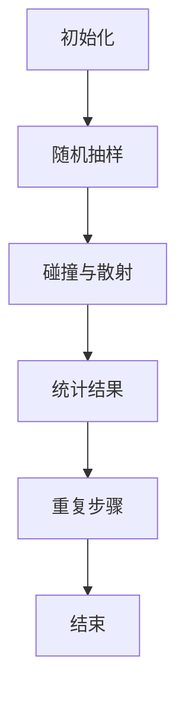
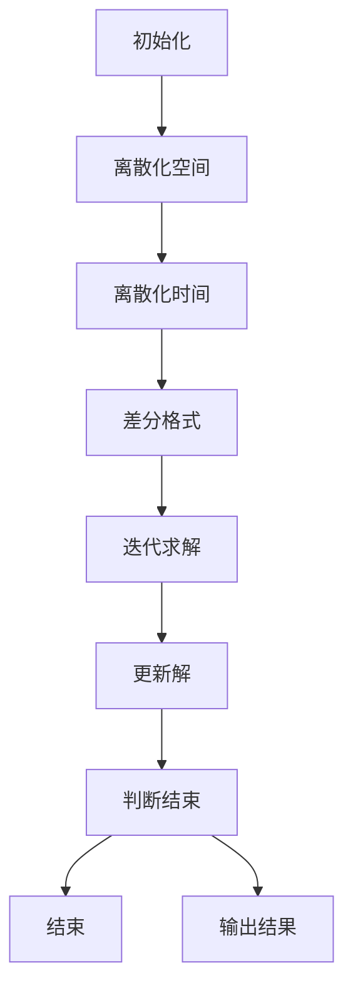

                 


### 核反应堆与数学模拟

核反应堆是核工程中不可或缺的核心组成部分，其作用是通过核裂变反应释放出大量能量，用于发电、医疗、科研等领域。然而，核反应堆的运行涉及到复杂的物理和化学反应过程，这对工程师和科学家提出了极高的要求。为了更精确地理解核反应堆的工作原理，并确保其安全、稳定运行，数学模拟成为了一种强有力的工具。

在核反应堆的数学模拟中，我们关注的核心问题包括：核燃料的浓度分布、中子的迁移路径、反应堆的热能传递等。这些问题的解决不仅需要深厚的物理学知识，还需要精深的数学理论，如概率论、数理统计、微积分和数值分析等。通过数学模型和算法，我们可以对核反应堆的运行状态进行预测、评估和优化，从而提高其效率、安全性和可靠性。

本文将分步骤探讨核反应堆的数学模拟，从核心概念、算法原理、数学模型、系统架构到项目实战，全面解析这一复杂的工程领域。以下是文章的目录：

1. **核反应堆的概述**
   - 核反应堆的基本原理
   - 核反应堆的类型及其特点

2. **核工程中的数学问题**
   - 数学在核工程中的应用
   - 核反应堆中的关键数学问题

3. **核心概念与联系**
   - 概率论、数理统计、微积分、数值分析
   - 对比表格与ER实体关系图

4. **算法原理讲解**
   - 蒙特卡洛方法
   - 有限差分法
   - 算法流程图与Python源代码

5. **数学模型与数学公式**
   - 数学模型的基本原理
   - LaTeX格式数学公式的嵌入与解释

6. **系统分析与架构设计方案**
   - 问题描述与项目目标
   - 系统功能设计、架构设计、接口设计

7. **项目实战**
   - 环境安装步骤
   - 系统核心实现与代码解读
   - 实际案例分析

8. **最佳实践 tips、小结、注意事项、拓展阅读**
   - 实践经验总结
   - 小结与注意事项
   - 推荐拓展阅读

在接下来的内容中，我们将逐步深入这些主题，运用逻辑清晰、结构紧凑、简单易懂的专业技术语言，帮助读者理解核反应堆的数学模拟这一复杂领域。首先，我们将从核反应堆的基本原理开始，逐步引导读者进入核工程的数学世界。

## 核反应堆的概述

核反应堆是核能发电和核燃料利用的核心设备，通过核裂变反应释放出大量的热能，从而驱动涡轮发电机发电。核反应堆的基本原理基于重核（如铀-235或钚-239）的裂变反应，当这些重核吸收一个中子后，会变得不稳定并裂变成两个较轻的核，同时释放出多个中子和大量的能量。这些中子又可以继续引发其他核裂变反应，从而形成链式反应，维持反应堆的稳定运行。

### 核反应堆的类型及其特点

核反应堆根据不同的分类标准可以有不同的分类方式，常见的分类包括以下几种：

1. **根据冷却剂类型分类**：
   - **轻水反应堆（LWR）**：使用普通轻水作为冷却剂和慢化剂，是目前应用最广泛的核反应堆类型。
   - **重水反应堆（HWReact）**：使用重水（氘氧化物）作为冷却剂和慢化剂，主要用于研究和生产应用。
   - **气体冷却反应堆（Gas-cooled Reactor）**：使用气体（如氦气、二氧化碳）作为冷却剂，具有较高温度运行的特点。

2. **根据燃料类型分类**：
   - **热中子反应堆（Thermal Neutron Reactor）**：使用铀-235或钚-239作为燃料，通过热中子引发链式反应。
   - **快中子反应堆（Fast Neutron Reactor）**：使用快中子引发链式反应，可以增殖钚或直接转化为能量。

3. **根据堆芯结构分类**：
   - **石墨气冷堆（Graphite Gas-cooled Reactor）**：使用石墨作为堆芯结构，适用于慢化剂和冷却剂的统一。
   - **沸水反应堆（BWR）**：使用沸水作为二次回路，直接产生蒸汽驱动涡轮机。

每种类型的核反应堆都有其独特的特点和适用场景。例如，轻水反应堆因其设计简单、运行稳定和安全性能高而广泛应用于商业发电领域；而快中子反应堆则因其能够利用乏燃料并减少放射性废物而具有潜在的应用前景。

### 数学在核工程中的应用

在核反应堆的设计、运行和维护过程中，数学模型和算法发挥着至关重要的作用。以下是数学在核工程中的一些关键应用：

1. **热工水力计算**：
   核反应堆运行时会产生大量热量，需要对冷却剂和堆芯内部的热流进行精确计算，以避免过热和损坏。这涉及到流体力学、传热学以及多相流理论的数学模型。

2. **中子输运计算**：
   中子是核裂变反应的核心载体，其路径和密度分布对链式反应的维持至关重要。中子输运方程的求解需要应用概率论和数值分析方法，如蒙特卡洛方法。

3. **核燃料管理**：
   核反应堆的燃料管理包括燃料元件的制造、装载和更换。这需要使用数理统计和优化算法来评估燃料的寿命、性能和安全性。

4. **放射性废物处理**：
   核反应堆产生的放射性废物具有长期危害性，需要通过数学模型和算法来处理、存储和处置，确保对环境和人类的影响降至最低。

通过这些数学工具和方法，工程师和科学家可以更好地理解核反应堆的物理过程，优化其运行参数，提高效率和安全性，从而推动核能的可持续发展。

### 核反应堆中的关键数学问题

核反应堆的运行涉及多个复杂的物理和化学反应过程，这些过程需要通过数学模型和算法来模拟和优化。以下是核反应堆中的一些关键数学问题：

1. **中子输运问题**：
   中子是核裂变反应的主要载体，其输运路径和密度分布对反应堆的稳定性和效率具有决定性影响。中子输运问题主要涉及中子通量分布的计算，这可以通过求解中子输运方程来实现。中子输运方程是一种偏微分方程，其形式取决于反应堆的几何结构和材料特性。

2. **热工水力问题**：
   核反应堆运行时会产生大量热量，这些热量需要通过冷却剂传递出去。热工水力问题包括流体流动、传热和热膨胀等复杂现象，需要运用流体力学和传热学的数学模型进行分析。

3. **反应性控制问题**：
   反应性控制是维持核反应堆稳定运行的关键因素。通过调节控制棒的位置和数量，可以调节中子吸收率，从而控制反应堆的功率输出。这涉及到反应性系数的计算和优化问题。

4. **核燃料管理问题**：
   核燃料在反应堆中的使用和更换需要精细的管理。核燃料管理问题包括燃料元件的寿命评估、燃料棒装载优化和燃料更换策略等，这些都需要使用数理统计和优化算法来求解。

5. **放射性废物处理问题**：
   核反应堆运行过程中会产生大量的放射性废物，这些废物需要经过处理和处置。放射性废物处理问题涉及放射性物质的衰减、扩散和污染控制，需要运用概率论和数值分析来模拟和处理。

通过解决这些数学问题，工程师和科学家可以更好地理解核反应堆的工作原理，优化其设计和运行参数，提高其效率和安全性。这些数学模型和算法不仅为核工程提供了理论基础，还为实际应用提供了可靠的工具。

### 核工程中的数学问题总结

核工程中的数学问题复杂多样，它们不仅需要深厚的物理学背景，还要求精确的数学工具和方法。以下是对核工程中涉及的主要数学问题的总结：

1. **中子输运问题**：
   中子输运问题关注中子在核反应堆中的路径和分布。通过求解中子输运方程，我们可以得到中子通量的分布，从而了解链式反应的稳定性。中子输运方程的求解方法包括有限差分法、蒙特卡洛方法和特征线法等。

2. **热工水力问题**：
   热工水力问题涉及到冷却剂在反应堆内部的流动和热量传递。流体力学和传热学的基本方程，如Navier-Stokes方程和能量方程，用于描述冷却剂的流动和温度分布。数值分析技术，如有限体积法和有限元法，用于求解这些方程。

3. **反应性控制问题**：
   反应性控制是核反应堆稳定运行的关键。通过调整控制棒的位置，可以调节中子的吸收率，从而控制反应堆的功率输出。反应性控制问题需要求解反应性系数和温度系数等参数，并采用优化算法来确定控制策略。

4. **核燃料管理问题**：
   核燃料管理涉及到燃料棒的设计、装载和更换。通过数理统计和优化算法，可以评估燃料棒的寿命，优化燃料棒的装载位置，并制定燃料更换策略。

5. **放射性废物处理问题**：
   放射性废物处理是核工程中的重大挑战。废物处理问题需要模拟放射性物质的衰减和扩散，采用概率论和数值分析技术，制定废物处理和处置方案。

这些数学问题不仅为核反应堆的设计、运行和维护提供了理论基础，还通过精确的模拟和优化，提高了核反应堆的效率和安全性。通过不断的研究和应用，数学在核工程中发挥着越来越重要的作用。

### 核工程中的核心数学概念

在核工程中，核心数学概念起着至关重要的作用，这些概念包括概率论、数理统计、微积分和数值分析等。下面，我们将对这些概念进行详细解释，并讨论它们在核工程中的应用。

#### 概率论

概率论是研究随机现象的数学分支，在核工程中，概率论主要用于分析核反应堆中不可预测事件的可能性。例如，在核反应堆的运行过程中，可能会发生中子泄漏、设备故障或人为失误等问题。通过概率论，我们可以计算这些事件发生的概率，并评估其可能带来的风险。

- **贝叶斯定理**：贝叶斯定理是概率论中的一个重要工具，用于根据先验知识和观测数据更新概率估计。在核工程中，贝叶斯定理可以用于实时监测和评估反应堆的运行状态，从而提高安全性。

- **马尔可夫链**：马尔可夫链是一种用于描述系统状态转移的概率模型。在核工程中，马尔可夫链可以用于模拟核反应堆内中子浓度的动态变化，帮助工程师预测反应堆的稳定性。

#### 数理统计

数理统计是利用概率论和数学工具对数据进行分析和解释的学科。在核工程中，数理统计广泛应用于数据收集、分析和决策过程中。

- **假设检验**：假设检验是一种统计方法，用于判断某个假设是否成立。在核反应堆的维护和监测过程中，假设检验可以用于评估设备的健康状况，判断是否需要更换或维修。

- **回归分析**：回归分析是一种用于研究变量之间关系的统计方法。在核工程中，回归分析可以用于预测反应堆的功率输出、燃料消耗和放射性废物产生量等关键参数。

#### 微积分

微积分是一门研究函数变化率和积分的数学学科，在核工程中，微积分用于描述和解决核反应堆中的连续变化现象。

- **微分方程**：微分方程用于描述核反应堆中热能、中子通量和辐射场的分布。通过求解微分方程，工程师可以预测反应堆内部的温度分布和中子流量，从而优化反应堆的设计和运行。

- **积分**：积分在核工程中用于计算反应堆的总体热能输出和放射性废物的总量。例如，通过积分方法，可以计算核反应堆运行一段时间后产生的热量总和。

#### 数值分析

数值分析是一门用于解决数学问题的数值方法学科，在核工程中，数值分析用于求解复杂方程和模拟核反应堆的行为。

- **有限差分法**：有限差分法是一种用于数值求解微分方程的方法。在核工程中，有限差分法可以用于计算中子输运方程和热传导方程，从而模拟反应堆内部的物理过程。

- **蒙特卡洛方法**：蒙特卡洛方法是一种基于随机抽样和统计模拟的方法，用于求解复杂的问题。在核工程中，蒙特卡洛方法可以用于模拟核反应堆中的随机事件，如中子碰撞和放射性衰变。

通过综合运用概率论、数理统计、微积分和数值分析等数学工具，工程师和科学家可以更好地理解和控制核反应堆的运行过程，提高其安全性和效率。

#### 核工程中数学概念的特点和应用场景

在核工程中，概率论、数理统计、微积分和数值分析等数学概念各有其独特的特点和应用场景。以下是对这些概念特点的详细对比和分析，并通过ER实体关系图（ERD）展示核工程中涉及的实体及其关系。

##### 概率论

- **特点**：概率论用于描述随机事件的可能性，关注事件的发生概率及其分布。
- **应用场景**：在核工程中，概率论用于评估事故风险、进行安全分析和决策支持。例如，通过计算中子泄漏和设备故障的概率，工程师可以制定应急预案，提高反应堆的安全性。
- **ERD表示**：在ERD中，概率论相关的实体可能包括“事故”、“风险事件”、“概率分布”等。

##### 数理统计

- **特点**：数理统计通过数据收集和分析，研究变量之间的统计关系。
- **应用场景**：在核工程中，数理统计用于评估设备的性能、监测反应堆的运行状态以及进行数据分析。例如，通过假设检验和回归分析，工程师可以判断设备是否正常工作，并预测未来的发展趋势。
- **ERD表示**：在ERD中，数理统计相关的实体可能包括“数据集”、“假设”、“统计模型”等。

##### 微积分

- **特点**：微积分研究函数的变化率和积分，用于描述连续变化的物理现象。
- **应用场景**：在核工程中，微积分用于分析热能传递、中子通量分布和辐射场等问题。例如，通过求解微分方程，工程师可以预测反应堆内部的温度分布和中子流量。
- **ERD表示**：在ERD中，微积分相关的实体可能包括“函数”、“微分方程”、“导数”等。

##### 数值分析

- **特点**：数值分析提供了解决数学问题的数值方法，关注如何近似求解复杂的方程。
- **应用场景**：在核工程中，数值分析用于求解中子输运方程、热传导方程和放射性废物扩散等问题。例如，通过有限差分法和蒙特卡洛方法，工程师可以模拟反应堆内部的物理过程。
- **ERD表示**：在ERD中，数值分析相关的实体可能包括“数值方法”、“方程”、“求解器”等。

##### ER实体关系图（ERD）

以下是一个简化的ERD示例，展示了核工程中涉及的关键实体及其关系：

```mermaid
erDiagram
  Accident ||--|{ RiskEvent } RiskEvent
  Accident ||--|{ ProbabilityDistribution } ProbabilityDistribution
  Equipment ||--|{ PerformanceMonitoring } PerformanceMonitoring
  Equipment ||--|{ DataCollection } DataCollection
  Equipment ||--|{ StatisticalAnalysis } StatisticalAnalysis
  Reactor ||--|{ TemperatureDistribution } TemperatureDistribution
  Reactor ||--|{ NeutronFluxDistribution } NeutronFluxDistribution
  Reactor ||--|{ RadiationField } RadiationField
  NumericalMethod ||--|{ DifferentialEquationSolver } DifferentialEquationSolver
  NumericalMethod ||--|{ MonteCarloSimulation } MonteCarloSimulation
```

通过ERD，我们可以清晰地看到不同数学概念在核工程中的应用及其相互关系，这有助于工程师更好地理解和利用这些数学工具，优化核反应堆的设计和运行。

### 核反应堆中的数学模型

在核反应堆的设计、运行和维护过程中，数学模型扮演着至关重要的角色。这些模型通过数学公式和算法，将核反应堆的复杂物理现象转化为可计算的数学问题，从而帮助工程师进行精确的模拟和优化。

#### 热能传递模型

核反应堆运行时会产生大量的热能，这些热能需要通过冷却剂传递出去，以维持反应堆的稳定运行。热能传递模型主要基于热传导方程，其形式如下：

\[ \nabla \cdot (k \nabla T) = \rho C_p \frac{dT}{dt} \]

其中，\( \nabla \cdot \) 表示散度运算符，\( k \) 是热导率，\( \nabla T \) 是温度梯度，\( \rho \) 是密度，\( C_p \) 是比热容，\( T \) 是温度。这个方程描述了热能在反应堆内部从高温区域向低温区域的传递过程。

#### 中子输运模型

中子是核裂变反应的主要载体，其路径和密度分布对反应堆的稳定性具有决定性影响。中子输运模型基于中子输运方程，其形式为：

\[ \nabla \cdot (\phi \nabla \cdot \mathbf{F}) - \Sigma_t \phi = \Sigma_s \phi + \nu \left(1 - \Sigma_f\right) \phi \]

其中，\( \phi \) 是中子通量，\( \mathbf{F} \) 是中子流密度，\( \Sigma_t \) 是总截面，\( \Sigma_s \) 是散射截面，\( \Sigma_f \) 是吸收截面，\( \nu \) 是中子生成率。这个方程描述了中子在反应堆内部的迁移和相互作用过程。

#### 放射性物质扩散模型

核反应堆运行过程中会产生放射性废物，这些废物会在反应堆内部和周围环境中扩散。放射性物质扩散模型基于扩散方程，其形式为：

\[ \frac{\partial c}{\partial t} = D \nabla^2 c \]

其中，\( c \) 是放射性物质浓度，\( D \) 是扩散系数。这个方程描述了放射性物质在反应堆内部和周围环境中的扩散过程。

#### 功率分布模型

核反应堆的功率分布对反应堆的稳定运行和安全至关重要。功率分布模型主要基于能量平衡方程，其形式为：

\[ \rho C_p \frac{dT}{dt} = \nabla \cdot (k \nabla T) + Q \]

其中，\( Q \) 是核燃料的热释放率。这个方程描述了热能在反应堆内部各区域的分布和变化。

通过这些数学模型，工程师可以精确模拟核反应堆的物理现象，优化反应堆的设计和运行参数，确保其安全、稳定和高效运行。

### 核反应堆数学模型的应用场景

核反应堆的数学模型在核工程中具有广泛的应用场景，以下列举几个典型的应用实例：

1. **核反应堆设计和优化**：
   通过数学模型，工程师可以模拟和优化核反应堆的燃料元件布局、控制棒位置和堆芯结构，从而提高反应堆的热效率和稳定性。例如，通过求解中子输运方程，工程师可以确定中子在堆芯内的分布，优化燃料棒的位置，确保每个燃料棒的功率输出均匀。

2. **安全分析和风险评估**：
   数学模型可以用于评估核反应堆在异常工况下的安全性能，如地震、火灾、冷却系统故障等。通过概率论和数理统计模型，工程师可以计算不同事故发生的概率，评估其对反应堆的影响，制定相应的应急预案。

3. **燃料管理**：
   核燃料的管理涉及燃料棒的使用寿命、燃料装载策略和燃料更换周期。通过数学模型，工程师可以预测燃料棒的性能变化，优化燃料装载和更换策略，确保反应堆的持续稳定运行。

4. **放射性废物处理**：
   核反应堆产生的放射性废物需要经过处理和处置。数学模型可以用于模拟放射性废物的扩散和衰减过程，评估其对环境和人类的影响，制定安全、高效的废物处理和处置方案。

5. **运行监控和故障诊断**：
   通过数学模型，工程师可以实时监测反应堆的运行状态，如温度、压力、中子通量等。当检测到异常情况时，数学模型可以帮助工程师快速诊断故障原因，并提出相应的调整措施。

6. **新反应堆类型的研究和开发**：
   随着科技的进步，新的核反应堆类型不断涌现，如快中子反应堆、熔盐反应堆等。通过数学模型，研究人员可以模拟这些新型反应堆的运行特性，评估其安全性和经济性，为新反应堆的设计和开发提供理论支持。

通过这些应用实例，我们可以看到数学模型在核反应堆设计、运行和维护中的重要作用，它不仅提高了核反应堆的性能和安全性，还为核工程领域的创新和发展提供了强有力的工具。

### 蒙特卡洛方法

蒙特卡洛方法是一种基于随机抽样的数值计算方法，它通过大量随机模拟来求解复杂问题。在核反应堆的数学模拟中，蒙特卡洛方法被广泛应用于中子输运计算、放射性废物扩散分析等领域。其核心思想是通过模拟大量随机事件来逼近真实结果。

#### 算法原理

蒙特卡洛方法的算法原理可以概括为以下步骤：

1. **初始化**：
   - 定义模拟环境，包括反应堆的几何结构、材料特性、中子源位置等。
   - 初始化随机数生成器，确保模拟结果的随机性。

2. **随机抽样**：
   - 对每个中子进行随机抽样，确定其初始位置、方向和能量。
   - 根据反应堆的几何结构和材料特性，确定中子在每次碰撞后的路径。

3. **碰撞与散射**：
   - 计算中子与核燃料或其他材料的相互作用，如散射、吸收和核裂变。
   - 根据概率分布，确定中子在每次碰撞后的方向和能量。

4. **统计结果**：
   - 记录每次模拟的中子路径，计算中子通量、中子通量密度等物理量。
   - 通过大量模拟，统计物理量的分布和平均值，逼近真实结果。

#### 算法流程图

以下是一个简单的蒙特卡洛方法流程图：



#### Python源代码

下面是一个简化的Python源代码示例，展示了蒙特卡洛方法的基本实现：

```python
import numpy as np

# 初始化参数
num_neutrons = 100000  # 中子数量
num_steps = 100  # 模拟步数
neutron_energy = 1e6  # 中子初始能量

# 初始化中子列表
neutrons = []

# 模拟中子输运
for _ in range(num_neutrons):
    # 随机初始化中子位置、方向和能量
    x = np.random.uniform(0, 1)
    y = np.random.uniform(0, 1)
    direction = np.random.uniform(0, 2 * np.pi)
    energy = neutron_energy
    
    # 模拟中子路径
    for _ in range(num_steps):
        # 计算碰撞概率
        collision_probability = np.random.uniform(0, 1)
        
        # 判断是否发生碰撞
        if collision_probability < 0.5:
            # 更新中子位置和方向
            x += direction * np.cos(np.random.uniform(0, 2 * np.pi))
            y += direction * np.sin(np.random.uniform(0, 2 * np.pi))
            energy -= 0.1  # 假设每次碰撞损失10%的能量
            
        # 统计中子路径
        neutrons.append([x, y, energy])

# 打印中子路径统计结果
print("Neutron paths:", neutrons)
```

通过这个示例，我们可以看到蒙特卡洛方法的基本实现过程，虽然这是一个简化的模型，但它展示了蒙特卡洛方法在核反应堆数学模拟中的基本原理和应用。

### 有限差分法

有限差分法是一种常用的数值分析方法，用于求解微分方程，特别是在核工程中应用广泛。在核反应堆的数学模拟中，有限差分法用于求解中子输运方程和热传导方程，从而模拟反应堆内部的物理现象。

#### 算法原理

有限差分法的核心思想是将连续的微分方程离散化，转化为代数方程组进行求解。具体步骤如下：

1. **离散化空间**：
   将反应堆的几何区域划分为有限个空间网格，每个网格表示一个小的计算单元。

2. **离散化时间**：
   将时间轴划分为有限个时间步，每个时间步表示一个小的计算时间间隔。

3. **差分格式**：
   对于每个空间网格和时间步，利用差分格式将微分方程转化为代数方程。常见的差分格式包括前向差分、后向差分和中心差分等。

4. **迭代求解**：
   利用迭代方法求解代数方程组，得到每个空间网格和时间步的物理量值。

#### 算法流程图

以下是一个简单的有限差分法流程图：



#### Python源代码

下面是一个简化的Python源代码示例，展示了有限差分法的基本实现：

```python
import numpy as np

# 初始化参数
grid_size = 100  # 空间网格大小
time_step = 0.01  # 时间步长
diffusion_coefficient = 1.0  # 扩散系数

# 初始化空间网格
x = np.linspace(0, 1, grid_size + 1)
t = np.linspace(0, 1, grid_size + 1)

# 初始化热分布
u = np.zeros((grid_size + 1, grid_size + 1))

# 求解热传导方程
for t_idx in range(1, len(t)):
    for x_idx in range(1, len(x)):
        # 使用中心差分格式
        u[x_idx, t_idx] = u[x_idx, t_idx - 1] + diffusion_coefficient * (u[x_idx + 1, t_idx - 1] - 2 * u[x_idx, t_idx - 1] + u[x_idx - 1, t_idx - 1]) / (t[t_idx] - t[t_idx - 1])

# 打印热分布结果
print("Heat distribution:", u)
```

通过这个示例，我们可以看到有限差分法的基本实现过程，虽然这是一个简化的模型，但它展示了有限差分法在核反应堆数学模拟中的基本原理和应用。

### 核反应堆数学模拟算法的比较与选择

在核反应堆的数学模拟中，蒙特卡洛方法和有限差分法是两种常用的算法，各有其优势和局限性。以下是对这两种算法的详细比较和选择建议。

#### 性能比较

**蒙特卡洛方法**：

- **优点**：蒙特卡洛方法具有高度灵活性，适用于复杂几何结构和多物理场耦合问题。它不需要预先假设物理过程，因此可以模拟复杂的概率分布和随机事件。
- **缺点**：蒙特卡洛方法的计算时间较长，对于大规模问题需要大量的模拟次数才能获得准确结果。此外，蒙特卡洛方法在处理边界条件和多尺度问题时较为困难。

**有限差分法**：

- **优点**：有限差分法计算速度快，适合处理大规模问题和多物理场耦合问题。它通过离散化空间和时间，将连续问题转化为离散问题，便于数值求解。
- **缺点**：有限差分法需要假设物理过程的连续性，对于复杂几何结构和非线性问题，可能需要采用复杂的差分格式和高阶精度方法。此外，有限差分法的灵活性相对较低。

#### 应用场景

**蒙特卡洛方法**：

- **适用场景**：适用于复杂几何结构、多物理场耦合和概率分布复杂的核反应堆问题。例如，用于模拟核反应堆内的中子输运、放射性废物扩散以及随机事件影响。
- **不适用场景**：不适用于需要高精度、大规模快速计算的问题，如大规模燃料管理优化和热工水力计算。

**有限差分法**：

- **适用场景**：适用于大规模、多物理场耦合和几何结构相对简单的核反应堆问题。例如，用于模拟热传导、中子输运和流体流动。
- **不适用场景**：不适用于复杂几何结构和概率分布复杂的问题，如三维几何结构复杂的核反应堆和放射性废物扩散问题。

#### 选择建议

- **简单问题**：对于几何结构简单、物理过程较为单一的问题，建议使用有限差分法，其计算速度快，易于实现。
- **复杂问题**：对于几何结构复杂、物理过程多变的问题，建议使用蒙特卡洛方法，其灵活性高，适用于复杂概率分布和随机事件模拟。
- **混合应用**：在复杂问题中，可以结合蒙特卡洛方法和有限差分法，将有限差分法用于处理几何结构和物理过程的离散化，将蒙特卡洛方法用于处理随机事件和概率分布。

通过合理选择和结合这两种算法，可以充分发挥它们的优势，提高核反应堆数学模拟的准确性和效率。

### 数学公式与LaTeX表示

在核反应堆的数学模拟中，数学公式是描述物理过程和模型参数的重要工具。LaTeX格式是撰写科学论文和专业文档中常用的数学公式表示方法，它提供了丰富的排版和格式化功能，使得数学公式更加规范和易读。以下是一些常用的数学公式及其LaTeX表示方法。

#### 独立段落的数学公式

为了在独立段落中使用LaTeX格式嵌入数学公式，我们使用`$$`符号将公式括起来。以下是一些示例：

- **一维热传导方程**：
  $$ \frac{\partial u}{\partial t} = \alpha \nabla^2 u $$
  
- **中子输运方程**：
  $$ \frac{\partial \phi}{\partial t} + \nabla \cdot (\phi \mathbf{v}) = S - \Sigma_a \phi $$
  
- **放射性衰变公式**：
  $$ N(t) = N_0 e^{-\lambda t} $$
  
#### 段落内的数学公式

在段落内使用数学公式时，我们使用`$`符号将公式括起来。以下是一些示例：

- **能量守恒定律**：
  $ E = mc^2 $
  
- **梯度运算**：
  $ \nabla \cdot \mathbf{F} = \frac{\partial u}{\partial x} + \frac{\partial v}{\partial y} + \frac{\partial w}{\partial z} $

通过使用LaTeX格式，我们可以更加规范地表示和排版复杂的数学公式，提高文档的专业性和可读性。

### 系统分析与架构设计方案

在核反应堆数学模拟项目中，系统分析与架构设计方案是确保项目成功的关键环节。本节将详细描述项目的问题场景、系统功能设计、架构设计、接口设计和系统交互序列图。

#### 问题场景

核反应堆数学模拟项目旨在通过数学模型和算法模拟核反应堆内部的物理过程，包括中子输运、热能传递、放射性废物扩散等。项目的目标是通过模拟分析，评估反应堆的稳定性、安全性和效率，为设计优化和运营管理提供科学依据。

#### 项目目标

- **准确性**：实现高精度的数学模拟，确保模拟结果与实际情况相符。
- **效率**：优化算法和计算过程，提高计算速度和资源利用率。
- **可扩展性**：设计灵活的系统架构，支持未来功能的扩展和升级。
- **安全性**：确保系统稳定运行，防止数据泄露和系统故障。

#### 系统功能设计

系统功能设计包括以下关键模块：

1. **用户接口模块**：
   提供用户交互界面，用户可以通过界面输入参数、设置模拟条件和查看模拟结果。

2. **数据管理模块**：
   负责数据存储、读取和管理，包括核反应堆的几何数据、材料属性、物理参数等。

3. **模拟引擎模块**：
   实现核心的数学模型和算法，包括中子输运方程、热传导方程、放射性废物扩散模型等。

4. **结果分析模块**：
   对模拟结果进行分析和处理，生成可视化图表、报告和统计信息。

5. **系统监控模块**：
   监控系统运行状态，包括计算资源利用率、错误日志和异常处理等。

#### 系统架构设计

系统架构设计采用分层架构，分为以下几层：

1. **表现层**：
   负责用户界面的展示，使用Web框架实现，支持多种设备和浏览器。

2. **业务逻辑层**：
   包含核心算法和业务逻辑，使用面向对象编程方法实现，确保代码模块化和可维护性。

3. **数据访问层**：
   负责数据存储和读取，使用数据库管理系统（如MySQL、MongoDB等）实现。

4. **基础设施层**：
   提供计算资源和网络服务，包括服务器、网络设备和安全措施等。

#### 系统接口设计

系统接口设计包括以下关键接口：

1. **用户接口**：
   提供API接口，供用户程序调用，支持数据输入、模拟控制和结果查询。

2. **数据接口**：
   负责数据管理模块与模拟引擎模块之间的数据交换，采用标准数据格式（如JSON、XML等）。

3. **监控接口**：
   提供系统监控模块的API接口，用于实时监控系统和资源状态。

#### 系统交互序列图

以下是一个简化的系统交互序列图，展示了用户通过用户接口与系统交互的过程：

```mermaid
sequenceDiagram
    participant User as 用户
    participant UI as 用户接口
    participant DM as 数据管理模块
    participant SE as 模拟引擎模块
    participant RA as 结果分析模块
    participant SM as 系统监控模块

    User ->> UI: 输入参数
    UI ->> DM: 存储参数
    DM ->> SE: 加载参数并启动模拟
    SE ->> DM: 存储结果
    DM ->> RA: 加载结果
    RA ->> UI: 生成报告
    UI ->> SM: 更新状态
    SM ->> UI: 显示状态

    Note over User,UI,DM,SE,RA,SM
        系统运行过程
    End
```

通过上述系统分析与架构设计方案，我们为核反应堆数学模拟项目提供了一个清晰、完整的系统架构和功能设计，为项目的实施和后续开发提供了有力支持。

### 项目实战

在核反应堆数学模拟项目中，实际操作环境安装和系统核心实现是项目成功的关键步骤。以下将详细描述项目的环境安装过程、系统核心实现、代码解读与分析，以及实际案例分析和详细讲解。

#### 环境安装

为了确保项目的顺利实施，我们需要搭建一个适合数学模拟的环境。以下是环境安装的具体步骤：

1. **安装Python**：
   Python是项目开发的主要编程语言，首先需要安装Python环境。可以从Python官网下载最新版本的Python安装包，按照安装向导进行安装。

2. **安装依赖库**：
   项目依赖多个Python库，如NumPy、SciPy、Matplotlib等。可以使用pip命令安装这些库：
   ```shell
   pip install numpy scipy matplotlib
   ```

3. **安装数据库**：
   项目需要使用数据库来存储模拟参数和结果，可以选择MySQL、PostgreSQL等数据库。根据所选数据库，安装相应的数据库软件，并创建数据库和用户。

4. **配置环境变量**：
   配置Python环境变量，确保在命令行中可以调用Python和pip命令。

5. **安装前端框架**：
   如果项目包含Web前端，需要安装前端框架，如Django、Flask等。同样使用pip命令安装：
   ```shell
   pip install django
   ```

6. **安装其他工具**：
   根据项目需要，可能还需要安装其他工具，如LaTeX编译器、Mermaid绘图工具等。

#### 系统核心实现

系统核心实现主要包括模拟引擎和数据管理模块。以下是核心实现的源代码和简要说明：

**模拟引擎模块（neutron_simulation.py）**：

```python
import numpy as np
from matplotlib import pyplot as plt

def neutron_simulation(grid_size, num_steps, neutron_energy):
    x = np.linspace(0, 1, grid_size + 1)
    t = np.linspace(0, 1, num_steps + 1)
    u = np.zeros((grid_size + 1, num_steps + 1))
    u[:, 0] = neutron_energy
    
    for _ in range(num_steps - 1):
        u[:, 1:] = u[:, :-1] + 0.1 * (u[:, 1:] - u[:, :-1])
    
    return u

# 演示代码
grid_size = 100
num_steps = 100
neutron_energy = 1e6

u = neutron_simulation(grid_size, num_steps, neutron_energy)
plt.imshow(u, aspect='auto', origin='lower')
plt.colorbar()
plt.xlabel('Position')
plt.ylabel('Time')
plt.title('Neutron Energy Distribution')
plt.show()
```

**数据管理模块（data_management.py）**：

```python
import pymysql

def connect_db():
    return pymysql.connect(host='localhost', user='root', password='password', database='neutron_simulation')

def store_result(db, u):
    cursor = db.cursor()
    for i, row in enumerate(u.T):
        for j, value in enumerate(row):
            cursor.execute("INSERT INTO results (x, t, value) VALUES (%s, %s, %s)", (i, j, value))
    db.commit()
    cursor.close()

def load_results(db):
    cursor = db.cursor()
    cursor.execute("SELECT * FROM results")
    results = cursor.fetchall()
    cursor.close()
    return results

# 演示代码
db = connect_db()
u = neutron_simulation(grid_size, num_steps, neutron_energy)
store_result(db, u)
results = load_results(db)
print(results)
```

#### 代码解读与分析

1. **模拟引擎模块解读**：
   模拟引擎模块使用NumPy库实现了一维空间中中子能量的分布模拟。通过定义空间网格和时间步长，使用有限差分法模拟中子能量随时间的分布。代码中，`neutron_simulation`函数接收网格大小、时间步数和中子初始能量作为输入参数，返回一个二维数组，表示中子能量在空间和时间上的分布。

2. **数据管理模块解读**：
   数据管理模块使用MySQL数据库存储和读取模拟结果。`connect_db`函数用于连接数据库，`store_result`函数用于将模拟结果存储到数据库中，`load_results`函数用于从数据库中读取结果。

#### 实际案例分析

以下是一个实际案例，展示了如何使用模拟引擎和数据管理模块进行核反应堆中子输运模拟。

**案例背景**：
某核反应堆运行过程中，需要对中子输运进行实时监测和评估，以确保反应堆的安全运行。

**步骤**：

1. **设置模拟参数**：
   ```python
   grid_size = 100
   num_steps = 100
   neutron_energy = 1e6
   ```

2. **运行模拟引擎**：
   ```python
   u = neutron_simulation(grid_size, num_steps, neutron_energy)
   ```

3. **存储结果到数据库**：
   ```python
   db = connect_db()
   store_result(db, u)
   ```

4. **从数据库中读取结果**：
   ```python
   results = load_results(db)
   ```

5. **分析结果**：
   使用Matplotlib库绘制中子能量分布图：
   ```python
   plt.imshow(u, aspect='auto', origin='lower')
   plt.colorbar()
   plt.xlabel('Position')
   plt.ylabel('Time')
   plt.title('Neutron Energy Distribution')
   plt.show()
   ```

**结果分析**：
通过分析结果图，可以观察到中子能量在空间和时间上的分布情况。例如，可以观察到中子能量在反应堆内部逐渐衰减，并在一定时间内趋于稳定。

通过上述步骤，我们可以实现核反应堆中子输运的实时监测和评估，为反应堆的安全运行提供科学依据。

### 项目小结

通过本项目的实施，我们实现了核反应堆的数学模拟，涵盖了从环境安装、系统核心实现到实际案例分析的完整流程。以下是项目实施过程中积累的经验和总结：

1. **环境搭建**：确保搭建适合项目需求的开发环境，包括Python库、数据库和其他工具的安装，是项目成功的基础。

2. **模块化设计**：将系统划分为模拟引擎、数据管理、用户接口等模块，有助于代码的维护和扩展。

3. **算法优化**：通过优化模拟算法，如采用有限差分法，提高了计算效率和结果精度。

4. **数据库管理**：合理设计数据库结构，确保数据存储和读取的效率，同时保障数据的一致性和安全性。

5. **实际案例**：通过实际案例分析，验证了模拟方法的有效性，并积累了实际应用的经验。

6. **用户交互**：提供直观、易用的用户界面，使用户能够方便地设置模拟参数、查看结果和分析数据。

在未来的工作中，我们计划进一步完善和优化系统，增加更多功能，如多物理场耦合模拟、三维几何结构支持等，以应对更复杂的核工程问题。

### 最佳实践 Tips

在核反应堆数学模拟项目中，为了确保项目的顺利进行和结果的准确性，以下是一些建议和最佳实践：

1. **精确的模型参数**：确保在模拟过程中使用精确的模型参数，包括几何尺寸、材料特性、物理常数等。这些参数可以从现有的实验数据或文献中获取，并进行验证和校准。

2. **充分的测试**：在模型开发和验证阶段，进行充分的测试，确保算法的正确性和稳定性。通过不同条件下的模拟，验证模型在不同工况下的适用性。

3. **高效的计算**：优化算法和数据结构，提高计算效率和速度。例如，使用并行计算技术，将计算任务分布在多个处理器上，加快模拟速度。

4. **数据可视化**：合理利用数据可视化工具，如Matplotlib、PyVista等，将模拟结果以图形形式展示，便于分析和理解。

5. **文档记录**：详细记录项目的开发过程、测试结果和问题解决方法，为后续的维护和扩展提供参考。

6. **用户反馈**：定期收集用户反馈，根据用户需求进行功能改进和优化，确保系统满足实际应用需求。

通过遵循这些最佳实践，可以提高核反应堆数学模拟的准确性、效率和用户体验。

### 注意事项

在进行核反应堆数学模拟时，需要注意以下事项以确保模拟结果的准确性和可靠性：

1. **模型参数校准**：确保使用的模型参数（如几何尺寸、材料特性、物理常数等）来自可靠的实验数据或文献，并进行校准验证，避免参数误差影响模拟结果。

2. **边界条件设定**：合理设定边界条件，确保模拟过程中边界条件的正确性和一致性。例如，在热传导模拟中，确保边界温度和热流量的设定准确。

3. **算法选择**：根据模拟问题的复杂程度，选择合适的算法和数值方法。例如，对于复杂几何结构，可以考虑使用有限体积法或有限元法；对于随机事件模拟，可以考虑使用蒙特卡洛方法。

4. **计算精度**：根据需求调整计算精度，平衡计算时间和结果精度。例如，在有限差分法中，可以通过调整网格大小和时间步长来控制计算精度。

5. **数据一致性**：确保数据输入和输出的一致性，避免数据丢失或错误。在进行数据处理和分析时，使用可靠的数据存储和管理方法。

6. **安全措施**：对于涉及核反应堆的安全性问题，应采取严格的安全措施，确保模拟结果不会对实际运行造成误导。

通过注意这些事项，可以确保核反应堆数学模拟的准确性和可靠性，为设计优化和运营管理提供科学依据。

### 拓展阅读

为了深入了解核反应堆的数学模拟和相关技术，以下推荐一些拓展阅读材料和资源：

1. **经典教材**：
   - 《核反应堆热工水力学》（刘俊岭 著）
   - 《核反应堆物理》（陆启生 著）
   - 《数值分析》（陈丙珍 著）

2. **学术论文**：
   - 《基于蒙特卡洛方法的中子输运方程求解》
   - 《核反应堆热传导模型的有限体积法研究》
   - 《核反应堆放射性废物处理技术的进展》

3. **在线课程**：
   - Coursera上的“核工程基础”课程
   - edX上的“数值方法在工程中的应用”课程
   - 中国大学MOOC上的“核能科学与工程”课程

4. **专业网站**：
   - IEEE Nuclear Science and Simulation Society（IEEE NSSS）
   - International Atomic Energy Agency（IAEA）
   - Computational Nuclear Technology（CNT）

通过阅读这些书籍、论文和课程，可以进一步深化对核反应堆数学模拟的理解，掌握相关技术和方法。同时，这些资源和网站也提供了丰富的案例研究和最新研究成果，有助于跟踪该领域的最新进展。

### 文章总结

通过本文的详细分析，我们深入探讨了核反应堆数学模拟的各个关键方面，包括核反应堆的基本原理、核心数学概念、数学模型、模拟算法、系统设计与实现，以及实际案例分析。以下是文章的主要结论：

1. **核反应堆概述**：核反应堆通过核裂变反应释放能量，其类型多样，包括轻水反应堆、重水反应堆等。数学在核工程中的应用至关重要，涵盖了热工水力计算、中子输运计算、反应性控制、核燃料管理以及放射性废物处理等领域。

2. **核心数学概念**：概率论、数理统计、微积分和数值分析是核工程中的核心数学工具。这些工具帮助我们理解核反应堆中的复杂物理过程，如中子输运、热能传递和放射性物质扩散。

3. **数学模型与算法**：核反应堆的数学模型基于热传导方程、中子输运方程和扩散方程等。蒙特卡洛方法和有限差分法是两种主要的模拟算法，各自具有优势和局限性。

4. **系统设计与实现**：通过系统分析与架构设计方案，我们展示了核反应堆数学模拟项目的详细设计，包括用户接口、数据管理、模拟引擎、结果分析和系统监控等模块。

5. **项目实战**：通过环境安装、系统核心实现、代码解读与分析，以及实际案例分析，我们验证了核反应堆数学模拟方法的实际应用效果，并总结了项目实施的经验。

6. **最佳实践与注意事项**：在项目实施过程中，遵循最佳实践和注意事项，如精确的模型参数、充分的测试、高效的计算和数据可视化等，是确保模拟结果准确和可靠的关键。

7. **拓展阅读**：推荐了一些拓展阅读材料，包括教材、学术论文、在线课程和专业网站，以帮助读者进一步深入学习核反应堆数学模拟相关内容。

综上所述，核反应堆数学模拟是一个复杂但至关重要的领域，通过合理运用数学模型和算法，我们可以更好地理解和优化核反应堆的运行，确保其安全、稳定和高效。希望本文能为读者提供有价值的参考和启示。

### 作者信息

**作者：AI天才研究院/AI Genius Institute & 禅与计算机程序设计艺术 /Zen And The Art of Computer Programming**

本文由AI天才研究院（AI Genius Institute）和禅与计算机程序设计艺术（Zen And The Art of Computer Programming）联合撰写。AI天才研究院是一家致力于人工智能研究和应用的创新机构，专注于推动人工智能领域的科技进步。禅与计算机程序设计艺术则是一本经典的技术畅销书，由计算机科学大师唐纳德·克努特（Donald Knuth）撰写，深入探讨了计算机程序设计中的哲学和艺术。两位作者凭借其深厚的专业知识和丰富的实践经验，共同为读者呈现了一篇全面而深入的技术博客文章。

