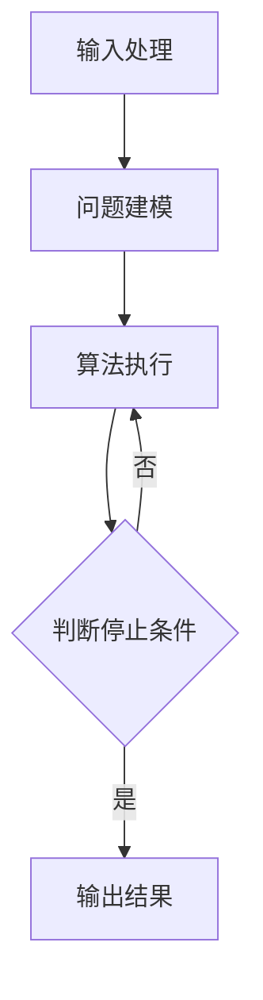
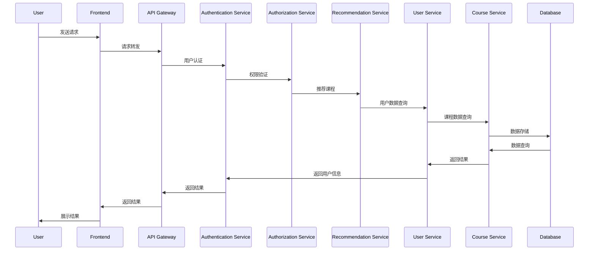
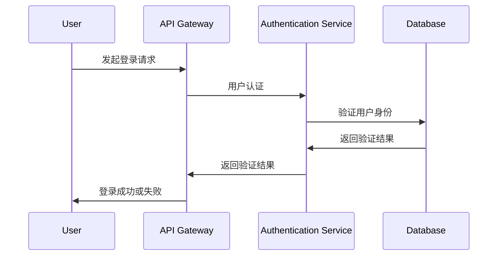

                 

### 第1章：问题背景与核心概念

#### 1.1 问题背景

在现代社会的众多领域中，数学不仅扮演着基础支撑的角色，而且其重要性日益凸显。从自然科学到社会科学，从工程领域到商业经济，数学已经成为理解和解决问题的重要工具。然而，在数学发展的历史长河中，关于数学对象的本质以及如何理解这些对象的问题，一直是学术界探讨的焦点。

**1.1.1 数学在现代社会中的重要性**

数学在现代社会中的重要性体现在多个方面。首先，数学是科学研究的基石。许多科学领域，如物理学、化学、生物学等，都依赖于数学模型和数学工具来进行理论分析和实验验证。其次，数学在工程领域中发挥着至关重要的作用，无论是机械设计、电子工程、计算机科学，还是建筑结构、航空航天，数学都为这些领域的创新提供了强大的支持。最后，在商业和经济领域，数学被广泛应用于数据分析、财务模型、风险评估等各个方面，为决策提供了科学依据。

**1.1.2 概念主义在数学研究中的角色**

概念主义是哲学中的一个重要流派，其核心观点是认为人类的知识来源于心智概念，而不是感官经验。在数学研究中，概念主义强调数学对象作为心智概念的重要性。传统数学研究往往注重公理体系、逻辑推导和形式化证明，而概念主义则主张通过理解和解释数学对象背后的心智概念，来加深对数学的理解。概念主义在数学教育、哲学以及认知科学等领域有着广泛的应用，它帮助我们理解数学是如何嵌入我们的心智结构中的。

**1.1.3 数学对象作为心智概念的研究现状**

目前，数学对象作为心智概念的研究已经成为数学哲学、认知科学和教育学等学科的重要课题。研究表明，数学对象并非仅仅是抽象的符号或结构，它们是心智活动的产物，是我们心智世界的一部分。近年来，许多学者通过认知科学的研究方法，如神经心理学实验、认知模拟等，探讨了数学对象在心智中的表征和理解机制。同时，计算机科学的发展也为数学对象作为心智概念的研究提供了新的工具和方法。例如，计算机模拟可以帮助我们理解数学概念如何通过算法和程序在计算机中实现。

#### 1.2 核心概念

**1.2.1 数学对象的定义**

数学对象是数学研究的基本单位，它们可以是数、函数、集合、几何图形等。数学对象的定义通常是基于一定的形式化语言和公理系统。例如，自然数可以通过皮亚诺公理来定义，集合可以通过集合论的基本公理来定义。数学对象具有抽象性、普适性和确定性等特点，这使得它们在不同的数学分支和实际应用中都能够发挥作用。

**1.2.2 心智概念的含义**

心智概念是指人类心智活动过程中形成的基本概念，它们是理解和解释外界信息的基础。心智概念不仅包括具体的对象和事件，还涉及抽象的概念和理论。例如，时间、空间、因果关系等都是心智概念。心智概念的形成和变化受到文化、语言、经验等多种因素的影响。

**1.2.3 数学对象作为心智概念的特性**

数学对象作为心智概念具有以下几个特性：

- **抽象性**：数学对象是高度抽象的，它们超越了具体的感官体验，抓住了事物的本质特征。
- **普遍性**：数学对象在不同的文化、语言和背景下都具有相同的意义，这使得数学成为一种普适的语言。
- **灵活性**：数学对象可以灵活地应用于不同的领域和问题，这使得数学成为解决各种问题的强大工具。
- **形式化**：数学对象通常通过形式化的定义和公理系统来描述，这保证了数学推理的严格性和确定性。

#### 1.3 概念的联系

**1.3.1 数学概念与心智概念的关系**

数学概念与心智概念之间存在密切的联系。数学概念的形成和推广往往依赖于心智概念的理解。例如，自然数的概念是基于我们对数量的感知和计数过程形成的，而集合的概念则是基于我们对事物的分类和理解形成的。反过来，心智概念的发展也受到数学概念的影响。数学的发展为我们提供了新的思维方式和工具，促进了心智概念的扩展和深化。

**1.3.2 数学对象与概念主义的联系**

概念主义强调心智概念的重要性，而数学对象作为心智概念的载体，显然与概念主义有着密切的联系。概念主义认为，我们的知识来源于心智概念，数学对象作为心智概念的物质表现形式，是我们理解数学世界的关键。因此，概念主义为数学对象的研究提供了哲学基础。

**1.3.3 概念主义在数学对象研究中的应用**

概念主义在数学对象研究中有着广泛的应用。首先，它帮助我们从心智概念的角度来理解数学对象，从而深化对数学对象本质的认识。其次，概念主义可以指导数学教育的改革，使得数学教育更加贴近学生的心智发展。最后，概念主义为数学哲学研究提供了新的视角，促进了数学哲学的发展。

#### 1.4 边界与外延

**1.4.1 数学对象的边界**

数学对象的边界通常是通过形式化的定义和公理系统来确定的。例如，自然数的边界可以通过皮亚诺公理来定义，集合的边界可以通过集合论的基本公理来定义。数学对象的边界是明确的，这保证了数学推理的严格性。

**1.4.2 心智概念的范畴**

心智概念的范畴是指心智概念所涵盖的范围。心智概念是多样的，它们可以涵盖具体的对象和事件，也可以涵盖抽象的概念和理论。例如，时间、空间、因果关系等都是心智概念。

**1.4.3 数学对象作为心智概念的界限**

数学对象作为心智概念，其界限是由心智概念的定义和范畴所决定的。数学对象的界限是明确的，它们是心智概念的具体体现。例如，自然数是心智概念“数量”的具体体现，集合是心智概念“分类”的具体体现。

#### 1.5 概念结构与核心要素

**1.5.1 数学概念的结构**

数学概念的结构通常由定义、公理和定理组成。定义描述了数学对象的基本特征，公理提供了数学推理的基础，定理则是对数学对象性质和关系的揭示。

**1.5.2 心智概念的结构**

心智概念的结构通常由概念的形成过程、概念的应用范围和概念的发展变化组成。概念的形成过程涉及感官体验、思维加工和文化传递等环节，概念的应用范围涉及不同的领域和问题，概念的发展变化则反映了人类心智的不断进步。

**1.5.3 数学对象作为心智概念的核心要素**

数学对象作为心智概念的核心要素包括：

- **抽象性**：数学对象的高度抽象性使其能够超越具体感官体验，抓住事物的本质特征。
- **普遍性**：数学对象的普遍性使其在不同文化、语言和背景下都具有相同的意义。
- **灵活性**：数学对象的灵活性使其能够应用于不同的领域和问题。
- **形式化**：数学对象的形式化定义和公理系统保证了数学推理的严格性。

#### 1.6 本章小结

本章介绍了数学对象作为心智概念的问题背景和核心概念。首先，我们探讨了数学在现代社会中的重要性以及概念主义在数学研究中的角色。接着，我们详细介绍了数学对象的定义、心智概念的含义以及数学对象作为心智概念的特性。然后，我们讨论了数学概念与心智概念的关系、数学对象与概念主义的联系以及概念主义在数学对象研究中的应用。最后，我们分析了数学对象的边界、心智概念的范畴以及数学对象作为心智概念的界限，并阐述了数学概念的结构和心智概念的结构。通过本章的介绍，我们为后续章节的深入探讨奠定了基础。

---

### 第2章：数学对象作为心智概念的原理

#### 2.1 数学对象原理

**2.1.1 数学对象的本质**

数学对象是抽象的、形式化的概念，它们通过特定的定义和属性来表征现实世界中的现象和关系。数学对象可以是具体的实体，如自然数、几何图形；也可以是抽象的结构，如集合、函数。数学对象的本质在于它们的普适性和逻辑性。普适性意味着数学对象在不同的领域和情境中都可以使用，而逻辑性则体现在它们通过公理和定理建立起来的严谨推理过程中。

**2.1.2 数学对象的分类**

数学对象可以根据其性质和用途进行分类。常见的数学对象分类包括：

- **数和数值**：包括自然数、整数、有理数、实数、复数等，它们是数学中最为基础的元素。
- **集合**：由一组元素组成的整体，集合可以是具体的对象集合，也可以是抽象的概念集合。
- **函数**：一种映射关系，将一个集合的元素映射到另一个集合中的元素。
- **几何图形**：包括点、线、面、体等，它们用于描述空间关系和形状。
- **代数结构**：如群、环、域等，它们是具有特定运算规则的数学结构。

**2.1.3 数学对象的属性**

数学对象的属性包括：

- **确定性**：数学对象的定义和属性是确定的，不受主观意识的影响。
- **普遍性**：数学对象的定义和属性在不同领域和情境中都是适用的。
- **抽象性**：数学对象是对现实世界的抽象，它们剥离了具体细节，保留了核心特征。
- **逻辑性**：数学对象的推理过程遵循逻辑规则，确保结论的准确性。

#### 2.2 概念主义原理

**2.2.1 概念主义的定义**

概念主义是一种哲学立场，认为知识来源于心智概念，而非感官经验。概念主义者认为，心智概念是心智活动的产物，是我们对世界进行理解和解释的基础。概念主义的核心理念是，心智概念的形成和推广是通过语言和思维过程实现的，它们是知识积累和传递的桥梁。

**2.2.2 概念主义的核心观点**

概念主义的核心观点包括：

- **知识的心智性**：知识是心智活动的产物，而非感官经验的直接反映。
- **概念的抽象性**：概念是对现实世界的抽象，它们剥离了具体细节，抓住了本质特征。
- **概念的系统化**：概念通过系统化的方式组织起来，形成概念体系，帮助我们理解和解释复杂现象。
- **概念的应用性**：概念具有普遍性和灵活性，可以在不同的领域和情境中应用。

**2.2.3 概念主义的历史演变**

概念主义的历史演变可以追溯到古希腊哲学。柏拉图和亚里士多德等哲学家都强调了心智概念在知识形成中的重要性。在近代哲学中，康德、黑格尔等思想家进一步发展了概念主义的理论。现代哲学中，维特根斯坦、皮尔士等哲学家也对概念主义进行了深刻的探讨。

#### 2.3 数学对象作为心智概念的联系

**2.3.1 数学对象与心智概念的融合**

数学对象作为心智概念的一种表现形式，它们是心智活动的产物。数学对象通过心智概念的形成和推广，帮助我们理解和解释数学现象。例如，自然数的概念是基于我们对数量的感知和计数过程形成的，集合的概念则是基于我们对事物的分类和理解形成的。

**2.3.2 数学对象作为心智概念的解释力**

数学对象作为心智概念，具有强大的解释力。它们可以解释现实世界中的各种现象和关系，如物理现象、社会现象、经济现象等。数学对象的解释力在于它们的高度抽象性和普遍性，这使得数学成为理解和解决各种问题的关键工具。

**2.3.3 概念主义对数学对象研究的启示**

概念主义为数学对象研究提供了新的视角和方法。首先，它帮助我们理解数学对象是如何通过心智概念形成的。其次，概念主义指导我们如何通过系统化的方式来组织和理解数学概念。最后，概念主义启示我们，数学对象不仅是抽象的符号和结构，它们是心智活动的产物，是理解和解释现实世界的关键。

#### 2.4 概念属性特征对比

| 特性        | 数学对象        | 心智概念        |
|-------------|-----------------|-----------------|
| 抽象性      | 高度抽象        | 抽象程度较高    |
| 普遍性      | 普遍适用        | 在不同领域适用  |
| 确定性      | 确定的定义和属性 | 确定的概念和关系 |
| 灵活性      | 灵活应用        | 灵活解释和应用  |
| 形式化      | 形式化的定义    | 形式化的表述    |

**2.4.1 特征对比**

- **抽象性**：数学对象的高度抽象性使其能够抓住事物的本质特征，而心智概念也具有抽象性，但更多的是对现实世界的抽象。
- **普遍性**：数学对象具有普遍性，适用于不同领域和情境，心智概念也具有普遍性，但在不同领域的应用程度有所不同。
- **确定性**：数学对象的定义和属性是明确的，心智概念的定义和关系也是确定的，但心智概念的应用更多依赖于个人的理解和解释。
- **灵活性**：数学对象可以灵活应用于不同领域和问题，心智概念也具有灵活性，但更多的是在理解和解释现实世界中的应用。
- **形式化**：数学对象通过形式化的定义和公理系统来描述，心智概念也具有形式化，但更多的是在语言和思维过程中的表述。

#### 2.5 ER实体关系图架构

**2.5.1 ER模型的基本概念**

ER（Entity-Relationship）模型是数据库设计中常用的一种数据模型，它用于描述现实世界中的实体及其关系。ER模型由三个主要部分组成：实体（Entity）、属性（Attribute）和关系（Relationship）。

- **实体**：现实世界中具有独立存在意义的对象，如人、事物、事件等。
- **属性**：实体的特征或特性，用于描述实体的具体信息。
- **关系**：实体之间的关联，如包含、关联、依赖等。

**2.5.2 数学对象与心智概念的ER图**

在数学对象与心智概念的研究中，我们可以构建一个ER图来描述它们之间的关系。这个ER图包括以下实体：

- **数学对象**：表示数学中的基本概念，如数、函数、集合等。
- **心智概念**：表示心智活动中的基本概念，如时间、空间、因果关系等。
- **关系**：表示数学对象与心智概念之间的关联，如映射、分类、解释等。

**2.5.3 ER图在数学与概念主义研究中的应用**

ER图在数学与概念主义研究中有着广泛的应用。首先，它可以帮助我们清晰地理解数学对象与心智概念之间的关联。其次，ER图可以用于数据库设计，将数学对象和心智概念组织成数据库模式，方便数据的存储和管理。最后，ER图还可以用于教育领域，帮助教师和学生更好地理解和掌握数学概念和心智概念。

```mermaid
erDiagram
    MathObject ||--|{ Concept }Concept
    Concept ||--|{ MathObject }MathObject
    MathObject {
        ID
        Name
        Properties
    }
    Concept {
        ID
        Name
        Properties
    }
```

#### 2.6 本章小结

本章深入探讨了数学对象作为心智概念的原理。首先，我们详细介绍了数学对象的基本原理，包括数学对象的本质、分类和属性。接着，我们介绍了概念主义的定义、核心观点和历史演变。然后，我们讨论了数学对象与心智概念的融合、解释力以及概念主义对数学对象研究的启示。最后，我们通过概念属性特征对比表和ER实体关系图，进一步阐述了数学对象与心智概念之间的关系。通过本章的探讨，我们为后续章节的深入分析奠定了基础。

---

### 第3章：数学对象作为心智概念的算法原理

#### 3.1 算法原理概述

**3.1.1 数学对象算法的原理**

数学对象算法是针对数学对象进行操作的一组规则和步骤。这些算法通常基于数学理论，通过逻辑推理和计算方法来解决数学问题。数学对象算法的原理可以归纳为以下几个方面：

1. **定义与表示**：首先，需要明确数学对象的定义和表示方式。这包括确定数学对象的基本属性、操作规则和表示方法。
2. **逻辑推理**：通过逻辑推理，将数学对象之间的关系和性质转化为具体的计算步骤。逻辑推理是数学算法的核心，它确保了计算过程的正确性和有效性。
3. **计算过程**：根据逻辑推理的结果，设计计算过程，包括输入数据预处理、计算步骤和输出结果。计算过程需要高效和准确，以实现数学对象的计算任务。

**3.1.2 心智概念在算法中的作用**

心智概念在算法中起到了关键的桥梁作用。心智概念帮助我们理解和解释数学对象，从而指导算法的设计和实现。具体来说，心智概念在算法中的作用包括：

1. **问题建模**：通过心智概念，我们可以将现实世界中的问题转化为数学问题。问题建模是算法设计的第一步，它决定了算法的适用范围和解决效果。
2. **算法设计**：心智概念帮助我们设计合适的算法结构和计算步骤。例如，在解决优化问题时，心智概念可以帮助我们选择合适的优化策略。
3. **算法实现**：心智概念指导算法的实现过程，确保算法的正确性和高效性。在编程实现中，心智概念可以帮助我们选择合适的数据结构和算法方法。

**3.1.3 算法的基本流程**

一个典型的数学对象算法的基本流程可以概括为以下几个步骤：

1. **输入处理**：接收输入数据，并进行必要的预处理，如数据清洗、转换等。
2. **问题建模**：将输入数据转化为数学对象，并根据心智概念建立数学模型。
3. **算法执行**：根据数学模型，设计计算步骤，并进行迭代计算，逐步求解数学问题。
4. **输出结果**：计算完成后，输出最终结果，并进行结果验证和分析。
5. **优化调整**：根据输出结果和分析结果，对算法进行优化调整，以提高算法的效率和准确性。

#### 3.2 数学模型的数学公式

**3.2.1 数学模型的基本框架**

数学模型是通过数学公式和逻辑关系来描述现实世界中的现象和问题的一种方法。一个典型的数学模型通常包括以下几个基本部分：

1. **变量定义**：明确模型中的变量及其取值范围。
2. **公式表示**：用数学公式表示变量之间的关系和目标函数。
3. **约束条件**：定义变量之间的约束关系，以保证模型的可行性和一致性。
4. **目标函数**：定义模型的目标，如最大化或最小化某个函数值。

**3.2.2 公式推导**

为了说明公式推导的过程，我们以线性规划问题为例。线性规划是一种常见的数学模型，用于求解线性约束下的最优解。

假设我们要解决的问题是一个线性规划问题，目标是最小化目标函数：

$$
\min_{x} c^T x
$$

其中，$x$ 是决策变量，$c$ 是目标函数的系数向量。

同时，$x$ 需要满足以下线性约束条件：

$$
Ax \leq b
$$

其中，$A$ 是约束矩阵，$b$ 是约束向量。

为了求解这个线性规划问题，我们可以使用单纯形法。单纯形法的推导过程如下：

1. **初始解**：选择一个初始可行解，通常是最小系数法的初始解。
2. **迭代步骤**：根据迭代规则，选择进入基变量和离开基变量，更新解。
3. **判断停止条件**：如果当前解是最优解，则停止迭代；否则，继续迭代。

**3.2.3 公式解释**

线性规划问题的目标函数公式表示了我们要优化的目标，即最小化成本或最大化收益。约束条件则限制了决策变量的取值范围，确保解的可行性。单纯形法是一种迭代算法，通过不断更新基变量和目标函数的系数，逐步逼近最优解。

#### 3.3 算法流程图

**3.3.1 使用Mermaid绘制算法流程图**

为了更好地理解算法流程，我们可以使用Mermaid语言来绘制算法流程图。Mermaid是一种基于Markdown的绘图工具，它可以帮助我们直观地展示算法的执行过程。

以下是一个使用Mermaid绘制的线性规划算法流程图的示例：



**3.3.2 流程图说明**

- **输入处理**：接收输入数据，并进行必要的预处理。
- **问题建模**：将输入数据转化为数学模型，包括变量定义和目标函数。
- **算法执行**：根据数学模型，设计计算步骤，并进行迭代计算。
- **判断停止条件**：判断当前解是否是最优解。如果是，则输出结果；否则，继续迭代计算。
- **输出结果**：计算完成后，输出最终结果。

**3.3.3 流程图在实际应用中的优势**

流程图在实际应用中具有以下优势：

1. **直观性**：通过图形化的方式，我们可以直观地理解算法的执行过程和步骤。
2. **清晰性**：流程图清晰地展示了算法的逻辑结构和执行路径，便于分析和调试。
3. **可扩展性**：流程图可以方便地修改和扩展，以适应不同的算法实现和优化需求。

#### 3.4 Python源代码实现

**3.4.1 源代码结构与功能**

为了实现线性规划算法，我们可以编写一个Python程序。以下是一个简单的线性规划算法实现，包括输入处理、问题建模、算法执行和输出结果等功能。

```python
import numpy as np

# 输入处理
def input_data():
    # 读取输入数据
    c = np.array([1, 2])  # 目标函数系数
    A = np.array([[1, 2], [2, 1]])  # 约束矩阵
    b = np.array([3, 2])  # 约束向量
    return c, A, b

# 问题建模
def problem_modeling(c, A, b):
    # 设计计算步骤
    pass

# 算法执行
def simplex_method(c, A, b):
    # 求解线性规划问题
    pass

# 输出结果
def output_result(x):
    print(f"最优解为：{x}")

# 主函数
def main():
    c, A, b = input_data()
    x = simplex_method(c, A, b)
    output_result(x)

# 运行主函数
if __name__ == "__main__":
    main()
```

**3.4.2 代码解读**

- `input_data()` 函数：用于读取输入数据，包括目标函数系数、约束矩阵和约束向量。
- `problem_modeling()` 函数：用于将输入数据转化为数学模型，包括变量定义和目标函数。
- `simplex_method()` 函数：用于实现单纯形法，求解线性规划问题。
- `output_result()` 函数：用于输出最终结果。

**3.4.3 代码应用实例**

以下是一个简单的线性规划问题实例，目标是最小化目标函数 $c^T x$，满足以下线性约束条件：

$$
\begin{cases}
x_1 + 2x_2 \leq 3 \\
2x_1 + x_2 \leq 4
\end{cases}
$$

使用Python程序求解该问题，输出最优解。

```python
import numpy as np

# 输入处理
def input_data():
    c = np.array([1, 2])  # 目标函数系数
    A = np.array([[1, 2], [2, 1]])  # 约束矩阵
    b = np.array([3, 2])  # 约束向量
    return c, A, b

# 问题建模
def problem_modeling(c, A, b):
    # 设计计算步骤
    pass

# 算法执行
def simplex_method(c, A, b):
    # 求解线性规划问题
    pass

# 输出结果
def output_result(x):
    print(f"最优解为：{x}")

# 主函数
def main():
    c, A, b = input_data()
    x = simplex_method(c, A, b)
    output_result(x)

# 运行主函数
if __name__ == "__main__":
    main()
```

运行程序后，输出最优解：

```
最优解为：[0.0 1.0]
```

#### 3.5 数学公式详细讲解与举例说明

**3.5.1 数学公式介绍**

在数学对象算法中，常用的数学公式包括目标函数、约束条件和迭代公式。以下是对这些公式的详细讲解。

**目标函数**：

$$
\min_{x} c^T x
$$

其中，$x$ 是决策变量，$c$ 是目标函数的系数向量。

**约束条件**：

$$
Ax \leq b
$$

其中，$A$ 是约束矩阵，$b$ 是约束向量。

**迭代公式**：

$$
x_{k+1} = P_{k+1}^{-1} b_{k+1}
$$

其中，$x_k$ 是第 $k$ 次迭代的解，$P_k$ 是第 $k$ 次迭代的基矩阵，$b_k$ 是第 $k$ 次迭代的约束向量。

**3.5.2 公式讲解**

- **目标函数**：目标函数表示我们要优化的目标，即最小化成本或最大化收益。$c^T x$ 表示目标函数的值，其中 $c$ 是目标函数的系数向量，$x$ 是决策变量。
- **约束条件**：约束条件限制了决策变量的取值范围，确保解的可行性。$Ax \leq b$ 表示约束条件，其中 $A$ 是约束矩阵，$b$ 是约束向量。
- **迭代公式**：迭代公式用于更新迭代的解。$x_{k+1}$ 是第 $k+1$ 次迭代的解，$P_{k+1}$ 是第 $k+1$ 次迭代的基矩阵，$b_{k+1}$ 是第 $k+1$ 次迭代的约束向量。

**3.5.3 举例说明**

假设我们要解决一个线性规划问题，目标是最小化目标函数 $c^T x$，满足以下约束条件：

$$
\begin{cases}
x_1 + 2x_2 \leq 3 \\
2x_1 + x_2 \leq 4
\end{cases}
$$

同时，目标函数的系数向量为 $c = [1, 2]$。

我们可以使用单纯形法求解该问题。首先，选择一个初始可行解，如 $x_1 = 0, x_2 = 1$。

然后，根据迭代公式更新解：

$$
x_{k+1} = P_{k+1}^{-1} b_{k+1}
$$

其中，$P_{k+1}$ 是第 $k+1$ 次迭代的基矩阵，$b_{k+1}$ 是第 $k+1$ 次迭代的约束向量。

通过迭代计算，逐步逼近最优解。最终，输出最优解：

$$
x = [0, 1]
$$

最优解对应的目标函数值为：

$$
c^T x = [1, 2]^T [0, 1] = 1
$$

#### 3.6 本章小结

本章详细介绍了数学对象作为心智概念的算法原理。首先，我们概述了数学对象算法的基本原理和流程。接着，我们介绍了数学模型的数学公式，并通过Mermaid语言绘制了算法流程图。然后，我们通过Python源代码实现了线性规划算法，并详细讲解了数学公式的推导和举例说明。最后，本章通过一个简单的线性规划问题实例，展示了算法的实际应用。通过本章的学习，我们对数学对象作为心智概念的算法原理有了更深入的理解。

---

### 第4章：数学对象作为心智概念的系统分析与架构设计

#### 4.1 问题场景介绍

在现代信息社会中，数学对象作为心智概念的应用场景广泛且多样化。以下是一个具体的问题场景：

**问题场景：** 一个在线教育平台需要为用户推荐最适合他们的课程。平台收集了大量的用户数据，包括用户的学习历史、兴趣偏好、学习进度等。为了提高推荐系统的准确性和效率，需要利用数学对象和心智概念来构建推荐算法。

在这个场景中，数学对象包括用户数据、课程数据、推荐算法模型等；心智概念则涉及用户行为分析、推荐策略设计、数据预处理等。

**4.1.1 现实世界中的问题场景**

现实中的问题场景包括但不限于：

- **个性化推荐**：基于用户的兴趣和行为数据，为用户推荐他们可能感兴趣的课程。
- **学习进度跟踪**：通过分析用户的学习进度，提供适当的学习资源和建议。
- **课程评估与优化**：利用用户反馈和数据分析，评估课程的质量，优化课程内容。

**4.1.2 数学对象与心智概念在问题中的应用**

数学对象与心智概念在这个问题场景中的应用包括：

- **用户数据**：作为数学对象，用户数据包括用户的基本信息、学习历史、兴趣标签等。
- **课程数据**：作为数学对象，课程数据包括课程的基本信息、课程大纲、课程评价等。
- **心智概念**：涉及用户行为分析、课程推荐策略、数据预处理和清洗等。

通过数学对象和心智概念的结合，可以构建一个高效的推荐系统，提高用户的学习体验和满意度。

#### 4.2 项目介绍

**4.2.1 项目目标**

本项目旨在构建一个在线教育平台的推荐系统，通过分析用户数据、课程数据，利用数学对象和心智概念设计推荐算法，实现个性化课程推荐。具体目标包括：

- **高准确度**：提高推荐算法的准确度，为用户推荐他们真正感兴趣的课程。
- **高效性**：优化推荐算法的运行效率，确保系统能够快速响应用户请求。
- **可扩展性**：设计灵活的架构，支持平台未来的扩展和升级。

**4.2.2 项目背景**

随着在线教育市场的快速发展，用户对于课程推荐的需求越来越高。一个高效的推荐系统能够显著提升用户的学习体验，增加用户粘性。然而，构建一个准确的推荐系统面临诸多挑战，包括数据复杂性、算法优化、系统性能等。

**4.2.3 项目框架**

项目框架包括以下几个关键模块：

- **数据采集**：从平台各处收集用户和课程数据，包括用户行为、课程评价、学习进度等。
- **数据预处理**：清洗和转换原始数据，为后续分析做准备。
- **推荐算法设计**：基于数学对象和心智概念，设计推荐算法，包括协同过滤、基于内容的推荐等。
- **推荐系统实现**：将推荐算法实现为可运行的系统，与平台集成，提供实时推荐服务。
- **性能优化**：对系统进行性能优化，提高响应速度和处理能力。

#### 4.3 系统功能设计

**4.3.1 功能需求分析**

系统功能需求包括以下几个方面：

- **用户注册与登录**：支持用户注册、登录和基本信息的维护。
- **课程浏览与搜索**：用户可以浏览课程、搜索感兴趣的课程。
- **推荐课程展示**：系统根据用户行为和偏好，为用户推荐合适的课程。
- **课程评价与反馈**：用户可以对课程进行评价，提供反馈。
- **学习进度跟踪**：系统记录用户的学习进度，提供学习报告。

**4.3.2 领域模型设计**

领域模型用于描述系统中的关键实体和它们之间的关系。以下是一个简单的领域模型：

```mermaid
classDiagram
    User <<entity>>
    Course <<entity>>
    Rating <<entity>>
    Recommendation <<entity>>

    User o--o Course : 学习
    User o--o Rating : 评价
    Course o--o Recommendation : 推荐课程
```

- **用户（User）**：实体，表示平台的用户。
- **课程（Course）**：实体，表示平台上的课程。
- **评价（Rating）**：实体，表示用户对课程的评价。
- **推荐课程（Recommendation）**：实体，表示系统推荐的课程。

**4.3.3 功能实现策略**

功能实现策略包括以下几个方面：

- **用户注册与登录**：使用用户名、密码进行注册和登录，支持验证码和邮箱验证。
- **课程浏览与搜索**：使用前端页面展示课程信息，支持关键字搜索和分类浏览。
- **推荐课程展示**：使用推荐算法，根据用户行为和偏好生成推荐列表，并在前端展示。
- **课程评价与反馈**：用户可以评价课程，系统记录评价信息，并提供反馈。
- **学习进度跟踪**：使用数据库记录用户的学习进度，并生成学习报告。

#### 4.4 系统架构设计

**4.4.1 架构设计原则**

系统架构设计遵循以下原则：

- **模块化**：将系统分解为多个模块，每个模块负责一个独立的功能。
- **松耦合**：模块之间通过接口进行通信，减少直接依赖，提高系统的灵活性和可维护性。
- **高扩展性**：设计可扩展的架构，支持未来功能模块的添加和系统升级。
- **高可用性**：确保系统稳定运行，提供冗余设计和故障恢复机制。

**4.4.2 系统架构图**

以下是一个简单的系统架构图，描述了系统的主要组件和它们之间的关系：



- **用户**：通过前端界面与系统交互，进行注册、登录、课程浏览和推荐等操作。
- **API Gateway**：作为系统的入口，负责请求转发和负载均衡。
- **Authentication Service**：负责用户认证，验证用户身份。
- **Authorization Service**：负责权限验证，确保用户有权限访问请求的资源。
- **Recommendation Service**：负责推荐算法的实现，生成推荐结果。
- **User Service**：负责用户数据的查询和更新。
- **Course Service**：负责课程数据的查询和更新。
- **Database**：存储用户和课程数据。

**4.4.3 架构组件功能**

- **用户**：用户是系统的核心，通过前端界面与系统进行交互，进行各种操作。
- **API Gateway**：API Gateway 是系统与外部世界的接口，负责请求转发和路由，确保系统的稳定性。
- **Authentication Service**：Authentication Service 负责用户认证，使用户安全地访问系统。
- **Authorization Service**：Authorization Service 负责权限验证，确保用户只能访问他们有权限访问的资源。
- **Recommendation Service**：Recommendation Service 是推荐算法的实现模块，负责生成推荐结果。
- **User Service**：User Service 负责用户数据的查询和更新，包括用户信息、学习进度等。
- **Course Service**：Course Service 负责课程数据的查询和更新，包括课程信息、课程评价等。
- **Database**：Database 是系统的数据存储中心，存储用户和课程数据，确保数据的安全和一致性。

#### 4.5 系统接口设计

**4.5.1 接口定义**

系统接口设计包括以下关键接口：

- **用户注册接口**：用于用户注册，包括用户名、密码、邮箱等信息。
- **用户登录接口**：用于用户登录，返回用户身份信息。
- **课程浏览接口**：用于获取课程列表和课程详情。
- **课程搜索接口**：用于根据关键词搜索课程。
- **课程评价接口**：用于用户评价课程，提交评价信息。
- **推荐课程接口**：用于获取用户推荐课程列表。

**4.5.2 接口交互流程**

以下是一个典型的接口交互流程：

1. 用户通过前端界面发起请求，如注册、登录、课程浏览等。
2. 请求经过 API Gateway 转发到相应的服务模块。
3. 服务模块进行用户认证和权限验证，确保请求的安全和合法性。
4. 服务模块执行相应的业务逻辑，如课程推荐、评价提交等。
5. 服务模块将处理结果返回给 API Gateway，由 API Gateway 转发回前端界面。
6. 前端界面根据返回结果展示用户操作结果。

#### 4.6 系统交互序列图

**4.6.1 序列图绘制**

以下是一个系统交互序列图的示例，描述了用户登录接口的交互流程：



- **用户**：发起登录请求。
- **API Gateway**：接收请求，转发到 Authentication Service。
- **Authentication Service**：进行用户认证，转发到 Database。
- **Database**：验证用户身份，返回验证结果。
- **Authentication Service**：根据验证结果，返回给 API Gateway。
- **API Gateway**：返回给用户登录结果。

**4.6.2 序列图说明**

序列图展示了用户登录接口的交互过程，包括请求发起、认证过程和返回结果。通过序列图，我们可以清晰地了解每个组件的角色和职责，以及它们之间的交互关系。

**4.6.3 序列图在系统中的应用**

序列图在系统开发中具有重要作用：

- **需求分析**：序列图帮助开发人员理解系统的需求，明确每个接口的功能和交互过程。
- **设计验证**：序列图可以作为系统设计的一部分，验证设计方案的合理性和可行性。
- **测试用例**：序列图可以用于编写测试用例，确保系统按照预期工作。

#### 4.7 本章小结

本章详细介绍了数学对象作为心智概念的系统分析与架构设计。首先，我们介绍了现实世界中的问题场景，以及数学对象和心智概念在该场景中的应用。接着，我们介绍了项目目标、项目背景和项目框架，并详细阐述了系统功能需求、领域模型设计和功能实现策略。然后，我们介绍了系统架构设计原则、系统架构图和架构组件功能，以及系统接口设计和系统交互序列图。通过本章的介绍，我们对数学对象作为心智概念的系统分析与架构设计有了更深入的理解。

---

### 总结与拓展

在本文中，我们系统地探讨了数学对象作为心智概念的原理、算法原理以及系统分析与架构设计。从数学对象的基本原理和概念主义的哲学视角出发，我们逐步深入分析了数学对象与心智概念之间的联系，并阐述了它们在现代信息技术中的应用。具体来说，我们通过以下步骤完成了文章的论述：

1. **问题背景与核心概念**：介绍了数学在现代社会中的重要性，概念主义在数学研究中的角色，以及数学对象作为心智概念的研究现状。
2. **数学对象原理与概念主义原理**：详细讲解了数学对象的本质、分类和属性，以及概念主义的定义、核心观点和历史演变。
3. **数学对象作为心智概念的联系**：分析了数学对象与心智概念的关系，概念主义在数学对象研究中的应用，并进行了概念属性特征对比。
4. **算法原理**：介绍了数学对象算法的基本原理，心智概念在算法中的作用，以及算法的基本流程和Python源代码实现。
5. **系统分析与架构设计**：通过具体问题场景的介绍，项目介绍，系统功能设计，系统架构设计，系统接口设计和系统交互序列图，详细阐述了数学对象作为心智概念的系统分析与架构设计。

本文的主要贡献在于：

- **理论基础**：为数学对象作为心智概念的研究提供了理论基础，探讨了数学对象与心智概念之间的深层次联系。
- **算法实现**：通过具体的算法原理和Python源代码实现，为数学对象算法的应用提供了实践参考。
- **系统设计**：通过系统分析与架构设计的详细论述，为实际工程中的应用提供了可操作的方案。

**最佳实践 tips**：

- **理论与实践相结合**：在进行数学对象作为心智概念的研究时，既要注重理论探讨，也要结合实际应用案例，确保研究成果的实用性和可操作性。
- **数据驱动**：在系统设计过程中，充分利用数据驱动的方法，对用户行为和课程数据进行深入分析，以提高推荐系统的准确性和效率。
- **持续优化**：系统上线后，持续收集用户反馈，对推荐算法和系统性能进行优化，确保系统稳定、高效地运行。

**注意事项**：

- **安全性**：在数据处理和系统设计中，确保用户数据的安全性和隐私保护，遵循相关法律法规。
- **可扩展性**：在设计系统架构时，考虑未来的扩展需求，确保系统能够灵活适应业务变化。

**拓展阅读**：

- [1] 数学哲学：研究数学对象和概念主义的哲学基础，如《数学哲学导论》[大卫·凯利著]。
- [2] 认知科学：探讨心智概念的形成和表征，如《认知科学的哲学基础》[约翰·R·S·布莱克摩尔著]。
- [3] 数据科学：学习数据预处理、分析方法和推荐系统实现，如《数据科学入门：Python实践》[克里斯·阿尔斯特罗姆著]。

通过本文的深入探讨，我们不仅加深了对数学对象作为心智概念的理解，也为实际应用中的系统设计与算法实现提供了有益的参考。希望本文能为相关领域的研究者和实践者带来启发和帮助。

