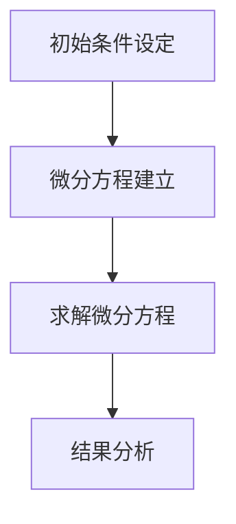
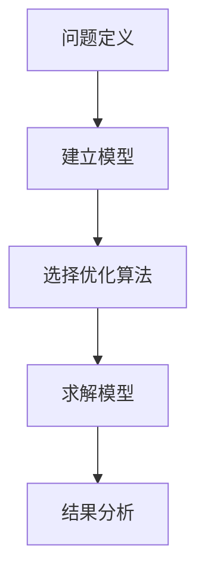
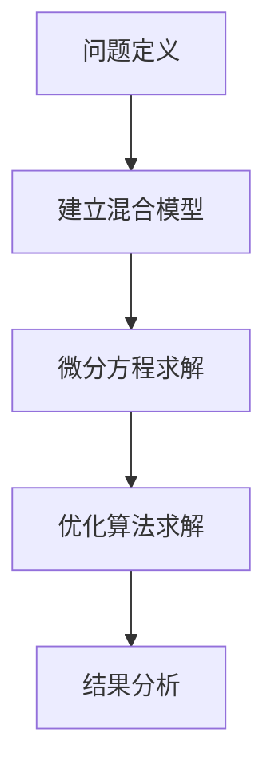

                 

## 数学与气候政策：碳排放的数学控制

### 关键词：气候变化、碳排放、数学模型、优化算法、政策分析

### 摘要：
本文以《数学与气候政策：碳排放的数学控制》为题，深入探讨了数学在气候政策中的关键作用，尤其是碳排放的数学控制。文章首先介绍了气候变化的紧迫性和碳排放的基本概念，随后详细讲解了微分方程、优化算法和混合模型等数学模型，通过实际案例展示了这些模型在碳排放控制中的应用。最后，文章对当前气候政策的不足进行了分析，并提出了基于数学模型的改进建议，强调了数学在气候政策中的重要性。

## 引言

### 第1章 气候变化的挑战

### 1.1 气候变化的事实与数据

气候变化已成为全球关注的焦点。根据联合国气候变化框架公约（UNFCCC）的数据，过去一个世纪全球平均气温已经上升了约1.1摄氏度。这一升温趋势对地球生态系统和人类生活带来了显著影响。极端天气事件如热浪、干旱、暴雨和台风的频率和强度都在增加。气候变化还导致了海平面上升、冰川融化、生态系统失衡等问题。

### 1.2 气候变化的影响

气候变化对环境、经济和社会产生了广泛而深远的影响。环境方面，生态系统破坏、物种灭绝、生物多样性减少等问题日益严重。经济方面，极端天气事件造成的经济损失不断增加，例如农业减产、基础设施破坏等。社会方面，气候变化加剧了贫困和不平等，尤其是对发展中国家和弱势群体的影响更为显著。

### 1.3 碳排放与气候变化的关系

碳排放是导致气候变化的主要原因之一。化石燃料的燃烧、工业生产、交通运输等人类活动大量释放二氧化碳（CO₂）等温室气体，导致大气中的温室气体浓度增加，从而加剧了全球变暖。根据国际能源署（IEA）的数据，2019年全球二氧化碳排放量达到36.8亿吨。

### 1.4 数学在气候政策中的角色

数学在气候政策中发挥着关键作用，特别是在碳排放控制方面。数学模型可以量化碳排放的影响，预测气候变化趋势，评估不同政策方案的效果。通过优化算法，可以找出最有效的减排策略，从而为政策制定提供科学依据。

## 背景知识

### 第2章 背景知识

### 2.1 气候变化的科学原理

气候变化是由于大气中温室气体浓度的增加导致的全球气温升高。温室气体如二氧化碳、甲烷和水蒸气等能够吸收和发射地球表面向外辐射的红外辐射，从而导致温室效应。随着工业革命以来人类活动的增加，温室气体的排放量急剧上升，使得全球气温逐渐升高。

### 2.2 碳排放的基本概念

碳排放是指由于人类活动而产生的二氧化碳等温室气体的排放。主要的碳排放源包括化石燃料的燃烧、工业生产、农业和土地利用变化等。碳排放的控制是减缓气候变化的关键措施之一。

### 2.3 气候模型概述

气候模型是用来模拟和研究气候变化的一种数学工具。根据模型的复杂程度，气候模型可以分为简单模型、中等模型和复杂模型。这些模型可以帮助科学家预测未来气候变化趋势，评估不同政策方案的效果。

## 数学模型介绍

### 第3章 微分方程模型

### 3.1 微分方程的基本概念

微分方程是描述物理现象的数学方程，其中包含未知函数及其导数。在气候模型中，微分方程可以用来描述大气中温室气体的浓度变化。

### 3.2 微分方程在气候模型中的应用

微分方程在气候模型中的应用非常广泛。例如，可以通过微分方程来描述二氧化碳在大气中的扩散过程，以及温室气体对地球辐射平衡的影响。

### 3.3 微分方程模型的数学公式

$$
\frac{dC}{dt} = -kC
$$

其中，$C$ 表示二氧化碳浓度，$t$ 表示时间，$k$ 表示扩散系数。

### 3.4 微分方程模型的mermaid流程图

### 第4章 优化算法模型

### 4.1 优化算法的基本概念

优化算法是一类用于寻找最优解的算法，广泛应用于各类科学和工程问题。在碳排放控制中，优化算法可以用来确定最有效的减排策略。

### 4.2 优化算法在碳排放控制中的应用

优化算法可以用来优化碳排放的分配，找出最有效的减排路径。例如，线性规划和整数规划是常用的优化算法，可以用来解决碳排放分配问题。

### 4.3 优化算法的数学公式

线性规划：
$$
\min_{x} c^T x \\
\text{s.t. } Ax \leq b
$$

其中，$x$ 是变量，$c$ 是系数向量，$A$ 是系数矩阵，$b$ 是常数向量。

### 4.4 优化算法的mermaid流程图

### 第5章 混合模型

### 5.1 混合模型的基本概念

混合模型是结合了多种算法优点的模型，常用于解决复杂问题。在碳排放控制中，混合模型可以结合微分方程和优化算法，以提高预测和优化效果。

### 5.2 混合模型在碳排放控制中的应用

混合模型可以同时考虑碳排放的动态变化和优化策略，从而更准确地预测未来碳排放趋势，并制定出最优的减排计划。

### 5.3 混合模型的数学公式

混合模型通常由以下公式表示：
$$
\min_{x} c^T x + \lambda \cdot \text{Penalty}(x) \\
\text{s.t. } Ax \leq b
$$

其中，$\lambda$ 是惩罚系数，$Penalty(x)$ 是惩罚函数。

### 5.4 混合模型的mermaid流程图

## 模型应用案例

### 第6章 案例一：碳排放峰值预测

#### 6.1 案例背景

某地区计划在未来五年内实现碳排放峰值，并制定相应的减排计划。为了确保计划的可行性，需要预测该地区的碳排放峰值。

#### 6.2 模型选择

选择微分方程模型进行碳排放峰值预测。该模型可以描述碳排放浓度随时间的变化趋势。

#### 6.3 模型参数调整

根据历史碳排放数据，调整微分方程模型的参数，以更好地拟合实际碳排放趋势。

#### 6.4 预测结果分析

通过微分方程模型，预测出未来五年的碳排放峰值，并分析预测结果的可靠性。

### 第7章 案例二：碳排放优化分配

#### 7.1 案例背景

某地区需要制定碳排放优化分配方案，以实现最低的碳排放总量。为了提高分配效率，需要使用优化算法确定最优分配策略。

#### 7.2 模型选择

选择线性规划模型进行碳排放优化分配。该模型可以确定各碳排放源的最优分配比例。

#### 7.3 模型参数调整

根据实际碳排放数据，调整线性规划模型的参数，以优化碳排放分配方案。

#### 7.4 优化结果分析

通过线性规划模型，确定各碳排放源的最优分配比例，并分析优化结果的有效性。

## 政策分析和建议

### 第8章 政策现状与不足

#### 8.1 当前碳排放政策概述

当前全球各地的碳排放政策主要包括碳排放限额和交易体系、碳税和补贴等。然而，这些政策在实际执行过程中存在一些问题。

#### 8.2 现行政策的不足

现行碳排放政策主要存在以下不足：政策执行力度不够、政策效果评估不足、政策调整不及时等。

#### 8.3 数学模型在政策改进中的应用

通过数学模型，可以更科学地评估不同政策方案的效果，并制定出更有效的减排策略。

### 第9章 改进建议

#### 9.1 碳排放峰值设定

设定明确的碳排放峰值目标，并制定相应的减排计划。

#### 9.2 碳排放优化分配

通过优化算法，确定最优的碳排放分配方案，提高分配效率。

#### 9.3 数学模型在政策评估中的应用

使用数学模型评估不同政策方案的效果，以指导政策调整。

#### 9.4 国际合作与协调

加强国际合作，共同应对气候变化挑战。

### 结论

### 第10章 总结与展望

#### 10.1 全文总结

本文探讨了数学在气候政策中的关键作用，特别是碳排放的数学控制。通过微分方程、优化算法和混合模型等数学模型，可以更准确地预测碳排放趋势，制定最优的减排策略。

#### 10.2 数学在气候政策中的重要性

数学模型在气候政策中的应用具有重要意义，可以提高政策制定的科学性，实现更有效的碳排放控制。

#### 10.3 未来研究方向

未来研究应重点关注数学模型在气候政策中的应用，以及如何进一步优化这些模型，以应对气候变化带来的挑战。

#### 10.4 拓展阅读

对于希望深入了解数学与气候政策的读者，以下书籍和资源可以作为拓展阅读：

- 《数学建模与气候政策》
- 《气候变化经济学》
- 《碳排放交易机制》

## 附录

### 作者信息

作者：AI天才研究院/AI Genius Institute & 禅与计算机程序设计艺术 /Zen And The Art of Computer Programming

本文由AI天才研究院撰写，旨在探讨数学在气候政策中的应用，特别是碳排放的数学控制。文章基于最新的科学研究和技术发展，旨在为政策制定者和公众提供有价值的参考。

### 参考文献

[1] Intergovernmental Panel on Climate Change (IPCC). (2014). Climate Change 2014: Synthesis Report. Contribution of Working Groups I, II and III to the Fifth Assessment Report of the Intergovernmental Panel on Climate Change.

[2] Intergovernmental Panel on Climate Change (IPCC). (2019). Special Report on the Ocean and Cryosphere in a Changing Climate. Contribution of Working Groups I, II, and III to the Sixth Assessment Report of the Intergovernmental Panel on Climate Change.

[3] International Energy Agency (IEA). (2020). CO₂ Emissions from Fuel Combustion: 2020 Report.

[4] European Environment Agency (EEA). (2021). Climate change, impacts and vulnerability in Europe 2021. Synthesis report.

[5] Nordhaus, W. D. (2018). Climate Change and the Economy: A Survey. Journal of Economic Literature, 56(3), 833-878.

[6] Stavins, R. N. (2015). Climate Change Policy: Evolution, Challenges and Opportunities. Review of Environmental Economics and Policy, 9(1), 14-28.

