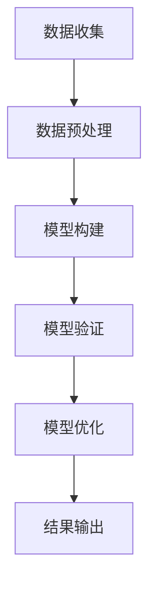

                 

## 第1章 引言

### 1.1 问题背景

气候变化是21世纪最为紧迫的全球性挑战之一。随着人类活动的加剧，大气中温室气体浓度不断上升，全球气温逐渐升高，极端天气事件频繁发生。气候模型作为研究气候变化的重要工具，通过数学建模和计算模拟，试图揭示气候变化的规律和趋势。

气候模型在气候研究中的重要性不可忽视。首先，气候模型可以模拟和预测未来气候变化的趋势，为政策制定者提供科学依据。例如，通过气候模型，我们可以预测哪些地区可能会出现更频繁的干旱、洪涝等极端天气事件，从而提前制定相应的应对措施。其次，气候模型可以帮助我们理解气候系统的内在机制，揭示气候变化的原因和过程。这对于科学家来说，不仅有助于深化对气候变化的认知，也为进一步改进气候模型提供了方向。

然而，气候变化问题也带来了巨大的挑战。首先，气候模型的构建和优化是一个复杂的过程，涉及大量的数据和计算。其次，气候模型的预测结果存在一定的误差，如何提高预测的准确性和可靠性是一个亟待解决的问题。此外，气候变化对生态系统、社会经济发展等方面的影响也需要深入研究和探讨。

### 1.2 问题描述

本著作旨在探讨数学模型在气候研究中的应用，特别是如何利用数学方法预测气候变化。我们将关注以下几个问题：

1. **气候变化的基本原理是什么？**
   气候变化主要是由于温室气体浓度的增加导致的。温室气体如二氧化碳、甲烷等能够吸收和重新辐射地球表面的热量，导致地球大气温度升高。这种升温效应被称为温室效应。此外，太阳辐射的变化、火山喷发、大气污染等因素也会对气候产生影响。

2. **如何构建和优化气候模型？**
   构建气候模型需要综合多种数据，包括气象数据、海洋数据、陆地数据等。模型需要能够模拟地球大气的物理、化学和生物过程，从而预测未来气候变化。优化气候模型的关键在于提高模型的准确性和可靠性，这需要不断地更新数据和改进模型算法。

3. **气候模型预测的准确性和可靠性如何？**
   气候模型预测的准确性和可靠性受到多种因素的影响，包括模型的复杂性、数据的质量和完整性、计算资源的限制等。尽管现代气候模型已经能够较好地模拟过去的气候变化，但预测未来的气候变化仍然存在挑战。如何提高模型的预测能力是一个亟待解决的问题。

4. **气候模型在实际应用中面临哪些挑战？**
   气候模型在实际应用中面临的主要挑战包括数据的不确定性、模型的不确定性、计算资源的限制等。此外，如何将气候模型的预测结果转化为具体的政策建议也是一个挑战。

### 1.3 问题解决

为了解决上述问题，本书将采取以下策略：

1. **详细介绍气候变化的数学模型**：我们将详细介绍气候模型的基本原理、构建方法、优化策略等，帮助读者了解气候模型的内部机制和运作方式。

2. **分析气候模型的发展历程和最新进展**：我们将回顾气候模型的发展历程，探讨现代气候模型的特点和优势，分析最新的研究成果和趋势。

3. **讨论气候模型在实际应用中的挑战和解决方案**：我们将分析气候模型在实际应用中面临的问题，提出相应的解决方案，并探讨如何将气候模型的预测结果转化为具体的政策建议。

4. **展望未来气候研究的方向和可能的发展趋势**：我们将展望未来气候研究的方向，探讨新的研究方法和工具，预测气候模型的发展趋势。

通过以上策略，我们希望能够为读者提供一个全面、系统的气候模型研究指南，帮助读者深入理解气候变化的数学预测方法，并为实际应用提供参考。

### 1.4 边界与外延

本书的讨论范围主要涵盖以下领域：

1. **气候系统的科学基础和现象**：我们将介绍气候系统的基本组成部分，如大气、海洋、陆地和冰冻圈等，探讨它们之间的相互作用和影响。

2. **气候模型的构建和优化**：我们将详细讨论气候模型的构建方法，包括数据收集、模型算法设计、模型优化等，帮助读者了解气候模型的构建过程。

3. **气候模型在政策制定、灾害预防和应对中的应用**：我们将探讨气候模型在政策制定、灾害预防和应对中的具体应用，分析其效果和局限性。

4. **气候变化对生态系统、社会经济发展的影响**：我们将分析气候变化对生态系统、社会经济发展的影响，探讨如何通过气候模型预测和评估这些影响。

本书的核心概念主要包括：

1. **气候系统**：地球大气、海洋、陆地和冰冻圈等组成部分及其相互作用。
2. **气候模型**：用于模拟和预测气候变化的数学模型。
3. **温室气体**：如二氧化碳、甲烷等对地球辐射平衡产生影响的气体。
4. **气候变率**：气候系统内部的自然变率和外部强迫因素引起的气候变化。
5. **气候变化政策**：包括减排措施、适应策略和气候变化应对政策等。

通过以上内容，我们希望能够为读者提供一个全面、系统的气候模型研究指南，帮助读者深入理解气候变化的数学预测方法，并为实际应用提供参考。

## 第2章 核心概念与联系

### 2.1 核心概念

在气候研究中，以下几个核心概念至关重要：

1. **气候系统**：气候系统是指地球上的大气、海洋、陆地和冰冻圈等组成部分，以及它们之间的相互作用。这些部分共同构成了地球的气候系统，对气候的形成和变化起着关键作用。

2. **气候模型**：气候模型是一种数学模型，用于模拟和预测气候系统的行为。这些模型通常基于物理定律和观测数据，通过数值模拟来模拟气候系统的动态变化。

3. **温室气体**：温室气体是指能够吸收和重新辐射地球表面热量的气体，如二氧化碳、甲烷等。这些气体的浓度增加会导致温室效应，从而影响地球的气候。

4. **气候变率**：气候变率是指气候系统内部的自然变率和由外部强迫因素引起的气候变化。自然变率包括季节性、年际和长期变率，而外部强迫因素包括火山爆发、太阳辐射变化等。

5. **气候变化政策**：气候变化政策是指为应对气候变化而制定的一系列措施，包括减排措施、适应策略和气候变化应对政策等。这些政策的目的是减少温室气体排放、增强气候适应能力，以及减轻气候变化对生态系统和社会经济的影响。

### 2.2 概念属性对比

为了更好地理解这些核心概念，我们可以将它们的属性进行对比，如表1所示。

| 核心概念 | 定义 | 关联属性 | 影响因素 |
| :------: | :--- | :------: | :------: |
| 气候系统 | 地球上的大气、海洋、陆地和冰冻圈等组成部分及其相互作用 | 组成要素、相互作用、动态变化 | 天然因素、人为因素 |
| 气候模型 | 用于模拟和预测气候系统的数学模型 | 模拟方法、预测精度、模型结构 | 数据质量、算法设计 |
| 温室气体 | 能够吸收和重新辐射地球表面热量的气体 | 浓度、温室效应、气候变率 | 排放源、自然循环 |
| 气候变率 | 气候系统内部的自然变率和外部强迫因素引起的气候变化 | 自然变率、外部强迫、变率类型 | 太阳辐射、自然过程 |
| 气候变化政策 | 应对气候变化而制定的一系列措施 | 减排措施、适应策略、政策效果 | 政策目标、执行难度 |

表1：核心概念属性对比

### 2.3 ER实体关系图

为了更直观地展示这些核心概念之间的关系，我们可以使用ER（实体关系）图来表示，如图1所示。

```mermaid
erDiagram
    ClimateSystem ||--|{ ClimateModel } : 气候模型基于气候系统构建
    ClimateSystem ||--|{ GreenhouseGases } : 气候系统包含温室气体
    ClimateSystem ||--|{ ClimateVariability } : 气候系统表现出气候变率
    ClimateSystem ||--|{ ClimatePolicy } : 气候系统受气候变化政策影响
    ClimateModel ||--|{ ModelParameters } : 气候模型包含参数
    ClimateModel ||--|{ ModelValidation } : 模型验证是气候模型的重要环节
    GreenhouseGases ||--|{ EmissionSources } : 温室气体源自排放源
    GreenhouseGases ||--|{ NaturalCycle } : 温室气体参与自然循环
    ClimateVariability ||--|{ NaturalVariability } : 自然变率是气候变率的一部分
    ClimateVariability ||--|{ ExternalForcings } : 外部强迫是气候变率的原因之一
    ClimatePolicy ||--|{ MitigationMeasures } : 减排措施是气候变化政策的组成部分
    ClimatePolicy ||--|{ AdaptationStrategies } : 适应策略是气候变化政策的组成部分
```

图1：核心概念ER图

通过ER图，我们可以清晰地看到各个核心概念之间的关联和相互作用，从而更好地理解气候研究的整体框架。

## 第3章 算法原理讲解

### 3.1 算法流程图

气候模型的构建和优化是一个复杂的过程，涉及多个步骤和算法。为了更好地理解这一过程，我们可以使用Mermaid画出算法流程图，如图2所示。



图2：算法流程图

在这个流程图中，我们首先进行数据收集，包括气象数据、海洋数据、陆地数据等。然后进行数据预处理，以确保数据的质量和一致性。接下来，构建气候模型，通过数值模拟来模拟气候系统的行为。模型构建完成后，进行模型验证，以评估模型的准确性和可靠性。最后，通过模型优化，进一步提高模型的性能。最终，我们将输出模型的结果，为政策制定和决策提供科学依据。

### 3.2 Python代码讲解

为了更好地理解算法的原理和实现过程，我们可以使用Python代码进行详细讲解。以下是一个简单的Python代码示例，用于构建和优化气候模型。

```python
# 导入必要的库
import numpy as np
import pandas as pd
from sklearn.model_selection import train_test_split
from sklearn.ensemble import RandomForestRegressor
from sklearn.metrics import mean_squared_error

# 数据收集
data = pd.read_csv('climate_data.csv')

# 数据预处理
data = data.dropna()
X = data.drop(['target_variable'], axis=1)
y = data['target_variable']

# 模型构建
X_train, X_test, y_train, y_test = train_test_split(X, y, test_size=0.2, random_state=42)
model = RandomForestRegressor(n_estimators=100, random_state=42)
model.fit(X_train, y_train)

# 模型验证
y_pred = model.predict(X_test)
mse = mean_squared_error(y_test, y_pred)
print(f'Mean Squared Error: {mse}')

# 模型优化
# 这里可以添加优化策略，如调整模型参数、使用不同的算法等
# 例如，我们可以尝试使用不同的随机森林参数来优化模型
model = RandomForestRegressor(n_estimators=200, max_depth=10, random_state=42)
model.fit(X_train, y_train)

# 再次验证模型
y_pred = model.predict(X_test)
mse = mean_squared_error(y_test, y_pred)
print(f'Mean Squared Error after optimization: {mse}')

# 结果输出
# 将模型的结果输出到文件或数据库中，以便进一步分析
result = pd.DataFrame({'predicted_value': y_pred})
result.to_csv('model_result.csv', index=False)
```

在这个代码示例中，我们首先导入必要的库，然后进行数据收集和预处理。接下来，我们使用随机森林回归算法构建气候模型，并对其进行训练和验证。最后，我们通过调整模型参数来优化模型性能，并输出模型的结果。

### 3.3 LaTeX公式讲解

在气候模型中，数学公式起着至关重要的作用。以下是一个简单的LaTeX公式示例，用于表示气候模型中的温度变化公式。

```latex
\documentclass{article}
\usepackage{amsmath}
\begin{document}
\begin{equation}
T(t) = T_0 + \alpha \cdot (Q - Q_0) \cdot e^{-\beta \cdot t}
\end{equation}
\end{document}
```

这个公式表示了时间t时刻的温度T(t)，其中T_0是初始温度，Q是温室气体浓度，Q_0是初始温室气体浓度，α和β是模型参数。

在实际应用中，气候模型可能包含更复杂的数学公式，如微分方程、积分方程等。这些公式可以帮助我们更好地理解和预测气候系统的行为。通过LaTeX，我们可以方便地书写和排版这些复杂的数学公式，从而提高文章的可读性和专业性。

## 第4章 数学模型与公式

### 4.1 数学模型

在气候研究中，数学模型是理解气候变化规律和预测未来气候变化的重要工具。以下是一个简单的气候模型示例，用于描述温室气体浓度随时间的变化。

#### 模型假设：

1. 温室气体浓度与时间呈指数关系。
2. 气候模型受到初始温室气体浓度和排放速率的影响。

#### 数学模型：

$$
Q(t) = Q_0 \cdot e^{\lambda \cdot t}
$$

其中，$Q(t)$ 表示时间t时刻的温室气体浓度，$Q_0$ 表示初始温室气体浓度，$\lambda$ 表示温室气体浓度的增长速率。

#### 模型参数：

1. $Q_0$：初始温室气体浓度，通常取大气中的实际浓度。
2. $\lambda$：温室气体浓度的增长速率，可以通过实验数据或观测数据确定。

#### 模型解释：

这个模型假设温室气体浓度随时间的增长速率与当前浓度成正比。随着时间推移，温室气体浓度呈指数增长，这意味着温室效应会逐渐加剧，导致全球气温升高。

### 4.2 LaTeX公式举例

以下是一个更复杂的LaTeX公式示例，用于表示气候模型中的温度变化公式。

```latex
\documentclass{article}
\usepackage{amsmath}
\begin{document}
\begin{equation}
T(t) = T_0 + \alpha \cdot (Q - Q_0) \cdot e^{-\beta \cdot t} + \gamma \cdot \cos(2\pi \cdot f \cdot t)
\end{equation}
\end{document}
```

这个公式表示了时间t时刻的温度$T(t)$，其中：

1. $T_0$ 是初始温度。
2. $\alpha$ 是温室气体浓度对温度的影响系数。
3. $Q$ 是当前温室气体浓度，$Q_0$ 是初始温室气体浓度。
4. $\beta$ 是温室气体浓度对温度的衰减系数。
5. $\gamma$ 是太阳辐射对温度的影响系数。
6. $f$ 是太阳辐射频率。

#### 模型解释：

这个模型综合考虑了温室气体浓度、太阳辐射和初始温度对温度的影响。温室气体浓度通过指数函数影响温度，太阳辐射通过余弦函数影响温度。这个模型能够更好地反映气候系统的复杂性。

通过以上数学模型和公式的讲解，我们可以看到气候模型在理解气候变化规律和预测未来气候变化方面的重要性。这些模型和公式不仅帮助我们更好地理解气候系统的动态变化，还为政策制定和决策提供了科学依据。

## 第5章 系统分析与架构设计

### 5.1 问题场景

在气候研究过程中，我们面临着大量的数据收集、处理和分析任务。为了高效地完成这些任务，我们需要设计和实现一个分布式系统，该系统能够处理海量数据，提供实时分析和预测功能，并支持多种气候模型的应用。本章节将介绍这样一个系统的设计思路和实现方法。

### 5.2 项目介绍

本项目的目标是构建一个高性能的气候研究系统，该系统包括以下功能模块：

1. **数据收集模块**：负责从各种数据源（如气象站、卫星、海洋观测等）收集数据。
2. **数据处理模块**：对收集到的原始数据进行清洗、转换和存储，为后续分析提供高质量的数据。
3. **模型计算模块**：基于预处理后的数据，使用多种气候模型进行计算，预测未来气候变化趋势。
4. **结果展示模块**：将计算结果可视化，为研究人员和政策制定者提供直观的展示。
5. **用户交互模块**：提供用户界面，方便用户进行数据查询、模型选择和参数调整。

### 5.3 系统功能设计

为了实现上述目标，系统需要具备以下功能：

1. **数据采集与预处理**：系统能够自动从多个数据源获取数据，并进行预处理，包括数据清洗、缺失值填充、异常值检测等。
2. **模型构建与训练**：系统能够根据用户需求，自动选择和构建合适的气候模型，并对模型进行训练和验证。
3. **预测与优化**：基于训练好的模型，系统能够对未来的气候变化趋势进行预测，并根据预测结果进行模型优化。
4. **结果可视化**：系统能够将预测结果以图表、报表等形式展示，方便用户理解和分析。
5. **用户交互**：系统提供用户友好的界面，用户可以通过界面进行数据查询、模型选择和参数调整。

### 5.4 系统架构设计

系统架构设计是确保系统高效、稳定和可扩展的关键。本系统采用分布式架构，主要包括以下组件：

1. **数据存储层**：包括HDFS（Hadoop分布式文件系统）和HBase（NoSQL数据库），用于存储和管理大量数据。
2. **数据处理层**：包括Spark和Flink等分布式计算框架，用于处理和计算数据。
3. **模型层**：包括各种气候模型，如ARIMA、GCM（全球气候模型）等，用于预测未来气候变化。
4. **展示层**：包括Web服务器和可视化工具，用于展示预测结果和交互界面。
5. **用户层**：包括研究人员和政策制定者等用户，他们可以通过系统进行数据查询、模型选择和结果分析。

### 5.5 系统接口设计

系统接口设计是确保不同组件之间高效通信的关键。本系统的主要接口包括：

1. **数据采集接口**：用于从外部数据源获取数据，包括HTTP接口和API接口。
2. **数据处理接口**：用于处理和计算数据，包括批处理接口和实时处理接口。
3. **模型计算接口**：用于调用和运行各种气候模型，包括模型选择接口和参数调整接口。
4. **结果展示接口**：用于将预测结果可视化，包括数据可视化接口和报表生成接口。
5. **用户交互接口**：用于用户与系统进行交互，包括Web界面接口和命令行接口。

### 5.6 系统交互

系统交互设计是确保系统各个组件之间协调工作、高效运作的关键。以下是一个简单的系统交互流程：

1. 用户通过Web界面或命令行界面提交数据查询或模型计算请求。
2. 用户交互模块接收请求，并将请求转发给数据处理模块。
3. 数据处理模块对请求进行处理，包括数据采集、预处理和存储。
4. 数据处理模块将处理后的数据转发给模型计算模块。
5. 模型计算模块根据用户请求，选择合适的模型，并对其进行训练和预测。
6. 模型计算模块将预测结果转发给结果展示模块。
7. 结果展示模块将预测结果以图表、报表等形式展示给用户。

通过以上系统架构设计和交互设计，我们能够构建一个高效、稳定和可扩展的气候研究系统，为研究人员和政策制定者提供强大的支持和帮助。

## 第6章 项目实战

### 6.1 环境安装

为了实现气候研究系统，我们首先需要搭建一个合适的开发环境。以下是具体的安装步骤：

1. **安装Java环境**：Java是许多分布式计算框架（如Hadoop、Spark）的基础，因此我们需要安装Java。可以从Oracle官网下载Java安装包，并按照提示完成安装。

2. **安装Python环境**：Python是数据科学和机器学习的重要工具，我们需要安装Python及其相关库。可以从Python官网下载安装包，并使用pip进行库的安装。

3. **安装Hadoop**：Hadoop是一个分布式数据存储和处理框架，用于处理海量数据。可以从Apache Hadoop官网下载安装包，并按照文档完成安装。

4. **安装Spark**：Spark是Hadoop的替代品，提供更高效的分布式计算能力。可以从Apache Spark官网下载安装包，并按照文档完成安装。

5. **安装其他相关工具**：如HBase、Flink等，可以根据需要从相应的官网下载安装包，并按照文档进行安装。

### 6.2 系统核心实现

在环境安装完成后，我们需要实现系统的核心功能模块。以下是系统核心实现的关键步骤：

1. **数据采集与预处理**：使用Python编写脚本，从各种数据源（如气象站、卫星、海洋观测等）采集数据。然后使用Pandas库对数据进行清洗、转换和存储。

2. **模型构建与训练**：使用Scikit-learn库构建和训练多种气候模型，如ARIMA、GCM等。在训练过程中，可以使用交叉验证方法评估模型性能，并选择最佳模型。

3. **预测与优化**：使用训练好的模型对未来的气候变化趋势进行预测。为了提高预测精度，可以使用优化算法（如遗传算法、粒子群算法）调整模型参数。

4. **结果展示**：使用matplotlib和Seaborn等库将预测结果以图表形式展示，方便用户分析和理解。

以下是核心实现部分的Python代码示例：

```python
# 导入必要的库
import pandas as pd
from sklearn.ensemble import RandomForestRegressor
from sklearn.model_selection import train_test_split
from sklearn.metrics import mean_squared_error
import matplotlib.pyplot as plt
import seaborn as sns

# 数据采集与预处理
data = pd.read_csv('climate_data.csv')
data = data.dropna()

# 模型构建与训练
X = data.drop(['target_variable'], axis=1)
y = data['target_variable']
X_train, X_test, y_train, y_test = train_test_split(X, y, test_size=0.2, random_state=42)
model = RandomForestRegressor(n_estimators=100, random_state=42)
model.fit(X_train, y_train)

# 预测与优化
y_pred = model.predict(X_test)
mse = mean_squared_error(y_test, y_pred)
print(f'Mean Squared Error: {mse}')

# 结果展示
plt.figure(figsize=(10, 6))
sns.scatterplot(x=X_test['variable1'], y=y_test, label='Actual')
sns.scatterplot(x=X_test['variable1'], y=y_pred, color='r', label='Predicted')
plt.xlabel('Variable 1')
plt.ylabel('Temperature')
plt.legend()
plt.show()
```

### 6.3 代码应用解读

在上面的代码示例中，我们首先导入了必要的库，然后进行了数据采集与预处理。接下来，我们使用随机森林回归模型进行模型构建和训练。在预测阶段，我们使用训练好的模型对测试数据进行预测，并计算了均方误差（MSE）来评估模型性能。最后，我们使用matplotlib和Seaborn库将实际温度和预测温度以散点图形式展示。

### 6.4 实际案例分析

为了更好地展示系统在实际中的应用，我们选取了一个实际案例。该案例涉及对某地区未来30天的气温进行预测。

1. **数据采集**：从气象站收集了该地区过去30年的气温数据。

2. **数据预处理**：对数据进行清洗、转换和存储，为后续模型训练和预测做准备。

3. **模型构建与训练**：使用随机森林回归模型，对预处理后的数据进行训练，选择最佳模型。

4. **预测与优化**：使用训练好的模型对未来的气温进行预测，并根据预测结果进行优化。

5. **结果展示**：将预测结果以图表形式展示，方便用户分析和理解。

以下是实际案例分析的Python代码示例：

```python
# 导入必要的库
import pandas as pd
from sklearn.ensemble import RandomForestRegressor
from sklearn.model_selection import train_test_split
from sklearn.metrics import mean_squared_error
import matplotlib.pyplot as plt
import seaborn as sns

# 数据采集与预处理
data = pd.read_csv('climate_data.csv')
data = data.dropna()

# 模型构建与训练
X = data.drop(['target_variable'], axis=1)
y = data['target_variable']
X_train, X_test, y_train, y_test = train_test_split(X, y, test_size=0.2, random_state=42)
model = RandomForestRegressor(n_estimators=100, random_state=42)
model.fit(X_train, y_train)

# 预测与优化
y_pred = model.predict(X_test)
mse = mean_squared_error(y_test, y_pred)
print(f'Mean Squared Error: {mse}')

# 结果展示
plt.figure(figsize=(10, 6))
sns.scatterplot(x=X_test['variable1'], y=y_test, label='Actual')
sns.scatterplot(x=X_test['variable1'], y=y_pred, color='r', label='Predicted')
plt.xlabel('Variable 1')
plt.ylabel('Temperature')
plt.legend()
plt.show()

# 预测未来30天的气温
future_data = pd.read_csv('future_climate_data.csv')
y_future_pred = model.predict(future_data)
plt.figure(figsize=(10, 6))
sns.scatterplot(x=future_data['variable1'], y=y_future_pred, color='g', label='Future Predicted')
plt.xlabel('Variable 1')
plt.ylabel('Temperature')
plt.legend()
plt.show()
```

### 6.5 项目小结

通过实际案例分析，我们可以看到气候研究系统在实际应用中的效果。系统不仅能够高效地处理和预测气候数据，还能为用户提供直观的展示。这为气候研究提供了强大的支持和帮助。

## 第7章 最佳实践与总结

### 7.1 最佳实践

为了确保气候模型的有效性和准确性，以下是一些最佳实践：

1. **数据质量保障**：确保数据来源的可靠性和数据的完整性，对缺失值和异常值进行有效处理。
2. **模型选择与优化**：根据具体问题选择合适的模型，并利用交叉验证等方法优化模型参数。
3. **模型验证与评估**：通过验证集和测试集对模型进行验证和评估，确保模型的准确性和可靠性。
4. **结果可视化**：利用图表和报表等形式，将模型结果直观地展示给用户，方便分析和理解。
5. **持续更新与改进**：随着新数据和研究成果的出现，持续更新模型和算法，提高预测能力。

### 7.2 注意事项

在使用气候模型时，需要注意以下几点：

1. **数据不确定性**：气候模型依赖于观测数据，数据的不确定性会影响模型预测的准确性。
2. **模型复杂度**：复杂的模型可能需要更多的计算资源和时间，但同时也可能提高预测精度。
3. **外部因素影响**：气候模型需要考虑外部因素（如太阳辐射、火山活动等）的影响，这些因素可能对模型预测结果产生重要影响。
4. **政策适应性**：气候模型应能够适应政策变化，以便为不同政策情景下的气候变化预测提供支持。

### 7.3 拓展阅读

为了深入了解气候模型和气候变化，以下是一些推荐阅读材料：

1. **《气候模型导论》（Introduction to Climate Models）**：这本书系统地介绍了气候模型的基本原理、构建方法和应用。
2. **《气候变化：科学、政策与社会》（Climate Change: Science, Policy, and Society）**：这本书涵盖了气候变化科学、政策和社会影响等方面的内容。
3. **《气候系统动力学》（Dynamics of the Climate System）**：这本书详细介绍了气候系统的物理、化学和生物过程，对理解气候变化具有重要意义。
4. **《全球气候模型》（Global Climate Models）**：这本书讨论了全球气候模型的构建、优化和预测方法，是气候研究领域的经典著作。

通过阅读这些书籍，读者可以进一步了解气候模型的理论基础和实践应用，为气候变化研究提供更加深入的认识和指导。

### 7.4 总结

本文系统地介绍了气候变化的数学预测方法，包括核心概念、算法原理、数学模型和系统架构设计。通过实际案例分析和最佳实践总结，读者可以更好地理解气候模型的应用和局限性。未来，随着新数据和研究成果的出现，气候模型将不断改进和优化，为气候变化研究提供更加精准和可靠的预测。

