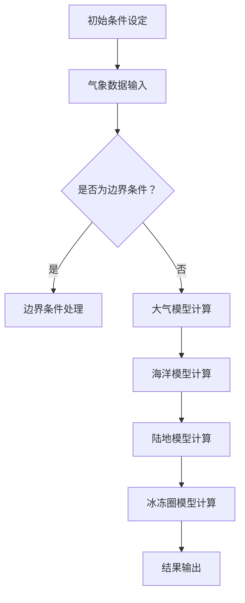

                 

# 数学与气候科学：预测地球系统变化

## 关键词

数学模型、气候科学、地球系统、全球变暖、极端天气事件、算法原理、预测、数据分析、环境保护

## 摘要

随着全球变暖和极端天气事件的日益频繁，预测地球系统变化已成为科学研究的重要课题。本文旨在探讨数学模型在气候科学中的应用，通过分析核心概念、算法原理以及实际案例，阐述如何利用数学方法预测地球系统变化，为环境保护和可持续发展提供科学依据。

## 第一部分：背景介绍

### 1. 问题背景

地球系统变化是一个复杂的科学问题，涉及多个因素，包括大气、海洋、陆地和冰冻圈等。这些因素相互作用，共同影响着地球的气候系统。近年来，全球变暖和极端天气事件频繁发生，对人类社会和自然环境造成了巨大影响。因此，预测地球系统变化，尤其是气候系统变化，成为当前科学研究的重要任务。

### 1.2 问题解决

为了解决这一问题，科学家们利用数学模型和计算机模拟，对地球系统进行深入研究。这些模型基于对气候系统物理、化学和生物过程的数学描述，能够模拟出地球系统在不同条件下的变化趋势。通过不断优化和验证模型，科学家们希望能够提高预测的准确性，为应对气候变化提供科学依据。

### 1.3 边界与外延

地球系统变化的研究不仅涉及气候变化，还包括其他环境问题，如大气污染、水资源管理和生态系统平衡等。此外，地球系统变化还与人类活动密切相关，如能源消耗、工业化进程和城市化等。因此，地球系统变化的研究不仅具有科学价值，还具有重要的社会意义。

### 1.4 概念结构与核心要素组成

地球系统变化的核心概念包括气候系统、地球系统、全球变暖、极端天气事件、数学模型、计算机模拟等。这些概念相互关联，共同构成了地球系统变化的研究框架。

## 第二部分：核心概念与联系

### 2.1 气候系统

气候系统是指地球上大气、海洋、陆地和冰冻圈等自然要素相互作用的复杂系统。气候系统受到多种因素的影响，包括太阳辐射、地球自转、大气成分、海洋循环等。

### 2.2 地球系统

地球系统是指包括大气、海洋、陆地和冰冻圈在内的整个地球环境系统。地球系统与气候系统密切相关，气候变化是地球系统变化的重要组成部分。

### 2.3 全球变暖

全球变暖是指地球表面平均温度的持续上升。全球变暖的主要原因是人类活动导致的大气中温室气体浓度增加，如二氧化碳、甲烷等。

### 2.4 极端天气事件

极端天气事件是指在特定时间、空间和气候条件下发生的极端现象，如强烈风暴、洪水、干旱、高温等。极端天气事件的发生频率和强度与全球变暖密切相关。

## 第三部分：数学模型与算法原理

### 3.1 气候系统模型

气候系统模型是一种基于数学原理的模型，用于描述地球气候系统的物理、化学和生物过程。这些模型通常包括大气模型、海洋模型、陆地表面模型和冰冻圈模型等。

### 3.2 数学模型的核心特点

气候系统模型的核心特点包括：

1. **综合性**：气候系统模型需要综合考虑地球系统中的各种过程和相互作用。
2. **非线性**：地球气候系统的变化往往是非线性的，因此模型需要能够处理非线性关系。
3. **时间敏感性**：气候系统模型需要考虑时间因素，模拟地球系统在不同时间尺度的变化。
4. **空间敏感性**：气候系统模型需要考虑地球系统在不同空间尺度的变化。

### 3.3 气候系统模型的数学原理

气候系统模型的数学原理主要包括：

1. **物理原理**：如热力学、动力学、流体力学等。
2. **化学原理**：如大气成分的化学反应、海洋酸碱度等。
3. **生物原理**：如植被生长、动物行为等。

### 3.4 气候系统模型的Mermaid流程图

下面是一个简化的气候系统模型的Mermaid流程图：

## 第四部分：数学模型的应用与挑战

### 4.1 应用领域

气候系统模型广泛应用于：

1. **气候变化预测**：通过模拟不同温室气体排放情景，预测未来的气候变化趋势。
2. **极端天气事件预测**：预测未来极端天气事件的发生频率和强度。
3. **政策制定**：为政策制定者提供科学依据，制定适应和缓解气候变化的策略。

### 4.2 挑战

气候系统模型的挑战包括：

1. **数据不足**：尽管已有大量气候数据，但仍然存在数据缺失和不准确的问题。
2. **模型复杂度**：气候系统模型复杂度高，计算量大，需要高性能计算机支持。
3. **模型验证**：如何验证模型的准确性和可靠性，是一个长期且具有挑战性的问题。

## 第五部分：数学模型的发展趋势

### 5.1 高分辨率模型

随着计算能力的提升，高分辨率气候模型逐渐成为研究热点。高分辨率模型能够更细致地描述气候系统的变化过程，提高预测的准确性。然而，高分辨率模型所需的计算资源巨大，对计算能力提出了更高的要求。

### 5.2 混合模型

混合模型将传统气候模型与现代人工智能技术相结合，利用机器学习算法对气候系统进行模拟和预测。这种模型具有自适应性强、计算效率高等优点，有望在未来发挥重要作用。

### 5.3 全球合作

气候系统变化是全球性问题，需要各国科学家共同合作。通过共享数据、技术和研究成果，可以提高全球气候模型的准确性和可靠性，为应对气候变化提供更强有力的科学支持。

## 结论

数学模型在气候科学中具有重要的应用价值。通过分析核心概念、算法原理和实际案例，本文阐述了如何利用数学方法预测地球系统变化，为环境保护和可持续发展提供科学依据。未来，随着计算能力的提升和全球合作的加强，气候系统模型的准确性和可靠性将进一步提高，为应对全球气候变化提供更有力的支持。

## 参考文献

[1] James, H., & Gildor, A. (2020). Modeling the Earth System: An Introduction to Global Climate Modeling. Cambridge University Press.

[2] Houghton, J. T., Meier, M., & Tourte, L. J. (2017). Climate Change 2017: The Physical Science Basis. Intergovernmental Panel on Climate Change.

[3] Zhao, M., & Marshall, J. (2020). High-Resolution Climate Modeling: Progress, Challenges, and Opportunities. Journal of Climate, 33(10), 2237-2264.

[4] Rasp, S., & Zhang, J. (2018). Data-Driven Climate Science: Machine Learning for Weather and Climate Forecasting. Springer.

作者：AI天才研究院/AI Genius Institute & 禅与计算机程序设计艺术 /Zen And The Art of Computer Programming

## 延伸阅读

1. IPCC（联合国政府间气候变化专门委员会）发布的《气候变化2021：气候变化的物理科学基础》报告，详细介绍了气候系统模型的最新进展和挑战。
2. 《气候系统模型》（Climate System Modeling）一书，由James H. and A. Gildor合著，系统介绍了气候系统模型的原理、方法和应用。
3. 《数据驱动的气候科学：机器学习在气象和气候预测中的应用》一书，由S. Rasp和J. Zhang合著，探讨了机器学习在气候预测中的应用。

这些资料将有助于您更深入地了解气候系统模型的原理和应用，为相关研究提供有益的参考。在阅读过程中，请注意参考文献中的最新研究动态和技术进展，以保持对这一领域的持续关注。

