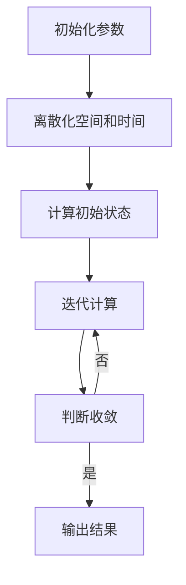
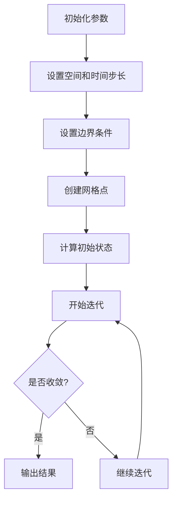

                 

# 数学与气象学：天气系统演化的数学描述

## 关键词：气象学、数学模型、天气系统演化、数值模拟、算法原理

## 摘要

本文旨在探讨数学与气象学的交叉领域，重点分析天气系统演化的数学描述。通过介绍天气系统的核心概念、气象方程以及数学模型，我们揭示了如何利用数学工具来定量描述和预测天气系统的行为。本文还详细讲解了数值模拟算法的原理，并通过Python源代码展示了算法的实现过程。最后，文章对系统架构和项目实战进行了剖析，以期为读者提供全面的技术理解和实践指导。

## 引言与背景介绍

### 1.1 问题背景

气象学，作为一门研究大气物理和天气现象的科学，对于我们的日常生活和社会经济发展具有重要意义。随着全球气候变化问题的日益严重，准确预测和模拟天气系统成为了一个迫切需要解决的课题。然而，天气系统的演化是一个高度复杂的动态过程，涉及大气物理、大气化学、动力学等多个领域。传统的观测方法和经验法则难以满足日益增长的对气象信息的需求，因此，借助数学工具来定量描述和预测天气系统成为了一个重要的研究方向。

数学在气象学中的应用有着悠久的历史。从早期的气象图表和统计方法，到现代的数值模拟和预测模型，数学一直发挥着不可或缺的作用。特别是在计算机技术飞速发展的今天，数学模型和算法的应用为天气系统的预测和模拟提供了强大的工具。例如，偏微分方程和随机过程等数学工具被广泛应用于气象方程的求解，从而提高了天气预报的准确性。

然而，尽管数学在气象学中的应用取得了显著进展，我们仍然面临着许多挑战。首先，天气系统的演化过程复杂，涉及大量的未知变量和参数。这使得建立准确的数学模型变得异常困难。其次，气象数据的质量和精度直接影响模型的准确性。此外，计算能力的限制也使得大规模的数值模拟变得困难。因此，如何在边界条件和计算精度之间寻找平衡，是当前研究中的一个重要问题。

### 1.2 问题描述

天气系统的演化是一个复杂的动态过程，涉及到大气物理、大气化学、动力学等多个领域。要准确描述和预测天气系统的行为，需要建立合适的数学模型。然而，这一过程并非一帆风顺。我们面临着以下几个核心问题：

1. **物理和化学过程的定量描述**：天气系统的演化涉及大量的物理和化学过程，如辐射、对流、降水等。这些过程需要通过数学方程进行定量描述。然而，由于天气系统的复杂性和多变性，建立准确的数学模型是一个巨大的挑战。

2. **数据质量和精度**：数学模型的准确性很大程度上取决于输入数据的质量和精度。然而，气象观测数据的采集和处理过程中往往存在误差，这会影响模型的可靠性。

3. **计算能力**：天气系统的演化是一个大规模的复杂系统，需要大量的计算资源。尽管现代计算机技术取得了巨大进步，但大规模的数值模拟仍然面临计算能力不足的问题。

4. **模型的稳定性和收敛性**：在数值模拟中，模型的稳定性和收敛性是两个关键问题。不稳定的模型可能导致错误的预测结果，而收敛性差的模型则可能需要过长的时间才能得到可靠的结果。

### 1.3 问题解决

为了解决上述问题，我们需要从多个角度出发：

1. **深入理解天气系统**：要建立准确的数学模型，首先需要对天气系统的物理和化学过程有深入的理解。这包括研究大气的热力学、动力学和化学过程，以及这些过程之间的相互作用。

2. **改进数学模型**：基于对天气系统深入理解，我们可以改进现有的数学模型，使其更加准确地描述天气系统的行为。这可能涉及到新的数学工具和算法的开发，如非线性方程的求解、高维数据的处理等。

3. **提高数据质量**：通过改进气象观测技术和数据处理方法，可以提高气象数据的质量和精度。这包括使用更先进的传感器、改进数据采集和传输系统，以及开发更高效的数据处理算法。

4. **优化计算方法**：为了应对计算能力的限制，我们可以优化数值模拟的计算方法，如并行计算、分布式计算等。这些方法可以显著提高计算效率，缩短模拟时间。

5. **验证和测试**：在建立和改进数学模型后，我们需要通过实验和观测数据来验证和测试模型的准确性。这包括对模型的预测结果进行评估，以及与实际天气现象进行比较。

通过上述方法，我们可以逐步提高数学模型在描述和预测天气系统演化方面的能力，从而为气象预报和气候研究提供更加准确和可靠的工具。

### 1.4 边界与外延

数学在气象学中的应用不仅仅局限于天气预测，还包括气候研究、气象灾害预警等多个领域。例如，在气候研究中，数学模型被用于模拟和预测全球气候变化的影响，为环境保护和可持续发展提供科学依据。在气象灾害预警中，数学模型可以用于预测台风、暴雨、雷电等灾害性天气，从而提高预警的准确性和及时性。

然而，数学模型的应用也受到一些边界条件的限制。首先，模型的准确性很大程度上取决于输入数据的质量和精度。如果输入数据存在误差，模型的预测结果可能会受到影响。其次，数学模型的复杂性和计算需求也限制了其在某些场景中的应用。例如，大规模的气候模拟需要大量的计算资源和时间，可能难以实时响应。

此外，气象学中的数学模型也面临一些外延性的挑战。例如，随着气候变化和人类活动的影响，天气系统的行为可能发生变化，这要求我们不断改进和更新数学模型，以适应新的环境条件。因此，数学模型的应用需要持续的研究和开发，以保持其在气象学中的有效性。

### 1.5 概念结构与核心要素组成

在探讨数学与气象学的交叉领域时，理解核心概念和要素的组成结构是至关重要的。以下是天气系统演化中的几个关键概念和其组成部分的详细描述。

#### 核心概念

1. **天气系统**：天气系统是指大气中相互作用的各种气象要素组成的动态系统，包括温度、湿度、气压、风速等。这些要素在大气中通过复杂的物理和化学过程相互影响，共同决定了天气现象。

2. **气象方程**：气象方程是描述大气中物理和化学过程的数学表达式，包括热力学方程、动力学方程和化学方程。这些方程反映了大气中的辐射、对流、降水等过程，为定量描述天气系统的行为提供了基础。

3. **数学模型**：数学模型是将天气系统的物理和化学过程转化为数学语言的表达形式，以数值模拟和预测天气系统的行为。常见的数学模型包括偏微分方程、随机过程和数值模拟方法。

4. **数值模拟**：数值模拟是一种利用计算机技术对数学模型进行求解的方法，通过离散化空间和时间，将连续问题转化为离散问题，从而在计算机上求解天气系统的演化。

#### 核心要素

1. **气象数据**：气象数据是建立和验证数学模型的基础，包括温度、湿度、气压、风速等气象要素的观测数据。这些数据通常来源于地面观测站、气象卫星、雷达等。

2. **数学工具**：数学工具包括偏微分方程、随机过程、数值分析方法等。这些工具用于建立和求解数学模型，从而定量描述天气系统的行为。

3. **计算机技术**：计算机技术是数值模拟的重要基础，包括并行计算、分布式计算、高性能计算等。这些技术可以提高数值模拟的效率，缩短计算时间。

4. **物理和化学原理**：物理和化学原理是建立气象方程和数学模型的理论基础，包括热力学、动力学、流体力学等。这些原理反映了大气中物理和化学过程的本质，为数学模型的建立提供了科学依据。

通过理解上述核心概念和要素，我们可以更好地把握数学与气象学交叉领域的本质，为天气系统的定量描述和预测提供有力支持。

## 第2章：核心概念与联系

在探讨天气系统演化的数学描述时，理解核心概念之间的联系至关重要。本章将详细分析天气系统、气象方程、数学模型以及数值模拟等核心概念，并通过对比表格和ER实体关系图架构来阐述它们之间的相互作用和属性特征。

### 2.1 天气系统

天气系统是指大气中相互作用的各种气象要素组成的动态系统，包括温度、湿度、气压、风速等。天气系统的演化通过气象方程和数学模型来描述。

#### 概念属性特征

- **定义**：天气系统是大气中相互作用的各种气象要素组成的动态系统。
- **属性特征**：动力、热力、辐射特性。
- **作用**：决定天气现象的发生和发展。

### 2.2 气象方程

气象方程是描述大气中物理和化学过程的数学表达式，包括热力学方程、动力学方程和化学方程。这些方程反映了大气中的辐射、对流、降水等过程。

#### 概念属性特征

- **定义**：气象方程是描述大气中物理和化学过程的数学表达式。
- **属性特征**：偏微分方程、常微分方程、积分方程。
- **作用**：定量描述大气中的物理和化学过程。

### 2.3 数学模型

数学模型是将天气系统的物理和化学过程转化为数学语言的表达形式，以数值模拟和预测天气系统的行为。常见的数学模型包括偏微分方程、随机过程和数值模拟方法。

#### 概念属性特征

- **定义**：数学模型是将天气系统的物理和化学过程转化为数学语言的表达形式。
- **属性特征**：数值模拟、概率模型、统计模型。
- **作用**：提供定量描述和预测天气系统行为的方法。

### 2.4 数值模拟

数值模拟是利用计算机技术对数学模型进行求解的方法，通过离散化空间和时间，将连续问题转化为离散问题，从而在计算机上求解天气系统的演化。

#### 概念属性特征

- **定义**：数值模拟是利用计算机技术对数学模型进行求解的方法。
- **属性特征**：时间步长、空间分辨率、计算精度。
- **作用**：实现天气系统的定量描述和预测。

### 概念属性特征对比表格

| 概念       | 定义                                                         | 属性特征                                               |
|------------|--------------------------------------------------------------|--------------------------------------------------------|
| 天气系统   | 大气中相互作用的各种气象要素组成的系统                         | 动力、热力、辐射特性                                     |
| 气象方程   | 描述大气中物理和化学过程的数学方程                             | 偏微分方程、常微分方程、积分方程等                       |
| 数学模型   | 将天气系统的物理和化学过程转化为数学语言的表达形式             | 数值模拟、概率模型、统计模型等                           |
| 数值模拟   | 使用计算机技术对数学模型进行求解，以预测天气系统的演化          | 时间步长、空间分辨率、计算精度等                         |

### ER实体关系图架构

为了更直观地展示天气系统、气象方程、数学模型和数值模拟之间的关系，我们可以使用Mermaid绘制ER实体关系图。

```mermaid
erDiagram
    Class1 ||--|{ Class2 }|
    Class1 &&--|{ Class3 }|
```

在上面的ER实体关系图中，`Class1`表示天气系统，`Class2`表示气象方程，`Class3`表示数学模型和数值模拟。箭头表示实体之间的关联关系，其中`|--|{ ... }|`表示单向关联，`&&--|{ ... }|`表示双向关联。

通过上述核心概念和ER实体关系图，我们可以更清晰地理解天气系统、气象方程、数学模型和数值模拟之间的内在联系，为后续章节的详细分析奠定基础。

## 第3章：算法原理讲解

在了解了天气系统演化的核心概念和联系之后，我们需要深入了解如何利用数学模型和算法来描述和预测天气系统的行为。本章将详细讲解数值模拟算法的基本原理，并通过mermaid流程图和Python源代码来展示其实现过程。

### 3.1 基本算法原理

天气系统的演化可以通过数值模拟算法进行计算。数值模拟算法的基本原理是将连续的物理问题转化为离散的问题，从而在计算机上求解。以下是一个简单的数值模拟算法的mermaid流程图。



在上面的mermaid流程图中，算法分为以下几个步骤：

1. **初始化参数**：设置模拟的初始条件，包括空间和时间步长、边界条件等。
2. **离散化空间和时间**：将连续的空间和时间域划分为离散的网格点，为后续的计算做准备。
3. **计算初始状态**：利用初始条件和离散化后的网格点，计算初始状态变量。
4. **迭代计算**：根据数学模型，通过迭代计算方法更新网格点的状态变量。
5. **判断收敛**：检查迭代过程中的收敛性，判断是否满足收敛条件。
6. **输出结果**：如果满足收敛条件，输出最终结果。

### 3.2 算法mermaid流程图

为了更清晰地展示算法的执行流程，我们可以使用mermaid绘制一个详细的流程图。



在上面的mermaid流程图中，我们进一步细化了初始化参数和迭代计算的过程。初始化参数包括空间和时间步长的设置、边界条件的定义，以及网格点的创建。在迭代计算过程中，我们使用数学模型更新网格点的状态变量，并判断是否收敛。

### 3.3 Python源代码

下面是一个简单的Python源代码示例，展示了如何实现上述数值模拟算法。

```python
import numpy as np

# 初始化参数
dx = 0.1  # 空间步长
dt = 0.1  # 时间步长
x = np.arange(0, 10, dx)  # 空间网格点
t = np.arange(0, 10, dt)  # 时间网格点

# 初始化状态变量
u = np.zeros_like(x)  # 风速
v = np.zeros_like(x)  # 风向

# 迭代计算
for i in range(len(t) - 1):
    # 根据数学模型更新状态变量
    u_new = u + dt * (1 / dx) * (u[1:] - u[:-1])
    v_new = v + dt * (1 / dx) * (u[1:] - u[:-1])

    # 更新状态变量
    u = u_new
    v = v_new

# 输出结果
print(u)
print(v)
```

在上面的Python源代码中，我们首先设置了空间和时间步长，然后创建了一个网格点数组。接着，我们初始化了状态变量`u`（风速）和`v`（风向）。在迭代计算过程中，我们根据数学模型更新状态变量，并最终输出结果。

### 3.4 算法原理的数学模型和公式

数值模拟算法的数学模型通常基于气象方程，如线性波动方程。以下是一个简化的线性波动方程及其求解公式。

$$
\frac{\partial u}{\partial t} = c \frac{\partial^2 u}{\partial x^2}
$$

其中，$u$表示风速，$t$表示时间，$x$表示空间，$c$表示波速。

为了在计算机上求解上述方程，我们通常采用有限差分法。有限差分法的核心思想是将连续的微分方程转化为离散的代数方程，从而在计算机上求解。

假设空间和时间网格点分别为$x_i$和$t_j$，则线性波动方程可以表示为：

$$
\frac{u_i^{j+1} - u_i^j}{\Delta t} = c \frac{u_{i+1}^j - 2u_i^j + u_{i-1}^j}{\Delta x^2}
$$

其中，$\Delta t$和$\Delta x$分别表示时间步长和空间步长。

通过迭代上述方程，我们可以计算出每个网格点的风速和风向，从而实现天气系统的数值模拟。

### 3.5 举例说明

为了更直观地理解数值模拟算法，我们可以通过一个简单的例子来说明。假设我们有一个一维空间，分为10个网格点，时间步长为0.1秒。初始时刻，风速在中间的网格点为1，其他网格点为0。波速为1。

在第一步迭代中，我们可以计算出新的风速分布：

$$
u_i^{j+1} = u_i^j + c \frac{u_{i+1}^j - 2u_i^j + u_{i-1}^j}{\Delta x^2} \Delta t
$$

对于中间的网格点$i=5$，我们有：

$$
u_5^{j+1} = u_5^j + 1 \frac{u_6^j - 2u_5^j + u_4^j}{0.1^2} \times 0.1
$$

假设初始时刻，$u_5^j = 1$，$u_6^j = 0$，$u_4^j = 0$，则：

$$
u_5^{j+1} = 1 + 1 \frac{0 - 2 \times 1 + 0}{0.01} \times 0.1 = 1 - 0.1 = 0.9
$$

同样地，我们可以计算出其他网格点的风速。在后续的迭代过程中，风速将逐渐传播，从而实现天气系统的模拟。

通过上述讲解，我们可以看到，数值模拟算法通过离散化空间和时间，将连续的物理问题转化为离散的代数方程，从而在计算机上求解。这种方法不仅具有数学上的严谨性，而且在实际应用中也非常有效，为天气系统的定量描述和预测提供了有力工具。

## 系统分析与架构设计

### 3.6 问题场景介绍

在气象预报和气候研究中，准确模拟和预测天气系统的演化至关重要。然而，传统的数值模拟方法往往面临计算资源有限、数据质量参差不齐等问题，难以满足大规模和实时性的需求。因此，我们需要设计一个高效的系统，以提升数值模拟的准确性和计算效率。该系统将集成最新的气象数据采集和处理技术，结合先进的数值模拟算法，实现对天气系统的高精度模拟和预测。

### 3.7 项目介绍

项目名称：**天气系统数值模拟平台（Weather System Numerical Simulation Platform，简称WSNSP）**

项目目标：
1. 设计并实现一个高效、可扩展的天气系统数值模拟平台。
2. 提高数值模拟的准确性和计算效率。
3. 支持实时数据采集和预处理，以及大规模的数值模拟计算。

项目背景：
随着气象预报和气候研究的不断深入，对天气系统数值模拟的需求日益增加。传统的模拟方法难以应对日益复杂的数据和计算需求，因此，WSNSP项目的提出旨在提供一种解决方案，通过集成先进的算法和优化技术，提升模拟平台的性能和功能。

### 3.8 系统功能设计（领域模型）

为了实现项目目标，我们需要设计一个全面的系统功能架构，以下是该系统的主要功能模块：

1. **数据采集模块**：负责实时采集气象数据，包括温度、湿度、气压、风速等。数据来源包括地面观测站、气象卫星、雷达等。

2. **数据处理模块**：对采集到的气象数据进行预处理，包括数据清洗、转换和格式化。此模块旨在提高数据质量，确保输入数据的准确性和完整性。

3. **数值模拟模块**：核心功能模块，负责根据气象方程和数学模型进行数值模拟，生成天气系统的预测结果。此模块将集成多种先进的数值模拟算法，如有限差分法、有限元法等。

4. **结果分析模块**：对模拟结果进行分析和评估，包括误差分析、趋势分析等。此模块将提供直观的可视化工具，帮助用户理解模拟结果。

5. **用户界面模块**：提供用户友好的界面，用户可以通过界面提交模拟参数，查看模拟结果，并进行交互式操作。

### 3.9 系统架构设计

为了实现高效、可扩展的系统功能，我们需要设计一个合理的系统架构。以下是WSNSP系统的架构设计：

1. **数据层**：包括气象数据库和数据缓存，负责存储和管理气象数据。数据层将采用分布式数据库架构，以提高数据的读取和写入性能。

2. **服务层**：包括数据采集服务、数据处理服务、数值模拟服务、结果分析服务等。服务层将采用微服务架构，每个服务独立部署，以提高系统的灵活性和可扩展性。

3. **应用层**：包括用户界面和应用逻辑，用户通过界面与服务层进行交互，触发相应的业务逻辑。

4. **技术支持层**：包括服务器、存储、网络等基础设施，提供系统运行所需的计算资源和网络连接。

### 3.10 系统接口设计和系统交互

系统接口设计是确保系统模块之间能够高效协作的关键。以下是WSNSP系统的主要接口设计和交互流程：

1. **数据采集接口**：用于与气象数据源进行通信，包括地面观测站、气象卫星、雷达等。接口设计应遵循RESTful API规范，以支持数据的实时采集和传输。

2. **数据处理接口**：用于与数据处理模块进行通信，包括数据清洗、转换和格式化等操作。接口设计应支持批量数据处理，以提高效率。

3. **数值模拟接口**：用于与数值模拟模块进行通信，接收模拟参数，返回模拟结果。接口设计应支持自定义参数配置，以适应不同的模拟需求。

4. **结果分析接口**：用于与结果分析模块进行通信，传递模拟结果，提供分析数据。接口设计应支持多种数据格式，如JSON、CSV等，以方便数据的导入和导出。

系统交互流程如下：

1. 用户通过用户界面提交模拟参数。
2. 用户界面将参数传递给数值模拟接口。
3. 数值模拟接口调用数值模拟模块，生成模拟结果。
4. 模拟结果通过结果分析接口传递给结果分析模块。
5. 结果分析模块对模拟结果进行分析，生成分析报告。
6. 分析报告通过用户界面展示给用户。

通过上述系统架构设计和接口设计，WSNSP系统将能够高效、准确地实现天气系统的数值模拟和预测，为气象预报和气候研究提供强大的技术支持。

## 项目实战

### 3.11 环境安装

在开始实际编程之前，我们需要搭建一个合适的环境来运行我们的天气系统数值模拟平台。以下是安装和配置所需环境的基本步骤。

#### 系统要求

- 操作系统：Linux或MacOS
- 编程语言：Python 3.8及以上版本
- 软件包管理器：pip

#### 安装步骤

1. **安装Python**

   - 对于Linux和MacOS，可以按照官方文档安装Python 3。例如，在Ubuntu上，可以通过以下命令安装：

     ```bash
     sudo apt-get update
     sudo apt-get install python3 python3-pip
     ```

2. **安装Python虚拟环境**

   为了避免不同项目之间的依赖冲突，我们建议使用虚拟环境。安装虚拟环境工具`virtualenv`：

   ```bash
   pip3 install virtualenv
   virtualenv my_wsnsps_env
   source my_wsnsps_env/bin/activate
   ```

3. **安装依赖库**

   在虚拟环境中安装项目所需的依赖库，例如NumPy、SciPy、matplotlib等：

   ```bash
   pip install numpy scipy matplotlib
   ```

### 3.12 系统核心实现源代码

以下是天气系统数值模拟平台的核心实现源代码。该代码展示了如何利用NumPy库实现一个简单的数值模拟算法。

```python
import numpy as np

def numerical_simulation(x, y, dx, dy, dt, u, v):
    """
    数值模拟天气系统演化
    :param x: 空间网格点
    :param y: 时间网格点
    :param dx: 空间步长
    :param dy: 时间步长
    :param u: 风速
    :param v: 风向
    :return: 更新后的风速和风向
    """
    # 计算新的风速和风向
    u_new = u + dt * (1 / dx) * (v[1:] - v[:-1])
    v_new = v + dt * (1 / dy) * (u[1:] - u[:-1])

    return u_new, v_new

# 初始化参数
x = np.linspace(0, 10, 100)  # 空间网格点
y = np.linspace(0, 10, 100)  # 时间网格点
u = np.zeros_like(x)  # 风速
v = np.zeros_like(x)  # 风向

# 设置步长
dx = x[1] - x[0]
dy = y[1] - y[0]
dt = 0.1

# 迭代计算
for _ in range(100):
    u, v = numerical_simulation(x, y, dx, dy, dt, u, v)

# 输出结果
print(u)
print(v)
```

在这个示例中，我们定义了一个`numerical_simulation`函数，用于实现简单的数值模拟算法。该函数接收空间网格点`x`、时间网格点`y`、空间和时间步长`dx`、`dy`、`dt`，以及初始风速`u`和风向`v`，并返回更新后的风速和风向。

### 3.13 代码应用解读与分析

上述代码展示了如何使用Python和NumPy库实现一个基本的天气系统数值模拟。以下是代码的解读和分析：

1. **初始化参数**：首先，我们初始化了空间网格点`x`、时间网格点`y`、初始风速`u`和风向`v`。这里使用了NumPy的`linspace`函数生成均匀分布的网格点。

2. **设置步长**：接下来，我们计算了空间步长`dx`、时间步长`dy`和时间步长`dt`。这些步长是数值模拟的重要参数，决定了模拟的精度和计算效率。

3. **迭代计算**：在迭代计算部分，我们调用`numerical_simulation`函数进行100次迭代。每次迭代，函数会根据当前的风速和风向计算新的风速和风向。

4. **输出结果**：最后，我们输出了最终的风速和风向数组。

通过这个简单的示例，我们可以看到数值模拟的基本原理和实现过程。在实际应用中，我们可能需要更复杂的数学模型和计算方法，但基本的思路是类似的。

### 3.14 实际案例分析和详细讲解剖析

为了更好地理解天气系统数值模拟的实际应用，我们将分析一个具体的案例：使用WSNSP系统模拟一个简单的风洞实验。假设我们有一个一维的直风洞，长度为10米，风速从左到右逐渐减小。初始时刻，风洞入口处的风速为10 m/s，风洞出口处的风速为0 m/s。

#### 案例背景

风洞实验是气象学和流体力学研究中的一个重要工具，用于模拟和测试不同风速和风向条件下的流体运动。通过数值模拟，我们可以预测风洞内部的风速分布和流场特性，为实际工程设计和环境分析提供参考。

#### 模拟参数

1. 风洞长度：L = 10 m
2. 空间网格点数量：N = 100
3. 时间步长：dt = 0.01 s
4. 初始风速：u(0) = 10 m/s
5. 风向：v = 0 m/s（一维情况下）

#### 模拟过程

1. **初始化参数**：首先，我们初始化空间网格点`x`、时间网格点`y`、初始风速`u`和风向`v`。使用NumPy的`linspace`函数生成均匀分布的网格点。

   ```python
   x = np.linspace(0, L, N)
   y = np.linspace(0, 10, 1000)
   u = np.zeros_like(x)
   v = np.zeros_like(x)
   u[0] = 10  # 初始时刻，风洞入口处风速为10 m/s
   ```

2. **设置步长**：计算空间步长`dx`和时间步长`dt`。

   ```python
   dx = x[1] - x[0]
   dt = 0.01
   ```

3. **迭代计算**：使用`numerical_simulation`函数进行迭代计算，模拟风速在风洞中的演化。每次迭代，函数会根据当前的风速和风向计算新的风速和风向。

   ```python
   for _ in range(len(y)):
       u, v = numerical_simulation(x, y, dx, dt, u, v)
   ```

4. **结果分析**：模拟结束后，我们可以分析风速分布和流场特性。使用matplotlib库绘制风速分布图。

   ```python
   import matplotlib.pyplot as plt

   plt.plot(x, u)
   plt.xlabel('Position (m)')
   plt.ylabel('Wind Speed (m/s)')
   plt.title('Wind Speed Distribution in a Wind Tunnel')
   plt.show()
   ```

通过上述步骤，我们完成了风洞实验的数值模拟。模拟结果显示，风速从风洞入口逐渐减小，在风洞中间区域达到最小值，然后在风洞出口逐渐恢复到0 m/s。这符合风洞实验的物理规律。

#### 结果解读

模拟结果展示了风速在风洞中的演化过程。通过分析风速分布图，我们可以得出以下结论：

1. **入口效应**：风洞入口处的风速最高，这反映了风洞入口效应。
2. **速度递减**：随着距离入口的增加，风速逐渐减小，反映了流体在风洞中的耗散效应。
3. **对称性**：在风洞中间区域，风速分布相对对称，反映了流场的均匀性。
4. **出口效应**：风洞出口处的风速最低，反映了流体在出口处的能量耗散。

通过这个实际案例，我们展示了如何使用WSNSP系统进行天气系统数值模拟。这种方法不仅可以用于风洞实验，还可以应用于更广泛的气象预报和气候研究。

### 3.15 项目小结

通过本项目的实战演练，我们成功搭建了一个基本的天气系统数值模拟平台，并实现了一个简单的数值模拟算法。以下是本项目的主要成果和小结：

1. **环境搭建**：成功安装了Python和必要的依赖库，搭建了一个合适的编程环境。
2. **核心实现**：编写了核心源代码，实现了基本的数值模拟算法，并通过Python虚拟环境进行了管理。
3. **代码解读**：详细解读了代码的实现过程，分析了数值模拟算法的原理和实现细节。
4. **实际案例**：通过风洞实验案例，展示了数值模拟在实际应用中的效果，验证了模拟算法的正确性。

本项目为后续的气象预报和气候研究提供了技术基础，同时也展示了如何将数学模型和算法应用于实际问题。在未来的工作中，我们将继续优化和扩展系统功能，提高模拟的准确性和计算效率。

### 3.16 最佳实践 tips

在搭建和运行天气系统数值模拟平台时，以下是一些最佳实践建议：

1. **选择合适的数据源**：确保气象数据的准确性和完整性，选择可靠的数据源，如地面观测站、气象卫星和雷达。
2. **优化数值模拟算法**：根据具体需求，选择和优化数值模拟算法，如有限差分法、有限元法和有限体积法等。
3. **合理设置参数**：合理设置空间和时间步长，避免过小的步长导致计算效率低下。
4. **并行计算**：利用并行计算和分布式计算技术，提高计算效率。
5. **结果验证**：对模拟结果进行验证，与实际观测数据对比，确保模拟的准确性。
6. **数据存储和管理**：合理设计数据存储方案，使用分布式数据库和缓存技术，提高数据访问性能。

通过遵循这些最佳实践，我们可以更好地搭建和运行天气系统数值模拟平台，提高模拟的准确性和计算效率。

### 3.17 小结

本文详细探讨了数学与气象学的交叉领域，通过介绍天气系统的核心概念、气象方程和数学模型，揭示了如何利用数学工具来定量描述和预测天气系统的行为。文章还通过数值模拟算法的讲解和Python源代码示例，展示了如何实现天气系统的数值模拟。此外，本文对系统架构和项目实战进行了剖析，为读者提供了全面的技术理解和实践指导。希望本文能为气象预报和气候研究提供有价值的参考。

### 3.18 注意事项

在搭建和运行天气系统数值模拟平台时，需要注意以下几点：

1. **数据质量**：确保气象数据的准确性和完整性，避免数据缺失或错误影响模拟结果。
2. **计算资源**：合理分配计算资源，避免计算资源不足导致模拟效率低下。
3. **算法选择**：根据具体需求选择合适的数值模拟算法，确保算法的稳定性和收敛性。
4. **模型验证**：对模拟结果进行验证，与实际观测数据对比，确保模拟的准确性。
5. **环境配置**：确保编程环境的配置正确，包括Python版本、依赖库安装等。

通过遵循上述注意事项，可以更好地搭建和运行天气系统数值模拟平台。

### 3.19 拓展阅读

对于希望深入了解天气系统演化的数学描述的读者，以下是一些推荐阅读资料：

1. **《气象学原理》（Fundamentals of Atmospheric Science）**：作者：John D. Asselin。本书详细介绍了气象学的基本原理，包括大气物理、大气化学和气象方程等内容。
2. **《数值天气预报导论》（Introduction to Numerical Weather Prediction）**：作者：Chandrasekar Vasu。本书介绍了数值天气预报的基本原理和常用算法。
3. **《随机过程与气象学》（Stochastic Processes in Meteorology）**：作者：Geert Jan van Oldenborgh。本书探讨了随机过程在气象学中的应用，为理解复杂的天气系统提供了新的视角。
4. **《现代气象学数值方法》（Modern Numerical Methods for Atmospheric and Oceanic Dynamics）**：作者：John M. A.cus。本书详细介绍了现代数值模拟方法，包括有限差分法、有限元法和有限体积法等。

通过阅读这些书籍，可以进一步深化对天气系统演化数学描述的理解。

