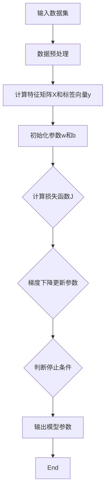

                 

### 第一部分：引言

#### 第1章：气象学与数学的联系

#### 1.1.1 天气预报的背景

天气预报，作为一门融合了气象学、物理学、数学和计算机科学等多学科知识的应用科学，自古以来就是人们关注的焦点。它不仅仅是农业、交通、旅游、环境监测等领域的重要参考，更是人们日常生活的重要依据。早在公元前350年，古希腊哲学家亚里士多德就已经开始研究气象学，而到了中世纪，欧洲的修道院修士们记录了大量的气象数据。然而，真正意义上的现代天气预报始于19世纪末，随着气象观测技术的进步和数学方法的引入，天气预报开始逐渐走向科学化、系统化。

**天气预报的重要性**

天气预报对于人类社会的重要性不言而喻。首先，它能够帮助人们合理地安排日常生活和工作，避免因恶劣天气造成的人身安全和财产损失。其次，在农业方面，天气预报可以帮助农民合理安排播种、施肥和收割，提高农作物的产量。此外，在交通、旅游和环境保护等领域，天气预报也发挥着至关重要的作用。

**传统天气预报方法**

早期的天气预报主要依赖于经验观测和简单的物理模型。观测员通过肉眼观察天气现象，如云层、降雨、风速等，并结合历史气象数据，进行天气预报。这种方法虽然具有一定的实用性，但受限于观测手段和计算能力的限制，预报的准确性和时效性都相对较低。随着科技的发展，尤其是在20世纪后，气象观测手段和预报模型得到了极大的改进。

**数学在天气预报中的应用**

数学在天气预报中的应用可谓无处不在。从基本的数据分析到复杂的数学模型，数学方法极大地提升了天气预报的准确性和时效性。数学方法主要包括概率论与统计学、线性代数与微分方程等。概率论与统计学帮助气象学家对大量观测数据进行处理和分析，从中提取有用的信息。线性代数与微分方程则用于建立大气运动和能量转换的数学模型，这些模型能够模拟大气系统的状态变化，从而预测天气现象。

#### 1.1.2 数学在气象学中的核心作用

**数学模型的基本概念**

数学模型是气象学中不可或缺的工具，它通过将复杂的自然现象抽象成数学表达式，帮助科学家理解大气的运行规律。数学模型包括动力模型、气候模型和统计模型等，它们分别用于描述不同时间尺度和空间尺度上的天气和气候现象。

**数学在气象学数据分析中的应用**

数学在气象学数据分析中的应用主要体现在以下几个方面：

1. **概率论与统计学**：用于分析气象观测数据，提取出影响天气的统计特征和概率分布，为建立预测模型提供基础数据。
2. **线性代数**：用于处理大气的线性化问题，如大气运动的矩阵表示和线性方程组的求解。
3. **微分方程**：用于描述大气中的物理过程，如热力学过程、流体运动等，通过求解微分方程，可以得到大气状态的时间变化和空间分布。

**数学方法在天气预报中的创新应用**

随着计算机技术的发展，数学方法在天气预报中的应用越来越广泛和深入。例如，数值天气预报模型（Numerical Weather Prediction, NWP）的广泛应用，使得天气预报的准确性和时效性得到了大幅提升。NWP模型通过求解天气系统的非线性方程组，可以实时模拟大气的状态变化，从而进行高精度的短期天气预报。

#### 1.1.3 本书结构与目标

**各章节主要内容概述**

本书分为五个部分，具体内容如下：

1. **第一部分：引言**：介绍气象学与数学的联系，以及数学在天气预报中的核心作用。
2. **第二部分：基本数学工具**：讲解概率论与统计学、线性代数与微分方程等基本数学工具。
3. **第三部分：气象学中的数学模型**：详细介绍大气物理与动力模型、气候学模型和数值天气预报模型。
4. **第四部分：案例分析与应用**：通过实际案例解析，展示数学模型在天气预报中的应用。
5. **第五部分：未来展望与发展趋势**：探讨未来天气预报技术的发展趋势和面临的挑战。

**学习本书的目的和预期效果**

通过本书的学习，读者可以：

1. **掌握数学在天气预报中的应用原理**：理解概率论、线性代数、微分方程等基本数学工具，并学会如何将它们应用于天气预报。
2. **了解气象学中的核心数学模型**：深入理解大气物理与动力模型、气候学模型和数值天气预报模型，并了解它们的基本原理和构建方法。
3. **提高天气预报技能**：通过实际案例解析，学会如何运用数学模型进行天气预报，提高预报的准确性和时效性。
4. **为未来天气预报技术发展提供新思路**：了解当前天气预报技术面临的挑战和机遇，为未来的发展提供新的思路和方向。

### 总结

本章作为引言，为读者展示了气象学与数学之间千丝万缕的联系。通过介绍天气预报的背景、数学在天气预报中的应用，以及本书的结构和目标，读者可以初步了解到数学在提升天气预报准确性方面的重要性。接下来的章节将进一步深入探讨数学工具、气象学中的数学模型以及实际应用，帮助读者全面掌握天气预报的数学原理和方法。

---

# 第一部分：引言

## 第1章：气象学与数学的联系

### 1.1.1 天气预报的背景

### 1.1.2 数学在气象学中的核心作用

### 1.1.3 本书结构与目标

---

### 第1章：气象学与数学的联系

#### 1.1.1 天气预报的背景

**传统天气预报方法**

早期的天气预报方法主要依赖于观测和经验。例如，古代人们通过观察云、风、温度等自然现象来预测天气。随着科技的发展，气象观测设备逐渐得到普及，如温度计、湿度计、风速计等。这些设备的出现使得气象观测数据更加准确，为天气预报提供了基础数据。

**数学在天气预报中的应用**

数学在天气预报中的应用可以追溯到19世纪末，当时气象学家开始使用数学模型来描述大气运动。随着计算机技术的进步，数学模型在天气预报中的应用变得更加广泛和深入。现代天气预报中常用的数学方法包括概率论、统计学、线性代数和微分方程等。

**现代天气预报的特点**

现代天气预报具有以下特点：

1. **高精度**：利用高性能计算机和复杂的数学模型，天气预报的精度得到了显著提升。
2. **高时效性**：实时数据采集和处理，使得天气预报的时效性大大提高。
3. **综合性**：现代天气预报不仅依赖于单一观测数据，还综合了多种观测手段和模型预测。

#### 1.1.2 数学在气象学中的核心作用

**数学模型的基本概念**

数学模型是气象学中不可或缺的工具，它通过将复杂的自然现象抽象成数学表达式，帮助科学家理解大气的运行规律。数学模型包括动力模型、气候模型和统计模型等，它们分别用于描述不同时间尺度和空间尺度上的天气和气候现象。

**数学在气象学数据分析中的应用**

数学在气象学数据分析中的应用主要体现在以下几个方面：

1. **概率论与统计学**：用于分析气象观测数据，提取出影响天气的统计特征和概率分布，为建立预测模型提供基础数据。
2. **线性代数**：用于处理大气的线性化问题，如大气运动的矩阵表示和线性方程组的求解。
3. **微分方程**：用于描述大气中的物理过程，如热力学过程、流体运动等，通过求解微分方程，可以得到大气状态的时间变化和空间分布。

**数学方法在天气预报中的创新应用**

随着计算机技术的发展，数学方法在天气预报中的应用越来越广泛和深入。例如，数值天气预报模型（Numerical Weather Prediction, NWP）的广泛应用，使得天气预报的准确性和时效性得到了大幅提升。NWP模型通过求解天气系统的非线性方程组，可以实时模拟大气的状态变化，从而进行高精度的短期天气预报。

#### 1.1.3 本书结构与目标

**本书各章节主要内容概述**

本书分为五个部分，具体内容如下：

1. **第一部分：引言**：介绍气象学与数学的联系，以及数学在天气预报中的核心作用。
2. **第二部分：基本数学工具**：讲解概率论与统计学、线性代数与微分方程等基本数学工具。
3. **第三部分：气象学中的数学模型**：详细介绍大气物理与动力模型、气候学模型和数值天气预报模型。
4. **第四部分：案例分析与应用**：通过实际案例解析，展示数学模型在天气预报中的应用。
5. **第五部分：未来展望与发展趋势**：探讨未来天气预报技术的发展趋势和面临的挑战。

**学习本书的目的和预期效果**

通过本书的学习，读者可以：

1. **掌握数学在天气预报中的应用原理**：理解概率论、线性代数、微分方程等基本数学工具，并学会如何将它们应用于天气预报。
2. **了解气象学中的核心数学模型**：深入理解大气物理与动力模型、气候学模型和数值天气预报模型，并了解它们的基本原理和构建方法。
3. **提高天气预报技能**：通过实际案例解析，学会如何运用数学模型进行天气预报，提高预报的准确性和时效性。
4. **为未来天气预报技术发展提供新思路**：了解当前天气预报技术面临的挑战和机遇，为未来的发展提供新的思路和方向。

### 总结

本章作为引言，为读者展示了气象学与数学之间千丝万缕的联系。通过介绍天气预报的背景、数学在天气预报中的应用，以及本书的结构和目标，读者可以初步了解到数学在提升天气预报准确性方面的重要性。接下来的章节将进一步深入探讨数学工具、气象学中的数学模型以及实际应用，帮助读者全面掌握天气预报的数学原理和方法。

---

# 第二部分：基本数学工具

## 第2章：概率论与统计基础

### 2.1.1 概率论的基本概念

#### 2.1.1.1 随机事件与概率

在概率论中，随机事件是指可能发生也可能不发生的事件。例如，明天是否会下雨就是一个随机事件。随机事件可以用一个集合表示，这个集合中的每个元素代表一个可能的随机结果。

概率是衡量随机事件发生可能性大小的数值，通常用0到1之间的实数表示。概率为0表示不可能发生，概率为1表示必然发生。

**基本概率概念**

1. **必然事件**：概率为1的事件，例如太阳从东方升起。
2. **不可能事件**：概率为0的事件，例如太阳从西方升起。
3. **随机事件**：概率介于0和1之间的事件，例如明天是否会下雨。

#### 2.1.1.2 条件概率与独立性

条件概率是指在某个事件已经发生的条件下，另一个事件发生的概率。用公式表示为：

$$P(A|B) = \frac{P(A \cap B)}{P(B)}$$

其中，$P(A|B)$表示在事件B发生的条件下事件A发生的概率，$P(A \cap B)$表示事件A和事件B同时发生的概率，$P(B)$表示事件B发生的概率。

独立性是指两个随机事件的发生互不影响。如果事件A和事件B独立，则有：

$$P(A \cap B) = P(A) \cdot P(B)$$

#### 2.1.1.3 贝叶斯定理

贝叶斯定理是一种用于计算条件概率的公式，它可以用来更新概率预测。贝叶斯定理的公式为：

$$P(A|B) = \frac{P(B|A) \cdot P(A)}{P(B)}$$

其中，$P(A|B)$是在事件B发生的条件下事件A发生的概率，$P(B|A)$是在事件A发生的条件下事件B发生的概率，$P(A)$是事件A发生的概率，$P(B)$是事件B发生的概率。

贝叶斯定理在天气预报中的应用非常重要，它可以帮助我们根据新的观测数据调整对天气情况的预测。

### 2.1.2 统计学基础

#### 2.1.2.1 描述性统计

描述性统计用于描述数据的特征和规律。常用的描述性统计量包括：

1. **均值（平均数）**：数据集中所有数值的平均值。
   $$\bar{x} = \frac{1}{n} \sum_{i=1}^{n} x_i$$
   其中，$x_i$是第i个数据值，$n$是数据总数。

2. **中位数**：将数据从小到大排列后，位于中间位置的数值。

3. **众数**：数据中出现次数最多的数值。

4. **方差和标准差**：用于描述数据的离散程度。
   $$\sigma^2 = \frac{1}{n} \sum_{i=1}^{n} (x_i - \bar{x})^2$$
   $$\sigma = \sqrt{\sigma^2}$$
   其中，$\sigma^2$是方差，$\sigma$是标准差。

#### 2.1.2.2 概率分布

概率分布是描述随机变量取值概率的函数。常见的概率分布包括：

1. **均匀分布**：每个数值的概率相等。
   $$P(X = x) = \frac{1}{b - a}$$
   其中，$a$和$b$是分布的下限和上限。

2. **正态分布**：最常见的概率分布，形状为钟形曲线。
   $$P(X = x) = \frac{1}{\sqrt{2\pi\sigma^2}} e^{-\frac{(x-\mu)^2}{2\sigma^2}}$$
   其中，$\mu$是均值，$\sigma$是标准差。

3. **泊松分布**：适用于事件发生的次数。
   $$P(X = k) = \frac{e^{-\lambda} \cdot \lambda^k}{k!}$$
   其中，$\lambda$是事件平均发生率，$k$是事件发生的次数。

#### 2.1.2.3 假设检验

假设检验是统计学中用于判断数据是否支持某个假设的方法。常见的假设检验包括：

1. **t检验**：用于比较两组数据的均值是否有显著差异。
   $$H_0: \mu_1 = \mu_2$$
   $$H_1: \mu_1 \neq \mu_2$$

2. **卡方检验**：用于检验分类变量是否独立。
   $$H_0: 变量独立$$
   $$H_1: 变量不独立$$

### 2.1.3 应用实例

**概率与统计在气象预报中的应用**

1. **概率分布的应用**：通过观测数据，可以得出某地区降雨量的概率分布，从而预测降雨的概率。
2. **假设检验的应用**：在天气预报中，可以使用t检验来比较不同模型的预报准确性，从而选择更好的模型。
3. **贝叶斯定理的应用**：根据最新的气象观测数据，使用贝叶斯定理更新对天气的预测，提高预报的准确性。

通过本章的学习，读者可以掌握概率论与统计学的基本概念和应用，为后续章节中更复杂的数学模型打下基础。

### 第3章：线性代数与微分方程

#### 3.1.1 线性代数基础

**向量与矩阵**

向量是数学中的一个基本概念，用于表示空间中的点或方向。在二维空间中，向量可以用一对有序数对（x, y）表示，而在三维空间中，可以用三对有序数对（x, y, z）表示。

矩阵是一个由数字组成的二维数组，通常用于表示线性方程组或线性变换。一个矩阵可以表示为：

$$A = \begin{bmatrix} 
a_{11} & a_{12} & \cdots & a_{1n} \\
a_{21} & a_{22} & \cdots & a_{2n} \\
\vdots & \vdots & \ddots & \vdots \\
a_{m1} & a_{m2} & \cdots & a_{mn} \\
\end{bmatrix}$$

其中，$a_{ij}$表示矩阵的第i行第j列的元素。

**线性方程组**

线性方程组是由多个线性方程组成的方程组，通常可以表示为：

$$Ax = b$$

其中，$A$是系数矩阵，$x$是未知向量，$b$是常数向量。

**矩阵的运算**

1. **矩阵的加法**：两个矩阵相加，对应位置的元素相加。
   $$A + B = \begin{bmatrix} 
   a_{11} + b_{11} & a_{12} + b_{12} & \cdots & a_{1n} + b_{1n} \\
   a_{21} + b_{21} & a_{22} + b_{22} & \cdots & a_{2n} + b_{2n} \\
   \vdots & \vdots & \ddots & \vdots \\
   a_{m1} + b_{m1} & a_{m2} + b_{m2} & \cdots & a_{mn} + b_{mn} \\
   \end{bmatrix}$$

2. **矩阵的乘法**：两个矩阵相乘，可以通过矩阵乘法规则进行计算。
   $$AB = \begin{bmatrix} 
   a_{11}b_{11} + a_{12}b_{21} + \cdots + a_{1n}b_{n1} & a_{11}b_{12} + a_{12}b_{22} + \cdots + a_{1n}b_{n2} & \cdots & a_{11}b_{1n} + a_{12}b_{2n} + \cdots + a_{1n}b_{nn} \\
   a_{21}b_{11} + a_{22}b_{21} + \cdots + a_{2n}b_{n1} & a_{21}b_{12} + a_{22}b_{22} + \cdots + a_{2n}b_{n2} & \cdots & a_{21}b_{1n} + a_{22}b_{2n} + \cdots + a_{2n}b_{nn} \\
   \vdots & \vdots & \ddots & \vdots \\
   a_{m1}b_{11} + a_{m2}b_{21} + \cdots + a_{mn}b_{n1} & a_{m1}b_{12} + a_{m2}b_{22} + \cdots + a_{mn}b_{n2} & \cdots & a_{m1}b_{1n} + a_{m2}b_{2n} + \cdots + a_{mn}b_{nn} \\
   \end{bmatrix}$$

**线性方程组的求解**

线性方程组的求解是线性代数中的一个重要问题。常见的求解方法包括：

1. **高斯消元法**：通过逐步消元，将线性方程组转化为上三角或下三角形式，然后求解。
2. **矩阵求逆**：如果系数矩阵可逆，则可以直接通过求逆矩阵来求解线性方程组。

**特征值与特征向量**

特征值和特征向量是矩阵的一个重要性质。对于矩阵$A$，如果存在一个非零向量$v$和一个标量$\lambda$，使得$Av = \lambda v$，则$\lambda$是矩阵$A$的一个特征值，$v$是对应于特征值$\lambda$的特征向量。

#### 3.1.2 微分方程

**基本概念**

微分方程是包含未知函数及其导数的方程，通常表示为：

$$f(x, y, y', y'', \ldots) = 0$$

其中，$y$是未知函数，$y'$、$y''$等是$y$的导数。

**常微分方程的求解方法**

1. **分离变量法**：适用于变量可分离的微分方程。
2. **积分因子法**：适用于某些特殊类型的微分方程。
3. **级数解法**：通过级数展开求解微分方程。

**偏微分方程**

偏微分方程是含有多个自变量的导数的方程，通常表示为：

$$f(x_1, x_2, \ldots, x_n, \frac{\partial u}{\partial x_1}, \frac{\partial u}{\partial x_2}, \ldots) = 0$$

其中，$u$是未知函数。

常见的偏微分方程包括：

1. **热方程**：描述热量在空间中的传播。
   $$\frac{\partial u}{\partial t} = k \frac{\partial^2 u}{\partial x^2}$$

2. **波动方程**：描述波动在空间中的传播。
   $$\frac{\partial^2 u}{\partial t^2} = c^2 \frac{\partial^2 u}{\partial x^2}$$

3. **Laplace方程**：描述稳态物理场。
   $$\frac{\partial^2 u}{\partial x^2} + \frac{\partial^2 u}{\partial y^2} + \frac{\partial^2 u}{\partial z^2} = 0$$

**应用实例**

1. **流体力学**：利用微分方程描述流体运动。
2. **热力学**：利用微分方程描述热传导和热辐射。
3. **电磁学**：利用微分方程描述电磁场的分布和变化。

### 3.1.3 应用实例

**线性代数与微分方程在气象学中的应用**

1. **大气运动模型**：使用线性代数描述大气运动的线性化问题，通过求解线性方程组模拟大气状态的变化。
2. **热力学过程**：使用微分方程描述大气中的热传导和能量转换过程，模拟大气温度和压力的变化。
3. **天气预报**：使用线性代数和微分方程构建数值天气预报模型，通过求解复杂的非线性方程组进行天气预报。

通过本章的学习，读者可以掌握线性代数和微分方程的基本概念和应用，为深入理解气象学中的数学模型打下基础。

---

## 第4章：大气物理与动力模型

### 4.1.1 大气物理基础

#### 大气组成

大气是由多种气体组成的混合物，主要包括氮气（约78%）、氧气（约21%）、氩气（约0.93%）以及微量的二氧化碳、氦气、甲烷等其他气体。此外，大气中还含有水蒸气、尘埃和其他微粒。

**大气层的结构**

大气层可以分为几个主要层次：

1. **对流层（Troposphere）**：这是最接近地球表面的层次，大约占总大气质量的75%。温度随着高度的升高而降低，是天气现象的主要发生层。
2. **平流层（Stratosphere）**：位于对流层之上，温度随着高度的升高而升高。这里含有臭氧层，对紫外线有较强的吸收作用。
3. **中间层（Mesosphere）**：温度随着高度的升高而降低，空气密度较低。
4. **热层（Thermosphere）**：温度随着高度的升高而迅速升高，这里有极光现象。
5. **外层空间（Exosphere）**：与太空相连的层次，空气极其稀薄。

#### 大气运动规律

大气的运动规律主要受到地球自转、气压差异、温度差异等因素的影响。

1. **风**：风是大气中的水平运动，通常由气压差异引起。高压区的空气会向低压区流动，形成风。
2. **气压**：气压是指单位面积上的大气压力，它受到温度、湿度、高度等因素的影响。
3. **温度差异**：大气中的温度差异会导致空气的垂直运动，形成对流。热空气上升，冷空气下降，形成气流。

#### 大气物理现象

大气中常见的物理现象包括：

1. **降水**：水蒸气凝结成液态或固态降水，如雨、雪、雾等。
2. **闪电和雷鸣**：大气中的电荷不平衡导致电击，产生闪电和雷鸣。
3. **台风和龙卷风**：强烈的旋转气流系统，由热带气旋发展而来。

### 4.1.2 动力模型

**纳维-斯托克斯方程**

纳维-斯托克斯方程（Navier-Stokes Equations）是描述流体运动的经典方程。对于气象学中的大气运动，我们可以将纳维-斯托克斯方程简化为适合大气条件的线性形式。该方程可以表示为：

$$\frac{\partial \mathbf{u}}{\partial t} + (\mathbf{u} \cdot \nabla)\mathbf{u} = -\frac{1}{\rho} \nabla p + \mathbf{f}$$

其中，$\mathbf{u}$是速度场，$p$是压力场，$\rho$是密度，$\mathbf{f}$是作用在流体上的力。

**热力学基础**

热力学是研究能量转换和传递的学科，在大气动力模型中起着关键作用。热力学第一定律描述了能量守恒，即能量不能被创造或销毁，只能从一种形式转换为另一种形式。热力学第二定律描述了熵增原理，即能量转换过程中，系统的熵总是增加的。

在大气动力模型中，热力学过程主要包括：

1. **热传导**：热量通过分子之间的碰撞传递。
2. **对流**：热空气上升，冷空气下降，形成气流。
3. **辐射**：大气中的分子通过发射和吸收辐射来交换能量。

### 4.1.3 应用实例

**大气动力模型在天气预报中的应用**

大气动力模型在天气预报中扮演着至关重要的角色。通过数值求解纳维-斯托克斯方程，我们可以模拟大气的运动和热力学过程，从而预测天气现象。

1. **短期天气预报**：使用数值天气预报模型（NWP），可以模拟未来几小时到几天的大气状态，为短期天气预报提供依据。
2. **气候模拟**：使用气候模型，可以模拟长期的气候变化，为气候预测提供支持。
3. **灾害预警**：利用大气动力模型，可以预测台风、龙卷风等极端天气事件的发生和发展，为灾害预警提供科学依据。

通过本章的学习，读者可以了解大气物理与动力模型的基本概念和应用，为深入理解气象学中的数学模型打下基础。

### 第4章：大气物理与动力模型

### 4.1.1 大气物理基础

### 4.1.2 动力模型

### 4.1.3 应用实例

---

## 第5章：气候学模型

### 5.1.1 气候学基本概念

气候是指一个地区长期的天气状况，包括温度、降水、湿度等气象要素的平均值和变化规律。气候学是研究气候形成、分布和变化规律的学科。

**气候系统**

气候系统是由大气、海洋、陆地和冰冻圈等多个子系统组成的复杂系统。这些子系统相互作用，共同影响着气候的形成和变化。

1. **大气**：大气是气候系统的重要组成部分，它通过吸收和发射辐射、水汽循环和风系统等过程，影响着地球表面的热量和水分分布。
2. **海洋**：海洋占地球表面积的71%，其热量和水分的分布对全球气候具有深远影响。海洋的热量吸收和释放过程是气候系统中的关键环节。
3. **陆地**：陆地通过地表径流、植被蒸腾和土壤水分循环等过程，与大气和海洋相互作用，影响着气候系统。
4. **冰冻圈**：冰冻圈包括冰川、冰盖和冻土等，它们在全球气候系统中发挥着重要作用，通过冰芯记录和冰川变化研究，可以揭示过去和未来的气候变化。

**气候变化**

气候变化是指气候系统随时间的变化，包括自然因素和人类活动引起的气候变化。气候变化对人类社会和自然环境产生了深远的影响。

1. **自然气候变化**：自然因素如火山爆发、太阳辐射变化和地球轨道变化等会导致气候变化。这些自然因素在地球历史上引发了多次大规模的气候变化事件。
2. **人类活动引起的气候变化**：人类活动，特别是工业化和化石燃料的燃烧，导致了温室气体的增加，加剧了全球气候变化。全球变暖、海平面上升、极端天气事件的频发都是人类活动引起的气候变化的表现。

**气候变化的模型**

气候变化的模型包括数值气候模型、统计气候模型和物理气候模型等。这些模型通过模拟气候系统的物理过程和相互作用，预测未来的气候变化。

1. **数值气候模型**：通过求解气候系统的物理方程，如热力学方程、大气运动方程和海洋循环方程等，数值气候模型可以模拟过去的气候和预测未来的气候变化。
2. **统计气候模型**：通过分析历史气候数据和气候变化趋势，统计气候模型可以预测未来的气候变化。这些模型通常基于统计方法，如回归分析和时间序列分析等。
3. **物理气候模型**：基于物理学原理，物理气候模型通过模拟气候系统的物理过程，如辐射传输、大气对流和海洋混合等，预测未来的气候变化。

### 5.1.2 气候模型

**海洋大气模型**

海洋大气模型是研究气候系统中最常用的模型之一，它结合了海洋和大气过程，模拟气候系统的动态变化。海洋大气模型通常包括以下主要部分：

1. **海洋模型**：描述海洋中热量和水分的循环，包括海洋温度、盐度、环流和海冰分布等。
2. **大气模型**：描述大气中的温度、湿度、风系统和辐射过程，包括大气环流、云层形成和降水等。
3. **耦合模块**：将海洋模型和大气模型耦合起来，模拟两者之间的相互作用和能量交换。

**气候模拟与预测**

气候模拟是通过数值模型模拟过去的气候和未来的气候变化，预测未来的气候状况。气候模拟通常包括以下步骤：

1. **数据准备**：收集和整理历史气候数据和温室气体排放数据，作为模型模拟的初始条件。
2. **模型设置**：选择合适的气候模型，设置模型的参数和边界条件。
3. **模型运行**：运行模型，模拟过去的气候和未来的气候变化。
4. **结果分析**：分析模型输出结果，评估模型的准确性，并预测未来的气候变化趋势。

### 5.1.3 应用实例

**气候学模型在长期天气预报中的应用**

气候学模型在长期天气预报中的应用主要包括以下方面：

1. **季节性天气预报**：通过气候模型，可以预测未来几个月或几年的季节性气候变化，为农业生产、水资源管理和城市规划等提供科学依据。
2. **极端天气事件的预测**：气候模型可以帮助预测极端天气事件的发生概率和强度，如热浪、暴雨、干旱和台风等，为灾害预警和应对提供支持。
3. **气候变化影响评估**：通过气候模型，可以评估气候变化对生态系统、人类健康和经济活动的影响，为制定应对气候变化的政策提供科学依据。

通过本章的学习，读者可以了解气候学基本概念、气候模型及其在长期天气预报中的应用，为深入理解气象学中的数学模型打下基础。

### 第5章：气候学模型

### 5.1.1 气候学基本概念

### 5.1.2 气候模型

### 5.1.3 应用实例

---

## 第6章：数值天气预报模型

### 6.1.1 数值天气预报概述

**数值天气预报的起源与发展**

数值天气预报（Numerical Weather Prediction, NWP）的概念起源于20世纪50年代，当时计算机技术的发展为模拟复杂的大气运动提供了可能。最早的数值天气预报模型是由美国气象学家Syukuro Manabe和Joseph Smagorinsky于1955年提出的。他们的模型基于纳维-斯托克斯方程和热力学方程，通过数值方法求解大气运动和能量转换过程，从而进行天气预报。

随着计算机技术的飞速发展，NWP模型得到了不断改进和优化。早期模型主要依赖于简单的方程和较低的空间分辨率，随着计算能力的提升，现代NWP模型能够处理更复杂的物理过程和更高的空间分辨率，从而大大提高了预报的准确性和时效性。

**数值天气预报的基本流程**

数值天气预报的基本流程可以分为以下几个步骤：

1. **初始场的设定**：设定初始条件，包括大气温度、湿度、气压等变量的分布。这些初始条件通常来自于地面观测、卫星观测和气象雷达等观测手段。
2. **数值模型的计算**：使用数值模型，通过求解气象方程组（如纳维-斯托克斯方程和热力学方程），模拟大气的运动和能量转换过程。这个过程通常涉及到时间步进和空间网格的离散化。
3. **边界条件的处理**：在模拟过程中，需要考虑地球表面的边界条件，如地形、海洋温度和湿度等。这些条件通常通过参数化方案进行处理。
4. **预报场的输出**：经过多次迭代计算，得到未来一段时间内的预报场，包括温度、湿度、风速、气压等气象要素的分布。

### 6.1.2 模型构建

**基本方程**

数值天气预报模型主要基于以下基本方程：

1. **动量方程**：描述大气运动的动量变化，通常表示为：
   $$\frac{\partial u}{\partial t} + (u \cdot \nabla)u = -\frac{1}{\rho} \nabla p + \mathbf{f}$$
   其中，$u$是风速场，$p$是气压场，$\rho$是空气密度，$\mathbf{f}$是作用在流体上的力（如地转偏向力、摩擦力等）。

2. **连续方程**：描述大气中的物质守恒，通常表示为：
   $$\frac{\partial \rho}{\partial t} + \nabla \cdot (\rho \mathbf{u}) = 0$$
   其中，$\rho$是空气质量密度。

3. **能量方程**：描述大气中的能量转换，通常表示为：
   $$\frac{\partial Q}{\partial t} + \nabla \cdot (\rho c_p \mathbf{u}Q) = \nabla \cdot (\mathbf{u} \cdot \mathbf{Q}_t)$$
   其中，$Q$是热量场，$c_p$是定压比热容。

**数值解法**

数值解法是将连续方程离散化为可以数值计算的形式。常见的数值解法包括：

1. **有限差分法**：将连续方程在空间和时间上离散化，通过差分近似求解方程。例如，可以将时间离散为$t_n = n\Delta t$，空间离散为$x_i = i\Delta x$，然后使用中心差分公式求解导数。

2. **有限元法**：将计算区域划分为有限个元素，每个元素内部使用插值函数表示变量，然后通过求解有限元方程组来得到解。

3. **谱方法**：使用傅里叶级数或勒让德多项式等正交基底来展开变量，通过求解谱方程得到解。

### 6.1.3 应用实例

**数值天气预报的应用案例**

1. **短期天气预报**：现代NWP模型可以用于短期天气预报，通常预报时效为几天到一周。通过不断更新初始条件和模型参数，NWP模型可以提供高时空分辨率的天气预报，对日常天气生活有重要指导意义。

2. **中期天气预报**：中期天气预报的时效为几周到几个月，通常用于农业生产、水资源管理和城市气候规划等领域。虽然中期天气预报的精度不如短期预报，但它提供了对未来气候趋势的预测。

3. **极端天气事件预警**：NWP模型可以预测极端天气事件，如台风、龙卷风、暴雪等，为灾害预警和应对提供科学依据。通过模拟这些事件的发生和发展过程，NWP模型可以提前几小时到几天发布预警信息。

通过本章的学习，读者可以了解数值天气预报的起源、基本流程和构建方法，以及其在短期、中期和极端天气事件预报中的应用。这为深入理解气象学中的数学模型和应用提供了重要基础。

### 第6章：数值天气预报模型

### 6.1.1 数值天气预报概述

### 6.1.2 模型构建

### 6.1.3 应用实例

---

## 第7章：预报误差分析与改进

### 7.1.1 预报误差来源

预报误差是指天气预报结果与实际天气状况之间的差异。预报误差的来源可以分为以下几个方面：

1. **数据误差**：观测数据的不准确是预报误差的主要来源之一。例如，地面观测站的仪器误差、卫星观测数据的噪声等都会导致数据误差。
2. **模型误差**：气象模型的简化假设和参数化处理可能导致模型误差。例如，大气中的湍流、非线性相互作用等复杂过程难以在模型中准确描述。
3. **计算误差**：计算过程中，数值方法的选择、计算机的精度限制等都可能导致计算误差。例如，有限差分法、有限元法等数值方法的离散化过程可能会引入误差。

### 7.1.2 误差分析

**预报误差的统计分析**

预报误差的统计分析是评估预报准确性的一种重要方法。常见的统计方法包括：

1. **均方根误差（RMSE）**：用于衡量预报值与实际值之间的平均偏差，公式为：
   $$RMSE = \sqrt{\frac{1}{n} \sum_{i=1}^{n} (y_i - \hat{y}_i)^2}$$
   其中，$y_i$是实际值，$\hat{y}_i$是预报值，$n$是数据点的总数。

2. **平均绝对误差（MAE）**：用于衡量预报值与实际值之间的平均偏差，公式为：
   $$MAE = \frac{1}{n} \sum_{i=1}^{n} |y_i - \hat{y}_i|$$

3. **准确率（Accuracy）**：用于衡量预报正确率的指标，公式为：
   $$Accuracy = \frac{TP + TN}{TP + FN + FP + TN}$$
   其中，$TP$是真正例，$TN$是真反例，$FP$是假正例，$FN$是假反例。

**误差校正方法**

误差校正方法是通过调整预报值来减小预报误差。常见的误差校正方法包括：

1. **单一模型误差校正**：通过训练一个单独的误差校正模型，如线性回归模型，将原始预报值调整为更准确的预报值。

2. **数据同化**：将观测数据与模型预报相结合，通过数据同化技术（如变分法、卡尔曼滤波等），优化模型的初始条件和参数，从而减小预报误差。

3. **模型融合**：通过结合多个模型的预报结果，提高预报准确性。常见的模型融合方法包括贝叶斯模型平均（BMA）和加权平均等。

### 7.1.3 预报改进策略

**数据同化技术**

数据同化技术是将观测数据与模型预报相结合，通过优化模型的初始条件和参数，减小预报误差。常见的数据同化方法包括：

1. **变分法**：通过最小化预报误差与观测误差的均方误差，优化模型状态。
2. **卡尔曼滤波**：通过迭代更新模型状态和误差估计，实现实时数据同化。

**模型优化策略**

模型优化策略是通过改进模型结构和参数，提高预报准确性。常见的模型优化方法包括：

1. **参数调整**：通过优化模型参数，提高模型的适应性和预报性能。
2. **模型改进**：通过引入新的物理过程、改进参数化方案等，提高模型的物理真实性。
3. **模型融合**：通过结合多个模型的预报结果，提高预报准确性。例如，结合数值天气预报模型和统计预报模型，实现优势互补。

### 总结

本章介绍了预报误差的来源、误差分析方法和预报改进策略。通过了解这些内容，读者可以更好地理解预报误差的形成原因，掌握误差分析的方法，并学会使用数据同化和模型优化策略来改进天气预报的准确性。这些方法在提升天气预报质量方面具有重要意义，为未来的天气预报技术发展提供了新的思路。

### 第7章：预报误差分析与改进

### 7.1.1 预报误差来源

### 7.1.2 误差分析

### 7.1.3 预报改进策略

---

## 第8章：实际天气预报案例解析

### 8.1.1 案例选取

在本章中，我们将选取两个典型的天气预报案例进行深入解析，分别是：

1. **2018年台风“玛莉亚”登陆福建**
2. **2020年新冠疫情期间武汉的极端高温天气**

这两个案例分别代表了极端天气事件和疫情对气象预报的影响，具有代表性且具有现实意义。

### 8.1.2 案例解析

#### 2018年台风“玛莉亚”登陆福建

**案例背景**：

2018年7月，台风“玛莉亚”在西北太平洋生成，并逐渐加强。台风登陆福建时，带来了强风、暴雨和海浪，对当地造成了严重影响。福建省气象局提前发布了台风警报，并采取了一系列防御措施。

**预报方法与结果分析**：

福建省气象局使用数值天气预报模型（NWP）和统计预报模型对台风进行了多步预测。在台风生成阶段，NWP模型通过模拟大气运动和能量转换过程，预测了台风的路径和强度变化。在台风临近阶段，统计模型结合历史台风数据，对台风的影响范围和强度进行了修正。

**预报误差与改进措施**：

实际结果显示，NWP模型的路径预测较为准确，但强度预测存在一定误差。针对这一问题，气象局采取了以下改进措施：

1. **增加观测数据**：通过增加沿海地区的观测站，提高台风路径预测的准确性。
2. **改进模型参数**：通过优化NWP模型中的参数，提高强度预测的精度。
3. **数据同化**：使用数据同化技术，将最新的观测数据融入模型，实时修正预报结果。

#### 2020年新冠疫情期间武汉的极端高温天气

**案例背景**：

2020年夏季，武汉遭遇了前所未有的高温天气，连续多日最高气温超过40℃。这一极端天气对疫情防控和居民生活带来了巨大挑战。武汉市气象局在高温天气来临之前，提前发布了高温预警，并采取了防暑降温措施。

**预报方法与结果分析**：

武汉市气象局主要使用了气候学模型和统计模型进行高温预测。气候学模型结合长期气候数据，预测了高温的持续时间和强度。统计模型则通过分析历史高温数据，预测了可能的高温天数和强度。

**预报误差与改进措施**：

实际高温天气的强度和持续时间超出了预测范围。对此，气象局采取了以下改进措施：

1. **引入气候变暖因素**：在气候学模型中，考虑全球气候变暖的影响，提高高温预测的准确性。
2. **改进气象站建设**：在高温多发区域增加气象站，提高观测数据的分辨率。
3. **多模型融合**：结合NWP模型和气候学模型，通过多模型融合技术，提高高温预测的综合准确性。

### 8.1.3 案例启示

通过上述案例解析，我们可以得出以下启示：

1. **数据的重要性**：高质量的观测数据是准确预报的基础，增加观测站、提高观测精度是提升预报准确性的关键。
2. **模型的改进**：不断优化和改进预报模型，包括参数调整、模型融合等，可以提高预报的准确性和时效性。
3. **实时预警**：及时发布天气预报和预警信息，为公众和相关部门提供决策支持，减少极端天气事件造成的影响。
4. **综合应对**：结合多种预报方法和技术，实现优势互补，提高预报的全面性和准确性。

通过这些案例，我们可以更好地理解数学模型在天气预报中的应用，以及如何通过改进措施提升预报质量。

### 第8章：实际天气预报案例解析

### 8.1.1 案例选取

### 8.1.2 案例解析

### 8.1.3 案例启示

---

## 第9章：未来展望与发展趋势

### 9.1.1 天气预报技术的发展趋势

随着科技的不断进步，天气预报技术也在不断革新，以下是几个主要的发展趋势：

**1. 高性能计算**：高性能计算机和并行计算技术的应用，使得数值天气预报模型的计算速度和精度得到了显著提升。未来，随着量子计算和人工智能等新技术的引入，天气预报的计算能力和精度将进一步提高。

**2. 大数据与人工智能**：大数据技术和人工智能在天气预报中的应用越来越广泛。通过分析海量气象数据，可以提取出更多有用的信息，为预报模型提供更精确的输入。同时，人工智能技术可以用于数据同化、模型优化和预测分析，提高预报的准确性和时效性。

**3. 精细化和个性化预报**：未来天气预报将更加精细化，不仅能够提供全球和区域的气候预测，还可以为特定地点和用户群体提供个性化的预报服务。例如，基于用户的历史行为数据，天气预报系统可以预测用户所在地的特定天气事件，如降雨概率、温度变化等。

### 9.1.2 挑战与机遇

**挑战**：

1. **数据质量与覆盖范围**：尽管观测技术不断进步，但观测数据的质量和覆盖范围仍然是一个挑战。特别是在偏远地区和海洋等难以观测的区域，数据的不足会影响预报的准确性。

2. **模型复杂性与不确定性**：天气预报模型涉及众多复杂的物理过程和参数，模型的复杂性和不确定性使得预报结果存在一定的误差。如何降低模型的不确定性，提高预报的准确性，是一个长期的研究课题。

3. **计算资源与成本**：高性能计算和大数据处理需要大量的计算资源和资金投入，这对天气预报机构的运营提出了挑战。

**机遇**：

1. **新技术应用**：量子计算、人工智能、物联网等新技术的应用，为天气预报技术的发展提供了新的机遇。这些技术可以大幅提升预报的计算能力和数据分析能力。

2. **国际合作**：全球气候变化问题日益严重，国际合作在天气预报技术研究和应用方面具有重要意义。通过共享数据和技术，各国可以共同提升预报的准确性和时效性。

3. **公众参与**：随着公众环保意识的增强，越来越多的人参与到气象观测和预报中。公众提供的观测数据和参与预报过程，有助于提高预报的全面性和准确性。

### 9.1.3 展望未来

未来，天气预报将朝着更加精确、高效和个性化的方向发展。随着新技术的应用和全球合作的深化，天气预报的准确性和时效性将得到大幅提升。同时，天气预报的应用领域也将不断拓展，从农业、交通、环保到公共卫生等领域，都将受益于更加精确的天气预报。

总之，未来天气预报的发展将是一个充满机遇和挑战的过程。通过不断探索和创新，科学家和工程师们将为我们带来更加智能和准确的天气预报，为应对气候变化和极端天气事件提供有力支持。

### 第9章：未来展望与发展趋势

### 9.1.1 天气预报技术的发展趋势

### 9.1.2 挑战与机遇

### 9.1.3 展望未来

---

## 第A章：数学公式与算法

### A.1 重要数学公式汇总

在本章中，我们将总结和整理一些在气象学中常用的数学公式。这些公式涵盖了概率论、统计学、线性代数和微分方程等基础数学工具，是理解和应用气象学模型的重要基础。

**1. 概率论与统计学**

- **概率分布**：
  $$P(X = x) = f_X(x)$$
  其中，$P(X = x)$表示随机变量$X$取值为$x$的概率，$f_X(x)$是概率密度函数。

- **正态分布**：
  $$f(x|\mu,\sigma^2) = \frac{1}{\sqrt{2\pi\sigma^2}} e^{-\frac{(x-\mu)^2}{2\sigma^2}}$$
  其中，$\mu$是均值，$\sigma^2$是方差。

- **均值与方差**：
  $$\bar{x} = \frac{1}{n} \sum_{i=1}^{n} x_i$$
  $$\sigma^2 = \frac{1}{n} \sum_{i=1}^{n} (x_i - \bar{x})^2$$
  其中，$\bar{x}$是均值，$\sigma^2$是方差。

- **贝叶斯定理**：
  $$P(A|B) = \frac{P(B|A)P(A)}{P(B)}$$
  其中，$P(A|B)$是在事件$B$发生的条件下事件$A$发生的概率，$P(B|A)$是在事件$A$发生的条件下事件$B$发生的概率，$P(A)$和$P(B)$分别是事件$A$和$B$发生的概率。

**2. 线性代数**

- **矩阵加法**：
  $$A + B = \begin{bmatrix}
  a_{11} + b_{11} & a_{12} + b_{12} & \cdots & a_{1n} + b_{1n} \\
  a_{21} + b_{21} & a_{22} + b_{22} & \cdots & a_{2n} + b_{2n} \\
  \vdots & \vdots & \ddots & \vdots \\
  a_{m1} + b_{m1} & a_{m2} + b_{m2} & \cdots & a_{mn} + b_{mn}
  \end{bmatrix}$$

- **矩阵乘法**：
  $$AB = \begin{bmatrix}
  a_{11}b_{11} + a_{12}b_{21} + \cdots + a_{1n}b_{n1} & a_{11}b_{12} + a_{12}b_{22} + \cdots + a_{1n}b_{n2} & \cdots & a_{11}b_{1n} + a_{12}b_{2n} + \cdots + a_{1n}b_{nn} \\
  a_{21}b_{11} + a_{22}b_{21} + \cdots + a_{2n}b_{n1} & a_{21}b_{12} + a_{22}b_{22} + \cdots + a_{2n}b_{n2} & \cdots & a_{21}b_{1n} + a_{22}b_{2n} + \cdots + a_{2n}b_{nn} \\
  \vdots & \vdots & \ddots & \vdots \\
  a_{m1}b_{11} + a_{m2}b_{21} + \cdots + a_{mn}b_{n1} & a_{m1}b_{12} + a_{m2}b_{22} + \cdots + a_{mn}b_{n2} & \cdots & a_{m1}b_{1n} + a_{m2}b_{2n} + \cdots + a_{mn}b_{nn}
  \end{bmatrix}$$

- **特征值与特征向量**：
  $$A\mathbf{v} = \lambda\mathbf{v}$$
  其中，$A$是矩阵，$\mathbf{v}$是特征向量，$\lambda$是特征值。

**3. 微分方程**

- **常微分方程**：
  $$\frac{dy}{dx} = f(x, y)$$

- **偏微分方程**：
  $$\frac{\partial^2 u}{\partial t^2} = c^2 \frac{\partial^2 u}{\partial x^2}$$
  其中，$u$是未知函数，$t$是时间，$x$是空间坐标，$c$是波速。

### A.2 算法mermaid流程图示例

下面是一个简单的线性回归算法的mermaid流程图示例：

通过这些数学公式和算法流程图，读者可以更好地理解气象学中使用的数学工具和算法，为后续章节的深入学习打下坚实的基础。

### 第A章：数学公式与算法

### A.1 重要数学公式汇总

### A.2 算法mermaid流程图示例

---

## 第B章：参考资料与拓展阅读

### B.1 相关书籍推荐

1. **《大气科学基础》**（作者：张强、李洪）
   本书详细介绍了大气科学的基本原理，包括气象学、大气物理学和大气化学等内容，适合初学者和进阶读者。

2. **《数值天气预报基础》**（作者：John L.
   Betts）
   该书系统地讲解了数值天气预报的理论基础，涵盖了气象方程的数值解法、大气动力学和热力学等内容。

3. **《统计天气预报技术》**（作者：杨燕）
   本书介绍了统计方法在天气预报中的应用，包括概率论、统计学和机器学习等，适合对统计预报感兴趣的读者。

### B.2 在线资源和工具

1. **NCAR Command Environment (NCEP)**
   官网：[https://www.ncep.noaa.gov/](https://www.ncep.noaa.gov/)
   NCEP提供了一系列天气预报相关的数据和模型，是进行气象研究和学习的重要资源。

2. **Weather Underground**
   官网：[https://www.weather.com/](https://www.weather.com/)
   Weather Underground是一个提供实时天气预报和气象数据的网站，用户可以查询历史天气数据和进行气象研究。

3. **MATLAB气象工具箱**
   官网：[https://www.mathworks.com/products/matlab/bioinformatics-and-meteorology.html](https://www.mathworks.com/products/matlab/bioinformatics-and-meteorology.html)
   MATLAB气象工具箱提供了一系列用于气象数据分析和建模的工具，是进行数值天气预报研究的有力工具。

### B.3 学术论文与报告

1. **“Numerical Methods for Atmospheric and Oceanic Dynamics”**
   作者：John H. Shum，发表在《Journal of Computational Physics》上。
   该论文系统地介绍了用于气象和海洋动力学中的数值方法，包括有限差分法和有限元法等。

2. **“A Global Climate Model Based on the Energy-Balance Theory”**
   作者：Syukuro Manabe 和 Richard T. Wetherald，发表在《Journal of the Atmospheric Sciences》上。
   该论文提出了基于能量平衡理论的全球气候模型，为现代气候学模型的发展奠定了基础。

3. **“The WRF Model: Users’ Guide”**
   作者：By the WRF Model Development Team，发表在《NCAR Technical Note》上。
   这是WRF（ Weather Research and Forecasting）模型的用户指南，详细介绍了WRF模型的构建和使用方法。

通过以上推荐的书籍、在线资源和学术论文，读者可以进一步拓展对气象学与数学模型相关知识的理解，为深入学习和研究提供更多的参考和指导。

### 第B章：参考资料与拓展阅读

### B.1 相关书籍推荐

### B.2 在线资源和工具

### B.3 学术论文与报告

---

## 第C章：术语表

### C.1 概率论与统计学

- **随机事件**：可能发生也可能不发生的事件。
- **概率**：衡量随机事件发生可能性大小的数值，范围在0到1之间。
- **条件概率**：在某个事件已经发生的条件下，另一个事件发生的概率。
- **独立性**：两个随机事件的发生互不影响。
- **贝叶斯定理**：用于计算条件概率的公式。
- **均值**：数据集的平均值。
- **中位数**：将数据从小到大排列后，位于中间位置的数值。
- **众数**：数据中出现次数最多的数值。
- **方差**：描述数据离散程度的统计量。
- **标准差**：方差的平方根，也是描述数据离散程度的统计量。

### C.2 线性代数

- **向量**：数学中的一个基本概念，用于表示空间中的点或方向。
- **矩阵**：由数字组成的二维数组，用于表示线性方程组或线性变换。
- **线性方程组**：由多个线性方程组成的方程组。
- **特征值**：矩阵的一个重要性质，用于描述矩阵的稳定性。
- **特征向量**：与特征值相对应的向量，用于描述矩阵的性质。

### C.3 微分方程

- **常微分方程**：描述一个或多个未知函数及其导数的方程。
- **偏微分方程**：描述多个自变量的导数的方程。
- **热方程**：描述热量在空间中的传播。
- **波动方程**：描述波动在空间中的传播。
- **Laplace方程**：描述稳态物理场。

### C.4 气象学

- **大气层**：地球周围的大气分为几个层次，包括对流层、平流层、中间层等。
- **气压**：单位面积上的大气压力。
- **温度差异**：大气中的温度差异会导致空气的垂直运动。
- **降水**：水蒸气凝结成液态或固态降水。
- **气候变化**：气候系统的变化，包括自然因素和人类活动的影响。
- **气候模型**：用于模拟气候系统的模型，包括海洋大气模型等。

通过这些术语的定义，读者可以更好地理解气象学中常用的专业术语和概念，为深入学习和研究打下基础。

### 第C章：术语表

### C.1 概率论与统计学

### C.2 线性代数

### C.3 微分方程

### C.4 气象学

---

### 总结

本书《数学与气象学：天气预报的数学模型》通过详细的分析和讲解，帮助读者深入理解了数学在天气预报中的核心作用。从概率论与统计基础、线性代数与微分方程，到大气物理与动力模型、气候学模型和数值天气预报模型，本书系统地介绍了气象学中的数学工具和模型构建方法。通过实际案例解析，读者可以直观地看到数学模型在天气预报中的应用效果，并了解预报误差分析与改进的方法。

**重点内容回顾**：

1. **概率论与统计学**：介绍了概率论的基本概念、概率分布、描述性统计和假设检验等，为数据分析提供了基础。
2. **线性代数与微分方程**：讲解了向量与矩阵、线性方程组、特征值与特征向量、常微分方程和偏微分方程等，为构建气象学模型提供了数学工具。
3. **大气物理与动力模型**：阐述了大气层的结构、大气运动规律和纳维-斯托克斯方程等，为模拟大气运动提供了理论依据。
4. **气候学模型**：介绍了气候学基本概念、气候模型以及气候模拟与预测的方法，为理解长期天气预报提供了支持。
5. **数值天气预报模型**：详细讲解了数值天气预报的概述、模型构建和应用实例，展示了现代天气预报的技术手段。
6. **预报误差分析与改进**：分析了预报误差的来源、误差分析方法和预报改进策略，提高了预报的准确性和时效性。
7. **实际案例分析**：通过两个典型案例，展示了数学模型在实际天气预报中的应用效果。
8. **未来展望与发展趋势**：探讨了天气预报技术的发展趋势、面临的挑战和未来展望，为天气预报技术的持续进步提供了方向。

**最佳实践 tips**：

1. **数据收集**：确保观测数据的准确性和完整性，尽可能多地收集各类气象数据，为模型构建提供可靠的基础。
2. **模型优化**：不断优化和改进预报模型，通过调整模型参数和改进算法，提高预报的准确性和稳定性。
3. **数据同化**：结合观测数据和模型预报，通过数据同化技术优化模型状态，减少预报误差。
4. **多模型融合**：结合多种预报模型，通过模型融合技术，提高预报的综合准确性。
5. **实时更新**：及时更新预报模型和参数，根据最新的观测数据调整预报结果，提高预报的时效性。

**注意事项**：

1. **计算资源**：高性能计算资源是进行复杂天气预报模型计算的重要保障，确保计算资源充足。
2. **算法选择**：选择适合实际问题的数值算法，避免因算法选择不当导致的计算误差。
3. **模型验证**：定期对预报模型进行验证，确保模型的预测能力符合实际需求。

**拓展阅读**：

1. **《大气科学基础》**：张强、李洪著，详细介绍了大气科学的基本原理。
2. **《数值天气预报基础》**：John L. Betts著，系统地讲解了数值天气预报的理论基础。
3. **《统计天气预报技术》**：杨燕著，介绍了统计方法在天气预报中的应用。
4. **《NCAR Command Environment (NCEP)》**：提供了丰富的气象数据和模型资源。
5. **《Weather Underground》**：提供实时天气预报和气象数据查询。

通过本书的学习，读者可以全面掌握天气预报的数学原理和方法，为未来的研究和应用奠定坚实基础。希望本书能够为读者在气象学领域的学习和探索提供有益的指导。

