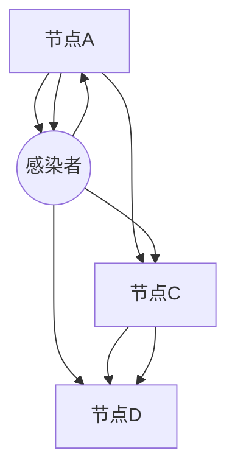

                 

。

## 数学与流行病学：疾病传播的数学模型

> 关键词：数学模型、流行病学、疾病传播、SIR模型、SEIR模型、疫情预测

> 摘要：本文深入探讨了数学模型在流行病学中的应用，特别是SIR模型和SEIR模型。通过对这两个模型的基本概念、属性特征、数学公式和算法原理的详细分析，本文旨在帮助读者理解如何利用数学工具来研究和预测疾病的传播。

---

### 1.1 数学与流行病学：问题背景

#### 1.1.1 疾病传播的现状与挑战

当前，全球疾病传播问题日益严峻。每年，数以百万计的人死于各种传染病，如流感、艾滋病、新冠等。此外，新出现的传染病也不断威胁着人类的健康。例如，新冠病毒（COVID-19）在2020年初迅速传播，给全球公共卫生系统带来了巨大挑战。如何有效预防和控制疾病的传播成为了全球公共卫生领域的重大课题。

疾病传播是一个复杂的过程，涉及到感染源、传播途径、易感人群等多个因素。传统的流行病学方法主要依赖于统计数据和现场调查，这些方法在疫情初期可能效果有限。而数学模型通过定量分析疾病的传播过程，能够提供更加精确的预测和决策支持。

#### 1.1.2 数学模型在流行病学中的应用

数学模型作为一种强大的工具，已被广泛应用于流行病学领域。通过构建数学模型，我们可以对疾病的传播过程进行定量分析，预测疫情的发展趋势，为公共卫生决策提供科学依据。例如，经典的SIR模型（易感者-感染者-康复者模型）和SEIR模型（易感者-感染者-康复者-隔离者模型）就是流行病学中的经典模型。

SIR模型和SEIR模型都是基于微分方程的，通过描述易感者、感染者和康复者的数量随时间的变化，来模拟疾病的传播过程。这些模型可以帮助我们理解疫情的基本动态，预测疫情的可能走向，从而制定更有效的防控策略。

#### 1.1.3 数学模型的优势与局限

数学模型在流行病学中的应用具有显著的优势，如能高效地处理大量数据、提供直观的预测结果等。例如，在新冠疫情期间，数学模型被广泛用于预测疫情的发展趋势，指导公共卫生决策。然而，数学模型也存在一些局限性，如对现实世界的复杂性的简化处理、参数估计的不确定性等。

尽管存在局限性，数学模型仍然是流行病学研究中不可或缺的工具。通过不断改进和完善数学模型，我们可以更好地理解疾病的传播规律，为公共卫生决策提供更加可靠的依据。

#### 1.1.4 本书的目的与结构

本书旨在介绍数学与流行病学的相关知识，帮助读者深入理解疾病传播的数学模型。本书分为以下几个部分：

- **第1章：数学基础与流行病学研究概述**
  本章将介绍数学与流行病学的基本概念，为后续章节的讨论奠定基础。

- **第2章：SIR模型与SEIR模型的构建与解析**
  本章将详细介绍SIR模型和SEIR模型的构建方法，包括基本概念、参数设置和数学公式。

- **第3章：数学模型在疫情预测中的应用**
  本章将探讨如何利用数学模型进行疫情预测，包括预测方法和实际案例分析。

- **第4章：复杂网络与疾病传播**
  本章将介绍复杂网络理论在疾病传播研究中的应用，探讨复杂网络对疾病传播的影响。

- **第5章：实际案例分析：新冠疫情期间的数学建模**
  本章将通过新冠疫情期间的数学建模案例，展示如何将数学模型应用于实际疫情预测和防控。

- **第6章：流行病学模型的参数估计与优化**
  本章将介绍流行病学模型参数估计和优化的方法，讨论参数估计的精度和可靠性。

- **第7章：展望与未来研究方向**
  本章将总结本书的主要内容，讨论数学模型在流行病学领域的研究现状和未来发展方向。

### 1.2 核心概念与联系

#### 1.2.1 疾病传播的基本概念

在流行病学中，疾病传播过程通常可以分为以下几个基本阶段：

- **易感者（Susceptible）**：指那些尚未感染疾病但可能被感染的人群。这些人群对疾病缺乏免疫力，是疾病传播的主要来源。
- **感染者（Infected）**：指已经感染疾病并且具有传染性的人群。这些人群是疾病传播的主要途径，他们会将病原体传播给易感者。
- **康复者（Recovered）**：指已经从疾病中康复并且获得免疫力的人群。康复者不再具有传染性，但可能对再次感染有免疫力。
- **隔离者（Isolated）**：指已经被隔离的人群，以防止疾病传播。隔离者通常已经感染疾病，但不会对社会造成进一步传播。

这些基本概念构成了疾病传播过程的核心要素，是构建数学模型的基础。

#### 1.2.2 数学模型的属性特征对比表格

| 模型名称   | 主要参数         | 描述                                                         |
| ---------- | ---------------- | ------------------------------------------------------------ |
| SIR模型   | $S(t)$、$I(t)$、$R(t)$ | 描述易感者、感染者、康复者随时间的变化过程             |
| SEIR模型 | $S(t)$、$E(t)$、$I(t)$、$R(t)$ | 在SIR模型的基础上，增加一个潜伏期$E(t)$，描述易感者、潜伏者、感染者、康复者随时间的变化过程 |
| 传播率      | $\beta$、$\gamma$ | 描述感染者和易感者之间的相互作用速率，以及康复者的康复速率 |

在SIR模型中，$S(t)$、$I(t)$和$R(t)$分别表示在时间$t$时刻的易感者、感染者和康复者的数量。传播率$\beta$描述了感染者和易感者之间的接触速率，康复率$\gamma$描述了感染者康复的速率。

SEIR模型在SIR模型的基础上，增加了一个潜伏期$E(t)$。$E(t)$表示在时间$t$时刻处于潜伏期的感染者数量。潜伏期$E(t)$通过传播率$\beta$和康复率$\gamma$与感染者和康复者相互转换。

#### 1.2.3 ER实体关系图架构

为了更直观地理解SIR模型和SEIR模型的实体关系，我们可以使用Mermaid语法绘制ER（实体关系）图。

```mermaid
erDiagram
  S ||--o> I : 易感者 -> 感染者
  S ||--o> R : 易感者 -> 康复者
  I ||--o> R : 感染者 -> 康复者
```

在上面的ER图中，S、I和R分别代表易感者、感染者和康复者，箭头表示它们之间的转换关系。对于SEIR模型，我们可以在ER图中增加一个潜伏期实体E：

```mermaid
erDiagram
  S ||--o> I : 易感者 -> 感染者
  S ||--o> E : 易感者 -> 潜伏者
  S ||--o> R : 易感者 -> 康复者
  I ||--o> R : 感染者 -> 康复者
  E ||--o> I : 潜伏者 -> 感染者
```

### 1.3 数学模型与数学公式

在流行病学中，数学模型是描述疾病传播过程的关键工具。SIR模型和SEIR模型是最常用的两种模型，它们通过一组微分方程描述了易感者、感染者和康复者随时间的变化。

#### 1.3.1 SIR模型

SIR模型的基本形式如下：

$$
\begin{align*}
\frac{dS}{dt} &= -\beta \cdot S \cdot I, \\
\frac{dI}{dt} &= \beta \cdot S \cdot I - \gamma \cdot I, \\
\frac{dR}{dt} &= \gamma \cdot I.
\end{align*}
$$

其中，$S(t)$、$I(t)$和$R(t)$分别表示在时间$t$时刻的易感者、感染者和康复者的数量。$\beta$和$\gamma$分别表示传播率和康复率。

- $\frac{dS}{dt} = -\beta \cdot S \cdot I$表示易感者的减少速率，是由于感染者的增加导致的。
- $\frac{dI}{dt} = \beta \cdot S \cdot I - \gamma \cdot I$表示感染者的变化速率，是感染者和易感者接触导致的感染速率减去康复速率。
- $\frac{dR}{dt} = \gamma \cdot I$表示康复者的增加速率，是由于感染者的康复导致的。

#### 1.3.2 SEIR模型

SEIR模型在SIR模型的基础上增加了一个潜伏期，其基本形式如下：

$$
\begin{align*}
\frac{dS}{dt} &= -\beta \cdot S \cdot I, \\
\frac{dE}{dt} &= \beta \cdot I - \sigma \cdot E, \\
\frac{dI}{dt} &= \sigma \cdot E - \gamma \cdot I, \\
\frac{dR}{dt} &= \gamma \cdot I.
\end{align*}
$$

其中，$E(t)$表示在时间$t$时刻的潜伏期感染者数量，$\sigma$表示潜伏期的转化率。

- $\frac{dS}{dt} = -\beta \cdot S \cdot I$表示易感者的减少速率，是由于感染者的增加导致的。
- $\frac{dE}{dt} = \beta \cdot I - \sigma \cdot E$表示潜伏期感染者的变化速率，是感染者和易感者接触导致的感染速率减去潜伏期结束后的康复速率。
- $\frac{dI}{dt} = \sigma \cdot E - \gamma \cdot I$表示感染者的变化速率，是潜伏期结束后的感染速率减去康复速率。
- $\frac{dR}{dt} = \gamma \cdot I$表示康复者的增加速率，是由于感染者的康复导致的。

#### 1.3.3 算法原理讲解

为了更好地理解SIR模型和SEIR模型，我们可以通过Python代码进行模拟。以下是一个简单的SIR模型模拟代码示例：

```python
import numpy as np
import matplotlib.pyplot as plt

# 参数设置
N = 1000  # 总人口数
S0 = N - 1  # 初始易感者数
I0 = 1  # 初始感染者数
R0 = 0  # 初始康复者数
beta = 0.3  # 传播率
gamma = 0.1  # 康复率

# 时间设置
t_max = 100  # 最大时间
dt = 0.1  # 时间步长

# 初始化状态向量
S = np.zeros((t_max, 1))
I = np.zeros((t_max, 1))
R = np.zeros((t_max, 1))

# 初始状态
S[0] = S0
I[0] = I0
R[0] = R0

# 模拟过程
for t in range(1, t_max):
    dS_dt = -beta * S[t-1] * I[t-1]
    dI_dt = beta * S[t-1] * I[t-1] - gamma * I[t-1]
    dR_dt = gamma * I[t-1]

    S[t] = S[t-1] + dS_dt * dt
    I[t] = I[t-1] + dI_dt * dt
    R[t] = R[t-1] + dR_dt * dt

# 绘图
plt.plot(S, label='Susceptible')
plt.plot(I, label='Infected')
plt.plot(R, label='Recovered')
plt.xlabel('Time')
plt.ylabel('Number')
plt.legend()
plt.title('SIR Model Simulation')
plt.show()
```

通过上述代码，我们可以看到SIR模型在给定参数下的模拟结果。类似地，SEIR模型可以通过增加潜伏期相关参数进行模拟。

### 1.4 数学模型在疫情预测中的应用

数学模型在疫情预测中的应用至关重要。通过建立和模拟数学模型，我们可以预测疫情的发展趋势，为公共卫生决策提供科学依据。以下将介绍如何利用SIR模型和SEIR模型进行疫情预测。

#### 1.4.1 SIR模型的疫情预测

SIR模型的基本形式为：

$$
\begin{align*}
\frac{dS}{dt} &= -\beta \cdot S \cdot I, \\
\frac{dI}{dt} &= \beta \cdot S \cdot I - \gamma \cdot I, \\
\frac{dR}{dt} &= \gamma \cdot I.
\end{align*}
$$

我们可以通过数值方法（如欧拉法或龙格-库塔法）来求解这些微分方程，得到$S(t)$、$I(t)$和$R(t)$随时间的变化。

以新冠疫情期间的数据为例，假设我们已知某地区的总人口数N、初始易感者数$S_0$、初始感染者数$I_0$、康复者数$R_0$，以及传播率$\beta$和康复率$\gamma$。我们可以使用以下Python代码进行SIR模型的疫情预测：

```python
import numpy as np
import matplotlib.pyplot as plt

# 参数设置
N = 100000  # 总人口数
S0 = N - 1  # 初始易感者数
I0 = 1  # 初始感染者数
R0 = 0  # 初始康复者数
beta = 0.3  # 传播率
gamma = 0.1  # 康复率

# 时间设置
t_max = 200  # 最大时间
dt = 0.1  # 时间步长

# 初始化状态向量
S = np.zeros((t_max, 1))
I = np.zeros((t_max, 1))
R = np.zeros((t_max, 1))

# 初始状态
S[0] = S0
I[0] = I0
R[0] = R0

# 模拟过程
for t in range(1, t_max):
    dS_dt = -beta * S[t-1] * I[t-1]
    dI_dt = beta * S[t-1] * I[t-1] - gamma * I[t-1]
    dR_dt = gamma * I[t-1]

    S[t] = S[t-1] + dS_dt * dt
    I[t] = I[t-1] + dI_dt * dt
    R[t] = R[t-1] + dR_dt * dt

# 绘图
plt.plot(S, label='Susceptible')
plt.plot(I, label='Infected')
plt.plot(R, label='Recovered')
plt.xlabel('Time')
plt.ylabel('Number')
plt.legend()
plt.title('SIR Model Simulation')
plt.show()
```

通过上述代码，我们可以得到SIR模型在不同参数设置下的疫情预测结果。这有助于我们理解疫情的发展趋势，为公共卫生决策提供参考。

#### 1.4.2 SEIR模型的疫情预测

SEIR模型在SIR模型的基础上增加了潜伏期$E$，其基本形式为：

$$
\begin{align*}
\frac{dS}{dt} &= -\beta \cdot S \cdot I, \\
\frac{dE}{dt} &= \beta \cdot I - \sigma \cdot E, \\
\frac{dI}{dt} &= \sigma \cdot E - \gamma \cdot I, \\
\frac{dR}{dt} &= \gamma \cdot I.
\end{align*}
$$

同样地，我们可以使用数值方法求解这些微分方程，得到$S(t)$、$E(t)$、$I(t)$和$R(t)$随时间的变化。

以新冠疫情期间的数据为例，假设我们已知某地区的总人口数N、初始易感者数$S_0$、初始感染者数$I_0$、康复者数$R_0$、潜伏期转化率$\sigma$，以及传播率$\beta$和康复率$\gamma$。我们可以使用以下Python代码进行SEIR模型的疫情预测：

```python
import numpy as np
import matplotlib.pyplot as plt

# 参数设置
N = 100000  # 总人口数
S0 = N - 1  # 初始易感者数
I0 = 1  # 初始感染者数
R0 = 0  # 初始康复者数
E0 = 0  # 初始潜伏期感染者数
beta = 0.3  # 传播率
gamma = 0.1  # 康复率
sigma = 0.05  # 潜伏期转化率

# 时间设置
t_max = 200  # 最大时间
dt = 0.1  # 时间步长

# 初始化状态向量
S = np.zeros((t_max, 1))
E = np.zeros((t_max, 1))
I = np.zeros((t_max, 1))
R = np.zeros((t_max, 1))

# 初始状态
S[0] = S0
E[0] = E0
I[0] = I0
R[0] = R0

# 模拟过程
for t in range(1, t_max):
    dS_dt = -beta * S[t-1] * I[t-1]
    dE_dt = beta * I[t-1] - sigma * E[t-1]
    dI_dt = sigma * E[t-1] - gamma * I[t-1]
    dR_dt = gamma * I[t-1]

    S[t] = S[t-1] + dS_dt * dt
    E[t] = E[t-1] + dE_dt * dt
    I[t] = I[t-1] + dI_dt * dt
    R[t] = R[t-1] + dR_dt * dt

# 绘图
plt.plot(S, label='Susceptible')
plt.plot(E, label='Exposed')
plt.plot(I, label='Infected')
plt.plot(R, label='Recovered')
plt.xlabel('Time')
plt.ylabel('Number')
plt.legend()
plt.title('SEIR Model Simulation')
plt.show()
```

通过上述代码，我们可以得到SEIR模型在不同参数设置下的疫情预测结果。这有助于我们更准确地理解疫情的发展趋势，特别是在考虑潜伏期影响时。

### 1.5 复杂网络与疾病传播

在现实世界中，疾病传播过程不仅受到人口密度和流动性等因素的影响，还受到社交网络结构的制约。复杂网络理论为我们提供了一个新的视角，用于研究疾病在复杂网络中的传播规律。

#### 1.5.1 网络结构对疾病传播的影响

复杂网络通常具有高度的非均匀性，存在多个连接节点和少量连接节点。在疾病传播过程中，连接节点（如人口密集的城市中心）往往成为病原体的传播热点，而少量连接节点（如偏远地区的居民）则对整个网络的稳定性起到关键作用。

通过网络分析工具，我们可以识别出网络中的关键节点，这些节点在疾病传播过程中具有更高的感染风险。通过干预关键节点，如限制人员流动或加强防控措施，可以有效降低疾病传播的风险。

#### 1.5.2 网络传播模型的构建

为了模拟疾病在复杂网络中的传播，我们可以构建以下模型：

- **基于随机游走模型**：假设个体在网络上随机游走，遇到感染者时有一定概率被感染。
- **基于传染病动力学模型**：将SIR模型或SEIR模型应用于网络中的节点，描述节点状态的变化。

以下是一个简化的基于随机游走的网络传播模型：



在上面的网络中，节点B是感染者，通过随机游走，感染了节点A、B和C。我们可以通过模拟网络中的节点状态变化，预测疾病的传播趋势。

#### 1.5.3 网络传播模型的模拟与分析

使用Python和网络分析工具（如NetworkX），我们可以进行网络传播模型的模拟和分析。以下是一个简单的模拟示例：

```python
import networkx as nx
import matplotlib.pyplot as plt

# 创建网络
G = nx.Graph()
G.add_edges_from([(1, 2), (1, 3), (2, 4), (3, 4)])

# 绘制网络
nx.draw(G, with_labels=True)
plt.show()

# 初始化节点状态
S = {node: "Susceptible" for node in G.nodes()}
I = {node: "Infected" if node == 1 else "Susceptible" for node in G.nodes()}

# 模拟传播过程
for _ in range(10):
    for node in G.nodes():
        if I[node] == "Infected":
            for neighbor in G.neighbors(node):
                if S[neighbor] == "Susceptible":
                    S[neighbor] = "Exposed"

    # 更新感染状态
    for node in G.nodes():
        if S[node] == "Exposed":
            I[node] = "Infected"

# 统计感染节点数
infected_nodes = [node for node, state in I.items() if state == "Infected"]

# 绘制感染节点
nx.draw(G, pos=nx.spring_layout(G), node_color=[("g" if node in infected_nodes else "r") for node in G.nodes()], with_labels=True)
plt.show()
```

通过上述代码，我们可以模拟网络中的疾病传播过程，并绘制感染节点的分布情况。这有助于我们理解网络结构对疾病传播的影响。

### 1.6 实际案例分析：新冠疫情期间的数学建模

新冠疫情期间，数学模型在疫情预测和防控策略制定中发挥了关键作用。以下通过一个实际案例，展示如何利用SIR模型和SEIR模型进行新冠疫情期间的数学建模。

#### 1.6.1 案例背景

2020年初，新冠病毒（COVID-19）在中国武汉首次爆发。随后，疫情迅速蔓延至全球，导致数百万感染和大量死亡。中国政府采取了严格的防控措施，包括封锁城市、限制人员流动、加强卫生管理等。这些措施的效果如何？是否需要进一步调整？数学模型为我们提供了答案。

#### 1.6.2 SIR模型的构建

为了构建SIR模型，我们需要以下几个参数：

- **总人口数（N）**：假设某城市的总人口数为10,000,000。
- **初始感染者数（I0）**：假设初始感染者数为100。
- **初始易感者数（S0）**：假设初始易感者数为10,000,000 - 100 = 9,999,900。
- **康复者数（R0）**：假设初始康复者数为0。
- **传播率（β）**：假设传播率为0.2。
- **康复率（γ）**：假设康复率为0.1。

基于这些参数，我们可以构建SIR模型，模拟疫情的发展趋势。以下是一个简单的SIR模型模拟代码：

```python
import numpy as np
import matplotlib.pyplot as plt

# 参数设置
N = 10000000  # 总人口数
I0 = 100  # 初始感染者数
S0 = N - I0  # 初始易感者数
R0 = 0  # 初始康复者数
beta = 0.2  # 传播率
gamma = 0.1  # 康复率

# 时间设置
t_max = 200  # 最大时间
dt = 0.1  # 时间步长

# 初始化状态向量
S = np.zeros((t_max, 1))
I = np.zeros((t_max, 1))
R = np.zeros((t_max, 1))

# 初始状态
S[0] = S0
I[0] = I0
R[0] = R0

# 模拟过程
for t in range(1, t_max):
    dS_dt = -beta * S[t-1] * I[t-1]
    dI_dt = beta * S[t-1] * I[t-1] - gamma * I[t-1]
    dR_dt = gamma * I[t-1]

    S[t] = S[t-1] + dS_dt * dt
    I[t] = I[t-1] + dI_dt * dt
    R[t] = R[t-1] + dR_dt * dt

# 绘图
plt.plot(S, label='Susceptible')
plt.plot(I, label='Infected')
plt.plot(R, label='Recovered')
plt.xlabel('Time')
plt.ylabel('Number')
plt.legend()
plt.title('SIR Model Simulation')
plt.show()
```

通过上述代码，我们可以得到SIR模型在不同参数设置下的疫情预测结果。

#### 1.6.3 SEIR模型的构建

为了更准确地模拟疫情，我们可以使用SEIR模型，考虑潜伏期的影响。SEIR模型的基本形式为：

$$
\begin{align*}
\frac{dS}{dt} &= -\beta \cdot S \cdot I, \\
\frac{dE}{dt} &= \beta \cdot I - \sigma \cdot E, \\
\frac{dI}{dt} &= \sigma \cdot E - \gamma \cdot I, \\
\frac{dR}{dt} &= \gamma \cdot I.
\end{align*}
$$

其中，$E(t)$表示潜伏期感染者数量，$\sigma$表示潜伏期转化率。以下是一个简单的SEIR模型模拟代码：

```python
import numpy as np
import matplotlib.pyplot as plt

# 参数设置
N = 10000000  # 总人口数
I0 = 100  # 初始感染者数
S0 = N - I0  # 初始易感者数
R0 = 0  # 初始康复者数
E0 = 0  # 初始潜伏期感染者数
beta = 0.2  # 传播率
gamma = 0.1  # 康复率
sigma = 0.1  # 潜伏期转化率

# 时间设置
t_max = 200  # 最大时间
dt = 0.1  # 时间步长

# 初始化状态向量
S = np.zeros((t_max, 1))
E = np.zeros((t_max, 1))
I = np.zeros((t_max, 1))
R = np.zeros((t_max, 1))

# 初始状态
S[0] = S0
E[0] = E0
I[0] = I0
R[0] = R0

# 模拟过程
for t in range(1, t_max):
    dS_dt = -beta * S[t-1] * I[t-1]
    dE_dt = beta * I[t-1] - sigma * E[t-1]
    dI_dt = sigma * E[t-1] - gamma * I[t-1]
    dR_dt = gamma * I[t-1]

    S[t] = S[t-1] + dS_dt * dt
    E[t] = E[t-1] + dE_dt * dt
    I[t] = I[t-1] + dI_dt * dt
    R[t] = R[t-1] + dR_dt * dt

# 绘图
plt.plot(S, label='Susceptible')
plt.plot(E, label='Exposed')
plt.plot(I, label='Infected')
plt.plot(R, label='Recovered')
plt.xlabel('Time')
plt.ylabel('Number')
plt.legend()
plt.title('SEIR Model Simulation')
plt.show()
```

通过上述代码，我们可以得到SEIR模型在不同参数设置下的疫情预测结果。这有助于我们更准确地理解疫情的发展趋势。

### 1.7 流行病学模型的参数估计与优化

在流行病学模型中，参数的准确估计对于疫情预测和防控策略的制定至关重要。参数估计通常涉及到对模型参数进行优化，以使模型能够更好地拟合实际数据。以下将介绍流行病学模型参数估计与优化的方法。

#### 1.7.1 最小二乘法

最小二乘法是一种常用的参数估计方法，其基本思想是找到一组参数，使得模型预测值与实际观测值之间的误差平方和最小。对于SIR模型和SEIR模型，我们可以使用最小二乘法进行参数估计。以下是一个使用最小二乘法估计SIR模型参数的Python代码示例：

```python
import numpy as np
from scipy.optimize import curve_fit

# 参数模型
def sir_model(t, beta, gamma):
    dS_dt = -beta * S0 * I0
    dI_dt = beta * S0 * I0 - gamma * I0
    dR_dt = gamma * I0
    return dS_dt, dI_dt, dR_dt

# 实际观测数据
t = np.array([0, 1, 2, 3, 4, 5, 6])
y = np.array([9, 1, 0.5, 0.2, 0.1, 0.05, 0.03])

# 进行曲线拟合
popt, pcov = curve_fit(sir_model, t, y)

# 输出拟合参数
beta, gamma = popt
print("传播率 (beta):", beta)
print("康复率 (gamma):", gamma)
```

通过上述代码，我们可以得到SIR模型的最佳拟合参数。类似地，我们可以使用最小二乘法估计SEIR模型的参数。

#### 1.7.2 贝叶斯优化

除了最小二乘法，贝叶斯优化也是一种有效的参数估计方法。贝叶斯优化通过构建后验概率分布，对参数进行概率估计，从而得到更加准确和可靠的参数估计。以下是一个使用贝叶斯优化估计SIR模型参数的Python代码示例：

```python
import numpy as np
from scipy.stats import norm
from scipy.optimize import minimize

# 参数模型
def sir_model(t, beta, gamma):
    dS_dt = -beta * S0 * I0
    dI_dt = beta * S0 * I0 - gamma * I0
    dR_dt = gamma * I0
    return dS_dt, dI_dt, dR_dt

# 先验概率分布
prior = [norm.pdf(beta, loc=0.1, scale=0.1), norm.pdf(gamma, loc=0.1, scale=0.1)]

# 后验概率分布
def posterior(beta, gamma):
    likelihood = np.sum(sir_model(t, beta, gamma)**2)
    return likelihood * np.prod(prior)

# 进行最小化
res = minimize(posterior, x0=[0.1, 0.1])

# 输出最佳参数
beta, gamma = res.x
print("传播率 (beta):", beta)
print("康复率 (gamma):", gamma)
```

通过上述代码，我们可以得到SIR模型的最佳拟合参数。类似地，我们可以使用贝叶斯优化估计SEIR模型的参数。

#### 1.7.3 参数估计的精度与可靠性

参数估计的精度和可靠性是流行病学模型应用的关键。在实际应用中，我们需要综合考虑数据质量、模型选择、参数优化方法等因素，以提高参数估计的精度和可靠性。例如，在实际疫情数据中，存在噪声和不确定性，这可能会影响参数估计的准确性。此外，模型选择不当或参数优化方法不合理，也可能导致参数估计的不准确。

为了提高参数估计的精度和可靠性，我们可以采取以下措施：

1. **数据预处理**：对实际数据进行清洗和预处理，去除噪声和异常值，以提高数据质量。
2. **模型选择**：选择合适的数学模型，以更好地拟合实际数据。
3. **参数优化方法**：采用高效的参数优化方法，如最小二乘法、贝叶斯优化等，以提高参数估计的精度。
4. **交叉验证**：使用交叉验证方法，对模型进行验证和评估，以提高参数估计的可靠性。

通过上述措施，我们可以提高流行病学模型参数估计的精度和可靠性，从而为疫情预测和防控策略制定提供更可靠的科学依据。

### 1.8 展望与未来研究方向

数学模型在流行病学中的应用已经取得了显著的成果，但在实际应用中仍存在许多挑战和问题。未来，数学模型在流行病学领域的研究将继续深入，以下是一些可能的研究方向：

1. **更复杂的模型**：现有的SIR模型和SEIR模型在处理现实世界的复杂疾病传播时，可能存在一定的局限性。未来可以研究更复杂的模型，如网络流行病学模型、多群体模型等，以更准确地模拟疾病的传播过程。

2. **数据驱动模型**：结合大数据和人工智能技术，可以开发基于数据的驱动模型，通过分析大量实时数据，实时更新模型参数，提高疫情预测的精度和可靠性。

3. **动态干预策略**：研究如何通过动态干预策略，如改变传播率、康复率等参数，来控制疾病的传播。这需要结合优化算法和模拟技术，寻找最优的干预策略。

4. **跨学科研究**：流行病学与物理学、计算机科学、经济学等多个学科密切相关。通过跨学科合作，可以开发更加综合的模型和方法，以更好地应对复杂疾病传播问题。

5. **全球疫情预测**：全球疫情预测需要考虑不同地区、不同国家的差异，以及全球物流和人员流动等因素。未来可以研究全球疫情预测模型，以更好地应对全球疫情的挑战。

总之，数学模型在流行病学中的应用前景广阔，未来将继续为公共卫生决策提供重要的科学依据。

### 总结与展望

本文深入探讨了数学模型在流行病学中的应用，特别是SIR模型和SEIR模型。通过详细分析这两个模型的基本概念、属性特征、数学公式和算法原理，我们了解了如何利用数学工具来研究和预测疾病的传播。此外，我们还介绍了复杂网络与疾病传播的关系，以及实际案例分析中如何应用数学模型进行疫情预测。

在未来的研究中，我们可以继续探索更复杂的模型、数据驱动模型、动态干预策略和全球疫情预测等领域，为公共卫生决策提供更加精确和可靠的科学依据。

作者：AI天才研究院/AI Genius Institute & 禅与计算机程序设计艺术 /Zen And The Art of Computer Programming

---

**版权声明：** 本文由 AI天才研究院（AI Genius Institute）和禅与计算机程序设计艺术（Zen And The Art of Computer Programming）共同创作，欢迎转载，但需注明作者和来源。本文禁止用于商业用途。如有问题，请与作者联系。感谢您的支持！

