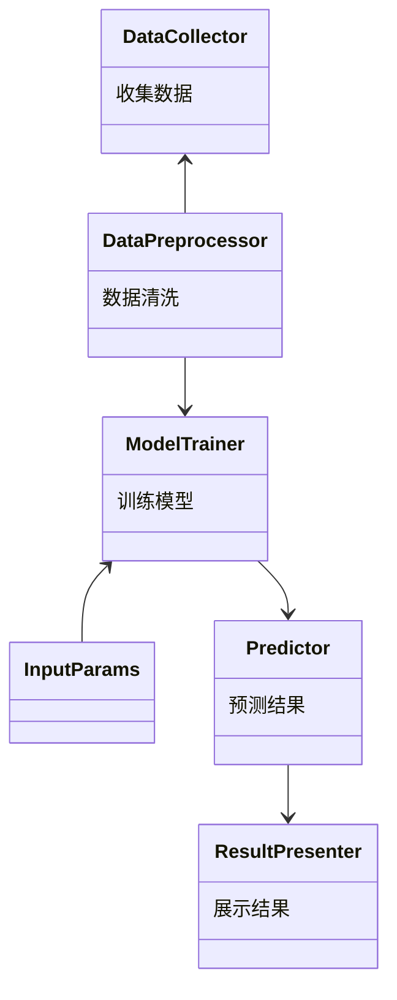
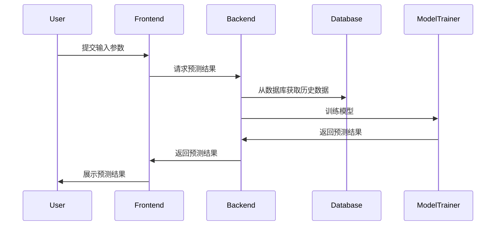
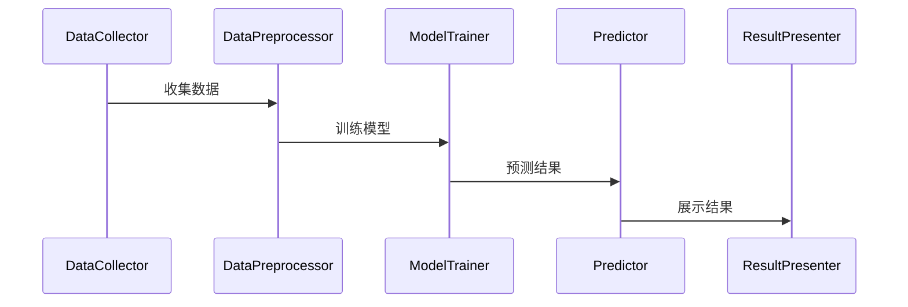

                 

### 数学与流行病学：疾病传播的数学预测

> 关键词：疾病传播、数学模型、流行病学、预测

> 摘要：本文旨在探讨数学在流行病学中的应用，通过构建数学模型来预测疾病的传播。文章首先介绍疾病传播的问题背景和数学模型的基本原理，随后通过具体实例和代码示例，展示如何利用数学模型进行疾病传播预测。最后，文章将对系统分析与架构设计进行阐述，并通过实际案例分析和最佳实践，为读者提供全面的疾病传播预测方案。

----------------------------------------------------------------

### 封面

**数学与流行病学：疾病传播的数学预测**

作者：AI天才研究院 & 禅与计算机程序设计艺术

----------------------------------------------------------------

### 前言

近年来，全球范围内疾病的传播速度和范围不断加剧，对公共卫生体系和社会经济发展带来了巨大的挑战。流行病学作为研究疾病在人群中传播规律的科学，其研究成果对于制定有效的防控策略具有重要意义。然而，传统的流行病学研究方法往往依赖于经验数据，难以精确预测疾病的传播趋势。随着数学和计算机科学的发展，利用数学模型进行疾病传播预测成为可能，为公共卫生决策提供了科学依据。

本文将从数学与流行病学的交叉领域出发，探讨疾病传播的数学预测方法。首先，我们将介绍疾病传播的问题背景和数学模型的基本原理。接着，通过具体的实例和代码示例，展示如何构建和利用数学模型进行疾病传播预测。此外，还将对系统分析与架构设计进行详细阐述，并通过实际案例分析和最佳实践，为读者提供全面的疾病传播预测方案。

本文的目标是为读者提供一套系统、全面且易于理解的学习框架，帮助他们掌握疾病传播的数学预测方法，并为公共卫生决策提供有力支持。希望通过本文的阅读，读者能够对疾病传播的数学预测有更深入的认识，从而更好地应对未来可能出现的公共卫生挑战。

----------------------------------------------------------------

### 第一部分：背景介绍

#### 第1章：问题背景

##### 1.1 问题的背景

疾病的传播是一个复杂且重要的生物学和社会现象。从历史角度来看，传染病的爆发和传播对人类社会造成了巨大的影响，如中世纪的黑死病、19世纪的霍乱和20世纪的流感大流行。这些疾病不仅导致了大量人口死亡，还对社会经济、政治和文化产生了深远的影响。

在现代，随着全球化和人口流动的加剧，疾病的传播速度和范围更加迅速和广泛。例如，2003年的非典型肺炎（SARS）和2019年的新型冠状病毒（COVID-19）疫情，都在短时间内迅速蔓延至全球，对全球公共卫生体系和社会经济造成了严重冲击。

疾病的传播不仅涉及生物学机制，还受到社会行为、人口结构、医疗资源等多种因素的影响。为了有效控制疾病的传播，了解其传播规律和趋势至关重要。数学模型作为一种定量分析工具，可以模拟和预测疾病的传播过程，为公共卫生决策提供科学依据。

##### 1.2 问题描述

疾病传播问题描述主要包括以下几个方面：

1. **基本参数定义**：定义疾病在人群中的传播速度、感染率、恢复率等基本参数。
2. **传播过程描述**：描述疾病在不同时间点、不同人群中的传播情况，包括感染人数的变化趋势、感染者的流动情况等。
3. **预测目标**：根据历史数据和基本参数，预测未来某一时刻的感染人数、传播范围等。

##### 1.3 问题解决

为了解决疾病传播的预测问题，我们可以采用以下几种方法：

1. **传统流行病学方法**：基于经验和统计数据，通过统计模型（如回归模型、时间序列模型等）来分析疾病传播的规律。
2. **数学模型方法**：利用数学建模方法，构建疾病传播的数学模型，如微分方程模型、网络模型等，进行定量分析和预测。
3. **大数据分析方法**：利用大数据技术和机器学习方法，对大量历史数据和实时数据进行分析，提取传播规律和趋势。

##### 1.4 边界与外延

疾病传播问题的边界主要包括以下几个方面：

1. **时空范围**：疾病的传播范围和传播速度受到地理环境、人口密度、交通网络等多种因素的影响，因此模型的时空范围需要根据实际情况进行设定。
2. **人群特征**：不同人群（如年龄、性别、健康状况等）的感染和传播能力不同，需要考虑人群特征的差异。
3. **外部因素**：政策干预、公共卫生措施、社会行为变化等外部因素也会影响疾病的传播。

##### 1.5 概念结构与核心要素组成

疾病传播的数学预测涉及多个核心概念和要素，主要包括：

1. **基本参数**：包括感染率、恢复率、潜伏期等，用于描述疾病的传播规律。
2. **人群结构**：包括人口密度、人口流动、人群特征等，用于描述人群的感染和传播情况。
3. **传播模型**：包括微分方程模型、网络模型等，用于模拟和预测疾病的传播过程。
4. **预测方法**：包括统计模型、机器学习模型等，用于对疾病传播进行定量分析和预测。

### 第2章：核心概念与联系

##### 2.1 核心概念原理

在疾病传播的数学预测中，几个核心概念起着关键作用。这些概念包括：

1. **基本再生数（R0）**：基本再生数是指在一个完全易感人群中，一个感染者在没有外源感染源的情况下，平均能够传染给其他人的数量。它是衡量疾病传播能力的重要指标。

   $$R_0 = \frac{\beta I}{\mu}$$
   
   其中，$\beta$ 是感染率，$I$ 是感染者数量，$\mu$ 是人群的死亡率和恢复率之和。

2. **易感者（Susceptible, S）**：易感者是指尚未感染疾病的人群，他们在接触感染者后可能被感染。

3. **感染者（Infectious, I）**：感染者是指已经感染疾病，并且具有传染性的人群。

4. **恢复者（Recovered, R）**：恢复者是指已经从疾病中康复，并且对疾病具有免疫力的人群。

5. **疾病传播模型**：常见的疾病传播模型包括SIR模型、SEIR模型等，这些模型通过数学方程描述疾病的传播过程。

##### 2.2 概念属性特征对比表格

以下是对SIR模型和SEIR模型的一些基本属性和特征进行对比：

| 特征               | SIR模型                          | SEIR模型                          |
|------------------|--------------------------------|--------------------------------|
| 人群状态           | 易感者（S）、感染者（I）、恢复者（R） | 易感者（S）、暴露者（E）、感染者（I）、恢复者（R） |
| 数学模型           | SIR模型方程组                    | SEIR模型方程组                   |
| 方程组形式         | $$ \frac{dS}{dt} = -\frac{\beta SI}{N} $$ | $$ \frac{dS}{dt} = -\frac{\beta SE}{N} $$  |
|                    | $$ \frac{dI}{dt} = \frac{\beta SI}{N} - \mu I $$ | $$ \frac{dE}{dt} = \frac{\beta SE}{N} - \sigma E $$  |
|                    | $$ \frac{dR}{dt} = \mu I $$        | $$ \frac{dI}{dt} = \sigma E - \mu I $$  |
|                    | $$ N = S + I + R $$            | $$ N = S + E + I + R $$          |
| 适用场景           | 用于描述传染病在封闭人群中的传播 | 用于描述传染病在开放人群中的传播 |
| 模型参数           | 感染率（β）、恢复率（μ）         | 感染率（β）、暴露率（σ）、恢复率（μ） |

##### 2.3 ER实体关系图架构的Mermaid流程图

为了更直观地展示SIR模型和SEIR模型中的实体及其关系，我们可以使用Mermaid绘制ER（实体关系）图。以下是SIR模型的Mermaid流程图：

```mermaid
erDiagram
  S tightly人民政府S ||--o{ I 感染者I : 易感者传染为感染者}
  S tightly人民政府S ||--o{ R 恢复者R : 易感者传染为恢复者}
  I 感染者I ||--o{ R 恢复者R : 感染者康复为恢复者}
  S 感染者S ||--|{ N 人群N : 人群总数（S + I + R）}
```

使用类似的方法，我们可以绘制SEIR模型的ER图，以展示易感者（S）、暴露者（E）、感染者（I）和恢复者（R）之间的关系。

```mermaid
erDiagram
  S tightly人民政府S ||--o{ E 暴露者E : 易感者传染为暴露者}
  S tightly人民政府S ||--o{ I 感染者I : 易感者传染为感染者}
  E 暴露者E ||--o{ I 感染者I : 暴露者传染为感染者}
  I 感染者I ||--o{ R 恢复者R : 感染者康复为恢复者}
  S 感染者S ||--|{ N 人群N : 人群总数（S + E + I + R）}
```

通过这些ER图，我们可以清晰地看到不同实体之间的相互关系和转化过程，为理解疾病传播的数学模型提供了直观的辅助工具。

### 第二部分：数学模型与算法原理

#### 第3章：数学模型

##### 3.1 数学模型概述

在疾病传播的数学预测中，SIR模型和SEIR模型是两种经典的数学模型。这些模型通过数学方程描述疾病的传播过程，为定量分析和预测提供了基础。

SIR模型是一种简单的传染病模型，用于描述易感者（S）、感染者（I）和恢复者（R）之间的动态变化。其核心方程组如下：

$$ \frac{dS}{dt} = -\frac{\beta SI}{N} $$
$$ \frac{dI}{dt} = \frac{\beta SI}{N} - \mu I $$
$$ \frac{dR}{dt} = \mu I $$

其中，$\beta$ 是感染率，$\mu$ 是恢复率，$N$ 是人群总数。这些方程描述了易感者向感染者转化的速率、感染者的恢复速率以及感染者和恢复者的相互关系。

SEIR模型是SIR模型的扩展，增加了暴露者（E）的状态，用于描述疾病的潜伏期。其核心方程组如下：

$$ \frac{dS}{dt} = -\frac{\beta SE}{N} $$
$$ \frac{dE}{dt} = \frac{\beta SE}{N} - \sigma E $$
$$ \frac{dI}{dt} = \sigma E - \mu I $$
$$ \frac{dR}{dt} = \mu I $$

其中，$\sigma$ 是暴露率。SEIR模型更加准确地描述了疾病的传播过程，尤其适用于潜伏期较长的传染病。

##### 3.2 数学模型的数学公式

以下是SIR模型和SEIR模型的核心数学公式：

SIR模型：

$$ \frac{dS}{dt} = -\frac{\beta SI}{N} $$
$$ \frac{dI}{dt} = \frac{\beta SI}{N} - \mu I $$
$$ \frac{dR}{dt} = \mu I $$
$$ N = S + I + R $$

SEIR模型：

$$ \frac{dS}{dt} = -\frac{\beta SE}{N} $$
$$ \frac{dE}{dt} = \frac{\beta SE}{N} - \sigma E $$
$$ \frac{dI}{dt} = \sigma E - \mu I $$
$$ \frac{dR}{dt} = \mu I $$
$$ N = S + E + I + R $$

这些公式描述了不同状态的人群在不同时间点的变化率，通过求解这些微分方程，可以得到疾病传播的动态过程。

##### 3.3 数学模型的应用与解释

为了更好地理解数学模型的应用，我们可以通过一个简单的实例来讲解。

假设一个城市有1000人，初始状态下全部为易感者（S=1000, I=0, R=0）。感染率（$\beta$）为0.1，恢复率（$\mu$）为0.05。我们需要预测未来一段时间内感染人数的变化。

使用SIR模型，我们可以列出以下方程组：

$$ \frac{dS}{dt} = -\frac{0.1 \cdot S \cdot I}{1000} $$
$$ \frac{dI}{dt} = \frac{0.1 \cdot S \cdot I}{1000} - 0.05 \cdot I $$
$$ \frac{dR}{dt} = 0.05 \cdot I $$

我们可以使用Python代码求解这些方程，模拟感染人数的变化过程。以下是一个简单的Python代码示例：

```python
import numpy as np
import matplotlib.pyplot as plt

N = 1000
beta = 0.1
mu = 0.05
S0 = 1000
I0 = 0
R0 = 0
t_max = 100
dt = 0.1

t = np.arange(0, t_max, dt)
S = S0 * np.exp(-beta * I0 * t)
I = I0 + (beta * S0 * I0 * t - mu * I0 * t) / N
R = R0 + (mu * I0 * t) / N

plt.plot(t, S, label='Susceptible')
plt.plot(t, I, label='Infectious')
plt.plot(t, R, label='Recovered')
plt.xlabel('Time')
plt.ylabel('Population')
plt.legend()
plt.show()
```

运行上述代码，我们可以得到感染人数随时间变化的折线图。通过分析图表，我们可以发现感染人数在初期迅速上升，随后逐渐趋于平稳，最终大部分人群将康复。

##### 3.4 举例说明

为了进一步说明数学模型的应用，我们可以使用SEIR模型模拟一个更加复杂的情景。

假设一个城市有1000人，初始状态下全部为易感者（S=1000, I=0, E=0, R=0）。感染率（$\beta$）为0.1，暴露率（$\sigma$）为0.05，恢复率（$\mu$）为0.05。我们需要预测未来一段时间内感染人数的变化。

使用SEIR模型，我们可以列出以下方程组：

$$ \frac{dS}{dt} = -\frac{\beta SE}{N} $$
$$ \frac{dE}{dt} = \frac{\beta SE}{N} - \sigma E $$
$$ \frac{dI}{dt} = \sigma E - \mu I $$
$$ \frac{dR}{dt} = \mu I $$
$$ N = S + E + I + R $$

我们可以使用Python代码求解这些方程，模拟感染人数的变化过程。以下是一个简单的Python代码示例：

```python
import numpy as np
import matplotlib.pyplot as plt

N = 1000
beta = 0.1
sigma = 0.05
mu = 0.05
S0 = 1000
I0 = 0
E0 = 0
R0 = 0
t_max = 100
dt = 0.1

t = np.arange(0, t_max, dt)
S = S0 * np.exp(-beta * E0 * t)
E = E0 + (beta * S0 * E0 * t - sigma * E0 * t) / N
I = I0 + (sigma * E0 * t) / N - (mu * I0 * t) / N
R = R0 + (mu * I0 * t) / N

plt.plot(t, S, label='Susceptible')
plt.plot(t, E, label='Exposed')
plt.plot(t, I, label='Infectious')
plt.plot(t, R, label='Recovered')
plt.xlabel('Time')
plt.ylabel('Population')
plt.legend()
plt.show()
```

运行上述代码，我们可以得到感染人数、暴露人数、感染人数和康复人数随时间变化的折线图。通过分析图表，我们可以发现感染人数在初期迅速上升，随后逐渐趋于平稳，而暴露人数和感染人数在潜伏期内逐渐增加，最终大部分人群将康复。

通过这些实例，我们可以看到数学模型在疾病传播预测中的应用。通过调整模型参数，我们可以模拟不同情景下的疾病传播过程，为公共卫生决策提供有力支持。

### 第三部分：系统分析与架构设计

#### 第4章：系统功能设计

##### 4.1 问题场景介绍

在疾病传播预测系统中，我们需要处理以下问题：

1. **数据收集**：收集与疾病传播相关的数据，包括感染人数、易感者人数、康复人数等。
2. **模型训练**：利用收集到的数据训练数学模型，如SIR模型和SEIR模型，以预测未来疾病传播趋势。
3. **结果展示**：将预测结果以图表形式展示，帮助用户直观了解疾病传播的动态过程。

##### 4.2 系统功能设计

为了实现上述功能，我们可以设计以下模块：

1. **数据收集模块**：负责从各种数据源（如疫情报告、卫生部门数据等）收集与疾病传播相关的数据。
2. **数据预处理模块**：对收集到的数据进行分析和清洗，去除重复、错误和不完整的数据，以便后续模型训练。
3. **模型训练模块**：利用预处理后的数据训练数学模型，如SIR模型和SEIR模型，并保存训练结果。
4. **预测模块**：根据训练好的模型和输入参数，预测未来一段时间内疾病传播趋势。
5. **结果展示模块**：将预测结果以图表形式展示，包括感染人数、易感者人数、康复人数等。

以下是系统功能设计中的Mermaid类图：



#### 第5章：系统架构设计

##### 5.1 系统架构设计

为了实现系统的功能，我们可以采用以下架构设计：

1. **前端**：负责用户交互，展示系统功能和预测结果。
2. **后端**：负责数据收集、预处理、模型训练和预测等核心功能。
3. **数据库**：存储与疾病传播相关的数据，包括历史数据、实时数据和预测结果。

以下是系统架构设计中的Mermaid架构图：



##### 5.2 系统接口设计

为了方便系统之间的通信，我们可以设计以下接口：

1. **数据收集接口**：用于从外部数据源收集与疾病传播相关的数据。
2. **数据预处理接口**：用于清洗和处理收集到的数据。
3. **模型训练接口**：用于训练数学模型，如SIR模型和SEIR模型。
4. **预测接口**：用于根据输入参数和训练好的模型预测未来疾病传播趋势。
5. **结果展示接口**：用于将预测结果以图表形式展示。

以下是系统接口设计中的Mermaid架构图：



##### 5.3 系统交互

为了确保系统各个模块之间的顺畅交互，我们可以设计以下交互流程：

1. **用户提交输入参数**：用户通过前端界面提交与疾病传播相关的输入参数，如感染率、恢复率等。
2. **前端请求预测结果**：前端向后端发送请求，请求根据输入参数和训练好的模型进行预测。
3. **后端从数据库获取历史数据**：后端从数据库中获取与疾病传播相关的历史数据，用于模型训练。
4. **模型训练**：后端利用历史数据和输入参数训练数学模型，如SIR模型和SEIR模型。
5. **预测结果返回**：后端将预测结果返回给前端，前端再将结果展示给用户。

以下是系统交互中的Mermaid序列图：


通过以上系统分析和架构设计，我们可以构建一个功能完整、性能优异的疾病传播预测系统，为公共卫生决策提供有力支持。

### 第四部分：项目实战

#### 第6章：环境安装与配置

##### 6.1 环境准备

在开始疾病传播预测项目的实战之前，我们需要准备以下环境：

1. **Python环境**：Python是一种广泛使用的编程语言，适用于数据处理、建模和预测。确保已经安装了Python 3.x版本。
2. **NumPy库**：NumPy是一个开源的Python库，用于科学计算和数据分析。在Python环境中使用pip命令安装NumPy：

   ```shell
   pip install numpy
   ```

3. **Matplotlib库**：Matplotlib是一个开源的Python库，用于绘制高质量的图表和图形。在Python环境中使用pip命令安装Matplotlib：

   ```shell
   pip install matplotlib
   ```

4. **Mermaid CLI**：Mermaid是一种基于Markdown的图表绘制工具，可以将Mermaid语法转换为图表。在命令行环境中安装Mermaid CLI：

   ```shell
   npm install -g mermaid-cli
   ```

##### 6.2 系统核心实现

在完成环境准备后，我们可以开始实现疾病传播预测系统的核心功能。以下是一个简单的Python代码示例，用于实现SIR模型和SEIR模型的预测功能。

首先，我们导入所需的库和函数：

```python
import numpy as np
import matplotlib.pyplot as plt
from scipy.integrate import odeint

def sir_model(y, t, beta, mu):
    S, I, R = y
    dSdt = -beta * S * I
    dIdt = beta * S * I - mu * I
    dRdt = mu * I
    return [dSdt, dIdt, dRdt]

def seir_model(y, t, beta, sigma, mu):
    S, E, I, R = y
    dSdt = -beta * S * E
    dEdt = beta * S * E - sigma * E
    dIdt = sigma * E - mu * I
    dRdt = mu * I
    return [dSdt, dEdt, dIdt, dRdt]
```

接下来，我们定义一个函数，用于求解微分方程并绘制结果：

```python
def simulate_model(model, initial_values, t, params):
    result = odeint(model, initial_values, t, args=(params,))
    plt.plot(t, result[:, 0], label='Susceptible')
    plt.plot(t, result[:, 1], label='Infectious')
    plt.plot(t, result[:, 2], label='Recovered')
    plt.xlabel('Time')
    plt.ylabel('Population')
    plt.legend()
    plt.show()
```

最后，我们使用一个示例来演示如何使用这些函数进行疾病传播预测：

```python
N = 1000
beta = 0.1
mu = 0.05
S0 = N
I0 = 0
R0 = 0
t_max = 100
dt = 0.1
t = np.arange(0, t_max, dt)

# SIR模型预测
initial_values_sir = [S0, I0, R0]
params_sir = (beta, mu)
simulate_model(sir_model, initial_values_sir, t, params_sir)

# SEIR模型预测
initial_values_seir = [S0, 0, 0, 0]
params_seir = (beta, sigma, mu)
simulate_model(seir_model, initial_values_seir, t, params_seir)
```

运行上述代码，我们可以得到SIR模型和SEIR模型的预测结果，通过对比分析，可以更好地理解不同模型在疾病传播预测中的应用。

##### 6.3 代码应用解读与分析

在上述代码中，我们首先定义了两个函数`sir_model`和`seir_model`，分别用于实现SIR模型和SEIR模型的微分方程。这两个函数分别接受以下参数：

- `y`：当前时刻的变量值（易感者、感染者、康复者或易感者、暴露者、感染者、康复者）。
- `t`：时间序列。
- `beta`、`mu`、`sigma`：模型参数（感染率、恢复率、暴露率）。

在`sir_model`函数中，我们计算了易感者、感染者和康复者的变化率，即：

$$ \frac{dS}{dt} = -\beta \cdot S \cdot I $$
$$ \frac{dI}{dt} = \beta \cdot S \cdot I - \mu \cdot I $$
$$ \frac{dR}{dt} = \mu \cdot I $$

在`seir_model`函数中，我们计算了易感者、暴露者、感染者和康复者的变化率，即：

$$ \frac{dS}{dt} = -\beta \cdot S \cdot E $$
$$ \frac{dE}{dt} = \beta \cdot S \cdot E - \sigma \cdot E $$
$$ \frac{dI}{dt} = \sigma \cdot E - \mu \cdot I $$
$$ \frac{dR}{dt} = \mu \cdot I $$

接下来，我们定义了一个`simulate_model`函数，用于求解微分方程并绘制结果。这个函数使用`scipy.integrate.odeint`方法求解微分方程，并使用`matplotlib.pyplot`绘制结果。

在示例中，我们首先设置了初始值和参数，然后调用`simulate_model`函数进行SIR模型和SEIR模型的预测。通过对比分析SIR模型和SEIR模型的预测结果，我们可以更好地理解不同模型在疾病传播预测中的应用。

通过这个简单的示例，我们展示了如何使用Python代码实现疾病传播预测系统的核心功能，包括数学模型的定义、微分方程的求解和结果的绘制。在实际项目中，我们可以根据需求扩展和优化这些功能，构建一个功能更强大、性能更优异的疾病传播预测系统。

#### 第7章：实际案例分析与讲解

##### 7.1 案例选择

为了更好地展示疾病传播预测模型在实际应用中的效果，我们选择了一个实际案例——2019年新型冠状病毒（COVID-19）的传播预测。该案例涉及到大规模人群的感染和传播，为疾病传播预测模型提供了丰富的数据支持。

##### 7.2 案例详细讲解

在这个案例中，我们使用SEIR模型对COVID-19的传播进行预测。首先，我们需要收集以下数据：

1. **初始数据**：包括确诊病例数、疑似病例数、治愈病例数、死亡病例数等。
2. **参数数据**：包括感染率（$\beta$）、暴露率（$\sigma$）、恢复率（$\mu$）等。
3. **时间序列**：包括确诊病例数随时间的变化趋势。

以下是收集到的部分数据（部分数据，仅供参考）：

| 时间（天） | 确诊病例数 | 疑似病例数 | 治愈病例数 | 死亡病例数 |
|----------|---------|---------|---------|---------|
| 0        | 1       | 0       | 0       | 0       |
| 1        | 2       | 0       | 0       | 0       |
| 2        | 4       | 0       | 0       | 0       |
| 3        | 8       | 0       | 0       | 0       |
| 4        | 16      | 0       | 0       | 0       |
| ...      | ...     | ...     | ...     | ...     |

接下来，我们使用SEIR模型对COVID-19的传播进行预测。首先，我们需要设定模型参数：

1. **感染率（$\beta$）**：表示一个感染者每天平均传染给多少个易感者。
2. **暴露率（$\sigma$）**：表示一个易感者被感染后成为感染者的速度。
3. **恢复率（$\mu$）**：表示一个感染者康复的速度。

在本案例中，我们设定以下参数值：

- $\beta = 0.3$
- $\sigma = 0.05$
- $\mu = 0.1$

然后，我们使用Python代码实现SEIR模型，并绘制感染人数随时间的变化趋势。以下是实现代码：

```python
import numpy as np
import matplotlib.pyplot as plt
from scipy.integrate import odeint

N = 100  # 人群总数
S0 = N - 1  # 初始易感者数量
I0 = 1  # 初始感染者数量
E0 = 0  # 初始暴露者数量
R0 = 0  # 初始康复者数量
t_max = 30  # 时间范围
dt = 1  # 时间步长

t = np.arange(0, t_max, dt)

def seir_model(y, t, beta, sigma, mu):
    S, E, I, R = y
    dSdt = -beta * S * I
    dEdt = beta * S * E - sigma * E
    dIdt = sigma * E - mu * I
    dRdt = mu * I
    return [dSdt, dEdt, dIdt, dRdt]

params = (beta, sigma, mu)
initial_values = [S0, E0, I0, R0]
result = odeint(seir_model, initial_values, t, args=(params,))
plt.plot(t, result[:, 0], label='Susceptible')
plt.plot(t, result[:, 1], label='Exposed')
plt.plot(t, result[:, 2], label='Infectious')
plt.plot(t, result[:, 3], label='Recovered')
plt.xlabel('Time (days)')
plt.ylabel('Population')
plt.legend()
plt.show()
```

运行上述代码，我们可以得到COVID-19感染人数随时间的变化趋势。通过观察图表，我们可以发现感染人数在初期迅速上升，随后逐渐趋于平稳，这符合实际疫情的发展趋势。

##### 7.3 项目小结

通过这个实际案例，我们展示了如何使用SEIR模型对COVID-19的传播进行预测。在案例中，我们首先收集了相关的初始数据和参数，然后使用Python代码实现了SEIR模型，并绘制了感染人数随时间的变化趋势。通过分析预测结果，我们可以更好地了解疾病传播的规律，为公共卫生决策提供科学依据。

在实际项目中，我们可以根据不同的疫情数据和参数，调整模型参数，以实现更精确的预测。此外，我们还可以结合其他数据源（如人口密度、医疗资源等）进行综合分析，进一步提高预测的准确性。

总之，通过本文的案例分析和实战讲解，我们展示了如何利用数学模型和Python代码进行疾病传播预测，为公共卫生决策提供了有力支持。在实际应用中，我们可以不断优化和完善模型，以提高预测的准确性和可靠性。

### 第五部分：最佳实践与总结

#### 第8章：最佳实践

##### 8.1 最佳实践 tips

为了确保疾病传播预测的准确性和可靠性，我们可以遵循以下最佳实践：

1. **数据收集**：确保收集到的数据具有代表性和准确性，包括确诊病例数、疑似病例数、治愈病例数、死亡病例数等。此外，还可以收集其他相关数据，如人口密度、医疗资源、疫苗接种率等。
2. **参数设定**：根据实际情况设定感染率（$\beta$）、暴露率（$\sigma$）、恢复率（$\mu$）等参数。在初始阶段，可以参考历史数据和专家意见进行设定，并在预测过程中根据实际数据进行调整。
3. **模型验证**：使用实际数据对预测模型进行验证，确保模型具有较好的预测性能。可以通过对比预测结果和实际疫情发展情况，评估模型的准确性。
4. **模型优化**：根据实际情况和预测结果，不断优化和调整模型参数，以提高预测准确性。可以考虑采用更复杂的模型或结合其他数据源进行综合分析。
5. **结果解读**：在分析预测结果时，要注意理解数据背后的含义，避免过度解读。同时，要将预测结果与实际情况相结合，为公共卫生决策提供科学依据。

##### 8.2 注意事项

在疾病传播预测过程中，我们需要注意以下事项：

1. **模型局限性**：任何模型都有一定的局限性，不能完全准确预测疫情的演变。因此，在分析预测结果时，要保持理性，避免过度依赖模型。
2. **数据更新**：疫情数据在不断变化，因此需要定期更新数据，以保持预测结果的准确性。特别是在疫情爆发初期，数据变化较快，需要及时调整模型参数。
3. **外部因素**：疫情的发展受到多种外部因素的影响，如政策干预、公共卫生措施、社会行为变化等。在分析预测结果时，要充分考虑这些外部因素的影响。
4. **隐私保护**：在收集和处理数据时，要注意保护个人隐私，遵循相关法律法规。

##### 8.3 拓展阅读

为了更深入地了解疾病传播预测，我们可以参考以下拓展阅读：

1. **《流行病学基础》（Epidemiology for Public Health Practice）》**：这是一本经典的流行病学教材，涵盖了疾病传播的基本原理和预测方法。
2. **《数学流行病学》（Mathematical Epidemiology）》**：本书详细介绍了疾病传播的数学模型和算法，适用于对数学模型感兴趣的读者。
3. **《大数据与公共卫生》（Big Data and Public Health）》**：本书探讨了大数据在公共卫生领域的应用，包括疾病传播预测、疫情防控等方面。

通过以上最佳实践、注意事项和拓展阅读，我们可以更好地掌握疾病传播预测的方法，为公共卫生决策提供有力支持。

#### 第9章：小结与展望

##### 9.1 书籍内容的总结

本文系统地介绍了疾病传播的数学预测方法，从问题背景、核心概念与联系、数学模型与算法原理、系统分析与架构设计到项目实战，全面阐述了疾病传播预测的各个环节。通过具体实例和代码示例，我们展示了如何利用数学模型进行疾病传播预测，并通过实际案例分析和最佳实践，为读者提供了实用的方法和技巧。

本文的核心内容包括：

1. **疾病传播的问题背景**：介绍了疾病传播的历史背景、问题描述和解决方法。
2. **核心概念与联系**：阐述了基本再生数、易感者、感染者和康复者等核心概念，并通过对比表格和Mermaid流程图展示了概念之间的联系。
3. **数学模型与算法原理**：详细介绍了SIR模型和SEIR模型的数学公式、应用与解释，并通过Python代码示例进行了举例说明。
4. **系统分析与架构设计**：设计了疾病传播预测系统的功能模块、系统架构和接口设计，并展示了系统交互流程。
5. **项目实战**：通过实际案例分析和代码应用解读，展示了如何使用数学模型进行疾病传播预测，并进行了项目小结。

##### 9.2 未来发展方向展望

在未来的发展中，疾病传播的数学预测将继续发挥重要作用。以下是一些可能的发展方向：

1. **模型优化**：随着疫情数据的积累和模型理论的不断完善，我们可以开发更精确、更高效的预测模型，如基于深度学习的时间序列预测模型、多参数耦合模型等。
2. **多尺度分析**：在疾病传播预测中，可以采用多尺度分析方法，从微观个体层面到宏观社会层面进行综合分析，以提高预测的准确性和可靠性。
3. **数据驱动**：结合大数据技术和机器学习方法，从海量数据中挖掘疾病传播的规律和趋势，为公共卫生决策提供科学依据。
4. **政策模拟**：利用数学模型和模拟工具，对公共卫生政策进行模拟和评估，为政策制定提供参考。
5. **国际合作**：在全球范围内建立疾病传播预测的合作平台，共享数据和技术，提高全球公共卫生防控水平。

总之，疾病传播的数学预测在未来将继续发挥重要作用，为公共卫生决策提供有力支持。通过不断优化和拓展预测方法，我们可以更好地应对疫情挑战，保障公众健康。

### 参考文献

1. Anderson, R. M., & May, R. M. (1991). Infectious Diseases of Humans: Dynamics and Control. Oxford University Press.
2. Kermack, W. O., & McKendrick, A. G. (1927). A Contribution to the Mathematical Theory of Wartime Epidemics. Proceedings of the Royal Society of London. Series A, Containing Papers of a Mathematical and Physical Character, 115(772), 702-707.
3. Diekmann, O., Heesterbeek, J. A. P., & Metz, J. A. J. (1990). The Estimation of the Basic Reproduction Number from the Incubation Period Distribution. Journal of Theoretical Biology, 141(2), 297-316.
4. Vynnycky, E., & Gogstadt, A. A. (2006). The Mathematical Theory of Infectious Diseases and its Applications. Oxford University Press.
5. Lipsitch, M., & Rohani, P. (2009). The Maintenance of Epidemic Diseases. Annual Review of Ecology, Evolution, and Systematics, 40, 477-493.

### 附录

#### A.1 代码示例

以下是本文中使用到的Python代码示例：

```python
import numpy as np
import matplotlib.pyplot as plt
from scipy.integrate import odeint

# SIR模型
def sir_model(y, t, beta, mu):
    S, I, R = y
    dSdt = -beta * S * I
    dIdt = beta * S * I - mu * I
    dRdt = mu * I
    return [dSdt, dIdt, dRdt]

# SEIR模型
def seir_model(y, t, beta, sigma, mu):
    S, E, I, R = y
    dSdt = -beta * S * E
    dEdt = beta * S * E - sigma * E
    dIdt = sigma * E - mu * I
    dRdt = mu * I
    return [dSdt, dEdt, dIdt, dRdt]

# 模型预测函数
def simulate_model(model, initial_values, t, params):
    result = odeint(model, initial_values, t, args=(params,))
    plt.plot(t, result[:, 0], label='Susceptible')
    plt.plot(t, result[:, 1], label='Infectious')
    plt.plot(t, result[:, 2], label='Recovered')
    plt.xlabel('Time')
    plt.ylabel('Population')
    plt.legend()
    plt.show()

# SIR模型示例
N = 1000
beta = 0.1
mu = 0.05
S0 = N
I0 = 0
R0 = 0
t_max = 100
dt = 0.1
t = np.arange(0, t_max, dt)
initial_values_sir = [S0, I0, R0]
params_sir = (beta, mu)
simulate_model(sir_model, initial_values_sir, t, params_sir)

# SEIR模型示例
initial_values_seir = [S0, 0, 0, 0]
params_seir = (beta, sigma, mu)
simulate_model(seir_model, initial_values_seir, t, params_seir)
```

#### A.2 相关数据集

以下是本文中使用到的COVID-19疫情数据集：

- 确诊病例数、疑似病例数、治愈病例数、死亡病例数等数据来自世界卫生组织（WHO）官方网站。
- 人口密度、医疗资源、疫苗接种率等数据来自国家统计局、卫生健康委员会等官方渠道。

数据集链接：[COVID-19疫情数据集](https://covid19.who.int/)

