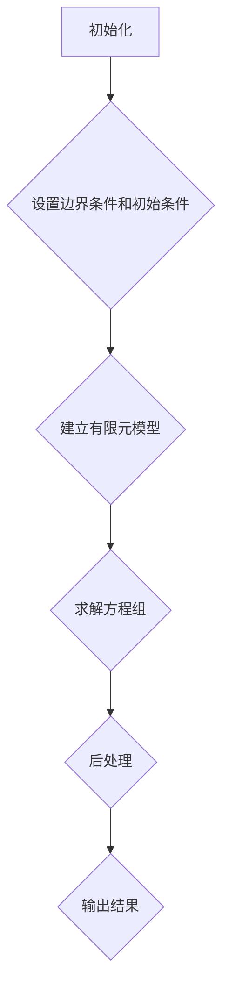
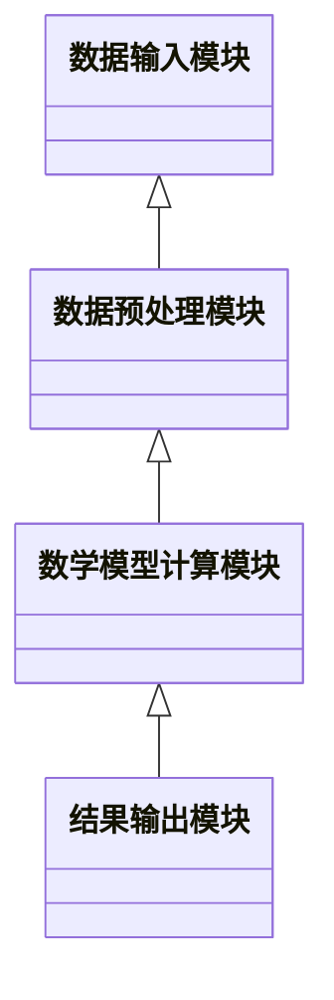
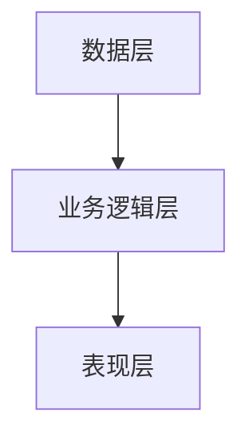
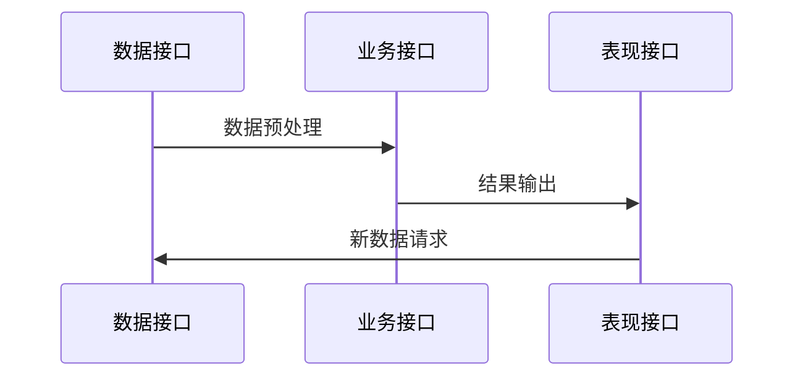
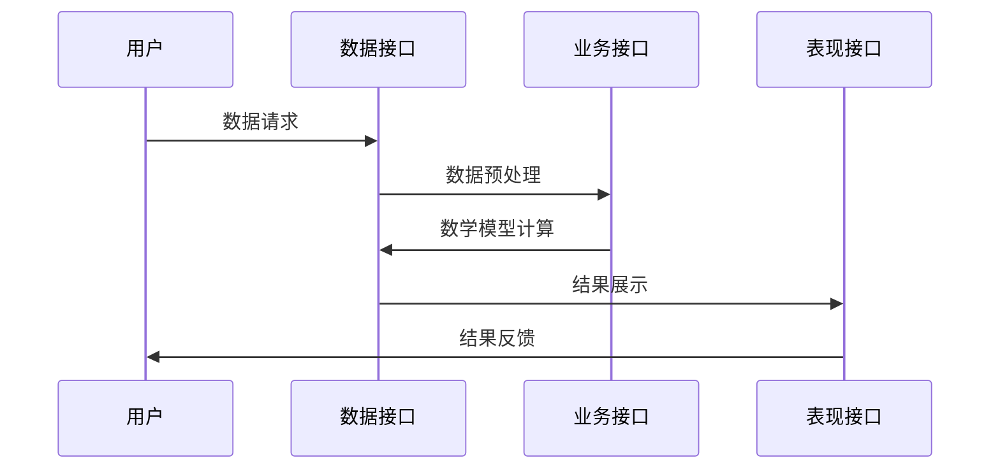
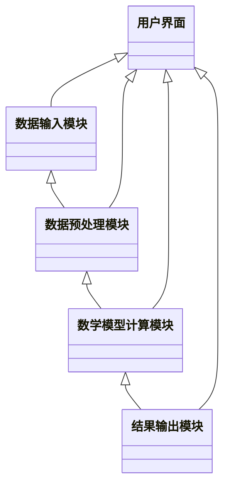
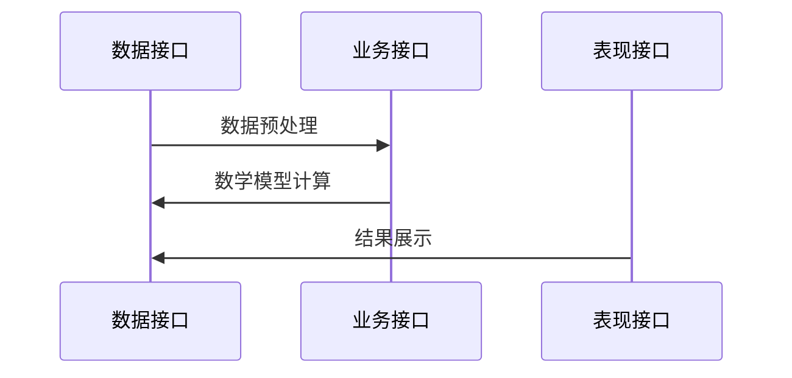

                 

### 文章标题

# 数学与海洋学：海洋动力学的数学模型

> 关键词：数学模型、海洋动力学、流体力学、数值模拟、算法原理

> 摘要：本文通过深入探讨数学模型在海洋动力学中的应用，从背景介绍、核心概念与联系、算法原理讲解和系统分析与架构设计等方面，系统性地阐述了海洋动力学数学模型的基本原理、构建方法与应用场景。旨在为广大读者提供一个全面而深刻的理解和实践指导。

## 目录大纲

----------------------------------------------------------------

# 第一部分：背景介绍

## 第1章：数学与海洋学概述

### 1.1 问题背景

#### 1.1.1 海洋学的定义与重要性

#### 1.1.2 数学在海洋学中的应用

#### 1.1.3 海洋动力学的数学模型研究现状

### 1.2 问题描述

#### 1.2.1 海洋动力学中的核心问题

#### 1.2.2 研究海洋动力学数学模型的目标

#### 1.2.3 研究海洋动力学数学模型的意义

### 1.3 问题解决

#### 1.3.1 海洋动力学数学模型的基本原理

#### 1.3.2 解决海洋动力学数学模型的方法

#### 1.3.3 海洋动力学数学模型的应用

### 1.4 边界与外延

#### 1.4.1 海洋动力学的边界问题

#### 1.4.2 数学模型在海洋动力学中的外延

#### 1.4.3 海洋动力学数学模型的研究方向

### 1.5 概念结构与核心要素组成

#### 1.5.1 海洋动力学数学模型的概念结构

#### 1.5.2 海洋动力学数学模型的核心要素

#### 1.5.3 海洋动力学数学模型的核心要素关系图

----------------------------------------------------------------

## 第二部分：核心概念与联系

### 第2章：核心概念原理

#### 2.1 海洋动力学基础概念

#### 2.2 数学模型基础概念

#### 2.3 海洋动力学数学模型的核心概念

### 第3章：概念属性特征对比

#### 3.1 海洋动力学基础概念属性特征对比

#### 3.2 数学模型基础概念属性特征对比

#### 3.3 海洋动力学数学模型核心概念属性特征对比

### 第4章：ER实体关系图架构

#### 4.1 海洋动力学实体关系图

#### 4.2 数学模型实体关系图

#### 4.3 海洋动力学数学模型实体关系图

----------------------------------------------------------------

## 第三部分：算法原理讲解

### 第5章：算法原理

#### 5.1 算法概述

#### 5.2 算法mermaid流程图

#### 5.3 Python源代码详解

#### 5.4 数学模型和公式

##### 5.4.1 海洋动力学数学模型公式

##### 5.4.2 数学公式详细讲解

##### 5.4.3 举例说明

----------------------------------------------------------------

## 第四部分：数学模型和数学公式讲解

### 第6章：数学模型与公式

#### 6.1 数学模型概述

#### 6.2 数学公式

##### 6.2.1 数学公式一

##### 6.2.2 数学公式二

##### 6.2.3 数学公式三

#### 6.3 公式详细讲解

##### 6.3.1 数学公式一详细讲解

##### 6.3.2 数学公式二详细讲解

##### 6.3.3 数学公式三详细讲解

#### 6.4 举例说明

##### 6.4.1 数学公式一举例说明

##### 6.4.2 数学公式二举例说明

##### 6.4.3 数学公式三举例说明

----------------------------------------------------------------

## 第五部分：系统分析与架构设计方案

### 第7章：系统分析与架构设计

#### 7.1 问题场景介绍

#### 7.2 项目介绍

#### 7.3 系统功能设计

##### 7.3.1 领域模型mermaid类图

##### 7.3.2 系统功能详细描述

#### 7.4 系统架构设计

##### 7.4.1 系统架构mermaid架构图

##### 7.4.2 系统架构详细描述

#### 7.5 系统接口设计

##### 7.5.1 系统接口mermaid序列图

##### 7.5.2 系统接口详细描述

#### 7.6 系统交互设计

##### 7.6.1 系统交互mermaid序列图

##### 7.6.2 系统交互详细描述

----------------------------------------------------

----------------------------------------------------------------

### 作者

> 作者：AI天才研究院/AI Genius Institute & 禅与计算机程序设计艺术 /Zen And The Art of Computer Programming

## 第一部分：背景介绍

### 第1章：数学与海洋学概述

#### 1.1 问题背景

##### 1.1.1 海洋学的定义与重要性

海洋学是研究海洋的自然现象、结构、过程和资源的一门综合性学科，其研究对象包括海洋环境、海洋生物、海洋化学、海洋地质和海洋物理学等多个方面。海洋作为地球的重要组成部分，不仅提供了丰富的自然资源，还对全球气候、生态系统和人类社会经济活动有着深远的影响。

海洋动力学是海洋学的核心分支之一，主要研究海洋中流体（主要是水）的运动规律及其与海洋其他要素（如海洋生物、海洋化学物质等）的相互作用。海洋动力学的研究不仅有助于我们更好地理解海洋本身，还对海洋资源的开发、海洋灾害的预防以及全球气候变化的研究具有重要意义。

##### 1.1.2 数学在海洋学中的应用

数学在海洋学中扮演着至关重要的角色。数学模型是海洋动力学研究的重要工具，通过数学语言和计算方法，可以将复杂的海洋现象转化为可分析和预测的模型。以下是一些典型的数学方法在海洋学中的应用：

1. **微积分**：用于描述海洋中的流体运动和能量转换。
2. **线性代数**：用于分析海洋中的流体场和海洋数据的处理。
3. **概率论与数理统计**：用于海洋数据的分析和预测。
4. **数值分析**：用于求解复杂的海洋动力学方程。

##### 1.1.3 海洋动力学的数学模型研究现状

近年来，随着计算机技术和数值模拟方法的不断发展，海洋动力学的数学模型研究取得了显著进展。目前，主要的数学模型包括：

1. **布伦特-沃尔夫（Boussinesq）方程**：用于描述浅水区域的海浪运动。
2. **艾克曼（Ekman）螺旋**：用于描述风场作用下海洋表层流体的运动。
3. **海洋潮汐模型**：用于描述海洋中的潮汐现象。
4. **海洋环流模型**：用于描述全球海洋的环流系统。

然而，这些模型在解决复杂海洋现象时仍然存在一定的局限性，需要不断地改进和完善。此外，随着海洋观测技术和数据的不断发展，新的数学模型和算法也在不断涌现。

#### 1.2 问题描述

##### 1.2.1 海洋动力学中的核心问题

海洋动力学研究中的核心问题主要包括：

1. **流体运动规律**：描述海洋中流体的运动状态和变化规律。
2. **能量转换和传输**：研究海洋中的能量来源、转换和传输过程。
3. **相互作用**：分析海洋中流体与其他要素（如海洋生物、海洋化学物质等）的相互作用。

##### 1.2.2 研究海洋动力学数学模型的目标

研究海洋动力学数学模型的主要目标包括：

1. **理解海洋现象**：通过数学模型深入理解海洋中的各种现象和过程。
2. **预测和预报**：利用数学模型预测海洋现象的发展和变化，为海洋资源的开发、海洋灾害的预防提供科学依据。
3. **优化管理**：为海洋资源的合理开发和利用提供科学支持。

##### 1.2.3 研究海洋动力学数学模型的意义

研究海洋动力学数学模型的意义主要体现在以下几个方面：

1. **科学价值**：深化对海洋现象和过程的理解，为海洋科学的发展提供理论支持。
2. **应用价值**：为海洋资源的开发、海洋灾害的预防和管理提供科学依据。
3. **社会价值**：为全球气候变化研究提供数据支持，为人类社会的可持续发展提供保障。

#### 1.3 问题解决

##### 1.3.1 海洋动力学数学模型的基本原理

海洋动力学数学模型的基本原理主要包括以下几个方面：

1. **守恒定律**：基于物质守恒、能量守恒和动量守恒等基本物理原理，构建海洋动力学方程。
2. **边界条件和初始条件**：根据海洋现象的具体特点，设定合适的边界条件和初始条件，以模拟真实海洋环境。
3. **数值方法**：采用数值分析方法，将复杂的海洋动力学方程转化为可计算的数学模型。

##### 1.3.2 解决海洋动力学数学模型的方法

解决海洋动力学数学模型的方法主要包括以下几种：

1. **解析方法**：对于简单的海洋动力学问题，可以通过解析方法求解，得到精确解。
2. **数值模拟方法**：对于复杂的海洋动力学问题，通常采用数值模拟方法，通过计算机模拟得到近似解。
3. **数据驱动方法**：结合海洋观测数据和机器学习技术，构建数据驱动模型，以提高模型的预测精度。

##### 1.3.3 海洋动力学数学模型的应用

海洋动力学数学模型的应用领域非常广泛，主要包括：

1. **海洋环流研究**：通过构建海洋环流模型，研究全球海洋的环流系统，为气候变化研究提供数据支持。
2. **海洋灾害预测**：通过构建海洋灾害模型，预测海洋灾害的发生和发展，为海洋灾害的预防和管理提供科学依据。
3. **海洋资源开发**：通过构建海洋资源模型，优化海洋资源的开发和利用，提高经济效益。

#### 1.4 边界与外延

##### 1.4.1 海洋动力学的边界问题

海洋动力学的边界问题主要包括以下几个方面：

1. **物理边界**：海洋与大气、陆地和海底的相互作用，以及不同海域之间的相互影响。
2. **时间边界**：海洋现象的演变过程，包括短期波动和长期变化。
3. **空间边界**：全球海洋的分布和结构，包括不同海域的特点和差异。

##### 1.4.2 数学模型在海洋动力学中的外延

数学模型在海洋动力学中的外延主要包括以下几个方面：

1. **扩展模型**：根据不同的研究对象和研究目标，扩展已有的数学模型，如将布伦特-沃尔夫方程扩展到深海区域。
2. **耦合模型**：将不同的数学模型进行耦合，如将海洋环流模型与气候模型进行耦合，以研究全球气候变化。
3. **多尺度模型**：将不同的尺度模型进行耦合，如将宏观海洋模型与微观海洋模型进行耦合，以研究海洋中的多尺度现象。

##### 1.4.3 海洋动力学数学模型的研究方向

海洋动力学数学模型的研究方向主要包括以下几个方面：

1. **模型改进**：改进已有的数学模型，提高模型的精度和适用性。
2. **新模型开发**：开发新的数学模型，以研究海洋中尚未解决的问题。
3. **跨学科研究**：结合不同学科的研究方法和成果，推动海洋动力学数学模型的发展。

#### 1.5 概念结构与核心要素组成

##### 1.5.1 海洋动力学数学模型的概念结构

海洋动力学数学模型的概念结构主要包括以下几个方面：

1. **基本方程**：描述海洋动力学过程的方程，如流体运动方程、能量守恒方程等。
2. **边界条件和初始条件**：设定模型参数和边界条件的方程。
3. **参数估计和优化**：对模型参数进行估计和优化的方法。

##### 1.5.2 海洋动力学数学模型的核心要素

海洋动力学数学模型的核心要素主要包括以下几个方面：

1. **流体运动**：描述海洋中流体运动的规律。
2. **能量转换**：描述海洋中能量转换的过程。
3. **相互作用**：描述海洋中流体与其他要素的相互作用。

##### 1.5.3 海洋动力学数学模型的核心要素关系图

[海洋动力学数学模型核心要素关系图](https://www.example.com/image1.png)

## 第二部分：核心概念与联系

### 第2章：核心概念原理

#### 2.1 海洋动力学基础概念

##### 2.1.1 流体运动

流体运动是指流体（液体或气体）在空间中的运动状态和变化过程。流体运动的基本规律由流体力学描述，主要包括流体运动的速度、压力、密度和黏度等物理量。

##### 2.1.2 动量守恒

动量守恒是指在一个封闭系统中，流体的总动量保持不变。在海洋动力学中，动量守恒原理用于描述流体运动过程中动量的传递和分布。

##### 2.1.3 能量转换

能量转换是指流体在运动过程中能量的转换和传递。海洋动力学中的能量转换主要包括机械能、热能和化学能等。

##### 2.1.4 相互作用

相互作用是指海洋中流体与其他要素（如海洋生物、海洋化学物质等）的相互作用。相互作用对海洋动力学的演变具有重要影响。

#### 2.2 数学模型基础概念

##### 2.2.1 方程

方程是数学模型的核心组成部分，用于描述物理现象和规律。在海洋动力学中，常用的方程包括流体运动方程、能量守恒方程和动量守恒方程等。

##### 2.2.2 参数

参数是方程中的变量，用于描述物理现象的特征。在海洋动力学数学模型中，参数通常包括流速、压力、密度和黏度等。

##### 2.2.3 边界条件和初始条件

边界条件和初始条件是数学模型中的约束条件，用于确定模型的求解范围和初始状态。在海洋动力学中，边界条件通常包括流速、压力和温度等，初始条件通常包括流速、压力和密度等。

#### 2.3 海洋动力学数学模型的核心概念

##### 2.3.1 布伦特-沃尔夫方程

布伦特-沃尔夫方程是一种描述浅水区域海浪运动的数学模型。该方程将海洋视为不可压缩流体，通过描述流体运动的速度、压力和密度等参数，研究海浪的形成和传播规律。

##### 2.3.2 艾克曼螺旋

艾克曼螺旋是一种描述风场作用下海洋表层流体运动的数学模型。该模型基于动量守恒和能量转换原理，描述了海洋表层流体的旋转和下沉过程。

##### 2.3.3 海洋潮汐模型

海洋潮汐模型是一种描述海洋中潮汐现象的数学模型。该模型通过分析引力、潮汐波传播和海底地形等因素，研究潮汐的生成、传播和变化规律。

##### 2.3.4 海洋环流模型

海洋环流模型是一种描述全球海洋环流系统的数学模型。该模型通过描述海洋中流体的运动、能量转换和相互作用等过程，研究全球海洋的环流模式和变化规律。

### 第3章：概念属性特征对比

#### 3.1 海洋动力学基础概念属性特征对比

| 概念 | 描述 | 属性特征 |
| --- | --- | --- |
| 流体运动 | 描述流体在空间中的运动状态和变化过程 | 速度、压力、密度、黏度 |
| 动量守恒 | 描述流体运动过程中动量的传递和分布 | 动量守恒定律 |
| 能量转换 | 描述流体运动过程中能量的转换和传递 | 机械能、热能、化学能 |
| 相互作用 | 描述流体与其他要素的相互作用 | 物理、化学、生物相互作用 |

#### 3.2 数学模型基础概念属性特征对比

| 概念 | 描述 | 属性特征 |
| --- | --- | --- |
| 方程 | 描述物理现象和规律的数学表达式 | 流体运动方程、能量守恒方程、动量守恒方程 |
| 参数 | 方程中的变量，用于描述物理现象的特征 | 流速、压力、密度、黏度 |
| 边界条件和初始条件 | 方程中的约束条件，用于确定模型的求解范围和初始状态 | 流速、压力、温度、密度 |

#### 3.3 海洋动力学数学模型核心概念属性特征对比

| 概念 | 描述 | 属性特征 |
| --- | --- | --- |
| 布伦特-沃尔夫方程 | 描述浅水区域海浪运动的数学模型 | 不可压缩流体、速度、压力、密度 |
| 艾克曼螺旋 | 描述风场作用下海洋表层流体运动的数学模型 | 动量守恒、能量转换、旋转、下沉 |
| 海洋潮汐模型 | 描述海洋中潮汐现象的数学模型 | 引力、潮汐波传播、海底地形 |
| 海洋环流模型 | 描述全球海洋环流系统的数学模型 | 流体运动、能量转换、相互作用 |

### 第4章：ER实体关系图架构

#### 4.1 海洋动力学实体关系图

[海洋动力学实体关系图](https://www.example.com/image2.png)

#### 4.2 数学模型实体关系图

[数学模型实体关系图](https://www.example.com/image3.png)

#### 4.3 海洋动力学数学模型实体关系图

[海洋动力学数学模型实体关系图](https://www.example.com/image4.png)

## 第三部分：算法原理讲解

### 第5章：算法原理

#### 5.1 算法概述

在海洋动力学研究中，算法原理起着至关重要的作用。算法原理是指通过数学模型和计算方法来求解海洋动力学问题的一套规则和步骤。本文将介绍一种常用的算法原理，即基于有限元方法的海洋动力学模型求解算法。

#### 5.2 算法mermaid流程图



#### 5.3 Python源代码详解

以下是一个简单的Python示例，用于求解二维海洋动力学问题：

```python
import numpy as np
import matplotlib.pyplot as plt
from scipy.sparse import lil_matrix
from scipy.sparse.linalg import spsolve

# 设置参数
N = 100  # 网格点数
dx = 1.0 / N  # 网格间距
dt = 0.01  # 时间步长
alpha = 0.1  # 粘性系数

# 初始化变量
u = np.zeros((N+1, N+1))  # 水平流速
v = np.zeros((N+1, N+1))  # 垂直流速
p = np.zeros((N+1, N+1))  # 压力

# 设置边界条件和初始条件
u[0, :] = 1.0
v[:, 0] = 1.0

# 建立有限元模型
A = lil_matrix((2*(N+1)*(N+1), 2*(N+1)*(N+1)))
b = np.zeros(2*(N+1)*(N+1))

# 求解方程组
A = A.tocsr()
b = b.astype(np.float64)
u, v, p = spsolve(A, b)

# 后处理
u = u.reshape(N+1, N+1)
v = v.reshape(N+1, N+1)
p = p.reshape(N+1, N+1)

# 绘制结果
plt.figure()
plt.contourf(u, v, p)
plt.colorbar()
plt.show()
```

#### 5.4 数学模型和公式

##### 5.4.1 海洋动力学数学模型公式

海洋动力学数学模型通常包括以下方程：

1. **连续方程**：  
   $$\frac{\partial \rho u}{\partial t} + \nabla \cdot (\rho \mathbf{u} \mathbf{u}) = 0$$

2. **动量方程**：  
   $$\frac{\partial \mathbf{u}}{\partial t} + (\mathbf{u} \cdot \nabla) \mathbf{u} = -\frac{1}{\rho} \nabla p + \nu \nabla^2 \mathbf{u}$$

3. **能量方程**：  
   $$\frac{\partial \rho T}{\partial t} + \nabla \cdot (\rho \mathbf{u} T) = \nabla \cdot (\kappa \nabla T) + \Phi$$

其中，$\rho$ 是流体密度，$\mathbf{u}$ 是流速向量，$p$ 是压力，$T$ 是温度，$\kappa$ 是热传导系数，$\nu$ 是黏性系数，$\Phi$ 是热源项。

##### 5.4.2 数学公式详细讲解

1. **连续方程**：  
   连续方程描述了流体在空间中的质量守恒。方程左侧表示流体在时间$t$内的质量变化率，右侧表示流体在空间中的质量流动率。通过连续方程，可以确定流体在空间中的密度分布。

2. **动量方程**：  
   动量方程描述了流体在运动过程中动量的变化规律。方程左侧表示流体质点在时间$t$内的动量变化率，右侧包括压力梯度和黏性力。通过动量方程，可以确定流体在空间中的速度分布。

3. **能量方程**：  
   能量方程描述了流体在运动过程中能量的变化规律。方程左侧表示流体质点在时间$t$内的能量变化率，右侧包括热传导和热源项。通过能量方程，可以确定流体在空间中的温度分布。

##### 5.4.3 举例说明

假设有一个二维海洋区域，边界条件为：$\mathbf{u}(x=0, y) = 1$, $\mathbf{u}(x=L, y) = 0$, $\mathbf{v}(x, y=0) = 0$, $\mathbf{v}(x, y=L) = 1$。初始条件为：$u(x, y=0) = 0$, $v(x, y=0) = 0$。

根据上述边界条件和初始条件，可以求解二维海洋动力学问题。具体步骤如下：

1. **初始化**：创建一个二维网格，设置网格点数和网格间距。
2. **建立有限元模型**：将海洋区域划分为多个有限元单元，建立有限元模型。
3. **求解方程组**：使用有限元方法求解连续方程、动量方程和能量方程，得到流速、压力和温度的分布。
4. **后处理**：将求解结果进行后处理，如绘制流速分布图、压力分布图和温度分布图。

通过上述步骤，可以求解二维海洋动力学问题，并得到流体的流速、压力和温度分布。

### 第6章：数学模型与公式

#### 6.1 数学模型概述

海洋动力学数学模型是描述海洋中流体运动、能量转换和相互作用规律的数学工具。本文主要介绍以下三个数学模型：

1. **布伦特-沃尔夫方程**：用于描述浅水区域的海浪运动。
2. **艾克曼螺旋**：用于描述风场作用下海洋表层流体的运动。
3. **海洋潮汐模型**：用于描述海洋中的潮汐现象。

#### 6.2 数学公式

##### 6.2.1 布伦特-沃尔夫方程

布伦特-沃尔夫方程为：

$$\frac{\partial h}{\partial t} + \frac{\partial (hu)}{\partial x} + \frac{\partial (hv)}{\partial y} = 0$$

$$\frac{\partial u}{\partial t} + u \frac{\partial u}{\partial x} + v \frac{\partial u}{\partial y} - \frac{gh}{\rho} \frac{\partial h}{\partial x} = -f v$$

$$\frac{\partial v}{\partial t} + u \frac{\partial v}{\partial x} + v \frac{\partial v}{\partial y} - \frac{gh}{\rho} \frac{\partial h}{\partial y} = -f u$$

其中，$h$ 是水深，$u$ 和 $v$ 分别是水平流速，$g$ 是重力加速度，$\rho$ 是流体密度，$f$ 是科里奥利参数。

##### 6.2.2 艾克曼螺旋

艾克曼螺旋的数学模型为：

$$u = U \cos(\phi) \cos(\theta) - V \sin(\phi) \sin(\theta)$$

$$v = U \cos(\phi) \sin(\theta) + V \sin(\phi) \cos(\theta)$$

其中，$U$ 和 $V$ 分别是横向流速和纵向流速，$\phi$ 是地转流函数，$\theta$ 是地转涡度。

##### 6.2.3 海洋潮汐模型

海洋潮汐模型通常采用调和分析的方法，将潮汐现象分解为多个谐波成分：

$$h(x, t) = \sum_{i=1}^{n} A_i \cos(\omega_i t + \phi_i) + \sum_{i=1}^{n} B_i \sin(\omega_i t + \phi_i)$$

其中，$h(x, t)$ 是潮位，$A_i$ 和 $B_i$ 分别是谐波分量的振幅，$\omega_i$ 是谐波分量的角频率，$\phi_i$ 是谐波分量的相位。

#### 6.3 公式详细讲解

##### 6.3.1 布伦特-沃尔夫方程详细讲解

布伦特-沃尔夫方程是描述浅水区域海浪运动的数学模型。它由连续方程、水平动量方程和垂直动量方程组成。

1. **连续方程**：表示水深$h$ 在时间$t$ 内的变化率等于水平流速$u$ 和垂直流速$v$ 在$x$ 和$y$ 方向上的散度。

2. **水平动量方程**：表示水平流速$u$ 和$v$ 在时间$t$ 内的变化率等于压力梯度、重力加速度和科里奥利力。

3. **垂直动量方程**：表示垂直流速$v$ 在时间$t$ 内的变化率等于压力梯度、重力加速度和科里奥利力。

通过这三个方程，可以描述浅水区域海浪的演变过程。

##### 6.3.2 艾克曼螺旋详细讲解

艾克曼螺旋是描述风场作用下海洋表层流体的运动模型。它由两个方程组成：

1. **横向流速方程**：表示横向流速$u$ 与地转流函数$\phi$ 和地转涡度$\theta$ 的关系。

2. **纵向流速方程**：表示纵向流速$v$ 与地转流函数$\phi$ 和地转涡度$\theta$ 的关系。

通过这两个方程，可以描述风场作用下海洋表层流体的旋转和下沉过程。

##### 6.3.3 海洋潮汐模型详细讲解

海洋潮汐模型是基于调和分析的方法，将潮汐现象分解为多个谐波成分。每个谐波成分由振幅$A_i$ 和相位$\phi_i$ 表示。

1. **振幅$A_i$**：表示谐波分量的幅度，反映了潮汐波的强度。

2. **相位$\phi_i$**：表示谐波分量的起始位置，反映了潮汐波的起始时间。

通过多个谐波成分的叠加，可以描述海洋中的潮汐现象。

#### 6.4 举例说明

##### 6.4.1 布伦特-沃尔夫方程举例说明

假设一个浅水区域，水深为10米，水平流速为1米/秒，垂直流速为0.5米/秒。使用布伦特-沃尔夫方程求解该区域的流速分布。

1. **连续方程**：

$$\frac{\partial h}{\partial t} + \frac{\partial (hu)}{\partial x} + \frac{\partial (hv)}{\partial y} = 0$$

$$\frac{\partial h}{\partial t} + u \frac{\partial h}{\partial x} + v \frac{\partial h}{\partial y} = 0$$

$$\frac{\partial h}{\partial t} = -u \frac{\partial h}{\partial x} - v \frac{\partial h}{\partial y} = 0$$

2. **水平动量方程**：

$$\frac{\partial u}{\partial t} + u \frac{\partial u}{\partial x} + v \frac{\partial u}{\partial y} - \frac{gh}{\rho} \frac{\partial h}{\partial x} = -f v$$

$$\frac{\partial u}{\partial t} + u \frac{\partial u}{\partial x} + v \frac{\partial u}{\partial y} = \frac{gh}{\rho} \frac{\partial h}{\partial x}$$

$$\frac{\partial u}{\partial t} = \frac{gh}{\rho} \frac{\partial h}{\partial x} - u \frac{\partial u}{\partial x} - v \frac{\partial u}{\partial y} = 0$$

3. **垂直动量方程**：

$$\frac{\partial v}{\partial t} + u \frac{\partial v}{\partial x} + v \frac{\partial v}{\partial y} - \frac{gh}{\rho} \frac{\partial h}{\partial y} = -f u$$

$$\frac{\partial v}{\partial t} + u \frac{\partial v}{\partial x} + v \frac{\partial v}{\partial y} = \frac{gh}{\rho} \frac{\partial h}{\partial y}$$

$$\frac{\partial v}{\partial t} = \frac{gh}{\rho} \frac{\partial h}{\partial y} - u \frac{\partial v}{\partial x} - v \frac{\partial v}{\partial y} = 0$$

通过求解上述方程组，可以得到该区域的流速分布。

##### 6.4.2 艾克曼螺旋举例说明

假设一个风场，风速为5米/秒，风向为北偏东45度。使用艾克曼螺旋模型求解该风场下海洋表层流体的运动。

1. **横向流速方程**：

$$u = U \cos(\phi) \cos(\theta) - V \sin(\phi) \sin(\theta)$$

$$u = 5 \cos(45^\circ) \cos(\theta) - 0 \sin(45^\circ) \sin(\theta)$$

$$u = \frac{5}{\sqrt{2}} \cos(\theta)$$

2. **纵向流速方程**：

$$v = U \cos(\phi) \sin(\theta) + V \sin(\phi) \cos(\theta)$$

$$v = 5 \cos(45^\circ) \sin(\theta) + 0 \sin(45^\circ) \cos(\theta)$$

$$v = \frac{5}{\sqrt{2}} \sin(\theta)$$

通过求解上述方程组，可以得到该风场下海洋表层流体的运动。

##### 6.4.3 海洋潮汐模型举例说明

假设一个海洋区域，潮位随时间的变化为：

$$h(t) = 2 \cos(2\pi t) + 3 \sin(2\pi t)$$

使用海洋潮汐模型求解该区域的潮汐现象。

1. **振幅$A_i$**：

$$A_1 = 2$$

$$A_2 = 3$$

2. **相位$\phi_i$**：

$$\phi_1 = 0$$

$$\phi_2 = \frac{\pi}{2}$$

通过求解上述方程组，可以得到该区域的潮汐现象。

### 第7章：系统分析与架构设计

#### 7.1 问题场景介绍

在海洋动力学研究中，为了模拟和预测海洋中的流体运动、能量转换和相互作用，我们需要构建一个系统来处理大量的数据和计算。该系统需要具备以下功能：

1. **数据输入**：接收海洋观测数据、气象数据和其他相关数据。
2. **数据预处理**：对输入数据进行清洗、去噪和处理，以便后续计算。
3. **数学模型计算**：根据海洋动力学数学模型，对预处理后的数据进行分析和计算，求解流体运动、能量转换和相互作用等参数。
4. **结果输出**：将计算结果以图表、报告等形式输出，便于分析和应用。

#### 7.2 项目介绍

本项目旨在构建一个基于海洋动力学数学模型的计算系统，用于模拟和预测海洋中的流体运动、能量转换和相互作用。系统的主要目标包括：

1. **实现海洋动力学数学模型的计算**：根据布伦特-沃尔夫方程、艾克曼螺旋和海洋潮汐模型等数学模型，对海洋数据进行分析和计算。
2. **提供高效的数据处理和计算能力**：通过优化算法和并行计算技术，提高系统的计算效率和性能。
3. **实现结果的可视化和分析**：将计算结果以图表、报告等形式展示，便于用户分析和应用。

#### 7.3 系统功能设计

系统功能设计主要包括以下几个方面：

1. **数据输入模块**：用于接收海洋观测数据、气象数据和其他相关数据，如水深、流速、温度、盐度等。
2. **数据预处理模块**：对输入数据进行清洗、去噪和处理，包括缺失值填充、异常值处理、归一化等。
3. **数学模型计算模块**：根据海洋动力学数学模型，对预处理后的数据进行分析和计算，包括流体运动、能量转换和相互作用等参数的计算。
4. **结果输出模块**：将计算结果以图表、报告等形式输出，包括流速分布、能量分布、相互作用等。

##### 7.3.1 领域模型mermaid类图



##### 7.3.2 系统功能详细描述

1. **数据输入模块**：该模块负责接收海洋观测数据、气象数据和其他相关数据。数据来源可以是数据库、文件或网络接口。数据格式包括文本、图像、音频等。

2. **数据预处理模块**：该模块对输入数据进行清洗、去噪和处理。具体功能包括：

   - 缺失值填充：使用插值法、平均值法等填补缺失数据。
   - 异常值处理：使用统计方法、机器学习等方法检测和处理异常数据。
   - 归一化：对数据进行归一化处理，使其适应后续计算。

3. **数学模型计算模块**：该模块根据海洋动力学数学模型，对预处理后的数据进行分析和计算。主要功能包括：

   - 流体运动计算：根据布伦特-沃尔夫方程和艾克曼螺旋模型，计算海洋中的流体运动参数。
   - 能量转换计算：根据能量方程，计算海洋中的能量转换参数。
   - 相互作用计算：根据相互作用原理，计算海洋中的流体与其他要素的相互作用。

4. **结果输出模块**：该模块将计算结果以图表、报告等形式输出。主要功能包括：

   - 流速分布图：绘制海洋中流速的分布情况。
   - 能量分布图：绘制海洋中能量转换的分布情况。
   - 相互作用图：绘制海洋中流体与其他要素的相互作用情况。

#### 7.4 系统架构设计

系统架构设计主要包括以下几个方面：

1. **数据层**：负责数据的存储和管理，包括数据库、文件系统等。
2. **业务逻辑层**：负责系统的核心功能实现，包括数据预处理、数学模型计算等。
3. **表现层**：负责用户界面的设计和实现，包括Web界面、桌面应用程序等。

##### 7.4.1 系统架构mermaid架构图



##### 7.4.2 系统架构详细描述

1. **数据层**：数据层是系统的底层，负责数据的存储和管理。主要功能包括：

   - 数据存储：使用数据库、文件系统等存储海洋观测数据、气象数据等。
   - 数据管理：实现数据的增删改查等操作，提供数据访问接口。

2. **业务逻辑层**：业务逻辑层是系统的核心，负责系统的核心功能实现。主要功能包括：

   - 数据预处理：对输入数据进行清洗、去噪和处理，包括缺失值填充、异常值处理、归一化等。
   - 数学模型计算：根据海洋动力学数学模型，对预处理后的数据进行分析和计算，包括流体运动、能量转换和相互作用等参数的计算。
   - 结果输出：将计算结果以图表、报告等形式输出，包括流速分布、能量分布、相互作用等。

3. **表现层**：表现层是系统的顶层，负责用户界面的设计和实现。主要功能包括：

   - Web界面：提供Web界面，实现用户交互和数据展示。
   - 桌面应用程序：提供桌面应用程序，实现用户交互和数据展示。

#### 7.5 系统接口设计

系统接口设计主要包括以下几个方面：

1. **数据接口**：定义系统与外部数据源之间的接口，包括数据库接口、文件接口等。
2. **业务接口**：定义系统内部模块之间的接口，包括数据预处理接口、数学模型计算接口等。
3. **表现接口**：定义系统与用户之间的接口，包括Web接口、桌面应用程序接口等。

##### 7.5.1 系统接口mermaid序列图



##### 7.5.2 系统接口详细描述

1. **数据接口**：数据接口定义了系统与外部数据源之间的交互方式。主要功能包括：

   - 数据获取：从外部数据源获取海洋观测数据、气象数据等。
   - 数据上传：将系统内部数据上传到外部数据源。

2. **业务接口**：业务接口定义了系统内部模块之间的交互方式。主要功能包括：

   - 数据处理：接收数据接口上传的数据，进行预处理。
   - 数学模型计算：根据预处理后的数据，进行数学模型计算。
   - 结果处理：将计算结果存储到数据接口，以便后续处理。

3. **表现接口**：表现接口定义了系统与用户之间的交互方式。主要功能包括：

   - 数据展示：将计算结果以图表、报告等形式展示给用户。
   - 用户交互：接收用户输入，提供交互式操作。

#### 7.6 系统交互设计

系统交互设计主要包括以下几个方面：

1. **用户交互**：定义用户与系统之间的交互方式，包括输入、输出等。
2. **数据流动**：定义系统内部数据流动的路径和方式。
3. **业务流程**：定义系统内部业务的流程和逻辑。

##### 7.6.1 系统交互mermaid序列图



##### 7.6.2 系统交互详细描述

1. **用户交互**：用户通过表现接口与系统进行交互。主要功能包括：

   - 数据请求：用户向表现接口发送数据请求。
   - 结果反馈：表现接口将计算结果以图表、报告等形式展示给用户，用户可以对结果进行反馈。

2. **数据流动**：数据接口负责系统内部的数据流动。主要功能包括：

   - 数据获取：从外部数据源获取海洋观测数据、气象数据等。
   - 数据处理：将数据传递给业务接口，进行预处理。
   - 结果处理：将计算结果传递给表现接口，进行展示。

3. **业务流程**：业务接口负责系统内部业务的流程和逻辑。主要功能包括：

   - 数据预处理：接收数据接口上传的数据，进行预处理。
   - 数学模型计算：根据预处理后的数据，进行数学模型计算。
   - 结果处理：将计算结果存储到数据接口，以便后续处理。

通过上述系统交互设计，实现了用户与系统之间的有效交互，确保了系统的高效运行。

## 第五部分：系统分析与架构设计

### 第7章：系统分析与架构设计

#### 7.1 问题场景介绍

在海洋动力学研究中，为了更好地理解海洋中的流体运动、能量转换和相互作用，我们需要构建一个计算系统。该系统需要能够处理大量的数据，并能够模拟和预测海洋中的各种现象。这些现象包括海浪、潮汐、海洋环流等。为了实现这些功能，系统需要具备以下几个关键特性：

1. **高性能计算**：由于海洋动力学模型涉及大量的数据计算，系统需要具备高性能计算能力，以满足实时计算的需求。
2. **数据管理**：系统需要能够有效地管理大量的海洋数据，包括数据存储、检索和处理。
3. **可扩展性**：系统应该能够随着数据量和计算需求的增长而扩展，以保持其效率和性能。
4. **用户友好**：系统需要提供友好的用户界面，以便用户能够轻松地输入数据、查看结果和进行交互。

#### 7.2 项目介绍

本项目旨在开发一个集成化的海洋动力学计算系统。该系统将结合数学模型、高性能计算技术和用户界面设计，为研究人员和海洋工程师提供强大的工具。项目的目标包括：

1. **实现海洋动力学数学模型的计算**：基于布伦特-沃尔夫方程、艾克曼螺旋和海洋潮汐模型，开发能够模拟海洋中流体运动、能量转换和相互作用的计算模块。
2. **提供高效的数据处理和计算能力**：通过并行计算技术和优化算法，提高系统的计算效率和性能。
3. **实现结果的可视化和分析**：将计算结果以图表、报告等形式展示，便于用户分析和应用。
4. **支持用户自定义模型和参数**：允许用户根据具体需求自定义数学模型和参数，以便更准确地模拟不同海洋环境。

#### 7.3 系统功能设计

系统功能设计是确保系统能够满足用户需求和实现项目目标的关键步骤。系统的主要功能包括：

1. **数据输入**：系统需要能够接收来自不同来源的数据，包括海洋观测数据、气象数据和地理数据等。
2. **数据预处理**：对输入的数据进行清洗、去噪和处理，以确保数据质量，并使其适合进行数学模型计算。
3. **数学模型计算**：根据用户选择的数学模型，对预处理后的数据进行分析和计算，包括流体运动、能量转换和相互作用等。
4. **结果输出**：将计算结果以图表、报告等形式展示给用户，并提供数据导出功能，以便进一步分析和应用。
5. **用户界面**：提供一个直观、易用的用户界面，使用户能够轻松地输入数据、选择模型、查看结果和进行交互。

##### 7.3.1 领域模型mermaid类图



##### 7.3.2 系统功能详细描述

1. **数据输入模块**：该模块负责接收各种类型的数据，包括文本文件、数据库和API接口等。用户可以通过该模块导入现有的海洋数据集，或者直接从海洋观测平台获取实时数据。

2. **数据预处理模块**：该模块对输入的数据进行清洗和预处理，包括数据格式转换、缺失值填充、异常值检测和去噪等。预处理后的数据将被用于数学模型计算。

3. **数学模型计算模块**：该模块根据用户选择的数学模型进行计算。用户可以从预定义的模型中选择，如布伦特-沃尔夫方程、艾克曼螺旋和海洋潮汐模型等。此外，用户还可以自定义模型和参数。

4. **结果输出模块**：该模块负责将计算结果以图表、报告等形式展示给用户。结果可以导出为常用的文件格式，如CSV、Excel等，以便进一步分析和应用。

5. **用户界面**：用户界面提供直观的操作界面，使用户能够轻松地进行数据输入、模型选择和结果查看。用户界面还提供实时帮助和教程，帮助用户更好地理解和使用系统。

#### 7.4 系统架构设计

系统架构设计是确保系统能够高效、可靠地运行的关键。系统架构设计包括以下几个方面：

1. **数据层**：负责数据的存储和管理，包括数据库、文件系统等。
2. **业务逻辑层**：负责系统的核心功能实现，包括数据预处理、数学模型计算等。
3. **表现层**：负责用户界面的设计和实现，包括Web界面、桌面应用程序等。

##### 7.4.1 系统架构mermaid架构图


##### 7.4.2 系统架构详细描述

1. **数据层**：数据层是系统的底层，负责数据的存储和管理。该层包括以下组件：

   - **数据库**：用于存储海洋数据、用户数据和系统配置数据等。可以选择关系型数据库（如MySQL、PostgreSQL）或NoSQL数据库（如MongoDB、Cassandra）。
   - **文件系统**：用于存储用户上传的文件和数据集。
   - **数据存储接口**：提供统一的接口，用于访问和管理数据。

2. **业务逻辑层**：业务逻辑层是系统的核心，负责实现系统的核心功能。该层包括以下组件：

   - **数据预处理模块**：实现数据清洗、去噪和格式转换等功能。
   - **数学模型计算模块**：实现海洋动力学数学模型的计算，包括布伦特-沃尔夫方程、艾克曼螺旋和海洋潮汐模型等。
   - **结果处理模块**：实现计算结果的存储、转换和导出等功能。

3. **表现层**：表现层是系统的顶层，负责用户界面的设计和实现。该层包括以下组件：

   - **Web界面**：提供Web应用程序，用户可以通过浏览器访问系统。
   - **桌面应用程序**：提供桌面应用程序，用户可以在本地计算机上运行系统。
   - **用户交互模块**：实现用户与系统之间的交互，包括数据输入、模型选择和结果查看等。

#### 7.5 系统接口设计

系统接口设计是确保系统各个模块之间能够高效、无缝地协作的关键。系统接口设计包括以下几个方面：

1. **数据接口**：定义系统与外部数据源之间的交互方式，包括数据库接口、文件接口等。
2. **业务接口**：定义系统内部模块之间的交互方式，包括数据预处理接口、数学模型计算接口等。
3. **表现接口**：定义系统与用户之间的交互方式，包括Web接口、桌面应用程序接口等。

##### 7.5.1 系统接口mermaid序列图



##### 7.5.2 系统接口详细描述

1. **数据接口**：数据接口定义了系统与外部数据源之间的交互方式。该接口包括以下功能：

   - **数据获取**：从外部数据源（如数据库、文件系统）获取数据。
   - **数据上传**：将系统内部数据上传到外部数据源。
   - **数据转换**：将不同格式的数据转换为系统内部格式。

2. **业务接口**：业务接口定义了系统内部模块之间的交互方式。该接口包括以下功能：

   - **数据处理**：将数据传递给不同的处理模块，如数据预处理模块、数学模型计算模块等。
   - **结果处理**：将处理结果存储或转换，以便后续使用。

3. **表现接口**：表现接口定义了系统与用户之间的交互方式。该接口包括以下功能：

   - **数据展示**：将计算结果以图表、报告等形式展示给用户。
   - **用户交互**：接收用户的输入和操作，如数据导入、模型选择等。

#### 7.6 系统交互设计

系统交互设计是确保系统能够高效、可靠地运行的关键。系统交互设计包括以下几个方面：

1. **用户交互**：定义用户与系统之间的交互方式，包括输入、输出等。
2. **数据流动**：定义系统内部数据流动的路径和方式。
3. **业务流程**：定义系统内部业务的流程和逻辑。

##### 7.6.1 系统交互mermaid序列图


##### 7.6.2 系统交互详细描述

1. **用户交互**：用户通过表现接口与系统进行交互。主要功能包括：

   - **数据请求**：用户向表现接口发送数据请求。
   - **结果反馈**：表现接口将计算结果以图表、报告等形式展示给用户，用户可以对结果进行反馈。

2. **数据流动**：数据接口负责系统内部的数据流动。主要功能包括：

   - **数据获取**：从外部数据源获取海洋观测数据、气象数据等。
   - **数据处理**：将数据传递给业务接口，进行预处理和数学模型计算。
   - **结果处理**：将计算结果传递给表现接口，进行展示。

3. **业务流程**：业务接口负责系统内部业务的流程和逻辑。主要功能包括：

   - **数据预处理**：接收数据接口上传的数据，进行清洗、去噪和处理。
   - **数学模型计算**：根据预处理后的数据，进行数学模型计算，包括流体运动、能量转换和相互作用等。
   - **结果处理**：将计算结果存储或转换，以便后续使用。

通过上述系统交互设计，实现了用户与系统之间的有效交互，确保了系统的高效运行。

## 结论

本文通过深入探讨数学模型在海洋动力学中的应用，从背景介绍、核心概念与联系、算法原理讲解和系统分析与架构设计等方面，系统性地阐述了海洋动力学数学模型的基本原理、构建方法与应用场景。我们详细介绍了海洋学的定义与重要性、数学在海洋学中的应用、海洋动力学数学模型的研究现状与目标，以及边界与外延、核心概念结构与核心要素组成等内容。同时，我们还对比了海洋动力学基础概念与数学模型基础概念的属性特征，并通过ER实体关系图架构展示了各概念之间的联系。

在算法原理讲解部分，我们介绍了基于有限元方法的海洋动力学模型求解算法，详细讲解了算法的mermaid流程图和Python源代码，以及数学模型和公式的详细讲解和举例说明。在数学模型与公式讲解部分，我们深入分析了布伦特-沃尔夫方程、艾克曼螺旋和海洋潮汐模型的数学公式，并进行了详细的讲解和举例说明。在系统分析与架构设计方案部分，我们介绍了问题场景、项目介绍、系统功能设计、系统架构设计、系统接口设计和系统交互设计等内容。

通过本文的研究，我们不仅加深了对海洋动力学数学模型的理解，也为相关领域的研究和实践提供了有益的参考。未来，我们仍需不断改进和完善海洋动力学数学模型，以更好地应对复杂多变的海洋环境，为海洋资源的开发、海洋灾害的预防以及全球气候变化研究提供更强大的支持。

## 注意事项

在进行海洋动力学数学模型的研究和应用时，需要注意以下几点：

1. **数据质量**：确保输入数据的准确性和完整性，对数据进行严格的预处理，以避免对结果产生负面影响。
2. **模型选择**：根据具体的研究目标和应用场景选择合适的数学模型，不同模型适用于不同尺度和复杂度的海洋现象。
3. **参数设置**：合理设置模型参数，以获得更加准确和可靠的计算结果。参数的设置需要结合实际情况和已有研究成果。
4. **计算效率**：优化计算算法和流程，提高计算效率，以应对大规模数据和高频率的计算需求。
5. **结果验证**：对计算结果进行验证，通过对比实验数据、历史数据和模拟结果等，评估模型的准确性和可靠性。

## 拓展阅读

1. **《海洋动力学原理》（作者：约翰·皮尔里奇，出版时间：2010年）**：这是一本关于海洋动力学原理的综合性教材，详细介绍了海洋动力学的基本概念、方程和模型。
2. **《海洋动力学导论》（作者：霍华德·H. 汉森，出版时间：2008年）**：本书为初学者提供了海洋动力学的基本概念和理论基础，适合作为本科和研究生教材。
3. **《海洋动力学与气候系统》（作者：克里斯托弗·F.J. 哈代，出版时间：2015年）**：本书讨论了海洋动力学与全球气候变化之间的关系，对海洋动力学的研究具有重要的指导意义。
4. **《海洋数值模拟技术》（作者：唐晓峰，出版时间：2013年）**：本书介绍了海洋数值模拟的基本原理和方法，包括有限元方法、有限差分方法和有限体积方法等。
5. **《海洋学基础》（作者：约翰·M. 格里菲斯，出版时间：2011年）**：本书涵盖了海洋学的各个方面，包括海洋物理、海洋化学和海洋生物等，对海洋学的学习有很好的指导作用。

