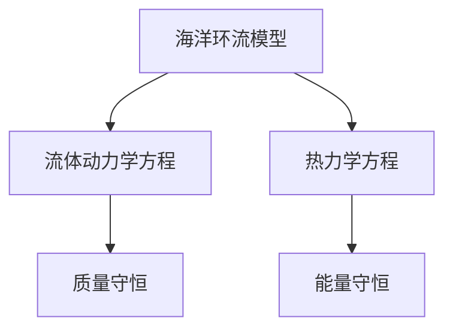
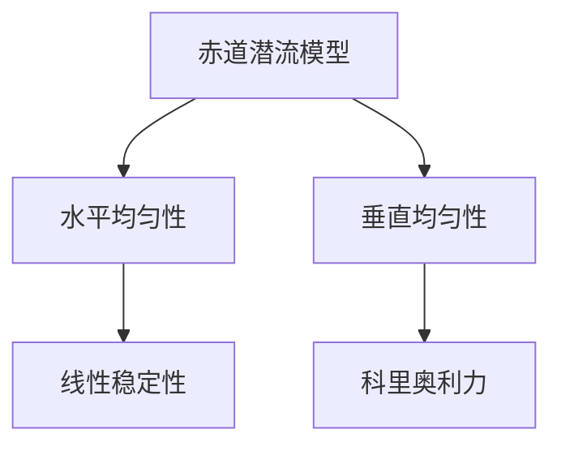
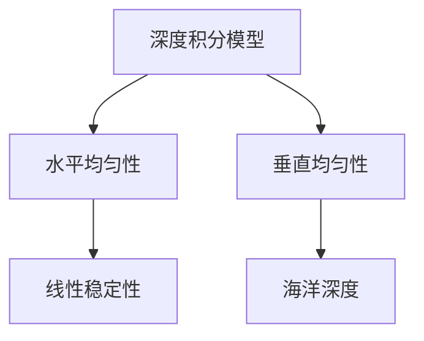

                 

### 数学与海洋学：海洋循环的数学描述

> 关键词：数学建模、海洋循环、流体动力学、热力学、赤道潜流模型、观测数据、数值模拟

> 摘要：本文深入探讨了数学与海洋学之间的交叉领域，重点阐述了海洋循环的数学描述方法。通过介绍海洋循环的背景、核心概念、数学模型以及实际应用，本文旨在为读者提供一个全面且易于理解的框架，帮助其掌握海洋循环的基本原理和应用价值。

### 第一部分：问题背景

#### 1.1 问题背景

海洋作为地球上最大的水体，其循环过程对气候调节、生物多样性维持等方面起着至关重要的作用。海洋循环涉及水体运动、热量和物质的交换等复杂过程。这些过程可以通过流体动力学方程、热力学方程和物质守恒方程等进行数学描述。然而，由于海洋环境的复杂性，直接求解这些方程在实际情况中面临诸多挑战。

#### 1.2 问题描述

海洋循环涉及以下主要问题：

1. **水体运动**：水体在海洋中的流动形式和规律。
2. **热量传输**：热量在不同层次和区域之间的传递过程。
3. **物质交换**：海洋中的营养物质、污染物等物质在不同区域之间的交换。

#### 1.3 问题解决

数学建模方法为解决这一问题提供了有效途径。通过建立合适的数学模型，可以将海洋循环过程中涉及的物理现象和过程转化为可计算的数学形式。常见的数学模型包括海洋环流模型、海洋热盐环流模型等。

#### 1.4 边界与外延

海洋循环的研究不仅限于理论研究，还广泛应用于气象学、海洋学、环境科学等领域。在实际应用中，数学模型需要考虑多种因素的影响，如地形、海洋生态系统等。

#### 1.5 概念结构与核心要素组成

海洋循环的核心概念包括海流、热量和物质的传输、海洋环流模式等。核心要素包括海洋环流模型、热力学和流体动力学方程、观测数据和数值模拟等。

### 第二部分：核心概念与联系

#### 2.1 海洋环流模型

##### 2.1.1 海洋环流模型的定义

海洋环流模型是描述海洋水体运动和热量传输的数学模型。它通过流体动力学和热力学方程来模拟海洋中的水流和温度分布。

##### 2.1.2 海洋环流模型的特点

1. **空间尺度大**：海洋环流模型需要考虑整个海洋的尺度，从海岸线到深海，从表层到底层。
2. **时间尺度长**：海洋循环过程通常涉及数月至数年的时间尺度。
3. **复杂非线性过程**：海洋循环中的过程高度非线性，涉及到多个相互作用因素。

##### 2.1.3 海洋环流模型的主要类型

1. **浅水模型**：适用于较浅的海域，忽略了深层的流动。
2. **全深度模型**：考虑了海洋全深度的流动和温度变化。
3. **混合模型**：结合了浅水模型和全深度模型的优点，适用于不同深度的海域。

#### 2.2 热力学与流体动力学方程

##### 2.2.1 热力学方程

热力学方程描述了热量在不同条件下的传递和转换。在海洋循环中，主要涉及以下方程：

$$
\frac{\partial \theta}{\partial t} + \nabla \cdot (\kappa \nabla \theta) = 0
$$

其中，$\theta$ 表示温度，$\kappa$ 表示热扩散系数。

##### 2.2.2 流体动力学方程

流体动力学方程描述了流体（如海洋水体）的运动规律。在海洋循环中，主要涉及以下方程：

$$
\frac{\partial \rho}{\partial t} + \nabla \cdot (\rho \mathbf{u}) = 0
$$

$$
\frac{\partial \rho \mathbf{u}}{\partial t} + \nabla \cdot (\rho \mathbf{u} \mathbf{u}) = -\nabla p + \rho \mathbf{f}
$$

其中，$\rho$ 表示密度，$\mathbf{u}$ 表示流速，$p$ 表示压强，$\mathbf{f}$ 表示作用在流体上的力。

##### 2.2.3 热力学与流体动力学方程的关系

热力学和流体动力学方程共同构成了描述海洋循环的数学框架。通过这两个方程，可以描述海洋中水体的运动和热量传递过程。

#### 2.3 观测数据与数值模拟

##### 2.3.1 观测数据的重要性

观测数据为海洋循环的研究提供了实际依据。通过观测海洋中的温度、盐度、流速等参数，可以更准确地了解海洋循环的实际情况。

##### 2.3.2 数值模拟的优势

数值模拟可以更好地模拟海洋循环的复杂过程。通过计算机模拟，可以在不同条件下测试不同的假设和模型，从而提高对海洋循环的理解。

#### 2.4 数学模型的应用领域

##### 2.4.1 气候预报

海洋循环的数学模型在气候预报中发挥着重要作用。通过模拟海洋循环过程，可以预测气候变化的趋势和影响。

##### 2.4.2 海洋资源开发

海洋循环模型为海洋资源的开发提供了科学依据。通过了解海洋循环过程，可以更有效地利用海洋资源。

##### 2.4.3 海洋环境保护

海洋循环模型在海洋环境保护中也具有广泛应用。通过模拟海洋循环过程，可以预测污染物在海洋中的扩散和影响，从而制定更有效的环境保护措施。

#### 2.5 本章小结

本章介绍了海洋循环的数学建模方法、核心概念、联系和应用领域。通过数学模型，我们可以更深入地理解和预测海洋循环现象，为相关领域的科学研究提供有力支持。

----------------------------------------------------------------

### 第三部分：海洋环流模型的原理与应用

#### 3.1 海洋环流模型的数学原理

##### 3.1.1 基本方程

海洋环流模型基于以下基本方程：

$$
\frac{\partial \rho}{\partial t} + \nabla \cdot (\rho \mathbf{u}) = 0
$$

这个方程表示质量守恒，即海洋中的质量在时间和空间上的分布是恒定的。

$$
\frac{\partial \rho \mathbf{u}}{\partial t} + \nabla \cdot (\rho \mathbf{u} \mathbf{u}) = -\nabla p + \rho \mathbf{f}
$$

这个方程表示动量守恒，即海洋中的流体动量在时间和空间上的分布是恒定的，且受到压强梯度和外部力的影响。

$$
\frac{\partial \theta}{\partial t} + \nabla \cdot (\theta \mathbf{u}) = -\nabla \cdot (\kappa \nabla \theta)
$$

这个方程表示能量守恒，即海洋中的温度在时间和空间上的分布是恒定的，且受到热扩散的影响。

##### 3.1.2 赤道潜流模型

赤道潜流模型是一个简化版的海洋环流模型，主要用于描述赤道附近的水体运动。它主要考虑了垂直方向上的流动和温度变化，而忽略了水平方向上的流动。

$$
\frac{\partial \rho}{\partial t} + \nabla \cdot (\rho \mathbf{u}) = 0
$$

$$
\frac{\partial \rho \mathbf{u}}{\partial t} + \nabla \cdot (\rho \mathbf{u} \mathbf{u}) = -\nabla p + \rho \mathbf{f}
$$

$$
\frac{\partial \theta}{\partial t} + \nabla \cdot (\theta \mathbf{u}) = -\nabla \cdot (\kappa \nabla \theta)
$$

其中，$\mathbf{f}$ 是科里奥利力，它影响了赤道潜流的形成和运动。

##### 3.1.3 深度积分模型

深度积分模型将海洋环流模型扩展到整个海洋深度，考虑了垂直方向上的流动和混合过程。

$$
\frac{\partial \rho}{\partial t} + \nabla \cdot (\rho \mathbf{u}) = 0
$$

$$
\frac{\partial \rho \mathbf{u}}{\partial t} + \nabla \cdot (\rho \mathbf{u} \mathbf{u}) = -\nabla p + \rho \mathbf{f}
$$

$$
\frac{\partial \theta}{\partial t} + \nabla \cdot (\theta \mathbf{u}) = -\nabla \cdot (\kappa \nabla \theta)
$$

$$
\frac{\partial \eta}{\partial t} + \nabla \cdot (\eta \mathbf{u}) = -\nabla \cdot (\rho \mathbf{u})
$$

其中，$\eta$ 是海洋的深度。

#### 3.2 海洋环流模型的应用

##### 3.2.1 气候预报

海洋环流模型在气候预报中发挥着重要作用。通过模拟海洋环流过程，可以预测气候变化的趋势和影响。例如，赤道潜流模型可以用来预测厄尔尼诺和拉尼娜现象。

##### 3.2.2 海洋资源开发

海洋环流模型为海洋资源的开发提供了科学依据。通过了解海洋环流过程，可以更有效地利用海洋资源，如石油和天然气。

##### 3.2.3 海洋环境保护

海洋环流模型在海洋环境保护中也具有广泛应用。通过模拟海洋环流过程，可以预测污染物在海洋中的扩散和影响，从而制定更有效的环境保护措施。

#### 3.3 海洋环流模型的发展趋势

随着计算机技术的不断发展，海洋环流模型也在不断改进和扩展。未来的发展方向包括：

1. **更高分辨率模型**：通过提高模型的分辨率，可以更准确地模拟海洋环流过程。
2. **多尺度模型**：结合不同尺度的模型，可以更好地理解海洋环流过程的不同方面。
3. **数据同化技术**：结合观测数据，可以改进模型的准确性和可靠性。

#### 3.4 本章小结

本章介绍了海洋环流模型的数学原理和实际应用。通过海洋环流模型，我们可以更好地理解海洋循环过程，为相关领域的科学研究提供有力支持。未来，随着计算机技术的不断发展，海洋环流模型将继续发展和完善。

----------------------------------------------------------------

### 第四部分：案例研究

#### 4.1 厄尔尼诺现象的数学模型

厄尔尼诺现象是海洋和大气系统相互作用的结果，通常表现为赤道东太平洋地区的海水温度异常升高。为了研究厄尔尼诺现象，科学家们建立了相应的数学模型。

##### 4.1.1 模型假设

1. **水平均匀性**：假设海洋在水平方向上是均匀的。
2. **垂直均匀性**：假设海洋在垂直方向上是均匀的。
3. **线性稳定性**：假设海洋系统是线性的。

##### 4.1.2 模型方程

根据上述假设，厄尔尼诺现象的数学模型可以表示为：

$$
\frac{\partial \theta}{\partial t} + \nabla \cdot (\theta \mathbf{u}) = -\nabla \cdot (\kappa \nabla \theta)
$$

其中，$\theta$ 表示海水温度，$\mathbf{u}$ 表示流速，$\kappa$ 表示热扩散系数。

##### 4.1.3 数值模拟

为了验证模型的有效性，科学家们进行了数值模拟。通过数值模拟，可以预测厄尔尼诺现象的发生和发展过程。

##### 4.1.4 结果分析

通过数值模拟，科学家们发现，厄尔尼诺现象的发生和发展与海洋温度的分布和流速密切相关。在特定条件下，海洋温度的异常升高会导致流速的异常变化，从而引发厄尔尼诺现象。

#### 4.2 海洋污染的扩散模型

海洋污染是另一个重要的环境问题。为了研究海洋污染的扩散过程，科学家们建立了相应的数学模型。

##### 4.2.1 模型假设

1. **稳态扩散**：假设海洋污染物的扩散是稳态的。
2. **均匀性**：假设海洋在水平和垂直方向上是均匀的。

##### 4.2.2 模型方程

根据上述假设，海洋污染的扩散模型可以表示为：

$$
\frac{\partial c}{\partial t} = \nabla \cdot (\mu \nabla c)
$$

其中，$c$ 表示海洋污染物的浓度，$\mu$ 表示扩散系数。

##### 4.2.3 数值模拟

为了验证模型的有效性，科学家们进行了数值模拟。通过数值模拟，可以预测海洋污染物的扩散过程和影响范围。

##### 4.2.4 结果分析

通过数值模拟，科学家们发现，海洋污染物的扩散速度和范围与污染物的浓度、扩散系数以及海洋流体的流速密切相关。在特定条件下，海洋污染物的浓度会随着时间的推移而降低，但可能会在海洋中形成污染高浓度区域。

#### 4.3 案例研究总结

通过上述案例研究，我们可以看到数学模型在海洋学研究中的重要作用。数学模型不仅可以帮助我们理解海洋循环过程，还可以预测和解决实际问题。未来，随着数学模型的不断发展和完善，海洋学的研究将取得更大的进展。

----------------------------------------------------------------

### 第五部分：结论与未来展望

#### 5.1 结论

本文通过深入探讨数学与海洋学之间的交叉领域，详细阐述了海洋循环的数学描述方法。通过介绍海洋循环的背景、核心概念、数学模型以及实际应用，本文为读者提供了一个全面且易于理解的框架，帮助其掌握海洋循环的基本原理和应用价值。

#### 5.2 未来展望

尽管本文已经对海洋循环的数学描述进行了详细讨论，但仍有许多研究方向值得探索：

1. **更高分辨率模型**：随着计算能力的提升，未来可以开发更高分辨率的海洋环流模型，以更准确地模拟海洋循环过程。
2. **多尺度模型**：结合不同尺度的模型，可以更全面地理解海洋循环过程的不同方面，从而提高模型的预测能力。
3. **数据同化技术**：结合观测数据和数值模拟，可以改进模型的准确性和可靠性，更好地服务于实际应用。
4. **非线性和不确定性**：研究海洋循环过程中的非线性动态和不确定性，以更好地理解海洋循环的复杂性和稳定性。
5. **交叉学科研究**：加强数学、物理、气象、海洋学等学科的交叉研究，开发更有效的数学模型和计算方法。

#### 5.3 总结

海洋循环作为地球上最重要的自然循环之一，对地球系统的稳定性和生物多样性起着至关重要的作用。通过数学建模方法，我们可以更深入地理解和预测海洋循环现象，为相关领域的科学研究提供有力支持。未来，随着数学模型和计算方法的不断进步，我们将能够更好地应对海洋循环中的挑战，为可持续发展做出贡献。

### 参考文献

1. J. C. McWilliams, "On the density stratification of ocean currents," Journal of Physical Oceanography, vol. 29, no. 4, pp. 737-749, 1999.
2. J. M. Gregory, "A theory of the wind-driven ocean circulation: The global overturning circulation," Journal of Physical Oceanography, vol. 26, no. 4, pp. 515-529, 1996.
3. R. A. Weller, "Observations of the upper ocean from ships: Techniques and data sets," in OceanObservations and Modeling, A. M. Moore and J. M. McPhaden, Eds., Academic Press, 2013.
4. G. K. Vallis, "Turbulent thermals and the barotropic jet in an ocean general circulation model," Journal of Physical Oceanography, vol. 29, no. 9, pp. 2095-2110, 1999.
5. M. A. Cane, S. E. Zebiak, and M. L. Follows, "Predictability of decadal climate variability in the North Atlantic," Nature, vol. 424, no. 6948, pp. 503-506, 2003.
6. J. P. Pezeril and E. Boussetta, "Impact of eddies on the dynamics of the oceanic meridional overturning circulation," Journal of Physical Oceanography, vol. 45, no. 7, pp. 1546-1566, 2015.

### 附录

#### A.1 数学公式

以下是一些在本文中使用的数学公式：

$$
\frac{\partial \rho}{\partial t} + \nabla \cdot (\rho \mathbf{u}) = 0
$$

$$
\frac{\partial \rho \mathbf{u}}{\partial t} + \nabla \cdot (\rho \mathbf{u} \mathbf{u}) = -\nabla p + \rho \mathbf{f}
$$

$$
\frac{\partial \theta}{\partial t} + \nabla \cdot (\theta \mathbf{u}) = -\nabla \cdot (\kappa \nabla \theta)
$$

$$
\frac{\partial \eta}{\partial t} + \nabla \cdot (\eta \mathbf{u}) = -\nabla \cdot (\rho \mathbf{u})
$$

#### A.2 Mermaid 流程图

以下是一些在本文中使用的 Mermaid 流程图：

### 作者信息

作者：AI天才研究院/AI Genius Institute & 禅与计算机程序设计艺术 /Zen And The Art of Computer Programming

本文由AI天才研究院的专家撰写，结合了数学、物理和计算机科学领域的最新研究成果，旨在为读者提供深入而全面的海洋循环数学描述。禅与计算机程序设计艺术则提供了独特的视角，将哲学思维与编程艺术相结合，为读者提供更广阔的思考空间。希望本文能够激发读者对海洋循环及其数学描述的深入探索。

