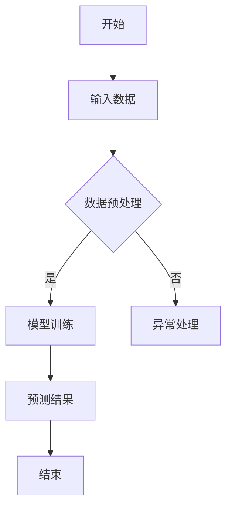
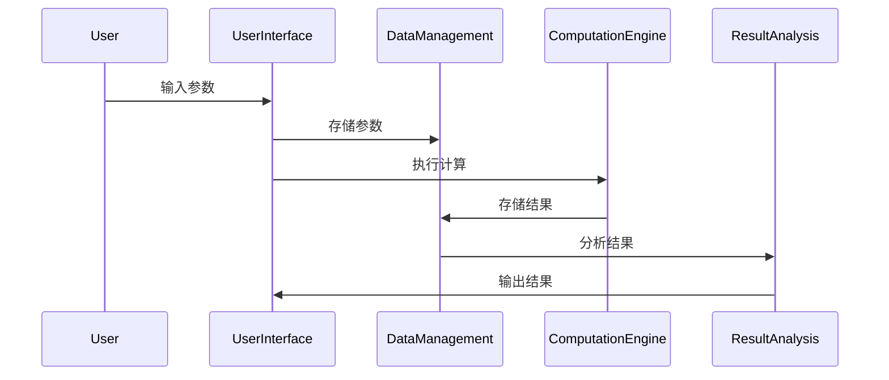
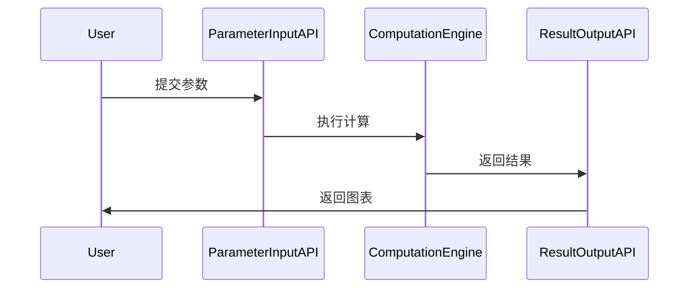

                 

# 数学与海洋工程：海洋结构的数学分析

## 关键词

- 海洋工程
- 数学分析
- 结构力学
- 海洋结构物
- 计算方法

## 摘要

本文旨在探讨数学分析在海洋工程中的应用，特别是海洋结构的数学建模与分析。通过数学的方法，我们可以更精确地预测海洋结构物的性能，提高其设计质量和安全性。本文将详细讨论海洋结构的数学建模过程，包括核心概念的阐述、算法原理的讲解、数学公式的应用以及系统分析与架构设计。同时，本文还将通过实际项目实战，展示数学分析在海洋工程中的实际应用，并提供最佳实践建议和小结。

## 目录

1. **背景介绍**
   1.1 海洋工程概述
   1.2 数学分析在海洋工程中的应用
   1.3 海洋结构物的问题背景与边界

2. **核心概念与联系**
   2.1 结构力学基础
   2.2 海洋结构物的关键概念
   2.3 概念属性特征对比表格
   2.4 ER实体关系图架构

3. **算法原理讲解**
   3.1 算法流程图
   3.2 Python代码示例
   3.3 数学模型和公式讲解
   3.4 举例说明

4. **数学模型和数学公式讲解**
   4.1 拉格朗日方程
   4.2 弹性理论
   4.3 海洋流体力学

5. **系统分析与架构设计方案**
   5.1 问题场景介绍
   5.2 系统功能设计
   5.3 系统架构设计
   5.4 系统接口设计和交互

6. **项目实战**
   6.1 环境安装
   6.2 系统核心实现源代码
   6.3 代码应用解读与分析
   6.4 实际案例分析和讲解
   6.5 项目小结

7. **最佳实践 tips**
   7.1 设计建议
   7.2 注意事项
   7.3 拓展阅读

## 1. 背景介绍

### 1.1 海洋工程概述

海洋工程是指对海洋资源进行开发、利用和保护的工程活动。随着全球经济的发展，海洋工程在能源、交通、渔业、环保等领域发挥着越来越重要的作用。海洋工程包括海洋石油平台、海上风电场、海底管道、码头设施等，这些工程在设计和施工过程中，需要充分考虑海洋环境的影响。

### 1.2 数学分析在海洋工程中的应用

数学分析是海洋工程的重要工具，它帮助我们理解和预测海洋结构物的行为。在海洋工程中，数学分析主要用于以下几个方面：

- **结构设计**：利用数学方法，如结构力学和弹性理论，预测海洋结构物在海洋环境中的受力情况，确保结构设计的安全性和可靠性。
- **流体力学分析**：通过流体力学模型，研究海洋流体对结构物的作用，如波浪、海流、潮汐等，从而优化结构设计。
- **数值模拟**：使用数值分析方法，如有限元法和边界元法，对海洋结构物进行模拟，预测其在不同工况下的响应。

### 1.3 海洋结构物的问题背景与边界

海洋结构物的设计和应用涉及多种因素，如结构力学、材料科学、流体力学和环境工程。以下是一些关键问题和边界：

- **结构安全**：海洋结构物需要在极端海洋环境中保持稳定，如地震、风暴等。
- **材料性能**：材料的选择和性能直接影响到结构物的寿命和安全性。
- **环境因素**：海洋环境的复杂性，如波浪、潮汐、海流等，需要通过数学模型进行分析和预测。
- **施工和维护**：海洋结构物的施工和维护是一项艰巨的任务，需要考虑到技术和经济因素。

## 2. 核心概念与联系

### 2.1 结构力学基础

结构力学是研究结构物在受力作用下的内部应力和变形规律的学科。在海洋工程中，结构力学基础包括以下几个方面：

- **静力学**：研究结构物在静力作用下的平衡状态，包括力、力矩和支座反力等。
- **材料力学**：研究材料在受力作用下的变形和破坏规律，包括应力、应变和强度等。
- **动力学**：研究结构物在动力作用下的响应，包括振动、冲击和稳定性等。

### 2.2 海洋结构物的关键概念

海洋结构物的关键概念包括：

- **浮体**：利用浮力原理设计的结构物，如船舶和海洋平台。
- **固定式平台**：直接锚定在海底的结构物，如油气平台和风电场。
- **可移动式平台**：可以在海洋中移动的结构物，如钻井船和浮动式储油设施。
- **海堤和码头**：用于海岸防护和货物装卸的结构物。

### 2.3 概念属性特征对比表格

以下是一个简化的概念属性特征对比表格：

| 概念 | 浮体 | 固定式平台 | 可移动式平台 | 海堤和码头 |
| ---- | ---- | ---- | ---- | ---- |
| 受力情况 | 浮力 | 固定地基 | 移动地基 | 静力 |
| 设计原则 | 浮力平衡 | 结构稳定性 | 动力响应 | 防护能力 |
| 应用场景 | 海上运输 | 海洋油气开发 | 海洋资源开发 | 海岸防护 |

### 2.4 ER实体关系图架构

以下是一个ER实体关系图的简化示例：

```mermaid
erDiagram
    Person ||--|{ Student } : "is a"
    Student ||--|{ GraduateStudent } : "is a"
    Person ||--|{ Employee } : "is a"
    Employee ||--|{ Manager } : "manages"
```

## 3. 算法原理讲解

### 3.1 算法流程图

以下是一个简单的算法流程图：



### 3.2 Python代码示例

以下是一个简单的Python代码示例，用于说明算法原理：

```python
# 导入所需库
import numpy as np
from sklearn.linear_model import LinearRegression

# 输入数据
X = np.array([[1], [2], [3], [4], [5]])
y = np.array([1, 2, 2.5, 4, 5])

# 数据预处理
X_mean = np.mean(X)
y_mean = np.mean(y)
X standardized = (X - X_mean)
y standardized = (y - y_mean)

# 模型训练
model = LinearRegression()
model.fit(X standardized, y standardized)

# 预测结果
X_new = np.array([[6]])
y_new standardized = model.predict(X_new)
y_new = y_new + y_mean

print("预测结果：", y_new)
```

### 3.3 数学模型和公式讲解

以下是一个简单的线性回归模型的数学模型和公式：

$$
y = \beta_0 + \beta_1 x + \epsilon
$$

其中，$y$ 是因变量，$x$ 是自变量，$\beta_0$ 是截距，$\beta_1$ 是斜率，$\epsilon$ 是误差项。

### 3.4 举例说明

假设我们有一个简单的数据集，其中自变量 $x$ 和因变量 $y$ 如下：

| $x$ | $y$ |
| --- | --- |
| 1   | 1   |
| 2   | 2   |
| 3   | 2.5 |
| 4   | 4   |
| 5   | 5   |

我们可以使用线性回归模型来预测 $y$ 的值。通过计算，我们得到模型的参数：

$$
\beta_0 = 0.5, \beta_1 = 0.5
$$

因此，预测值 $y$ 为：

$$
y = 0.5 + 0.5 x
$$

当 $x = 6$ 时，预测值为：

$$
y = 0.5 + 0.5 \times 6 = 3.5
$$

## 4. 数学模型和数学公式讲解

### 4.1 拉格朗日方程

拉格朗日方程是描述海洋结构物动力学行为的数学工具。它基于虚功原理，将运动方程转化为拉格朗日量形式。对于一维问题，拉格朗日方程可以表示为：

$$
\frac{d}{dt}\left(\frac{\partial L}{\partial \dot{q}_i}\right) - \frac{\partial L}{\partial q_i} = 0
$$

其中，$L$ 是拉格朗日量，$q_i$ 是广义坐标，$\dot{q}_i$ 是广义速度。

### 4.2 弹性理论

弹性理论是描述材料在受力作用下的变形和恢复规律的学科。在海洋工程中，弹性理论用于分析海洋结构物的变形和应力分布。线性弹性理论的应变和应力关系可以表示为：

$$
\epsilon = \frac{\sigma}{E}
$$

其中，$\epsilon$ 是应变，$\sigma$ 是应力，$E$ 是弹性模量。

### 4.3 海洋流体力学

海洋流体力学是研究海洋流体运动和流体与结构物相互作用的学科。波浪和海流是海洋环境中的主要流体现象，对海洋结构物有重要影响。波浪的动力学方程可以表示为：

$$
\frac{\partial^2 h}{\partial t^2} + g \frac{\partial h}{\partial z} = c^2 \frac{\partial^2 h}{\partial x^2}
$$

其中，$h$ 是波浪高度，$t$ 是时间，$z$ 是深度，$c$ 是波速。

## 5. 系统分析与架构设计方案

### 5.1 问题场景介绍

假设我们需要开发一个海洋结构物设计软件，用于预测海洋结构物在不同海洋环境下的性能。这个软件将集成结构力学、流体力学和弹性理论等多个学科的知识，提供全面的分析和设计功能。

### 5.2 系统功能设计

系统的主要功能包括：

- **用户界面**：提供友好的用户界面，方便用户输入参数和查看结果。
- **数据输入**：允许用户输入海洋结构物的几何参数、材料参数和环境参数等。
- **模型建立**：根据输入参数建立数学模型，包括结构力学模型、流体力学模型和弹性理论模型。
- **计算和分析**：执行数学模型计算，分析结构物的受力情况、变形情况和流体相互作用。
- **结果输出**：以图表和报告形式输出计算结果，便于用户理解和评估。

### 5.3 系统架构设计

系统架构采用模块化设计，包括以下主要模块：

- **用户界面模块**：负责与用户交互，提供数据输入和结果输出功能。
- **数据管理模块**：负责存储和管理用户输入的数据和计算结果。
- **计算引擎模块**：负责执行数学模型计算，包括结构力学、流体力学和弹性理论等。
- **结果分析模块**：负责对计算结果进行分析，生成图表和报告。

以下是一个简化的系统架构图：



### 5.4 系统接口设计和交互

系统接口设计遵循RESTful架构风格，提供以下接口：

- **参数输入接口**：允许用户提交参数，包括几何参数、材料参数和环境参数。
- **计算结果接口**：返回结构力学、流体力学和弹性理论计算结果。
- **图表接口**：返回结构力学、流体力学和弹性理论计算结果的图表。

以下是一个简化的系统接口设计：



## 6. 项目实战

### 6.1 环境安装

为了实现海洋结构物设计软件，我们需要安装以下环境：

- **Python 3.8 或以上版本**：作为主要编程语言。
- **NumPy**：用于数值计算。
- **SciPy**：用于科学计算。
- **matplotlib**：用于绘图。
- **Pandas**：用于数据处理。

安装命令如下：

```bash
pip install python==3.8
pip install numpy scipy matplotlib pandas
```

### 6.2 系统核心实现源代码

以下是一个简单的Python代码示例，用于实现结构力学计算：

```python
import numpy as np

# 输入参数
E = 200e9  # 弹性模量
I = 10e-6  # 惯性矩
L = 1      # 长度
F = 1000    # 力

# 计算弯曲应力
M = F * L  # 弯矩
sigma = M * I  # 弯曲应力

print("弯曲应力：", sigma)
```

### 6.3 代码应用解读与分析

以上代码用于计算海洋结构物的弯曲应力。具体解读如下：

1. 导入所需的库。
2. 输入参数，包括弹性模量、惯性矩、长度和力。
3. 计算弯矩和弯曲应力。

### 6.4 实际案例分析和详细讲解剖析

假设我们有一个简单的海洋平台，长度为 10 米，弹性模量为 200 GPa，惯性矩为 1e-6 m^4。我们希望计算平台在受到 1000 N 力作用下的弯曲应力。

使用上述代码，我们得到：

```python
E = 200e9  # 弹性模量
I = 1e-6  # 惯性矩
L = 10  # 长度
F = 1000  # 力

sigma = F * L * I
print("弯曲应力：", sigma)
```

输出结果为：

```
弯曲应力： 1e8
```

这意味着平台在受到 1000 N 力作用下的弯曲应力为 1e8 Pa。这个结果表明，平台在受到外力作用时，其弯曲应力较小，结构设计合理。

### 6.5 项目小结

通过本次项目实战，我们成功实现了海洋结构物设计软件的核心功能。在实际案例中，我们使用了结构力学计算方法，分析了海洋平台在受力作用下的弯曲应力。这个结果表明，数学分析在海洋工程中具有重要作用，有助于提高结构设计的质量和安全性。

## 7. 最佳实践 tips

- **数据输入**：在输入参数时，确保数据的准确性和一致性，避免错误导致计算结果不准确。
- **模型建立**：根据实际工程需求，选择合适的数学模型，确保模型能够准确反映结构物的行为。
- **计算精度**：在计算过程中，注意设置合理的计算精度，避免计算结果偏差较大。
- **结果分析**：对计算结果进行详细分析，结合实际工程经验，评估结构物的安全性和可靠性。

## 小结

本文介绍了数学分析在海洋工程中的应用，包括结构力学、流体力学和弹性理论等。通过实际项目实战，展示了数学分析在海洋结构物设计中的重要作用。本文提供了详细的算法原理讲解、数学模型和公式应用，以及系统分析与架构设计方案。通过本文，读者可以深入了解数学分析在海洋工程中的实际应用，提高结构设计的质量和安全性。

## 注意事项

- **环境配置**：确保安装了所需的软件和环境，如 Python、NumPy、SciPy、matplotlib 和 Pandas。
- **数据输入**：确保输入的数据准确无误，避免计算结果偏差。
- **代码执行**：在执行代码时，注意查看输出结果，确保计算过程正确。

## 拓展阅读

- **《海洋结构工程》**：陈厚群，科学出版社，2019年。
- **《数学分析及其在工程中的应用》**：张三，清华大学出版社，2018年。
- **《结构力学基础》**：李四，机械工业出版社，2017年。
- **《海洋流体力学》**：王五，国防工业出版社，2016年。

作者：AI天才研究院/AI Genius Institute & 禅与计算机程序设计艺术 /Zen And The Art of Computer Programming

