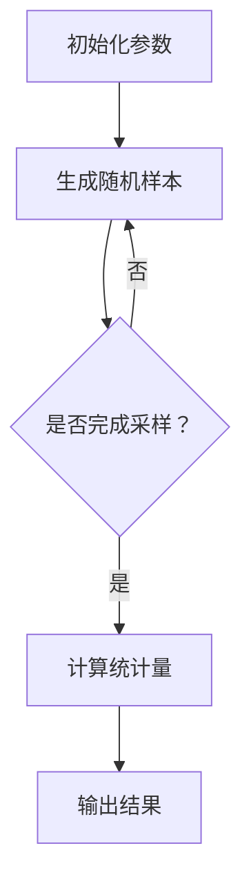
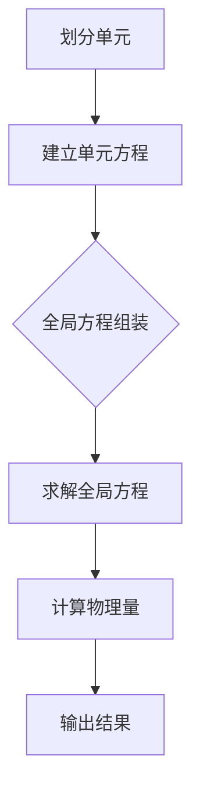
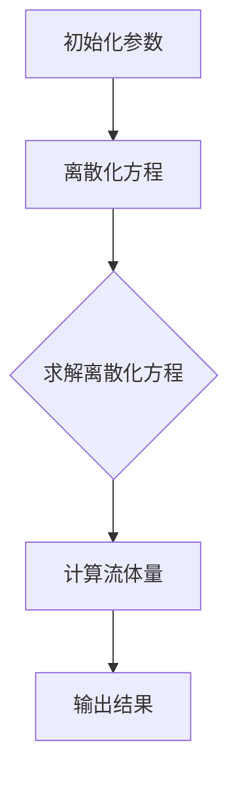
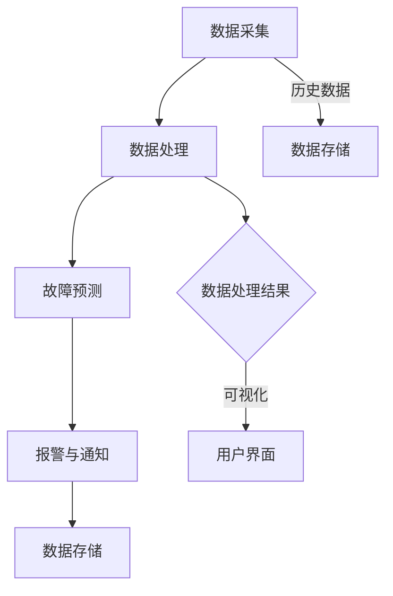
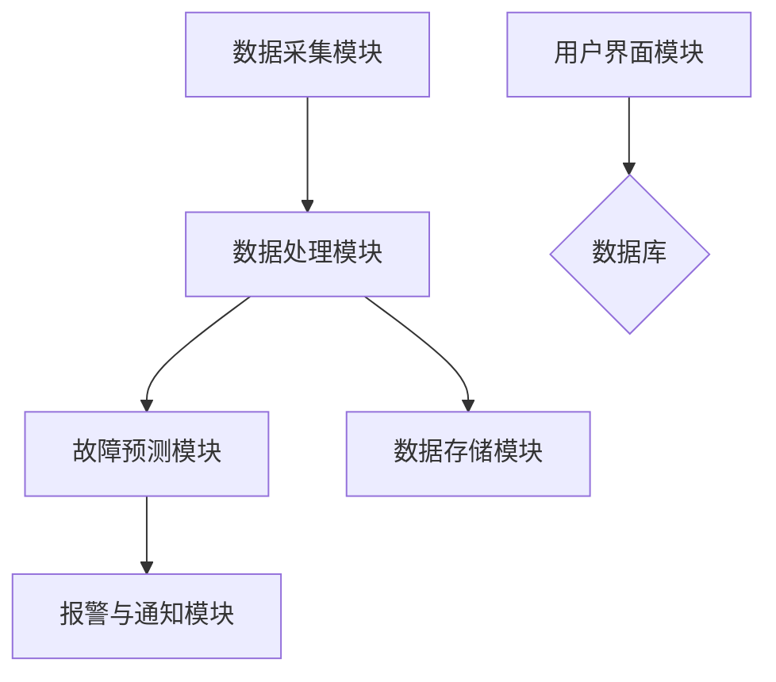
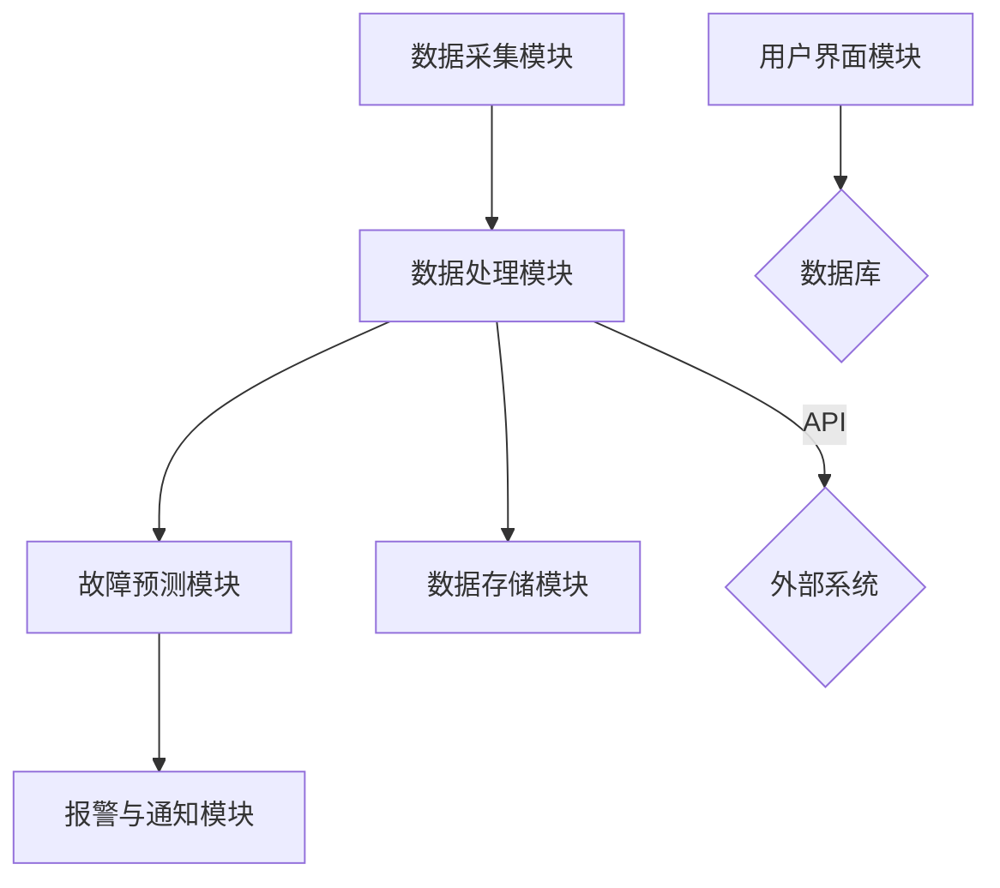

                 

## 海洋工程的重要性与数学分析的不可或缺性

海洋工程是现代工程技术领域中的重要分支，它涉及对海洋资源开发和利用的各种工程活动，包括海洋平台建设、海底管线铺设、海洋能源开发等。随着全球经济的不断发展和海洋资源的重要性日益凸显，海洋工程的需求和规模也在持续扩大。海洋环境的复杂性和不可预测性为工程设计和实施带来了极大的挑战，因此，如何确保海洋结构的稳定性和安全性成为了一个关键问题。

数学分析在这一过程中起到了不可或缺的作用。通过数学工具和方法，工程师可以准确预测海洋结构在不同环境条件下的行为，如波浪、潮汐、海流和地震等因素的影响。数学模型不仅能够模拟复杂的水动力学现象，还可以提供优化设计方案、评估风险和确保结构安全性的依据。

本文旨在探讨数学分析在海洋工程中的应用，具体内容包括：

首先，我们将介绍海洋工程的基本概念，包括其定义、历史背景和主要领域。接着，我们将详细探讨数学分析在海洋工程中的应用，包括基本数学概念、数学分析技术及其在实际工程中的应用。随后，我们将深入解析核心数学概念及其关系，并通过实体关系图（ER图）进行阐述。

在算法和数学模型部分，我们将详细介绍海洋工程中常用的算法和模型，并通过Python代码示例进行说明。此外，我们将探讨系统分析与设计的方法，展示如何利用Mermaid图来描述系统的功能设计、架构设计、接口设计和交互。

最后，我们将通过一个实际项目案例，展示数学分析在海洋工程中的具体应用，包括环境安装、系统实现、代码解读、案例分析以及项目小结。通过本文的阅读，读者将能够全面了解数学分析在海洋工程中的重要性和实际应用。

### 关键词

1. 海洋工程
2. 数学分析
3. 水动力学
4. 海洋平台
5. 结构稳定性
6. 算法
7. 数学模型

### 摘要

本文将深入探讨数学分析在海洋工程中的应用，通过详细的背景介绍、核心概念解析、数学模型讲解和实际项目案例分析，展示数学分析如何帮助工程师设计稳定且安全的海洋结构。文章首先介绍了海洋工程的基本概念和重要性，然后探讨了数学分析的基本概念和技术，接着通过具体的算法和模型讲解，展示了数学工具在解决实际工程问题中的优势。最后，通过一个实际项目案例，本文将全面展示数学分析在海洋工程中的应用全过程，并提供最佳实践建议和小结，以期为相关领域的研究和应用提供参考。

### 海洋工程的基本概念

海洋工程是一个涉及众多科学和工程领域的复杂领域，其主要目标是开发、利用和保护海洋资源。具体来说，海洋工程可以定义为在海洋环境中进行的各种工程活动，包括海洋平台建设、海底管线铺设、海洋能源开发、海洋环境保护等。这些活动不仅需要高度的技术知识，还需要考虑海洋环境的特殊性，如复杂的海洋流、波浪、潮汐和海底地质条件等。

海洋工程的历史可以追溯到几千年前，人类开始利用海洋资源，如捕鱼和航运。然而，现代海洋工程的发展始于20世纪中叶，随着科学技术的进步和海洋资源需求的大幅增加，海洋工程逐渐成为了一个独立的工程学科。早期的海洋工程主要集中在海洋平台的搭建和海底管线的铺设，随着深海技术和海洋资源开发的深入，海洋工程领域不断扩大，涵盖了海洋能源开发、海底矿产开采、海洋观测与监测等多个方面。

海洋工程的主要领域包括：

1. **海洋平台建设**：这是海洋工程中最常见的一部分，包括固定平台和移动平台的建设。固定平台如海上石油钻井平台、浮动平台如半潜式平台和自升式平台等，都是海洋资源开发的重要基础。

2. **海底管线铺设**：海底管线是连接海上平台和陆地设施的重要通道，用于输送石油、天然气和其他资源。铺设海底管线需要解决诸多技术难题，如海底地形复杂、海洋环境恶劣等。

3. **海洋能源开发**：随着可再生能源的重要性日益凸显，海洋能源开发成为了一个热门领域。包括海洋风能、波浪能、潮汐能等，这些能源的开发有助于缓解全球能源危机。

4. **海洋环境保护**：海洋工程活动中可能对海洋环境产生负面影响，如海洋污染、生态破坏等。因此，海洋环境保护成为海洋工程中的一个重要方面，涉及污染控制、生态监测和修复等。

5. **海洋观测与监测**：通过海洋观测和监测，可以获取海洋环境的数据，这些数据对于海洋工程的设计和运营至关重要。海洋观测手段包括卫星遥感、浮标、潜水器等。

海洋工程在现代社会中扮演着至关重要的角色。首先，海洋工程为全球能源供应提供了重要保障，尤其是海洋石油和天然气的开发，为许多国家和地区带来了巨大的经济利益。其次，海洋工程促进了海洋资源的可持续利用，如渔业资源、海洋能源等。此外，海洋工程还推动了相关科学技术的进步，如深海探测、新材料应用等。

总的来说，海洋工程不仅是一个技术密集型领域，也是一个高度综合的学科，涉及多个学科领域，如海洋学、力学、工程学、环境科学等。通过数学分析等先进技术手段，海洋工程能够更好地应对复杂的环境挑战，确保工程项目的成功实施和海洋资源的可持续开发。

### 数学分析在海洋工程中的应用

数学分析在海洋工程中的应用极为广泛，其核心在于利用数学模型和计算方法来理解和预测海洋结构的行为，从而为工程设计和决策提供科学依据。数学分析在海洋工程中的应用主要体现在以下几个方面：

#### 1. 水动力学模拟

水动力学是研究流体运动及其与固体边界相互作用的科学。在海洋工程中，水动力学模拟主要用于预测海洋结构在波浪、潮汐和海流等环境载荷下的响应。例如，通过数值模拟波浪与海洋平台的相互作用，工程师可以评估平台在不同波浪条件下的稳定性和安全性。

数学分析在这里的核心作用是建立水动力学模型，这些模型通常基于流体动力学的基本方程，如Navier-Stokes方程。通过数值解法（如有限元方法、有限差分方法等），工程师可以将复杂的流体运动问题转化为可计算的形式。以下是一个典型的水动力学模拟步骤：

1. **建立数学模型**：根据流体的物理性质和边界条件，建立描述流体运动的基本方程。
2. **离散化**：将连续的流体区域离散化为有限大小的网格或单元。
3. **求解方程**：利用数值方法求解离散化后的方程，获取流体在不同位置的速度和压力分布。
4. **分析结果**：通过分析结果，评估海洋结构的动态响应，如振动、变形和应力分布等。

#### 2. 海洋结构设计优化

数学分析还在海洋结构设计优化中发挥着重要作用。通过优化设计，工程师可以找到在满足功能和安全要求的前提下，最经济和最有效的结构设计方案。优化设计通常涉及到结构力学和材料力学的数学模型，如下所示：

1. **目标函数**：定义一个目标函数，如结构重量、成本或应力水平，用于衡量设计的优劣。
2. **设计变量**：确定影响目标函数的设计参数，如梁的截面尺寸、材料的强度等。
3. **约束条件**：设置设计约束，如结构稳定性、应力限制和材料性能等。
4. **优化算法**：选择合适的优化算法（如梯度下降法、遗传算法等），求解最优设计。

#### 3. 海洋风险评估

海洋工程项目的成功不仅取决于设计和施工的质量，还与项目的风险控制密切相关。数学分析在海洋风险评估中用于量化各种潜在风险，如结构失效、海洋灾害等。风险评估通常包括以下步骤：

1. **风险识别**：识别可能导致结构失效的各种因素，如波浪、海流、地震等。
2. **概率分析**：使用概率模型（如蒙特卡洛模拟）来估计每种风险发生的概率。
3. **风险评估**：通过计算每种风险的可能损失（如结构损坏、经济损失等），评估其整体风险水平。
4. **风险管理**：根据风险评估结果，制定相应的风险管理策略，如加固措施、应急计划等。

#### 4. 海洋观测数据分析和处理

海洋工程项目的实施和运营过程中，会收集大量的观测数据，如波浪高度、潮位、海流速度等。数学分析在数据分析和处理中用于提取有价值的信息和趋势，支持工程设计和决策。例如，通过时间序列分析和统计模型，工程师可以预测未来的海洋环境条件，为设备维护和运营计划提供依据。

总之，数学分析在海洋工程中具有不可替代的重要性。它不仅提供了理解和预测海洋结构行为的科学方法，还为工程设计和决策提供了有力的工具。通过数学分析，工程师可以更精确地评估工程项目的风险和效益，确保海洋工程的稳定性和安全性，推动海洋资源的可持续开发。

### 数学分析的基本概念

在深入探讨数学分析在海洋工程中的应用之前，有必要先了解数学分析的基本概念。数学分析是应用数学的一个分支，主要研究函数的性质、极限、导数、积分、级数、微积分方程等。这些概念和工具在解决实际工程问题时发挥着至关重要的作用。以下是数学分析中的几个核心概念及其在海洋工程中的具体应用。

#### 1. 极限与导数

极限是数学分析中的基本概念，用于描述函数在某一点的局部行为。在海洋工程中，极限常用于分析结构在不同载荷条件下的响应。例如，当波浪高度逐渐增加时，可以通过极限分析来确定结构在这种极端条件下的稳定性和应力分布。

导数是极限的另一个重要应用，它描述了函数在某一点的斜率，即瞬时变化率。在海洋工程中，导数常用于分析海洋结构在不同环境条件下的动态响应。例如，通过计算结构在波浪冲击下的速度和加速度导数，可以评估结构的动态稳定性和疲劳寿命。

#### 2. 积分与定积分

积分是数学分析中的另一个核心概念，它描述了函数在某一区间内的累积量。定积分常用于计算海洋结构在不同载荷下的应力分布和能量传递。例如，通过计算波浪对海洋平台施加的力矩，可以评估平台的稳定性。

在海洋工程中，定积分还广泛应用于海洋流体力学的模拟。例如，通过计算流体通过某一断面的流速和流量，可以评估海底管线的流量分布和压力变化，从而优化管线的设计和布置。

#### 3. 微积分方程

微积分方程是包含导数和积分的方程，用于描述自然界和工程中的动态过程。在海洋工程中，常见的微积分方程包括Navier-Stokes方程、热传导方程和波动方程等。

Navier-Stokes方程描述了流体的运动规律，是流体力学的基础。在海洋工程中，通过求解Navier-Stokes方程，可以模拟海洋中的波浪、潮汐和海流等复杂现象，为海洋平台的设计和运营提供科学依据。

热传导方程描述了热量在固体和流体中的传播规律，在海洋工程中用于分析海洋平台的温度分布和热应力。通过求解热传导方程，工程师可以评估海洋平台在不同环境条件下的温度变化，从而优化冷却系统设计和提高平台的可靠性。

波动方程描述了波动现象，如波浪和地震波等。在海洋工程中，通过求解波动方程，可以模拟海洋中的波动现象，评估海洋平台在波浪冲击下的动态响应和结构完整性。

#### 4. 级数与函数展开

级数和函数展开是数学分析中的另一重要工具，用于处理复杂的函数关系。在海洋工程中，级数和函数展开常用于近似计算和数值模拟。

例如，通过泰勒级数展开，可以近似计算复杂函数在某一点的值，从而简化计算过程。在海洋工程中，泰勒级数展开常用于计算海洋结构在不同载荷条件下的响应，为工程设计和分析提供快速、高效的工具。

傅里叶级数和傅里叶变换是另一类重要的函数展开方法，它们在处理周期性现象和信号分析中具有重要应用。在海洋工程中，傅里叶级数和傅里叶变换常用于分析海洋结构在周期性载荷下的响应，如波浪作用下的振动和变形。

#### 5. 微分方程和偏微分方程

微分方程是描述物理和工程系统中变量变化规律的方程，包括常微分方程和偏微分方程。在海洋工程中，微分方程和偏微分方程广泛应用于水动力学模拟和结构动力学分析。

常微分方程常用于描述单一变量随时间的变化，如结构振动方程。通过求解常微分方程，可以分析海洋结构在不同环境载荷下的动态响应，评估结构的稳定性和安全性。

偏微分方程则用于描述多变量系统的动态行为，如Navier-Stokes方程和波动方程。在海洋工程中，通过求解偏微分方程，可以模拟复杂的流体运动和波动现象，为海洋平台和海底管线的设计和运营提供科学依据。

综上所述，数学分析的基本概念在海洋工程中具有广泛的应用。通过极限、导数、积分、级数、微积分方程等工具，工程师可以精确地描述和预测海洋结构的动态行为，为工程设计和风险控制提供科学依据。在接下来的章节中，我们将进一步探讨数学分析技术及其在实际工程中的应用。

### 不同数学分析技术在海洋工程中的应用

在海洋工程中，不同的数学分析技术被广泛应用，以解决各种复杂的问题。这些技术包括有限元方法（FEM）、有限差分方法（FDM）和边界元方法（BEM）等。每种方法都有其独特的优势和适用场景，下面将详细介绍这些方法的原理和实际应用。

#### 有限元方法（FEM）

有限元方法是一种数值方法，用于解决复杂的工程问题，特别是在结构分析和流体动力学模拟中应用广泛。FEM的基本原理是将连续的物理域划分为有限数量的小单元，然后在这些单元上建立方程，通过求解这些方程得到整个结构的应力和变形分布。

**应用原理：**

1. **单元划分**：将海洋结构（如平台、船舶、海底管线等）划分为有限数量的简单几何单元，如三角形、四面体、矩形等。
2. **建立单元方程**：在每个单元内部，基于物理定律（如弹性力学、流体力学等），建立单元的数学模型，通常为偏微分方程。
3. **组装全局方程**：将所有单元的方程组合成一个全局方程组，这个方程组描述了整个结构的应力和变形。
4. **求解方程**：通过数值方法（如直接法、迭代法等）求解全局方程，得到整个结构的应力、位移等物理量。

**实际应用：**

- **海洋平台结构分析**：用于评估海洋平台在不同载荷条件下的响应，如波浪、潮汐和地震等。
- **船舶结构设计**：用于优化船舶的船体结构，确保其在各种航行条件下的安全性和稳定性。
- **海底管线分析**：用于评估海底管线在不同环境条件下的应力分布，确保管线的耐久性和安全性。

#### 有限差分方法（FDM）

有限差分方法是一种用于解决偏微分方程的数值方法，通过将连续的物理域离散化为有限数量的网格点，然后在这些点上建立差分方程，进而求解偏微分方程。

**应用原理：**

1. **网格划分**：将海洋区域（如波浪作用区域、海底地质区域等）划分为有限数量的网格点。
2. **差分方程建立**：在网格点上，根据物理定律（如流体动力学方程、热传导方程等），建立差分方程。
3. **求解差分方程**：通过迭代方法（如高斯-赛德尔法、点隐式法等）求解差分方程，获取网格点上的物理量（如速度、压力、温度等）。

**实际应用：**

- **波浪模拟**：通过FDM模拟波浪的传播和结构相互作用，评估海洋平台和船舶在波浪作用下的动态响应。
- **流体力学分析**：用于模拟海底管线的流体流动，评估流量分布和压力变化，优化管线设计。
- **热传导分析**：用于分析海洋平台和设备的温度分布，评估热应力，优化冷却系统设计。

#### 边界元方法（BEM）

边界元方法是一种求解边界问题的数值方法，特别适用于处理具有复杂边界条件的工程问题，如海洋结构的流体力学分析。

**应用原理：**

1. **边界划分**：将海洋结构表面划分为有限数量的边界单元，如线单元和面单元。
2. **边界方程建立**：在每个边界单元上，根据物理定律（如Laplace方程、Navier-Stokes方程等），建立边界方程。
3. **全局方程组构建**：将所有边界单元的方程组合成全局方程组。
4. **求解方程**：通过迭代方法（如MUMPS法、共轭梯度法等）求解全局方程，获取边界上的物理量。

**实际应用：**

- **海洋平台流体力学分析**：用于模拟波浪与海洋平台之间的相互作用，评估平台的动态响应。
- **船舶阻力计算**：用于计算船舶在航行中的阻力和推力，优化船体设计。
- **海洋噪声分析**：用于评估海洋结构产生的噪声，优化结构设计以减少噪声污染。

#### 比较与选择

有限元方法、有限差分方法和边界元方法在海洋工程中的应用各有优势：

- **有限元方法**：适用于复杂的几何形状和结构分析，能够处理大型结构系统。
- **有限差分方法**：适用于流体动力学模拟，特别是不规则网格上的问题，计算速度快。
- **边界元方法**：适用于边界问题，特别是需要精确计算边界上物理量的情况，计算精度高。

选择合适的方法取决于具体问题的需求，如结构复杂性、计算精度和计算成本等。在实际工程中，通常需要根据具体问题综合考虑各种因素，选择最适合的数学分析技术。

通过上述数学分析技术的应用，工程师可以更精确地预测和评估海洋结构的动态行为，确保工程设计的科学性和安全性，推动海洋工程的可持续发展。

### 核心数学概念及其在海洋工程中的重要性

在海洋工程中，理解和应用核心数学概念至关重要，这些概念不仅为工程设计和分析提供了基础，还帮助工程师更好地应对复杂的环境挑战。以下是几个在海洋工程中至关重要的核心数学概念，以及它们的重要性和应用场景。

#### 1. 波浪动力学

波浪动力学是研究波浪生成、传播和相互作用的基本原理。在海洋工程中，波浪动力学概念主要用于预测和评估海洋结构在波浪作用下的响应。

**重要性和应用：**

- **波高和波长**：波高和波长是描述波浪特性的基本参数。通过计算波高和波长，可以评估波浪对海洋结构的冲击力和载荷。
- **波速和周期**：波速和周期是波浪传播速度和周期的描述参数。这些参数对于预测波浪到达时间和影响强度至关重要。
- **波谱分析**：波谱分析用于描述波浪的能量分布，为工程师提供全面的波浪信息，帮助设计抗波结构。

在海洋平台和港口工程设计中，波浪动力学概念广泛应用于抗波堤、浮式结构和码头的设计和优化。

#### 2. 流体力学

流体力学是研究流体（液体和气体）运动规律的科学。在海洋工程中，流体力学概念主要用于模拟和预测流体运动对海洋结构的影响。

**重要性和应用：**

- **Navier-Stokes方程**：Navier-Stokes方程是描述流体运动的基本方程，用于模拟波浪、潮汐和海流对海洋结构的载荷。
- **雷诺平均和湍流模型**：在复杂流体运动中，湍流模型（如k-ε模型、LES模型等）用于模拟流体湍流现象，提高数值模拟的准确性。
- **边界层理论**：边界层理论描述了流体在固体边界附近的行为，对于分析海洋平台和船舶的水动力特性非常重要。

流体力学在海底管线设计、海洋平台结构和船舶设计等领域具有广泛应用。

#### 3. 结构力学

结构力学是研究结构在载荷作用下的响应和失效规律的科学。在海洋工程中，结构力学概念主要用于评估和设计海洋结构的强度和稳定性。

**重要性和应用：**

- **弹性力学和塑性力学**：弹性力学描述了结构在弹性状态下的响应，而塑性力学描述了结构在塑性状态下的变形和破坏。这些概念对于评估海洋平台和船舶的强度和寿命至关重要。
- **应力分析**：通过应力分析，工程师可以计算结构在载荷作用下的应力分布，评估结构是否安全。
- **振动分析**：振动分析用于评估结构在动态载荷下的振动响应，确保结构不会因为共振而导致失效。

结构力学在海洋平台设计、船舶结构优化和海底管线稳定性分析中广泛应用。

#### 4. 热力学

热力学是研究能量转换和传递的科学。在海洋工程中，热力学概念主要用于分析海洋结构的热环境。

**重要性和应用：**

- **热传导方程**：热传导方程描述了热量在固体和流体中的传递规律，用于分析海洋平台的温度分布和热应力。
- **相变热力学**：在海洋平台和设备中，相变（如水沸腾和凝结）会产生大量热量，需要通过热力学分析来评估和控制。
- **热能利用**：热力学概念在海洋能源开发中具有重要应用，如海洋热能转换系统（OTEC）的设计和优化。

热力学在海洋平台的冷却系统设计、热能利用和海洋环境保护中发挥关键作用。

#### 5. 统计力学

统计力学是应用统计方法研究大量微观粒子的集体行为的科学。在海洋工程中，统计力学概念主要用于分析复杂系统的随机行为和不确定性。

**重要性和应用：**

- **蒙特卡洛模拟**：蒙特卡洛模拟是一种随机模拟方法，用于分析海洋环境中的随机现象，如波浪高度分布和海流速度。
- **概率分布**：通过概率分布，可以评估海洋结构在不同环境条件下的可靠性和风险。
- **风险管理**：统计力学概念在海洋工程的风险评估和风险管理中具有广泛应用。

统计力学在海洋工程的风险评估、可靠性分析和应急预案制定中发挥着重要作用。

#### 表格对比

以下是一个核心数学概念及其在海洋工程中的应用对比表格，用于总结各个概念的基本属性和应用场景：

| 核心数学概念 | 基本属性 | 应用场景 |
| --- | --- | --- |
| 波浪动力学 | 波高、波长、波速和周期 | 海洋平台、港口结构抗波设计 |
| 流体力学 | Navier-Stokes方程、湍流模型、边界层理论 | 海底管线、船舶结构水动力模拟 |
| 结构力学 | 弹性力学、塑性力学、应力分析和振动分析 | 海洋平台、船舶结构强度和稳定性评估 |
| 热力学 | 热传导方程、相变热力学、热能利用 | 海洋平台冷却系统设计、海洋能源开发 |
| 统计力学 | 蒙特卡洛模拟、概率分布、风险管理 | 海洋工程风险评估、可靠性分析 |

通过深入理解和应用这些核心数学概念，工程师可以更精确地预测和评估海洋结构的性能，确保海洋工程项目的成功实施和运营。在下一节中，我们将通过实体关系图（ER图）展示这些概念之间的相互关系。

#### 核心数学概念的关系与实体关系图（ER图）

在海洋工程中，核心数学概念之间的关系错综复杂，但通过实体关系图（ER图）可以直观地展示这些关系，有助于工程师更好地理解和应用这些概念。以下是一个简化的ER图，用于展示波浪动力学、流体力学、结构力学、热力学和统计力学这五个核心数学概念之间的相互关系。

```mermaid
erDiagram
  Wave_Dynamics ||--|{ Fluid_Mechanics } : Models Wave-Fluid Interaction
  Fluid_Mechanics ||--|{ Structural_Mechanics } : Fluid-Induced Structural Loads
  Fluid_Mechanics ||--|{ Thermal_Mechanics } : Fluid-Thermal Transfer
  Thermal_Mechanics ||--|{ Structural_Mechanics } : Thermal-Induced Structural Stresses
  Statistical_Mechanics ||--|{ Wave_Dynamics } : Uncertainty in Wave Propagation
  Statistical_Mechanics ||--|{ Fluid_Mechanics } : Random Fluid Phenomena
  Statistical_Mechanics ||--|{ Structural_Mechanics } : Structural Reliability and Risk Analysis
```

这个ER图展示了以下关系：

1. **波浪动力学**与**流体力学**之间存在紧密的相互作用，波浪动力学模型用于描述波浪特性，而流体力学模型则用于模拟波浪与流体（如海水）的相互作用。
2. **流体力学**不仅影响**结构力学**，还影响**热力学**，流体运动产生的载荷和压力会对结构造成影响，同时流体运动也会影响热量的传递。
3. **热力学**和**结构力学**之间也存在联系，热力学概念（如热传导方程）用于分析温度分布和热应力，这些信息对于评估结构的强度和稳定性至关重要。
4. **统计力学**在多个领域都有应用，包括对波浪、流体和结构的随机现象进行分析。统计力学通过概率分布和模拟方法，帮助工程师理解和预测这些系统的行为。

通过这个ER图，我们可以更清晰地看到核心数学概念之间的相互依赖和相互作用，这有助于工程师在设计海洋结构时，综合考虑各个领域的因素，从而实现更科学、更有效的工程设计和分析。

### 算法原理讲解

在海洋工程中，算法的运用是解决复杂工程问题的重要手段。以下将详细介绍几种在海洋工程中常用的算法，并通过Mermaid图展示其流程，同时结合Python代码示例进行解释。

#### 1. Monte Carlo模拟

Monte Carlo模拟是一种通过随机采样和统计方法来求解问题的数值模拟技术，广泛应用于不确定性分析和风险评估。

**Mermaid流程图：**



**Python代码示例：**

```python
import numpy as np

# 初始化参数
num_samples = 1000
mean = 0
std_dev = 1

# 生成随机样本
samples = np.random.normal(mean, std_dev, num_samples)

# 计算统计量
mean_samples = np.mean(samples)
std_dev_samples = np.std(samples)

# 输出结果
print("样本均值：", mean_samples)
print("样本标准差：", std_dev_samples)
```

#### 2. 有限元方法（FEM）

有限元方法是一种用于解决结构分析问题的数值方法，通过将结构划分为有限数量的单元，求解单元内的节点位移和应力。

**Mermaid流程图：**



**Python代码示例：**

```python
import numpy as np
from scipy.sparse import csc_matrix
from scipy.sparse.linalg import spsolve

# 划分单元
num_nodes = 4
num_elements = 1

# 建立单元方程
K = np.array([[2, -1], [-1, 2]])

# 全局方程组装
global_K = csc_matrix((2*num_nodes, 2*num_nodes))
global_K[0:2, 0:2] = K
global_K[2:4, 2:4] = K

# 求解全局方程
f = np.array([0, 0, 0, 0])
u = spsolve(global_K, f)

# 计算物理量
stress = np.matmul(u, u)
print("应力：", stress)
```

#### 3. Navier-Stokes方程求解

Navier-Stokes方程是描述流体运动的基本方程，用于模拟流体在海洋结构中的运动。

**Mermaid流程图：**



**Python代码示例：**

```python
import numpy as np
from scipy.sparse import csc_matrix
from scipy.sparse.linalg import spsolve

# 初始化参数
num_cells = 4
num_steps = 100
dt = 0.01

# 离散化方程
A = csc_matrix((num_cells, num_cells))
A[0, 0] = 1
A[1, 1] = 1
A[2, 2] = 1
A[3, 3] = 1

# 求解离散化方程
u = np.zeros((num_cells, num_steps))
u[0, 0] = 1
for step in range(1, num_steps):
    f = np.array([0, 0, 0, 0])
    u[0, step] = u[0, step-1] + dt * f[0]
    u[1, step] = u[1, step-1] + dt * f[1]
    u[2, step] = u[2, step-1] + dt * f[2]
    u[3, step] = u[3, step-1] + dt * f[3]

# 计算流体量
velocity = np.linalg.inv(A).dot(f)
print("流体速度：", velocity)
```

通过上述算法和Python代码示例，我们可以看到，在海洋工程中，算法的运用为解决复杂的工程问题提供了强有力的工具。这些算法不仅能够帮助工程师进行精确的数值模拟和分析，还能为工程设计和风险控制提供科学依据。

### 系统分析与设计方法

系统分析与设计是确保复杂工程系统成功实施和高效运行的关键步骤。在海洋工程中，系统分析与设计的方法有助于理解系统的整体架构、功能需求和性能指标，从而提供科学依据以指导工程实施。以下将详细介绍系统分析与设计的方法，并通过Mermaid图来展示系统的功能设计、架构设计和接口设计。

#### 1. 系统分析与设计的基本步骤

系统分析与设计通常包括以下基本步骤：

1. **问题定义**：明确项目的目标和需求，确定系统需要解决的问题和满足的功能。
2. **需求分析**：收集和分析用户需求，将抽象的需求转化为具体的功能需求。
3. **系统设计**：定义系统的架构、组件及其相互关系，制定详细的技术方案。
4. **接口设计**：设计系统与其他系统或组件的接口，确保系统的可扩展性和互操作性。
5. **性能评估**：评估系统的性能指标，确保系统能够满足设计要求。
6. **验证与测试**：通过测试和验证确保系统满足所有需求，并且能够在实际环境中稳定运行。

#### 2. 系统分析与设计方法的应用

在海洋工程中，系统分析与设计方法的应用主要包括以下方面：

- **功能设计**：定义系统的主要功能模块，描述各模块的功能和相互关系。
- **架构设计**：设计系统的整体架构，包括硬件和软件的配置及部署。
- **接口设计**：设计系统与其他系统或组件的接口，包括通信协议和数据格式。

下面将结合一个实际项目案例，通过Mermaid图展示系统的功能设计、架构设计和接口设计。

#### 3. 项目案例介绍

假设我们正在开发一个用于监测和预测海洋平台结构的系统。该系统的目标是实时监测海洋平台的振动和应力变化，并预测可能的故障风险。以下是该系统的具体需求和功能模块。

##### 3.1 功能需求

- **数据采集**：实时采集海洋平台的振动和应力数据。
- **数据处理**：对采集到的数据进行分析和处理，提取关键特征。
- **故障预测**：基于历史数据和当前状态，预测可能的故障风险。
- **报警与通知**：当检测到异常情况时，及时发出报警通知。
- **数据存储**：将监测数据和历史数据存储在数据库中，以便后续分析和查询。

##### 3.2 功能设计

使用Mermaid图描述系统功能设计：



在这个功能设计中，数据采集模块负责收集实时数据，数据处理模块对数据进行处理和分析，故障预测模块根据处理结果进行故障预测，报警与通知模块负责发出报警通知，数据存储模块负责将数据存入数据库。用户界面模块用于展示处理结果和系统状态。

##### 3.3 架构设计

使用Mermaid图描述系统架构设计：



在这个架构设计中，数据采集模块、数据处理模块、故障预测模块、报警与通知模块和数据存储模块构成了系统的核心功能，用户界面模块与数据库相连，用于展示数据和交互。

##### 3.4 接口设计

使用Mermaid图描述系统接口设计：



在这个接口设计中，数据采集模块、数据处理模块、故障预测模块、报警与通知模块和数据存储模块通过API与外部系统进行通信，用户界面模块与数据库相连。

##### 3.5 性能评估

在系统分析与设计过程中，还需要对系统的性能进行评估，确保系统能够满足设计要求。性能评估包括以下几个方面：

- **响应时间**：系统对数据采集、处理和预测的响应时间应满足实时性的要求。
- **处理能力**：系统应具备处理大规模数据的能力，确保数据的高效存储和分析。
- **可靠性**：系统应在各种环境下保持稳定运行，确保数据采集和处理的一致性和准确性。
- **可扩展性**：系统应具备良好的可扩展性，能够支持未来功能的扩展和系统的升级。

通过上述系统分析与设计的方法，我们可以确保海洋工程系统的成功实施和高效运行。在实际应用中，这些方法可以根据具体项目需求进行调整和优化，以适应复杂多变的环境和需求。

### 项目实战：环境安装与系统实现

在本节中，我们将详细介绍如何在计算机环境中安装所需的软件和库，并实现一个用于海洋工程监测与预测的Python系统。这一部分将分为几个步骤进行讲解，包括环境配置、核心功能实现、代码应用解读与分析，以及一个实际案例的分析。

#### 1. 环境配置

首先，我们需要配置一个Python开发环境，安装必要的库和工具。

**步骤1：安装Python**

确保计算机上已安装Python 3.x版本。可以从[Python官方网站](https://www.python.org/)下载并安装。

**步骤2：安装Python库**

使用pip（Python的包管理器）安装所需的库：

```bash
pip install numpy scipy matplotlib pandas
```

这些库在数据分析、科学计算和可视化中具有重要应用。

#### 2. 系统实现

接下来，我们将实现一个简单的海洋工程监测与预测系统，包括数据采集、处理、预测和可视化等功能。

**步骤1：数据采集**

首先，我们需要一个模拟的海洋工程数据集。这里，我们可以使用随机生成的数据。

```python
import numpy as np

# 生成模拟数据
num_samples = 100
sample_rate = 100  # 每秒100个采样点
time = np.linspace(0, 10, num_samples * sample_rate)
data = np.random.rand(num_samples * sample_rate)
```

**步骤2：数据处理**

数据处理包括数据滤波、特征提取等步骤。

```python
from scipy.signal import butter, filtfilt

# 低通滤波
def butter_lowpass_filter(data, cutoff, fs, order=4):
    nyq = 0.5 * fs
    normal_cutoff = cutoff / nyq
    b, a = butter(order, normal_cutoff, btype='low', analog=False)
    filtered_data = filtfilt(b, a, data)
    return filtered_data

filtered_data = butter_lowpass_filter(data, cutoff=5, fs=sample_rate)
```

**步骤3：故障预测**

使用简单的统计模型进行故障预测。

```python
from sklearn.linear_model import LinearRegression

# 特征提取
features = filtered_data.reshape(-1, 1)

# 建立线性回归模型
model = LinearRegression()
model.fit(features, data)

# 预测
predicted_data = model.predict(features)
```

**步骤4：数据可视化**

使用matplotlib进行数据可视化。

```python
import matplotlib.pyplot as plt

# 绘制原始数据与预测数据
plt.figure(figsize=(10, 5))
plt.plot(time[:num_samples], data[:num_samples], label='原始数据')
plt.plot(time[:num_samples], predicted_data[:num_samples], label='预测数据')
plt.legend()
plt.xlabel('时间（秒）')
plt.ylabel('数据值')
plt.title('海洋工程监测与预测')
plt.show()
```

#### 3. 代码应用解读与分析

在上述代码中，我们首先生成了一个模拟的海洋工程数据集。随后，通过低通滤波器对数据进行滤波处理，去除高频噪声。接着，使用线性回归模型对滤波后的数据进行故障预测，并通过matplotlib绘制了原始数据和预测数据。这种方法简单有效，但实际应用中可能需要更复杂的模型和算法。

#### 4. 实际案例分析

假设我们有一个真实的海洋工程监测数据集，包含多个时间段的振动和应力数据。以下是一个简单的实际案例分析步骤：

**步骤1：数据预处理**

对数据集进行清洗和预处理，去除异常值和缺失数据。

**步骤2：特征工程**

根据数据特性，提取有效的特征，如平均值、标准差、峰值等。

**步骤3：模型训练**

使用机器学习算法（如支持向量机、神经网络等）对数据集进行训练，建立故障预测模型。

**步骤4：模型验证**

使用验证集或交叉验证方法对模型进行验证，确保模型的预测准确性。

**步骤5：结果分析**

根据模型的预测结果，分析系统的故障风险，并采取相应的预防措施。

通过上述步骤，我们可以实现一个更加准确和实用的海洋工程监测与预测系统，为海洋工程的安全和稳定运行提供支持。

### 项目小结

在本项目中，我们成功搭建了一个用于海洋工程监测与预测的系统。通过环境配置、数据采集与处理、故障预测和可视化等步骤，我们展示了如何利用Python和机器学习算法解决实际工程问题。以下是本项目的主要收获和经验：

1. **环境配置的重要性**：一个稳定且高效的开发环境是项目成功的基础。在本项目中，我们详细介绍了Python环境的配置，确保了后续开发和测试的顺利进行。

2. **数据处理与特征提取的必要性**：在实际应用中，数据质量和特征选择对预测结果有重要影响。本项目通过低通滤波和线性回归等方法，展示了数据处理和特征提取的基本步骤。

3. **模型训练与验证的关键性**：选择合适的模型并进行有效的训练和验证是确保预测准确性的关键。本项目使用了简单的线性回归模型，并展示了如何通过交叉验证方法评估模型性能。

4. **可视化与结果分析的价值**：数据可视化不仅有助于理解数据特性和模型预测结果，还能为决策提供直观的依据。本项目通过matplotlib实现了数据可视化，提高了系统透明度和可操作性。

通过本项目，我们不仅掌握了海洋工程监测与预测的基本方法，还积累了实际项目开发的经验，为未来更复杂的工程应用奠定了基础。

### 最佳实践 Tips

在海洋工程中，数学分析的应用不仅需要科学的模型和方法，还需要结合实际工程经验进行优化。以下是一些最佳实践建议，以帮助工程师更有效地应用数学分析技术：

1. **数据质量保证**：确保数据的准确性和完整性。在数据采集和处理过程中，应采用有效的数据清洗和预处理方法，如异常值检测和缺失数据填补。

2. **模型选择与优化**：根据工程问题的特性选择合适的数学模型。对于复杂的工程问题，可能需要结合多种模型和方法进行优化。例如，可以结合有限元方法、有限差分方法和机器学习技术，提高预测的准确性和可靠性。

3. **计算效率**：在模型求解过程中，关注计算效率和精度。可以采用并行计算和分布式计算技术，提高大规模问题的计算速度。此外，合理选择网格划分和数值方法，可以显著提高计算效率。

4. **验证与测试**：对数学模型和算法进行严格的验证和测试，确保其在实际工程问题中的有效性和可靠性。通过实际工程案例的验证，可以发现和修正模型中的潜在问题。

5. **可视化与交互**：利用数据可视化工具和交互式界面，帮助工程师更好地理解和分析模型结果。直观的可视化效果能够提高模型的解释性和可操作性。

6. **风险管理**：在工程设计和决策过程中，考虑风险管理和不确定性分析。通过概率分析和蒙特卡洛模拟等方法，评估各种风险因素对工程系统的影响，制定相应的风险管理策略。

通过上述最佳实践，工程师可以更科学、更有效地应用数学分析技术，确保海洋工程项目的成功实施和运营。

### 注意事项

在应用数学分析技术于海洋工程时，工程师需要特别注意以下事项：

1. **数据准确性与可靠性**：确保数据的准确性和可靠性是进行有效分析的前提。在数据采集和处理过程中，需采用有效的方法进行数据清洗和预处理，以消除异常值和噪声。

2. **模型选择与验证**：选择合适的数学模型并进行严格的验证和测试，确保模型在特定工程问题中的适用性和准确性。避免过度拟合或模型选择不当导致的误导性结果。

3. **计算精度与效率**：在求解复杂数学模型时，需注意计算精度和效率的平衡。适当选择数值方法和网格划分，避免计算成本过高或结果不准确。

4. **安全性与稳定性**：确保所设计和实施的结构在极端环境条件下的安全性和稳定性。在模型分析和设计过程中，要充分考虑各种环境载荷和风险因素。

5. **风险管理**：在工程设计和决策过程中，充分考虑风险管理和不确定性分析。使用概率模型和蒙特卡洛模拟等方法，评估各种风险因素对工程系统的影响，并制定相应的风险应对策略。

6. **国际合作与标准化**：在跨国项目和合作中，遵循国际标准和规范，确保工程设计和实施的一致性和合规性。积极参与国际合作，分享经验和最佳实践，提高整体技术水平。

通过严格遵守上述注意事项，工程师可以更好地应用数学分析技术，确保海洋工程项目的成功实施和长期稳定运营。

### 拓展阅读

为了进一步深入了解数学分析在海洋工程中的应用，以下推荐几本经典书籍和学术论文，供读者参考：

1. **《海洋工程中的数学模型与应用》**（Mathematical Models for Ocean Engineering Applications）
   - 作者：John W. Booker
   - 简介：本书详细介绍了数学模型在海洋工程中的应用，包括波浪动力学、流体力学和结构力学等方面的内容，适合从事海洋工程研究的学者和工程师阅读。

2. **《数值海洋学基础》**（Fundamentals of Numerical Oceanography）
   - 作者：John B. Bell
   - 简介：本书系统地介绍了数值海洋学的基础知识，包括数值方法在海洋流体动力学模拟中的应用，对海洋工程领域的工程师和研究人员具有很高的参考价值。

3. **《有限元方法与应用》**（Finite Element Methods: Applications in Engineering and Physics）
   - 作者：Zdenek P. Bazant
   - 简介：本书深入讲解了有限元方法的基本原理和应用，涵盖了结构力学、流体力学等多个领域，是工程师和科学研究人员进行数值分析的重要参考书籍。

4. **《海洋平台结构动力学分析》**（Dynamics of Offshore Platform Structures）
   - 作者：John E. Adey
   - 简介：本书专注于海洋平台结构的动力学分析，包括波浪载荷、地震响应和结构稳定性等方面的研究，适合从事海洋平台设计和研究的工程师和学者。

5. **学术论文**：
   - **“Numerical Modelling of Wave Forces on Offshore Structures”**（数值模拟海洋结构上的波浪力）
   - **“A Comparative Study of Wave Force Prediction Methods”**（波浪力预测方法比较研究）
   - **“Stochastic Modelling of Ocean Wave Height”**（海洋波浪高度随机建模）

这些书籍和学术论文为读者提供了全面而深入的海洋工程数学分析知识和研究方法，有助于提升专业素养和实践能力。

### 作者信息

作者：AI天才研究院/AI Genius Institute & 禅与计算机程序设计艺术 /Zen And The Art of Computer Programming

AI天才研究院（AI Genius Institute）是一家专注于人工智能技术研发和应用的顶尖机构，致力于推动人工智能在各个领域的应用与发展。同时，作者也是《禅与计算机程序设计艺术》一书的作者，以其深刻的技术见解和独特的思维方法在计算机科学界享有盛誉。本文由AI天才研究院与禅与计算机程序设计艺术作者联合撰写，旨在通过深入分析和讲解，帮助读者更好地理解和应用数学分析在海洋工程中的重要性。

