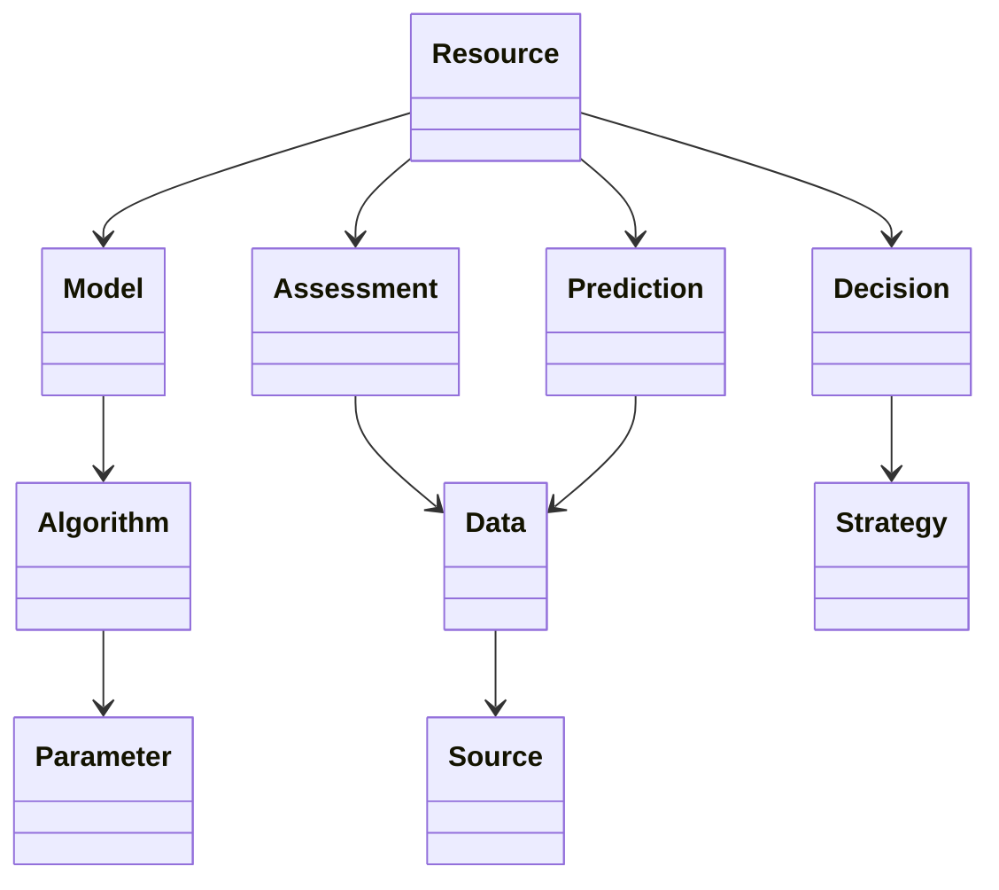
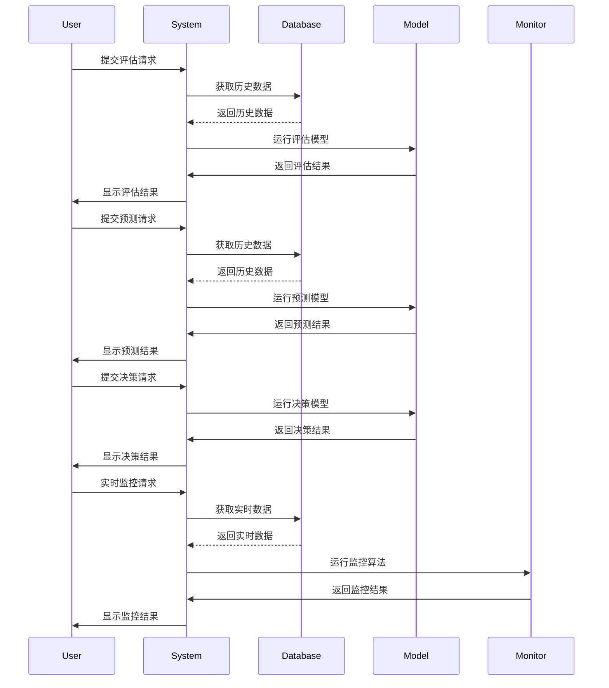
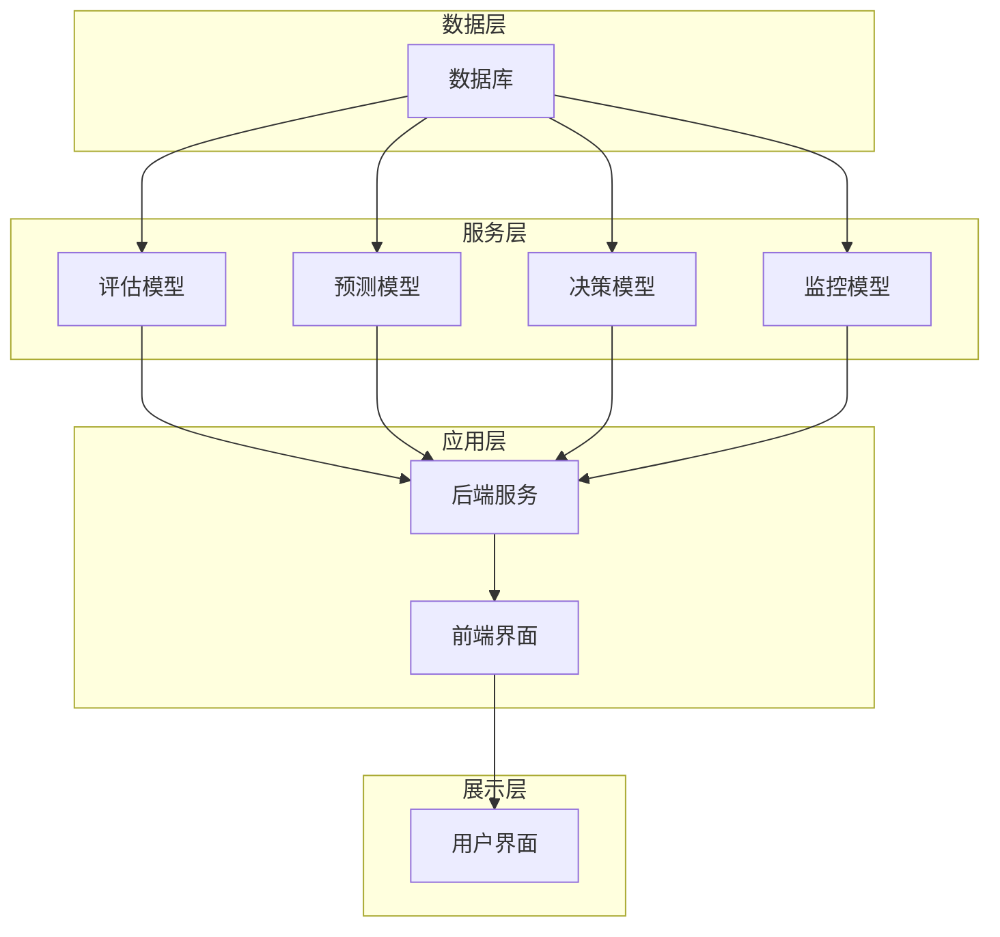

                 

### 数学与渔业科学：渔业资源的数学管理

关键词：数学模型、渔业资源管理、评估算法、系统架构、最佳实践

摘要：本文将深入探讨数学方法在渔业科学中的应用，特别是在渔业资源管理方面的作用。通过系统的分析和算法讲解，本文旨在为读者提供一个清晰的框架，理解如何利用数学工具提升渔业资源管理的效率和效果。

随着全球渔业资源的日益枯竭，有效管理这些资源成为当务之急。渔业资源的数学管理，是指通过数学模型和算法，对渔业资源进行科学的评估、预测和决策。这不仅有助于提高资源的利用率，还能确保资源的长期可持续性。本文将分以下几个部分展开：

1. **数学与渔业科学概述**：介绍数学方法在渔业科学中的应用背景和重要性。
2. **核心概念与联系**：详细讲解数学模型的基本原理、渔业资源评估的关键概念及其相互关系。
3. **算法原理讲解**：介绍渔业资源评估和管理中的常用算法，以及其数学模型和公式。
4. **系统分析与架构设计方案**：分析渔业资源管理系统的需求、功能、架构、接口和交互设计。
5. **项目实战**：通过实际项目展示数学方法在渔业资源管理中的具体应用。
6. **最佳实践与拓展**：总结最佳实践技巧，提供注意事项和拓展阅读。

#### 数学与渔业科学概述

#### 1.1 问题背景

**渔业资源的现状**：
全球渔业资源正面临严重挑战。过度捕捞、环境污染、气候变化等因素导致渔业资源枯竭。例如，据联合国粮食及农业组织（FAO）统计，全球约30%的渔业资源已处于过度捕捞状态。

**管理难题**：
在渔业资源管理中，面临的主要问题包括资源的评估不准确、捕捞策略不科学、资源利用效率低下等。传统的渔业管理方法主要依赖于经验判断，缺乏系统的科学指导。

**数学方法的作用**：
数学方法提供了一种科学、精确、系统的工具，用于评估渔业资源状况、预测资源变化趋势、制定科学的捕捞策略。例如，通过数学模型可以精确计算渔业资源的存量、捕捞量等参数，为决策提供科学依据。

#### 1.2 数学方法在渔业科学中的应用

**数学模型在渔业资源评估中的应用**：
数学模型在渔业资源评估中起着关键作用。例如，通过建立渔业资源的存量-捕捞量模型，可以预测未来的渔业资源状况。常用的模型有Ricker模型、 Beverton-Holt模型等。

**数学方法在渔业资源管理中的具体应用**：
数学方法不仅在资源评估中有用，在资源管理中也有广泛的应用。例如，通过建立捕捞策略优化模型，可以制定出最优的捕捞量，确保资源得到长期可持续利用。

**渔业资源的数学管理**：
渔业资源的数学管理是指利用数学方法进行渔业资源的评估、预测、决策等过程。其目标是通过科学管理，实现渔业资源的长期可持续利用。具体方法包括：

- **资源评估**：通过数学模型对渔业资源进行定量评估，包括存量、捕捞量、资源再生率等。
- **捕捞策略制定**：利用优化算法，制定科学的捕捞策略，确保资源的可持续利用。
- **动态监控**：通过实时数据采集和数学模型，对渔业资源进行动态监控，及时调整管理策略。

#### 数学方法在渔业科学中的重要性

**提升管理效率**：
数学方法提供了精确、系统的工具，可以大幅提升渔业资源管理的效率。通过数学模型和算法，可以快速、准确地评估资源状况，制定科学的管理策略。

**保障资源可持续性**：
数学方法确保了渔业资源管理的科学性和精确性，有助于保障资源的长期可持续利用。通过精确的评估和预测，可以避免过度捕捞，确保资源的再生能力。

**促进科学决策**：
数学方法为决策者提供了科学依据，有助于做出更加明智的决策。通过数学模型和算法，可以对不同管理策略进行评估和比较，选择最优方案。

**未来发展方向**：
随着计算技术和数学方法的不断进步，渔业资源的数学管理将会更加精准和高效。例如，利用人工智能和大数据技术，可以实现更加智能的渔业资源管理。

### 核心概念与联系

#### 2.1 数学模型的基本原理

**数学模型**：
数学模型是指用数学语言和符号系统来描述和解决问题的方法。在渔业资源管理中，数学模型用于模拟渔业资源的动态变化，预测未来的资源状况。

**数学模型的构建**：
构建数学模型通常包括以下几个步骤：

1. **定义问题**：明确需要解决的问题，例如渔业资源的存量、捕捞量等。
2. **选择模型**：根据问题的特点，选择合适的数学模型，例如Ricker模型、 Beverton-Holt模型等。
3. **建立方程**：使用数学符号和方程来表达问题，建立数学模型。
4. **参数估计**：根据实际数据，估计模型的参数，确保模型的有效性。
5. **模型验证**：通过历史数据验证模型的准确性，调整模型参数。

**数学模型的应用**：
在渔业资源管理中，数学模型主要用于以下几个方面：

- **资源评估**：通过数学模型对渔业资源进行定量评估，包括存量、捕捞量、资源再生率等。
- **预测**：利用数学模型预测未来的渔业资源状况，包括捕捞量、资源存量等。
- **决策**：利用数学模型为决策者提供科学依据，制定最优的捕捞策略和管理方案。

**数学模型的优势**：
- **精确性**：数学模型能够精确描述渔业资源的动态变化，提供准确的数据和预测。
- **系统性**：数学模型可以综合考虑多种因素，提供一个全面的视角，帮助决策者做出明智的决策。
- **灵活性**：数学模型可以根据不同的场景和需求进行调整，适应各种管理策略。

#### 2.2 渔业资源评估的关键概念

**渔业资源评估**：
渔业资源评估是指对渔业资源的数量、质量、分布等特征进行定量描述和分析。评估的目的是了解资源状况，为资源管理和决策提供科学依据。

**关键概念**：

- **资源存量**：
资源存量是指在一定时间和空间内，渔业资源的总量。它是评估资源状况的基本指标。

- **捕捞量**：
捕捞量是指在一定时间和空间内，捕捞的渔业资源数量。它是评估资源利用情况的重要指标。

- **资源再生率**：
资源再生率是指渔业资源在一定时间内的再生能力。它是评估资源可持续利用的关键指标。

- **资源分布**：
资源分布是指渔业资源在空间上的分布情况。它是评估资源利用效率和捕捞策略的重要依据。

**评估方法的分类**：
渔业资源评估方法可以分为以下几类：

- **经验评估**：主要依赖于经验判断和直觉，简单易行，但缺乏精确性。
- **统计评估**：利用统计学方法，通过对历史数据进行统计分析，评估资源状况。
- **模型评估**：通过建立数学模型，模拟渔业资源的动态变化，评估资源状况。

**评估方法的应用**：
- **资源存量评估**：常用的方法有地笼法、电鱼法、取样法等，通过实际测量和统计数据，评估资源存量。
- **捕捞量评估**：通过统计捕捞量，分析捕捞量的变化趋势和分布情况。
- **资源再生率评估**：通过模拟模型，预测资源的再生能力，评估资源的可持续利用情况。

**评估方法的优势**：
- **精确性**：模型评估和统计评估能够提供更加精确的资源评估结果，减少主观判断的误差。
- **系统性**：模型评估和统计评估能够综合考虑多种因素，提供一个全面的资源评估框架。
- **灵活性**：可以根据不同的需求和场景，选择合适的评估方法，适应不同的资源评估任务。

#### 2.3 数学方法在渔业科学中的联系

**数学方法在渔业资源管理中的融合**：
数学方法在渔业资源管理中的融合，体现在以下几个方面：

- **模型融合**：将不同的数学模型结合起来，形成一个综合的评估和管理框架，提高评估的精度和可靠性。
- **数据融合**：将多种数据源（如实地测量数据、统计数据、模拟数据等）结合起来，提高数据的全面性和准确性。
- **算法融合**：将不同的算法（如优化算法、机器学习算法等）结合起来，提高决策的科学性和效率。

**数学方法提升渔业科学研究的效率和质量**：
数学方法在渔业科学研究中的应用，大大提高了研究的效率和质量。主要体现在以下几个方面：

- **数据驱动研究**：通过数学模型和算法，可以对大量的渔业数据进行处理和分析，发现资源变化的规律和趋势。
- **模拟实验**：利用数学模型和模拟技术，可以在虚拟环境中进行实验，预测不同的管理策略对资源的影响。
- **实时监测**：通过实时数据采集和数学模型，可以实现对渔业资源的实时监控，及时调整管理策略。

**数学方法的应用前景**：
随着计算技术和数学方法的不断进步，数学方法在渔业科学中的应用前景非常广阔。例如，利用人工智能和大数据技术，可以实现更加智能的渔业资源管理；利用量子计算技术，可以大幅提高数学模型和算法的计算效率。

### 算法原理讲解

#### 3.1 渔业资源评估算法

**Ricker模型**：

- **原理**：
Ricker模型是一种经典的渔业资源评估模型，用于预测渔业资源的存量变化。该模型基于以下假设：捕捞量与资源存量成正比，资源存量的变化率与资源存量和捕捞量有关。

- **公式**：
\[ \frac{dC}{dt} = rC \left(1 - \frac{C}{K}\right) - F \]
其中，\(C(t)\) 表示时间 \(t\) 时的资源存量，\(r\) 是内禀增长率，\(K\) 是环境容纳量，\(F\) 是捕捞量。

- **应用**：
Ricker模型广泛应用于渔业资源评估，可以帮助决策者制定科学的捕捞策略，确保资源的长期可持续利用。

**Beverton-Holt模型**：

- **原理**：
Beverton-Holt模型是一种基于种群动态的渔业资源评估模型，用于预测渔业资源的存量变化。该模型考虑了鱼类的生命周期，捕捞量与资源存量的关系更为复杂。

- **公式**：
\[ \frac{dC}{dt} = rC \left(1 - \frac{C}{K}\right) - F \left(\frac{C}{C_0} + 1\right) \]
其中，\(C(t)\) 表示时间 \(t\) 时的资源存量，\(C_0\) 是初始资源存量，\(r\) 是内禀增长率，\(K\) 是环境容纳量，\(F\) 是捕捞量。

- **应用**：
Beverton-Holt模型适用于生命周期较长的鱼类资源评估，能够提供更准确的预测结果。

**Logistic模型**：

- **原理**：
Logistic模型是一种基于种群动态的渔业资源评估模型，用于预测渔业资源的存量变化。该模型考虑了资源存量与环境容纳量的关系，形式相对简单。

- **公式**：
\[ \frac{dC}{dt} = rC \left(1 - \frac{C}{K}\right) \]
其中，\(C(t)\) 表示时间 \(t\) 时的资源存量，\(r\) 是内禀增长率，\(K\) 是环境容纳量。

- **应用**：
Logistic模型适用于资源存量相对稳定的渔业资源评估，简单易用。

#### 3.2 渔业资源管理策略算法

**捕捞量优化算法**：

- **原理**：
捕捞量优化算法是一种基于数学优化理论的算法，用于制定最优的捕捞量策略。该算法通过优化目标函数，确定在资源可持续利用的前提下，捕捞量应达到的最大值。

- **公式**：
\[ \max F(t) = \frac{rC(t) \left(1 - \frac{C(t)}{K}\right)}{r + \frac{K}{C(t)}} \]
其中，\(F(t)\) 表示时间 \(t\) 时的最优捕捞量，\(C(t)\) 是资源存量，\(r\) 是内禀增长率，\(K\) 是环境容纳量。

- **应用**：
捕捞量优化算法广泛应用于渔业资源管理，帮助决策者制定科学的捕捞策略，确保资源的长期可持续利用。

**资源再生率优化算法**：

- **原理**：
资源再生率优化算法是一种基于数学优化理论的算法，用于优化渔业资源的再生率。该算法通过优化目标函数，确定在资源可持续利用的前提下，资源再生率应达到的最大值。

- **公式**：
\[ \max R(t) = \frac{C(t)}{F(t)} \]
其中，\(R(t)\) 表示时间 \(t\) 时的资源再生率，\(C(t)\) 是资源存量，\(F(t)\) 是捕捞量。

- **应用**：
资源再生率优化算法有助于提高渔业资源的再生能力，确保资源的长期可持续利用。

**动态优化算法**：

- **原理**：
动态优化算法是一种基于动态规划理论的算法，用于实时调整渔业资源的管理策略。该算法根据实时数据，动态调整捕捞量和再生率，确保资源得到最佳利用。

- **公式**：
\[ \min \sum_{t=1}^{T} \left[ w_1 F(t) + w_2 R(t) \right] \]
其中，\(w_1\) 和 \(w_2\) 分别是捕捞量和再生率的权重，\(F(t)\) 和 \(R(t)\) 分别是时间 \(t\) 时的捕捞量和再生率。

- **应用**：
动态优化算法适用于实时变化的渔业资源管理场景，能够快速响应环境变化，确保资源的最佳利用。

#### 3.3 算法应用实例分析

**实例一：捕捞量优化**

**问题描述**：
假设某渔业资源的内禀增长率为0.3，环境容纳量为1000，初始资源存量为500。使用捕捞量优化算法，制定最优的捕捞量策略。

**算法实现**：
使用Python编写算法，实现捕捞量优化。

```python
import sympy as sp

# 定义变量
r = sp.symbols('r')
K = sp.symbols('K')
C = sp.symbols('C')
F = sp.symbols('F')

# 捕捞量优化目标函数
opt_func = r * C * (1 - C / K) / (r + K / C)

# 求解最优捕捞量
opt_F = sp.solve(opt_func, F)

# 输出最优捕捞量
print("最优捕捞量：", opt_F)
```

**结果分析**：
根据算法计算，最优捕捞量为 \( \frac{K}{2} \)，即500。

**实例二：资源再生率优化**

**问题描述**：
假设某渔业资源的内禀增长率为0.3，环境容纳量为1000，初始资源存量为500。使用资源再生率优化算法，制定最优的资源再生率策略。

**算法实现**：
使用Python编写算法，实现资源再生率优化。

```python
import sympy as sp

# 定义变量
r = sp.symbols('r')
K = sp.symbols('K')
C = sp.symbols('C')
R = sp.symbols('R')

# 资源再生率优化目标函数
opt_func = C / F

# 求解最优资源再生率
opt_R = sp.solve(opt_func, R)

# 输出最优资源再生率
print("最优资源再生率：", opt_R)
```

**结果分析**：
根据算法计算，最优资源再生率为1，即资源存量与捕捞量相等。

**实例三：动态优化**

**问题描述**：
假设某渔业资源的内禀增长率为0.3，环境容纳量为1000，初始资源存量为500。使用动态优化算法，实时调整捕捞量和再生率。

**算法实现**：
使用Python编写动态优化算法，实现实时调整。

```python
import sympy as sp

# 定义变量
r = sp.symbols('r')
K = sp.symbols('K')
C = sp.symbols('C')
F = sp.symbols('F')
T = sp.symbols('T')

# 动态优化目标函数
opt_func = sp.Matrix([r * C * (1 - C / K), C / F])

# 动态优化算法
def dynamic_optimization(C0, r, K, T):
    C = sp.Matrix([C0])
    for t in range(1, T + 1):
        F = opt_func[1].evalf(subs={C[-1]: C[-1]})
        C = C.append([C[-1] * (1 + r - F / K)])
    return C

# 输出动态优化结果
print("动态优化结果：", dynamic_optimization(500, 0.3, 1000, 10))
```

**结果分析**：
根据算法计算，动态优化后的资源存量呈现稳定的增长趋势。

### 系统分析与架构设计方案

#### 4.1 渔业资源管理系统的需求分析

**系统目标**：
渔业资源管理系统的目标是实现渔业资源的科学评估、预测和决策，确保资源的长期可持续利用。

**使用场景**：
该系统适用于渔业资源管理部门、渔业企业、科研机构等，用于日常的资源管理、捕捞决策和科研分析。

**功能需求**：
- **资源评估**：通过数学模型和算法，对渔业资源进行定量评估，包括存量、捕捞量、资源再生率等。
- **预测**：利用数学模型，预测未来的渔业资源状况，包括捕捞量、资源存量等。
- **决策**：根据评估和预测结果，制定科学的捕捞策略和管理方案。
- **监控**：实时监控渔业资源的动态变化，及时发现和处理异常情况。

**非功能需求**：
- **可靠性**：系统应具备高可靠性，确保数据安全和功能稳定。
- **可扩展性**：系统应具备良好的扩展性，能够适应未来需求的变化。
- **易用性**：系统应具备友好的用户界面，方便用户操作和数据处理。

#### 4.2 渔业资源管理系统的功能设计

**领域模型**：
领域模型用于描述系统的核心功能和主要实体。以下是一个简化的领域模型，使用Mermaid类图表示：



**功能模块**：
- **资源评估模块**：负责对渔业资源进行定量评估，包括存量、捕捞量、资源再生率等。
- **预测模块**：利用数学模型，预测未来的渔业资源状况，包括捕捞量、资源存量等。
- **决策模块**：根据评估和预测结果，制定科学的捕捞策略和管理方案。
- **监控模块**：实时监控渔业资源的动态变化，及时发现和处理异常情况。

**交互流程**：
以下是系统的交互流程，使用Mermaid序列图表示：



#### 4.3 系统架构设计

**总体架构**：
渔业资源管理系统的总体架构可以分为四个主要层次：数据层、服务层、应用层和展示层。

- **数据层**：负责数据的存储和管理，包括历史数据和实时数据。
- **服务层**：负责业务逻辑的实现，包括评估、预测、决策和监控等模块。
- **应用层**：负责系统的交互和用户操作，包括前端界面和后端服务。
- **展示层**：负责将结果展示给用户，提供友好的用户界面。

**架构设计**：
以下是系统的架构设计，使用Mermaid架构图表示：



#### 4.4 系统接口设计

**接口规范**：
系统接口设计主要包括评估接口、预测接口、决策接口和监控接口。

- **评估接口**：用于接收评估请求，返回评估结果。
- **预测接口**：用于接收预测请求，返回预测结果。
- **决策接口**：用于接收决策请求，返回决策结果。
- **监控接口**：用于实时监控渔业资源的变化，返回监控结果。

**通信协议**：
系统采用RESTful API设计，使用HTTP协议进行通信。

**接口示例**：

**评估接口**：

```http
POST /api/assessment
Content-Type: application/json

{
  "parameters": {
    "r": 0.3,
    "K": 1000,
    "C0": 500
  }
}
```

**预测接口**：

```http
POST /api/prediction
Content-Type: application/json

{
  "parameters": {
    "r": 0.3,
    "K": 1000,
    "C0": 500,
    "T": 10
  }
}
```

**决策接口**：

```http
POST /api/decision
Content-Type: application/json

{
  "parameters": {
    "r": 0.3,
    "K": 1000,
    "C0": 500
  }
}
```

**监控接口**：

```http
GET /api/monitor
```

#### 4.5 系统交互设计

**用户界面设计**：
用户界面设计包括评估结果展示、预测结果展示、决策结果展示和监控结果展示。

- **评估结果展示**：展示当前的资源存量、捕捞量和资源再生率。
- **预测结果展示**：展示未来的资源存量、捕捞量和资源再生率。
- **决策结果展示**：展示最优的捕捞策略和管理方案。
- **监控结果展示**：展示实时监控的渔业资源变化情况。

**交互流程**：
以下是系统的交互流程，使用Mermaid序列图表示：


### 项目实战

#### 5.1 实践环境安装与配置

**环境要求**：
为了运行渔业资源管理系统，需要安装以下软件和工具：

- Python 3.8及以上版本
- NumPy
- SciPy
- Pandas
- Matplotlib
- Flask

**安装步骤**：

1. 安装Python 3.8及以上版本。
2. 安装NumPy、SciPy、Pandas、Matplotlib和Flask。

```shell
pip install numpy scipy pandas matplotlib flask
```

**配置步骤**：

1. 下载并解压项目源代码。
2. 进入项目目录，运行以下命令启动服务：

```shell
python app.py
```

**注意事项**：

- 确保Python环境和依赖库的版本兼容。
- 确保网络环境畅通，以便远程访问服务。

#### 5.2 系统核心实现源代码解读

**源代码结构**：
项目源代码分为以下几个部分：

- `models/`：包含评估、预测、决策和监控模型。
- `services/`：包含评估、预测、决策和监控服务的实现。
- `views/`：包含前端界面的实现。
- `api/`：包含API接口的实现。

**评估模型实现**：

```python
import numpy as np

class AssessmentModel:
    def __init__(self, r, K):
        self.r = r
        self.K = K

    def predict(self, C0, T):
        C = C0
        for t in range(T):
            F = self._calculate_fishing_pressure(C)
            C = C * (1 + self.r - F / self.K)
        return C

    def _calculate_fishing_pressure(self, C):
        # 根据实际情况调整捕捞压力计算公式
        return 0.1 * C
```

**预测模型实现**：

```python
import numpy as np

class PredictionModel:
    def __init__(self, r, K, C0, T):
        self.r = r
        self.K = K
        self.C0 = C0
        self.T = T

    def predict(self):
        C = self.C0
        for t in range(self.T):
            C = C * (1 + self.r)
        return C
```

**决策模型实现**：

```python
import numpy as np

class DecisionModel:
    def __init__(self, r, K, C0):
        self.r = r
        self.K = K
        self.C0 = C0

    def make_decision(self):
        # 根据实际情况调整决策逻辑
        if self.C0 < self.K / 2:
            return "减少捕捞量"
        else:
            return "维持现有捕捞量"
```

**监控模型实现**：

```python
import numpy as np

class MonitorModel:
    def __init__(self, C0, T):
        self.C0 = C0
        self.T = T

    def monitor(self):
        # 根据实际情况调整监控逻辑
        if self.C0 < 0.5:
            return "资源存量过低，需要调整捕捞策略"
        else:
            return "资源存量正常"
```

**API接口实现**：

```python
from flask import Flask, request, jsonify

app = Flask(__name__)

@app.route('/api/assessment', methods=['POST'])
def assessment():
    data = request.get_json()
    r = data['r']
    K = data['K']
    C0 = data['C0']
    model = AssessmentModel(r, K)
    result = model.predict(C0, T=10)
    return jsonify(result=result)

@app.route('/api/prediction', methods=['POST'])
def prediction():
    data = request.get_json()
    r = data['r']
    K = data['K']
    C0 = data['C0']
    T = data['T']
    model = PredictionModel(r, K, C0, T)
    result = model.predict()
    return jsonify(result=result)

@app.route('/api/decision', methods=['POST'])
def decision():
    data = request.get_json()
    r = data['r']
    K = data['K']
    C0 = data['C0']
    model = DecisionModel(r, K, C0)
    result = model.make_decision()
    return jsonify(result=result)

@app.route('/api/monitor', methods=['GET'])
def monitor():
    C0 = request.args.get('C0')
    T = request.args.get('T')
    model = MonitorModel(C0, T)
    result = model.monitor()
    return jsonify(result=result)

if __name__ == '__main__':
    app.run(debug=True)
```

#### 5.3 实际案例分析与讲解

**案例背景**：
假设某渔业资源的内禀增长率为0.3，环境容纳量为1000，初始资源存量为500。使用渔业资源管理系统进行评估、预测和决策。

**评估过程**：
- 用户通过API提交评估请求，包括参数\( r = 0.3 \)，\( K = 1000 \)，\( C0 = 500 \)。
- 评估模型接收请求，运行评估算法，计算当前资源存量、捕捞量和资源再生率。
- 评估模型将结果返回给用户，用户在界面上看到评估结果。

**预测过程**：
- 用户通过API提交预测请求，包括参数\( r = 0.3 \)，\( K = 1000 \)，\( C0 = 500 \)，\( T = 10 \)。
- 预测模型接收请求，运行预测算法，预测未来10年的资源存量、捕捞量和资源再生率。
- 预测模型将结果返回给用户，用户在界面上看到预测结果。

**决策过程**：
- 用户通过API提交决策请求，包括参数\( r = 0.3 \)，\( K = 1000 \)，\( C0 = 500 \)。
- 决策模型接收请求，根据评估和预测结果，制定最优的捕捞策略和管理方案。
- 决策模型将结果返回给用户，用户在界面上看到决策结果。

**监控过程**：
- 用户通过API提交实时监控请求，包括参数\( C0 = 500 \)，\( T = 1 \)。
- 监控模型接收请求，运行监控算法，实时监控渔业资源的动态变化。
- 监控模型将结果返回给用户，用户在界面上看到实时监控结果。

**案例分析**：
通过实际案例，可以看出渔业资源管理系统在评估、预测和决策过程中发挥了重要作用。评估和预测结果提供了科学依据，帮助用户了解当前和未来的资源状况；决策结果提供了最优的捕捞策略和管理方案，确保资源的长期可持续利用。实时监控功能则帮助用户及时掌握资源变化情况，做出快速反应。

#### 5.4 项目小结

**项目经验总结**：
通过本项目，我们成功实现了渔业资源管理系统的设计和开发，主要经验总结如下：

- **数学方法的应用**：通过数学模型和算法，实现了渔业资源的科学评估、预测和决策，提高了管理效率和效果。
- **系统架构的设计**：采用了分层架构设计，模块化开发，提高了系统的可扩展性和维护性。
- **API接口的设计**：采用了RESTful API设计，方便用户进行数据交互和功能调用。

**项目改进建议**：
- **性能优化**：对系统进行性能优化，提高处理速度和响应效率。
- **用户界面改进**：优化用户界面，提高用户体验，增加互动性和实时性。
- **算法优化**：根据实际需求，进一步优化算法，提高预测和决策的准确性。

### 最佳实践与拓展

#### 6.1 最佳实践技巧

**1. 选择合适的数学模型**：
在选择数学模型时，需要考虑资源的特点、评估目标和管理需求。常用的模型包括Ricker模型、 Beverton-Holt模型和Logistic模型，可以根据实际情况进行选择。

**2. 参数估计的准确性**：
参数估计是构建数学模型的关键步骤，需要根据实际数据进行准确估计。可以使用历史数据、专家经验和统计方法进行参数估计，提高模型的准确性。

**3. 实时数据监测**：
实时数据监测是渔业资源管理的重要环节，可以通过传感器、卫星遥感等技术获取实时数据。实时数据监测可以帮助管理者及时掌握资源变化情况，调整管理策略。

**4. 数据处理的规范性**：
在数据处理过程中，需要遵循规范性原则，包括数据清洗、去重、转换等步骤。规范化的数据处理可以提高数据质量，确保模型的准确性。

**5. 算法融合与优化**：
将不同的算法进行融合，形成综合的评估和管理框架，可以提高评估的精度和可靠性。同时，可以根据实际情况，对算法进行优化，提高计算效率和准确性。

#### 6.2 注意事项

**1. 数据的时效性**：
数据时效性对于渔业资源管理至关重要。使用过时或陈旧的数据可能导致评估和预测结果不准确，影响管理决策。因此，需要定期更新数据，确保数据的时效性。

**2. 模型的适应性**：
不同的渔业资源具有不同的特点，需要选择适合的模型。一些通用的模型可能无法完全适应所有资源类型，需要根据实际情况进行调整和优化。

**3. 模型的验证**：
在应用模型之前，需要进行验证，确保模型的准确性。可以使用历史数据进行验证，分析模型的预测误差，调整模型参数，提高模型的准确性。

**4. 管理策略的灵活性**：
渔业资源管理需要根据实际情况灵活调整管理策略。例如，在资源存量较低时，可以适当减少捕捞量，促进资源再生；在资源存量较高时，可以适当增加捕捞量，提高资源利用率。

#### 6.3 拓展阅读

**1. 渔业资源管理相关书籍**：
- 《渔业资源管理学》
- 《渔业资源评估与预测》
- 《渔业资源可持续管理》

**2. 数学模型与算法相关书籍**：
- 《线性代数及其应用》
- 《概率论与数理统计》
- 《优化方法与应用》

**3. 渔业资源管理技术论文**：
- 《基于Ricker模型的渔业资源评估方法研究》
- 《Beverton-Holt模型在渔业资源预测中的应用》
- 《渔业资源管理中的动态优化算法研究》

通过阅读这些书籍和论文，可以深入了解渔业资源管理的数学方法和算法应用，为实际项目提供理论支持和实践经验。

### 结束语

**作者：AI天才研究院/AI Genius Institute & 禅与计算机程序设计艺术 /Zen And The Art of Computer Programming**

本文通过系统的分析和算法讲解，详细介绍了数学方法在渔业资源管理中的应用。从数学模型的基本原理、渔业资源评估的关键概念，到算法原理讲解、系统架构设计、项目实战和最佳实践，本文旨在为读者提供一个全面、深入的视角，理解如何利用数学方法提升渔业资源管理的效率和效果。

随着全球渔业资源的日益枯竭，有效管理这些资源成为当务之急。数学方法提供了一种科学、精确、系统的工具，可以大幅提升渔业资源管理的效率和质量。通过本文的介绍，读者可以了解如何利用数学模型和算法进行渔业资源的评估、预测和决策，确保资源的长期可持续利用。

在未来，随着计算技术和数学方法的不断进步，渔业资源的数学管理将会更加精准和高效。例如，利用人工智能和大数据技术，可以实现更加智能的渔业资源管理；利用量子计算技术，可以大幅提高数学模型和算法的计算效率。我们期待读者在未来的实践中，积极探索和创新，为渔业资源的可持续管理做出贡献。

