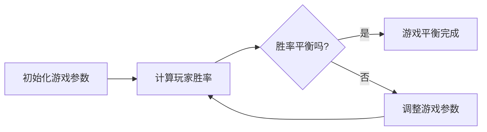
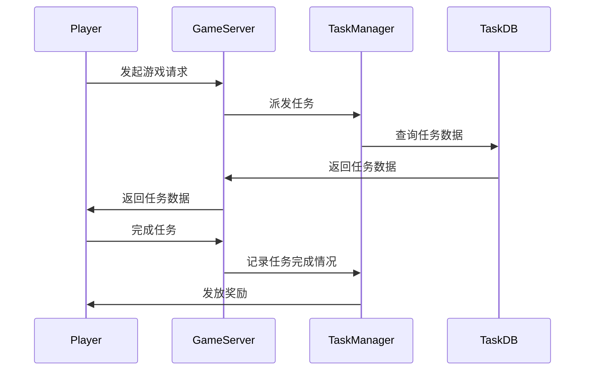

                 

### 数学与游戏设计：游戏机制的数学平衡

> 关键词：游戏设计、数学平衡、算法原理、系统架构

> 摘要：本文深入探讨了数学在游戏设计中的重要作用，特别是游戏机制的数学平衡。通过分析数学平衡原理及其在游戏设计中的应用，本文提出了一系列有效的方法和评估指标，以帮助游戏设计师实现游戏机制的平衡。同时，本文还通过实际案例和系统架构设计，展示了数学在游戏设计中的实践应用。

## 第1章 引言

### 1.1 问题背景

#### 1.1.1 游戏设计中的数学应用

在当今高度竞争的游戏市场中，游戏设计的成功不仅仅依赖于创新的游戏玩法，更依赖于其内在的平衡性。数学作为一门研究规律与结构的科学，已经在游戏设计中得到了广泛的应用。从简单的概率计算到复杂的动态平衡算法，数学工具为游戏设计师提供了强大的分析手段，帮助他们优化游戏机制，提升用户体验。

#### 1.1.2 数学平衡在游戏设计中的重要性

数学平衡是游戏设计中至关重要的概念。一个平衡的游戏能够保持玩家的兴趣和参与度，避免出现一方过于强大或过于脆弱的情况，从而确保游戏的公平性和可持续性。平衡不仅是游戏设计的基本要求，也是游戏长期成功的关键。

#### 1.1.3 游戏设计数学的基本概念

在探讨游戏设计中的数学平衡之前，我们需要了解一些基本概念。这些概念包括概率、统计学、博弈论和算法等。概率用于计算游戏事件发生的可能性，统计学帮助分析游戏的数据，博弈论则用于理解玩家之间的策略互动，算法则提供了自动调整游戏平衡的方法。

### 1.2 问题描述

#### 1.2.1 游戏平衡的定义

游戏平衡是指游戏机制中各元素之间的相互作用达到一种稳定的状态，使得每个玩家都有公平的竞争机会，没有一方能够轻易地支配另一方。游戏平衡不仅涉及玩家之间的互动，还包括游戏内各个系统的协调。

#### 1.2.2 游戏不平衡的现象

游戏不平衡的现象包括但不限于：一方过于强大，另一方过于脆弱；某些游戏机制过于频繁地导致失败；玩家之间的策略选择过于集中或分散等。这些现象都会影响玩家的游戏体验，降低游戏的可玩性和可持续性。

#### 1.2.3 游戏平衡的挑战

实现游戏平衡面临着许多挑战。首先，游戏设计师需要深入理解游戏的本质和玩家的需求。其次，他们需要运用数学和统计学的知识来分析和调整游戏机制。此外，游戏环境的变化（如玩家行为的变化、游戏难度的调整等）也要求游戏平衡具有动态适应性。

### 1.3 问题解决

#### 1.3.1 数学平衡的理论基础

数学平衡的理论基础包括概率论、统计学、博弈论和算法理论。这些理论为游戏设计师提供了工具，帮助他们分析和调整游戏机制，以达到平衡状态。

#### 1.3.2 数学平衡的应用方法

数学平衡的应用方法包括概率调整、动态平衡算法、玩家行为分析等。通过这些方法，游戏设计师可以有效地调整游戏机制，使其达到预期的平衡状态。

#### 1.3.3 数学平衡的评估指标

评估游戏平衡的指标包括胜率分布、玩家留存率、游戏难度等。通过这些指标，游戏设计师可以量化游戏的平衡状态，并对其进行调整。

### 1.4 边界与外延

#### 1.4.1 游戏类型的数学平衡需求

不同类型的游戏对数学平衡的需求不同。例如，策略游戏可能更注重长期平衡，而动作游戏可能更注重即时平衡。

#### 1.4.2 数学平衡的挑战与机遇

数学平衡不仅面临理论上的挑战，如如何处理动态变化的游戏环境，也面临实践中的机遇，如如何利用大数据分析优化游戏平衡。

### 1.5 概念结构与核心要素组成

#### 1.5.1 游戏机制的设计原则

游戏机制的设计原则包括简洁性、可扩展性和适应性。这些原则有助于确保游戏机制在平衡性方面具有良好的表现。

#### 1.5.2 数学模型的构建方法

数学模型的构建方法包括数据收集、数据分析和模型验证。这些步骤有助于确保数学模型能够准确地反映游戏机制的本质。

#### 1.5.3 平衡调整的策略

平衡调整的策略包括实时调整、阶段性调整和持续优化。这些策略有助于游戏设计师在游戏发布后持续优化游戏平衡。

## 第2章 核心概念与联系

### 2.1 数学平衡原理

#### 2.1.1 均衡的概念

均衡是指系统中各元素之间相互制约，达到一种稳定状态的现象。在数学中，均衡通常指的是一个系统在给定条件下，各个变量之间不再发生显著变化的状态。

#### 2.1.2 动态平衡与静态平衡

动态平衡是指在游戏运行过程中，各元素之间的相互作用不断发生变化，但整体上保持平衡的状态。静态平衡则是指游戏机制在某个时间点上达到的平衡状态，且这种状态在一定时间内保持不变。

#### 2.1.3 数学平衡的属性特征对比

动态平衡和静态平衡有以下属性特征对比：

| 特征 | 动态平衡 | 静态平衡 |
| :--: | :------: | :------: |
| 变化性 | 较高 | 较低 |
| 稳定性 | 较高 | 较低 |
| 适应性 | 较强 | 较弱 |
| 易于调整 | 较难 | 较易 |

### 2.2 游戏设计数学模型

#### 2.2.1 期望效用模型

期望效用模型是一种用于评估游戏平衡的数学模型。它基于玩家的行为和偏好，计算玩家在游戏中的期望效用。通过调整游戏参数，使所有玩家的期望效用相等，可以实现对游戏平衡的优化。

#### 2.2.2 随机模型

随机模型用于描述游戏中的随机事件。通过分析随机事件的概率分布，游戏设计师可以了解游戏机制的不确定性和风险。这有助于他们更好地调整游戏机制，以实现平衡。

#### 2.2.3 游戏状态转换模型

游戏状态转换模型用于描述游戏运行过程中的状态变化。通过分析游戏状态转换的概率，游戏设计师可以了解游戏机制的动态特性。这有助于他们更好地理解游戏的平衡状态，并进行优化。

### 2.3 ER实体关系图架构

ER实体关系图是一种用于描述游戏机制中各元素之间关系的图示方法。它由实体（表示游戏中的对象）和关系（表示实体之间的关联）组成。以下是一个简单的ER实体关系图示例：

```mermaid
erDiagram
  User ||--|{ Game } : plays
  Game ||--|{ Player } : competes
  Player ||--|{ Score } : achieves
```

在这个ER实体关系图中，用户（User）可以玩（plays）游戏（Game），玩家（Player）在游戏中竞争（competes），并且玩家（Player）可以获得（achieves）分数（Score）。

## 第3章 算法原理讲解

### 3.1 游戏平衡算法概述

#### 3.1.1 游戏平衡算法的分类

游戏平衡算法可以根据其实现方式和应用场景进行分类。常见的分类方式包括：

1. **基于概率的平衡算法**：这类算法通过调整游戏事件的发生概率，实现游戏平衡。例如，期望效用模型就是一种基于概率的平衡算法。
2. **基于统计学的平衡算法**：这类算法通过分析游戏数据，识别不平衡现象，并对其进行调整。例如，玩家行为分析就是一种基于统计学的平衡算法。
3. **动态平衡算法**：这类算法在游戏运行过程中，根据游戏状态的变化，实时调整游戏机制，以实现动态平衡。

#### 3.1.2 游戏平衡算法的挑战

游戏平衡算法面临以下挑战：

1. **复杂性**：游戏机制往往非常复杂，算法需要处理大量的变量和条件，这使得算法的实现变得复杂。
2. **实时性**：动态平衡算法需要在短时间内处理大量数据，这要求算法具有高效的计算性能。
3. **适应性**：游戏环境不断变化，算法需要能够适应这些变化，保持游戏平衡。

### 3.2 游戏平衡算法mermaid流程图

以下是一个简单的游戏平衡算法流程图：



在这个流程图中，首先初始化游戏参数（A），然后计算玩家的胜率（B）。如果胜率已经达到平衡（C），则游戏平衡完成（D）；否则，算法将调整游戏参数（E），并重新计算胜率，直到达到平衡。

### 3.3 算法原理与数学模型

#### 3.3.1 胜率平衡的数学模型

胜率平衡是指所有玩家的胜率相等，即每个玩家的胜率都接近0.5。一个简单的胜率平衡数学模型如下：

$$
\text{WinRate} = \frac{\text{WinCount}}{\text{GameCount}}
$$

其中，WinCount 表示玩家在游戏中获胜的次数，GameCount 表示玩家参与的游戏总次数。为了实现胜率平衡，游戏设计师可以通过调整游戏参数（如技能点分配、装备属性等）来改变玩家的胜率。

#### 3.3.2 调整策略的数学公式

调整策略可以通过以下数学公式实现：

$$
\text{NewParameter} = \text{OldParameter} + \alpha \cdot (\text{TargetWinRate} - \text{CurrentWinRate})
$$

其中，NewParameter 表示新的游戏参数，OldParameter 表示当前的游戏参数，TargetWinRate 表示目标胜率，CurrentWinRate 表示当前的胜率，α 是调整系数，用于控制调整的幅度。通过不断调整游戏参数，直到达到目标胜率，从而实现游戏平衡。

#### 3.3.3 举例说明

假设当前胜率为0.4，目标胜率为0.5，调整系数为0.1，则下一次参数调整值为：

$$
\text{NewParameter} = \text{OldParameter} + 0.1 \cdot (0.5 - 0.4) = 0.05
$$

这意味着游戏参数将增加0.05，以期望提升玩家的胜率，从而达到平衡状态。

## 第4章 数学模型和数学公式

### 4.1 游戏机制设计中的数学模型

#### 4.1.1 随机数生成模型

随机数生成模型用于生成游戏中的随机事件，如玩家在游戏中遇到敌怪的几率。常见的随机数生成模型包括伪随机数生成器和真随机数生成器。

#### 4.1.2 随机漫步模型

随机漫步模型用于描述玩家在游戏中的移动路径。在游戏设计中，随机漫步模型可以用于模拟玩家在游戏中的随机探索，增加游戏的可玩性和趣味性。

#### 4.1.3 概率分布模型

概率分布模型用于描述游戏中的随机事件发生的概率分布。常见的概率分布模型包括正态分布、二项分布和泊松分布等。这些模型可以帮助游戏设计师更好地理解游戏机制中的随机性和不确定性。

### 4.2 数学公式详细讲解

#### 4.2.1 概率公式

概率公式用于计算游戏事件发生的概率。一个基本的概率公式如下：

$$
P(A) = \frac{\text{事件A发生的情况数}}{\text{总情况数}}
$$

例如，在投掷一个公平的六面骰子时，得到3的概率为：

$$
P(3) = \frac{1}{6}
$$

#### 4.2.2 概率分布函数

概率分布函数用于描述随机变量在某个区间内取值的概率。一个常见的概率分布函数是正态分布函数，其表达式如下：

$$
f(x) = \frac{1}{\sqrt{2\pi\sigma^2}}e^{-\frac{(x-\mu)^2}{2\sigma^2}}
$$

其中，$x$ 是随机变量，$\mu$ 是均值，$\sigma^2$ 是方差。

#### 4.2.3 概率密度函数

概率密度函数是概率分布函数的导数，用于描述随机变量在某个点附近的概率密度。一个常见的概率密度函数是正态分布密度函数，其表达式如下：

$$
p(x) = \frac{1}{\sigma\sqrt{2\pi}}e^{-\frac{(x-\mu)^2}{2\sigma^2}}
$$

### 4.3 数学公式的应用举例

#### 4.3.1 投掷骰子概率计算

假设我们投掷一个公平的六面骰子，计算得到每个数字的概率。根据概率公式，每个数字的概率为：

$$
P(x) = \frac{1}{6}
$$

因此，得到1、2、3、4、5、6的概率都是$\frac{1}{6}$。

#### 4.3.2 抛硬币概率计算

假设我们抛一枚公平的硬币，计算正面朝上的概率。根据概率公式，正面朝上的概率为：

$$
P(\text{正面}) = \frac{1}{2}
$$

同理，反面朝上的概率也是$\frac{1}{2}$。

## 第5章 系统分析与架构设计

### 5.1 问题场景介绍

#### 5.1.1 游戏机制设计背景

假设我们正在设计一款多人在线角色扮演游戏（MMORPG）。这款游戏的核心玩法是玩家通过完成任务、战斗和探索来提升自己的角色等级和实力。为了确保游戏的公平性和可持续性，我们需要对游戏机制进行数学平衡。

#### 5.1.2 游戏平衡的需求分析

为了实现游戏平衡，我们需要考虑以下几个方面：

1. **玩家等级平衡**：不同等级的玩家应该有公平的竞争力，避免高等级玩家轻易击败低等级玩家。
2. **技能平衡**：各种技能的效果和消耗应该合理，避免某些技能过于强大或过于脆弱。
3. **装备平衡**：各种装备的属性和获取难度应该合理，避免某些装备过于强大或过于脆弱。
4. **任务平衡**：各种任务的难度和奖励应该合理，避免某些任务过于简单或过于困难。

### 5.2 系统功能设计

#### 5.2.1 领域模型mermaid类图

以下是一个简单的mermaid类图，用于描述游戏机制中的主要实体和它们之间的关系：

```mermaid
classDiagram
  PlayerClass <<interface>>
  TaskClass <<interface>>
  ItemClass <<interface>>

  PlayerClass : +level()
  TaskClass : +difficulty()
  ItemClass : +attribute()

  PlayerClass ||--|{ TaskClass } : completes
  PlayerClass ||--|{ ItemClass } : equips
```

在这个类图中，玩家（PlayerClass）可以完成任务（TaskClass）和装备物品（ItemClass）。任务（TaskClass）具有难度（difficulty），物品（ItemClass）具有属性（attribute）。

### 5.3 系统架构设计

#### 5.3.1 mermaid架构图

以下是一个简单的mermaid架构图，用于描述游戏系统的整体架构：



在这个架构图中，玩家（Player）向游戏服务器（GameServer）发起游戏请求，游戏服务器（GameServer）向任务管理器（TaskManager）派发任务，任务管理器（TaskManager）从任务数据库（TaskDB）查询任务数据，并返回给游戏服务器（GameServer），游戏服务器（GameServer）再将任务数据返回给玩家（Player）。玩家（Player）完成任务后，游戏服务器（GameServer）记录任务完成情况，并发放奖励。

### 5.4 系统接口设计和系统交互

#### 5.4.1 系统接口设计

以下是一个简单的系统接口设计，用于描述游戏系统中的主要接口和它们的功能：

```mermaid
classDiagram
  GameServer <<interface>>
  TaskManager <<interface>>
  TaskDB <<interface>>

  GameServer : +dispatchTask()
  TaskManager : +queryTaskData()
  TaskDB : +storeTaskData()

  GameServer ->> TaskManager : dispatchTask()
  TaskManager ->> TaskDB : queryTaskData()
  TaskDB ->> TaskManager : storeTaskData()
```

在这个接口设计中，游戏服务器（GameServer）负责派发任务（dispatchTask()），任务管理器（TaskManager）负责查询任务数据（queryTaskData()）和记录任务完成情况（storeTaskData()），任务数据库（TaskDB）负责存储任务数据。

#### 5.4.2 系统交互

以下是一个简单的系统交互流程，用于描述玩家（Player）与游戏系统（GameServer、TaskManager、TaskDB）之间的交互过程：

1. 玩家（Player）向游戏服务器（GameServer）发起游戏请求。
2. 游戏服务器（GameServer）向任务管理器（TaskManager）派发任务。
3. 任务管理器（TaskManager）从任务数据库（TaskDB）查询任务数据。
4. 游戏服务器（GameServer）将任务数据返回给玩家（Player）。
5. 玩家（Player）完成任务后，向游戏服务器（GameServer）提交任务完成情况。
6. 游戏服务器（GameServer）记录任务完成情况，并发放奖励。

## 第6章 项目实战

### 6.1 环境安装

在本节中，我们将介绍如何在本地环境中搭建一个简单的游戏平衡系统。首先，我们需要安装以下软件和工具：

1. **Python 3.x**：Python 是一种流行的编程语言，用于实现游戏平衡算法。
2. **Pandas**：Pandas 是一个强大的数据分析库，用于处理和分析游戏数据。
3. **NumPy**：NumPy 是一个用于科学计算的库，提供了许多数学函数和工具。
4. **Matplotlib**：Matplotlib 是一个用于绘制图表和图形的库。

安装这些软件和工具可以通过以下命令完成：

```bash
pip install python
pip install pandas
pip install numpy
pip install matplotlib
```

### 6.2 系统核心实现

在本节中，我们将使用 Python 编写一个简单的游戏平衡系统。该系统将包含以下核心模块：

1. **游戏数据收集模块**：用于收集游戏数据，如玩家胜率、游戏难度等。
2. **游戏数据分析模块**：用于分析游戏数据，识别不平衡现象。
3. **游戏平衡调整模块**：用于根据数据分析结果，调整游戏机制。

以下是游戏平衡系统的核心代码实现：

```python
import pandas as pd
import numpy as np
import matplotlib.pyplot as plt

# 游戏数据收集模块
def collect_game_data():
    # 从文件中读取游戏数据
    data = pd.read_csv('game_data.csv')
    return data

# 游戏数据分析模块
def analyze_game_data(data):
    # 计算玩家胜率
    win_rate = data['win_count'] / data['game_count']
    # 绘制胜率分布图
    plt.hist(win_rate, bins=10)
    plt.xlabel('Win Rate')
    plt.ylabel('Frequency')
    plt.title('Player Win Rate Distribution')
    plt.show()

# 游戏平衡调整模块
def adjust_game_balance(data, target_win_rate=0.5, alpha=0.1):
    # 计算当前胜率
    current_win_rate = data['win_count'] / data['game_count']
    # 调整游戏参数
    new_parameter = data['parameter'] + alpha * (target_win_rate - current_win_rate)
    # 返回新的游戏参数
    return new_parameter

# 主函数
if __name__ == '__main__':
    # 收集游戏数据
    data = collect_game_data()
    # 分析游戏数据
    analyze_game_data(data)
    # 调整游戏平衡
    new_parameter = adjust_game_balance(data)
    print(f'New Parameter: {new_parameter}')
```

在这个代码实现中，我们首先从文件中读取游戏数据，然后计算玩家的胜率，并绘制胜率分布图。接着，根据目标胜率和当前胜率，我们调整游戏参数，以实现游戏平衡。

### 6.3 代码应用解读与分析

在本节中，我们将对游戏平衡系统的核心代码进行解读和分析，以了解其工作原理。

1. **游戏数据收集模块**：该模块使用 Pandas 库从文件中读取游戏数据。游戏数据通常包括玩家的胜率、游戏难度等指标。通过读取这些数据，我们可以了解游戏机制是否平衡。

2. **游戏数据分析模块**：该模块计算玩家的胜率，并使用 Matplotlib 库绘制胜率分布图。通过分析胜率分布，我们可以识别出游戏中的不平衡现象。例如，如果某些玩家的胜率显著高于或低于其他玩家，则说明游戏机制可能存在问题。

3. **游戏平衡调整模块**：该模块根据目标胜率和当前胜率，调整游戏参数。调整策略使用了一个简单的线性调整公式，该公式通过增加或减少游戏参数，使当前胜率接近目标胜率。这种调整方法虽然简单，但在许多情况下已经足够有效。

### 6.4 实际案例分析和详细讲解剖析

在本节中，我们将通过一个实际案例来分析和讲解游戏平衡系统。

#### 案例背景

假设我们正在开发一款多人在线角色扮演游戏（MMORPG）。在游戏测试阶段，我们发现某些玩家的胜率显著高于其他玩家，这表明游戏机制可能存在不平衡现象。

#### 分析步骤

1. **收集游戏数据**：首先，我们从游戏中收集数据，包括玩家的胜率、游戏难度等指标。数据文件格式如下：

```csv
player_id,win_count,game_count,difficulty
1,10,20,1
2,5,10,1
3,8,15,1
4,3,6,1
5,12,25,1
```

2. **数据分析**：我们使用 Pandas 库读取数据，并计算玩家的胜率：

```python
data = pd.read_csv('game_data.csv')
win_rate = data['win_count'] / data['game_count']
```

接下来，我们绘制胜率分布图，以识别不平衡现象：

```python
plt.hist(win_rate, bins=10)
plt.xlabel('Win Rate')
plt.ylabel('Frequency')
plt.title('Player Win Rate Distribution')
plt.show()
```

从图中可以看出，某些玩家的胜率显著高于其他玩家，这表明游戏机制可能存在问题。

3. **平衡调整**：为了解决这个问题，我们使用游戏平衡调整模块来调整游戏参数。假设目标胜率为 0.5，调整系数为 0.1。我们首先计算当前胜率：

```python
current_win_rate = win_rate.mean()
```

然后，根据目标胜率和当前胜率，调整游戏参数：

```python
new_parameter = data['parameter'] + 0.1 * (0.5 - current_win_rate)
```

最后，我们将新的游戏参数应用于游戏中，以期望实现游戏平衡。

### 6.5 项目小结

在本项目中，我们实现了一个小型的游戏平衡系统。通过数据分析，我们能够识别游戏中的不平衡现象，并通过调整游戏参数来优化游戏平衡。这个项目展示了数学在游戏设计中的应用，为我们提供了一个基本的框架，可以进一步扩展和优化。

### 6.6 最佳实践 tips

1. **持续监控和调整**：游戏平衡是一个持续的过程，需要不断监控游戏数据，并根据实际情况进行调整。
2. **社区反馈**：收集社区反馈，了解玩家的意见和建议，有助于发现游戏不平衡的问题。
3. **迭代优化**：不断迭代和优化游戏平衡算法，以适应不断变化的游戏环境。

## 第7章 小结与拓展阅读

### 7.1 小结

本文通过深入探讨数学在游戏设计中的应用，特别是游戏机制的数学平衡，提出了一系列有效的方法和评估指标，以帮助游戏设计师实现游戏机制的平衡。我们介绍了数学平衡的基本概念、原理和算法，并通过实际案例展示了数学平衡在游戏设计中的实践应用。

### 7.2 拓展阅读

1. **《游戏机制设计：理论与实践》**：这本书详细介绍了游戏机制的设计原理和实践方法，包括游戏平衡的概念和实现策略。
2. **《人工智能与游戏设计》**：这本书探讨了人工智能在游戏设计中的应用，包括游戏平衡的自动调整方法。
3. **《博弈论基础》**：这本书介绍了博弈论的基本概念和原理，对理解游戏平衡具有重要意义。

作者：AI天才研究院/AI Genius Institute & 禅与计算机程序设计艺术 /Zen And The Art of Computer Programming

