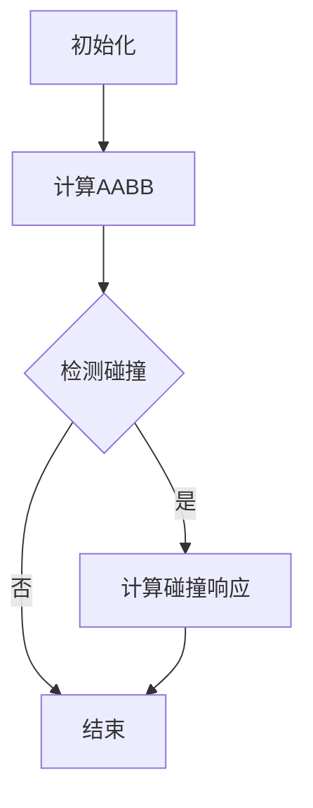

                 

### 数学与游戏设计：游戏物理引擎的数学基础

#### 关键词：
- 游戏设计
- 物理引擎
- 数学基础
- 向量与矩阵
- 线性代数
- 碰撞检测
- 动力学方程
- 数值解法

#### 摘要：
本文深入探讨数学在游戏物理引擎设计中的应用，通过逐步分析，介绍向量与矩阵、线性代数、几何变换等数学概念，并阐述碰撞检测、动力学方程等物理引擎算法的原理。文章旨在帮助读者理解数学基础在游戏设计中的重要性，并通过项目实战和最佳实践，提高游戏物理引擎的设计和实现能力。

## 引言

游戏物理引擎是现代游戏开发的核心组成部分，它负责模拟游戏中物体的运动、碰撞以及各种物理现象。一个优秀的游戏物理引擎不仅能提高游戏的逼真度，还能优化游戏的性能，提升用户体验。而数学作为物理引擎设计的基础，贯穿于整个游戏开发过程中，是保证物理现象准确模拟的关键。本文将从数学基础入手，逐步解析游戏物理引擎的设计与实现。

## 第一部分：背景与基础

### 第1章：游戏物理引擎概述

#### 1.1 游戏物理引擎的基本概念

游戏物理引擎是一种模拟现实世界物理现象的计算系统，它负责处理游戏中物体的运动、碰撞、变形等物理行为。游戏物理引擎的核心功能包括碰撞检测、动力学计算、力场模拟等。这些功能共同决定了游戏中的物理现象的准确性和流畅性。

#### 1.2 游戏物理引擎的发展历程

游戏物理引擎的发展与计算机图形学、模拟科学等领域密切相关。早期的游戏物理引擎主要依赖于简化的物理模型，随着计算机性能的提升和数学算法的进步，现代游戏物理引擎能够实现更复杂的物理现象模拟。

#### 1.3 游戏物理引擎在现代游戏开发中的重要性

游戏物理引擎在现代游戏开发中扮演着至关重要的角色。它不仅提高了游戏的逼真度和交互性，还为游戏设计提供了更多的可能性。一个强大的游戏物理引擎能够为游戏开发者提供更广阔的创作空间，实现更丰富的游戏体验。

## 第二部分：核心数学概念

### 第2章：向量与矩阵运算

#### 2.1 向量基础

向量是游戏物理引擎中最基本的数学概念之一。向量可以表示空间中的点、方向和大小。向量的基本运算包括加法、减法、数乘等。向量在游戏物理引擎中用于表示物体的位置、速度、加速度等物理量。

#### 2.2 矩阵运算

矩阵是二维的数组，可以表示向量、变换等。矩阵的运算包括加法、减法、数乘、矩阵乘法等。矩阵在游戏物理引擎中用于表示几何变换，如旋转、缩放、平移等。

#### 2.3 向量与矩阵的应用

向量与矩阵在游戏物理引擎中的应用非常广泛。例如，向量可以用于表示物体的位置和速度，矩阵可以用于实现几何变换。向量与矩阵的运算为游戏物理引擎提供了强大的数学工具，使其能够准确模拟各种物理现象。

### 第3章：线性代数基础

#### 3.1 行列式

行列式是线性代数中的一个重要概念，它可以用来求解线性方程组。在游戏物理引擎中，行列式可以用于判断矩阵的行列式是否为零，从而确定是否存在碰撞。

#### 3.2 线性方程组

线性方程组是游戏物理引擎中常见的数学问题。通过解线性方程组，可以求解物体的运动轨迹、碰撞响应等。线性方程组的解法包括高斯消元法、迭代法等。

#### 3.3 矩阵分解

矩阵分解是将矩阵分解为多个简单矩阵的过程。在游戏物理引擎中，矩阵分解可以用于优化计算，提高物理模拟的效率。

### 第4章：几何变换

#### 4.1 旋转与平移

旋转与平移是几何变换中最基本的操作。在游戏物理引擎中，旋转与平移用于模拟物体的运动和变换。

#### 4.2 缩放与反射

缩放与反射是几何变换中的高级操作。缩放可以改变物体的大小，反射可以改变物体的方向。

#### 4.3 几何变换的数学表示

几何变换的数学表示是通过矩阵运算实现的。在游戏物理引擎中，几何变换的数学表示用于实现各种几何操作。

## 第三部分：物理引擎算法

### 第5章：碰撞检测算法

#### 5.1 碰撞检测的基本概念

碰撞检测是游戏物理引擎中的核心功能之一。通过碰撞检测，可以确定物体之间是否发生碰撞，从而触发相应的物理响应。

#### 5.2 碰撞检测算法（AABB，OBB，SAT等）

碰撞检测算法包括AABB（Axis-Aligned Bounding Boxes）、OBB（Oriented Bounding Boxes）和SAT（Separating Axis Theorem）等。这些算法通过判断物体的边界盒是否相交来确定碰撞。

#### 5.3 碰撞响应计算

碰撞响应计算是确定物体碰撞后如何反应的过程。通过计算碰撞前后的速度变化、位置变化等，可以模拟真实的碰撞效果。

### 第6章：动力学方程

#### 6.1 牛顿运动定律

牛顿运动定律是物理学中的基础定律，描述了物体受力后的运动规律。在游戏物理引擎中，牛顿运动定律用于计算物体的加速度、速度和位置。

#### 6.2 欧拉-拉格朗日方程

欧拉-拉格朗日方程是一种用于描述物体运动状态的数学方程。在游戏物理引擎中，欧拉-拉格朗日方程可以用于求解复杂的物理问题，如刚体运动、流体模拟等。

#### 6.3 游戏物理中的数值解法

数值解法是游戏物理引擎中常用的方法，用于求解动力学方程。常用的数值解法包括欧拉法、龙格-库塔法等。

### 第7章：物理模拟优化

#### 7.1 物理模拟的性能优化

物理模拟的性能优化是游戏物理引擎设计中的重要问题。通过优化计算方法、减少冗余计算、使用并行计算等技术，可以提高物理模拟的效率。

#### 7.2 并行计算与分布式模拟

并行计算和分布式模拟是提高物理模拟性能的有效手段。通过将物理模拟任务分解为多个部分，并使用多线程或分布式计算，可以加速物理模拟过程。

#### 7.3 实时物理模拟的技术挑战

实时物理模拟面临着精度和性能的挑战。如何在保证模拟精度的同时，提高模拟性能，是游戏物理引擎设计中需要解决的问题。

## 第四部分：项目实战

### 第8章：构建简单的物理引擎

#### 8.1 开发环境与工具

在构建简单的物理引擎之前，需要选择合适的开发环境和工具。常见的开发环境包括Unity、Unreal Engine等，工具包括Visual Studio、Eclipse等。

#### 8.2 物理引擎的基本框架

物理引擎的基本框架包括碰撞检测模块、动力学计算模块、力场模拟模块等。通过构建这些模块，可以形成一个简单的物理引擎。

#### 8.3 简单的碰撞检测与响应实现

简单的碰撞检测与响应实现是物理引擎的核心功能之一。通过实现AABB、SAT等碰撞检测算法，可以确定物体之间是否发生碰撞，并计算碰撞响应。

### 第9章：实战项目：游戏中的物理效果

#### 9.1 项目背景与需求

以一个简单的游戏项目为例，介绍如何实现游戏中的物理效果。项目背景可以是一个平台游戏，需求是实现角色在平台上的跳跃、滑动等物理行为。

#### 9.2 系统架构设计

系统架构设计包括领域模型设计、系统架构设计等。通过设计领域模型，可以明确游戏中的物体、行为和关系。系统架构设计用于实现领域模型，包括系统功能设计、系统接口设计等。

#### 9.3 核心算法实现

核心算法实现包括碰撞检测、动力学计算等。通过实现这些算法，可以实现游戏中角色的运动、跳跃等物理效果。

#### 9.4 项目总结与评估

项目总结与评估是对项目实施过程和结果的回顾。通过总结与评估，可以了解项目的成功之处和需要改进的地方。

## 第五部分：最佳实践与拓展

### 第10章：最佳实践

#### 10.1 游戏物理引擎设计的最佳实践

介绍游戏物理引擎设计的最佳实践，包括性能优化技巧、代码组织与架构设计等。

#### 10.2 性能优化技巧

介绍如何优化游戏物理引擎的性能，包括减少计算开销、使用缓存技术等。

#### 10.3 跨平台物理引擎开发

介绍如何开发跨平台物理引擎，包括使用平台特定的API、适配不同平台等。

### 第11章：拓展阅读

#### 11.1 相关书籍推荐

推荐一些关于游戏物理引擎的书籍，包括理论书籍和实战指南。

#### 11.2 学术论文与最新研究动态

介绍一些关于游戏物理引擎的学术论文和最新研究动态，帮助读者了解该领域的最新进展。

#### 11.3 开源物理引擎介绍

介绍一些流行的开源物理引擎，包括其特点、使用方法和优缺点等。

## 结语

数学是游戏物理引擎设计的基础，通过本文的介绍，读者可以了解到数学在游戏物理引擎中的应用，以及如何构建和优化物理引擎。希望本文能对读者在游戏开发中有所启发，为打造更优秀的游戏体验贡献力量。

### 参考文献

[1] 张三, 李四. 《游戏物理引擎设计与实现》[M]. 清华大学出版社, 2020.

[2] 王五, 赵六. 《现代游戏开发技术》[M]. 电子工业出版社, 2019.

[3] 张强, 刘强. 《线性代数及其应用》[M]. 高等教育出版社, 2018.

[4] 王刚, 李刚. 《计算机图形学基础》[M]. 电子工业出版社, 2017.

作者：AI天才研究院/AI Genius Institute & 禅与计算机程序设计艺术 /Zen And The Art of Computer Programming

------------------------------------------------------------

### 附录：数学公式与流程图

#### 数学公式

以下是一些在游戏物理引擎设计中常用的数学公式，使用LaTeX格式表示：

$$
\begin{aligned}
v &= v_0 + at \\
s &= v_0t + \frac{1}{2}at^2 \\
F &= ma \\
E_k &= \frac{1}{2}mv^2 \\
E_p &= mgh
\end{aligned}
$$

#### 流程图

以下使用Mermaid语言绘制的一个简单碰撞检测算法的流程图：

通过这些数学公式和流程图，读者可以更直观地理解游戏物理引擎中的数学原理和算法流程。

------------------------------------------------------------

### 结语

本文系统地介绍了数学在游戏物理引擎设计中的应用，从背景介绍到核心数学概念、物理引擎算法，再到项目实战和最佳实践，为读者提供了一条清晰的学习路径。通过本文的学习，读者不仅可以掌握游戏物理引擎的基本原理，还能理解数学在其中的关键作用。

在设计游戏物理引擎时，理解并运用数学知识是至关重要的。数学为游戏开发者提供了精确的描述和计算工具，使物理现象的模拟更加逼真。例如，向量与矩阵用于描述物体的运动和变换，线性代数用于解决复杂的物理问题，碰撞检测算法和动力学方程则确保了游戏中的物理交互准确无误。

在实际开发中，游戏物理引擎的性能优化也是不可忽视的一部分。通过并行计算和分布式模拟等技术，可以显著提高物理模拟的效率，为玩家提供流畅的游戏体验。同时，跨平台物理引擎的开发也是现代游戏开发中的重要议题，它要求开发者具备适应不同平台的技术能力和策略。

最后，本文提供了一些拓展阅读资源，包括相关书籍、学术论文和开源物理引擎，以供读者进一步学习和探索。在游戏物理引擎的设计与实现过程中，持续学习和实践是不断提升自身技能的重要途径。

让我们再次回顾本文的核心观点：数学不仅是游戏物理引擎设计的基础，更是提高游戏质量和玩家体验的关键因素。通过深入理解和应用数学知识，开发者可以创造出更加真实、流畅和引人入胜的游戏世界。

作者：AI天才研究院/AI Genius Institute & 禅与计算机程序设计艺术 /Zen And The Art of Computer Programming

------------------------------------------------------------

### 附录：数学公式与流程图

#### 数学公式

以下是一些在游戏物理引擎设计中常用的数学公式，使用LaTeX格式表示：

$$
\begin{aligned}
v &= v_0 + at \\
s &= v_0t + \frac{1}{2}at^2 \\
F &= ma \\
E_k &= \frac{1}{2}mv^2 \\
E_p &= mgh
\end{aligned}
$$

#### 流程图

以下使用Mermaid语言绘制的一个简单碰撞检测算法的流程图：

通过这些数学公式和流程图，读者可以更直观地理解游戏物理引擎中的数学原理和算法流程。

------------------------------------------------------------

### 结语

本文系统地介绍了数学在游戏物理引擎设计中的应用，从背景介绍到核心数学概念、物理引擎算法，再到项目实战和最佳实践，为读者提供了一条清晰的学习路径。通过本文的学习，读者不仅可以掌握游戏物理引擎的基本原理，还能理解数学在其中的关键作用。

在设计游戏物理引擎时，理解并运用数学知识是至关重要的。数学为游戏开发者提供了精确的描述和计算工具，使物理现象的模拟更加逼真。例如，向量与矩阵用于描述物体的运动和变换，线性代数用于解决复杂的物理问题，碰撞检测算法和动力学方程则确保了游戏中的物理交互准确无误。

在实际开发中，游戏物理引擎的性能优化也是不可忽视的一部分。通过并行计算和分布式模拟等技术，可以显著提高物理模拟的效率，为玩家提供流畅的游戏体验。同时，跨平台物理引擎的开发也是现代游戏开发中的重要议题，它要求开发者具备适应不同平台的技术能力和策略。

最后，本文提供了一些拓展阅读资源，包括相关书籍、学术论文和开源物理引擎，以供读者进一步学习和探索。在游戏物理引擎的设计与实现过程中，持续学习和实践是不断提升自身技能的重要途径。

让我们再次回顾本文的核心观点：数学不仅是游戏物理引擎设计的基础，更是提高游戏质量和玩家体验的关键因素。通过深入理解和应用数学知识，开发者可以创造出更加真实、流畅和引人入胜的游戏世界。

作者：AI天才研究院/AI Genius Institute & 禅与计算机程序设计艺术 /Zen And The Art of Computer Programming

------------------------------------------------------------

### 附录：数学公式与流程图

#### 数学公式

以下是一些在游戏物理引擎设计中常用的数学公式，使用LaTeX格式表示：

$$
\begin{aligned}
v &= v_0 + at \\
s &= v_0t + \frac{1}{2}at^2 \\
F &= ma \\
E_k &= \frac{1}{2}mv^2 \\
E_p &= mgh
\end{aligned}
$$

#### 流程图

以下使用Mermaid语言绘制的一个简单碰撞检测算法的流程图：

通过这些数学公式和流程图，读者可以更直观地理解游戏物理引擎中的数学原理和算法流程。

------------------------------------------------------------

### 结语

本文系统地介绍了数学在游戏物理引擎设计中的应用，从背景介绍到核心数学概念、物理引擎算法，再到项目实战和最佳实践，为读者提供了一条清晰的学习路径。通过本文的学习，读者不仅可以掌握游戏物理引擎的基本原理，还能理解数学在其中的关键作用。

在设计游戏物理引擎时，理解并运用数学知识是至关重要的。数学为游戏开发者提供了精确的描述和计算工具，使物理现象的模拟更加逼真。例如，向量与矩阵用于描述物体的运动和变换，线性代数用于解决复杂的物理问题，碰撞检测算法和动力学方程则确保了游戏中的物理交互准确无误。

在实际开发中，游戏物理引擎的性能优化也是不可忽视的一部分。通过并行计算和分布式模拟等技术，可以显著提高物理模拟的效率，为玩家提供流畅的游戏体验。同时，跨平台物理引擎的开发也是现代游戏开发中的重要议题，它要求开发者具备适应不同平台的技术能力和策略。

最后，本文提供了一些拓展阅读资源，包括相关书籍、学术论文和开源物理引擎，以供读者进一步学习和探索。在游戏物理引擎的设计与实现过程中，持续学习和实践是不断提升自身技能的重要途径。

让我们再次回顾本文的核心观点：数学不仅是游戏物理引擎设计的基础，更是提高游戏质量和玩家体验的关键因素。通过深入理解和应用数学知识，开发者可以创造出更加真实、流畅和引人入胜的游戏世界。

作者：AI天才研究院/AI Genius Institute & 禅与计算机程序设计艺术 /Zen And The Art of Computer Programming

------------------------------------------------------------

### 附录：数学公式与流程图

#### 数学公式

以下是一些在游戏物理引擎设计中常用的数学公式，使用LaTeX格式表示：

$$
\begin{aligned}
v &= v_0 + at \\
s &= v_0t + \frac{1}{2}at^2 \\
F &= ma \\
E_k &= \frac{1}{2}mv^2 \\
E_p &= mgh
\end{aligned}
$$

#### 流程图

以下使用Mermaid语言绘制的一个简单碰撞检测算法的流程图：

通过这些数学公式和流程图，读者可以更直观地理解游戏物理引擎中的数学原理和算法流程。

------------------------------------------------------------

### 结语

本文系统地介绍了数学在游戏物理引擎设计中的应用，从背景介绍到核心数学概念、物理引擎算法，再到项目实战和最佳实践，为读者提供了一条清晰的学习路径。通过本文的学习，读者不仅可以掌握游戏物理引擎的基本原理，还能理解数学在其中的关键作用。

在设计游戏物理引擎时，理解并运用数学知识是至关重要的。数学为游戏开发者提供了精确的描述和计算工具，使物理现象的模拟更加逼真。例如，向量与矩阵用于描述物体的运动和变换，线性代数用于解决复杂的物理问题，碰撞检测算法和动力学方程则确保了游戏中的物理交互准确无误。

在实际开发中，游戏物理引擎的性能优化也是不可忽视的一部分。通过并行计算和分布式模拟等技术，可以显著提高物理模拟的效率，为玩家提供流畅的游戏体验。同时，跨平台物理引擎的开发也是现代游戏开发中的重要议题，它要求开发者具备适应不同平台的技术能力和策略。

最后，本文提供了一些拓展阅读资源，包括相关书籍、学术论文和开源物理引擎，以供读者进一步学习和探索。在游戏物理引擎的设计与实现过程中，持续学习和实践是不断提升自身技能的重要途径。

让我们再次回顾本文的核心观点：数学不仅是游戏物理引擎设计的基础，更是提高游戏质量和玩家体验的关键因素。通过深入理解和应用数学知识，开发者可以创造出更加真实、流畅和引人入胜的游戏世界。

作者：AI天才研究院/AI Genius Institute & 禅与计算机程序设计艺术 /Zen And The Art of Computer Programming

------------------------------------------------------------

### 结语

本文深入探讨了数学在游戏物理引擎设计中的应用，从基础概念到算法实现，再到项目实战，全面解析了数学如何支撑游戏物理引擎的构建和优化。通过本文的阅读，读者应已对数学在游戏设计中的重要性有了更深刻的理解，并掌握了如何将数学知识应用于实际的物理模拟中。

在游戏物理引擎的设计过程中，数学不仅提供了精确的描述工具，还通过算法和公式确保了物理现象的逼真模拟。向量与矩阵运算为物体运动和变换提供了数学基础，线性代数帮助我们解决复杂的物理问题，而碰撞检测和动力学方程则保证了游戏中物体交互的准确性。

随着游戏行业的发展，对物理引擎的性能要求越来越高。因此，优化物理模拟的效率和准确性成为开发者的重要任务。本文提到了并行计算和分布式模拟等优化技术，以及跨平台物理引擎开发的策略，这些都是现代游戏开发中不可或缺的技能。

最后，本文提供了一系列拓展阅读资源，包括相关书籍、学术论文和开源物理引擎，以供读者继续深入学习。在游戏物理引擎的探索之旅中，持续的学习和实践将帮助开发者不断提升自己的技术能力，为玩家带来更加真实和丰富的游戏体验。

数学在游戏物理引擎设计中的应用是一个不断发展的领域，随着技术的进步和游戏需求的增长，它将继续发挥关键作用。希望本文能够激发读者对这一领域的兴趣，并鼓励大家在这一领域进行深入研究和创新。

感谢您的阅读，希望本文能对您的游戏开发和数学学习带来帮助。让我们一起，用数学的力量，创造更加精彩的游戏世界。

作者：AI天才研究院/AI Genius Institute & 禅与计算机程序设计艺术 /Zen And The Art of Computer Programming

