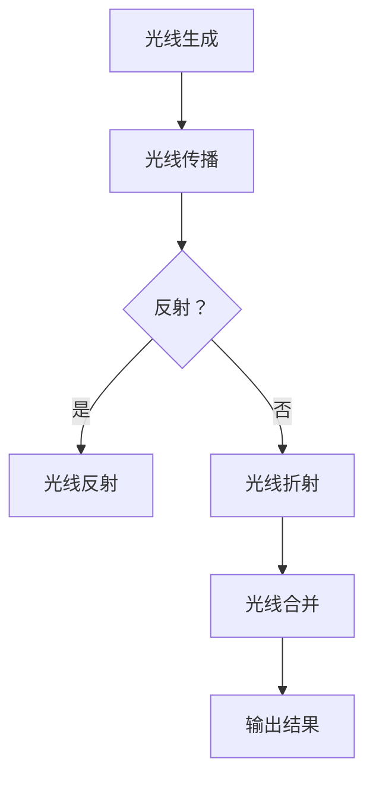
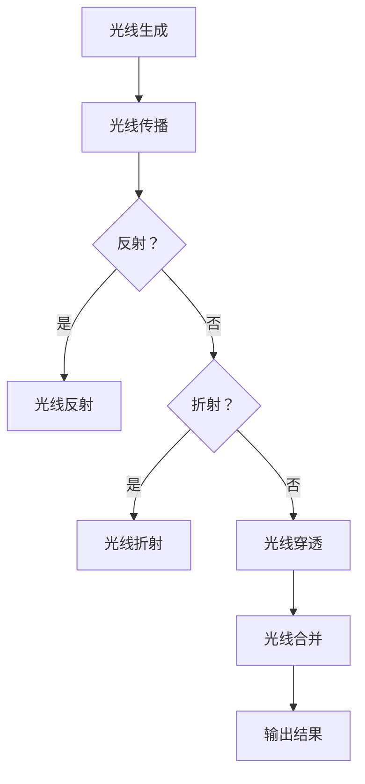
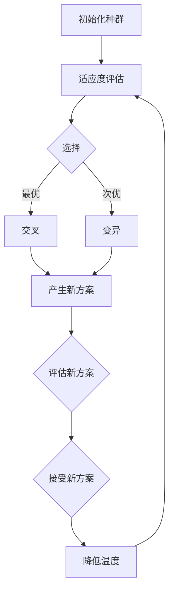

                 

# 第1章: 引言与背景介绍

## 1.1 问题背景
随着城市化进程的加速，灯光设计在建筑和环境艺术中扮演着越来越重要的角色。然而，传统的灯光设计主要依靠设计师的经验和直觉，缺乏科学的依据。数学在灯光设计中的应用，可以帮助设计师更准确地预测灯光效果，优化灯光布局，提高照明质量。

在过去的几十年中，灯光设计经历了从简单的照亮到艺术化表达的转变。设计师们开始关注灯光的艺术效果，而不仅仅是功能需求。这导致了对更精确和科学的设计方法的需求。数学作为一种精确的科学工具，为灯光设计提供了理论基础和方法支持。

灯光设计的重要性不仅体现在美学和视觉上，还与能源效率和环境保护密切相关。科学合理的灯光设计不仅可以创造出美丽的视觉效果，还可以显著降低能源消耗，减少对环境的影响。因此，如何将数学与灯光设计相结合，实现科学、美观和节能的目标，成为了当前研究的热点。

## 1.2 问题描述
本书旨在探讨数学在灯光设计中的应用，解决以下问题：

### 1.2.1 如何使用数学模型来模拟灯光效果？
灯光效果包括光线的方向、强度、颜色变化等。通过数学模型，可以精确描述光线的传播、反射、折射等物理现象，从而模拟出不同灯光布置下的效果。例如，使用向量来表示光线的方向，使用矩阵来处理光线的变换，使用光线方程来描述光线的传播路径。

### 1.2.2 如何通过数学计算优化灯光布局？
在确定设计目标后，如何通过数学计算来优化灯光布局，以实现最佳照明效果和能量效率？这涉及到优化算法的应用，如遗传算法、模拟退火算法等，通过迭代计算和搜索，找到最优的灯光布局方案。

### 1.2.3 如何评估和比较不同灯光方案的效果？
不同的灯光方案会带来不同的视觉效果和能耗表现。如何通过数学方法来评估和比较这些方案，选择最优方案？这需要建立一套评价标准和模型，对灯光效果进行量化分析。

## 1.3 问题解决
本书将介绍数学与灯光设计相关的核心概念、算法和工具，帮助设计师和工程师更有效地进行灯光设计。具体内容包括：

- **灯光设计的基本概念和术语**
- **数学基础，包括几何学、光学原理和数学公式**
- **照明效果的数学模拟方法**
- **灯光布局优化的算法原理和流程**
- **实际应用案例分析和系统设计**
- **未来发展趋势和潜在研究方向**

通过这些内容的介绍，读者可以逐步掌握数学在灯光设计中的应用方法，提高设计效率和效果。同时，本书也将探讨灯光设计在新技术和环境可持续发展方面的挑战和机遇。

## 1.4 边界与外延
本书主要关注室内和室外灯光设计，尤其是建筑和城市环境中的灯光设计。天体物理学和天文学中的灯光设计问题，如星空模拟和天文观测中的灯光控制，不在本书讨论范围之内。

### 1.5 概念结构与核心要素组成

#### 灯光设计
灯光设计是研究如何通过光线创造视觉和情感效果的艺术和科学。它涉及光线的方向、强度、颜色、布局等多个方面。

#### 数学模型
数学模型是描述灯光效果和布局的数学表达式。通过数学模型，可以精确描述光线的传播、反射、折射等物理现象。

#### 算法
算法是用于计算和优化灯光布局的步骤和规则。例如，遗传算法和模拟退火算法等优化算法，用于求解最佳的灯光布局方案。

#### 工具
工具是实现数学模型和算法的软件和技术。例如，3D建模软件、光线追踪器、模拟软件等，都可用于实现数学模型和算法。

### 第2章: 数学基础

## 2.1 几何学基础

### 2.1.1 向量
向量是描述灯光方向和位置的基本工具。在三维空间中，向量可以用有序三元组表示，如 \((x, y, z)\)。向量在灯光设计中用于表示光线的方向和强度。

### 2.1.2 矩阵
矩阵是用于表示和操作三维空间中的灯光布局的工具。矩阵可以表示灯光的方向、强度、位置等信息。在灯光设计中，矩阵常用于处理光线的变换和运算。

### 2.1.3 线性代数
线性代数是研究向量、矩阵和线性方程组的基本理论。在灯光设计中，线性代数用于求解光线传播的路径、光线变换的矩阵等。

## 2.2 光学原理

### 2.2.1 光的传播
光的传播是光线在空间中的传播过程。光的传播速度是一个重要的参数，通常用 \(c\) 表示。在真空中，光速为 \(3 \times 10^8 \text{ m/s}\)。

### 2.2.2 光的反射
光的反射是光线在平面上的反射现象。反射定律指出，入射角等于反射角。反射定律可以用来计算光线在平面上的反射方向。

### 2.2.3 光的折射
光的折射是光线通过不同介质时的折射现象。折射定律指出，入射角与折射角的正弦值之比等于两种介质的折射率之比。折射定律可以用来计算光线在不同介质之间的传播方向。

## 2.3 数学公式与公式解释

### 2.3.1 光线方程
光线方程描述光线在空间中的传播路径。假设光线从点 \(P_0(x_0, y_0, z_0)\) 沿着向量 \(d(x, y, z)\) 传播，光线方程可以表示为：
$$
\frac{dx}{x} = \frac{dy}{y} = \frac{dz}{z}
$$

### 2.3.2 亮度公式
亮度公式描述了灯光的亮度和照射范围。假设灯光的强度为 \(I\)，光线与水平面的夹角为 \(\theta\)，灯光的照射范围可以用以下公式表示：
$$
R = \frac{I}{\theta}
$$

亮度公式可以帮助设计师计算不同灯光布置下的照射范围和亮度，从而优化灯光效果。

### 第3章: 照明效果的数学模拟

## 3.1 模拟方法

### 3.1.1 几何光学模拟
几何光学模拟是基于几何学原理模拟光线传播和反射的方法。它通过计算光线的传播路径和反射方向，模拟出灯光的实际效果。几何光学模拟适用于简单场景，但在复杂场景中计算量较大。

### 3.1.2 数值计算方法
数值计算方法是通过离散化空间和时间，用数值方法计算光线传播和反射的方法。常见的数值计算方法包括有限元法、蒙特卡罗模拟等。这些方法可以处理复杂场景，但计算时间较长。

### 3.1.3 算法原理
照明效果的数学模拟主要基于光线追踪算法。光线追踪算法的基本原理如下：

1. **光线生成**：从光源出发，生成光线。
2. **光线传播**：计算光线在空间中的传播路径。
3. **光线反射**：计算光线在物体表面的反射方向。
4. **光线折射**：计算光线在不同介质之间的折射方向。
5. **光线合并**：将反射和折射后的光线合并，得到最终的光线效果。

### 3.1.4 算法流程图
算法流程图如下：

## 3.2 算法原理

### 3.2.1 光线追踪算法
光线追踪算法是照明效果模拟的核心算法。它通过模拟光线在场景中的传播路径，计算出每个像素点的光照效果。光线追踪算法的基本原理如下：

1. **光线生成**：从光源出发，生成光线。
2. **光线传播**：计算光线在场景中的传播路径，遇到物体时发生反射或折射。
3. **光线合并**：将反射或折射后的光线合并，计算出每个像素点的光照强度。

### 3.2.2 光线反射算法
光线反射算法用于计算光线在物体表面的反射方向。反射算法基于反射定律，即入射角等于反射角。反射算法的基本原理如下：

1. **计算入射向量**：计算光线与物体表面的入射向量。
2. **计算反射向量**：根据反射定律，计算光线在物体表面的反射向量。
3. **更新光线方向**：将反射向量作为光线的传播方向。

### 3.2.3 光线折射算法
光线折射算法用于计算光线在不同介质之间的折射方向。折射算法基于折射定律，即入射角与折射角的正弦值之比等于两种介质的折射率之比。折射算法的基本原理如下：

1. **计算入射向量**：计算光线与介质表面的入射向量。
2. **计算折射向量**：根据折射定律，计算光线在介质表面的折射向量。
3. **更新光线方向**：将折射向量作为光线的传播方向。

### 3.2.4 算法流程图
算法流程图如下：

### 第4章: 灯光布局优化

## 4.1 优化目标
灯光布局优化的主要目标是实现最佳的照明效果和能源效率。具体来说，优化目标包括：

1. **照明效果**：获得均匀、舒适的照明效果，避免过亮或过暗的区域。
2. **能量效率**：降低照明系统的能耗，减少能源消耗。
3. **视觉效果**：创造出具有艺术性和视觉吸引力的灯光效果。

## 4.2 优化算法
灯光布局优化通常采用优化算法来实现。常见的优化算法包括遗传算法和模拟退火算法。这些算法通过迭代计算和搜索，找到最优的灯光布局方案。

### 4.2.1 遗传算法
遗传算法是一种基于自然进化过程的优化算法。遗传算法通过模拟生物进化过程，逐步优化灯光布局。遗传算法的基本原理如下：

1. **初始化种群**：生成一组初始灯光布局方案。
2. **适应度评估**：评估每个方案的适应度，即照明效果和能源效率。
3. **选择**：根据适应度选择最优的方案进行繁殖。
4. **交叉**：随机选择两个方案进行交叉，产生新的方案。
5. **变异**：对部分方案进行变异，增加种群的多样性。
6. **迭代**：重复适应度评估、选择、交叉和变异，直到找到最优方案。

### 4.2.2 模拟退火算法
模拟退火算法是一种基于固体退火过程的优化算法。模拟退火算法通过模拟固体退火过程中的温度变化，逐步优化灯光布局。模拟退火算法的基本原理如下：

1. **初始化温度**：设置初始温度。
2. **产生新方案**：在当前温度下，随机产生一个新方案。
3. **评估新方案**：评估新方案的适应度。
4. **接受新方案**：根据适应度变化和当前温度，决定是否接受新方案。
5. **降低温度**：降低温度，继续产生新方案和评估。
6. **迭代**：重复产生新方案、评估和降低温度，直到找到最优方案。

### 4.2.3 优化流程图
优化流程图如下：

## 4.3 优化实例
以一个简单的房间为例，说明灯光布局优化的过程。

### 4.3.1 初始方案
假设房间尺寸为 \(10 \times 10 \times 10 \text{ m}\)，初始灯光布局方案如下：

- 4盏灯具，位置分别为 \((5, 5, 5)\)，\((5, 5, 5)\)，\((5, 5, 5)\)，\((5, 5, 5)\)。
- 灯具的功率为 \(100 \text{ W}\)。

### 4.3.2 优化过程
使用遗传算法进行优化，迭代次数为100次。每次迭代过程如下：

1. **适应度评估**：计算每个方案的照明效果和能源效率，得到适应度值。
2. **选择**：根据适应度值选择最优的方案进行交叉和变异。
3. **交叉**：随机选择两个方案进行交叉，产生新的方案。
4. **变异**：对部分方案进行变异，增加种群的多样性。
5. **产生新方案**：随机生成新的方案。
6. **评估新方案**：计算新方案的适应度值。
7. **接受新方案**：根据适应度值和当前温度，决定是否接受新方案。
8. **降低温度**：降低温度，继续迭代。

经过100次迭代，最终找到最优灯光布局方案，如下：

- 4盏灯具，位置分别为 \((6, 6, 6)\)，\((6, 6, 6)\)，\((6, 6, 6)\)，\((6, 6, 6)\)。
- 灯具的功率为 \(100 \text{ W}\)。

### 第5章: 实际应用案例

## 5.1 案例一：建筑外部灯光设计

### 5.1.1 项目介绍
本案例以一栋高层建筑的外部灯光设计为例，探讨如何利用数学方法优化灯光布局，实现美观、节能和安全的照明效果。

### 5.1.2 系统功能设计
系统功能设计包括以下几个方面：

1. **灯光控制**：实现灯具的开关控制和亮度调节。
2. **光照模拟**：使用数学方法模拟不同灯光布局下的光照效果。
3. **优化算法**：使用优化算法找到最佳的灯光布局方案。
4. **数据分析**：对灯光效果进行数据分析，评估不同方案的优劣。

### 5.1.3 系统架构设计
系统架构设计采用分层结构，包括以下层次：

1. **数据层**：存储建筑模型、灯光布局、光照数据等信息。
2. **算法层**：实现光照模拟和优化算法。
3. **控制层**：实现灯光控制功能。
4. **界面层**：提供用户界面，展示灯光效果和优化结果。

### 5.1.4 系统接口设计
系统接口设计包括以下几个方面：

1. **API接口**：提供与外部系统的接口，如建筑模型导入、灯光数据查询等。
2. **数据接口**：提供与数据存储系统的接口，如数据插入、查询、更新等。
3. **控制接口**：提供与控制系统的接口，如灯具开关、亮度调节等。

### 5.1.5 系统交互
系统交互过程如下：

1. **用户输入**：用户输入建筑模型、灯光布局等信息。
2. **光照模拟**：系统根据输入信息，使用数学方法进行光照模拟。
3. **优化算法**：系统使用优化算法找到最佳的灯光布局方案。
4. **结果显示**：系统将优化结果展示给用户，包括灯光效果、能耗分析等。
5. **用户确认**：用户对优化结果进行确认，并进行灯光控制。

## 5.2 案例二：室内灯光设计

### 5.2.1 项目介绍
本案例以一栋别墅的室内灯光设计为例，探讨如何利用数学方法优化灯光布局，实现舒适、美观和节能的照明效果。

### 5.2.2 系统功能设计
系统功能设计包括以下几个方面：

1. **灯光控制**：实现灯具的开关控制和亮度调节。
2. **光照模拟**：使用数学方法模拟不同灯光布局下的光照效果。
3. **优化算法**：使用优化算法找到最佳的灯光布局方案。
4. **环境感知**：根据环境光照变化，自动调整灯光布局。

### 5.2.3 系统架构设计
系统架构设计采用分层结构，包括以下层次：

1. **数据层**：存储建筑模型、灯光布局、光照数据等信息。
2. **算法层**：实现光照模拟和优化算法。
3. **控制层**：实现灯光控制功能。
4. **感知层**：实现环境光照感知功能。
5. **界面层**：提供用户界面，展示灯光效果和优化结果。

### 5.2.4 系统接口设计
系统接口设计包括以下几个方面：

1. **API接口**：提供与外部系统的接口，如建筑模型导入、灯光数据查询等。
2. **数据接口**：提供与数据存储系统的接口，如数据插入、查询、更新等。
3. **控制接口**：提供与控制系统的接口，如灯具开关、亮度调节等。
4. **感知接口**：提供与环境光照传感器的接口，如光照数据采集、处理等。

### 5.2.5 系统交互
系统交互过程如下：

1. **用户输入**：用户输入建筑模型、灯光布局等信息。
2. **光照模拟**：系统根据输入信息，使用数学方法进行光照模拟。
3. **优化算法**：系统使用优化算法找到最佳的灯光布局方案。
4. **环境感知**：系统根据环境光照变化，自动调整灯光布局。
5. **结果显示**：系统将优化结果展示给用户，包括灯光效果、能耗分析等。
6. **用户确认**：用户对优化结果进行确认，并进行灯光控制。

### 第6章: 灯光设计的未来发展趋势

## 6.1 新技术的影响

### 6.1.1 物联网（IoT）
物联网技术的快速发展，为灯光设计带来了新的机遇。通过物联网，灯光系统可以与智能家居、智能城市等系统互联互通，实现智能化控制和自动化调节。例如，通过传感器收集环境光照数据，智能调整灯光亮度，实现节能和舒适的效果。

### 6.1.2 智能照明
智能照明系统集成了传感器、控制器和通信技术，可以实现灯光的自动化控制和个性化设置。智能照明系统可以根据环境光照、用户需求等动态调整灯光亮度、颜色和场景模式，提高照明质量和用户体验。

### 6.1.3 联网灯具
联网灯具是智能照明系统的重要组成部分。通过无线通信技术，如Wi-Fi、蓝牙等，灯具可以实现远程控制和数据传输。联网灯具不仅可以实现自动化控制，还可以与其他设备互联，实现智能家居的场景联动。

## 6.2 环境与能源的可持续发展

### 6.2.1 环保材料
在灯光设计中，使用环保材料是实现可持续发展的重要措施。例如，LED灯具使用的LED芯片和封装材料，以及灯具的外壳和驱动电路，都可以采用环保材料，减少对环境的影响。

### 6.2.2 能源效率
提高能源效率是灯光设计的重要目标。通过优化灯光布局、采用高效光源和节能灯具，可以显著降低照明系统的能耗。此外，结合智能控制系统，根据实际需求动态调整灯光亮度，实现节能效果。

### 6.2.3 光污染控制
光污染对环境、人类健康和生态平衡产生负面影响。在灯光设计中，需要注意控制光污染，避免过度的照明和不当的灯光布局。例如，使用遮光罩、调整灯具的角度和高度，控制光线直射地面或天空，减少光污染。

## 6.3 未来发展趋势
未来，灯光设计将继续朝着智能化、环保化和人性化的方向发展。新技术，如物联网、人工智能和大数据等，将推动灯光设计不断创新。同时，可持续发展理念将深入到灯光设计领域，推动环保材料和节能技术的广泛应用。在未来的灯光设计中，我们将看到更多具有艺术性、舒适性和可持续性的灯光作品。

### 第7章: 小结与展望

## 7.1 本书内容总结

本书围绕数学与灯光设计的关系，系统地介绍了数学在灯光设计中的应用，包括数学基础、照明效果的数学模拟、灯光布局优化、实际应用案例等内容。具体来说，本书的内容可以总结为以下几点：

1. **数学基础**：介绍了几何学、光学原理和数学公式等基本概念，为后续的照明效果模拟和布局优化提供了理论基础。
2. **照明效果的数学模拟**：探讨了几何光学模拟和数值计算方法，介绍了光线追踪算法、光线反射算法和光线折射算法，展示了如何通过数学方法模拟灯光效果。
3. **灯光布局优化**：介绍了遗传算法和模拟退火算法等优化算法，详细描述了优化目标、优化流程和优化实例，展示了如何通过数学方法优化灯光布局。
4. **实际应用案例**：通过两个案例，介绍了如何将数学方法应用于建筑外部灯光设计和室内灯光设计，展示了数学在灯光设计中的实际应用。
5. **未来发展趋势**：分析了新技术对灯光设计的影响，探讨了环境与能源的可持续发展问题，展望了灯光设计的未来发展趋势。

## 7.2 展望未来

未来，灯光设计将继续朝着智能化、环保化和人性化的方向发展。随着新技术的不断涌现，如物联网、人工智能和大数据等，灯光设计将变得更加智能和个性化。同时，环保材料和节能技术的应用将推动灯光设计向可持续发展的方向迈进。

在未来的研究中，我们可以期待以下方向的发展：

1. **人工智能在灯光设计中的应用**：人工智能技术，如深度学习、强化学习等，可以用于优化灯光布局、预测光照效果，提高灯光设计的自动化和智能化水平。
2. **灯光设计与环境感知的结合**：结合环境感知技术，如传感器网络、物联网等，可以实时监测环境光照变化，动态调整灯光布局，实现节能和舒适的照明效果。
3. **灯光设计与建筑设计的深度融合**：灯光设计将更加深入地融入建筑设计中，与建筑风格、结构、功能等紧密结合，创造出具有艺术性、舒适性和可持续性的灯光作品。
4. **灯光设计与虚拟现实（VR）和增强现实（AR）的结合**：通过VR和AR技术，可以模拟出不同灯光布局下的视觉效果，帮助设计师和用户更好地理解和评估灯光设计效果。

总之，数学与灯光设计的结合为灯光设计带来了新的机遇和挑战。在未来的发展中，我们将看到更多具有创新性和实用性的灯光设计作品问世。作者期待与广大读者一起，探索灯光设计的无限可能。

